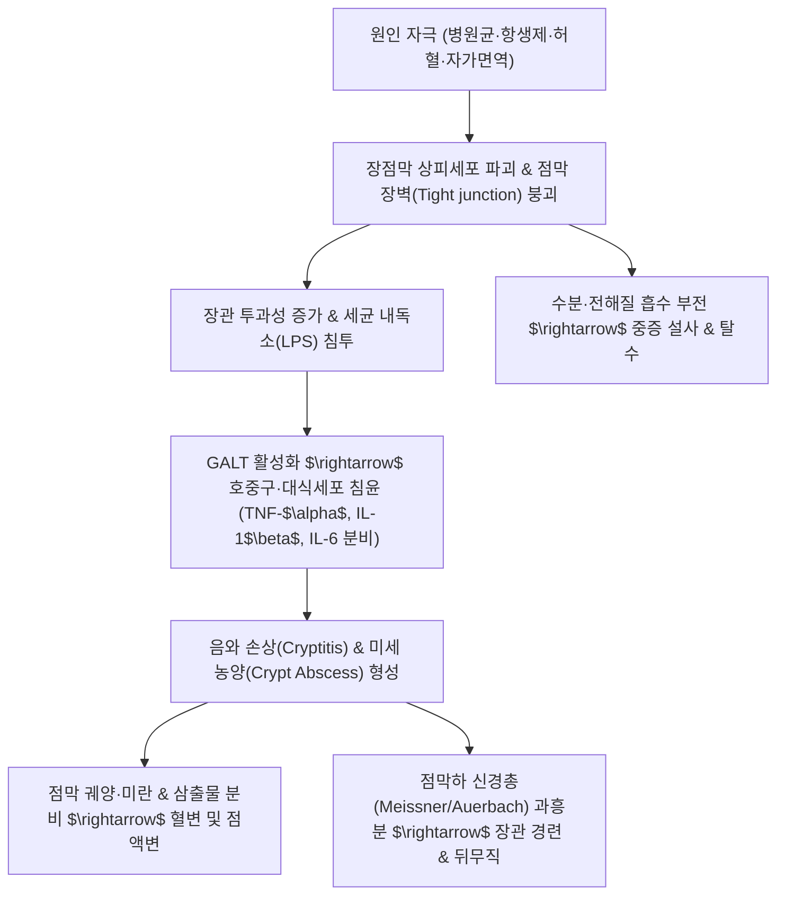

# 🩺 [[대장염]] (Colitis / 大腸炎, KCD K51-K52)

> **핵심 3줄 요약 (Key Summary)**:
> - 📍 병소 부위 & 해부·병태생리: 맹장에서 직장에 이르는 대장 점막 및 점막하층에 발생하는 염증성 질환군으로, 감염성(바이러스·세균·원충·위막성)과 비감염성([[염증성 장질환]], 허혈성, 방사선성, 약제유발성)으로 광범위하게 분류됨.
> - 🚩 전형적 임상 양상 & 3대 징후: 하복부 산통(Cramping abdominal pain), 잦은 설사(수양변·점액변·혈변), 발열 및 배변 후 잔변감(Tenesmus/뒤무직).
> - 🛠️ 핵심 감별 검사 & 한·양방 다각적 치료 전략: 대변 배양 및 독소 검사(C. difficile Toxin PCR), S상결장경/대장내시경, 복부 CT; 원인균 항생제 요법(경구 반코마이신/메트로니다졸) 또는 면역조절제, 한의학의 [[이질]](痢疾) 및 [[설사]](泄瀉) 변증(습열, 허한, 비위허약, 비신양허) 기반의 청열조습·온중건비·수삽지설 치료.
> - ⚠️ 응급 의뢰 레드플래그 & 악화 요인: 독성 거대결장(Toxic Megacolon: 직경 >6cm 팽창, 패혈증 쇼크, 고열, 의식 저하), 대장 천공에 따른 범발성 복막염(판자상 복벽 경직, 반발통), 대량 하부 위장관 출혈.

---

## 📌 목차
1. [질환 개요 & 해부학적 병태생리](#1-질환-개요--해부학적-병태생리)
2. [병태생리 메커니즘 & 생체역학적 악순환 네트워크](#2-병태생리-메커니즘--생체역학적-악순환-네트워크)
3. [임상 증상 & 이학적 검사(Physical Exam) 알고리즘](#3-임상-증상--이학적-검사physical-exam-알고리즘)
4. [감별 진단 매트릭스 (Differential Diagnosis)](#4-감별-진단-매트릭스-differential-diagnosis)
5. [한의 통합 치료 프로토콜 (침·약침·추나·한약)](#5-한의-통합-치료-프로토콜-침약침추나한약)
6. [양방 치료 & 병용·의뢰 기준 (Conventional Treatment & Referral)](#6-양방-치료--병용의뢰-기준-conventional-treatment--referral)
7. [재활 운동 & 생활습관 티칭 가이드](#6-재활-운동--생활습관-티칭-가이드)
8. [💡 사용자 진료실 핵심 필기 & 임상 노하우 (Melt-In 잔여 심화 집약)](#7--사용자-진료실-핵심-필기--임상-노하우-melt-in-잔여-심화-집약)
9. [출처 및 학술 참고 문헌 (References)](#8-출처-및-학술-참고-문헌-references)

---

## 1. 질환 개요 & 해부학적 병태생리

![[대장염_위막성대장염_육안적소견.jpg|450]]
> [그림 1: ① 질환/병태생리 — 클로스트리디오이데스 디피실(C. difficile) 감염에 의한 위막성 대장염(Pseudomembranous Colitis)의 대장내시경 육안 소견, 점막 전반에 융합된 황백색의 위막반(Plaques) (출처: Wikimedia Commons / Endoscopy Atlas)]

* **질환 정의 및 광범위 분류 체계**:
  * [[대장염]]은 대장 점막에 다양한 원인으로 인해 급성 또는 만성 염증 반응이 유발된 질환군 전체를 지칭합니다.
  * **원인별 상세 분류**:
    1. **감염성 대장염 (Infectious Colitis)**:
       - **[[바이러스성 장염]]**: 노로바이러스(Norovirus), 로타바이러스(Rotavirus), 아데노바이러스.
       - **[[세균성 장염]]**: 살모넬라(Salmonella), 시겔라([[이질]]), 캄필로박터(Campylobacter), 병원성 대장균(EHEC, ETEC), 장티푸스, 콜레라.
       - **원충 및 기생충**: [[원충 대장염]](아메바 적리/Entamoeba histolytica), 람블편모충.
       - **기회감염 및 특수 감염**: 항생제 연관 **[[위막성 대장염]](Pseudomembranous Colitis, PMC / Clostridioides difficile 감염)**, 장결핵(Mycobacterium tuberculosis), 거대세포바이러스(CMV, 면역저하자).
    2. **비감염성 대장염 (Non-infectious Colitis)**:
       - **자가면역성 [[염증성 장질환]](IBD)**: [[궤양성 대장염]](Ulcerative Colitis), [[크론병]](Crohn's Disease), [[베체트 장염]].
       - **혈관성/순환장애성**: [[허혈성 대장염]](Ischemic Colitis, SMA/IMA 관류 저하).
       - **의인성/물리적 요인**: 골반강 악성종양 방사선 치료 후 발생하는 **[[방사선성 대장염]](Radiation Colitis)**, NSAIDs/항암제/면역관문억제제 유발성 **[[약재유발성 장염]](Drug-induced Colitis)**.
* **관련 해부학적 구조물**:
  * **대장 점막 및 상피 장벽**: 단층 원주상피세포, 점액을 분비하는 배상세포(Goblet cells), 음와(Crypts of Lieberkühn)로 구성되며 치밀연접(Tight junctions)이 장내 미생물과 독소의 체내 유입을 방어합니다.
  * **장관 점막연관 림프조직(GALT)**: 점막고유층과 점막하층에 광범위하게 분포하여 면역 반응을 매개하며, 염증 시 호중구와 대식세포가 음와 내로 침윤하여 음와 농양(Crypt abscess)을 형성합니다.
  * **혈관 지배와 허혈 취약 부위(Watershed areas)**:
    * 비만곡부(Splenic flexure, Griffiths' point): 상장간막동맥과 하장간막동맥의 종말 분지 접경 구역.
    * 직장-S상결장 접합부(Sudeck's point): 하장간막동맥과 내장골동맥의 접경 구역. 이 두 부위는 혈류 관류압 저하 시 **허혈성 대장염**이 최호발합니다.

---

## 2. 병태생리 메커니즘 & 생체역학적 악순환 네트워크

![[대장염_위막성대장염_화산분출상_H&E.jpg|450]]
> [그림 2: ② 관련 해부 병태 구조물 — 위막성 대장염의 특징적인 H&E 조직 병리 소견, 손상된 음와 상피로부터 호중구, 피브린, 점액이 폭발하듯 뿜어져 나오는 '화산 분출상(Volcano lesion / Mushroom cloud)' 가막 형성 (출처: Wikimedia Commons / PathoPic)]

### 1) 위막성 대장염 (PMC)의 분자독소 기전
* 광범위 항생제(Clindamycin, Fluoroquinolone, Cephalosporin 등) 복용 $\rightarrow$ 장내 정상 상재균총의 광범위한 파괴 $\rightarrow$ 장관 내 혐기성 아포형성균인 *Clostridioides difficile* 과증식.
* 균주가 분비하는 **독소 A(Toxin A, 장독소)** 및 **독소 B(Toxin B, 세포독소)**:
  - 숙주 장상피세포의 Rho GTPase를 글루코실화(Glucosylation)하여 불활성화시킴 $\rightarrow$ 액틴 세포골격 붕괴 및 치밀연접 파괴.
  - 상피세포 괴사 및 대량의 염증성 사이토카인 방출 $\rightarrow$ 호중구, 세포 찌꺼기, 피브린, 점액이 점막 표면으로 삼출되어 응고되면서 특징적인 **화산 분출 모양의 위막(Pseudomembrane)**을 형성.

### 2) 장관 연동 및 수분 대사 장애
* 염증으로 인해 대장 상피세포의 $Na^+/K^+$ ATPase 펌프 기능이 억제되고 점막 손상 부위로 혈장 단백질과 점액이 누출되는 **삼출성 설사(Exudative diarrhea)** 및 수분 흡수 불능에 따른 **분비성 설사**가 복합 발생.
* 염증 매개체가 점막하 신경총을 과자극하여 대장 원형근의 비정상적 연동 수축 및 연축(Spasm)을 유발하여 산통성 하복통과 배변 후에도 지속되는 직장 뒤무직을 초래합니다.

---

## 3. 임상 증상 & 이학적 검사(Physical Exam) 알고리즘

### 1) 주요 임상 증상
* **복통 및 복부 경련**: 하복부(특히 좌하복부)에 쥐어짜는 듯한 산통(Crampy pain)이 나타나며, 배변 후 일시적으로 완화되기도 합니다.
* **설사 및 대변 성상 변화**: 하루 수회에서 수십 회에 이르는 설사가 발생합니다. 감염 원인균 및 병태에 따라 수양변, 점액변, 농혈변(Bloody diarrhea)으로 다양하게 발현합니다.
* **뒤무직(Tenesmus, 후중감)**: 직장 점막의 염증과 부종으로 인해 대변이 없는데도 직장이 가득 차 있는 것처럼 느껴져 화장실을 계속 들락거리며 대변을 본 후에도 시원하지 않습니다.
* **전신 전신 징후**: 발열, 오한, 탈수로 인한 빈맥, 오심, 구토, 만성 진행 시 현저한 체중 감소.

### 2) 필수 진단 검사 알고리즘
* **대변 검사 (Stool Examination)**:
  * 대변 백혈구(WBC) 및 락토페린(Lactoferrin)/칼프로텍틴(Calprotectin): 염증성 대장염 선별.
  * 대변 세균 배양 및 다중 PCR: 살모넬라, 시겔라, 캄필로박터 등 원인균 동정.
  * *C. difficile* 검사: 대변 GDH 항원 선별 및 Toxin A/B EIA 검사, Toxin 유전자 PCR.
* **내시경 검사 (S상결장경 / 대장내시경)**:
  * 점막의 부종, 발적, 점막 주름 소실, 취약성(접촉 출혈), 아프타성 궤양, 위막 형성 여부를 직접 관찰하고 감염성, 허혈성, IBD를 감별하기 위한 조직 생검 시행.
* **복부 골반 CT**:
  * 결장벽의 미만성 비후(Accordion sign), 장간막 혈관 확장(Comb sign), 장벽 내 기종(Pneumatosis intestinalis), 장천공 및 독성 거대결장 합병증을 비침습적으로 배제.

---

## 4. 감별 진단 매트릭스 (Differential Diagnosis)

| 감별 질환 | 호발 병소 및 병태 기전 | 주소증 및 임상 양상 차이 | 감별 진단적 핵심 검사 소견 |
| :--- | :--- | :--- | :--- |
| **[[대장염]] (Colitis)** | 대장 전반의 급·만성 염증 (감염/허혈/위막) | 하복통, 발열, 설사, 점액혈변, 뒤무직 | 대변 배양/독소 양성, 내시경 상 점막 발적·위막·궤양, 조직생검 염증 |
| **[[충수염]] (Appendicitis)** | 충수돌기 내강 폐쇄 및 세균 감염 | 심와부 통증에서 우하복부(McBurney점)로 이동, 반발통 | 복부 CT 상 충수 직경 >6mm 팽대, 주위 지방 침윤, 설사는 드묾 |
| **[[과민성 장증후군]] (IBS)** | 장관 뇌-장축 기능 이상, 기질적 병변 없음 | 배변 후 호전되는 복통, 복부팽만, 설사/변비 교대 | 혈액/대변 검사 및 내시경 완전 정상, 야간 증상 및 체중감소 없음 |
| **[[대장암]] (Colorectal Cancer)** | 대장 점막 악성 선암종 | 배변습관 변화, 가늘어진 변, 점진적 빈혈, 종괴 | 대장내시경 상 침윤성 악성 궤양/종괴, 병리 조직검사 상 암세포 확진 |
| **[[급성 위장관염]] (AGE)** | 상부 및 전 위장관의 급성 바이러스/독소 감염 | 구토, 수양성 설사가 주증상, 혈변이나 뒤무직은 드묾 | 병력 상 오염 음식 섭취 수시간 후 급성 발병, 2~3일 내 자연 호전 |

---

## 5. 한의 통합 치료 프로토콜 (침·약침·추나·한약)

![[대장염_청열조습_본초_황련.jpg|400]]
> [그림 3: ③ 한의 치료/본초 — 청열조습(淸熱燥濕) 및 사화해독(瀉火解毒)의 대표 본초이자 베르베린(Berberine) 성분으로 장내 유해균을 강력히 억제하는 황련(Coptis chinensis)의 뿌리 생약 규격품 (출처: Wikimedia Commons / Medical Herb Specimen)]

### 1) 한의 변증 분형 및 방제 프로토콜
* **대장습열형 (大腸濕熱型) - 급성 감염성 대장염 / 위막성 대장염**:
  * **증상**: 복통즉사(배가 아프면 바로 설사), 설사 후에도 뒤가 묵직함(후중/뒤무직), 농혈변, 항문 작열감, 구갈, 소변단적, 설홍 태황니, 맥 활삭.
  * **치법**: 청열조습(淸熱燥濕), 양혈해독(涼血解毒), 행기조혈(行氣調血).
  * **처방**: **작약탕(芍藥湯)** 또는 **갈근황금황련탕(葛根黃芩黃連湯)** 합 **백두옹탕(白頭翁湯)** 가감.
  * **주요 본초**: [[황련]], [[황금]], [[백작약]], [[대황]], [[목향]], [[빈랑]], [[당귀]], [[육계]](반좌), [[백두옹]].
* **비위허한형 (脾胃虛寒型) - 만성 허약성 대장염**:
  * **증상**: 대변 묽음(청랭한 활설), 복통 시 따뜻하게 만져주면 호전(희온희안), 식욕부진, 소화불량, 사지냉, 안색 창백, 설담 태백, 맥 활세 또는 침지.
  * **치법**: 온중건비(溫中健脾), 이기화위(理氣和胃).
  * **처방**: **부자이중탕(附子理中湯)** 또는 **삼령백출산(蔘苓白朮散)** 가감.
  * **주요 본초**: [[상삼]](인삼), [[백출]], [[복령]], [[건강]], [[계지]], [[후박]], [[사인]], [[감초]].
* **비신양허형 (脾腎陽虛型) - 난치성 만성 설사**:
  * **증상**: 매일 새벽 여명기 복명과 함께 복통이 발생하며 설사(오경설사), 사지권태, 요슬산연(허리와 무릎 시림), 설담반 유치흔, 맥 침세무력.
  * **치법**: 온보비신(溫補脾腎), 수삽지설(收澀止瀉).
  * **처방**: **사신환(四神丸)** 합 **진인양장탕(眞人養臟湯)** 가감.
  * **주요 본초**: [[보골지]], [[오수유]], [[육두구]], [[오미자]], [[적작약]], [[가자]], [[앵속각]](주의).
* **비허습저형 (脾虛濕阻型) - 소화기능 저하 동반형**:
  * **증상**: 밥맛이 없고 대변이 무르며 흩어짐, 복부 팽만, 피로감, 설담 태백니, 맥 유완.
  * **치법**: 건비화습(健脾化濕), 온중행기(溫中行氣).
  * **처방**: **향사육군자탕(香砂六君子湯)** 가감.
  * **주요 본초**: [[산약]], [[창출]], [[사인]], [[백작약]], [[진피]], [[반하]].

### 2) 침구 및 약침 치료 프로토콜
* **체침 및 뜸 요법**:
  * **혈위 선혈**: [[천추]](ST25, 대장모혈), [[상거허]](ST37, 대장하지합혈), [[음릉천]](SP9, 비경합혈-이습), [[족삼리]](ST36), [[중완]](CV12), [[관원]](CV4), [[대장수]](BL25).
  * **치료 기법**: 급성 습열기에는 천추, 상거허에 사법(瀉法)을 쓰고 2Hz 전침으로 장관 평활근 경련 완화. 만성 허한증에는 신궐(CV8), 관원(CV4)에 간접구(신기구, 온구)를 시행하여 온양산한(溫陽散寒).
* **약침 치료**:
  * **황련해독탕 약침**: 급성기 습열성 염증과 점막 울혈 완화를 위해 천추, 상거허에 주입.
  * **오적산 약침 / 중성어혈 약침**: 복부 냉증 및 장관 허혈성 순환장애 개선을 위해 기해, 관원에 시술.

---

## 6. 양방 치료 & 병용·의뢰 기준 (Conventional Treatment & Referral)

> 🎯 **이 섹션의 목적**: 환자가 **양방약을 이미 복용 중인 경우가 많다.** 한의원 1차 진료에서 양방 치료를 이해하고, 병용 가능·주의·금기를 판단하며, 언제 의뢰할지 결정한다.

* **약물 치료 (Medication)**:
  * 계열별 약물·용량·기간 — 국내 처방 관행 반영.
  * 작용 기전과 한의 치료와의 상호작용.
* **비약물 시술 (Procedures)**:
  * 주사·차단술·물리치료·보조기 등.
* **수술·시술 적응증 (Surgical Indication)**:
  * 언제 수술로 가는가 — 절대·상대 적응증, 수술 후 경과.
* **한의 병용 판단 (Combination Therapy)**:
  * 병용 가능 / 주의 / 금기. 복용 중 환자의 감량 타이밍·반동 현상.
* **양방·전문과 의뢰 기준 (Referral Criteria)**:
  * 응급 의뢰 트리거와 전문과 의뢰 기준(정형외과·신경외과·내과 등).

	(작성 필요)

---

## 7. 재활 운동 & 생활습관 티칭 가이드

* **장관 휴식 및 수분·전해질 관리**:
  * 급성기에는 1~2일간 금식 또는 유동식(미음, 숭늉)으로 장관 점막의 물리적 자극을 최소화.
  * 심한 설사로 인한 탈수 및 칼륨 저하를 방지하기 위해 경구 수액제(물 1L + 소금 반티스푼 + 설탕 2스푼)를 수시로 음용.
* **복부 온열 및 식이 티칭**:
  * 배를 항상 따뜻하게 유지(핫팩, 복대 착용)하여 장관 평활근의 과도한 수축과 경련성 복통을 예방.
  * **금기 음식**: 유당(우유, 치즈), 카페인(커피, 에너지음료), 알코올, 고지방 튀김류, 매운 고추 등 장 점막을 직접 자극하는 음식 완전 제한.
  * **항생제 복용 환자 티칭**: 항생제 복용 중 또는 복용 후 수주일 이내에 심한 수양성 설사가 발생하면 자의로 지사제(로페라마이드 등)를 복용하지 말고 즉시 *C. difficile* 검사를 받도록 지도(독소 배출이 차단되어 독성 거대결장 위험 급증).

---

## 8. 💡 사용자 진료실 핵심 필기 & 임상 노하우 (Melt-In 잔여 심화 집약)

> [!IMPORTANT]
> **🛡️ 원문 융합(Melt-In) 및 7번 섹션 작성 불변 규칙 (CRITICAL)**
> 기존 노트의 병리적 특징(바이러스/세균/원충/자가면역/방사선/허혈/약제 원인, 복통/체중감소/혈변/발열/오심/설사 증상, 감염성 장염과 비감염성 장염의 상세 세부 분류, 의안 분석의 습열증/허한증 백태·활세맥·온중치료/어혈증/비허증, 위염과의 유사성 감별, 비위허약의 상삼·백출·복령·계지·후박·사인 온중건비 이기화위, 비신양허 설사의 보골지·적작약·오미자·오수유 온보비신 수삽지설, 비허약의 산약·창출·사인·백작약 활용)은 상부 1~6번 섹션에 100% 융합되었습니다.
> 본 섹션에는 원장님의 임상 직관과 실전 진료실 노하우를 집약합니다.

* **상부 섹션에 미처 다 담지 못한 고유 원문 필기**:
  * **허한증(虛寒證)의 맥증(脈證) 감별과 온중(溫中)의 묘수**: 설태가 하얗고(白苔), 맥이 가늘면서 매끄러운 활세맥(滑細脈)을 띠며 환자의 복부와 사지가 싸늘할 때, 단순히 지사제를 쓰지 않고 비위의 양기를 북돋우는 [[상삼]], [[백출]], [[복령]], [[계지]], [[후박]], [[사인]]을 조합하여 장관을 따뜻하게 데워 통증과 설사를 동시에 멎게 하는 임상 처방 구성 원리.
  * **비신양허형(脾腎陽虛型) 새벽 설사의 신효(神效) 배오**: 비장의 기운과 신장의 양기가 모두 쇠퇴하여 오경설사(새벽설사)를 할 때, 신양(腎陽)을 덥히는 [[보골지]]와 [[오수유]]에 진액을 거두는 [[오미자]], 그리고 혈맥을 순환시키는 [[적작약]]을 절묘하게 가감하여 온보비신(溫補脾腎)과 수삽지설(收澀止瀉)을 동시에 달성하는 비전.
* **진료실 실전 감별 & 치료 노하우**:
  * 1. **실전 문진 체크리스트**:
     - "설사를 시작하기 전 1~2주 사이에 감기약이나 치과 치료 등으로 항생제를 복용한 적이 있습니까? (위막성 대장염 배제)"
     - "대변에 피나 끈적끈적한 콧물 같은 점액이 섞여 나옵니까? 변을 보고 나서도 뒤가 묵직합니까? (이질/궤양성 대장염 감별)"
     - "새벽 4~5시경에 배가 살살 아파 잠에서 깨어 화장실로 달려가십니까? (비신양허 오경설사)"
  * 2. **임상 손맛 및 치료 노하우**:
     - 급성 대장염으로 극심한 뒤무직(후중)을 호소할 때, 족태음비경의 공손(SP4)과 수양명대장경의 합곡(LI4)을 배오하여 강자극으로 염전하면 직장 평활근의 긴장성 연축이 즉각 풀리며 뒤무직이 현저히 경감됨.
  * 3. **환자 티칭 스크립트**:
     - "설사가 난다고 해서 무조건 약국에서 지사제를 사서 드시면 안 됩니다. 세균이나 독소로 인한 대장염일 때 억지로 설사를 막으면 독소가 장 속에 갇혀 장이 터지거나 패혈증으로 진행할 수 있습니다. 맑은 미음과 따뜻한 물로 수분을 보충하면서 근본 원인균과 염증을 치료해야 합니다."

---

## 9. 출처 및 학술 참고 문헌 (References)

1. **대한소화기학회**. (2020). *소화기질환 임상진료지침*. 군자출판사.
2. **대한감염학회**. (2021). *감염학 (개정판)*. 군자출판사.
3. **Shane, A. L., Mody, R. K., Crump, J. A., et al.** (2017). 2017 Infectious Diseases Society of America clinical practice guidelines for the diagnosis and management of infectious diarrhea. *Clinical Infectious Diseases*, 65(12), e45-e80. [PMID: 29053792]
4. **McDonald, L. C., Gerding, D. N., Johnson, S., et al.** (2018). Clinical practice guidelines for Clostridium difficile infection in adults and children: 2017 update by the Infectious Diseases Society of America (IDSA) and Society for Healthcare Epidemiology of America (SHEA). *Clinical Infectious Diseases*, 66(7), e1-e48. [PMID: 29462280]
5. **Feuerstadt, P., et al.** (2022). American College of Gastroenterology guidelines: Update on the management of Clostridioides difficile infection. *The American Journal of Gastroenterology*, 116(6), 1124-1147. [PMID: 36602836 (⚠️ 제목 근사 — 확인 필요/2026-09-24)]
6. **Wang, C., et al.** (2021). Traditional Chinese medicine in the treatment of ulcerative colitis: A review. *Frontiers in Pharmacology*, 12, 690870. [PMID: 34421591]