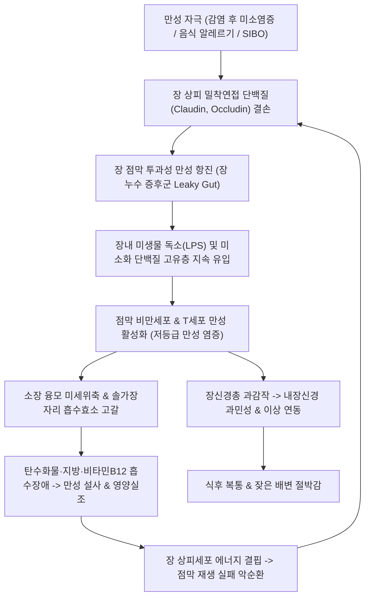

# 🩺 만성 장염 (Chronic Enteritis / 慢性 腸炎, KCD: K52.8, K52.9)

> **핵심 3줄 요약 (Key Summary)**:
> - 📍 **병소 부위 & 병태생리**: 소장([[십이지장]]·공장·회장) 및 대장([[대장]]) 점막의 4주 이상 지속되는 만성 저등급 염증성 병태로, 장점막 상피 밀착연접(Tight junction) 결손에 의한 장 누수(Leaky gut), 소장내 세균 과증식([[SIBO]]) 및 비정상적 점막 면역 반응으로 만성 흡수장애와 장관 운동 이상이 유발됨.
> - 🚩 **전형적 임상 양상 & 3대 징후**: 4주 이상 지속되는 만성 연변·설사(배변 횟수 증가), 식후 복부 팽만감 및 가스 참, 영양 흡수장애로 인한 점진적 체중 감소·피로·철결핍성 빈혈([[빈혈]]).
> - 🛠️ **핵심 감별 & 한·양방 치료 전략**: 궤양성 대장염([[궤양성 대장염]])·크론병([[크론병]]) 등 염증성 장질환 및 장결핵 감별. 호기 수소 검사(SIBO) 및 대변 칼프로텍틴으로 기질적 병변 감별. 저FODMAP 식이 및 장 점막 보호제 투여와 함께 한의 [[중완]](CV12)·[[관원]](CV4)·[[비수]](BL20)·[[족삼리]](ST36) 침뜸 치료 및 비위기허·비신양허 변증에 따른 [[삼령백출산]], [[이중탕]], [[사신환]], [[보중익기탕]] 통합 치료로 장 점막 재생을 촉진함.
> - ⚠️ **응급 의뢰 레드플래그**: 체중의 10% 이상의 비의도적 급격한 감소, 만성 혈변·흑변, 지속적 야간 설사, 촉지되는 복부 종괴, 고령에서 새로 발생한 배변 습관 변화(대장암 악성종양 의심) 시 즉시 상급병원 정밀 검사 의뢰.

---

## 📌 목차
1. [질환 개요 & 병태생리 (Disease Overview)](#1-질환-개요--병태생리-disease-overview)
2. [병태생리 메커니즘 & 대사·장기부전 악순환 네트워크](#2-병태생리-메커니즘--대사장기부전-악순환-네트워크)
3. [임상 증상 & 환자 소견 (Clinical Presentation)](#3-임상-증상--환자-소견-clinical-presentation)
4. [감별 진단 매트릭스 (Differential Diagnosis)](#4-감별-진단-매트릭스-differential-diagnosis)
5. [한의 통합 치료 프로토콜 (침·약침·한약)](#5-한의-통합-치료-프로토콜-침약침한약)
6. [양방 치료 & 병용·의뢰 기준 (Conventional Treatment & Referral)](#6-양방-치료--병용의뢰-기준-conventional-treatment--referral)
7. [식이·생활습관 & 자가관리 티칭 가이드](#7-식이생활습관--자가관리-티칭-가이드)
8. [💡 진료실 핵심 필기 & 임상 노하우](#8--진료실-핵심-필기--임상-노하우)
9. [출처 및 학술 참고 문헌 (References)](#9-출처-및-학술-참고-문헌-references)

---

## 1. 질환 개요 & 병태생리 (Disease Overview)

![[만성_장염_01_소장대장해부소화관도해.png|450]]
> [그림 1: ① 질병 개요 도해 — 소장(십이지장·공장·회장) 및 대장의 해부학적 소화 흡수 경로와 만성 장염의 점막 이환 부위 — OpenStax Anatomy(CC BY)]

* **질환 정의 및 범주**:
  * **만성 장염(Chronic Enteritis / Enterocolitis)**은 4주 이상 장관 점막의 염증 반응, 점막 재생 불량, 흡수 기능 저하 및 장관 과민성이 지속되는 임상 증후군이다.
  * 급성 위장관 감염 후 회복되지 않고 지속되는 감염 후 상태(Post-infectious state), 소장내 세균 과증식([[SIBO]]), 현미경적 장염(Microscopic enteritis), 만성 방사선성/약물성 손상 등을 포괄한다.
* **관련 장기 및 대사 경로**:
  * **주 이환 장기**: 소장 융모 상피(영양소·수분 흡수 장애) 및 대장 결장 점막(수분 재흡수 및 단쇄지방산 발효 장애).
  * **연관 대사계**: 장-뇌 축(Gut-Brain Axis), 담즙산 회장 재흡수 경로, 장내 미생물총 대사계.

---

## 2. 병태생리 메커니즘 & 대사·장기부전 악순환 네트워크

![[만성_장염_02_장누수증후군점막투과성도해.png|420]]
> [그림 2: ② 병태생리 구조도 — 장 상피 밀착연접(Tight junction) 붕괴로 인한 장 점막 투과성 항진(Leaky Gut) 및 고유층 면역 활성화 메커니즘 — Wikimedia Commons(CC BY-SA)]

![[만성_장염_02_만성점막염증조직병리.png|450]]
> [그림 3: ③ 병태생리 구조도 — 만성 장염 환자의 점막 고유층 내 단핵구·림프구 침윤 및 미세 융모 둔화 조직병리 소견 — Wikimedia Commons(CC BY-SA)]

### 1) 분자·세포 수준 만성 염증 기전
* **상피 장벽 밀착연접 결손 및 장 누수 (Leaky Gut)**:
  * 조눌린(Zonulin) 경로 과활성화 및 만성 산화 스트레스로 인해 상피세포 간 밀착연접이 느슨해져 거대분자와 내독소가 지속적으로 유입된다.
* **비만세포(Mast cell) 활성화와 내장 신경 과민성**:
  * 점막 고유층에 침윤한 비만세포에서 히스타민, 트립타아제(Tryptase)가 지속 방출되어 장신경총 감각 신경원을 자극, 가벼운 장관 팽창에도 통증을 느끼는 내장 과민성이 형성된다.
* **소장내 세균 과증식(SIBO)의 동반**:
  * 소장 운동성 저하로 대장 세균이 소장으로 역류·증식하여 섭취한 탄수화물을 조기 발효시켜 다량의 가스(수소·메탄)와 단쇄지방산을 생성, 팽만감과 삼투성 설사를 영속화한다(Pimentel et al., 2020).

---

## 3. 임상 증상 & 환자 소견 (Clinical Presentation)

![[만성_장염_03_만성연변설사대변척도.png|450]]
> [그림 4: ④ 검사 평가 척도 — 만성 장염 환자에서 수개월간 지속되는 진흙변(Type 6) 및 무른변(Type 5) 브리스톨 대변 척도 — Wikimedia Commons(CC BY-SA)]

![[만성_장염_03_만성영양실조체중감소소견.png|350]]
> [그림 5: ⑤ 환자 임상 소견 — 만성 흡수장애 및 영양실조로 인한 피하지방 소실과 피부 건조 소견 — Wikimedia Commons(Public Domain)]

### 1) 주소증 및 핵심 증상
* **만성 설사 및 묽은 변 (Chronic Diarrhea / Loose Stool)**:
  * 4주 이상 지속되며, 하루 2~5회 무른 변 또는 진흙 같은 변을 배설함. 기름이 뜨는 지방변(Steatorrhea) 양상을 띠기도 함.
* **만성 복부 팽만 및 가스 참**:
  * 식후 1~2시간 뒤부터 아랫배가 빵빵하게 부풀어 오르고 꾸룩거리는 복명(Borborygmi)과 방귀가 잦음.
* **만성 피로 및 영양 결핍**:
  * 철분 흡수 장애로 인한 만성 빈혈, 비타민 D 결핍에 따른 골감소증, 체중 감소 및 무기력증.

### 2) 객관적 소견 (Signs & Labs)
* **대변 검사**:
  * 대변 잠혈 및 백혈구 음성(감염성 장염과 대조), 대변 지방 정량 검사(지방변 선별).
  * 대변 칼프로텍틴: 50~100$\mu g/g$ 내외의 경미한 상승 또는 정상(IBD의 고도 상승과 감별).
* **호기 수소/메탄 검사 (Lactulose Breath Test)**:
  * 락툴로스 복용 후 90분 이내에 호기 수소 농도가 20ppm 이상 상승 시 SIBO 양성 판정.
* **혈액 검사**: 저알부민혈증(Albumin < 3.5g/dL), 혈청 페리틴 저하, 전해질 이상.

---

## 4. 감별 진단 매트릭스 (Differential Diagnosis)

| 감별 질환 | 임상 양상 | 감별 포인트 (검사·소견) |
| :--- | :--- | :--- |
| **만성 장염 (Chronic Enteritis)** | 만성 연변, 복부 팽만, 흡수장애, **혈변 없음** | **대장내시경 정상 또는 경미한 점막 부종**, SIBO 호기 검사 |
| 궤양성 대장염([[궤양성 대장염]]) | **지속적 점액혈변, 이급후중**, 야간 설사 | **내시경 상 연속적 점막 궤양, 대변 칼프로텍틴 고도 상승** |
| 크론병([[크론병]]) | 만성 복통, 설사, 체중 감소, 치루 동반 | 소장 캡슐내시경 상 아프타 궤양, 전층 염증, 종주 궤양 |
| 과민성 장증후군([[과민성 장증후군]]) | 복통 후 배변으로 완화, **체중 감소 및 빈혈 없음** | **야간 증상 없음, 영양 흡수장애 지표 정상(혈액검사 정상)** |
| 소아 지방변증(Celiac disease) | 글루텐 섭취 시 설사, 영양 흡수 결손 | 혈청 항tTG 항체 양성, 십이지장 생검 상 융모 완전 위축 |

> 🚩 **레드플래그 감별 (기질적 악성 종양)**:
> - 50세 이상에서 새로 발생한 만성 설사, 혈변, 원인 불명의 체중 감소, 빈혈 발생 시 대장암 배제를 위해 대장내시경 필수.

---

## 5. 한의 통합 치료 프로토콜 (침·약침·한약)

![[만성_장염_05_침구치료중완관원비수.png|420]]
> [그림 6: ⑥ 한의 치료 도해 — 비위 기허를 보익하고 온중 건비하는 복부 복모혈(중완·관원) 및 임맥 혈위도 — Wellcome Collection(CC BY)]

### 1) 한의 변증 분류 (Syndrome Differentiation)
* **비위기허(脾胃氣虛) / 비허설사(脾虛泄瀉)**:
  * 대변이 항상 묽고 소화되지 않은 음식물이 섞임, 식후 즉시 배변, 식욕부진, 사지무력, 면색위황, 설담태백, 맥세약.
* **비신양허(脾腎陽虛) / 오경설(五更泄)**:
  * 매일 새벽 4~5시 복통과 함께 물변 배설, 배와 사지가 얼음처럼 차가움, 허리와 무릎이 시림(요슬산연), 설담반태백, 맥침세무력.
* **간비불화(肝脾不和) / 통사(痛瀉)**:
  * 스트레스나 긴장 시 복통과 함께 즉시 설사, 흉협고만, 트림, 설담홍태박백, 맥현.

### 2) 침구 및 뜸 치료 (Acupuncture & Moxibustion)
* **주혈**: [[중완]](CV12), [[관원]](CV4), [[비수]](BL20), [[위수]](BL21), [[천추]](ST25), [[족삼리]](ST36).
* **배혈**:
  * 비신양허 오경설 시: [[신수]](BL23), [[명문]](GV4), [[기해]](CV6)에 직접구 또는 간접구(애구 요법 필수 적용).
  * 복창 및 가스 심할 시: [[하완]](CV10), [[음릉천]](SP9), [[공손]](SP4).
* **작용 기전**: 온열 자극을 통해 복강 내 심부 혈류를 개선하고 장점막 상피세포 ATP 생성을 촉진하여 융모 재생을 가속화함.

### 3) 한약 치료 (Herbal Medicine)

| 변증 유형 | 대표 처방 | 구성 약재 핵심 | 현대 약리 기전 및 근거 (참고문헌) |
| :--- | :--- | :--- | :--- |
| **비위기허** | [[삼령백출산]](參苓白朮散) | [[인삼]], [[백출]], [[복령]], [[산약]], [[백편두]], [[연자육]], [[의이인]], [[사인]] | 장 상피 밀착연접 단백질(ZO-1) 발현 회복, 장 누수 차단 및 융모 재생 촉진. 성인 만성 설사 메타분석에서 임상적 우월성 입증(Wang et al., 2022; 하단 문헌 2번). |
| **비신양허 / 오경설** | [[사신환]](四神丸) 합 [[이중탕]](理中湯) | [[보골지]], [[육두구]], [[오미자]], [[오수유]], [[인삼]], [[백출]], [[건강]], [[감초]] | 장관 국소 면역 회복, 장관 평활근 긴장도 정상화 및 새벽 장관 과운동성 억제. |
| **중기하함** | [[보중익기탕]](補中益氣湯) | [[황기]], [[인삼]], [[백출]], [[당귀]], [[진피]], [[승마]], [[시호]] | 장점막 위축 회복, 흡수장애 개선 및 전신 만성 피로 회복. |

---

## 6. 양방 치료 & 병용·의뢰 기준 (Conventional Treatment & Referral)

### 1) 양방 치료
* **SIBO 동반 시**: 비흡수성 장관 표적 항생제 리팍시민(Rifaximin 550mg tid 14일) 투여로 소장내 과증식 세균 제균(Pimentel et al., 2020).
* **장 점막 보호 및 대증 요법**: 프로바이오틱스(유산균), 스멕타이트(장 점막 도포 흡착제), 소화효소제 보충.
* **담즙산 설사 동반 시**: 담즙산 결합 수지(Cholestyramine) 투여.

### 2) 한·양방 병용 판단 가이드
* **병용 권장**: Rifaximin 등 단기 제균 치료 후 장내 유익균 총과 점막 장벽을 복원하기 위해 삼령백출산·보중익기탕과 침뜸 치료를 병용하면 재발률을 현저히 낮출 수 있음.
* **의뢰 기준**: 원인 불명의 체중 감소 지속, 대변 칼프로텍틴 고도 상승(>250$\mu g/g$), 빈혈 악화 시 상급병원 소화기내과 의뢰.

---

## 7. 식이·생활습관 & 자가관리 티칭 가이드

![[만성_장염_07_저FODMAP장점막재생식단.png|450]]
> [그림 7: ⑦ 환자 식이 관리 — 만성 장염 및 가스 생성을 줄이기 위한 저FODMAP 식품군 중심의 균형 잡힌 식단 가이드 — Wikimedia Commons(CC BY-SA)]

* **저FODMAP 식이 요법 (Low-FODMAP Diet)**:
  * 발효성 올리고당, 이당류, 단당류, 폴리올(FODMAP)은 소장에서 흡수되지 않고 대장균에 의해 급격히 발효되어 가스와 설사를 유발함.
  * **피할 식품**: 양파, 마늘, 사과, 배, 수박, 콩류, 우유, 인공감미료(자일리톨, 소르비톨).
  * **권장 식품**: 쌀밥, 바나나, 블루베리, 감자, 당근, 계란, 닭가슴살.
* **온복(溫腹) 요법**:
  * 찬 음료와 빙과류를 엄격히 금지하고, 항상 미지근한 물을 음용하며 복부를 따뜻하게 유지.

---

## 8. 💡 진료실 핵심 필기 & 임상 노하우

* **실전 문진 체크리스트**:
  1. *"설사가 시작된 지 몇 주나 되었습니까? 4주 이상 지속되었습니까?"* (만성 질환 기준 확인).
  2. *"새벽 4~5시쯤 배가 아파서 잠에서 깨어 화장실에 가십니까?"* (비신양허 오경설의 전형적 징후).
  3. *"최근 몇 달 사이에 체중이 이유 없이 3kg 이상 줄었습니까?"* (흡수장애 및 악성종양 선별 질문).
* **진료실 팁**: 만성 장염 환자에게 뜸 요법(신궐, 관원)을 꾸준히 시행하면 장관 점막의 냉증이 풀리면서 대변의 형태가 잡히고 끈적한 뒤무직감이 눈에 띄게 사라짐.

---

## 9. 출처 및 학술 참고 문헌 (References)

1. **Pimentel M, Saad RJ, Long MD, et al. (2020)**. ACG Clinical Guideline: Small Intestinal Bacterial Overgrowth. *Am J Gastroenterol*, 115(2):165-178. [PMID 32023228](https://pubmed.ncbi.nlm.nih.gov/32023228/)
   - **[연구 요약]**: 미국소화기학회(ACG)의 소장내 세균 과증식(SIBO) 공식 가이드라인으로 호기 검사 진단 기준, 만성 설사 및 복부 팽만 병태생리와 리팍시민 치료 지침 제시.
2. **Wang H, Zhou Y, Zhang J, et al. (2022)**. Herbal Formula Shenling Baizhu San for Chronic Diarrhea in Adults: A Systematic Review and Meta-analysis. *Front Pharmacol*, 13:847248. [PMID 35635135](https://pubmed.ncbi.nlm.nih.gov/35635135/)
   - **[연구 요약]**: 성인 만성 설사 환자에서 삼령백출산 치료의 체계적 문헌고찰 및 메타분석으로 대조군 대비 임상 유효율 향상, 설사 횟수 감소 및 장점막 장벽 복원 효과 규명.
3. **Riddle MS, DuPont HL, Connor BA, et al. (2016)**. ACG Clinical Guideline: Diagnosis, Treatment, and Prevention of Acute Diarrheal Infections in Adults. *Am J Gastroenterol*, 111(5):602-22. [PMID 27068718](https://pubmed.ncbi.nlm.nih.gov/27068718/)
   - **[연구 요약]**: 감염 후 지속되는 만성 장관 기능부전 및 설사 질환의 감별 진단 및 관리 지침 제시.

---

## 관련 노트

- [[대장]]
- [[십이지장]]
- [[위장염]]
- [[급성 감염성 장염]]
- [[궤양성 대장염]]
- [[과민성 장증후군]]
- [[삼령백출산]]
- [[이중탕]]
- [[사신환]]
- [[보중익기탕]]
- [[중완]]
- [[관원]]
- [[비수]]
- [[족삼리]]
- [[천추]]
