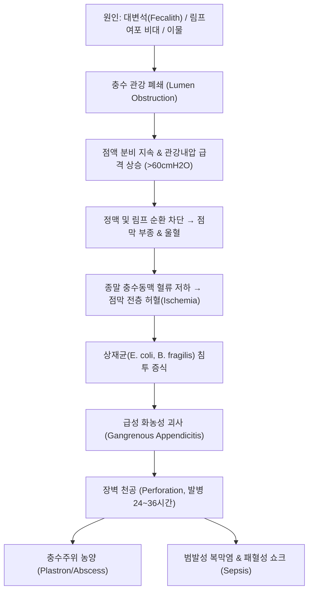

# 🩺 [[맹장염]] (Acute Appendicitis / 盲腸炎, KCD K35 / ICD-10 K35)

> **핵심 3줄 요약 (Key Summary)**:
> - 📍 **병소 부위 & 병태생리**: [[충수돌기]](Vermiform Appendix) 및 [[맹장]](Cecum) 기저부 — 대변석(Fecalith)·림프조직 비대에 의한 관강 폐색 → 점액 저류 및 관강내 압력 상승 → 정맥·림프 울혈 및 허혈 괴사 → 세균 침습 및 급성 화농·천공성 염증.
> - 🚩 **전형적 임상 양상 & 3대 징후**: 심와부/배꼽 주위(상복부) 둔통으로 시작하여 12~24시간 내 **우하복부(RLQ, [[맥버니점]])로 통증 이동 및 국소화**, 맥버니 압통 및 반발통(Rebound Tenderness), 미열·식욕부진·오심.
> - 🛠️ **핵심 감별 & 한·양방 치료 전략**: [[장간막 림프절염]], [[게실염]], 부인과 급성 질환 감별. 조영증강 복부 CT/초음파 확진. 조기 진단 시 응급 복강경 충수절제술(Laparoscopic Appendectomy) 원칙. 초기 한의 1차 진료실에서는 즉시 금식(NPO) 후 외과 응급 전원; 수술 후 장마비·유착 방지 및 장관 회복에 [[대황목단피탕]], [[계지복령환]], 침구 치료 병용.
> - ⚠️ **응급 의뢰 레드플래그**: 통증이 급작스럽게 소실된 직후 전복부로 퍼지는 극심한 반발통 및 판자형 복부 경직(Board-like Rigidity) — 급성 천공(Perforation) 및 범발성 복막염·패혈성 쇼크 징후로 즉시 119 구급 및 외과 응급 수술 필수.

---

## 📌 목차
1. [질환 개요 & 병태생리 (Disease Overview)](#1-질환-개요--병태생리-disease-overview)
2. [병태생리 메커니즘 & 대사·장기부전 악순환 네트워크](#2-병태생리-메커니즘--대사장기부전-악순환-네트워크)
3. [임상 증상 & 환자 소견 (Clinical Presentation)](#3-임상-증상--환자-소견-clinical-presentation)
4. [감별 진단 매트릭스 (Differential Diagnosis)](#4-감별-진단-매트릭스-differential-diagnosis)
5. [한의 통합 치료 프로토콜 (침·약침·한약)](#5-한의-통합-치료-프로토콜-침약침한약)
6. [양방 치료 & 병용·의뢰 기준 (Conventional Treatment & Referral)](#6-양방-치료--병용의뢰-기준-conventional-treatment--referral)
7. [식이·생활습관 & 자가관리 티칭 가이드](#7-식이생활습관--자가관리-티칭-가이드)
8. [💡 진료실 핵심 필기 & 임상 노하우](#8--진료실-핵심-필기--임상-노하우)
9. [출처 및 학술 참고 문헌 (References)](#9-출처-및-학술-참고-문헌-references)

---

## 1. 질환 개요 & 병태생리 (Disease Overview)

![[맹장염_01_충수해부및맹장위치도해.png|450]]
> [그림 1: ① 질환 개요 도해 — 맹장에 붙은 충수(충수돌기)의 위치와 우하복부 발생 부위를 표시한 한국어 도해. 원본 그림 제목 그대로 「급성 충수염의 개념」 — 출처: 질병관리청 국가건강정보포털 「급성충수염」(cntntsSn 4467)]

* **질환 정의 및 명칭 감별**:
  * 임상적으로 흔히 '맹장염'으로 통칭되나, 의학적 정식 명칭은 **급성 충수돌기염(Acute Appendicitis)**이다. [[맹장]](Cecum) 하단 후내측에 위치한 6~9cm 길이의 맹낭관인 [[충수돌기]]의 급성 염증성 질환이다.
  * 연령별로는 10대~20대 청소년 및 청년층에서 가장 높은 발생률을 보이며, 평생 유병률은 남성 약 8.6%, 여성 약 6.7%에 이르는 외과적 응급 복통의 최빈 원인이다.
* **관련 장기 및 해부학적 연결성**:
  * **주 이환 장기**: [[충수돌기]](Vermiform Appendix), [[맹장]](Cecum), [[회맹판]](Ileocecal Valve).
  * **혈관계 및 림프계**: 충수동맥(Appendicular Artery) — 회결장동맥의 종말 분지로서 측부 순환(Collateral circulation)이 결여된 종말 동맥(End artery) 구조를 가지므로 관강내 내압 상승 시 급격한 허혈성 괴사가 유발된다.
  * **신경 지배**: 내장성 통증 섬유는 T10 척수 분절(교감신경총)을 통해 심와부 및 배꼽 주변 전이통을 유발하며, 염증이 벽측 복막(Parietal Peritoneum)에 도달하면 체성신경(Somatic nerve) 자극으로 [[맥버니점]](McBurney's Point)에 통증이 국소화된다.

---

## 2. 병태생리 메커니즘 & 대사·장기부전 악순환 네트워크

![[맹장염_02_충수폐색및괴사천공기전.png|450]]
> [그림 2: ② 병태생리 도해 — 어떤 원인에 의해 충수돌기가 막힘 → 세균증식·독성물질 분비 → 점막손상·궤양형성 → 괴사·천공의 4단계 진행을 그린 한국어 도해. 원본 그림 제목 그대로 「급성 충수염의 발생기전」 — 출처: 질병관리청 국가건강정보포털 「급성충수염」(cntntsSn 4467)]

![[맹장염_02_복부CT충수종대및지방침윤.png|450]]
> [그림 3: ③ 영상의학적 소견 — 복부 CT 축상면에서 종대된 충수돌기와 충수 주위 지방 침윤이 보이는 소견 (2026-10-06 실물 확인) — 출처: 미기록(볼트 내 기존 조달분으로 추적 불가)]

![[맹장염_02_화농성충수염육안표본.png|450]]
> [그림 4: ③ 육안 병리 소견 — 절제한 충수를 갈라 놓은 육안 표본. 점막 전층의 발적·괴사와 화농성 삼출이 보이는 화농성 충수염 소견 (2026-10-06 실물 확인) — 출처: 미기록(볼트 내 기존 조달분으로 추적 불가)]

### 1) 분자·세포 수준 기전
* **폐쇄 및 내압 상승**: 단단한 분석(대변석, Fecalith) 또는 바이러스 감염 후 점막하 림프여포 증식으로 충수 관강의 입구가 막힌다. 관강이 폐쇄된 상태에서도 점막 상피는 매일 점액을 지속 분비하므로 관강내 압력이 정상 5~10 mmHg에서 50~60 mmHg 이상으로 급상승한다.
* **허혈성 점막 파괴**: 내압 상승이 정맥압을 초과하면 정맥 울혈과 조직 부종이 시작되고, 이어 모세혈관 관류가 중단된다. 산소 공급이 중단된 상피세포는 급격히 괴사하고, 점막 점액 방어벽이 무너진다.
* **세균성 침윤과 괴저**: 관강 내 혐기성균([[Bacteroides fragilis]]) 및 호기성 그람음성균([[대장균]])이 파괴된 점막을 뚫고 장벽 전층으로 침습하여 다핵호중구(PMN)의 대량 침윤과 급성 화농(Suppuration)을 일으키며, 조직 자가용해로 인해 괴저성 충수염(Gangrenous appendicitis)으로 진행한다.

### 2) 장기·계통 수준 결과
* **장벽 천공 및 복강 파급**: 관강 폐쇄 후 24~36시간 내에 약 15~30%에서 미세 천공이 발생한다.
* 대망(Omentum)과 인접 장간막이 충수를 둘러싸면 국소 충수 주위 농양(Periappendiceal abscess)을 형성하지만, 격리되지 못하면 세균성 장액이 복강 전체로 유출되어 급성 범발성 복막염(Generalized peritonitis) 및 복강내 패혈증으로 전신 장기부전(MOF)을 초래한다.

---

## 3. 임상 증상 & 환자 소견 (Clinical Presentation)

![[맹장염_03_맥버니점압통및반발통이학적검사.png|420]]
> [그림 5: ④ 이학적 검사 — 우측 전상장골극과 배꼽을 연결한 가상선의 바깥쪽 1/3 지점을 표시한 한국어 도해. 원본 그림 제목 그대로 「맥버니 포인트(McBurney's point)」 — 출처: 질병관리청 국가건강정보포털 「급성충수염」(cntntsSn 4467)]

> ⚠️ **이미지 미확보 (2026-10-06)** — 이 슬롯('복막 자극 징후 평가 알고리즘')에 들어 있던 그림은 **절제 충수의 육안 표본 사진**이어서 슬롯 성격(도해)과 맞지 않았습니다.
> 내용이 타당한 표본 사진은 **§2 육안 병리 소견(그림 4)** 으로 이동 배치했고, 알고리즘은 확보 실패 → 아래 이학적 검사 항목과 표로 서술합니다.

### 1) 주소증 및 핵심 증상
* **전형적 통증 전이 (Classic Visceral-to-Somatic Migration)**:
  * 초기(발병 0~12시간): 둔탁하고 애매한 심와부(Epigastrium) 또는 배꼽 주위(Periumbilical) 통증, 식욕부진(Anorexia, 거의 100% 동반), 경미한 오심 및 구토.
  * 진행기(발병 12~24시간): 통증이 **우하복부(RLQ, [[맥버니점]])로 명확히 이동하여 국소화**되며, 기침·보행·자세 변화 시 통증이 극심해지는 체성 복막통 양상으로 전환.
* **소화기 및 전신 증상**:
  * 식욕 완전 상실("식사 생각이 전혀 없다"), 구토(통증 발생 후 나타나며, 구토가 통증보다 먼저 시작되면 위장관염 가능성 높음), 미열(37.5~38.0℃). 고열(>38.5℃)은 이미 천공되었음을 시사.

### 2) 객관적 신체 소견 (Physical Signs)
* **맥버니 압통 (McBurney's Sign)**: 우측 전상장골극(ASIS)과 배꼽을 잇는 가상선에서 외측 1/3 지점을 압박했을 때 뚜렷한 국소 압통.
* **반발 압통 (Blumberg's Sign / Rebound Tenderness)**: 맥버니점을 서서히 깊게 눌렀다가 손을 갑자기 뗄 때 환자가 비명을 지르는 극심한 반발통 (벽측 복막 염증의 확증적 징후).
* **로브싱 징후 (Rovsing's Sign)**: 좌하복부(LLQ)를 깊게 압박할 때 대장 내 가스가 역류하여 충수 부위인 우하복부에 통증이 유발되는 소견.
* **장요근 징후 (Psoas Sign)**: 환자를 좌측으로 눕히고 우측 대퇴부를 후방으로 신전(Extension)시킬 때 통증 악화 (후맹장성 충수염 시 요근 자극 소견).
* **폐쇄근 징후 (Obturator Sign)**: 우측 고관절과 슬관절을 90도 굴곡한 상태에서 대퇴를 내회전(Internal rotation)시킬 때 골반강 통증 유발 (골반형 충수염 소견).

### 3) 임상 진단 척도: 알바라도 점수 (Alvarado Score / MANTRELS)

| 평가 항목 (MANTRELS) | 세부 소견 | 배점 |
| :--- | :--- | :---: |
| **M**igration of pain | 통증의 우하복부 이동 | 1 |
| **A**norexia | 식욕부진 | 1 |
| **N**ausea/Vomiting | 오심 또는 구토 | 1 |
| **T**enderness in RLQ | **우하복부 국소 압통** | **2** |
| **R**ebound tenderness | 반발 압통 (Rebound) | 1 |
| **E**levation of temperature | 발열 (≥ 37.3℃) | 1 |
| **L**eukocytosis | **백혈구 증가증 (WBC > 10,000/μL)** | **2** |
| **S**hift to the left | 호중구 좌방이동 (Neutrophil > 75%) | 1 |
| **총점** | **판정 기준: 1~4점(배제/경과관찰), 5~6점(충수염 의심·CT 권고), 7~10점(충수염 확진·수술 의뢰)** | **10** |

---

## 4. 감별 진단 매트릭스 (Differential Diagnosis)

| 감별 질환 | 특징적 양상 | 감별 포인트 (검사·수치) |
| :--- | :--- | :--- |
| **[[맹장염]] (본 질환)** | 심와부→우하복부 통증 이동, 맥버니 압통/반발통, 식욕부진 | 복부 CT: 충수 직경 >6mm, 관벽 비후, 주변 지방 침윤 |
| [[급성 위장염]] | 설사/구토가 복통보다 선행하거나 우세, 미만성 복통 | 맥버니 국소 압통 부재, 반발통 음성, 대변 세균/바이러스 검사 |
| [[장간막 림프절염]] | 소아·청소년 호발, 상기도 감염 병력 선행, 통증 부위 유동적 | 초음파상 충수는 정상이면서 3개 이상 종대된 림프절(>8mm) 관찰 |
| [[우측 결장 게실염]] | 고령층 호발, 통증의 전이 없이 처음부터 우하복통 | 복부 CT상 맹장/상행결장 외벽 돌출 게실 및 주변 연부조직 염증 |
| [[자궁외 임신 파열]] | 가임기 여성, 무월경 병력, 질 출혈 동반, 급격한 저혈압 | 임신반응검사(Urine hCG / Serum β-hCG) 양성, 질식 초음파 |
| [[난소 낭종 염전]] | 갑작스러운 칼로 베는 듯한 편측 골반 격통, 체위 변화 연관 | 골반 도플러 초음파상 난소 혈류 소실 및 난소 종괴 |
| [[요로결석]] | 측복부에서 서혜부/외음부로 방사되는 산통, 배뇨통 | 혈뇨(Microscopic hematuria), 반발통 없음, 복부 CT 결석 |

---

## 5. 한의 통합 치료 프로토콜 (침·약침·한약)

![[맹장염_05_하지족부경락경혈도.png|450]]
> [그림 6: ⑥ 한의 혈위 도해 — 하지·족부의 경락과 경혈을 그린 고전 침구 도판(足部總圖·足內側圖·足外側圖). 난미혈(阑尾穴)·족삼리(ST36)·상거허(ST37) 등 하퇴부 혈위 위치 판독용 — 출처: Wikimedia Commons, File:Acu-moxa chart; Channels and acupoints of the leg and foot, Wellcome L0037972 (CC BY 4.0)]

> ⚠️ **한의 1차 진료실 원칙**: 급성 충수염 의심 시(Alvarado ≥ 5점) **단독 치료를 시도해서는 안 되며, 즉시 금식(NPO) 후 외과로 전원**해야 한다. 한의 치료는 **수술 후 장폐색/유착 예방기, 또는 수술이 불가능한 특수 환경의 보조 치료**로 적용한다.

* **변증 분류**:
  * **어체기체형(瘀滯氣滯型)**: 발병 초기, 복통이 국소화되며 장관 기혈이 정체된 상태.
  * **습열어독형(濕熱瘀毒型)**: 복통 극심, 발열, 오심, 맥활삭, 설홍태황후(화농기).
  * **열독궤통형(熱毒潰痛型)**: 복벽 강직, 고열, 복막염 진행기(응급 수술 적응증).
* **침구 치료 (Acupuncture)**:
  * **특효혈**: [[난미혈]](闌尾穴, 족삼리 하 2촌) — 충수 질환의 진단점이자 급성 염증성 장관 통증 완화 반응점.
  * **주혈**: [[족삼리]](ST36), [[상거허]](ST37, 대장하합혈), [[천추]](ST25, 대장모혈), [[합곡]](LI4).
  * **자침 수기법**: 사법(瀉法) 적용, 강자극 유침 20~30분. 전침 2~4Hz 연속파를 적용하여 장관 허혈성 연축 및 신경성 통증 완화.
* **한약 치료 (Herbal Medicine)**:
  * **수술 전 보조 또는 천공 없는 초기 경증(급성 장옹 초기)**:
    * **[[대황목단피탕]](大黃牡丹皮湯)**: 대황, 목단피, 도인, 동과자, 망초 — 통부사열(通腑瀉熱), 활혈화어(活血化瘀). 장내 세균 독소 배출 및 충수 관강 부종 완화.
    * **[[패장산]](敗醬散) 합 의이인부자패장산**: 배농소옹(排膿消癰), 해독.
  * **충수절제술 후 회복기 (Post-operative Recovery)**:
    * **[[대건중탕]](大建中湯)**: 수술 후 장마비(Paralytic ileus), 복부 팽만, 장 연동운동 부전 개선에 탁월한 근거(Xu et al., 2023).
    * **[[계지복령환]](桂枝茯苓丸)**: 복강내 미세혈전 용해, 잔여 어혈 흡수 및 수술 후 조직 유착(Adhesion) 방지.

---

## 6. 양방 치료 & 병용·의뢰 기준 (Conventional Treatment & Referral)

![[맹장염_06_복강경충수절제술시야.png|450]]
> [그림 7: ⑧ 수술 소견 — 복강경 화면. 맹장·충수돌기와 주변 복막이 보이는 실제 수술 시야 (2026-10-06 실물 확인) — 출처: 미기록(볼트 내 기존 조달분으로 추적 불가)]

* **수술 치료 (Surgical Treatment - 표준 골격)**:
  * **복강경 충수절제술 (Laparoscopic Appendectomy)**: 급성 충수염의 표준 치료. 3개의 투관침을 이용해 충수 간막과 기저부를 결찰 후 절제. 개복술에 비해 통증이 적고 입원 기간(1~2일)이 짧으며 창상 감염률이 낮음.
  * **보존적 항생제 단독 치료**: 최근 비천공성 충수염에서 광범위 항생제(Ceftriaxone + Metronidazole 또는 Quinolone) 요법이 시도되나, 1년 내 재발률이 약 25~30%에 달하므로 수술 고위험군이 아닌 한 수술이 1차 권고됨.
* **약물 치료 (Medications)**:
  * 정맥 항생제: 2/3세대 세팔로스포린 + 메트로니다졸(혐기성균 커버).
  * 수액 요법: 탈수 및 전해질 불균형 교정을 위한 생리식염수/하트만액 정주.
* **한의 1차 진료실 금기 및 주의사항**:
  * ❌ **진통제 투여 금지**: 급성 복통 환자에게 원인 규명 전 진통제(NSAIDs, 아편유사제, 진통 한약)를 무분별하게 투여하면 복막 자극 징후가 가려져 천공 진단을 지연시킴.
  * ❌ **하제 및 온찜질 금지**: 대황·망초 등 강력한 사하제를 환자 상태 확인 없이 다량 투여하거나 복부에 온열 팩을 적용하면 관강내압 상승과 장관 충혈로 천공을 촉진할 수 있음.
* **응급 의뢰 기준 (Emergency Referral Criteria)**:
  * 알바라도 점수 ≥ 5점 또는 맥버니 압통 + 반발통 확인 시 즉시 외과/응급실 전원.
  * 발열(>38.0℃) 동반, 복부 근육 강직(Guarding/Rigidity), 백혈구 수치 > 12,000/μL.

---

## 7. 식이·생활습관 & 자가관리 티칭 가이드

> ⚠️ **이미지 미확보 (2026-10-06)** — 이 슬롯에 들어 있던 그림은 **복강경 수술 시야**여서, 내용이 맞는 **§6 수술 소견(그림 7)** 으로 이동 배치했습니다.
> 식이·생활 관리 가이드 이미지는 확보 실패로 비웁니다. 아래 텍스트로 서술합니다.

* **급성 발병 시 환자 교육 (즉시 조치)**:
  * **절대 금식 (Strict NPO)**: 물, 음료, 죽, 약물 일체의 섭취를 중단시킨다. 전신마취 수술 시 음식물 역류로 인한 흡인성 폐렴을 방지하고 장관 연동자극을 최소화하기 위함이다.
  * **절대 안정 및 냉찜질**: 통증 부위를 세게 누르거나 비비지 말고, 무릎을 가볍게 구부린 자세(Fowler's position)로 복벽 긴장을 완화하며 응급실로 이동하도록 지도한다.
* **수술 후 회복기 식이 및 일상 관리**:
  * **단계적 식이상승**: 가스 배출(Flatus) 확인 후 미음 → 죽 → 연식 순서로 진행.
  * **유착 방지 보행**: 수술 다음 날부터 조기 보행(Early ambulation)을 시행하여 장관 유착을 예방한다.
  * **복압 상승 방지**: 수술 후 4~6주간 무거운 물건 들기, 심한 복근 운동, 배변 시 과도한 힘주기를 금한다.

---

## 8. 💡 진료실 핵심 필기 & 임상 노하우

* **비오님 임상 포인트: "통증 전이의 시간표를 물어라"**:
  * 맹장염 의심 환자가 내원했을 때 가장 먼저 확인할 것은 "지금 아픈 곳이 처음부터 아팠는가, 아니면 윗배나 배꼽 주변에서 시작해 내려왔는가?"이다. 통증 이동(Migration)의 병력은 충수염 진단의 가장 강력한 단서이다.
* **난미혈(闌尾穴)의 양면적 가치**:
  * 우측 족삼리 하방 2촌 부위의 난미혈을 엄지로 강하게 압박했을 때 찌릿한 격통이나 압통이 나타나면 충수염 가능성이 매우 높다. 이는 침 치료점일 뿐 아니라 훌륭한 신체 검사 보조점으로 활용된다.
* **노인 및 소아의 비전형적 발현 주의**:
  * 노인은 복벽 근육이 위축되어 전형적인 복부 강직이나 고열이 나타나지 않고, 애매한 복부 팽만과 무기력으로 내원하여 이미 천공성 복막염으로 악화된 경우가 흔하므로 의심 지수를 극도로 높여야 한다.

---

## 9. 출처 및 학술 참고 문헌 (References)

- **Park JH et al. (2025)**. Diagnostic Accuracy of Point-of-Care Ultrasound POCUS for Suspected Acute Appendicitis in Pediatric and Adult Emergency Departments A Systematic Review and Meta-Analysis. *Ann Emerg Med*. [PMID 41841098](https://pubmed.ncbi.nlm.nih.gov/41841098/)

- **Xu Z, Jin L, Wu W. (2023)**. Clinical efficacy and safety of endoscopic retrograde appendicitis treatment for acute appendicitis A systematic review and meta-analysis. *Clin Res Hepatol Gastroenterol*. [PMID 37925019](https://pubmed.ncbi.nlm.nih.gov/37925019/)

- **AlAli MN et al. (2023)**. Is Appendiceal Diverticulitis Mimicking Acute Appendicitis? *Cureus*. [PMID 38283468](https://pubmed.ncbi.nlm.nih.gov/38283468/)
