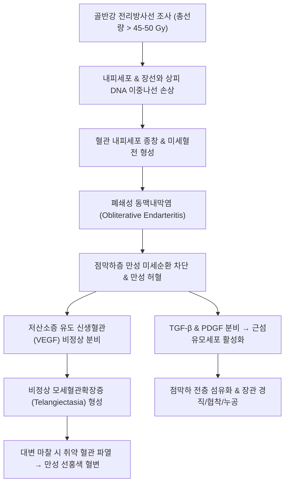

# 🩺 [[방사선성 대장염]] (Radiation Proctocolitis & Enteropathy / 放射線性大腸炎, KCD K52.0 / ICD-10 K52.0)

> **핵심 3줄 요약 (Key Summary)**:
> - 📍 **병소 부위 & 병태생리**: [[직장]](Rectum), [[S상결장]](Sigmoid Colon) 및 골반강 내 [[회장]](Ileum) — 골반부 악성종양(자궁경부암·전립선암·직장암) 방사선 치료 후 **폐쇄성 미세동맥내막염(Obliterative Endarteritis)** 유발 → 점막하 만성 허혈 및 세포외기질 과다 섬유화(Fibrosis) → 취약한 신생 모세혈관확장증(Telangiectasia) 형성 및 만성 직장 출혈.
> - 🚩 **전형적 임상 양상 & 3대 징후**: 방사선 치료 종료 수개월~수년 후 발생하는 **통증 없는 무통성 선홍색 직장 출혈(Hematochezia)**, 배변 후 잔변감 및 뒤무직([[후중감]], Tenesmus), 점액성 설사 및 배변 횟수 증가.
> - 🛠️ **핵심 감별 & 한·양방 치료 전략**: [[궤양성 대장염]], [[허혈성 대장염]], 국소 직장암 재발 감별. 내시경 소견상 점막 위축 및 다발성 모세혈관확장증 확인. 양방에서는 아르곤 플라즈마 응고술(APC), 수크랄페이트 관장, 고압산소치료(HBOT) 시행; 한의에서는 비신양허·기혈어체 변증에 따라 [[생맥산]], [[보중익기탕]], [[황토탕]] 및 승산·백회·장강 침구 치료로 미세순환 개선 및 점막 재생 촉진.
> - ⚠️ **응급 의뢰 레드플래그**: 장관 전층 괴사로 인한 대량 직장 출혈(혈압 저하 및 실신), 급성 장 천공(Perforation)에 의한 복막염, 골반강 내 직장질누공(Rectovaginal Fistula) 형성 시 즉시 소화기내과 및 외과 응급 전원.

---

## 📌 목차
1. [질환 개요 & 병태생리 (Disease Overview)](#1-질환-개요--병태생리-disease-overview)
2. [병태생리 메커니즘 & 대사·장기부전 악순환 네트워크](#2-병태생리-메커니즘--대사장기부전-악순환-네트워크)
3. [임상 증상 & 환자 소견 (Clinical Presentation)](#3-임상-증상--환자-소견-clinical-presentation)
4. [감별 진단 매트릭스 (Differential Diagnosis)](#4-감별-진단-매트릭스-differential-diagnosis)
5. [한의 통합 치료 프로토콜 (침·약침·한약)](#5-한의-통합-치료-프로토콜-침약침한약)
6. [양방 치료 & 병용·의뢰 기준 (Conventional Treatment & Referral)](#6-양방-치료--병용의뢰-기준-conventional-treatment--referral)
7. [식이·생활습관 & 자가관리 티칭 가이드](#7-식이생활습관--자가관리-티칭-가이드)
8. [💡 진료실 핵심 필기 & 임상 노하우](#8--진료실-핵심-필기--임상-노하우)
9. [출처 및 학술 참고 문헌 (References)](#9-출처-및-학술-참고-문헌-references)

---

## 1. 질환 개요 & 병태생리 (Disease Overview)

![[방사선성_대장염_01_골반강방사선조사영역도해.png|450]]
> [그림 1: ① 질환 개요 도해 — 골반부 방사선 치료 시 직장 및 S상결장에 조사되는 방사선 피폭 영역과 해부학적 인접도 — Wikimedia Commons (CC BY-SA 4.0)]

![[방사선성_대장염_01_직장염주요원인.jpg|450]]
> [그림 1-B: ① 질환 개요 — 직장염의 주요 원인(세균성·원충성·염증성 장질환·방사선 치료) — 출처: 질병관리청 국가건강정보포털 「직장염」]

* **질환 정의 및 임상 분류**:
  * 골반부 및 복부 악성종양(자궁경부암, 전립선암, 직장암, 방광암 등) 치료 목적으로 시행된 체외 방사선 치료(EBRT) 또는 근접치료(Brachytherapy) 후 장관 상피세포 및 미세혈관이 비가역적 손상을 입어 발생하는 만성 의원성 장질환이다.
  * **급성 방사선 장염(Acute Radiation Enteropathy)**: 방사선 치료 중 또는 직후(수일~수주 내) 발생하며, 급속히 분열하는 장점막 상피세포의 일시적 사멸로 인한 점막염(Mucositis)이 주원인이다. 대부분 치료 종료 수주 내 자연 호전된다.
  * **만성 방사선 직장염/대장염(Chronic Radiation Proctitis/Colitis)**: 치료 종료 후 3개월~수년(평균 8~12개월) 이상 경과한 뒤 발생하며, 비가역적인 **혈관 내피세포 증식 및 폐쇄성 동맥내막염, 조직 섬유화**가 특징인 진행성 난치성 질환이다.
* **관련 장기 및 호발 부위**:
  * **주 이환 장기**: [[직장]](Rectum, 골반강 가장 후방에 위치하여 전립선/자궁경부 치료 시 방사선 선량이 가장 집중됨), [[S상결장]](Sigmoid Colon), 골반강 내로 처진 말단 [[회장]](Terminal Ileum).
  * **역학적 특성**: 골반 방사선 치료를 받은 환자의 약 5~20%에서 만성 직장염 증상이 발생하며, 총 방사선 조사 선량이 45~50 Gy를 초과할 때 발생 위험이 급격히 증가한다.

---

## 2. 병태생리 메커니즘 & 대사·장기부전 악순환 네트워크

![[방사선성_대장염_02_직장점막조직병리_HE.jpg|450]]
> [그림 2: ② 조직 병리 — 방사선 직장염의 점막 조직 소견(H&E): 음와 위축·점막하 섬유화·모세혈관 확장 — 출처: Wikimedia Commons — File:Radiation proctitis -- low mag.jpg]

![[방사선성_대장염_02_대장내시경모세혈관확장소견.png|450]]
> [그림 3: ③ 내시경 소견 — 직장 점막의 모세혈관확장증(Telangiectasia) 및 출혈성 병변, 아르곤 플라즈마 응고술(APC) 시야 — 출처: Wikimedia Commons — File:Radiation proctitis APC.jpg]

### 1) 분자·세포 수준 기전
* **폐쇄성 동맥내막염(Obliterative Endarteritis)**: 방사선은 점막하 미세동맥 및 모세혈관의 내피세포를 지속적으로 손상시킨다. 손상된 내피세포는 만성 증식과 섬유소 침착을 일으켜 혈관벽이 두꺼워지고 내경이 좁아지며 결국 혈전으로 폐쇄된다.
* **만성 조직 허혈 및 모세혈관확장증(Telangiectasia)**: 미세혈관이 폐색되면서 장점막 조직은 영구적인 산소 결핍(Hypoxia) 상태에 빠진다. 조직 허혈에 반응하여 신생혈관 촉진 인자인 VEGF가 과분비되지만, 정상 모세혈관망 대신 매우 얇고 지지조직이 결여된 불규칙한 혈관류인 **모세혈관확장증(Telangiectasia)**이 점막 표면에 무리 지어 형성된다. 이 혈관들은 가벼운 기계적 마찰(배변)에도 쉽게 터져 출혈을 반복한다.
* **진행성 섬유화(Progressive Fibrosis)**: 허혈 조직 내 대식세포와 혈소판에서 전환성장인자-베타([[TGF-beta]]) 및 혈소판유래성장인자(PDGF)가 지속적으로 유리되어 근섬유모세포를 자극하고, 콜라겐을 과다 침착시킨다. 이로 인해 직장벽의 유연성이 사라지고 장관이 단단하게 굳어지는 섬유성 구축과 협착이 진행된다.

### 2) 장기·계통 수준 결과
* 장관벽 순응도(Compliance) 저하로 소량의 대변에도 직장 내압이 급상승하여 잦은 배변 충동과 뒤무직([[후중감]])이 발생한다.
* 장관벽의 전층 괴사가 일어나면 직장질누공(Rectovaginal fistula) 또는 직장방광누공(Rectovesical fistula)이 형성되어 대변이 질이나 요로로 유출되는 중증 합병증으로 발전한다.

---

## 3. 임상 증상 & 환자 소견 (Clinical Presentation)

> ⚠️ **이미지 미확보 (2026-10-07)** — 출처·해상도 조건을 만족하는 원본을 확인하지 못해 슬롯을 비웁니다.

![[방사선성_대장염_03_직장출혈및대변성상평가.png|420]]
> [그림 5: ⑤ 배변 평가 척도 — 브리스톨 대변 척도 기반 대변 경도 및 직장 출혈·점액변 양상 평가 — Wikimedia Commons (CC BY-SA 3.0)]

![[방사선성_대장염_03_직장염주요증상.jpg|450]]
> [그림 5-B: ⑤ 임상 증상 — 직장염의 주요 증상(잔변감·복통·설사·혈변) — 출처: 질병관리청 국가건강정보포털 「직장염」]

### 1) 주소증 및 핵심 증상
* **무통성 선홍색 직장 출혈 (Painless Hematochezia)**:
  * 환자의 80~90%에서 호소하는 최빈 증상. 배변 시 대변 겉면에 선홍색 피가 묻어나거나, 배변 후 변기 물이 빨갛게 물들거나, 휴지에 묻어난다.
  * 치핵 출혈로 오인하기 쉬우나, 과거 골반 방사선 치료력이 있는 환자에서는 방사선 직장염을 1순위로 의심해야 한다.
* **직장 배변 자극 증상**:
  * **뒤무직 ([[후중감]], Tenesmus)**: 변을 보고 나서도 시원하지 않고 계속 밑이 묵직하게 마려운 느낌.
  * **절박뇨/절박변 (Fecal Urgency)**: 변을 참지 못하고 급하게 화장실로 가야 함.
  * **배변 횟수 증가 및 점액변**: 하루 수회에서 십수 회까지 점액성 묽은 변 배출.
* **만성 빈혈 증상**:
  * 장기간의 소량 만성 출혈로 인한 철결핍성 빈혈 — 어지럼증, 계단 보행 시 호흡곤란, 만성 피로, 안색 창백.

### 2) 객관적 신체 소견 및 내시경적 특징
* **직장수지검사(DRE)**: 항문 입구는 정상이거나 치핵이 동반될 수 있으나, 직장 점막벽의 탄력 저하와 단단해진 섬유성 경화감이 촉지될 수 있다.
* **대장내시경/S상결장경 소견**:
  * 점막이 전체적으로 창백하고 위축되어 있으며, 정상적인 점막하 혈관망이 소실됨.
  * 다발성의 거미줄 또는 뱀눈 모양의 **모세혈관확장증(Telangiectasia)**이 산재하며, 접촉 시 쉽게 출혈(Contact bleeding / Friability)함.
  * 중증에서는 경계가 불명확한 다발성 미란, 표재성 궤양, 직장 협착 소견 관찰.

### 3) 방사선 장관 독성 병기 판정 (RTOG/EORTC Scoring System)

| 독성 등급 (Grade) | 임상 소견 및 혈변 양상 | 치료 방침 |
| :--- | :--- | :--- |
| **Grade 1 (경증)** | 경미한 배변 횟수 증가, 간헐적 혈변(휴지에 묻는 정도) | 외래 경과관찰, 식이요법, 지사제/정장제 |
| **Grade 2 (중등도)** | 잦은 혈변, 점액성 설사, 직장 경련통, 지사제 복용 필요 | 수크랄페이트 관장, 내시경적 APC 소작술 |
| **Grade 3 (중증)** | 수혈을 요하는 지속성 출혈, 장관 협착으로 배변 장애 | 반복적 APC, 고압산소치료(HBOT) 적극 적용 |
| **Grade 4 (위험)** | 장 천공(Perforation), 직장질누공 형성, 조절 불능 대출혈 | 즉각적인 응급 외과 수술(장루 조성술) |

---

## 4. 감별 진단 매트릭스 (Differential Diagnosis)

| 감별 질환 | 특징적 양상 | 감별 포인트 (검사·수치) |
| :--- | :--- | :--- |
| **[[방사선성 대장염]] (본 질환)** | 골반 방사선 치료 병력, 무통성 선홍색 혈변, 후중감 | 내시경상 점막 위축, 다발성 모세혈관확장증, 생검상 내막염 |
| [[궤양성 대장염]] | 젊은 연령 호발, 복통 동반, 전신 면역 질환 | 직장부터 연속적인 미만성 과립상 점막, 위단임활성(Crypt distortion) |
| [[허혈성 대장염]] | 고령·심혈관질환자, 좌하복부 격통 직후 암적색 혈변 | 비장굴곡부/S상결장 호발(직장은 대개 보존), 일과성 경과 |
| [[치핵]] / [[치열]] | 배변 시 항문 통증(치열) 또는 배변 말기 선홍색 뚝뚝 떨어짐 | 항문경 검사상 외치핵/내치핵 울혈 또는 후방 정중선 열상 |
| **직장암 국소 재발** | 체중 감소, 점진적 대변 굵기 감소, 골반 심부 둔통 | 내시경상 불규칙한 궤양성 종괴, 조직생검 악성세포 확인 |
| 감염성 장염 (CMV 등) | 면역저하 환자, 발열 동반, 다량의 수양성 설사 | CMV 면역화학염색 및 PCR 양성, 대변 세균배양검사 |

---

## 5. 한의 통합 치료 프로토콜 (침·약침·한약)

![[방사선성_대장염_05_침구치료승산백회장강비수.png|450]]
> [그림 6: ⑥ 한의 혈위 도해 — 직장 혈류 개선 및 지혈을 위한 승산(BL57), 백회(GV20), 장강(GV1), 비수(BL20) — Wikimedia Commons (PD)]

* **변증 분류**:
  * **습열하주형(濕熱下注型)**: 급성기 또는 아급성기, 혈변 선홍색, 후중감 극심, 항문 작열감, 설홍태황니, 맥활삭.
  * **비신양허형(脾腎陽虛型)**: 만성기 최빈형, 오래된 혈변, 새벽설사(오경설), 사지냉, 기운 없음, 설담태백, 맥침세약.
  * **기혈어체형(氣血瘀滯型)**: 만성 허혈 및 조직 섬유화 진행기, 복부 고정된 둔통, 혈변 암자색 또는 혈괴, 설자암반.
* **침구 치료 (Acupuncture)**:
  * **직장 국소 및 거양(擧陽) 주혈**:
    * **[[백회]](GV20)**: 승제기혈(升提氣血), 장관 순응도 회복 및 출혈 방지.
    * **[[장강]](GV1)**: 독맥의 락혈, 항문 직장 국소 혈류 개선 및 점막 염증 완화.
    * **[[승산]](BL57)**: 족태양방광경, 치질 및 하혈, 항문 괄약근 긴장 완화 특효혈.
    * **[[비수]](BL20) · [[대장수]](BL25)**: 배수혈 자극을 통한 장관 자율신경 조절.
  * **자침 및 전침**: 족삼리(ST36)-상거허(ST37)에 2Hz 저주파 전침을 적용하여 장관 미세순환을 개선하고 조직 산소화를 도모.
* **약침 치료 (Pharmacopuncture)**:
  * **황련해독탕 약침**: 습열하주형 출혈기에 천추(ST25), 관원(CV4)에 회당 0.5~1.0cc 주입하여 국소 염증 반응 차단.
  * **자하거(Placenta) 약침**: 비신양허형 만성 허혈기에 비수(BL20), 신수(BL23), 족삼리(ST36)에 주입하여 점막 상피 재생 및 기혈 보강.
* **한약 치료 (Herbal Medicine)**:
  * **지혈 및 비신보익 처방**:
    * **[[황토탕]](黃土湯)**: 복룡간(조심토), 백출, 부자, 아교, 지황, 황금, 감초 — 비양허(脾陽虛)로 인한 만성 원위부 하혈(원혈, 遠血)의 대표 방제. 장점막 모세혈관의 투과성을 낮추고 지혈을 촉진함.
    * **[[보중익기탕]](補中益氣湯)**: 황기, 인삼, 백출, 승마, 시호 — 방사선 조사로 손상된 기혈을 보하고, 하퇴된 장관 탄력을 끌어올려 후중감과 설사를 개선.
    * **[[생맥산]](生脈散) 가미방**: 맥문동, 인삼, 오미자 가 백복령, 산약 — 방사선 열독으로 손상된 점막 진액(津液)을 생성하고 미세혈관 재생을 촉진.
    * **[[괴화산]](槐花散)**: 괴화, 측백엽, 형개수, 지각 — 급성 출혈기 풍열습독(風熱濕毒)에 의한 장풍하혈(腸風下血) 신속 완화.

---

## 6. 양방 치료 & 병용·의뢰 기준 (Conventional Treatment & Referral)

* **내시경적 치료 (Endoscopic Procedures - 표준 지혈술)**:
  * **아르곤 플라즈마 응고술 (Argon Plasma Coagulation, APC)**: 고주파 아르곤 가스를 이용해 2~3mm 깊이의 표재성 모세혈관확장증을 비접촉식으로 열응고시키는 1차 표준 치료. 출혈 성공률 80~90%이나, 과도한 소작 시 직장 궤양이나 천공 유발 위험이 있으므로 수회에 나누어 시행.
* **국소 약물 치료 (Topical Therapies)**:
  * **수크랄페이트(Sucralfate) 관장**: 10% 수크랄페이트 현탁액을 직장 내 주입. 궤양 및 취약 혈관 표면에 보호막을 형성하여 대변 마찰을 방지하고 상피세포 증식을 촉진.
  * **포르말린(Formalin) 도포 요법**: 4% 포르말린 액을 출혈 부위에 접촉시켜 화학적 소작 유도 (난치성 출혈 시 2차 옵션).
* **고압산소치료 (Hyperbaric Oxygen Therapy, HBOT)**:
  * 2.0~2.5 기압의 100% 산소를 90분간 주 5회, 총 30~40회 흡입. 미세혈관 내강을 확장하고 조직 저산소증을 역전시켜 신생 섬유모세포 활성화 및 미세순환을 재생시키는 비침습적 표준 치료.
* **한의 병용 시 주의점 및 금기**:
  * ⚠️ **직장 내 침습적 한방 처치 금지**: 항문 카테터 삽입 관장이나 거친 한방 좌약 투여는 극도로 취약해진 모세혈관을 자극하여 대출혈을 유발할 수 있으므로 절대 주의.
  * ⚠️ **항응고제/항혈소판제 복용 환자**: 아스피린, 와파린, NOAC 등을 복용 중인 환자는 APC 시술 전후 출혈 위험이 급증하므로 내과와 약물 조절 협의 필수.
* **양방 응급 의뢰 기준**:
  * 헤모글로빈(Hb) 수치 8.0 g/dL 미만의 진행성 빈혈로 수혈이 필요한 경우.
  * 질 또는 요도로 방귀나 대변이 배출되는 누공(Fistula) 형성 의심 시 즉시 대장항문외과 전원.

---

## 7. 식이·생활습관 & 자가관리 티칭 가이드

> ⚠️ **이미지 미확보 (2026-10-07)** — 출처·해상도 조건을 만족하는 원본을 확인하지 못해 슬롯을 비웁니다.

* **저잔사 식이(Low-Residue Diet) 실천 요령**:
  * **목적**: 대변의 부피와 섬유질 거친 입자를 최소화하여 취약한 직장 모세혈관과의 마찰을 방지한다.
  * **권장 식품**: 정제된 백미, 찹쌀죽, 두부, 흰살 생선, 껍질을 벗겨 푹 익힌 감자, 바나나, 미온수.
  * **제한 식품**: 거친 잡곡(현미, 보리), 생채소, 과일 씨앗 및 껍질, 견과류, 말린 과일 등 불용성 식이섬유.
* **장관 자극원 철저 배제**:
  * 캡사이신이 든 매운 음식, 카페인(커피, 홍차), 알코올, 탄산음료, 튀김류 등 장 연동운동을 항진시키고 점막을 자극하는 음식 완전 금기.
  * 유당불내증이 흔히 유발되므로 우유 및 유제품 섭취 제한.
* **배변 습관 및 위생 관리**:
  * **변비 예방 및 힘주기 금지**: 변비로 인해 단단한 변을 보거나 과도하게 복압을 주면 모세혈관이 파열되므로, 마그네슘 제제 등을 복용하여 변을 무르게 유지.
  * **비데 강한 수압 금지**: 배변 후 거친 화장지로 닦지 말고, 미온수 좌욕(좌욕 시간 5~10분)을 시행한 후 부드러운 타월로 톡톡 두드려 건조.

---

## 8. 💡 진료실 핵심 필기 & 임상 노하우

* **비오님 임상 포인트: "과거 암 치료력을 반드시 캐물어라"**:
  * 60~70대 환자가 "몇 달 전부터 피가 비치는데 아프지는 않다"고 호소하면 대부분 치핵으로 생각한다. 그러나 반드시 **"예전에 자궁이나 전립선, 방광 쪽에 방사선 치료를 받은 적이 있는가?"**를 물어야 한다. 방사선 치료 종료 후 1~2년 뒤에 첫 증상이 나타나는 경우가 허다하기 때문이다.
* **황토탕(黃土湯)의 진가**:
  * 비양허로 밑이 빠질 듯 묵직하고 피가 지속적으로 묻어나는 만성 방사선 직장염에 복룡간 중심의 황토탕은 탁월한 지혈 및 장관 보온 효과를 나타낸다. 침 치료로는 백회와 승산을 배혈하여 하부 울혈을 상부로 끌어올리는 치법이 주효하다.
* **APC 시술 후의 한의 융합 관리**:
  * 양방에서 APC 시술을 받은 환자는 표재성 혈관이 일시적으로 타서 딱지가 앉은 상태이다. 이때 한의학적으로 보기양혈(補氣養血) 탕약과 침 치료를 병용하면 딱지 탈락 후의 2차 재출혈을 방지하고 점막 상피 재생 속도를 현저히 높일 수 있다.

---

## 9. 출처 및 학술 참고 문헌 (References)

- **Fahmy V et al. (2026)**. Radiation-Induced Proctitis and Hemorrhagic Cystitis A Review of Management With Comparative Perspectives on Radiation Enteritis and Pneumonitis. *Am J Clin Oncol*. [PMID 42767276](https://pubmed.ncbi.nlm.nih.gov/42767276/)

- **Liu L, Xiao N, Liang J. (2023)**. Comparative efficacy of oral drugs for chronic radiation proctitis a systematic review. *Syst Rev*. [PMID 37608385](https://pubmed.ncbi.nlm.nih.gov/37608385/)

- **Mishra R et al. (2023)**. Argon plasma coagulation therapy in hemorrhagic radiation proctitis following pelvic radiation in gynecological malignancies. *J Cancer Res Ther*. [PMID 37470598](https://pubmed.ncbi.nlm.nih.gov/37470598/)
