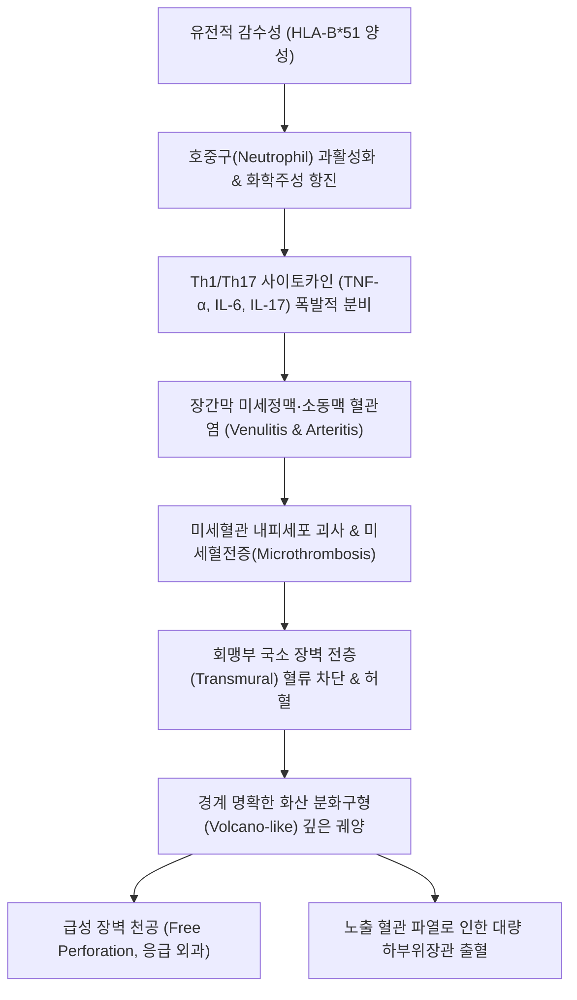

# 🩺 [[베체트 장염]] (Intestinal Behçet's Disease / 腸型白塞病, KCD M35.2+ / ICD-10 M35.2)

> **핵심 3줄 요약 (Key Summary)**:
> - 📍 **병소 부위 & 병태생리**: [[회맹부]](Ileocecal region, 회맹판 및 말단 회장) 호발 — 유전적 소인(HLA-B51)과 호중구 과활성화에 의한 **전신성 혈관염(Systemic Vasculitis)** 기반 질환으로, 장간막 미세정맥 및 소동맥의 염증성 폐색과 국소 점막 허혈로 인해 장벽 전층을 관통하는 깊고 둥근 **화산 분화구형(Volcano-like) 궤양** 형성.
> - 🚩 **전형적 임상 양상 & 3대 징후**: 재발성 구강 아프타 궤양(Aphthous Ulcer), 음부 궤양, 피부 병변(결절홍반) 또는 포도막염의 전신 베체트 징후와 함께 동반되는 **우하복부(RLQ) 둔통 및 간헐적 산통**, 혈변, 설사.
> - 🛠️ **핵심 감별 & 한·양방 치료 전략**: [[크론병]], [[장결핵]], [[궤양성 대장염]] 감별. 대장내시경 소견(회맹부 단발성 또는 소수의 깊은 원형 궤양) 및 ICBD 국제 진단 기준 활용. 양방에서는 5-ASA, 코르티코스테로이드, 면역조절제(Azathioprine), 항TNF 제제(Infliximab, Adalimumab) 적용; 한의에서는 호혹병(狐惑病) 범주로 인식하여 청열해독·사화조습의 [[감초사심탕]], [[황련해독탕]] 및 곡지·족삼리·태충 침구 치료로 혈관염성 염증 조절 및 점막 유합 촉진.
> - ⚠️ **응급 의뢰 레드플래그**: 장벽 전층 침범형 궤양으로 인해 발생하는 급격한 장 천공(Free Perforation, 타 염증성 장질환 대비 빈도 극히 높음), 대량 하부위장관 출혈, 복막염 징후(극심한 반발통 및 판자형 복벽 강직) 발생 시 즉시 류마티스내과 및 응급 외과 전원 필수.

---

## 📌 목차
1. [질환 개요 & 병태생리 (Disease Overview)](#1-질환-개요--병태생리-disease-overview)
2. [병태생리 메커니즘 & 대사·장기부전 악순환 네트워크](#2-병태생리-메커니즘--대사장기부전-악순환-네트워크)
3. [임상 증상 & 환자 소견 (Clinical Presentation)](#3-임상-증상--환자-소견-clinical-presentation)
4. [감별 진단 매트릭스 (Differential Diagnosis)](#4-감별-진단-매트릭스-differential-diagnosis)
5. [한의 통합 치료 프로토콜 (침·약침·한약)](#5-한의-통합-치료-프로토콜-침약침한약)
6. [양방 치료 & 병용·의뢰 기준 (Conventional Treatment & Referral)](#6-양방-치료--병용의뢰-기준-conventional-treatment--referral)
7. [식이·생활습관 & 자가관리 티칭 가이드](#7-식이생활습관--자가관리-티칭-가이드)
8. [💡 진료실 핵심 필기 & 임상 노하우](#8--진료실-핵심-필기--임상-노하우)
9. [출처 및 학술 참고 문헌 (References)](#9-출처-및-학술-참고-문헌-references)

---

## 1. 질환 개요 & 병태생리 (Disease Overview)

![[베체트_장염_01_회맹부해부및궤양호발부위.png|450]]
> [그림 1: ① 질환 개요 — 절개한 맹장과 회맹판(ileo-caecal valve), 말단 회장, 충수돌기(Vermiform process)가 라벨로 표시된 회맹부 해부 실사 사진. 베체트 장염이 호발하는 회맹부 구조 — 출처: Wikimedia Commons, File:Cecum and ileocecal valve.JPG (CC BY-SA 3.0, AnatomyUMFTM)]

* **질환 정의 및 전신성 연결성**:
  * 만성 다발성 전신 혈관염인 [[베체트병]](Behçet's Disease) 환자에서 위장관 점막의 궤양성 병변이 동반된 형태를 **장관 베체트병(Intestinal Behçet's Disease)** 또는 베체트 장염이라 한다.
  * 한의학에서는 한대(漢代) 장중경(張仲景)의 《금궤요략(金匱要略)》에 수록된 **호혹병(狐惑病)**(상체는 인후와 구강을 침범하고, 하체는 전음과 후음을 침범하며, 정신이 멍하고 식욕이 감퇴하는 질환)의 병태와 완벽하게 일치한다.
* **역학 및 지역적 특성**:
  * 실크로드(Silk Road) 연안 국가인 한국, 일본, 중국, 중동, 지중해 연안에서 유병률이 압도적으로 높으며, 서구권에서는 매우 드물다.
  * 국내 베체트병 환자의 약 7~10%에서 위장관 침범이 나타나며, 20대~40대 청장년층에서 호발한다.
* **관련 장기 및 침범 분포**:
  * **주 이환 장기**: **[[회맹부]](Ileocecal region, 70~80% 이상)** — 맹장 및 말단 회장의 장간막 부착 부위.
  * **기타 부위**: 상행결장, 횡행결장, 식도(드묾). 직장 침범은 극히 드물어 궤양성 대장염과의 중요한 감별점이 된다.

---

## 2. 병태생리 메커니즘 & 대사·장기부전 악순환 네트워크

> ⚠️ **이미지 미확보 (2026-10-06)** — 이 슬롯(병태생리 도해·내시경 화산 분화구형 궤양 소견)의 실제 그림을 확보하지 못했습니다.
> 기존에 들어 있던 2장은 **하지 자반 사진**과 **상부위장관 내시경 실사**로, 캡션과 전혀 다른 그림이었습니다(출처는 실체 없는 'Simbio Clinical System' 표기).
> 규칙(도해 슬롯에 무관 실사진 금지)에 따라 제거했고, 병태생리 기전은 바로 위 **mermaid 흐름도**로 서술합니다.
> ⛔ 베체트 장염은 질병관리청 국가건강정보포털(1,063건)에 미수록이라 한국어 도해를 받을 수 없었습니다 — Commons에도 전용 도해가 없습니다.

### 1) 분자·세포 수준 기전
* **혈관염 기반의 조직 괴사**: 크론병이나 궤양성 대장염이 장관 상피 및 점막 면역계의 이상에서 출발하는 것과 달리, 베체트 장염은 **혈관염(Vasculitis)**이 일차적 병인이다. 장간막 미세정맥과 소동맥에 호중구와 림프구가 침윤하는 백혈구파괴성 혈관염이 발생하고 미세혈전이 형성된다.
* **전층 허혈과 화산 분화구형 궤양**: 혈류가 차단된 국소 부위의 장벽 전층이 급격한 허혈성 경색에 빠져 점막상피뿐 아니라 점막하층, 고유근층까지 통째로 떨어져 나가면서, 경계가 뚜렷하고 깊게 파인 **원형/난원형의 분화구형(Volcano-type) 궤양**이 발생한다.
* **장벽 천공 위험성**: 궤양이 장벽 전층을 뚫고 장막(Serosa) 직전까지 깊게 침식하므로, 장벽이 종이처럼 얇아져 경미한 장관 내압 상승에도 장 천공이 발생하기 쉽다.

### 2) 장기·계통 수준 결과
* 천공 발생 시 복강 내 급성 복막염 및 장루 형성, 장관 피부 누공(Enterocutaneous fistula)이 발생할 수 있다.
* 수술적 절제를 시행하더라도 문합부(Anastomosis site) 주변의 혈관염 소인이 그대로 남아 있어 수술 후 문합부 궤양 재발률이 40~50%에 달하는 고난도 난치성 경과를 밟는다.

---

## 3. 임상 증상 & 환자 소견 (Clinical Presentation)

![[베체트_장염_03_구강아프타궤양_하순점막.png|420]]
> [그림 2: ④ 전신 진단 소견(구강) — 하순 점막 안쪽에 생긴 전형적인 아프타성 궤양(중심 회백색 위막 + 주변 홍반 테두리, 화살표 지시). 베체트병 진단의 제1 기준인 재발성 구강 궤양 소견 — 출처: Wikimedia Commons, File:Aphthous stomatitis on the labial mucosa.jpg (CC BY-SA 4.0)]

![[베체트_장염_03_구강아프타궤양_설배부.png|420]]
> [그림 3: ④ 전신 진단 소견(구강) — 혀 배부에 다발성으로 산재한 아프타성 궤양(회백색 반점). 구강 점막 어디에나 재발할 수 있음을 보여주는 실제 환자 소견 — 출처: Wikimedia Commons, File:Aphthe Zunge.jpg (CC BY-SA 3.0)]

![[베체트_장염_03_하지결절홍반.png|420]]
> [그림 4: ④ 전신 진단 소견(피부) — 양쪽 아래다리에 흩어진 압통성 홍색 결절(결절홍반, Erythema nodosum). 베체트병의 주요 피부 병변 — 출처: Wikimedia Commons, File:Erythema nodosum on hairy legs.jpg (CC BY-SA 3.0)]

> ⚠️ **이미지 미확보 (2026-10-06)** — 기존 'ICBD 진단 기준' 슬롯에 있던 그림은 **뇌 정맥 조영(MRV) 영상**으로 캡션과 무관했습니다(위 구강 궤양 실사로 대체).
> 'DAIBD 척도' 슬롯의 그림은 **안저(망막) 사진**이었고, 척도 도해는 확보 불가 → 아래 **DAIBD 표**로 대체했습니다.

### 1) 주소증 및 핵심 증상
* **위장관 주소증**:
  * **우하복부 복통(RLQ Pain)**: 환자의 80% 이상에서 호소. 지속적인 둔통 또는 식후 장관 연동 시 발생하는 쥐어짜는 듯한 산통.
  * **하부위장관 출혈**: 궤양 기저부의 혈관 침식으로 인한 혈변(Hematochezia) 또는 흑색변(Melena).
  * **설사 및 복부 팽만**: 만성 궤양으로 인한 장 흡수 부전 및 배변 장애.
* **전신 베체트 징후 (동반 소견)**:
  * **재발성 아프타 구강 궤양(Oral Ulcers, 거의 100%)**: 입술 안쪽, 잇몸, 혀, 볼 점막에 1년에 3회 이상 발생하는 통증성 궤양.
  * **외음부 궤양(Genital Ulcers, 70~80%)**: 음낭, 음순, 회음부에 발생하는 깊고 흉터를 남기는 궤양.
  * **피부 병변(Skin Lesions)**: 결절홍반(Erythema nodosum, 정강이 부위 붉은 결절성 압통점), 모낭염 유사 병변.
  * **안구 병변(Eye Lesions)**: 전방축농(Hypopyon)을 동반한 포도막염(Uveitis), 망막 혈관염.

### 2) 객관적 검사 소견
* **대장내시경 검사 (Colonoscopy - 진단의 핵심)**:
  * 회맹판 전후로 **경계가 칼로 도려낸 듯 명확한 단발성 또는 소수(1~5개)의 깊은 원형/난원형 궤양**.
  * 궤양 주변 점막은 부종을 제외하면 정상 점막을 유지함 (Discrete appearance).
* **혈액학적 소견**:
  * 염증성 지표의 급격한 상승: ESR 및 hs-CRP 증가.
  * 유전 검사: [[HLA-B51]](HLA-B*51) 유전자 양성률(한국인 환자의 50~60%).

### 3) 질병 활성도 판정: DAIBD 척도 (Disease Activity Index for Intestinal Behçet)

| DAIBD 활성도 단계 | DAIBD 총점 (0~325점) | 임상적 특징 및 치료 방향 |
| :--- | :---: | :--- |
| **관해기 (Quiescent)** | < 40점 | 복통·혈변 소실, 전신 상태 양호, 염증 수치 정상 유지 (유지 요법 지속) |
| **경등도 활성기 (Mild)** | 40 ~ 74점 | 간헐적 우하복통, 소량 혈변, 일상생활 유지 가능 (5-ASA 및 경구 약물 조절) |
| **중등도~중증 활성기 (Moderate to Severe)** | ≥ 75점 | 지속적 심한 복통, 다량 혈변, 발열, 전신 쇠약 (생물학적제제 투여 및 수술 대비) |

---

## 4. 감별 진단 매트릭스 (Differential Diagnosis)

| 감별 질환 | 특징적 양상 | 감별 포인트 (검사·수치) |
| :--- | :--- | :--- |
| **[[베체트 장염]] (본 질환)** | 구강/음부 궤양 병력, 회맹부 단발성·깊은 원형 분화구형 궤양 | HLA-B51 양성, 내시경상 비침범 점막 정상, 비건락성 육아종 없음 |
| [[크론병]] | 소장·대장 전장관 침범, 조약돌 모양(Cobblestone), 종주 궤양 | 조직 생검상 **비건락성 상피양 육아종(Non-caseating granuloma)** 확인 |
| [[장결핵]] | 회맹부 호발, 결핵 병력 또는 흉부 X선 이상 | **건락성 괴사(Caseating necrosis)**, 결핵균 PCR / AFB 염색 양성 |
| [[궤양성 대장염]] | 직장부터 시작되는 연속적 미만성 점막 염증 | 직장 침범 필수, 표재성 미란/궤양, 가성용종(Pseudopolyp) |
| [[급성 충수돌기염]]([[맹장염]]) | 급성 발병, 심와부→우하복부 통증 이동, 맥버니 반발통 | 복부 CT상 충수 직경 >6mm 종대, 회맹부 장벽 궤양 없음 |

---

## 5. 한의 통합 치료 프로토콜 (침·약침·한약)

![[베체트_장염_05_수양명대장경경혈도.png|450]]
> [그림 5: ⑥ 한의 혈위 도해 — 수양명대장경(手陽明大腸經) 경혈도로, 청열사화에 쓰는 곡지(LI11)·합곡(LI4)이 포함되어 있다. 고전 경혈도 판화 — 출처: Wikimedia Commons, File:Acu-moxa chart; large intestine channel of hand yangming, Wellcome L0037974 (CC BY 4.0)]

* **변증 분류**:
  * **습열온독형(濕熱蘊毒型)**: 활동기 최빈형, 구강·음부·장관 궤양 극심, 복통, 혈변, 설홍태황니, 맥활삭.
  * **간비불화형(肝脾不和型)**: 스트레스 후 복통·설사 악화, 구갈, 협통, 설변홍, 맥현.
  * **음허열독형(陰虛熱毒型)**: 만성기, 조열, 도한, 구강 궤양 반복, 장관 허혈성 위축, 설홍소태, 맥세삭.
* **침구 치료 (Acupuncture)**:
  * **전신 청열해독 및 기혈 순환 주혈**:
    * **[[곡지]](LI11) · [[합곡]](LI4)**: 수양명대장경, 전신 혈열(血熱) 제거 및 두면부·구강 점막 염증 완화.
    * **[[태충]](LR3)**: 족궐음간경의 원혈, 간화(肝火)를 내리고 전신 혈관 연축을 해소.
    * **[[족삼리]](ST36) · [[음릉천]](SP9)**: 족태음비경과 족양명위경, 장관 습열(濕熱) 배출 및 소화기 점막 재생.
    * **[[천추]](ST25) · [[중완]](CV12)**: 복부 장관 국소 기혈 순환 촉진.
  * **자침 기법**: 급성 염증기에는 사법(瀉法) 위주, 만성 허약기에는 평보평사(平補平瀉).
* **약침 치료 (Pharmacopuncture)**:
  * **황련해독탕 약침**: 습열온독형 환자의 천추, 곡지에 주입하여 전신 혈관염 매개 사이토카인(TNF-α) 억제 도모.
  * **봉약침(Sweet Bee Venom)**: 알레르기 피부 반응 음성 확인 후, 관해기 면역 조절 목적으로 족삼리, 태충에 저농도 미량 시술.
* **한약 치료 (Herbal Medicine)**:
  * **호혹병(狐惑病) 전용 고전 방제**:
    * **[[감초사심탕]](甘草瀉心湯)**: 감초(중용), 황련, 황금, 반하, 건강, 인삼, 대추 — 《금궤요략》 호혹병의 1차 표준 방제. 과활성화된 면역계를 진정시키고(황련·황금), 손상된 위장관 점막 상피를 보호(감초·인삼)하여 구강·음부·장관 궤양을 동시 치유함.
    * **[[고삼탕]](苦蔘湯) 세정/훈증**: 외음부 궤양 국소 세정을 위한 외용제 병용.
  * **활혈화어 및 청열배농 방제**:
    * **생간건비탕(生肝健脾湯) 가미방**: 간비불화형 장관 궤양에 시호, 백작약, 백출, 복령 가 목단피, 패장초.
    * **[[의이인부자패장산]](薏苡仁附子敗醬散)**: 만성 화농성 장관 궤양의 배농(排膿) 및 조직 수복.

---

## 6. 양방 치료 & 병용·의뢰 기준 (Conventional Treatment & Referral)

* **약물 치료 (Medications - 단계별 면역억제 요법)**:
  * **1단계 (경증~중등증 유도/유지)**: **5-ASA 제제(Sulfasalazine, Mesalazine)** — 2.0~4.0 g/day 경구 투여.
  * **2단계 (급성 악화기 유도)**: **전신 스테로이드(Prednisolone)** — 0.5~1.0 mg/kg/day 단기간 투여 후 점진적 감량.
  * **3단계 (스테로이드 의존/난치성)**: **면역조절제(Azathioprine / 6-MP)** — 1.0~2.5 mg/kg/day 유지 요법.
  * **4단계 (난치성·재발성 중증)**: **항TNF 생물학적 제제(Anti-TNF agents)** — 인플릭시맵([[Infliximab]]), 아달리무맙([[Adalimumab]]). 장관 궤양 치유율을 획기적으로 개선하는 1차 표적 치료제 (Baresic et al., 2026).
* **수술 치료 (Surgical Indication)**:
  * **절대 적응증**: 장 천공(Free perforation), 조절되지 않는 대량 장출혈, 장폐색, 복강내 패혈성 농양.
  * **수술 시 주의점**: 병변 부위 회맹부 절제술 시행 시, 육안상 정상으로 보이는 장관 부위까지 안전 경계를 충분히 확보해야 문합부 궤양 재발을 낮출 수 있음.
* **한의 병용 치료 전략**:
  * 5-ASA 또는 생물학적 제제 투여 중인 환자에게 [[감초사심탕]] 계열 한약을 병용할 경우 장 점막 치유율을 높이고 스테로이드 감량(Tapering) 시 반동 현상을 완화할 수 있음.
  * ⚠️ 단, 면역억제제 복용 환자는 기회감염 위험이 있으므로 침 시술 시 엄격한 멸균 관리 필수.
* **양방 응급 의뢰 기준 (Emergency Referral)**:
  * 갑작스러운 칼로 베는 듯한 극심한 복통, 복부 판자형 경직 등 **급성 천공 의심 징후**.
  * 활력징후 이상(빈맥 > 100회/분, 수축기 혈압 < 90 mmHg)을 동반한 대량 혈변.

---

## 7. 식이·생활습관 & 자가관리 티칭 가이드

> ⚠️ **이미지 미확보 (2026-10-06)** — 기존 그림은 **구강 점막 아프타 궤양 사진**이었고 캡션('장천공 주의·스트레스 관리 가이드')과 무관했습니다.
> 그 사진은 내용이 맞는 §3 전신 진단 소견으로 **이동 배치**했고, 이 자리(식이·생활 관리 가이드)는 확보 실패로 비웁니다. 아래 텍스트·표로 서술합니다.

* **장관 점막 보호 및 회복 식이**:
  * **활동기 식이지도**: 장관 자극과 기계적 마찰을 줄이기 위해 부드러운 죽, 미음, 연식 위주의 소화가 쉬운 식단 유지.
  * **천공 위험 식품 금기**: 단단하고 거친 견과류, 날채소, 튀김, 팝콘, 질긴 육류 등 장벽 궤양 부위에 기계적 손상을 줄 수 있는 음식 금지.
  * **온열성 자극원 배제**: 고추, 후추, 마늘, 알코올 등 혈관을 과도하게 확장하고 염증을 촉진하는 자극성 향신료 완전 제한.
* **자가면역 질환 스트레스 및 피로 관리**:
  * **수면과 면역 안정**: 수면 부족과 극심한 피로는 Th1/Th17 면역 사이토카인을 급증시켜 궤양 재발을 촉발하므로 매일 7~8시간의 규칙적인 수면 보장.
  * **정서적 안정**: 분노, 불안, 과도한 긴장을 완화하기 위해 심호흡 및 명상 요법 지도.
* **환자 자가 관찰 및 응급 교육**:
  * "우하복부 통증이 평소보다 훨씬 심해지면서 배가 판자처럼 딱딱해지면 지체 없이 즉시 응급실로 가야 합니다."
  * 대변의 색깔(검은 변, 붉은 변)을 매일 관찰하고 기록하도록 교육.

---

## 8. 💡 진료실 핵심 필기 & 임상 노하우

* **비오님 임상 포인트: "입안 헐 때 배 아픈 환자를 놓치지 마라"**:
  * 우하복통 환자가 왔을 때 입안을 반드시 들여다보아야 한다. "입안에 혓바늘이나 궤양이 자주 생기는가?", "성기 주변에 궤양이 생긴 적이 있는가?"를 질문하여 베체트병의 전신 병력을 포착하는 것이 진단의 핵심 열쇠이다.
* **감초사심탕(甘草瀉心湯)의 기적적인 적응증**:
  * 장중경이 2,000년 전 기술한 호혹병 치료제 감초사심탕은 현대 면역학적으로도 감초의 글리시리진(Glycyrrhizin)이 HMGB1을 차단하고 황련의 베르베린이 NF-κB를 억제하여 베체트 혈관염에 완벽한 분자 타깃 치료제로 작용한다.
* **천공의 높은 위험성 경계**:
  * 크론병 궤양은 섬유화가 동반되어 천공보다는 협착으로 진행하는 경우가 많지만, 베체트 궤양은 장벽 전층이 칼로 도려낸 듯 얇아져 **예고 없는 급성 천공(Free Perforation)**이 훨씬 흔하다. 진료실에서 복부 진찰 시 무리하게 강한 압박을 가하지 말아야 한다.

---

## 9. 출처 및 학술 참고 문헌 (References)

- **Baresic M et al. (2026)**. Optimizing anti-TNF therapy in Behcet disease the role of therapeutic drug monitoring. *Front Immunol*. [PMID 42609342](https://pubmed.ncbi.nlm.nih.gov/42609342/)

- **Rao X et al. (2026)**. Allogeneic haematopoietic stem cell transplantation for refractory perforating intestinal Behcet disease in a patient with aplastic anaemia A case report. *Medicine*. [PMID 42536510](https://pubmed.ncbi.nlm.nih.gov/42536510/)

- **Kim YS et al. (2025)**. Proton Pump Inhibitor Use and Its Significant Association With an Increased Incidence of Intestinal Behcet Disease. *Am J Gastroenterol*. [PMID 41176348](https://pubmed.ncbi.nlm.nih.gov/41176348/)
