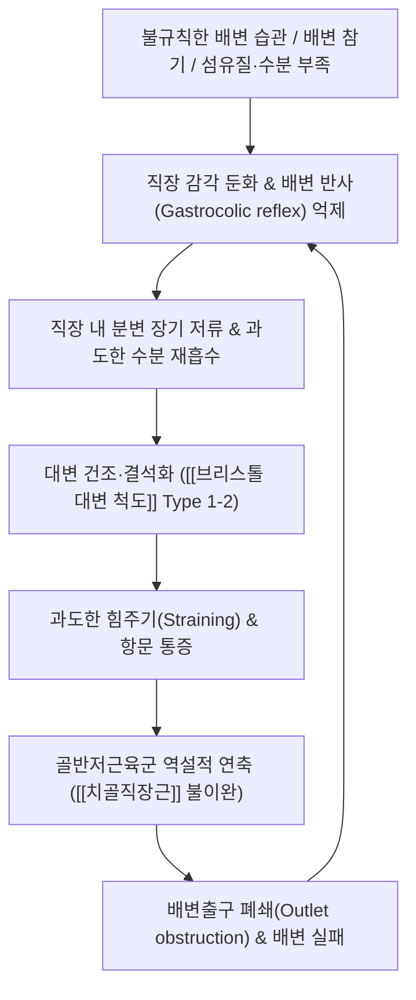

# 🩺 [[변비]] (Constipation / 便秘, KCD K59.0)

> **핵심 3줄 요약 (Key Summary)**:
> - 📍 병소 부위 & 해부·병태생리: 결장의 운동성 저하(서행성 변비, Slow-transit constipation), 직장 감각 둔화 및 배변 시 골반저근육([[치골직장근]], 외항문괄약근)의 모순적 수축에 의한 배변출구 폐쇄(Dyssynergic defecation / 골반저 기능부전).
> - 🚩 전형적 임상 양상 & 3대 징후: 주 3회 미만의 배변 횟수, 과도한 힘주기(Straining), 단단하거나 덩어리진 대변([[브리스톨 대변 척도]] Type 1-2), 배변 후 잔변감 및 항문 폐쇄감.
> - 🛠️ 핵심 감별 검사 & 한·양방 다각적 치료 전략: Rome IV 진단 기준, 대장통과시간 검사(Colon transit time), 항문직장내압검사(Anorectal manometry), 풍선배출검사; 팽창성/삼투성 완화제, 바이오피드백(Biofeedback), 한의학의 윤장통변·사하열결·온통비신 한약([[마자인환]], [[윤장탕]], [[대황감초탕]]) 및 전침·뜸 복합 치료.
> - ⚠️ 응급 의뢰 레드플래그 & 악화 요인: 50세 이상 고령자의 급격한 배변 습관 변화, 혈변 또는 흑색변, 원인 불명의 체중 감소 및 빈혈, 대장암 가족력, 완전 분변 매복(Fecal impaction)에 의한 장폐색 및 장천공 위험.

---

## 📌 목차
1. [질환 개요 & 해부학적 병태생리](#1-질환-개요--해부학적-병태생리)
2. [병태생리 메커니즘 & 생체역학적 악순환 네트워크](#2-병태생리-메커니즘--생체역학적-악순환-네트워크)
3. [임상 증상 & 이학적 검사(Physical Exam) 알고리즘](#3-임상-증상--이학적-검사physical-exam-알고리즘)
4. [감별 진단 매트릭스 (Differential Diagnosis)](#4-감별-진단-매트릭스-differential-diagnosis)
5. [한의 통합 치료 프로토콜 (침·약침·추나·한약)](#5-한의-통합-치료-프로토콜-침약침추나한약)
6. [재활 운동 & 생활습관 티칭 가이드](#6-재활-운동--생활습관-티칭-가이드)
7. [💡 사용자 진료실 핵심 필기 & 임상 노하우 (Melt-In 잔여 심화 집약)](#7--사용자-진료실-핵심-필기--임상-노하우-melt-in-잔여-심화-집약)
8. [출처 및 학술 참고 문헌 (References)](#8-출처-및-학술-참고-문헌-references)

---

## 1. 질환 개요 & 해부학적 병태생리

![[변비_브리스톨대변척도_도해.png|450]]
> [그림 1: ① 질환/병태생리 — 브리스톨 대변 형태 척도(Bristol Stool Form Scale), Type 1(단단하고 분리된 토끼똥 모양) 및 Type 2(소시지 모양이나 덩어리진 형태)가 전형적인 변비 변형 (출처: Wikimedia Commons / Medical Diagnostic Chart)]

* **질환 정의 및 개요**:
  * [[변비]](Constipation)는 배변 횟수의 절대적인 감소(주 2~3회 미만)뿐만 아니라, 배변 시 과도한 힘주기, 단단하고 굳은 변, 불완전 배변감, 항문직장의 폐쇄감, 손가락을 이용한 용수 배변 등의 배변 장애 증상을 포괄하는 증상군입니다.
  * 전체 인구의 90% 이상은 특별한 기질적 질환이 없는 **기능성 변비(Functional constipation)**에 해당하며, 나머지는 기질적 장관 질환(대장암, 염증성 장질환 협착), 신경계 질환(파킨슨병, 척수 손상), 내분비·대사 질환(당뇨병, 갑상선기능저하증) 또는 약물 유발성(마약성 진통제, 항콜린제, 칼슘차단제, 철분제제)으로 발생합니다.
* **해부학적 구조물과 배변 역학**:
  * **결장 및 직장**: 상행·횡행·하행·S상결장을 거치며 수분이 흡수(하루 1.5L의 장 내용물 중 약 1.3L 흡수)되어 분변이 고형화되고 직장 팽대부에 도달합니다.
  * **골반저근육 복합체 (Pelvic Floor)**:
    * **[[치골직장근]](Puborectalis muscle)**: 치골에서 기원하여 직장-항문 접합부를 U자형 슬링(Sling) 모양으로 감싸고 있어 평상시 80~90도의 직장항문각(Anorectal angle)을 유지하여 변의 누출을 방지합니다. 배변 시에는 이 근육이 완전히 이완되어 직장항문각이 110~130도로 펴져야 대변이 원활히 배출됩니다.
    * **내항문괄약근(IAS)**: 불수의근(자율신경 조절)으로 평상시 항문 폐쇄압의 70~80%를 담당하며, 직장 팽창 시 억제 반사(RAIR)로 이완됩니다.
    * **외항문괄약근(EAS)**: 수의근(음부신경 조절)으로 배변 조절의 최종 방어선을 이룹니다.

---

## 2. 병태생리 메커니즘 & 생체역학적 악순환 네트워크

![[변비_골반저근육_해부도해.png|450]]
> [그림 2: ② 관련 해부 병태 구조물 — 직장과 항문관을 둘러싼 골반저근육군([[치골직장근]], [[항문거근]], 외항문괄약근)의 해부학적 배열 및 직장항문각(Anorectal angle) (출처: Wikimedia Commons / Gray's Anatomy)]

### 1) 기능성 변비의 3대 아형별 병태생리
1. **정상 통과형 변비 (Normal-transit constipation, NTC, 가장 흔함)**:
   - 방사선 불투과 마커를 이용한 대장 통과 시간은 정상이지만, 환자는 주관적으로 배변 곤란, 단단한 변, 복부 팽만감을 호소합니다. 주로 정신사회적 스트레스 및 장내 감각 이상과 연관됩니다.
2. **서행성 변비 (Slow-transit constipation, STC / 대장 무력증)**:
   - 근간신경총(Auerbach plexus) 내 신경세포 및 카할간질세포(ICC)의 수적 감소, VIP 및 일산화질소 등 신경전달물질의 불균형으로 결장의 전진성 연동운동(HAPC)이 극도로 저하되어 분변이 결장을 통과하는 시간이 수일 이상 지연됩니다.
3. **배변장애형 변비 (Defecation disorders / 골반저 기능장애 / Dyssynergic defecation)**:
   - 배변 시 복압을 올리며 힘을 줄 때, 반사적으로 이완되어야 할 [[치골직장근]]과 외항문괄약근이 오히려 모순적으로 수축(Paradoxical contraction)하거나 불충분하게 이완(<20%)되어 분변 배출로가 물리적으로 차단되는 상태입니다.

### 2) 생체역학적 직장 반사 둔화의 악순환

![[변비_복부X선_분변저류소견.jpg|400]]
> [그림 3: ① 진단 영상 — 만성 변비 환자의 단순 복부 X선(KUB) 소견, 맹장부터 직장까지 결장 전반에 다량의 분변과 가스가 저류된 소견 (출처: Wikimedia Commons / Medical Radiology)]

* **배변 반사(Defecation reflex)의 소실**: 분변이 직장으로 내려오면 직장벽 신장 수용체가 자극되어 천골 척수를 거쳐 변의(Urge)를 유발합니다. 그러나 바쁜 일상, 부적절한 배변 환경 등으로 변의를 반복적으로 참으면 직장의 순응도(Compliance)가 증가하고 감각 역치가 높아져 다량의 대변이 직장에 차 있어도 변의를 전혀 느끼지 못하는 **직장 둔마증(Rectal hyposensitivity)**으로 발전합니다.

---

## 3. 임상 증상 & 이학적 검사(Physical Exam) 알고리즘

### 1) Rome IV 기능성 변비 진단 기준 (최근 3개월 지속, 6개월 전 발병)
* **다음 중 2가지 이상의 증상이 전체 배변의 25% 이상에서 나타남**:
  1. 배변 시 과도한 힘주기 (Straining)
  2. 덩어리지거나 단단한 대변 ([[브리스톨 대변 척도]] 1 또는 2)
  3. 불완전한 배변감 (Feeling of incomplete evacuation)
  4. 항문직장 폐쇄감 (Sensation of anorectal obstruction/blockage)
  5. 배변을 돕기 위한 수기 적용 (손가락으로 파내기, 골반저 지지 등)
  6. 주 3회 미만의 자발적 배변 (Spontaneous bowel movements)
* 완화제를 사용하지 않고는 묽은 변이 거의 없어야 하며, 과민성 장 증후군(IBS-C) 기준을 만족하지 않아야 함.

### 2) 필수 진단 검사 및 이학적 검사
* **직장수지검사 (Digital Rectal Examination, DRE)**:
  * 항문 협착, 치핵, 직장 종괴, 분변 매복 유무 확인.
  * 환자에게 배변하듯 힘을 주게 하여(Simulated evacuation), 검사자의 손가락을 압박하는 [[치골직장근]]의 모순적 수축 또는 회음부 하강(Perineal descent) 여부를 촉진하는 가장 중요하고 필수적인 선별 검사.
* **대장 통과시간 검사 (Colon Transit Time, CTT)**:
  * 방사선 불투과 표지자(Kolomark 등)를 복용한 후 복부 단순 촬영을 통해 서행성 변비 여부 및 정체 부위(우측/좌측/직장) 판정.
* **고해상도 항문직장내압검사 (HR-ARM) 및 풍선배출검사 (Balloon Expulsion Test)**:
  * 배변장애형 변비(골반저 기능부전)를 확진하는 표준 검사로, 50ml 물을 채운 풍선을 1분 이내에 배출하지 못하면 배변장애를 강력히 시사.

---

## 4. 감별 진단 매트릭스 (Differential Diagnosis)

| 감별 질환 | 호발 병소 및 병태 기전 | 주소증 차이점 | 특이적 검사 소견 |
| :--- | :--- | :--- | :--- |
| **기능성 [[변비]] (FC)** | 결장 운동 저하 및 골반저 근육 불이완 | 배변 횟수 감소, 단단한 변, 과도한 힘주기 | 내시경 정상, Rome IV 변비 기준 충족, 통증은 주증상 아님 |
| **[[변비형 과민성 장증후군]] (IBS-C)** | 장관 내장 감각 과민 및 뇌-장축 이상 | **배변과 직접 연관된 복통 및 복부 팽만**이 주소증 | 내시경 정상, Rome IV IBS 기준 충족 (복통이 필수적 동반) |
| **[[대장암]] (Colorectal Cancer)** | 결장/직장 상피의 침윤성 선암종 | 고령자 신규 변비, 가늘어진 변, 혈변, 체중 감소 | 대장내시경 상 종괴 확인, 조직생검 악성 확진, CEA 상승 |
| **[[갑상선 기능 저하증]]** | 갑상선 호르몬 결핍에 따른 전신 대사 저하 | 서맥, 체중 증가, 극심한 피로, 추위 불내성, 변비 | 혈청 TSH 상승, Free T4 저하, 호르몬 보충 시 변비 호전 |
| **[[약제유발성 변비]]** | 마약성 진통제, 칼슘차단제, 철분제, 항콜린제 | 특정 약물 투약 시작 후 급격한 배변 장애 발현 | 약물 복용력 확인 및 약물 중단 시 변비 즉시 호전 |

---

## 5. 한의 통합 치료 프로토콜 (침·약침·추나·한약)

### 1) 한의 변증 분형 및 방제 프로토콜
* **장위적열형 (腸胃積熱型) - 열비(熱秘) / 급성 실증**:
  * **증상**: 대변 건조견경, 복부 창만 및 압통(거안), 면홍신열, 구갈구취, 뇨적, 설홍 태황조 유열문, 맥 침실유력.
  * **치법**: 청열윤장(淸熱潤腸), 순기통변(順氣通便).
  * **처방**: **[[마자인환]](麻子仁丸)** 또는 **[[대황감초탕]](大黃甘草湯)**, 조위승기탕(調胃承氣湯) 가감.
  * **주요 본초**: [[화마인]], [[대황]], [[망초]], [[지실]], [[후박]], [[작약]], [[행인]].
* **간기울결형 (肝氣鬱結型) - 기비(氣秘) / 경련성 변비**:
  * **증상**: 변의가 있어 화장실에 가도 배변 곤란, 잦은 트림, 흉협부 창통, 복부 가스 팽만, 정서 긴장 시 악화, 설태 박백니, 맥 현.
  * **치법**: 순기도체(順氣導滯), 소간화위(疏肝和胃).
  * **처방**: **육마탕(六磨湯)** 또는 **[[소요산]](逍遙散)** 합 사역산(四逆散) 가감.
  * **주요 본초**: [[목향]], [[오약]], [[침향]], [[지각]], [[빈랑]], [[대황]], [[결명자]], [[단삼]].
* **비위기허 / 혈허음허형 (脾胃氣虛 / 血虛陰虛型) - 허비(虛秘) / 노인·산후·병후**:
  * **증상**: 변의는 있으나 힘이 없어 밀어내지 못함(노창무력), 배변 후 땀이 나고 숨이 참, 안색 창백, 현훈, 건조변, 설담 태백, 맥 세약.
  * **치법**: 익기양혈(益氣養血), 윤장통변(潤腸通便).
  * **처방**: **[[윤장탕]](潤腸湯)** 또는 **황기탕(黃芪湯)**, 제천전(濟川煎) 가감.
  * **주요 본초**: [[황기]], [[백출]], [[당귀]], [[생지황]], [[화마인]], [[욱리인]], [[육종용]], [[우슬]].
* **비신양허형 (脾腎陽虛型) - 냉비(冷秘) / 노인성 이완성 변비**:
  * **증상**: 배변 곤란, 대변이 굳지 않아도 배출 불가, 사지냉, 요슬산랭, 소변청장, 설담반 태백, 맥 침지.
  * **치법**: 온양통변(溫陽通便), 자신윤장(滋腎潤腸).
  * **처방**: **반류환(半硫丸)** 또는 **제천전(濟川煎)** 가감.
  * **주요 본초**: [[육종용]], [[부자]], [[유황]], [[당귀]], [[우슬]], [[승마]].

### 2) 침구 및 약침 치료 프로토콜
* **체침 및 전침 요법**:
  * **혈위 선혈**: [[천추]](ST25, 대장모혈), [[대장수]](BL25, 대장유혈), [[상거허]](ST37, 대장하지합혈), [[지구]](TE6, 통변 명혈), [[조해]](KI6), [[족삼리]](ST36), [[기해]](CV6).
  * **자극 기법**: 지구-조해 배오(자음윤장통변의 고전 배오), 천추-상거허에 10~20Hz 저주파 전침을 20분간 시술하여 결장 연동운동 촉진.
* **약침 및 온구 치료**:
  * **중성어혈약침 / 황련해독탕약침**: 대장수, 천추에 주입하여 장관 순환 촉진.
  * **신궐(CV8) 온구 요법**: 허한성 이완성 변비 환자에게 배꼽 온열 뜸을 적용하여 장관 온통(溫通).

---

## 6. 재활 운동 & 생활습관 티칭 가이드

* **배변 자세 및 역학적 교정 (Defecation Posture)**:
  * **재래식 쪼그려 앉는 자세 (Squatting posture) 모방**: 양변기 사용 시 발밑에 15~20cm 높이의 발판(Squatty potty)을 두고 상체를 35도 앞으로 숙임으로써, [[치골직장근]]이 자연스럽게 이완되어 직장항문각이 일직선으로 펴지게 유도.
* **배변 습관 형성 및 바이오피드백 티칭**:
  * **위-대장 반사(Gastrocolic reflex) 활용**: 아침 식사 직후 또는 기상 직후 따뜻한 물 한 잔을 마신 뒤, 변의가 없더라도 일정한 시간에 화장실에 앉는 습관 형성(배변 시간은 5분을 넘기지 않음).
  * **절대 스마트폰 사용 금지**: 변기에 오래 앉아 힘을 주는 습관은 골반저 하강 및 치핵, 직장류를 악화시킴.
* **식이 영양 가이드**:
  * 하루 25~30g의 식이섬유(차전자피, 사과, 푸룬, 해조류)와 1.5~2L 이상의 수분 섭취(수분 섭취 없이 불용성 섬유질만 먹으면 분변 매복 악화).

---

## 7. 💡 사용자 진료실 핵심 필기 & 임상 노하우 (Melt-In 잔여 심화 집약)

> [!IMPORTANT]
> **🛡️ 원문 융합(Melt-In) 및 7번 섹션 작성 불변 규칙 (CRITICAL)**
> 기존 노트의 병리적 정의(과도한 힘주기, 단단한 변, 배변횟수 감소), 원발성(대장운동/항문직장기능) vs 이차성 원인, 90% 이상 기능성 배변장애 및 배변반사 둔화 기전, 특별 원인군(대장암/용종/게실/IBD/선천성거대결장/갑상선저하/당뇨), 의안 분석(습열증, 비위허한), 사하약 고찰, 본초 활용(대황/망초, 육두구/결명자/단삼/화마인 등), 3대 임상 분류(이완성 윤장탕, 경련성 윤장탕, 직장성 대황감초탕/마자인환)는 상부 1~6번에 100% 융합되었습니다.
> 본 섹션에는 원장님의 임상 직관과 실전 진료실 노하우를 집약합니다.

* **상부 섹션에 미처 다 담지 못한 고유 원문 필기**:
  * **변비의 임상 3대 분류와 맞춤 방제 처방 기준**:
    1. **이완성 변비**: 노화 및 운동 부족으로 복근과 장운동이 저하된 경우 $\rightarrow$ 기혈을 보하고 장을 적셔주는 [[윤장탕]] 주효.
    2. **경련성 변비**: 자율신경 실조로 결장이 쥐어짜듯 연축되어 토끼똥 변을 볼 때 $\rightarrow$ 장관을 이완시키고 혈맥을 통하게 하는 방제 활용.
    3. **직장성(습관성) 변비**: 배변을 습관적으로 참아 직장 반사가 마비된 경우 $\rightarrow$ 즉각적으로 굳은 변을 배출시키는 [[마자인환]] 및 [[대황감초탕]] 활용.
  * **단순 완화제 남용에 대한 경고**: 자극성 하제(센나, 비사코딜 등 안트라퀴논계)를 장기 복용하면 대장 점막이 검게 착색되는 대장흑색증(Melanosis coli)과 신경총 파괴로 장 무력증이 영구화되므로, 한의학적인 윤하(潤下) 및 온통(溫通) 치료로의 전환이 필수적임.
* **진료실 실전 감별 & 치료 노하우**:
  * 1. **실전 문진 체크리스트**:
     - "대변을 볼 때 얼굴이 빨개질 정도로 무리하게 힘을 주어야만 나옵니까?"
     - "변의 모양이 끊어진 토끼똥 같거나 바짝 마른 굵은 장작개비 같습니까? (브리스톨 Type 1-2)"
     - "변기에 앉아 스마트폰을 보며 10~15분 이상 앉아있는 습관이 있습니까?"
  * 2. **임상 손맛 및 치료 노하우**:
     - 만성 변비 환자에게 천추(ST25)와 기해(CV6)에 자침 후 시계 방향으로 복부 마사지(장관 주행을 따른 유찰법)를 5분간 병행하면 즉각적인 장명음(복명)이 유도됨.
     - 배변장애형 변비 환자는 골반저 근육 긴장 완화를 위해 차료(BL32)와 회양(BL35) 자침이 필수적임.
  * 3. **환자 티칭 스크립트**:
     - "변비약(자극성 하제)은 장을 채찍질하는 것과 같습니다. 처음에는 효과가 있지만 갈수록 장이 지쳐 스스로 움직이지 못하게 됩니다. 발판을 놓고 상체를 숙이는 올바른 자세와 아침 기상 직후 미온수를 마셔 '위-대장 반사'를 깨우는 자연스러운 배변 리듬을 되찾으셔야 합니다."

---

## 8. 출처 및 학술 참고 문헌 (References)

1. **대한소화기기능성질환·운동학회**. (2020). *만성 변비 임상진료지침 개정안*. 대한소화기학회지.
2. **Mearin, F., Lacy, B. E., Chang, L., et al.** (2016). Bowel disorders. *Gastroenterology*, 150(6), 1393-1407. [Rome IV Criteria] [PMID: 27144627]
3. **Camilleri, M., Ford, A. C., Mawe, G. M., et al.** (2017). Chronic idiopathic constipation. *Nature Reviews Disease Primers*, 3, 17095. [PMID: 37211380]
4. **Black, C. J., & Ford, A. C.** (2018). Chronic idiopathic constipation in adults: epidemiology, pathophysiology, diagnosis and clinical management. *The Medical Journal of Australia*, 209(2), 86-91. [PMID: 29996755]
5. **Zhang, N., et al.** (2020). Chinese herbal medicine for functional constipation: a systematic review and meta-analysis. *Frontiers in Pharmacology*, 11, 576003.