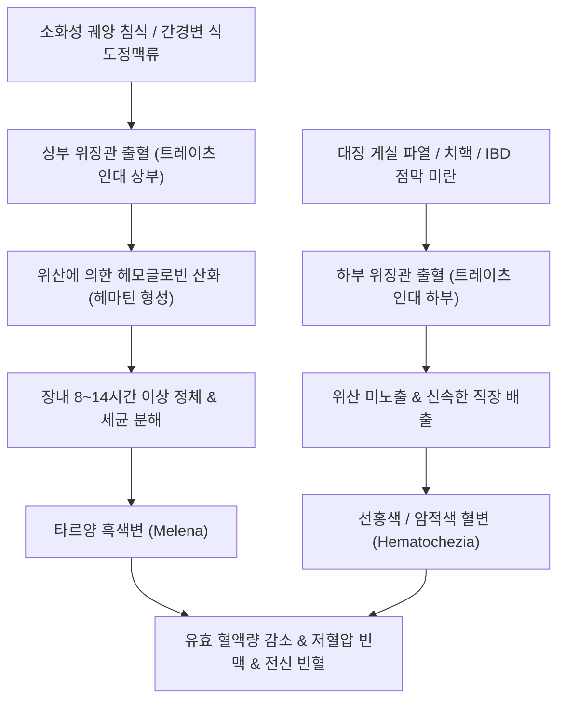
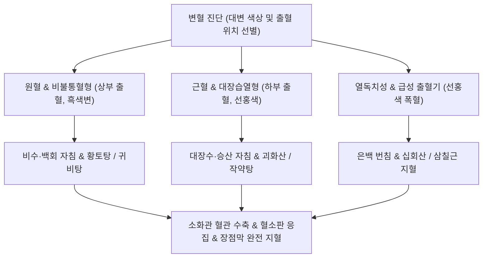

---
aliases:
  - 변혈
  - 혈변
  - 흑색변
  - 흑변
  - Melena
  - Hematochezia
  - 소화관 출혈
  - 장출혈
  - 하혈
tags:
  - 이론
  - 질환
  - 소화기질환
  - 변혈
  - 소화관출혈
categories:
  - 질환
  - 소화기 질환
created: 2024-01-21
updated: 2026-09-24
title: 변혈
date: 2026-09-24
출처: "PMID: 33929377"
---

# 변혈 (Gastrointestinal Bleeding / 便血, K92.1, K92.2)

> **상위 분류**: [[소화기 질환]] > [[상부위장관 질환]] / [[하부위장관 질환]] > [[소화관 출혈]]
> **핵심 3줄 요약 (Key Summary)**:
> - 📍 병소 부위 & 해부·병태생리: 십이지장현사인 트레이츠 인대(Ligament of Treitz)를 해부학적 경계로 하여, 상부위장관 출혈(UGIB: [[위궤양]], [[십이지장 궤양]], 식도정맥류)과 하부위장관 출혈(LGIB: 대장 게실증, 혈관이형성증, [[궤양성 결장염]], 치핵)로 구분됨. 혈액이 위산에 노출되어 헤모글로빈이 산화(헤마틴 형성)되는 정도와 장내 통과 시간에 따라 대변 색상이 결정됨.
> - 🚩 전형적 임상 양상 & 3대 징후: 대변 색상의 원포인트 감별: 1) 자장면처럼 검고 끈적거리는 타르변인 흑색변(Melena - 상부 출혈), 2) 선홍색 또는 적갈색을 띠는 혈변(Hematochezia - 하부 출혈), 대량 출혈 시 기립성 어지럼증, 빈맥, 식은땀 및 실신.
> - 🛠️ 핵심 감별 검사 & 한·양방 다각적 치료 전략: 활력징후(Blood Pressure, Heart Rate) 쇼크 선별, 응급 상부위장관 내시경(EGD) 및 대장내시경, 은백(SP1)·대돈(LR1) 번침 지혈술, 비수(BL20)·천추(ST25) 자침, [[황토탕]], [[괴화산]], [[귀비탕]], [[십회산]] 처방.
> - ⚠️ 응급 의뢰 레드플래그 & 악화 요인: 수축기 혈압 90 mmHg 이하의 저혈압 쇼크, 분당 100회 이상의 빈맥, 다량의 선홍색 분출성 토혈 및 대량 하혈 시 즉시 18G 정맥로 확보 및 수혈 가능한 응급의료센터로 전원.

---

## 📌 목차
1. [질환 개요 & 해부학적 병태생리](#1-질환-개요--해부학적-병태생리)
2. [병태생리 메커니즘 & 생체역학적 악순환 네트워크](#2-병태생리-메커니즘--생체역학적-악순환-네트워크)
3. [임상 증상 & 이학적 검사(Physical Exam) 알고리즘](#3-임상-증상--이학적-검사physical-exam-알고리즘)
4. [감별 진단 매트릭스 (Differential Diagnosis)](#4-감별-진단-매트릭스-differential-diagnosis)
5. [한의 통합 치료 프로토콜 (침·약침·추나·한약)](#5-한의-통합-치료-프로토콜-침약침추나한약)
6. [재활 운동 & 생활습관 티칭 가이드](#6-재활-운동--생활습관-티칭-가이드)
7. [💡 사용자 진료실 핵심 필기 & 임상 노하우 (Melt-In 잔여 심화 집약)](#7--사용자-진료실-핵심-필기--임상-노하우-melt-in-잔여-심화-집약)
8. [출처 및 학술 참고 문헌 (References)](#8-출처-및-학술-참고-문헌-references)

---

## 1. 질환 개요 & 해부학적 병태생리

![[청강의감07_06_혈관_혈행_모식도.jpg|500]]
> [그림 1: ① 병태생리·혈관해부 — 상·하부 위장관의 혈관 분포 및 소화관 출혈 호발 부위 도해] 복강동맥(Celiac trunk)과 상·하 장간막동맥(SMA, IMA) 분지 및 트레이츠 인대 경계면.

- **개념 정의 및 해부학적 경계**:
  - [[변혈]](Gastrointestinal Bleeding, 便血)은 식도부터 항문까지의 소화관 내강으로 혈액이 유출되어 대변과 함께 배출되는 모든 출혈성 병태를 총칭한다.
  - 해부학적으로 십이지장공장곡(Duodenojejunal flexure)을 지지하는 **트레이츠 인대(Ligament of Treitz)**를 기점으로:
    - **상부 위장관 출혈 (Upper GI Bleed, UGIB)**: 식도, 위, 십이지장 제4부까지의 출혈 (약 70~80%).
    - **하부 위장관 출혈 (Lower GI Bleed, LGIB)**: 공장, 회장, 결장, 직장 및 항문의 출혈 (약 20~30%).
- **대변 색상의 생화학적 결정 원리**:
  - 출혈된 적혈구 속의 헤모글로빈(Hemoglobin)이 위산(HCl)과 만나면 철분이 산화되어 흑갈색의 **산화헤마틴(Acid hematin)**으로 전환된다.
  - 소화관 내 세균에 의해 황화수소와 결합하여 황화철(Iron sulfide)이 형성되므로, 상부 출혈이거나 장내 정체 시간이 길수록 **아스팔트 타르처럼 검은 흑색변(Melena)**이 나타난다. 반면 하부 출혈이거나 장 통과가 매우 빠르면 산화되지 않아 **선홍색 혈변(Hematochezia)**으로 배출된다.

---

## 2. 병태생리 메커니즘 & 생체역학적 악순환 네트워크

![[변혈_상하부_소화관출혈_원인부위_해부도해.png|500]]
> [그림 2: ② 관련 해부 구조물 — 상부(식도·위·십이지장) 및 하부(대장·직장·항문) 소화관 출혈 호발 부위와 해부학적 발생 기전 도해 — Wikimedia Commons]

### 1) 상부 위장관 출혈(UGIB)의 병태생리
- **소화성 궤양(위/십이지장 궤양)**: 위벽 또는 십이지장벽을 지나는 동맥 분지(위십이지장동맥, 좌위동맥)가 강산과 펩신에 의해 미란되어 동맥성 박출 출혈 유발.
- **문맥고혈압성 정맥류(Varices)**: 간경변증 환자에서 간문맥압 상승으로 식도 및 위저부의 점막하 곁순환 혈관이 꽈리처럼 부풀어 오르다 압력을 견디지 못하고 대량 파열.
- **말토리-바이스 증후군(Mallory-Weiss)**: 심한 구토 후 위식도 접합부 점막의 종축 열상으로 인한 출혈.

### 2) 하부 위장관 출혈(LGIB)의 병태생리
- **대장 게실증(Diverticulosis)**: 게실 기저부를 가로지르는 영양 소동맥(Vasa recta)의 만성 편심성 비후와 파열로 통증 없는 돌발성 대량 선혈변 유발.
- **혈관이형성증(Angiodysplasia)**: 고령자의 맹장과 우측 결장에 호발하는 확장된 점막하 정맥 파열.
- **염증성 장질환 및 종양**: [[궤양성 결장염]]의 광범위 점막 궤양, 대장암 궤양 표면의 만성 미세 출혈.

---

## 3. 임상 증상 & 이학적 검사(Physical Exam) 알고리즘

### 1) 주요 임상 증상
- **대변 성상에 따른 감별**:
  - **흑색변 (Melena)**: 최소 50~100 mL 이상의 상부 소화관 출혈 시 나타나며, 반짝거리는 검은색 타르 모양에 특유의 비릿하고 퀴퀴한 악취를 풍김.
  - **혈변 (Hematochezia)**: 대변 겉에 붉은 피가 묻어 나오거나, 변기 물을 붉게 물들이는 선홍색 출혈. (단, 상부 출혈이라도 1,000 mL 이상의 대량 출혈로 장 통과 시간이 1시간 이내로 단축되면 선홍색 혈변을 보일 수 있음).
- **혈역학적 쇼크 징후**:
  - 안정 시 빈맥(HR > 100회/분), 기립성 저혈압(누웠다 일어날 때 수축기 혈압 20 mmHg 이상 강하), 식은땀, 안면 창백, 실신.

### 2) 이학적 진찰 및 응급 평가
- **직장수지검사(DRE, Digital Rectal Exam)**:
  - 검사 장갑에 묻어나오는 혈액의 색상(선홍색 vs 흑색 타르변)을 직접 확인하고, 직장암 종괴 및 내치핵 울혈을 감별.
- **비위관 흡인(NG Tube Aspiration)**:
  - 위 세척 시 커피색 찌꺼기(Coffee-ground)나 선홍색 혈액이 흡인되면 상부 위장관 출혈을 확진.
- **임상 검사**:
  - 혈색소(Hb) 및 헤마토크릿(Hct), BUN/Cr 비율(상부 출혈 시 혈액 단백질 흡수로 BUN/Cr 비율이 30:1 이상으로 상승).

---

## 4. 감별 진단 매트릭스 (Differential Diagnosis)

| 질환명 | 출혈 색상 및 양상 | 주 병태 및 동반 증상 | 감별 핵심 검사 |
| :--- | :--- | :--- | :--- |
| **[[소화성 궤양]] 출혈** | **타르양 흑색변(Melena)**, 커피색 토혈 | 심와부 둔통, 속쓰림 병력 | 응급 상부위장관 내시경(EGD) |
| **식도정맥류 파열** | **대량의 선홍색 토혈 + 흑색변** | 간경변, 복수, 황달, 황달 징후 | EGD 상 꽈리양 정맥류 출혈 |
| **대장 게실 출혈** | **통증 없는 대량의 선홍색 혈변** | 고령, 우측/좌측 결장 호발 | 대장내시경, 복부 CT 혈관조영 |
| **치핵 / 치열** | 배변 후 휴지에 묻거나 똑똑 떨어짐 | 항문 통증, 항문 돌출 덩어리 | 직장수지검사, 항문경(Anoscopy) |
| **약제/음식성 위흑색변** | 검은 변, **잠혈 반응(FOBT) 음성** | 철분제, 비스무스, 선지 섭취 | 대변 잠혈 반응 검사 음성 |

---

## 5. 한의 통합 치료 프로토콜 (침·약침·추나·한약)

![[청강의감14_07_초탄_개념_그림.jpg|500]]
> [그림 3: ③ 치료·시술점 — 한의학적 초탄(炒炭) 약재의 지혈 메커니즘 및 은백(SP1)·대돈(LR1) 지혈 침구 치료점] 탄화된 탄소 성분의 혈소판 응집 촉진 및 비통혈(脾統血) 회복 경혈점.

한의학에서 변혈은 변혈(便血), 장풍(腸風), 장독(臟毒), 원혈(遠血), 근혈(近血)의 범주에 속하며, 비불통혈(脾不統血), 대장습열(大腸濕熱), 위중적열(胃中積熱), 간화범위(肝火犯胃)로 변증한다.

### 1) 침구 치료
- **특효 지혈 혈위 (정혈 번침)**:
  - 은백(SP1), 대돈(LR1): 비경과 간경의 정목혈로서 만성 장출혈 및 토혈 시 번침(燔針) 또는 점자출혈을 시행하여 비통혈(脾統血) 및 간장혈(肝藏血) 기능을 즉각 회복.
- **배수혈 및 복모혈**:
  - 비수(BL20), 위수(BL21): 중초의 기운을 보하여 혈액이 혈관 밖으로 일탈하지 않도록 통섭.
  - 천추(ST25), 대장수(BL25): 대장 국소 혈류를 안정시키고 하부 출혈 제어.
  - 백회(CV20): 기운이 아래로 처지는 중기하함(中氣下陷)을 끌어올려 출혈 방지.

### 2) 약침 요법
- **황련해독탕 약침**: 대장습열로 인한 선홍색 혈변 환자의 천추 및 상거허에 0.3 cc 주입하여 국소 염증성 충혈 완화.
- **자하거 약침 (Placenta)**: 만성 출혈로 인한 중증 허약 빈혈 환자의 비수와 족삼리에 격일 시술하여 조혈 기능 촉진.

### 3) 한약물 요법
- **원혈(遠血) 및 비불통혈(비위허한형) - 흑색변**:
  - [[황토탕]](黃土湯): 복룡간(伏龍肝, 조심토), 백출, 부자, 아교, 지황, 황금, 감초로 구성되어, 위벽 혈관을 수축시키고 아교의 콜라겐 성분으로 궤양면을 코팅하여 흑색변 완치.
  - [[귀비탕]](歸脾湯): 사려과도로 인한 만성 미세 출혈 및 빈혈, 안면 창백 환자에게 보혈지혈.
- **근혈(近血) 및 대장습열(하부 출혈) - 선홍색 혈변**:
  - [[괴화산]](槐花散): 괴화(槐花), 측백엽(側柏葉), 형개수(荊芥穗), 지각(枳殼)을 가미하여 대장 풍열과 습열을 끄고 즉각 지혈.
- **급성 다량 출혈 (열독형)**:
  - [[십회산]](十灰散) 또는 삼칠근(三七根) 미분 3~5g 온수 복용으로 강력한 혈전 형성 및 지혈 유도.

---

## 6. 재활 운동 & 생활습관 티칭 가이드

- **절대 안정 및 체위 관리**:
  - 출혈 활동기에는 복압을 높이는 일체의 활동(무거운 짐 들기, 배에 힘주기, 장시간 서 있기)을 금하고 절대 침상 안정(Bed rest) 유지.
- **출혈기 식이 요법**:
  - 급성 출혈 중에는 완전 금식(NPO)하며, 출혈이 멈춘 후 24시간 뒤 미음부터 시작하여 유동식, 연식으로 단계적 이행.
  - 혈관을 확장시키는 뜨거운 국물, 알코올, 매운 양념 음식 엄격 차단.
- **배변 습관 개선**:
  - 하부 치핵 출혈 환자는 변기에 5분 이상 앉아있지 않도록 교육하고, 미온수 좌욕(하루 2회 5분간) 지도.

---

## 7. 💡 사용자 진료실 핵심 필기 & 임상 노하우 (Melt-In 잔여 심화 집약)

### 1) 변혈의 색상에 따른 출혈 부위 감별 (원문 필기 정본)
- **원문 필기 보존**:
  - **"색이 어두우면 상부, 붉으면 하부 소화관의 출혈이라고 볼 수 있다."**
  - **"색이 어두울수록 습기와 독의 가능성이 높다."**
- **한의학적 원혈(遠血)과 근혈(近血)의 임상적 실체**:
  - **원혈(遠血)**: 출혈 부위가 위(胃)처럼 항문에서 멀리 떨어져 있어(遠), 대변이 먼저 나오고 뒤에 피가 나오거나 대변과 피가 완전히 섞여 검은색을 띰 (흑색변). 비위허(脾胃虛, 비불통혈)가 주원인.
  - **근혈(近血)**: 출혈 부위가 직장·항문처럼 항문에서 가까워(近), 피가 먼저 튀거나 맑은 선홍색 피가 대변 겉에 묻어 나옴. 대장습열(大腸濕熱) 및 풍열이 주원인.

### 2) 진료실 지혈 및 양혈 약재 배오 공식 (원문 필기 반영)
- **원문 필기 고찰**:
  - "일반적인 변증에 더불어 지혈하고 양혈(涼血/養血)하는 약재를 추가하는 것으로 보인다."
- **초탄(炒炭)을 통한 지혈 증폭 기전**:
  - 지혈제를 처방할 때는 생약 그대로 쓰기보다 겉을 검게 볶는 **초탄(炒炭)** 가공을 거친 약재를 군약으로 배오한다.
  - **지유탄(地楡炭)**, **괴화탄(槐花炭)**, **측백엽탄(側柏葉炭)**, **포황탄(蒲黃炭)**: 탄화 과정에서 흡착력이 비약적으로 상승하고 활성 탄소 미세 기공이 혈소판 응집을 촉발하여, 혈류 순환을 방해하는 어혈 형성 없이 순수 출혈만을 신속하게 멎게 한다.

---

## 8. 출처 및 학술 참고 문헌 (References)

1. Laine L, Barkun AN, Saltzman JR et al. (2021). ACG Clinical Guideline: Upper Gastrointestinal and Ulcer Bleeding. *Am J Gastroenterol*, 116(5):899-917. [PMID: 33929377](https://pubmed.ncbi.nlm.nih.gov/33929377/)
   - [연구 요약]: 상부 위장관 출혈의 수액 소생술, 수혈 기준, 내시경적 지혈술 및 산 분비 억제 치료에 관한 미국소화기학회(ACG) 최신 가이드라인.
2. Oakland K, Chadwick G, East JE et al. (2019). Diagnosis and management of acute lower gastrointestinal bleeding: guidelines from the British Society of Gastroenterology. *Gut*, 68(5):776-789. [PMID: 30792244](https://pubmed.ncbi.nlm.nih.gov/30792244/)
   - [연구 요약]: 급성 하부 위장관 출혈 환자의 쇼크 평가, 오클랜드 점수(Oakland score)를 활용한 위험도 계층화 및 내시경적 개입 시기를 정립한 영국소화기학회 지침.
3. Yang B, Liu S, Li Y et al. (2020). Hemostatic mechanism of charred herbs in traditional Chinese medicine: A review. *J Ethnopharmacol*, 262:113177. [PMID: 32739343](https://pubmed.ncbi.nlm.nih.gov/32739343/)
   - [연구 요약]: 한의학 초탄(炒炭) 약재의 탄소 나노점(Carbon dots) 형성과 칼슘 의존성 응고 인자 활성화, 혈소판 응집 촉진을 통한 소화관 출혈 지혈 메커니즘을 규명한 종설.

<!-- 보관 태그(1회용·링크오류, 필요시 복원): 출혈 -->
