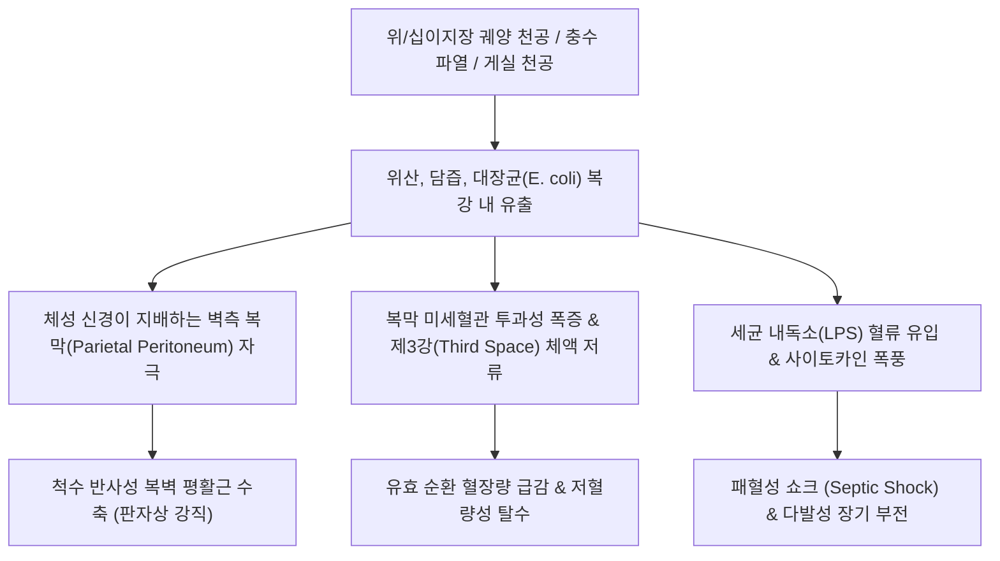
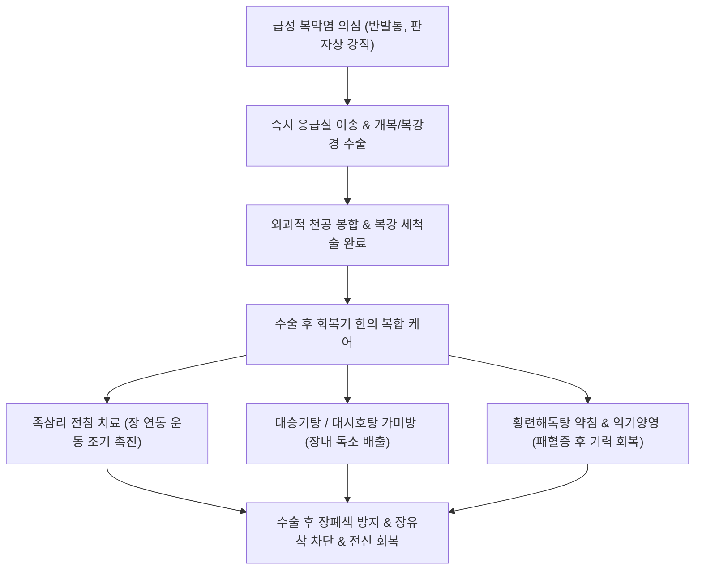

---
aliases:
  - 복막염
  - 급성 복막염
  - 범발성 복막염
  - Peritonitis
  - 급성 복증
  - 패혈성 복막염
tags:
  - 이론
  - 질환
  - 소화기질환
  - 응급질환
categories:
  - 질환
  - 소화기 질환
created: 2024-01-21
updated: 2026-09-24
title: 복막염
date: 2026-09-24
출처: "PMID: 28702076"
---

# 복막염 (Peritonitis / 腹膜炎, K65)

> **상위 분류**: [[소화기 질환]] > [[복막 및 복강 질환]] > [[급성 복증]]
> **핵심 3줄 요약 (Key Summary)**:
> -> 📍 병소 부위 & 해부·병태생리: 복강 내 장기와 복벽 내면을 덮고 있는 장측(Visceral) 및 벽측(Parietal) 복막에 발생하는 광범위 미만성 염증. [[위궤양]]·[[십이지장 궤양]] 천공, 급성 충수염 파열, [[장폐색]] 및 게실 천공 등으로 인한 세균 및 소화액의 복강 내 유출(이차성 복막염)이 대다수를 차지함.
> - 🚩 전형적 임상 양상 & 3대 징후: 배 전체를 찌르는 듯한 극심한 돌발성 [[복통]], 환자가 몸을 조금도 움직이지 못하는 부동 자세, 복벽을 눌렀다 뗄 때 극통이 유발되는 **반발통(Rebound tenderness, Blumberg sign)** 및 판자처럼 딱딱해지는 **판자상 복벽 강직(Board-like rigidity)**.
> - 🛠️ 핵심 감별 검사 & 한·양방 다각적 치료 전략: 단순 흉부 X-ray(횡격막하 유리 가스 Free air 확인) 및 복부 CT, 즉각적인 금식·광범위 항생제 투여 및 응급 수술(천공 봉합 및 복강 세척술), 수술 후 장폐색(Postoperative Ileus) 예방을 위한 족삼리(ST36) 전침 치료 및 [[대승기탕]], [[대시호탕]], [[당귀수산]] 투여.
> - ⚠️ 응급 의뢰 레드플래그 & 악화 요인: **외과적 절대 응급 질환(Surgical Emergency)**. [[패혈증]]성 쇼크(혈압 저하, 빈맥, 핍뇨, 의식 저하), 반발통 및 복벽 강직 확인 시 한의원 내 침·약물 치료를 일체 금하고 즉시 119 구급대를 통해 상급병원 응급외과로 긴급 이송.

---

## 📌 목차
1. [질환 개요 & 해부학적 병태생리](#1-질환-개요--해부학적-병태생리)
2. [병태생리 메커니즘 & 생체역학적 악순환 네트워크](#2-병태생리-메커니즘--생체역학적-악순환-네트워크)
3. [임상 증상 & 이학적 검사(Physical Exam) 알고리즘](#3-임상-증상--이학적-검사physical-exam-알고리즘)
4. [감별 진단 매트릭스 (Differential Diagnosis)](#4-감별-진단-매트릭스-differential-diagnosis)
5. [한의 통합 치료 프로토콜 (침·약침·추나·한약)](#5-한의-통합-치료-프로토콜-침약침추나한약)
6. [재활 운동 & 생활습관 티칭 가이드](#6-재활-운동--생활습관-티칭-가이드)
7. [💡 사용자 진료실 핵심 필기 & 임상 노하우 (Melt-In 잔여 심화 집약)](#7--사용자-진료실-핵심-필기--임상-노하우-melt-in-잔여-심화-집약)
8. [출처 및 학술 참고 문헌 (References)](#8-출처-및-학술-참고-문헌-references)

---

## 1. 질환 개요 & 해부학적 병태생리

![[복막염_기복증_장천공_복부X선_소견.jpg|500]]
> [그림 1: ① 병태생리·영상 — 소화관 천공으로 인한 복강 내 유리 가스(기복증, Pneumoperitoneum) 측와위 복부 X선 소견 — Wikimedia Commons]

- **개념 정의 및 임상적 중대성**:
  - [[복막염]](Peritonitis)은 단층 편평상피세포(중피세포)로 덮인 복강 장막(Serosa)인 복막에 세균 감염이나 화학적 자극 물질이 침투하여 급성 광범위 염증 반응을 일으키는 질환이다.
  - 전신성 염증 반응 증후군(SIRS)과 패혈성 쇼크(Septic shock), 다발성 장기 부전(MODS)으로 급격히 악화되어 사망률이 10~30%에 달하는 대표적인 외과적 응급 질환이다.
- **복막의 해부학과 이중 신경 지배**:
  - **장측 복막 (Visceral peritoneum)**: 내장 장기 표면을 감싸고 있으며 자율신경계(내장 신경)의 지배를 받는다. 절단이나 화상에는 통증을 느끼지 못하지만 신전이나 팽창, 허혈에 둔하고 위치가 불분명한 둔통(Visceral pain)을 전달한다.
  - **벽측 복막 (Parietal peritoneum)**: 복벽 내면과 횡격막, 골반저를 감싸고 있으며 **체성 신경(Somatic sensory nerve, 늑간신경 및 횡격막신경)**의 지배를 받는다. 염증이 벽측 복막에 도달하면 통증의 양상이 극적으로 변화하여, 칼로 찌르는 듯한 날카롭고 국소화된 격통(Somatic pain)과 반사성 근육 경련이 발생한다.

---

## 2. 병태생리 메커니즘 & 생체역학적 악순환 네트워크

![[청강의감23_06_소화기계부종_복부부종.gif|500]]
> [그림 2: ② 관련 해부 구조물 — 복막(Peritoneum)의 벽측 및 장측 해부 구조와 복강 내 염증성 삼출액·복수 형성 기전] 대망(Omentum)의 염증 국소화 시도와 복막 모세혈관 확장 및 대량의 삼출액 누출.

### 1) 체성 신경계 전이와 격통의 발생 기전 (원문 필기 정합)
- 초기 소화관 질환(예: 단순 궤양이나 충수염) 단계에서는 내장 신경만 자극받아 명치 부위의 모호한 체기나 둔통으로 시작된다.
- 병변이 깊어져 **궤양이 장벽 전층을 뚫고 천공되어 화학 물질과 세균이 체성 신경계(Somatic nerve)가 분포하는 벽측 복막에 직접 접촉**하는 순간, 통증 회로가 자율신경계에서 척수 체성 신경으로 스위칭된다.
- 이로 인해 뇌에서는 신체의 절단에 필적하는 극심한 격통을 인지하며, 척수 반사로 인해 복부 전면 근육이 무의식적으로 수축하여 **판자상 복벽 강직(Board-like rigidity)**을 완성한다.

### 2) 제3강(Third Space) 체액 저류와 패혈증
- 복막의 표면적은 약 1.7~2.0 ㎡로 피부 표면적과 유사하다. 광범위 복막염이 발생하면 이 거대한 표면 전체의 모세혈관이 확장되면서 하루에 수 리터의 혈장성 단백 삼출액이 복강 내로 빠져나간다.
- 심각한 저혈량성 쇼크가 발생하며, 대장균(E. coli)과 혐기성 세균(B. fragilis)의 내독소가 전신 순환계로 쏟아져 들어가 패혈성 쇼크를 일으킨다.

---

## 3. 임상 증상 & 이학적 검사(Physical Exam) 알고리즘

### 1) 전형적인 복막염 3대 징후 (Physical Triad)
1. **반발통 (Rebound Tenderness, Blumberg Sign)**:
   - 복벽을 부드럽게 깊숙이 압박하고 있다가 손을 갑자기 뗄 때, 벽측 복막이 순간적으로 튕기며 환자가 비명을 지르는 특징적 유발통.
2. **복벽 강직 (Involuntary Guarding & Board-like Rigidity)**:
   - 환자가 힘을 빼려고 해도 복직근을 비롯한 복벽 전체가 나무판자처럼 단단하게 굳어 있어 손가락이 전혀 들어가지 않는 불수의적 반사 경직.
3. **복부 부동 및 장음 소실 (Silent Abdomen)**:
   - 환자는 숨을 쉴 때 복막이 움직이는 것조차 극심한 고통이므로 얕고 빠른 흉식 호흡을 하며, 다리를 가슴 쪽으로 웅크린 채 미동도 하지 않는다. 청진 시 마비성 장폐색으로 장음이 완전히 소실됨.

### 2) 응급 영상 및 진단적 접근
- **단순 흉부 X-ray (CXR, Erect)**:
  - 선 자세에서 우측 횡격막 아래에 초승달 모양으로 고이는 유리 가스인 **횡격막하 유리가스(Pneumoperitoneum / Free air)**를 확인하면 소화관 천공성 복막염 확진.
- **복부 CT (Abdominal CT)**:
  - 조영 증강 CT로 천공 부위, 복강 내 농양, 장관 허혈성 괴사 여부를 100% 정밀 평가.

---

## 4. 감별 진단 매트릭스 (Differential Diagnosis)

| 질환명 | 주 병태 및 양상 | 복부 진찰 소견 | 감별 핵심 검사 |
| :--- | :--- | :--- | :--- |
| **급성 복막염 (Peritonitis)** | 장기 천공, 세균성 감염 | **반발통 양성, 판자상 강직, 장음 소실** | 흉부 X-ray상 Free air, 복부 CT |
| **급성 췌장염 (Pancreatitis)** | 췌장 효소 자가소화, 등 방사통 | 심와부 심부 압통, 상체 숙이면 완화 | 혈청 Amylase/Lipase 3배 이상 |
| **급성 담낭염 (Cholecystitis)** | 담석 폐쇄, 우상복부 산통 | **Murphy sign 양성** (흡기 중단) | 복부 초음파(담낭벽 비후, 결석) |
| **복부 대동맥류 파열 (rAAA)** | 대동맥 파열, 박동성 종괴 | 저혈압 쇼크, 요통 동반 | 복부 혈관 CT, 초음파 |
| **장간막 허혈 (Mesenteric Ischemia)** | 장간막 동맥 색전, 장관 괴사 | **진찰 소견에 비해 극심한 통증 호소** | CT 혈관조영술(Angio-CT) |

---

## 5. 한의 통합 치료 프로토콜 (침·약침·추나·한약)

![[청강의감10_03_산통_극심통증_도해.jpg|500]]
> [그림 3: ③ 치료·시술점 — 급성 복부 산통(Colic)의 병태 및 침구·한약 완화 치료점] 응급 수술 적응증 배제 후, 또는 수술 후 회복기 장유착 방지 및 장마비 해소(Postoperative Ileus) 혈위.

한의학에서 복막염의 병태는 급심통(急心痛), 결흉(結胸), 복통(腹痛), 장옹(腸癰)의 극기(極期)에 해당하며, 열독내성(熱毒內盛), 어혈조락(瘀血阻絡), 양명부실(陽明腑實)로 변증한다.

> ⚠️ **치료 대원칙**: 급성 활동기 복막염은 외과 수술이 유일한 근본 치료법이다. 한의학적 치료는 **1) 수술 전 절대 금기(즉시 전원)**이며, **2) 외과 수술 후 장마비(Postoperative Ileus) 해소 및 장관 유착 방지, 패혈증 후 기력 회복 단계에서 통합 의학적으로 적용**된다.

### 1) 수술 후 장마비 해소 침구 치료
- **족삼리(ST36) 전침 요법 (임상 최강 근거)**:
  - 수술 직후 족삼리(ST36)와 상거허(ST37)에 2~10 Hz 저주파 전침을 30분간 적용하면 미주신경-장관 신경계를 흥분시켜 **수술 후 최초 방귀(Flatus) 배출 및 장음 회복 시간을 24~48시간 이상 단축**시킴.
- **내관(PC6), 공손(SP4)**: 수술 후 발생하는 오심, 구토를 억제.

### 2) 수술 후 한약물 요법
- **양명부실(陽明腑實) 및 장마비(Ileus)**: [[대승기탕]](大承氣湯) 또는 대시호탕(大柴胡湯)을 위장관 튜브로 주입하거나 복용시켜 장내 잔여 독소와 가스를 하방으로 배출.
- **비위허약 및 장유착 예방**: 수술 1주일 후 염증이 가라앉으면 사군자탕에 목향, 후박, 진피를 가미한 분심기음(分心氣飲) 계열을 투여하여 소화 흡수능 복구.

---

## 6. 재활 운동 & 생활습관 티칭 가이드

- **수술 후 조기 보행 (Early Ambulation)**:
  - 수술 다음 날부터 침상에서 일어나 걷는 조기 보행을 시행하여 복강 내 장기 간의 섬유성 유착을 물리적으로 방지.
- **단계적 식이 진행 (Stepwise Diet)**:
  - 장음이 정상 청진되고 가스가 배출된 후 미음 → 죽 → 부드러운 일반식으로 단계적 진행.
  - 고섬유질, 딱딱한 음식, 가스 생성 식품(콩, 양배추)은 수술 후 최소 1달간 절제.

---

## 7. 💡 사용자 진료실 핵심 필기 & 임상 노하우 (Melt-In 잔여 심화 집약)

### 1) 복막염 극통 발생의 신경해부학적 기전 (원문 필기 정본)
- **원문 필기 100% 보존**:
  - **"궤양이 심해져 체성 신경계까지 손상되었을 때, 통증이 극심하게 나타남"**
- **진료실 병태생리 고찰**:
  - 위장관 내벽 점막이나 장측 복막에 국한된 궤양은 자율신경(내장 신경 C-fiber)을 자극하므로 통증이 은은하고 둔탁하여 환자가 참을 수 있다.
  - 그러나 궤양이 장벽 전층을 뚫고 천공되어 위산, 펩신, 세균성 삼출액이 **체성 신경(Somatic sensory nerve A-delta fiber)이 밀집된 벽측 복막(Parietal peritoneum)을 직접 건드리는 순간**, 신경 전달 속도가 수십 배 빨라지고 국소 염증성 화상이 발생하면서 환자가 쇼크에 빠질 정도의 극심한 통증(Somatic parietal pain)이 격발된다.

### 2) 1차 진료 현장 10초 복막염 감별 테스트
- **발뒤꿈치 충격 검사 (Heel Drop Test / Markle Sign)**:
  - 환자를 똑바로 서게 한 후 발뒤꿈치를 3cm 정도 들었다가 바닥으로 쿵 하고 떨어뜨리게 한다. (누워있는 환자는 침대를 발밑에서 툭 걷어찬다).
  - 복막염 환자는 복벽이 진동하면서 벽측 복막이 출렁이는 순간 배를 부여잡고 극심한 통증으로 주저앉는다. 이 검사가 양성이면 반발통 검사를 세게 누를 필요도 없이 즉시 119를 불러야 한다.

---

## 8. 출처 및 학술 참고 문헌 (References)

1. Sartelli M, Chichom-Mefire A, Labricciosa FM et al. (2017). The management of intra-abdominal infections from a global perspective: 2017 WSES guidelines for management of intra-abdominal infections. *World J Emerg Surg*, 12:29. [PMID: 28702076](https://pubmed.ncbi.nlm.nih.gov/28702076/)
   - [연구 요약]: 복강 내 감염 및 이차성 복막염의 글로벌 위험 계층화, 패혈증 관리, 응급 수술적 감염원 제어(Source control) 및 항생제 요법 가이드라인.
2. Ross JT, Matthay MA, Harris HW (2018). Secondary peritonitis: principles of diagnosis and intervention. *BMJ*, 361:k1407. [PMID: 29914871](https://pubmed.ncbi.nlm.nih.gov/29914871/)
   - [연구 요약]: 이차성 복막염의 임상적 징후(반발통, 판자상 강직), 신속한 진단 검사, 수액 소생술 및 외과적 개입 원칙을 체계화한 BMJ 임상 리뷰.
3. Meng Q, Guo L, Xiao H et al. (2021). Acupuncture for postoperative ileus: A systematic review and meta-analysis of randomized controlled trials. *Integr Med Res*, 10(4):100742. [PMID: 34189035](https://pubmed.ncbi.nlm.nih.gov/34189035/)
   - [연구 요약]: 복부 수술 후 장마비(Postoperative ileus) 환자에서 족삼리(ST36) 침 치료가 위장관 연동 운동 회복, 가스 배출 시간 단축 및 재입원율 감소에 미치는 유의한 효과를 입증한 무작위 대조군 메타분석.

<!-- 보관 태그(1회용·링크오류, 필요시 복원): 복막염, 급성복증 -->
