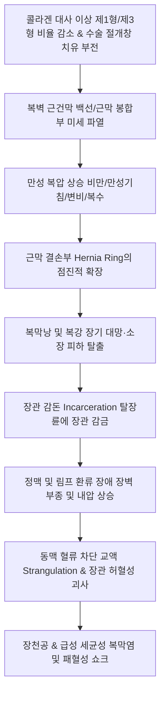

# 🩺 복벽 탈장 (Ventral Hernia, 腹壁ヘルニア)

> **핵심 3줄 요약 (Key Summary)**:
> - 📍 **병소 부위 & 해부·병태생리**: 서혜부(서혜관·대퇴관)와 횡격막을 제외한 전복벽 및 측복벽의 근막·건막(백선, 제대륜, 반월선, 이전 수술 절개창) 결손 부위를 통해 복강 내 장기(대망, 소장, 결장)가 복막낭을 동반하여 피하로 돌출하는 해부학적 질환군이다.
> - 🚩 **전형적 임상 양상**: 기립하거나 기침·배변 등 복압 상승 시 돌출되고 앙와위에서 자연 환원되는 무통성 또는 둔통성 복벽 종괴가 주증상이나, 결손부에 장관이 감돈(incarceration)되면 급성 복통과 팽만, 장폐색 증상이 발생한다.
> - 🛠️ **핵심 검사 & 치료 전략**: 기립위/발살바 수기 이학적 촉진 및 복부 조영 CT(결손 크기, 탈장 내용물, 감돈 유무 평가의 표준)로 진단하며, 성인 유증상 탈장은 인공망(mesh)을 이용한 무장력 복강경/개복 복벽성형술이 완치 표준이다. 한의 임상에서는 수술 전후 비기허약(脾氣虛弱), 중기하함(中氣下陷) 변증 한약([[보중익기탕]])과 침구 요법, 복압 관리 티칭을 적용한다.
> - ⚠️ **응급 의뢰 레드플래그**: 탈장 부위의 갑작스러운 극심한 통증과 함께 손으로 밀어 넣어도 들어가지 않는 환원 불능(irreducible incarceration), 국소 피부 발적·열감(교액 strangulation 의심), 장폐색 징후(담즙성 구토, 복부 팽만, 가스 배출 중단) 확인 시 장 괴사 및 천공 복막염을 방지하기 위해 6시간 이내 응급 수술을 받도록 3차 상급병원 외과로 즉각 전원한다.

---

## 📌 목차
1. [질환 개요 & 해부학적 병태생리](#1-질환-개요--해부학적-병태생리)
2. [병태생리 메커니즘 & 생체역학적 악순환 네트워크](#2-병태생리-메커니즘--생체역학적-악순환-네트워크)
3. [임상 증상 & 이학적 검사(Physical Exam) 알고리즘](#3-임상-증상--이학적-검사physical-exam-알고리즘)
4. [감별 진단 매트릭스 (Differential Diagnosis)](#4-감별-진단-매트릭스-differential-diagnosis)
5. [한의 통합 치료 프로토콜 (침·약침·추나·한약)](#5-한의-통합-치료-프로토콜-침약침추나한약)
6. [양방 치료 & 병용·의뢰 기준 (Conventional Treatment & Referral)](#6-양방-치료--병용의뢰-기준-conventional-treatment--referral)
7. [재활 운동 & 생활습관 티칭 가이드](#7-재활-운동--생활습관-티칭-가이드)
8. [💡 사용자 진료실 핵심 필기 & 임상 노하우 (Melt-In 잔여 심화 집약)](#8--사용자-진료실-핵심-필기--임상-노하우-melt-in-잔여-심화-집약)
9. [출처 및 학술 참고 문헌 (References)](#9-출처-및-학술-참고-문헌--references)

---

## 1. 질환 개요 & 해부학적 병태생리

복벽 탈장(Ventral Hernia)은 전복벽 및 측복벽의 근건막성 복벽(musculoaponeurotic abdominal wall)에 발생한 결손(defect)을 통해 복강 내 장기가 탈출하는 모든 질환을 포괄하는 임상적 총칭이다. 서혜부 탈장(Inguinal/Femoral hernia)에 이어 두 번째로 흔한 탈장이며, 원발성(Primary)과 이차성/절개성(Incisional)으로 대별된다.

### 유럽탈장학회(EHS) 해부학적 분류 체계
1. **원발성 복벽 탈장 (Primary Ventral Hernia)**:
   - **제대 탈장 (Umbilical Hernia)**: 배꼽륜(umbilical ring)의 결손을 통한 탈장. 소아에서는 선천적 미폐쇄로 흔하나 대부분 4~5세 이내 자연 폐쇄되며, 성인에서는 임신, 복수(간경변), 비만으로 인해 후천적으로 발생한다.
   - **상복부 탈장 (Epigastric Hernia)**: 검상돌기(xiphoid process)와 배꼽 사이 정중선 백선(linea alba)의 건막 교차 섬유 결손으로 복막외 지방 또는 대망이 돌출.
   - **스피겔 탈장 (Spigelian Hernia)**: 복직근 외측연(반월선, linea semilunaris)과 궁상선(arcuate line)이 만나는 결합부 근막 결손을 통한 탈장. 복사근 건막 아래에 갇혀 있어 피하 돌출이 뚜렷하지 않아 진단이 늦어지기 쉽다.
2. **절개 탈장 (Incisional Hernia, 전체 복벽 탈장의 80% 이상)**:
   - 이전 개복 수술(laparotomy) 절개창 부위의 근막 치유 실패로 발생하는 의원성 합병증. 정중 절개창 개복 수술을 받은 환자의 약 10~20%에서 발생하며, 수술 부위 감염(SSI), 복벽 비만, 흡연, 고령, 스테로이드 사용이 주요 위험 인자이다.

---

## 2. 병태생리 메커니즘 & 생체역학적 악순환 네트워크

복벽 탈장의 근본 기전은 복벽 근막의 생화학적 구조적 취약성과 만성적인 기계적 복압 증가가 결합된 '복벽 부전(abdominal wall failure)'이다.

### 병태생리 3단계 악순환
1. **콜라겐 분자 구조의 이상**: 복벽 탈장 환자는 정상인에 비해 장력(tensile strength)을 담당하는 제1형 콜라겐(Collagen type I) 합성이 저하되고, 미성숙하고 약한 제3형 콜라겐(Collagen type III)의 비율이 증가되어 있어 근막의 본질적인 결합력이 약화되어 있다.
2. **라플라스의 법칙(Laplace's Law)**: 결손 구멍(hernia ring)이 커질수록 결손 변연부 근막에 가해지는 장력이 기하급수적으로 증가하여, 기침이나 기립 시 결손이 스스로를 더 찢어 확장시키는 악순환을 형성한다.
3. **감돈(Incarceration)에서 교액(Strangulation)으로의 급속한 전환**: 좁고 단단한 근막 링을 통해 빠져나온 소장 분절이 갇히면, 장벽의 정맥 울혈과 부종이 급격히 진행되어 장 내경이 팽창한다. 이는 링의 압박력을 가중시켜 종국에는 장간막 동맥 혈류를 차단, 수시간 내에 장 괴사와 천공을 초래한다.

---

## 3. 임상 증상 & 이학적 검사(Physical Exam) 알고리즘

### 임상 양상 (Clinical Features)
- **전형적 증상**:
  - 서 있거나 걸을 때, 배에 힘을 줄 때 복벽에 부드러운 덩어리가 튀어나오고, 누워서 쉬거나 손으로 밀어 넣으면 꼬르륵(gargling) 소리와 함께 쉽게 들어감.
  - 환자가 "배에 말랑말랑한 혹이 만져진다", "오래 서 있으면 배가 묵직하고 당긴다"고 호소.
- **급성 합병증 증상 (감돈 및 교액)**:
  - 통증의 급변: 무통성이던 혹 부위가 갑자기 쥐어짜듯 극심하게 아파짐.
  - 환원 불능: 손으로 아무리 밀어 넣어도 들어가지 않고 단단하게 굳어짐.
  - 전신 및 폐색 징후: 오심, 담즙성 구토, 배가 풍선처럼 부풀어 오름, 방귀와 대변 배출 완전 중단, 고열 및 저혈압.

### 이학적 검사 프로토콜
1. **시진 및 촉진 (기립위 & 앙와위 비교)**:
   - 환자를 세운 상태에서 복벽 종괴의 위치(백선, 배꼽, 수술 흉터)와 크기를 관찰하고, 기침을 시켜 기침 충격(cough impulse)을 촉진한다.
   - 앙와위로 눕힌 후 부드러운 수기 환원(taxis)을 시도하여 쉽게 들어가는지(환원성 reducible) 확인한다.
2. **복직근 이개(Diastasis Recti)와의 감별 검사 (Carnett 징후 응용)**:
   - 환자가 누운 상태에서 머리와 어깨를 들어 올리게 할 때(복근 긴장), 단순 복직근 이개는 흉골 하부에서 배꼽까지 백선 전체가 길쭉한 능선 모양으로 불룩 솟아오르지만 진정한 탈장낭(hernia sac)이나 결손 구멍은 촉진되지 않는다.
3. **복부 조영 전산화단층촬영 (Abdominal CT, 영상 골드 스탠다드)**:
   - 복벽 근막 결손의 정확한 가로/세로 직경, 탈장낭 내부 장기(대망 vs 소장 vs 결장), 장벽 비후 및 조영 증강 결손(허혈 징후), 수술 후 재발 여부를 확진.

---

## 4. 감별 진단 매트릭스 (Differential Diagnosis)

| 감별 질환 | 호발 원인 / 병력 | 종괴의 특성 및 위치 | 촉진 및 기침 충격 | 감별 핵심 포인트 (Discriminator) |
| :--- | :--- | :--- | :--- | :--- |
| **복벽 탈장 (Ventral Hernia)** | 수술 흉터, 고령, 비만, 임신 | 백선, 배꼽, 수술창 피하 종괴 | **기침 충격 양성**, 앙와위 시 환원 | 근막 결손 링(ring) 촉진, CT 상 복강 장기 피하 탈출 |
| **복직근 이개 (Diastasis Recti)** | 출산 여성, 중년 남성 비만 | 백선 중앙 세로 방향 능선상 융기 | 기침 시 융기하나 **근막 결손 링 없음** | 복막낭 및 장기 탈출 없음, 감돈 위험 0%, 수술 적응증 아님 |
| **복벽 지방종 (Lipoma)** | 전 연령 | 복벽 피하 지방층 단일 결절 | 기침 충격 음성, 자세 변화에 무관 | 자세나 복압과 무관하게 항상 일정 크기, 근막 결손 없음 |
| **복벽 혈종 (Rectus Sheath Hematoma)** | 항응고제 복용, 심한 기침 후 | 복직근 내 급성 동통성 종괴 | **Carnett 징후 양성** (복근 긴장 시 통증 지속) | 외상/기침 후 급성 발병, 에코/CT 상 혈종, 환원되지 않음 |
| **피지낭종 / 표피낭종 (Epidermoid Cyst)** | 피지선 분포 부위 | 피부 표재성 단단한 구진/결절 | 중심부 개구부(punctum) 관찰 | 피부와 밀착, 짜면 분비물 배출, 복압과 무관 |
| **복벽 데스모이드 종양 (Desmoid Tumor)** | 가임기 여성, 개복 수술력 | 복벽 근막 유래 무통성 단단한 종괴 | 단단하게 고정, 환원 불능 | 근막 섬유종증, 침윤성 성장, 복벽 심부 고정 |

---

## 5. 한의 통합 치료 프로토콜 (침·약침·추나·한약)

한의학에서 복벽 탈장은 비위(脾胃)의 기운이 쇠약해져 내장과 기육(筋肉)을 들어 올리고 단단하게 지탱하는 힘이 무너진 **비기허약(脾氣虛弱), 중기하함(中氣下陷), 기산(氣疝), 호산(狐疝)**의 범주로 다룬다.

> 🎯 **한의 임상 적용 범위**:
> 1. **급성 감돈·교액 환자는 수술이 절대적이며 한의 치료의 대상이 아니다.**
> 2. 고령, 중증 내과적 질환(심부전, 만성 신부전 등)으로 양방 수술이 불가능한 환자의 보존적 증상 완화.
> 3. 탈장 수술 전후 비위 기능 강화 및 수술 후 창상 치유 촉진, 장폐색 예방, 재발 방지를 목표로 한다.

### 1) 침구 치료 (Acupuncture & Moxibustion)
- **주요 혈위**:
  - [[백회]](GV20): 독맥의 교회혈, 승제중기(升提中氣)하여 처진 기운을 끌어올림.
  - [[기해]](CV6) & [[관원]](CV4): 원기를 북돋우고 하복부 복벽 근력을 보강.
  - [[중완]](CV12): 위의 모혈, 비위 소화기능 증진 및 장내가스 감축.
  - [[천추]](ST25): 대장의 모혈, 복벽 측면 순환 및 복직근 긴장도 조절.
  - [[족삼리]](ST36): 보기건비(補氣健脾), 소화관 연동 기능 정상화.
  - [[대돈]](LR1) & [[태충]](LR3): 족궐음간경의 혈위로 산기(疝氣) 통증 완화 원위 취혈.
- **뜸 치료 (간접구/신기구)**: 백회, 관원, 신궐(배꼽 탈장 결손부 직접 뜸은 화상·감염 위험으로 금하며 원위 취혈)에 온구 요법을 시행하여 중기하함을 승제(升提).

### 2) 약침 치료 (Pharmacopuncture)
- **주입 부위**: 족삼리, 비수(BL20), 위수(BL21), 대장수(BL25). (탈장낭 자체 자침은 절대 금기).
- **자하거약침(Hominis Placenta)**: 고령 환자의 정혈 부족 및 근육 결합조직 탄력 저하 개선, 족삼리·비수에 0.5cc 주입.
- **황련해독탕 약침**: 만성 변비로 인한 복압 상승 조절을 위해 복부 배수혈에 적용.

### 3) 추나요법 및 도수 기법 (Chuna & Manual Therapy)
- **골반-복부 이완 기법**: 골반의 전방경사(anterior tilt) 및 요추 과전만을 교정하여 복벽 전면으로 쏠리는 내장 부하 축을 분산.
- **내장기 완화 도수 (Visceral Mobilization)**: 앙와위에서 소장과 결장의 유착을 완만하게 이완하고 장관 연동을 도와 만성 복부 팽만을 경감시킴 (결손부 직접 압박 금지).

### 4) 한약 치료 (변증별 방제)
- **비기허약·중기하함형(脾氣虛弱·中氣下陷型)**: 노년기 또는 다산 여성으로 기운이 없고 말하기 귀찮으며 식후 배가 묵직하게 처지고 대변이 무른 경우.
  - [[보중익기탕]](補中益氣湯) 가감: 승마, 시호가 승제(升提) 작용을 하여 복벽과 내장을 지탱하는 긴장도를 개선.
- **한산·기체어혈형(寒疝·氣滯瘀血型)**: 날씨가 춥거나 피로할 때 탈장 부위가 뻐근하게 당기며 아픈 만성 둔통형.
  - 천태오약산(天台烏藥散) 또는 [[오적산]](五積散) 가 오약, 소회향: 온경산한(溫經散寒), 행기지통(行氣止痛).
- **비위허약·수척형(脾胃虛弱·瘦瘠型)**: 수술 후 상처 치유가 더디고 기력이 쇠진한 경우.
  - [[삼령백출산]](參苓白朮散) 또는 십전대보탕: 기육(筋肉) 생성을 돕고 콜라겐 합성 환경 조성.

---

## 6. 양방 치료 & 병용·의뢰 기준 (Conventional Treatment & Referral)

### 1) 표준 양방 수술 치료 (Surgical Management)
- **수술 원칙**: 성인의 유증상 복벽 탈장은 결손이 저절로 닫히지 않으며 시간이 지날수록 점진적으로 결손이 커지고 감돈 위험이 증가하므로, 수술적 교정이 유일한 완치법이다.
- **무장력 인공망 탈장성형술 (Tension-free Mesh Hernioplasty)**:
  - 단순 봉합술은 재발률이 30~50%에 달하므로, 현대 외과에서는 반드시 합성 메쉬(Polypropylene, Polyester)를 덧대어 결손부를 보강한다.
  - **수술 방식**:
    - 개복 근육후방 메쉬 삽입술 (Open Sublay / Rives-Stoppa repair): 가장 재발률이 낮고 표준적인 방식.
    - 복강경 복막내 메쉬 거치술 (Laparoscopic IPOM): 흉터가 작고 회복이 빠름.
    - 로봇 복벽재건술 (Robotic TAR): 거대 복벽 결손 환자에서 복벽 근육을 분리 재배치하여 복벽 구조를 완벽 복원.

### 2) 한의 병용 판단 및 주의사항
- **수술 전 컨디셔닝**: 고령 환자의 수술 전 심폐 기능 강화와 영양 개선, 만성 변비 치료를 위해 보중익기탕 투여.
- **수술 후 유착성 장폐색 예방**: 개복 수술 후 장 마비(ileus) 완화를 위해 대건중탕(大建中湯) 병용 시 장관 운동 조기 회복에 도움.
- **복대(Abdominal Binder) 착용 지도**: 수술 후 4~6주간 복대를 착용하여 메쉬 안착을 돕고 복벽 장력을 보호하도록 지도.

### 3) 양방 전문과 및 응급 의뢰 기준
- **🚨 6시간 이내 즉각 외과 응급 전원 (급성 교액 Strangulation 의심 시)**:
  1. 탈장 덩어리가 단단해지며 극심한 통증 발생.
  2. 앙와위에서 부드럽게 눌러도 전혀 들어가지 않음 (Incarcerated).
  3. 탈장 부위 피부가 붉어지거나 자주색으로 변함.
  4. 복부 팽만, 장음 소실, 담즙성 구토 등 장폐색 징후 동반.
  -> 방치 시 소장 괴사로 장절제 및 인공항문(장루) 수술이 불가피하므로 즉시 응급 수술 의뢰!
- **정규 외과 의뢰**: 성인 제대 탈장, 2cm 이상의 백선 탈장, 수술 흉터 부위의 진행성 절개 탈장 확인 시.

---

## 7. 재활 운동 & 생활습관 티칭 가이드

### 1) 복압 급증 방지 3대 수칙
- **변비 철저 관리**: 매일 충분한 수분(2L)과 식이섬유를 섭취하고 필요시 완화제를 사용하여 배변 시 과도하게 힘주는 행위 금지.
- **만성 기침 치료**: 흡연 중단 및 만성 기관지염, 알레르기 비염 적극 치료.
- **중량물 운반 제한**: 무거운 물건을 들어 올리는 행위 절대 금지. 물건을 들 때는 허리를 굽히지 말고 무릎을 굽혀 다리 힘으로 들기.

### 2) 체중 감량
- 복부 내장비만은 복강내압을 지속적으로 상승시켜 탈장 발생 및 수술 후 재발의 1위 원인이 됨. 체질량지수(BMI) 25 이하 유지 목표.

### 3) 코어 심부 근육 운동
- 윗몸 일으키기(크런치, 싯업) 같은 복직근에 강한 압력을 가하는 운동은 탈장 결손을 더 찢으므로 절대 금기.
- 골반저근 및 복횡근 강화를 위한 부드러운 케겔 운동(Kegel)과 복부 드로인(Draw-in) 운동 시행.

---

## 8. 💡 사용자 진료실 핵심 필기 & 임상 노하우 (Melt-In 잔여 심화 집약)

1. **복직근 이개와 복벽 탈장의 결정적 촉진 감별**:
   - 중년 남성이나 출산 후 여성이 "배 한가운데가 불룩 튀어나온다"며 올 때, 침대에 눕혀 머리를 들게 해본다. 튀어나온 부위의 가장자리를 손가락 끝으로 눌렀을 때 단단한 근막 테두리 결손(구멍)이 만져지고 손가락이 쑥 들어가면 탈장이고, 결손 구멍 없이 복직근 사이 백선 전체가 팽팽하게 솟아오르면 단순 복직근 이개이다. 복직근 이개는 감돈 위험이 없으므로 환자를 안심시키고 코어 운동을 티칭한다.
2. **탈장낭 직접 자침의 절대적 금기**:
   - 복벽이 튀어나와 뻐근하다고 해서 탈장 덩어리 자체에 침을 놓거나 사혈을 하면 피하 바로 아래에 노출된 소장이나 대장벽을 직접 관통하여 분변성 복막염을 초래한다. 자침은 반드시 복벽 밖 원위 혈위(족삼리, 기해, 관원, 백회)에만 시술해야 한다.
3. **도수 환원(Taxis) 시 주의점**:
   - 감돈된 지 수시간이 지나 통증이 심하고 피부 열감이 있는 환자를 억지로 손으로 힘껏 밀어 넣으면(강제 환원), 이미 썩어서 터지기 직전인 장관을 복강 내로 밀어 넣어 복강 전체를 대변으로 오염시키는 대재앙(reduction en masse)이 일어날 수 있다. 통증이 극심한 환원은 절대 시도하지 말고 즉시 외과 응급실로 보내야 한다.

---

## 9. 출처 및 학술 참고 문헌 (References)

1. **Muysoms FE, et al. (2009)**. Classification of primary and incisional abdominal wall hernias. *Hernia*, 13(4):407-414. [PMID: 19495920](https://pubmed.ncbi.nlm.nih.gov/19495920/)

2. **Petro CC, et al. (2023)**. Transfascial Fixation vs No Fixation for Open Retromuscular Ventral Hernia Repairs: A Randomized Clinical Trial. *JAMA Surgery*, 158(8):799-806. [PMID: 37342018](https://pubmed.ncbi.nlm.nih.gov/37342018/)

---

## 관련 노트

- [[서혜부 탈장]]
- [[열공 탈장]]
- [[장폐색]]
- [[복막염]]
- [[소화성 궤양]]
- [[만성 변비]]
- [[보중익기탕]]
