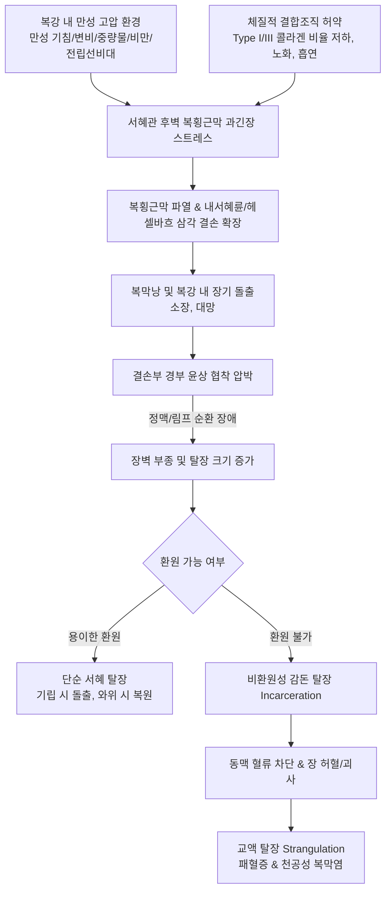

# 🩺 사타구니 탈장 (Inguinal Hernia, 鼠蹊部 脫腸)

> **핵심 3줄 요약 (Key Summary)**:
> - 📍 병소 부위 & 해부·병태생리: 복벽 하부 서혜관(inguinal canal) 부위 결함으로 복막낭 및 복강 내 장기(소장·대망)가 돌출됨. 간접 탈장(내서혜륜을 통한 초상돌기 미폐쇄), 직접 탈장(헤셀바흐 삼각 부위 복벽 허약), 대퇴 탈장(대퇴관 돌출)으로 구분.
> - 🚩 전형적 임상 양상: 기립·복압 상승 시 서혜부 팽윤 및 묵직한 둔통, 와위 시 저절로 환원됨. 감돈(incarceration) 및 교액(strangulation) 발생 시 격렬한 국소 통증, 복막자극 징후, 장폐색 증상 급발.
> - 🛠️ 핵심 검사 & 치료 전략: 기립위 이학적 진찰(기침 시 손가락 끝 충격파 확인) 및 복부 초음파/CT. 증상 있는 탈장은 외과적 탈장교정술(Lichtenstein 무인장 수술, 복강경 TAPP/TEP)이 표준이며, 경증·무증상은 대기 관찰(watchful waiting) 가능. 한의학적으로 중기하함(中氣下陷), 한산(寒疝) 변증 하에 보중익기탕, 천태오약산 및 승제(升提) 약침·추나 치료 적용.
> - <font color="#fa7e7e">⚠️ 응급 의뢰 레드플래그: 손으로 환원되지 않는 단단한 서혜부 종괴, 피부 발적 및 괴사 의심, 극심한 산통(colic pain), 발열, 구토, 장음 소실을 동반한 장폐색 의심 시 6시간 이내 응급 개복/복강경 수술 의뢰 필수.</font>

---

## 📌 목차
1. [질환 개요 & 해부학적 병태생리](#1-질환-개요--해부학적-병태생리)
2. [병태생리 메커니즘 & 생체역학적 악순환 네트워크](#2-병태생리-메커니즘--생체역학적-악순환-네트워크)
3. [임상 증상 & 이학적 검사(Physical Exam) 알고리즘](#3-임상-증상--이학적-검사physical-exam-알고리즘)
4. [감별 진단 매트릭스 (Differential Diagnosis)](#4-감별-진단-매트릭스-differential-diagnosis)
5. [한의 통합 치료 프로토콜 (침·약침·추나·한약)](#5-한의-통합-치료-프로토콜-침약침추나한약)
6. [양방 치료 & 병용·의뢰 기준 (Conventional Treatment & Referral)](#6-양방-치료--병용의뢰-기준-conventional-treatment--referral)
7. [재활 운동 & 생활습관 티칭 가이드](#7-재활-운동--생활습관-티칭-가이드)
8. [💡 사용자 진료실 핵심 필기 & 임상 노하우 (Melt-In 잔여 심화 집약)](#8--사용자-진료실-핵심-필기--임상-노하우-melt-in-잔여-심화-집약)
9. [출처 및 학술 참고 문헌 (References)](#9-출처-및-학술-참고-문헌-references)

---

## 1. 질환 개요 & 해부학적 병태생리

### 1) 정의 및 역학
사타구니 탈장(Inguinal Hernia)은 복강 내 장기(주로 [[소장]], 대망) 또는 복막외 지방조직이 서혜부 복벽의 선천적·후천적 약화 부위를 통해 탈출하는 질환이다. 전 복벽 탈장의 약 75%를 차지하며, 평생 유병률은 남성에서 약 27%, 여성에서 약 3%로 남성에서 압도적으로 호발한다. 소아기(선천성)와 50대 이후 노년기(후천성 결합조직 퇴화)의 양봉형(bimodal) 연령 분포를 보인다.

### 2) 서혜관의 해부학적 구조 (Inguinal Anatomy)
서혜관(inguinal canal)은 복벽을 비스듬히 관통하는 약 4cm 길이의 관으로, 남성에서는 정삭(spermatic cord)과 고환혈관, 여성에서는 자궁원인대(round ligament of uterus)가 통과한다.

| 구조 경계 | 구성 해부학적 구조물 | 임상적 의의 |
| :--- | :--- | :--- |
| **앞벽 (Anterior wall)** | [[복외사근]] 건막 (Aponeurosis of external oblique) | 전방 보강 구조, 외서혜륜(superficial ring) 개구 |
| **뒷벽 (Posterior wall)** | 복횡근막 (Transversalis fascia), 결합건 (Conjoint tendon) | 후천적 결손 및 약화의 주 부위 (직접 탈장 발생) |
| **지붕 (Roof / Superior)** | [[내복사근]] 및 복횡근의 궁형 섬유 (Arching fibers) | 근수축 시 밸브 기전(shutter mechanism) 형성 |
| **바닥 (Floor / Inferior)** | 서혜인대 (Inguinal ligament of Poupart), 열공인대 (Lacunar lig.) | 대퇴관과의 경계, 수술적 인공망(mesh) 고정 기준점 |
| **내서혜륜 (Deep ring)** | 하복벽동정맥 외측, 복횡근막의 난원형 결손 | 간접 탈장의 진입구 |
| **외서혜륜 (Superficial ring)**| 복외사근 건막의 삼각형 개구부 | 탈장낭의 체표 탈출구, 촉진 기준점 |

```
[서혜부 탈장 분류 해부학 도식]
                   [하복벽동정맥 (Inferior Epigastric Vessels)]
                               |
            (내측)             |             (외측)
     [헤셀바흐 삼각 영역]      |      [내서혜륜 (Deep Ring)]
     - 복횡근막 약화          |      - 초상돌기 미폐쇄 결함
     - 정삭 내측 돌출          |      - 정삭 내부를 따라 주행
             |                 |               |
             v                 |               v
      【직접 서혜 탈장】       |        【간접 서혜 탈장】
                               |
  -----------------------------+------------------------------
                 [서혜인대 (Inguinal Ligament)]
  ------------------------------------------------------------
                               |
                               v
                       [대퇴관 (Femoral Ring)]
                       - 대퇴정맥 내측, 열공인대 외측
                       - 좁고 견고한 입구 -> 최고 교액 위험
                               |
                               v
                        【대퇴 탈장 (Femoral)】
```

### 3) 3대 사타구니 탈장의 아형 비교
1. **간접 서혜 탈장 (Indirect Inguinal Hernia, 60~70%)**:
   - 하복벽혈관의 **외측(lateral)**에 위치한 내서혜륜을 통해 진입.
   - 선천적으로 고환 하강 후 닫혀야 할 복막초상돌기(processus vaginalis)의 불완전 폐쇄가 주원인.
   - 탈장낭이 정삭막 내부에 싸인 채 음낭(scrotum) 또는 대음순까지 길게 내려감.
2. **직접 서혜 탈장 (Direct Inguinal Hernia, 25~30%)**:
   - 하복벽혈관의 **내측(medial)**, 즉 복직근 외측연, 서혜인대, 하복벽동맥으로 둘러싸인 **헤셀바흐 삼각(Hesselbach's triangle)**의 복횡근막 결손을 통해 직접 전방으로 돌출.
   - 주로 노화, 교원질 대사 이상, 흡연, 만성 복압 상승에 의한 후천적 근막 약화. 음낭으로 들어가는 경우는 드묾.
3. **대퇴 탈장 (Femoral Hernia, 2~5%)**:
   - 서혜인대 하부, 대퇴혈관초 내측의 좁은 **대퇴관(femoral canal)**을 통해 돌출.
   - 골반이 넓은 고령 여성에서 호발하며, 경부가 매우 좁고 단단하여 감돈 및 교액 위험이 30~40%에 달해 발견 즉시 조기 수술 필요.

---

## 2. 병태생리 메커니즘 & 생체역학적 악순환 네트워크

### 1) 결합조직 취약성 & 콜라겐 비율 역전
탈장 환자의 복벽 조직 생검 연구에 따르면, 결합조직의 인장 강도를 담당하는 제1형 콜라겐(Type I collagen)의 합성이 저하되고, 신축성은 있으나 파열에 취약한 제3형 콜라겐(Type III collagen)의 비율이 유의하게 증가한다. 또한 매트릭스 메탈로프로테이나제(MMP-2, MMP-9)의 과발현 및 콜라겐 분해 항진이 복횡근막의 점진적 파탄을 유발한다.

### 2) 생체역학적 악순환 (Biomechanical Vicious Cycle)


### 3) 신경 포착 및 견인통 메커니즘
서혜관을 주행하는 신경들이 탈장낭에 의해 압박되거나 수술 후 반흔/인공망에 의해 포착될 때 극심한 신경병증성 만성 통증(chronic groin pain / inguinodynia)이 유발된다.
- **장골하복신경 (Iliohypogastric nerve, L1)**: 하복부 치골 상부 감각 이상 및 둔통.
- **장골서혜신경 (Ilioinguinal nerve, L1)**: 서혜부 기저부, 음낭 기저부/대음순 상부, 대퇴 내측 상부의 찌릿한 방사통.
- **음부대퇴신경 음부지 (Genital branch of genitofemoral nerve, L1-L2)**: 고환 거근(cremaster muscle) 지배 및 음낭/음순 피부 감각 전달, 고환 견인통.

---

## 3. 임상 증상 & 이학적 검사(Physical Exam) 알고리즘

### 1) 자각 증상 및 병력 청취
- **초기/단순 탈장**: 기립, 보행, 무거운 물건 들기, 배변 시 서혜부 또는 음낭으로 덩어리가 불룩 튀어나오며 뻐근하고 묵직한 당김감(dragging sensation) 호소. 누우면 스르륵 들어가거나 손으로 누르면 꼬르륵 소리와 함께 복강 내로 환원됨.
- **진행기/감돈 탈장**: 탈장 부위가 단단해지고 압통이 심해지며 손으로 밀어 넣어도 들어가지 않음.
- **교액 탈장 (외과적 응급)**: 격렬한 복통 및 서혜부 동통, 오심, 구토, 복부 팽만, 장음 항진 후 소실, 발열, 탈장 부위 피부가 붉거나 자줏빛으로 변색.

### 2) 이학적 진찰 (Physical Examination)
1. **시진 (Inspection)**:
   - 환자를 기립시킨 상태에서 양측 서혜부의 대칭성을 관찰.
   - 발살바(Valsalva) 수기 또는 가벼운 기침을 시켜 불룩 솟아오르는 종괴의 위치 확인 (서혜인대 상부 vs 하부).
2. **서혜관 촉진 (Invagination Test, 검지 촉진법)**:
   - 환자가 서 있는 상태에서 검사자의 검지손가락으로 음낭 피부를 안쪽으로 밀어 올리며(invagination) 외서혜륜을 찾아 진입.
   - 정삭을 따라 비스듬히 상외측(내서혜륜 방향)으로 진입한 후 환자에게 기침을 시킴.
   - **충격의 방향 판정**:
     - 손가락 **끝(fingertip)**을 툭 치는 느낌: 내서혜륜에서 주행하여 내려오는 **간접 서혜 탈장**.
     - 손가락 **옆면/바닥(pulp/side)**을 앞으로 밀어내는 느낌: 헤셀바흐 삼각에서 바로 밀고 나오는 **직접 서혜 탈장**.
3. **손가락 폐쇄 검사 (Zieman's Three-Finger Test)**:
   - 환자의 우측 서혜부 기준: 검지를 내서혜륜(간접 탈장), 중지를 외서혜륜/헤셀바흐 삼각(직접 탈장), 약지를 대퇴륜(대퇴 탈장)에 대고 기침 시 돌출 부위 동시 감별.

### 3) 영상 진단 (Imaging)
- **고해상도 초음파 (USG)**: 일차 검사로 매우 우수. 기립위 및 발살바 수기 시 복벽 결손부와 장간막/장관의 실시간 이동, 하복벽혈관과의 해부학적 위치 관계(외측 vs 내측) 명확히 규명.
- **복부-골반 CT (Valsalva CT)**: 진단이 모호한 경우, 재발성 탈장, 비만 환자, 대퇴 탈장 감별, 감돈에 의한 장폐색 및 장벽 허혈(장벽 비후, 조영 결손, 복수) 평가에 필수.

---

## 4. 감별 진단 매트릭스 (Differential Diagnosis)

| 질환명 | 주 호발 부위 및 특징 | 이학적 소견 & 감별 키포인트 | 영상 검사 소견 | 치료 원칙 |
| :--- | :--- | :--- | :--- | :--- |
| **간접 서혜 탈장** | 서혜인대 상외측, 음낭 연결 빈번 | 외서혜륜 촉진 시 손가락 끝 충격, 환원 시 딸깍음 | 초음파: 하복벽혈관 외측에서 탈출 | 복강경/개복 탈장교정술 |
| **직접 서혜 탈장** | 서혜인대 상내측 (헤셀바흐) | 외서혜륜 촉진 시 손가락 옆면 충격, 음낭 진입 드묾 | 초음파: 하복벽혈관 내측에서 전방 돌출 | 무인장 탈장교정술 |
| **대퇴 탈장** | **서혜인대 하부**, 난원와(fossa ovalis) | 치골결절 하외측에 작고 단단함, 교액 빈도 극히 높음 | 대퇴정맥 내측 결손 확인 | **즉각적 외과 수술** |
| **음낭수종 (Hydrocele)** | 고환 주변 음낭 내 액체 저류 | **투광 검사(Transillumination) 양성 (빛 통과)**, 상부 정삭 촉진 가능 | 초음파상 무에코(anechoic) 낭종 | 천자 또는 수종절제술 |
| **정계정맥류 (Varicocele)** | 좌측 음낭 호발 (90%) | 기립 시 "지렁이 뭉치" 촉진, 발살바 시 팽창, 투광 음성 | 도플러 초음파상 정맥류 역류 혈류 | 미세현미경 정계정맥류 결찰술 |
| **서혜부 림프절염** | 대퇴부/서혜부 림프절 | 결절이 단단하고 다발성, 하지 외상/감염 동반, 기침 무관 | 도플러상 림프절 문(hilum) 혈류 증가 | 원인 감염 항생제 치료 |
| **잠복고환 (Cryptorchidism)**| 서혜관 내 고환 정체 | 음낭 내 고환 미촉지, 서혜관 내 압통성 둥근 결절 | 초음파/MRI상 정체 고환 확인 | 고환고정술 |
| **서혜부 혈종/지방종** | 서혜관 주변 | 기침 시 크기 변화 없음, 체위 무관 고정 | 지방 밀도 종괴, 도플러 음성 | 경과 관찰 또는 절제 |

---

## 5. 한의 통합 치료 프로토콜 (침·약침·추나·한약)

> ⚠️ **한의 치료의 임상 한계 및 포지셔닝**:
> 복벽 결손이라는 해부학적 파열 자체는 외과적 수술(인공망 교정술)만이 근본 교정법이다. 그러나 **수술 전 대기 관찰 기간의 복압 완화 및 증상 경감**, **고령·기저질환으로 수술 불가능한 환자의 보존적 관리**, **수술 후 잔여 신경통·근육 긴장·재발 방지 생체역학 회복**에 한의 치료가 탁월한 역할을 수행한다.

### 1) 변증 감별 체계 (TCM Syndrome Differentiation)
1. **중기하함증 (中氣下陷證)**:
   - 원인: 비위 기허로 인해 승제(升提) 기능 상실, 만성 피로, 복벽 무력.
   - 증상: 서혜부 하수감, 기립 시 묵직한 하추감, 피로 시 악화, 식욕부진, 연변, 설담태백, 맥 완약.
   - 치법: 보기승제(補氣升提).
   - 대표 처방: **[[보중익기탕]] (補中益氣湯)** 가미.
2. **한산복통증 (寒疝腹痛證)**:
   - 원인: 한습(寒濕) 침범으로 간경(肝經) 맥락 수축 및 기혈 울체.
   - 증상: 서혜부 및 음낭의 냉통, 견인통, 온열 시 완화, 한랭 노출 시 악화, 설담태백활, 맥 침현지.
   - 치법: 온간산한(溫肝散寒), 행기지통(行氣止痛).
   - 대표 처방: **[[천태오약산]] (天台烏藥散)** 또는 **[[당귀사역탕]] (當歸四逆湯)** 가미.
3. **기체혈어증 (氣滯血瘀證)**:
   - 원인: 칠정울결 또는 과도한 노작으로 인한 기체혈어, 수술 후 반흔 유착통.
   - 증상: 서혜부 찌르는 듯한 통증, 야간통, 국소 경결, 설암자, 맥 현삽.
   - 치법: 활혈화어(活血化瘀), 이기지통(理氣止痛).
   - 대표 처방: **[[귤핵환]] (橘核丸)** 또는 **[[격하축어탕]] (膈下逐瘀湯)**.

### 2) 본초·약리 성분 배오 전략
- **승제(升提) 작용**: [[황기]] (보혈익기, 조직 재생), [[승마]]·[[시호]] (청양상승 기전 유도, 내장 하수 억제).
- **행기지통(行氣止痛) & 간경 소통**: [[목향]], [[오약]], [[지실]] (위장관 평활근 긴장도 조절 및 장관 가스 정체 해소), 소회향, 현호색.
- **수렴고삽(收斂固澁)**: [[백출]], [[복령]], 백하수오, [[작약]]·[[감초]] (복벽 근막 연축 완화).

### 3) 침구 치료 프로토콜
- **기본 혈위**: 
  - 서혜부 국소 및 간경/비경: [[곡천]](LR8), [[태충]](LR3), [[삼음교]](SP6), [[기충]](ST30), [[대돈]](LR1).
  - 승제 익기 혈위: [[백회]](GV20) - 뜸(간접구) 병행 시 상승 효과 극대화, [[관원]](CV4), [[기해]](CV6), [[족삼리]](ST36).
- **자침 기법**:
  - 서혜관 국소의 직접 자침은 장관 천공 및 고환동정맥 손상 위험이 있으므로 결손부 직자 금기.
  - 주변 복벽근육인 [[내복사근]], [[복횡근]], 치골결절 주변 건막 부착부에 사자(oblique insertion)하여 과긴장 이완 및 긴장도 균형 유도.
  - 전침 요법: [[족삼리]]-삼음교에 저주파(2Hz) 통전으로 전신 기력 증진 및 골반강 순환 개선.

### 4) 약침 치료 (Pharmacopuncture)
- **자하거(Hominis Placenta) 약침**: 복벽 근막 및 결합조직의 기혈 쇠약 환자에게 [[관원]], 기해, 삼음교에 주입하여 콜라겐 조직 영양 공급 및 재생 촉진.
- **중성어혈(Neutral Blood Stasis) 또는 황련해독탕 약침**: 수술 후 반흔 주변의 신경 포착성 찌릿한 염증성 통증 시 서혜인대 외측연 및 통증 유발점에 0.1~0.2cc 분주.

### 5) 추나요법 & 생체역학 교정
- **골반-요추 정렬 교정**: 골반의 전방 경사(anterior pelvic tilt)는 서혜인대와 복횡근막에 장축 견인력을 가중시켜 결손을 악화시킴. 골반 가동기법을 통해 장골-천골 관절의 비틀림 해소.
- **[[장요근]] 및 복벽 심부 근막 이완**: 서혜인대 하부를 통과하는 [[장요근]](iliopsoas)의 단축을 근막이완수기(Myofascial Release)로 해소하여 서혜관 바닥의 긴장 완화.

---

## 6. 양방 치료 & 병용·의뢰 기준 (Conventional Treatment & Referral)

### 1) 양방 치료 체계 (Conventional Treatment)
1. **대기 관찰 (Watchful Waiting)**:
   - 무증상 또는 경미한 증상의 성인 남성 간접/직접 서혜 탈장에서 적용.
   - 연간 감돈 발생률은 약 0.2~0.4%로 낮아 안전하게 관찰 가능하나, 수년 내 70% 이상이 결국 증상 발현으로 수술로 전환됨.
2. **외과적 탈장교정술 (Hernioplasty / Herniorrhaphy)**:
   - **무인장 탈장교정술 (Tension-free repair)**: 인공 합성망(polypropylene mesh)을 덧대어 복벽 결손을 막는 방식으로, 과거 조직을 억지로 당겨 꿰매던 Bassini, Shouldice 술식에 비해 재발률을 1% 미만으로 극소화.
   - **개복 리히텐슈타인 술식 (Lichtenstein repair)**: 국소/척추마취 하에 시행 가능한 개복 인공망 수술의 표준.
   - **복강경 수술 (Laparoscopic Repair)**:
     - 복막외 접근법 (TEP, Totally Extraperitoneal): 복강 내로 들어가지 않고 복벽 공간에서 인공망 거치. 유착 위험 최소.
     - 복강경 경복막 접근법 (TAPP, Transabdominal Preperitoneal): 복강 내를 관찰하며 복막을 열고 인공망 거치.
     - 양측성 탈장, 재발성 탈장, 빠른 일상 복귀를 원하는 환자에서 우선 권고.

### 2) 한의 병용 판단 (Combination Therapy)
- **수술 전**: 탈장대(truss)는 장기간 착용 시 복벽 위축 및 유착을 유발할 수 있으므로 제한적 단기 사용 권고. [[보중익기탕]] 복용으로 기침, 변비 등 복압 상승 요인을 선제 치료하여 수술 예후 향상.
- **수술 후 급성기 (1~2주)**: 인공망 거치 부위의 국소 혈종, 장액종(seroma) 흡수를 위해 [[당귀수산]] 또는 오령산 합방 투여.
- **수술 후 만성기 (3개월 이후)**: 인공망에 의한 신경 포착성 만성 서혜부 통증(Inguinodynia) 발생 시, 양방의 신경차단술(nerve block)과 병행하여 한의 약침 및 침도(acotomy) 치료로 신경 주위 유착 박리.

### 3) 전문과 의뢰 및 레드플래그 (Referral Criteria)
```
[사타구니 탈장 진료 의뢰 판단 기준]
┌─────────────────────────────────────────────────────────────┐
│ 🚨 즉각 응급 외과 수술 의뢰 (Red Flags - 6시간 이내 응급실 이송) │
│ - 누워도 들어가지 않고 손으로 부드럽게 밀어도 환원되지 않음 (Incarceration)   │
│ - 탈장 부위의 극심한 압통, 피부 변색(자색/적색), 부종                      │
│ - 오심, 담즙성 구토, 복부 팽만, 방귀/배변 중단 (기계적 소장폐색 징후)      │
│ - 38°C 이상의 발열, 빈맥, 백혈구 증다증, 복막자극 징후 (괴사 및 패혈증 의심)│
└─────────────────────────────────────────────────────────────┘
                              │
┌─────────────────────────────────────────────────────────────┐
│ ⚠️ 정규 외과 전원 기준 (Elective Surgical Referral)          │
│ - 통증이나 불편감이 일상생활/보행을 방해하는 모든 탈장                      │
│ - 대퇴 탈장 (Femoral hernia) 의심 시 (교액 위험 높아 무증상도 조기 수술)   │
│ - 소아의 모든 서혜 탈장 (자연 치유 불가, 조기 감돈 예방 수술 필수)          │
│ - 점진적으로 크기가 커지는 서혜부 종괴                                     │
└─────────────────────────────────────────────────────────────┘
```

---

## 7. 재활 운동 & 생활습관 티칭 가이드

### 1) 복압(IAP) 제어 생활습관
- **배변 훈련**: 만성 변비를 반드시 해결해야 함. 배변 시 과도하게 숨을 참으며 힘을 주는 발살바 수기 금지. 수분 2L 섭취, 수용성 식이섬유 증량.
- **만성 기침 치료**: 흡연자의 만성 기관지염, [[알레르기 비염]]의 후비루 기침 적극 치료.
- **물건 들기 수칙**: 바닥의 물건을 들 때 허리를 굽히지 말고, 무릎을 굽혀 하체 힘으로 들며 숨을 내쉬면서 들어 올릴 것(절대 호흡을 멈추지 말 것).

### 2) 코어 안정화 및 골반저근 운동
- **골반저근 강화 (케겔 운동, Kegel Exercise)**:
  - 항문과 요도를 조이는 느낌으로 골반저근을 5~10초간 수축 후 10초 이완, 10회씩 하루 3세트.
  - 서혜관 기저부의 근막 긴장도를 간접 보강.
- **드로인 운동 (Draw-in Maneuver)**:
  - 앙와위에서 무릎을 세우고, 호흡을 내쉬며 배꼽을 척추 쪽으로 끌어당겨 [[복횡근]](transversus abdominis)을 활성화.
  - 크런치, 윗몸일으키기 같은 복직근 고압 운동은 서혜부 전방 압력을 극대화하므로 **절대 금기**.
- **브릿지 운동 (Glute Bridge)**:
  - 둔근 및 햄스트링을 강화하여 골반 후방 안정성을 높이고 복벽 긴장을 분산.

---

## 8. 💡 사용자 진료실 핵심 필기 & 임상 노하우 (Melt-In 잔여 심화 집약)

### 1) 진료실 촉진 시의 실전 감각
- 환자가 "사타구니에 멍울이 만져진다"고 내원했을 때, **절대 환자를 눕힌 채로만 진찰해서는 안 된다.** 침대에서는 완전히 환원되어 정상 복벽처럼 만져지기 십상이다. 반드시 기립 상태에서 기침을 3~4회 시켜보아야 탈장낭이 외서혜륜을 뚫고 툭 튀어나오는 것을 포착할 수 있다.
- 남성 노인 환자에서 좌측보다 우측 서혜 탈장이 빈번한데, 이는 우측 고환의 하강이 좌측보다 늦게 이루어져 초상돌기 폐쇄 지연이 잦기 때문이다.
- 고환까지 내려온 거대 탈장의 경우, 손으로 무리하게 밀어 넣다가 장관 파열을 유발할 수 있으므로, 환자를 트렌델렌버그 체위(다리를 높이고 머리를 낮춘 자세)로 눕히고 냉찜질을 10~15분 시행하여 부종을 가라앉힌 뒤 매우 부드럽게 윤상 환원을 시도해야 한다. 1~2회 시도 후 들어가지 않으면 즉각 119 또는 응급 외과로 이송한다.

### 2) 여성 서혜부 종괴의 함정
- 여성에서 서혜인대 바로 아래에 단단한 콩알~탁구공 크기의 종괴가 만져진다면 간접 서혜 탈장보다 **대퇴 탈장(Femoral Hernia)**이나 **누크관 낭종(Hydrocele of the Canal of Nuck)**을 강력히 의심해야 한다. 대퇴 탈장은 외견상 매우 작아 보이지만 장이 꽉 끼어 이미 괴사가 진행 중인 상태로 내원하는 경우가 많으므로 지체 없이 CT 의뢰를 내려야 한다.

### 3) 수술 후 만성 서혜통(Inguinodynia)의 임상 접근
- 서혜부 탈장 수술 환자의 약 10~12%에서 3개월 이상 지속되는 신경병증성 만성 통증이 발생한다. 메쉬 주변의 섬유화로 장골서혜신경이나 음부대퇴신경이 옭아매진 경우이다.
- 이때 침도(Acutomy) 치료 시 외서혜륜 부근의 지나친 심부 진입은 복벽 관통 위험이 있으므로, 장골능(iliac crest) 내측 2~3cm 지점에서 장골서혜신경이 복내사근을 뚫고 나오는 근막 분지점을 타깃으로 천층 유착을 박리하고 자하거 약침을 주입하면 극적인 호전을 보인다.

---

## 9. 출처 및 학술 참고 문헌 (References)

1. **Simons MP, et al. (2018)**. International guidelines for groin hernia management. *Hernia*, 22(1):1-165. [PMID 29330835](https://pubmed.ncbi.nlm.nih.gov/29330835/)

2. **Fitzgibbons RJ Jr, et al. (2006)**. Watchful waiting vs repair of inguinal hernia in minimally symptomatic men: a randomized clinical trial. *JAMA*, 295(3):285-292. [PMID 16418463](https://pubmed.ncbi.nlm.nih.gov/16418463/)

3. **van Veenendaal N, et al. (2023)**. Update of the international HerniaSurge guidelines for groin hernia management. *BJS Open*, 7(5):zrad080. [PMID 37862616](https://pubmed.ncbi.nlm.nih.gov/37862616/)

4. **Kingsnorth A, LeBlanc K. (2003)**. Hernias: inguinal and incisional. *Lancet*, 362(9395):1561-1571. [PMID 14615114](https://pubmed.ncbi.nlm.nih.gov/14615114/)
