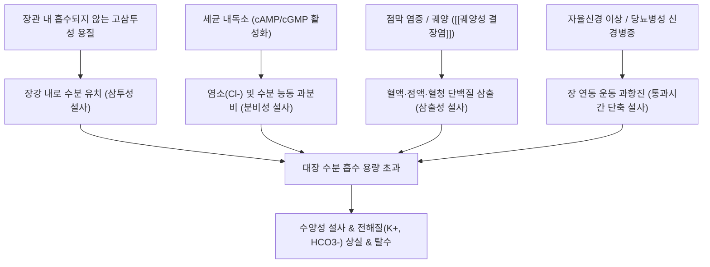
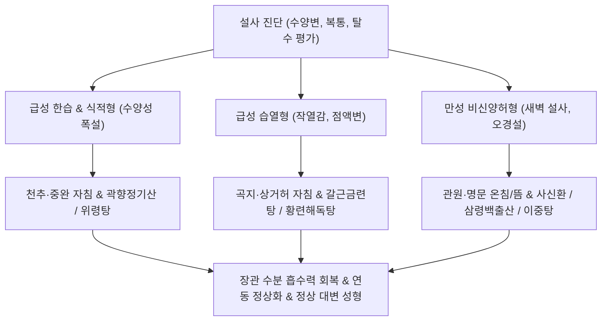

# 설사 (Diarrhea / 泄瀉, K52, A09)

> **상위 분류**: [[소화기 질환]] > [[하부위장관 질환]] > [[배변 장애]]
> **핵심 3줄 요약 (Key Summary)**:
> - 📍 병소 부위 & 해부·병태생리: 소장 및 대장의 수분 흡수와 전해질 분비 간의 항상성 붕괴. 하루 약 9L의 소화관 분비액 중 정상적으로 99%가 재흡수되어야 하나, 삼투성(Osmotic), 분비성(Secretory), 염증성/삼출성(Exudative), 위장관 운동 이상성(Motility-related) 기전으로 대변 수분량이 200g/일 이상으로 급증함.
> - 🚩 전형적 임상 양상 & 3대 징후: 하루 3회 이상 묽거나 형태가 없는 물 같은 변 배출, 복부 산통 및 꼬륵거리는 복명(Borborygmi), 배변 긴박감(Urgency) 및 탈수·전해질 결핍 징후.
> - 🛠️ 핵심 감별 검사 & 한·양방 다각적 치료 전략: 대변 백혈구·기생충·독소 검사, 경구 수액 요법(ORS), 천추(ST25)·관원(CV4)·상거허(ST37) 자침 및 온침/뜸, [[곽향정기산]], [[위령탕]], [[삼령백출산]], [[사신환]] 처방.
> - ⚠️ 응급 의뢰 레드플래그 & 악화 요인: 고열 동반 패혈증, 중증 탈수(혈압 저하, 핍뇨, 구강 건조, 기립성 어지럼증), 점액혈변, 영유아 및 고령자의 급격한 전해질 쇼크 발생 시 즉시 입원 정맥 수액 치료 의뢰.

---

## 📌 목차
1. [질환 개요 & 해부학적 병태생리](#1-질환-개요--해부학적-병태생리)
2. [병태생리 메커니즘 & 생체역학적 악순환 네트워크](#2-병태생리-메커니즘--생체역학적-악순환-네트워크)
3. [임상 증상 & 이학적 검사(Physical Exam) 알고리즘](#3-임상-증상--이학적-검사physical-exam-알고리즘)
4. [감별 진단 매트릭스 (Differential Diagnosis)](#4-감별-진단-매트릭스-differential-diagnosis)
5. [한의 통합 치료 프로토콜 (침·약침·추나·한약)](#5-한의-통합-치료-프로토콜-침약침추나한약)
6. [양방 치료 & 병용·의뢰 기준 (Conventional Treatment & Referral)](#6-양방-치료--병용의뢰-기준-conventional-treatment--referral)
7. [재활 운동 & 생활습관 티칭 가이드](#6-재활-운동--생활습관-티칭-가이드)
8. [💡 사용자 진료실 핵심 필기 & 임상 노하우 (Melt-In 잔여 심화 집약)](#7--사용자-진료실-핵심-필기--임상-노하우-melt-in-잔여-심화-집약)
9. [출처 및 학술 참고 문헌 (References)](#8-출처-및-학술-참고-문헌-references)

---

## 1. 질환 개요 & 해부학적 병태생리

![[청강의감13_006_장연동_chyme_이동시간.jpg|500]]
> [그림 1: ① 병태생리·장관운동 — 유미즙(Chyme)의 장관 내 이동 시간 및 수분 흡수 메커니즘] 소장과 대장을 통과하는 통과 시간이 비정상적으로 단축되어 수분 흡수가 저해되는 병태.

- **개념 정의 및 임상적 분류**:
  - [[설사]](Diarrhea)는 대변의 수분 함량이 비정상적으로 증가하여 묽은 변이나 물 같은 변을 배출하는 상태로, 의학적으로는 **1일 배변량이 200g 이상이거나 배변 횟수가 1일 3회 이상으로 증가**한 상태를 의미한다.
  - **이환 기간에 따른 분류**:
    - 급성 설사(Acute): 14일 미만 지속 (대부분 감염성 바이러스·세균, 식중독, 약제성).
    - 지속성 설사(Persistent): 14일 이상~30일 미만.
    - 만성 설사(Chronic): 4주(30일) 이상 지속 (IBD, IBS, 흡수장애, 내분비 질환).
- **해부학적 수분 평형(Fluid Balance)**:
  - 매일 경구 섭취(2L)와 소화액 분비(침, 위액, 담즙, 췌장액, 장액 약 7L)로 총 9L의 수분이 소장으로 유입된다.
  - 소장에서 약 7~8L, 대장에서 약 1~1.5L를 재흡수하고 최종적으로 대변으로는 100~200mL만 배출된다. 대장의 수분 흡수 능력이 한계(최대 4~5L)를 초과하거나 흡수능이 떨어지면 설사가 격발된다.

---

## 2. 병태생리 메커니즘 & 생체역학적 악순환 네트워크

![[청강의감13_004_대장_수분흡수_도해.gif|500]]
> [그림 2: ② 관련 해부 구조물 — 대장 점막 상피의 수분 및 전해질(Na+/Cl-) 능동 수송 흡수 도해] 대장 점막 상피의 수분 흡수 펌프 및 점막 손상 시의 삼출액 누출 기전.

### 1) 4대 병태생리학적 분류 기전
1. **삼투성 설사 (Osmotic Diarrhea)**:
   - 장관 내에서 흡수되지 않는 용질(유당 불내증의 락토오스, 만니톨, 마그네슘 제제)이 삼투압 구배를 형성하여 장벽 밖의 수분을 장강 안으로 끌어당김. **금식(Fasting) 시 설사가 즉각 멈춤**.
2. **분비성 설사 (Secretory Diarrhea)**:
   - 콜레라, 이질 독소, 신경내분비종양(VIPoma) 등이 장점막 상피의 음와 세포(Crypt cell)를 자극하여 전해질과 수분을 대량 분비. **금식 중에도 설사가 지속됨**.
3. **염증성/삼출성 설사 (Exudative Diarrhea)**:
   - [[궤양성 결장염]], 크론병, 허혈성 장염 등으로 점막 장벽이 붕괴되어 혈청 단백질, 백혈구, 점액, 혈액이 장강으로 누출됨.
4. **운동 이상성 설사 (Motility Diarrhea)**:
   - [[과민성 장 증후군]](IBS-D), 갑상선 기능 항진증 등으로 장관 연동이 과도하게 빨라져 수분이 충분히 흡수될 시간적 여유가 부족함.

---

## 3. 임상 증상 & 이학적 검사(Physical Exam) 알고리즘

### 1) 주요 임상 증상
- **대변 성상과 배변 횟수**: 수양변(Rice-water stool), 죽 같은 묽은 변, 거품 섞인 변, 점액혈변.
- **복부 증상**: 쥐어짜는 듯한 복통, 배변 직전의 뒤틀림, 장내 가스 차오름과 꼬륵거리는 복명(Borborygmi).
- **탈수 및 전해질 결핍 징후**: 입술과 혀의 건조, 안구 함몰, 피부 긴장도(Turgor) 저하, 현기증, 소변량 감소(핍뇨), 칼륨 상실로 인한 근육 무력증 및 경련.

### 2) 이학적 진찰 및 복부 촉진법
- **복부 청진**: 장음(Bowel sounds)이 분당 30회 이상으로 매우 항진되어 있거나 금속성 장음(Metallic sound) 청취.
- **복부 타진 및 촉진**: 복부 전반의 가스 팽만 고창음(Tympanitic sound), 배꼽 주위 및 하복부 천추(ST25) 부위의 둔탁한 압통.
- **대변 육안 검사(Stool Inspection)**:
  - 기름기가 뜨고 악취가 심한 변(지방변, 흡수장애).
  - 선홍색 또는 암적색 혈변(점막 궤양, 대장염).

---

## 4. 감별 진단 매트릭스 (Differential Diagnosis)

| 질환명 | 주 발병 기전 | 대변 성상 및 특징 | 감별 핵심 검사 |
| :--- | :--- | :--- | :--- |
| **급성 감염성 장염** | 바이러스(노로, 로타), 세균 | 수양성 설사, 구토, 발열 동반 | 대변 배양, PCR 독소 검사 |
| **[[과민성 장 증후군]] (IBS-D)** | 장-뇌 신경축 운동성 장애 | 배변 후 복통 완화, **야간 설사 없음** | 기질성 병변 음성, Calprotectin 정상 |
| **[[궤양성 결장염]] / 크론병** | 자가면역성 만성 장 점막 염증 | **만성 점액혈변, 야간 설사, 체중감소** | 대장경 궤양, Calprotectin 상승 |
| **유당 불내증 (Lactose Intolerance)** | 락타아제 결핍 (삼투성) | 우유 섭취 후 복통, 방귀, 설사 | 수소 호기 검사, 유제품 제한 시 호전 |
| **약제성 설사** | 항생제, 제산제, 메트포르민 | 약물 복용과 연계, C. difficile | 대변 C. difficile 독소 검사 |

---

## 5. 한의 통합 치료 프로토콜 (침·약침·추나·한약)

![[청강의감11_03_곽란_구토설사_이미지.jpg|500]]
> [그림 3: ③ 치료·시술점 — 토사곽란(吐瀉霍亂) 및 급만성 설사의 한의학적 병태와 복부 천추(ST25)·관원(CV4) 온침 치료점] 중초의 수습(水濕)을 분리하고 장관의 운화 기능을 정상화하는 핵심 혈위.

한의학에서 설사는 설사(泄瀉), 곽란(霍亂), 당설(溏泄), 오경설(五更泄)의 범주에 속하며, 한습리(寒濕痢), 습열리(濕熱痢), 비허리(脾虛痢), 신허리(腎虛痢)로 변증한다.

### 1) 침구 치료
- **복부 모혈 및 하합혈**:
  - 천추(ST25), 상거허(ST37): 대장의 복모혈과 하합혈로서 대장 평활근의 과항진된 수축을 억제하고 수분 흡수 촉진.
  - 음릉천(SP9), 수분(CV9): 비경의 합수혈과 임맥의 수분혈로서 장관 내 저류된 수습(水濕)을 소변으로 분리 배출(분리청탁 分利淸濁).
- **온침 및 뜸(Moxibustion) 요법**:
  - 만성 허한성 설사 환자에게 신궐(CV8, 배꼽)에 소금뜸(간접구) 또는 관원(CV4)에 온침을 적용하여 장관 심부 혈류량을 극대화.

### 2) 약침 요법
- **중성어혈약침 및 황련해독탕 약침**: 급성 발열성 설사 환자의 천추 및 족삼리에 0.3 cc 주입하여 장관 점막의 부종 완화.
- **자하거 약침 (Placenta)**: 만성 쇠약성 노인 설사 환자의 족삼리(ST36)와 관원(CV4)에 격일 시술하여 장 융모 재생 촉진.

### 3) 한약물 요법
- **급성 한습(寒濕) 및 수양성 설사**: [[곽향정기산]](藿香正氣散) 또는 [[위령탕]](胃苓湯)을 투여하여 표리의 습사를 몰아내고 수분을 분리.
- **급성 습열(濕熱) 및 점액성 설사**: [[갈근금련탕]](葛根芩連湯)으로 장내 염증성 열독을 끄고 설사 제어.
- **만성 비허(脾虛) 설사**: 삼령백출산(蔘苓白朮散) 또는 보중익기탕으로 장관 흡수능 강화.
- **만성 신양허(腎陽虛) 오경설 (새벽 설사)**: 사신환(四神丸: 보골지, 육두구, 오미자, 오수유)을 투여하여 하초의 양기를 북돋움.

---

## 6. 양방 치료 & 병용·의뢰 기준 (Conventional Treatment & Referral)

> 🎯 **이 섹션의 목적**: 환자가 **양방약을 이미 복용 중인 경우가 많다.** 한의원 1차 진료에서 양방 치료를 이해하고, 병용 가능·주의·금기를 판단하며, 언제 의뢰할지 결정한다.

* **약물 치료 (Medication)**:
  * 계열별 약물·용량·기간 — 국내 처방 관행 반영.
  * 작용 기전과 한의 치료와의 상호작용.
* **비약물 시술 (Procedures)**:
  * 주사·차단술·물리치료·보조기 등.
* **수술·시술 적응증 (Surgical Indication)**:
  * 언제 수술로 가는가 — 절대·상대 적응증, 수술 후 경과.
* **한의 병용 판단 (Combination Therapy)**:
  * 병용 가능 / 주의 / 금기. 복용 중 환자의 감량 타이밍·반동 현상.
* **양방·전문과 의뢰 기준 (Referral Criteria)**:
  * 응급 의뢰 트리거와 전문과 의뢰 기준(정형외과·신경외과·내과 등).

	(작성 필요)

---

## 7. 재활 운동 & 생활습관 티칭 가이드

- **경구 수액 보충 요법 (Oral Rehydration Solution, ORS)**:
  - 끓인 물 1L에 소금 반 티스푼(3g)과 설탕 6티스푼(25g)을 타서 조금씩 자주 마시도록 하여 나트륨-포도당 동반 수송체(SGLT1)를 통해 수분을 즉각 흡수.
- **BRAT 식이 요법**:
  - 급성기 완화 직후 바나나(Banana), 쌀죽(Rice), 사과소스(Applesauce), 토스트(Toast) 등 장에 부담이 적은 부드러운 음식 위주로 식사 재개.
- **장 자극 물질 배제**:
  - 찬물, 빙과류, 유제품, 카페인, 기름진 육류는 장 연동을 폭발적으로 자극하므로 설사가 멎은 후에도 최소 3~5일간 엄격 제한.

---

## 8. 💡 사용자 진료실 핵심 필기 & 임상 노하우 (Melt-In 잔여 심화 집약)

### 1) 설사의 정의와 원문 감별 스펙트럼 (정본)
- **임상 정의 (원문 보존)**:
  - "설사는 배변 횟수의 증가하는 질환으로 양방적으로는 [[급성 선암종]], [[결핵]](장결핵), [[치질 증후군]], [[흡수장애 증후군]] 등으로 분류한다."
- **설사의 4대 병태생리학적 분류 (원문 정합 보존)**:
  1. **삼출성 설사**: 염증성 장질환, 세균 침투로 점막이 파괴되어 삼출액이 누출되는 설사.
  2. **삼투성 설사**: 소화되지 않은 용질이 수분을 붙잡아 배출되는 설사.
  3. **투과성 설사 (분비성 설사)**: 장 점막의 전해질 능동 분비로 일어나는 설사.
  4. **근골격계, 신경계 설사 (운동성 설사)**: 과민성 장 증후군 및 자율신경 실조로 인한 통과 시간 단축 설사.

### 2) 분리청탁(分利淸濁)의 한방 임상 비결
- 물 같은 설사가 좍좍 쏟아지는 환자에게 지사제(로페라마이드 등)를 무턱대고 쓰면 독소가 장내에 갇혀 복부 팽만과 열독이 심해진다.
- 이때 한의학의 **'이소변 이실대변(利小便 以實大便 - 소변을 잘 나오게 하여 대변을 굳힌다)'** 원리를 활용하여 **위령탕(胃苓湯)**에 저령, 택사, 차전자(車前子)를 가미하면, 장강 내의 잉여 수분이 신장과 방광으로 분리 배출되면서 대변이 1~2일 내에 자연스럽게 정상 성형된다.

---

## 9. 출처 및 학술 참고 문헌 (References)

1. Schiller LR, Pardi DS, Sellin JH (2017). Chronic Diarrhea: Diagnosis and Management. *Clin Gastroenterol Hepatol*, 15(2):182-193.e3. [PMID: 27496381](https://pubmed.ncbi.nlm.nih.gov/27496381/)
   - [연구 요약]: 만성 설사의 병태생리학적 분류(삼투성, 분비성, 염증성, 운동성), 단계별 선별 검사 및 진단적 접근 알고리즘을 제시한 미국소화기학회 임상 가이드.
2. Riddle MS, DuPont HL, Connor BA (2016). ACG Clinical Guideline: Diagnosis, Treatment, and Prevention of Acute Diarrheal Infections in Adults. *Am J Gastroenterol*, 111(5):602-622. [PMID: 27068718](https://pubmed.ncbi.nlm.nih.gov/27068718/)
   - [연구 요약]: 성인 급성 감염성 설사의 진단, 수액 보충 요법, 경험적 항생제 사용 기준 및 예방 수칙을 정립한 미국소화기학회(ACG) 임상 진료 지침.
3. Wang H, Gong M, Guo J et al. (2020). Acupuncture and moxibustion for chronic diarrhea: A systematic review and meta-analysis. *Complement Ther Med*, 52:102495. [PMID: 32951744](https://pubmed.ncbi.nlm.nih.gov/32951744/)
   - [연구 요약]: 만성 설사 환자에서 천추(ST25), 족삼리(ST36), 관원(CV4) 침구 및 온구 치료가 장관 연동 리듬 정상화, 대변 수분율 감소 및 장점막 투과성 개선에 미치는 임상적 유효성을 입증한 메타분석.

<!-- 보관 태그(1회용·링크오류, 필요시 복원): 장관기능 -->
