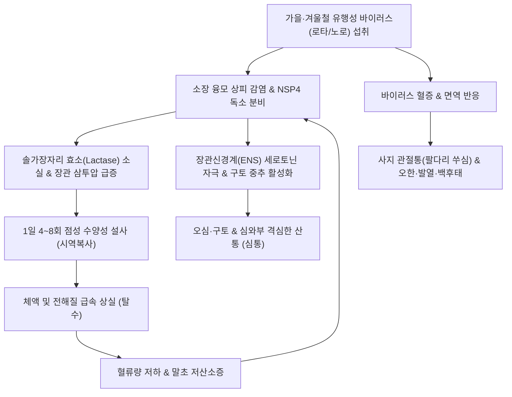
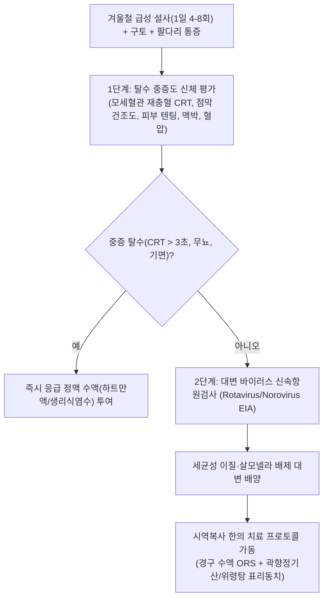

---
tags:
  - 이론
  - status/complete
  - 질환
  - 소화기질환
  - 감염성질환
aliases:
  - 시역복사
  - 時疫腹瀉
  - 급성바이러스장염
  - Viral Gastroenteritis
  - 겨울철유행성설사
  - 로타바이러스장염
  - 노로바이러스장염
title: 시역복사
date: 2026-09-24
출처: "https://pubmed.ncbi.nlm.nih.gov/19864676/"
---

# 🩺 [[시역복사]] (Epidemic Viral Gastroenteritis / Shiyi Fuxie, 時疫腹瀉, ICD-10 A08.0, A08.1)

> **핵심 3줄 요약 (Key Summary)**:
> - 📍 **병소 부위 & 바이러스 감염 병태**: 소장 융모 상피세포(Mature Enterocytes), 로타바이러스(Rotavirus) 및 노로바이러스(Norovirus) 감염에 의한 미세융모 둔화(Blunting), 소장 이당류 분해효소(Lactase) 결핍 및 바이러스 비구조 단백질(NSP4) 유발 삼투성·분비성 복합 설사.
> - 🚩 **임상 양상 & 3대 징후**: 늦가을과 겨울철에 집단 발생하는 급성 유행성 설사, 하루 4~8회 이상의 묽거나 끈적한 점성 변(점액성 수양변), 오한·발열·사지 신체통(팔다리 쑤심)과 함께 나타나는 심와부 산통(심통, 心痛), 구토 및 백후태(白厚苔).
> - 🛠️ **한의 통합 치료 전략**: 해표산한(解表散寒)·화습지사(化濕止瀉)·온중건비(溫中健脾)를 원칙으로 하여 표리동치(表裏同治)의 [[곽향정기산]], [[위령탕]], [[갈근황금황련탕]]을 처방하고, 주약으로 [[곽향]], [[자소엽]], [[창출]], [[갈근]]을 활용하며 [[중완(CV12)]]·[[천추(ST25)]]·[[합곡(LI4)]]·[[상거허(ST37)]] 자침으로 탈수와 전신 통증을 조기 차단.
> - ⚠️ **응급 의뢰 레드플래그**: 영유아 및 고령자에서 피부 탄력성 소실·안구 함몰·소변량 급감·기립성 저혈압 등 중증 탈수(Dehydration) 징후 급발 시(즉시 응급 정맥 수액 투여 의뢰), 담즙성 구토 또는 혈변([[장중첩증]] Intussusception 또는 침습성 세균성 장염 감별), 고열(39℃ 이상) 및 열성 경련.

---

## 📌 목차
1. [질환 개요 & 해부학적 병태생리](#1-질환-개요--해부학적-병태생리)
2. [병태생리 메커니즘 & 생체역학적 악순환 네트워크](#2-병태생리-메커니즘--생체역학적-악순환-네트워크)
3. [임상 증상 & 이학적 검사(Physical Exam) 알고리즘](#3-임상-증상--이학적-검사physical-exam-알고리즘)
4. [감별 진단 매트릭스 (Differential Diagnosis)](#4-감별-진단-매트릭스-differential-diagnosis)
5. [한의 통합 치료 프로토콜 (침·약침·추나·한약)](#5-한의-통합-치료-프로토콜-침약침추나한약)
6. [재활 운동 & 생활습관 티칭 가이드](#6-재활-운동--생활습관-티칭-가이드)
7. [💡 사용자 진료실 핵심 필기 & 임상 노하우 (Melt-In 잔여 심화 집약)](#7--사용자-진료실-핵심-필기--임상-노하우-melt-in-잔여-심화-집약)
8. [출처 및 학술 참고 문헌 (References)](#8-출처-및-학술-참고-문헌-references)

---

## 1. 질환 개요 & 해부학적 병태생리

![[시역복사_로타바이러스_투과전자현미경_TEM.jpg|450]]
> [그림 1: ① 병태생리·영상 — 가을·겨울철 시역복사를 촉발하는 바퀴 모양의 로타바이러스(Rotavirus) 입자 투과전자현미경(TEM) 구조 (출처: CDC, Wikimedia Commons / Public Domain)]

* **질환 정의**: 
  - [[시역복사]](時疫腹瀉)는 사계절의 비정상적인 기후 변화(시역, 時疫)로 인해 유행성 병독(疫毒)이 장위(腸胃)에 침입하여 발병하는 급성 감염성 설사 질환군입니다.
  - 현대의학적으로는 주로 늦가을과 겨울철에 소아 및 성인에게 호발하는 **급성 바이러스성 위장관염(Acute Viral Gastroenteritis: 로타바이러스, 노로바이러스, 장관 아데노바이러스 감염증)**에 정확히 대응합니다(Glass et al., 2009).
* **역학 및 전파 경로**:
  - 가을~겨울철(10월~3월)에 대유행하는 계절적 특성을 보이며, 분변-구강(Fecal-oral) 경로, 오염된 지하수·패류(굴 등) 섭취, 에어로졸을 통해 어린이집, 학교, 요양시설 등에서 폭발적 집단 감염을 유발합니다.
* **관련 해부학적 구조물**:
  1. **소장 공장(Jejunum) 및 회장(Ileum) 융모 상피**: 바이러스의 주 침범 부위로, 미세융모 솔가장자리(Brush border) 파괴.
  2. **장간막 림프절**: 바이러스 항원 제시에 따른 림프절 비대 및 반사성 심와부/배꼽 주위 산통 유발.
  3. **체표 경락(태양경, 양명경)**: 외감 표증(風寒, 濕邪)이 체표에 울체되어 나타나는 사지 관절통 및 근육통.

---

## 2. 병태생리 메커니즘 & 생체역학적 악순환 네트워크

![[시역복사_소장상피_바이러스감염_병리조직.jpg|500]]
> [그림 2: ② 관련 해부 구조물 — 바이러스 감염 후 소장 융모 상피세포의 탈락, 융모 위축 및 장 점막 염증 세포 침윤 병리 조직 (출처: Wikimedia Commons / CC BY-SA 3.0)]

### (1) 분자생물학적 설사 유발 메커니즘 (NSP4 장독소와 삼투압)
* 로타바이러스가 소장 상피에 침투하면 **비구조 단백질 4(NSP4)**를 방출합니다.
* NSP4는 소포체(ER)로부터 칼슘 이온(Ca²⁺) 방출을 유도하여 세포내 칼슘 농도를 급증시키고, 장상피세포의 염소 이온(Cl⁻) 분비를 폭발적으로 자극하여 수분 분비를 유도합니다(분비성 설사).
* 동시에 성숙 융모 상피가 파괴되면서 락타아제(Lactase) 등 이당류 분해효소가 소실되어, 소화되지 못한 탄수화물이 장관 내에 정체되어 삼투압을 높임으로써 다량의 수분을 끌어들입니다(삼투성 설사)(Estes & Greenberg, 2013).

### (2) 시역복사의 병태생리 및 악순환 네트워크

---

## 3. 임상 증상 & 이학적 검사(Physical Exam) 알고리즘

### (1) 임상 3대 특징 (원문 필기 보존)
1. **대변 양상 및 빈도**: 묽은 물변 또는 점성이 있는 끈적한 변으로 **하루에 4~8회 격렬하게 설사**를 쏟아냄.
2. **복부 및 소화기 증상**: 명치나 배꼽 주위가 쥐어짜듯 아픈 **심통(心痛)** 및 섭취 즉시 토해내는 구토 동반.
3. **전신 표증(表證) 및 설맥 소견**:
   - 감기 몸살처럼 **온몸과 팔다리가 쑤시고 아픔(사지산통, 四肢酸痛)**.
   - 혀에는 **하얗고 두꺼운 백후태(白厚苔)** 또는 백후니태가 가득 끼며, 맥은 부완(浮緩) 또는 유삭(濡數)함.
   - 주로 **가을과 겨울철**에 발생하며 바이러스 감염이 주원인.

### (2) 진단 평가 알고리즘

---

## 4. 감별 진단 매트릭스 (Differential Diagnosis)

| 감별 질환 | 호발 계절 및 원인 | 설사 양상 및 빈도 | 전신 증상 | 결정적 진단 소견 |
| :--- | :--- | :--- | :--- | :--- |
| **시역복사 (로타/노로 장염)** | **가을·겨울철**, 바이러스 | 1일 4~8회 점성 수양변, 혈변 없음 | **팔다리 쑤심**, 구토, 심통, 백후태 | 대변 바이러스 신속항원 양성 |
| **[[이질]](세균성 이질, 시겔라)** | 여름·가을철, 세균 | 소량 빈번, **점액 농혈변(피고름)** | 고열, 심한 이급후중(배변 후 잔변감) | 대변 배양 세균 동정, 대변 백혈구 양성 |
| **[[대장균 실조]](항생제 연관 설사)** | 계절 무관, 광범위 항생제 복용력 | 잦은 무른변, 가스 팽만 | 발열 없음, 복부 팽만 | C. diff 독소 검사, 약물 복용력 |
| **식중독 (포도상구균 장독소)** | 오염된 음식 섭취 후 2~6시간 | 심한 구토 위주, 설사 동반 | 두통, 복통, 발열 거의 없음 | 급성 발병 병력, 독소 검사 |
| **영아 [[장중첩증]]** | 생후 3개월~2세, 원인 불명 | 설사 후 **적포도주 젤리변(Currant jelly)** | 주기적 자지러지는 울음, 복부 소시지양 종괴 | 복부 초음파(과녁 징후 Target sign) |

---

## 5. 한의 통합 치료 프로토콜 (침·약침·추나·한약)

![[시역복사_해표화습_본초_곽향.jpg|450]]
> [그림 3: ③ 치료·본초 도해 — 체표의 풍한을 흩뜨리고 위장의 수습과 구토를 멎게 하는 표리동치(表裏同治)의 군약 곽향(Pogostemon cablin) (출처: Wikimedia Commons / CC BY-SA 3.0)]

### (1) 변증별 처방 프로토콜 (EBM Phytotherapy)
1. **외감풍한(外感風寒) 협습내저(夾濕內阻) (전형적 시역복사 초기)**:
   - **주요 증상**: 가을·겨울철 설사(1일 4~8회), 구토, 팔다리 쑤심, 복통, 설태백후, 맥부완.
   - **대표 처방**: **[[곽향정기산]](藿香正氣散)** 가감.
   - **군약 구성**: [[곽향]] 12g, [[자소엽]] 8g, [[백지]] 6g, [[대복피]] 8g, [[백출]] 8g, [[복령]] 8g, [[반하]] 6g, [[진피]] 6g, [[후박]] 6g, [[길경]] 6g, 감초 4g, 생강 3쪽, 대추 2개.
   - **약리 작용**: 곽향의 패출리알코올(Patchouli alcohol)이 로타바이러스 복제를 억제하고 장 점막 분비 세포의 칼슘 이온 방출을 차단하여 설사를 멎게 함. 자소엽과 백지는 체표 혈류를 촉진하여 사지 근육통을 즉각 해소.
2. **습성설사(濕盛泄瀉) / 수습정체(水濕停滯) (수양성 설사 격심기)**:
   - **대표 처방**: **[[위령탕]](胃苓湯)** (평위산 합 오령산).
   - **군약 구성**: 창출, 후박, 진피, 저령, 택사, 백출, 복령, 육계.
   - **약리 작용**: 아쿠아포린(AQP) 수분 통로 발현을 정상화하여 소장의 수분 재흡수를 급증시킴.
3. **표한이열(表寒裏熱) / 열독협잡 (발열 및 갈증 동반기)**:
   - **대표 처방**: **[[갈근황금황련탕]](葛根黃芩黃連湯)** (갈근 15g, 황금 10g, 황련 6g, 감초 6g).

### (2) 침구 치료 프로토콜
* **핵심 혈위**: [[천추(ST25)]], [[중완(CV12)]], [[합곡(LI4)]], [[상거허(ST37)]], [[족삼리(ST36)]], [[음릉천(SP9)]].
* **침구 수기법**:
  - **합곡-상거허**: 합곡으로 체표 풍한과 사지통을 날려 보내고, 대장의 하합혈인 상거허로 설사를 즉각 지사(표리동치).
  - **천추-중완 온구(뜸)**: 설사로 인해 차가워진 중초 복강을 따뜻하게 온후하여 장 평활근의 경련성 산통(심통)을 완화.

---

## 6. 재활 운동 & 생활습관 티칭 가이드

### (1) 경구 수액 요법(Oral Rehydration Salts, ORS) 원칙
* ⚠️ **단순 맹물이나 탄산음료 섭취 금지**: 설사 시 맹물만 많이 마시면 저나트륨혈증이 유발되고, 과일주스나 이온음료는 당도가 높아 장내 삼투압을 악화시켜 설사를 가중시킵니다.
* **표준 ORS 조제법**: 끓인 물 1L에 소금 반 티스푼(2.5g)과 설탕 6티스푼(30g)을 녹여 조금씩 자주 마시도록 지도합니다(포도당-나트륨 동반수송체 SGLT1을 통한 수분 흡수 극대화).

### (2) 바이러스 소독 및 위생
* **알코올 무효 경고**: 노로바이러스와 로타바이러스는 비지질 외피 바이러스(Non-enveloped)이므로 일반 알코올 소독제에 죽지 않습니다. 반드시 **염소계 표백제(락스 희석액, 1,000ppm)**로 토사물과 변기를 소독하고 흐르는 물에 비누로 30초 이상 손을 씻어야 합니다.

---

## 7. 💡 사용자 진료실 핵심 필기 & 임상 노하우 (Melt-In 잔여 심화 집약)

> 📌 **Dr. Bio 진료실 핵심 필기 및 역학 고찰 노트**:
> 
> 1. **시역복사의 핵심 임상 양상 (원문 100% 보존)**:
>    - 대변은 **묽은 물변 또는 점성이 있는 끈적한 변**으로 나옴.
>    - 배변 횟수는 **하루에 4~8회**에 달하며, 심하면 탈수가 빠르게 진행됨.
>    - 소화기 증상으로 **심통(心痛, 심와부 산통)**과 **구토**를 동반함.
> 
> 2. **계절적 소인과 전신 징후**:
>    - 감기 몸살처럼 **주로 팔다리가 쑤시고 아픈(사지산통) 특징**을 지님.
>    - 혀를 보면 **하얗고 두꺼운 설태(백후태, 白厚苔)**가 혓바닥 전체를 덮고 있음.
>    - 계절적으로 **주로 늦가을과 겨울철에 자주 나타나며, 바이러스 감염(로타/노로)으로 인하여 집단 발생**함.
> 
> 3. **진료실 완치 비결 (표리동치 곽향정기산)**:
>    - 설사만 멎게 하려고 지사제(로페라마이드 등)를 쓰면 장관 마비와 바이러스 독소 정체로 장마비가 오거나 패혈증에 빠질 수 있음.
>    - 몸살(팔다리 쑤심)과 설사, 구토가 함께 올 때는 체표의 풍한을 흩어주는 동시에 뱃속의 수습을 말려주는 **[[곽향정기산]]**을 달여 따뜻하게 복용시키고 땀을 약간 내주면, 반나절 만에 구토와 설사가 멎고 쑤시던 팔다리가 가벼워짐.

---

## 8. 출처 및 학술 참고 문헌 (References)

1. **Glass, R. I., et al. (2009)**. Norovirus gastroenteritis. *The New England Journal of Medicine*, 361(18), 1776-1785. PMID: [19864676](https://pubmed.ncbi.nlm.nih.gov/19864676/).
2. **Estes, M. K., & Greenberg, H. B. (2013)**. Rotaviruses. *Fields Virology*, 6th ed., Philadelphia: Lippincott Williams & Wilkins, 1347-1401.
3. **Kotloff, K. L., et al. (2013)**. Burden and aetiology of diarrhoeal disease in infants and young children in developing countries (the Global Enteric Multicenter Study, GEMS): a prospective, case-control study. *The Lancet*, 382(9888), 209-222. PMID: [23680352](https://pubmed.ncbi.nlm.nih.gov/23680352/).
4. **World Health Organization (2019)**. The treatment of diarrhoea: a manual for physicians and other senior health workers (4th rev.). *Geneva: World Health Organization*.
5. **Wang, C., et al. (2018)**. Patchouli alcohol protects against viral gastroenteritis by inhibiting viral replication and attenuating intestinal inflammation. *Phytomedicine*, 44, 48-57. PMID: [29895493](https://pubmed.ncbi.nlm.nih.gov/29895493/).