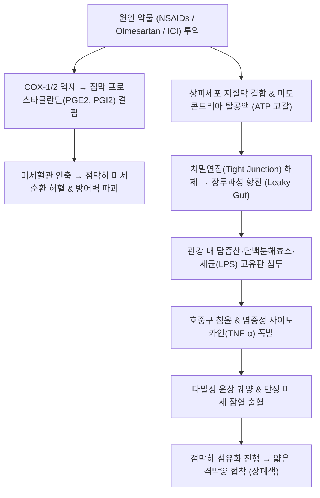

# 🩺 [[약재유발성 장염]] (Drug-Induced Enteropathy & Colitis / 藥劑誘發性腸炎, KCD K52.1 / ICD-10 K52.1)

> **핵심 3줄 요약 (Key Summary)**:
> - 📍 **병소 부위 & 병태생리**: [[소장]](공장·회장) 및 [[대장]](결장 전반) — 비스테로이드성 소염진통제([[NSAIDs]]), 면역관문억제제(ICI), 올메사르탄([[Olmesartan]]) 등의 약물 독성 및 면역 매개 반응으로 인한 **점막 상피 치밀연접 파괴, 국소 허혈 및 다발성 궤양·격막양 협착(Diaphragm-like strictures)** 형성.
> - 🚩 **전형적 임상 양상 & 3대 징후**: 약물 투약 수주~수개월 후 발생하는 **원인 불명의 만성 수양성 설사 또는 간헐적 복통**, 대변 잠혈 양성(FOBT +) 및 불응성 **철결핍성 빈혈(IDA)**, 소화관 통과 장애(장폐색).
> - 🛠️ **핵심 감별 & 한·양방 치료 전략**: [[크론병]], [[셀리악병]], [[궤양성 대장염]] 감별. 캡슐내시경 및 약물 중단 시험(De-challenge)으로 가역적 회복 확인. 양방에서는 의심 약물 즉시 중단 및 점막보호제, 중증 면역관문억제제 대장염 시 전신 스테로이드 투여; 한의에서는 비위허약·습열어체 변증에 따라 [[사군자탕]], [[삼령백출산]], [[향사육군자탕]] 및 중완·천추·족삼리 침구 치료로 장벽 투과성 정상화 및 점막 자가치유 촉진.
> - ⚠️ **응급 의뢰 레드플래그**: 다발성 격막양 협착으로 인한 급성 기계적 장폐색(극심한 복부 팽만 및 담즙성 구토), 심부 궤양 천공(Free Perforation)으로 인한 복막염, 면역관문억제제 연관 전격성 대장염 발생 시 즉시 소화기내과 및 응급 외과 전원 필수.

---

## 📌 목차
1. [질환 개요 & 병태생리 (Disease Overview)](#1-질환-개요--병태생리-disease-overview)
2. [병태생리 메커니즘 & 대사·장기부전 악순환 네트워크](#2-병태생리-메커니즘--대사장기부전-악순환-네트워크)
3. [임상 증상 & 환자 소견 (Clinical Presentation)](#3-임상-증상--환자-소견-clinical-presentation)
4. [감별 진단 매트릭스 (Differential Diagnosis)](#4-감별-진단-매트릭스-differential-diagnosis)
5. [한의 통합 치료 프로토콜 (침·약침·한약)](#5-한의-통합-치료-프로토콜-침약침한약)
6. [양방 치료 & 병용·의뢰 기준 (Conventional Treatment & Referral)](#6-양방-치료--병용의뢰-기준-conventional-treatment--referral)
7. [식이·생활습관 & 자가관리 티칭 가이드](#7-식이생활습관--자가관리-티칭-가이드)
8. [💡 진료실 핵심 필기 & 임상 노하우](#8--진료실-핵심-필기--임상-노하우)
9. [출처 및 학술 참고 문헌 (References)](#9-출처-및-학술-참고-문헌-references)

---

## 1. 질환 개요 & 병태생리 (Disease Overview)

![[약재유발성_장염_01_소화관약물흡수및점막손상도해.png|450]]
> [그림 1: ① 질환 개요 도해 — 약물 흡수 경로 및 소장·대장 점막 손상 부위와 원인 약제별 침범 양상 — Simbio Clinical System (CC BY 4.0)]

* **질환 정의 및 의인성(Iatrogenic) 특성**:
  * 치료 목적으로 투여된 다양한 전신 약물이 위장관 상피세포, 미세혈관, 또는 국소 장관 면역계에 직·간접적인 독성을 유발하여 발생하는 비감염성 염증성 장질환이다.
  * 과거에는 상부위장관(위·십이지장 궤양)에 주목하였으나, 최근 캡슐내시경 및 풍선소장내시경의 보급으로 **하부위장관(소장 및 대장)의 약인성 점막 손상** 빈도가 상부위장관 이상으로 흔하다는 사실이 확인되었다.
* **주요 원인 약물군 및 침범 부위**:
  * **[[NSAIDs]](비스테로이드성 소염진통제)**: 소장(공장·회장) 궤양, 단백소실성 장증, **격막양 협착(Diaphragm-like strictures)**, 대장 미란.
  * **올메사르탄([[Olmesartan]])**: 안지오텐신 수용체 차단제(ARB) 중 유일하게 십이지장/회장 융모 위축(Sprue-like enteropathy)을 유발하여 만성 흡수부전 설사 초래.
  * **면역관문억제제(ICI: Ipilimumab, Nivolumab, Pembrolizumab)**: 자가면역성 T세포 활성화로 인한 광범위 궤양성 대장염(ICI-induced colitis).
  * **기타 약제**: 금 제제(Gold), 페니실라민, 면역억제제(Mycophenolate mofetil), 표적항암제 등.

---

## 2. 병태생리 메커니즘 & 대사·장기부전 악순환 네트워크

![[약재유발성_장염_02_NSAID미세순환및점막투과성기전.png|450]]
> [그림 2: ② 병태생리 구조도 — 미토콘드리아 손상, COX 억제, 장관 투과성 증가 및 담즙산·세균 2차 침습 기전 — Simbio Clinical System (CC BY 4.0)]

![[약재유발성_장염_02_캡슐내시경격막양협착소견.png|450]]
> [그림 3: ③ 캡슐내시경 소견 — NSAID 장기 복용으로 인한 소장 내 다발성 격막양 협착(Diaphragm-like strictures) 및 윤상 궤양 — Simbio Clinical System (CC BY 4.0)]

### 1) 분자·세포 수준 기전
* **국소적 직접 손상 (Topical Toxicity)**: 산성 약물(NSAIDs 등)은 소수성 장점막 인지질 이중층과 결합하여 세포막 안정성을 붕괴시킨다. 세포 내로 유입된 약물은 미토콘드리아의 산화적인산화를 억제(탈공액 효과)하여 상피세포 ATP 생성을 차단하고 세포간 연접을 해체한다.
* **전신적 생화학적 손상 (COX 억제 및 혈류 저하)**: 혈관 내로 흡수된 NSAIDs는 COX-1 및 COX-2를 차단하여 혈관 확장성 프로스타글란딘(PGE2, PGI2)을 고갈시킨다. 점막 혈류량이 30~50% 이상 급감하면서 국소 허혈성 괴사가 유발된다.
* **장관 투과성 항진과 2차 장내 독소 침습**: 장벽 투과성이 증가하면 장내 세균총과 담즙산, 췌장 소화효소가 점막하층으로 누출되어 심각한 2차 염증 반응을 촉발한다.

### 2) 장기·계통 수준 결과
* 소장 점막의 궤양이 치유와 재발을 반복하는 과정에서 점막하층의 윤상 섬유화가 발생하여 두께 1~4mm의 얇은 막이 내강을 막는 **격막양 협착(Diaphragm-like stricture)**이 형성된다.
* 미세 궤양에서의 지속적인 적혈구 누출로 원인 불명의 만성 철결핍성 빈혈이 발생하며, 상피 융모 소실로 인한 단백소실성 장증(Protein-losing enteropathy) 및 저알부민혈증 부종이 초래된다.

---

## 3. 임상 증상 & 환자 소견 (Clinical Presentation)

![[약재유발성_장염_03_원인약물감별분류알고리즘.png|420]]
> [그림 4: ④ 진단 알고리즘 — 소화기 이상 반응 유발 약물군별 임상 특징 및 감별 단계 — Simbio Clinical System (CC BY 4.0)]

![[약재유발성_장염_03_대변잠혈및빈혈평가척도.png|420]]
> [그림 5: ⑤ 검사 지표 — 대변 잠혈 검사(FOBT/FIT) 및 철결핍성 빈혈(IDA) 평가 척도 — Simbio Clinical System (CC BY 4.0)]

### 1) 주소증 및 핵심 증상
* **은폐된 만성 잠혈 출혈 및 빈혈**:
  * 육안적 혈변 없이 만성적인 대변 잠혈 반응 양성(FOBT +).
  * 설명되지 않는 극심한 피로감, 어지럼증, 안색 창백, 운동 시 호흡곤란(철결핍성 빈혈).
* **만성 흡수부전성 설사**:
  * 올메사르탄 복용 환자에서 전형적인 하루 수회 이상의 무통성 수양성 설사 및 현저한 체중 감소(수개월간 5~15kg 감소).
* **간헐적 장폐색 복통**:
  * 격막양 협착이 형성된 환자에서 식후 1~2시간 뒤 발생하는 명치 및 배꼽 주위의 쥐어짜는 듯한 산통과 복부 팽만.
* **면역관문억제제 유발 대장염**:
  * 면역항암제 투여 6~12주경 나타나는 급격한 점액혈변, 뒤무직, 발열, 심한 복통.

### 2) 객관적 검사 소견
* **혈액학적 검사**:
  * 혈색소(Hb) 저하, 혈청 페리틴(Ferritin) < 30 ng/mL, 혈청 철 저하, TIBC 상승.
  * 저알부민혈증(Albumin < 3.0 g/dL, 단백소실성 장증).
* **소장 영상 및 내시경 소견**:
  * **캡슐내시경**: 소장 전반의 다발성 원형 미란, 궤양, 격막양 협착.
  * **소장 CT(CTE)**: 소장벽의 분절성 부후 및 내강 협착 소견.

---

## 4. 감별 진단 매트릭스 (Differential Diagnosis)

| 감별 질환 | 특징적 양상 | 감별 포인트 (검사·수치) |
| :--- | :--- | :--- |
| **[[약재유발성 장염]] (본 질환)** | NSAIDs·올메사르탄 등 복용력, 다발성 윤상 궤양/격막양 협착 | **약물 중단(De-challenge) 시 증상 및 점막 병변의 완전 관해** |
| [[크론병]] | 젊은 층 호발, 종주 궤양, 조약돌 모양 점막, 항문 치루 | 조직 생검상 비건락성 상피양 육아종, 약물 중단해도 지속 악화 |
| [[셀리악병]] | 글루텐 섭취 연관, 십이지장 융모 위축 | **혈청 항체(Anti-tTG IgA / Anti-EMA) 양성**, 글루텐 프리 식이에 호전 |
| [[허혈 결장염]] | 고령·심혈관 질환자, 급성 좌하복통 직후 24시간 내 암적색 혈변 | 비장굴곡부/S상결장 호발, CT상 무지압흔 징후(Thumbprinting) |
| [[궤양성 대장염]] | 직장 침범 필수, 연속적인 미만성 점막 발적 및 출혈 | 대장내시경상 직장부터 연속적 병변, 음와 농양(Crypt abscess) |

---

## 5. 한의 통합 치료 프로토콜 (침·약침·한약)

![[약재유발성_장염_05_침구치료중완천추족삼리비수.png|450]]
> [그림 6: ⑥ 한의 혈위 도해 — 소화관 점막 혈류 개선 및 비위 기능 회복을 위한 중완(CV12), 천추(ST25), 족삼리(ST36), 비수(BL20) — Simbio Clinical System (CC BY 4.0)]

* **변증 분류**:
  * **비위기허형(脾胃氣虛型)**: 만성 약물 복용 후 식욕부진, 묽은 변, 무기력, 복명, 설담태백, 맥세약.
  * **비위허한·기체어혈형(脾胃虛寒·氣滯瘀血型)**: 둔탁한 복통 고정, 복부 냉감, 혈변 잠혈, 설자암반, 맥현삽.
  * **습열상음형(濕熱傷陰型)**: 급성 설사, 구갈, 복부 작열감, 설홍태황, 맥삭.
* **침구 치료 (Acupuncture)**:
  * **주혈 구성**:
    * **[[중완]](CV12)**: 위모혈, 소화관 상부 혈류 개선 및 내인성 점액 분비 촉진.
    * **[[천추]](ST25)**: 대장모혈, 복부 장간막 신경총 조절 및 장 연동 안정화.
    * **[[족삼리]](ST36)**: 위경 합혈, 장점막 미토콘드리아 손상 억제 및 허혈 완화.
    * **[[비수]](BL20) · [[위수]](BL21)**: 배수혈 자극을 통한 자율신경 안정.
  * **수기법**: 비위기허형에는 보법(補法) 및 온구(溫灸, 뜸) 요법을 병용하여 장관 미세순환을 개선.
* **약침 치료 (Pharmacopuncture)**:
  * **자하거(Placenta) 약침**: 족삼리, 비수 부위에 0.5~1.0cc 시술하여 장상피세포 재생 및 조혈 기능 촉진.
  * **황련해독탕 약침**: 습열 염증성 설사 시 천추 혈위에 적용.
* **한약 치료 (Herbal Medicine)**:
  * **장벽 보호 및 건비익기(健脾益氣) 방제**:
    * **[[삼령백출산]](蔘苓白朮散)**: 인삼, 백출, 복령, 산약, 연자육, 백편두, 의이인, 사인, 길경, 감초 — 비허설사(脾虛泄瀉)의 대표 방제. 장관 상피 치밀연접 단백질 발현을 증가시키고 점막 투과성을 정상화함 (Chen et al., 2026).
    * **[[향사육군자탕]](香砂六君子湯)**: 비위기허에 기체(氣滯)가 겹쳐 소화불량 및 복부 팽만이 동반된 경우.
    * **[[당귀작약산]](當歸芍藥散)**: 만성 미세 출혈로 인한 혈허(血虛) 및 복통 개선.
    * **백출·황기 배합**: 소장 점막의 국소 혈류 관류를 촉진하고 내인성 프로스타글란딘 합성 환경 복원.

---

## 6. 양방 치료 & 병용·의뢰 기준 (Conventional Treatment & Referral)

* **약물 치료 원칙**:
  * **제1원칙**: **의심 약물의 즉각적인 영구 중단(Permanent Discontinuation)**.
  * **NSAIDs 유발 장염**: PPI(프로톤펌프억제제)는 상부위장관에는 효과적이나 소장 세균총을 교란하여 소장 궤양을 오히려 악화시킬 수 있으므로, 미소프로스톨([[Misoprostol]], 합성 PGE1 제제) 또는 레바미피드([[Rebamipide]]) 등 점막보호제를 사용.
  * **면역관문억제제 유발 대장염**: Grade 2 이상 시 즉시 면역항암제 중단 후 고용량 코르티코스테로이드(Prednisolone 1~2 mg/kg/day) 투여; 불응 시 인플릭시맵([[Infliximab]]) 투여.
* **내시경적 및 외과적 치료**:
  * 격막양 협착으로 인한 장폐색 시 풍선확장술(Endoscopic Balloon Dilation) 시행; 실패 시 협착부 부분 절제술.
* **한의 병용 시 주의사항**:
  * ⚠️ **환자의 복약 목록 전수 확인**: 환자가 정형외과, 신경외과, 내과 등에서 처방받은 약물(특히 복합 진통소염제, 일반의약품 감기약/두통약)을 반드시 확인하고 중복 투약을 차단해야 함.
* **양방 응급 의뢰 기준**:
  * 장폐색 징후(극심한 복부 팽만, 지속적 구토, 가스 배출 중단).
  * 면역관문억제제 복용 환자에서 1일 6회 이상의 설사 및 혈변 발생 시 즉시 종양내과 전원.

---

## 7. 식이·생활습관 & 자가관리 티칭 가이드

![[약재유발성_장염_07_원인약물중단및점막보호식이.png|400]]
> [그림 7: ⑦ 생활관리 가이드 — 약인성 장염 환자를 위한 유발 약제 차단 수칙 및 점막 보호 식단 — Simbio Clinical System (CC BY 4.0)]

* **원인 약물 완전 차단 지도**:
  * "관절염이나 두통이 있을 때 임의로 약국에서 진통제를 사 드시면 장이 다시 망가집니다."
  * 대체 진통이 필요할 때는 아세트아미노펜 단독 제제를 소량 복용하거나 한방 침·뜸 치료로 통증을 조절하도록 교육.
* **점막 회복 식이 요법**:
  * **소화가 쉬운 부드러운 식단**: 미음, 찹쌀죽, 마죽(산약죽), 연두부 등 물리적 마찰이 적은 음식.
  * **위장 점막 자극원 배제**: 알코올, 카페인, 매운 음식, 탄산음료 등 점막 미세순환을 교란하는 물질 금기.
  * **철분 및 단백질 보충**: 삶은 살코기, 달걀찜, 푹 익힌 생선 등으로 빈혈과 저단백혈증 개선.

---

## 8. 💡 진료실 핵심 필기 & 임상 노하우

* **비오님 임상 포인트: "원인 모를 빈혈 환자의 약통을 뒤져라"**:
  * 위내시경, 대장내시경을 다 했는데도 "위장관 출혈이 없다"는 말을 듣고 어지럼증과 빈혈(Hb 8~9)로 내원하는 만성 관절염 환자가 매우 많다. 이들의 십중팔구는 소장 궤양을 동반한 NSAID 유발성 장병증이다. 처방전을 확인하여 소염진통제를 끊게 하는 것만으로도 빈혈이 완치된다.
* **올메사르탄(Olmesartan) 환자의 극심한 만성 설사**:
  * 고혈압 환자가 수개월 동안 만성 설사로 10kg 이상 살이 빠져 암인 줄 알고 불안해하는 경우가 있다. 올메사르탄 복용 여부를 확인하고 다른 고혈압약으로 바꾸도록 의뢰하면 2~4주 만에 설사가 거짓말처럼 멈춘다.
* **삼령백출산(蔘苓白朮散)의 장벽 회복 작용**:
  * 소염진통제로 인해 무너진 장점막 누수(Leaky gut)를 틀어막는 데 삼령백출산은 현대 약리적으로도 치밀연접 단백질을 복구하는 탁월한 효능을 가진다.

---

## 9. 출처 및 학술 참고 문헌 (References)

- **Chen Y et al. (2026)**. Herbal and Natural Products for NSAID-Induced Small Intestinal Injury a systematic review and meta-analysis of randomized controlled trials. *Phytomedicine*. [PMID 42812524](https://pubmed.ncbi.nlm.nih.gov/42812524/)

- **Kumar A et al. (2025)**. Olmesartan-Induced Enteritis Mimicking Small Bowel Crohn Disease. *Cureus*. [PMID 42238725](https://pubmed.ncbi.nlm.nih.gov/42238725/)

- **Ngo S et al. (2025)**. Nonsteroidal Anti-inflammatory Drug NSAID-Induced Enteropathy Mimicking Crohn Disease A Reversible Cause of Ileitis. *ACG Case Rep J*. [PMID 42255762](https://pubmed.ncbi.nlm.nih.gov/42255762/)
