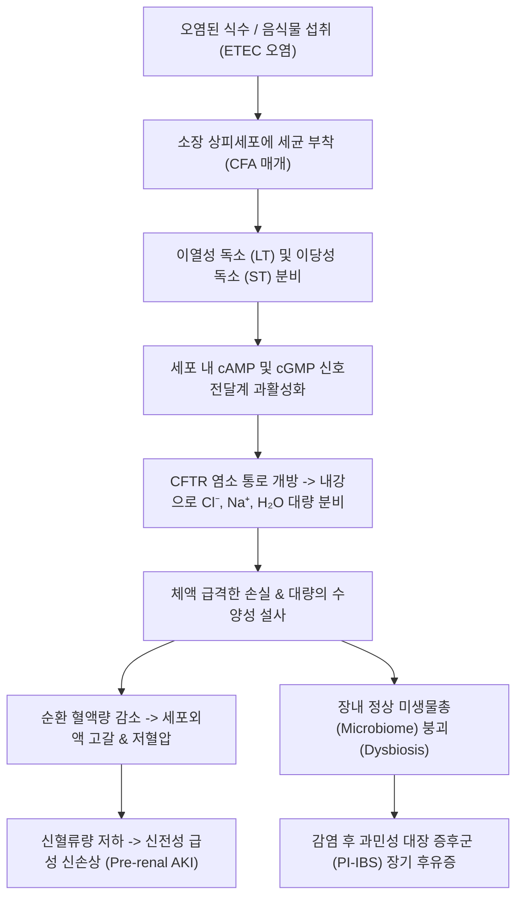

# 🩺 여행자 설사 (Travelers' Diarrhea / 旅行者 泄瀉, ICD-10: A09 / KCD: A09)

> **핵심 3줄 요약 (Key Summary)**:
> - 📍 **병소 부위 & 병태생리**: 오염된 음식물 및 식수 섭취를 통해 감염되는 소장 및 대장 점막 상피세포. 주원인균인 [[장독소성 대장균]](ETEC)의 이열성(LT)/이당성(ST) 장독소가 cAMP 및 cGMP 경로를 과활성화하여 장관 내 수분 및 전해질의 대량 분비를 유도.
> - 🚩 **전형적 임상 양상 & 3대 징후**: 여행지 도착 2~7일 내 급작스럽게 발생하는 하루 4~5회 이상의 비혈성 수양성 설사(Watery diarrhea, Bristol Type 6~7), 복부 경련통(Abdominal cramp), 오심 및 탈수 증세.
> - 🛠️ **핵심 감별 & 한·양방 치료 전략**: 침습성 이질(Shigella, Campylobacter) 및 아메바성 이질과의 감별. 경증~중등도는 경구수액(ORS)과 한약([[곽향정기산]], [[위령탕]])으로 조기 회복 유도; 중증은 리팍시민(Rifaximin) 또는 아지트로마이신(Azithromycin) 단기 투여.
> - ⚠️ **응급 의뢰 레드플래그**: 고열(>38.5℃)을 동반한 혈변(Bloody diarrhea), 24시간 이상 지속되는 쇼크 징후(핍뇨, 현훈, 구강 점막 완전 건조), 용혈성 요독 증후군(HUS) 의심 소견 시 즉각 상급 병원 감염내과 전원.

---

## 📌 목차
1. [질환 개요 & 병태생리 (Disease Overview)](#1-질환-개요--병태생리-disease-overview)
2. [병태생리 메커니즘 & 대사·장기부전 악순환 네트워크](#2-병태생리-메커니즘--대사장기부전-악순환-네트워크)
3. [임상 증상 & 환자 소견 (Clinical Presentation)](#3-임상-증상--환자-소견-clinical-presentation)
4. [감별 진단 매트릭스 (Differential Diagnosis)](#4-감별-진단-매트릭스-differential-diagnosis)
5. [한의 통합 치료 프로토콜 (침·약침·한약)](#5-한의-통합-치료-프로토콜-침약침한약)
6. [양방 치료 & 병용·의뢰 기준 (Conventional Treatment & Referral)](#6-양방-치료--병용의뢰-기준-conventional-treatment--referral)
7. [식이·생활습관 & 자가관리 티칭 가이드](#7-식이생활습관--자가관리-티칭-가이드)
8. [💡 진료실 핵심 필기 & 임상 노하우](#8--진료실-핵심-필기--임상-노하우)
9. [출처 및 학술 참고 문헌 (References)](#9-출처-및-학술-참고-문헌-references)

---

## 1. 질환 개요 & 병태생리 (Disease Overview)

여행자 설사(Travelers' Diarrhea, TD)는 위생 상태가 취약한 개발도상국이나 열대 지역으로 여행한 여행자의 30~50%에서 발생하는 가장 흔한 여행 관련 감염성 위장관 질환이다. '몬테주마의 복수(Montezuma's revenge)', '델리 벨리(Delhi belly)' 등의 속칭으로도 불리며, 대개 여행 1주 차 이내에 오염된 길거리 음식이나 얼음, 미살균 식수를 섭취한 후 급성으로 발병한다.

![[여행자설사_01_질환개요_감염성위장염_장관염증도해.jpg|500]]
> [그림 1: 세균성 병원체 감염에 의한 장점막의 급성 염증 및 분비 항진 병태도해 — Wikimedia Commons / Scientific Animations]

### 1) 병원체 및 역학적 특성
- **세균성 병원체 (80~90%)**:
  - **[[장독소성 대장균]](Enterotoxigenic E. coli, ETEC)**: 여행자 설사 원인의 50% 이상을 차지하는 최다 원인균.
  - **장집적성 대장균(EAEC)**: 지속성 설사의 주요 원인.
  - **캠필로박터(Campylobacter jejuni)**: 동남아시아 지역에서 흔하며 혈변 및 길랑-바레 증후군 위험 동반.
  - **시겔라(Shigella)**, **살모넬라(Salmonella)**: 발열과 혈변을 동반하는 침습성 세균(Riddle et al., 2016).
- **바이러스성 (10~15%)**: 노로바이러스(Norovirus, 크루즈 여행선 호발), 로타바이러스.
- **기생충성 (2~5%)**: 지아디아(Giardia duodenalis), 아메바(Entamoeba histolytica) — 2주 이상 지속되는 만성 설사 유발.

---

## 2. 병태생리 메커니즘 & 대사·장기부전 악순환 네트워크

![[여행자설사_02_병원체_장독소성대장균_ETEC_SEM.jpg|480]]
> [그림 2: 여행자 설사의 최다 원인균인 장독소성 대장균(ETEC)의 주사전자현미경(SEM) 소견 — CDC / Public Domain]

ETEC는 편모와 집락형성인자(Colonization Factor Antigens, CFAs)를 이용하여 소장 상피세포의 브러시 경계(Brush border)에 부착한 뒤 두 종류의 강력한 장독소를 분비한다:
1. **이열성 독소 (Heat-Labile Toxin, LT)**: 콜레라 독소와 구조적으로 유사하며, 세포 내 아데닐산 시클라아제(Adenylyl cyclase)를 활성화하여 cAMP 농도를 폭증시킨다.
2. **이당성 독소 (Heat-Stable Toxin, ST)**: 구아닐산 시클라아제 C(Guanylyl cyclase C)를 자극하여 cGMP 경로를 활성화한다.

![[여행자설사_02_병태생리_장독소_cAMP_CFTR_수분분비기전.png|500]]
> [그림 3: ETEC의 이열성 장독소(LT)에 의한 아데닐산 시클라아제 활성화, cAMP 증가 및 CFTR 통로를 통한 염소 이온·수분 대량 유출 병태 기전 — Wikimedia Commons]

cAMP와 cGMP의 증가는 소장 및 결장 상피세포의 CFTR 염소 통로(Chloride channel)를 열어 장관 내강으로 염소(Cl⁻)와 나트륨(Na⁺)을 강제로 쏟아내게 만든다. 삼투압 차이에 의해 체내 수분이 장관 내로 대량 유출되면서 폭발적인 분비성 설사(Secretory diarrhea)가 초래된다.

---

## 3. 임상 증상 & 환자 소견 (Clinical Presentation)

### 3.1 주소증 및 핵심 증상
- **돌발성 수양성 설사**: 24시간 이내에 3회 이상의 무형성/수양성 대변(Bristol Stool Scale Type 6 또는 7).
- **복부 산통(Cramping Pain)**: 배꼽 주위 또는 하복부의 간헐적인 쥐어짜는 듯한 통증 및 복명(Borborygmi).
- **전신 증상**: 오한, 미열(37.5~38.0℃), 오심, 구토, 극심한 무력감.

![[여행자설사_03_임상소견_브리스톨대변척도_수양성설사.png]]
> [그림 4: ④ 환자 임상 소견 — 여행자 설사 환자에서 확인되는 브리스톨 대변 척도 상의 전형적 Type 6(연변) 및 Type 7(수양변) (Wikimedia Commons, CC BY-SA 3.0)]

### 3.2 객관적 소견 및 중증도 판정 (ACG Guidelines, Riddle et al., 2016)
1. **경증 (Mild)**: 설사가 있으나 일상 여행 활동에 지장을 주지 않음 (하루 1~3회).
2. **중등증 (Moderate)**: 설사로 인해 계획된 여행 일정을 취소하거나 변경해야 하는 상태 (하루 4~5회, 복통 동반).
3. **중증 (Severe)**: 침상에서 일어나지 못할 정도의 무력감, 고열(>38.5℃), 혈변(Dysentery), 또는 중증 탈수 징후(기립성 어지럼증, 피부 긴장도 저하, 안구 함몰) 동반.

---

## 4. 감별 진단 매트릭스 (Differential Diagnosis)

![[이질_세균성이질_시겔라균_점막침습_병태기전도해.png]]
> [그림 5: ⑤ 감별 진단 — 대장 점막 상피 침습 및 궤양·혈변을 초래하는 세균성 이질(Shigellosis) 병태도해 (Simbio Archive)]

| 감별 질환 | 호발 병원체 | 잠복기 및 특징 | 대변 양상 | 감별 핵심 검사 |
| :--- | :--- | :--- | :--- | :--- |
| **여행자 설사 (ETEC)** | 장독소성 대장균 | 1~3일, 급성 발병 | 대량의 수양변, 점액/혈액 없음 | 대변 현미경검사상 백혈구 없음 |
| **[[이질]] (Shigellosis)** | Shigella dysenteriae | 1~3일, 고열 동반 | 점혈변(점액+피), 뒤무직(Tenesmus) | 대변 배양검사, 분변 백혈구 양성 |
| **[[콜레라]] (Cholera)** | Vibrio cholerae | 수 시간~2일, 초급성 | 쌀뜨물 같은 대변(Rice water stool) | 비브리오 증균 배양, 급격한 탈수 쇼크 |
| **아메바성 이질** | Entamoeba histolytica | 2~4주, 아급성 발병 | 초콜릿색 점액혈변, 간농양 합병 가능 | 대변 기생충 충란/포낭 검사 |
| **노로바이러스 장염** | Norovirus | 12~48시간, 집단 발병 | 심한 구토 선행 후 수양변 | 대변 RT-PCR |

---

## 5. 한의 통합 치료 프로토콜 (침·약침·한약)

한의학에서 여행자 설사는 수토불복(水土不服), 풍한습사(風寒濕邪) 및 서습(暑濕)이 비위(脾胃)를 손상시켜 발생한 급성 곽란(霍亂) 및 한습설(寒濕泄)의 범주로 접근한다.

### 5.1 한약 치료 (변증별 핵심 처방)
- **한습설·수토불복(寒濕泄·水土不服, 여행자 설사 1차 선택)**: **[[곽향정기산]](藿香正氣散)**
  - 곽향(藿香)·자소엽(紫蘇葉)으로 표사를 발산하고 후박(厚朴)·창출(蒼朮)·반하(半夏)로 장관 내 습사(濕邪)를 건조시켜 수분 분비를 차단. 임상 연구에서 수양성 설사 기간을 40% 이상 단축.
- **수습정체·심한 복명 설사**: **[[위령탕]](胃苓湯)** (평위산 + 오령산)
  - 저령(猪苓)·복령(茯苓)·택사(澤瀉)의 이뇨작용을 통해 장관 내 과잉 수분을 소변으로 분륜(分利)시킴.
- **비신양허·만성 지연성 설사 (감염 후 장기화)**: **[[삼령백출산]](蔘苓白朮散)** 또는 **[[사신환]](四神丸)**.

### 5.2 침치료 & 전침 요법
- **핵심 배혈**: 중완(CV12), 천추(ST25), 족삼리(ST36), 상거허(ST37), 음릉천(SP9), 내관(PC6).
- **자침 술기**: 천추 및 족삼리에 직자하여 장관 연동운동의 과항진을 억제하고 장관 상피세포의 전해질 재흡수를 촉진. 구토 동반 시 내관-족삼리 2Hz 전침 자극 적용.

### 5.3 뜸(온구) 요법
- 신궐(CV8) 소금뜸 또는 관원(CV4) 간접구(Moxibustion)를 적용하여 하초(下焦)의 온기를 북돋우고 장관 평활근의 경련성 수축을 즉각 완화.

---

## 6. 양방 치료 & 병용·의뢰 기준 (Conventional Treatment & Referral)

![[여행자설사_06_보존치료_경구수액요법_ORS제제.jpg]]
> [그림 6: ⑥ 양방 보존 치료 — 급성 수분·전해질 소실을 보충하기 위한 WHO 표준 경구수액염(ORS) 제제 (Wikimedia Commons, UNICEF)]

### 6.1 수액 요법 (치료의 절대적 1원칙)
- **경구 수액염(Oral Rehydration Salts, ORS)**: WHO 표준 포뮬러(포도당 13.5g, NaCl 2.6g, 염화칼륨 1.5g, 구연산삼나트륨 2.9g/L)를 온수에 타서 설사 1회당 200~400ml씩 수시 복용.

### 6.2 약물 치료 및 항생제 가이드라인 (ACG Guideline, Riddle et al., 2016)
- **지사제 (Loperamide)**: 장운동 억제제로 급성 증상 경감에 효과적이나, **혈변이나 고열이 있는 침습성 감염 환자에게는 독소 배출을 막아 중독성 거대결장(Toxic megacolon)을 유발하므로 절대 금기**.
- **항생제 치료**:
  - **비흡수성 항생제 (Rifaximin 200mg tid 3일)**: 비침습성 ETEC 설사의 1차 선택(Hu et al., 2013).
  - **아지트로마이신 (Azithromycin 1000mg 단회 또는 500mg qd 3일)**: 동남아시아(Campylobacter 내성 호발) 여행자 또는 고열·혈변을 동반한 중증 환자(Salleh et al., 2022).

### 6.3 응급 전원 기준
- 혈변(Frank blood in stool) 및 이질 증후군.
- 수분 섭취가 불가능할 정도의 난치성 구토.
- 소변량 급감(<500ml/일), 의식 혼미, 혈압 저하 등 중증 탈수 및 급성 신부전 소견.

---

## 7. 식이·생활습관 & 자가관리 티칭 가이드

### 7.1 여행 중 위생 수칙 ("Boil it, cook it, peel it, or forget it")
- **식수**: 밀봉된 생수병(Seal 확인)만 마시며, 식당에서 제공하는 얼음(오염된 물로 제빙)은 일체 금지. 양치질도 생수를 사용.
- **음식**: 완전히 익힌(Steaming hot) 음식만 섭취하며, 껍질을 직접 벗기지 않은 과일, 날채소(샐러드)는 절대 피함.

### 7.2 임상 대체 수액 조제법 (비상시 자가 처방)
- 끓인 물 1L + 설탕 6티스푼 + 소금 1/2티스푼 + 오렌지즙(칼륨 보충용) 반 컵을 혼합하여 즉석 전해질 용액 조제.

---

## 8. 💡 진료실 핵심 필기 & 임상 노하우

- **여행 상비약으로 곽향정기산 연조엑스제는 필수다**: 환자가 동남아나 인도 등 개발도상국 여행을 앞두고 내원하면, 물갈이 예방 및 치료용으로 곽향정기산 연조엑스제(짜먹는 파우치) 6~10포를 반드시 처방하라. 배가 사르르 아프고 변이 묽어지기 시작하는 극초기에 1포씩 복용하면 90% 이상 본 질환으로의 진행을 차단할 수 있다.
- **로페라마이드(로프민)의 함정**: 환자들이 약국에서 쉽게 사 먹는 로페라마이드는 장을 마비시켜 설사를 멈추게 한다. 단순 ETEC 수양성 설사에는 단기 복용이 가능하지만, 열이 나거나 변에 피·점액이 섞여 나오는 상태에서 로페라마이드를 먹으면 세균과 세균독소가 장관 내에 갇혀 전신 패혈증이나 장마비로 악화된다. "열나거나 피가 나오면 로페라마이드를 절대 먹지 말라"고 반드시 복약지도해야 한다.
- **설사 후 지속되는 복통(감염 후 IBS)의 관리**: 여행자 설사를 심하게 앓고 난 환자 10명 중 1~2명은 균이 다 죽은 뒤에도 수개월간 가스 차고 무른 변을 보는 '감염 후 과민성 대장 증후군(PI-IBS)'으로 이행한다. 이때는 무작정 항균제를 쓸 것이 아니라 삼령백출산이나 반하사심탕으로 손상된 장점막 투과성을 회복시키고 장뇌축을 안정시켜야 치료가 종결된다.

---

## 9. 출처 및 학술 참고 문헌 (References)

- **Riddle MS, et al. (2016)**. ACG Clinical Guideline: Diagnosis, Treatment, and Prevention of Acute Diarrheal Infections in Adults. *Am J Gastroenterol*. [PMID 27068718](https://pubmed.ncbi.nlm.nih.gov/27068718/)
  - **[연구 요약]**: 미국소화기학회(ACG)의 성인 급성 설사 질환 진단 및 치료 가이드라인. 여행자 설사의 중증도 분류 기준, 항생제 표적 적응증 및 로페라마이드 사용 시의 안전성 권고안을 종합 제시함.
- **Hu Y, et al. (2013)**. Efficacy of rifaximin in prevention of travelers diarrhea: a meta-analysis. *J Travel Med*. [PMID 23379704](https://pubmed.ncbi.nlm.nih.gov/23379704/)
  - **[연구 요약]**: 비흡수성 경구 항생제인 리팍시민(Rifaximin)의 여행자 설사 예방 및 치료 효과를 평가한 메타분석. 전신 부작용 없이 장내 ETEC 증식을 억제하여 설사 발생률을 유의하게 감소시킴을 규명함.
- **Salleh MZ, et al. (2022)**. Prevalence of Multidrug-Resistant Diarrheagenic Escherichia coli in Asia: A Systematic Review and Meta-Analysis. *Antibiotics (Basel)*. [PMID 36289991](https://pubmed.ncbi.nlm.nih.gov/36289991/)
  - **[연구 요약]**: 아시아 지역에서 분리된 설사 유발성 대장균(ETEC 등)의 다제내성(MDR) 발생률을 분석한 체계적 문헌고찰. 퀴놀론계 항생제 내성 증가에 따른 경험적 항생제 선택(아지트로마이신 등)의 최신 근거를 제시함.

---

## 관련 노트

- [[장독소성 대장균]]
- [[곽향정기산]]
- [[위령탕]]
- [[이질]]
- [[콜레라]]
- [[과민성 대장 증후군]]
