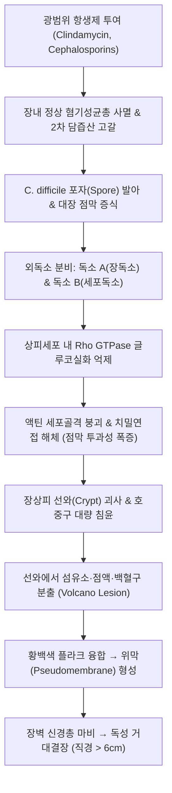

# 🩺 [[위막성 대장염]] (Pseudomembranous Colitis & Clostridioides difficile Infection / 僞膜性大腸炎, KCD A04.7 / ICD-10 A04.7)

> **핵심 3줄 요약 (Key Summary)**:
> - 📍 **병소 부위 & 병태생리**: [[대장]](결장 및 직장 전반) — 광범위 항생제 투여 후 정상 장내 혐기성 세균총 파괴(Dysbiosis) → 그람양성 포자형성 혐기성균인 [[Clostridioides difficile]] 과다 증식 → 독소 A(Enterotoxin) 및 독소 B(Cytotoxin) 분비로 Rho GTPase 억제, 상피 괴사 및 호중구·섬유소·점액 삼출물이 응집된 **화산 분출형 황백색 위막(Pseudomembrane)** 형성.
> - 🚩 **전형적 임상 양상 & 3대 징후**: 항생제 사용 중 또는 중단 수주 내 발생하는 **특유의 역한 냄새를 풍기는 다량의 녹황색 수양성 설사(1일 3~15회 이상)**, 하복부 산통 및 팽만감, 백혈구 증가증(WBC > 15,000/μL) 및 발열.
> - 🛠️ **핵심 감별 & 한·양방 치료 전략**: [[궤양성 대장염]], [[허혈 결장염]], 일반 감염성 장염 감별. 대변 GDH 항원/독소 EIA 및 PCR 검사 확진. 양방에서는 유발 항생제 즉각 중단, 경구 피닥소마이신(Fidaxomicin) 또는 반코마이신(Vancomycin) 투여, 재발 시 대변 미생물총 이식(FMT); 한의에서는 습열어독·비허습체 변증에 따라 [[갈근금련탕]], [[황련해독탕]], [[위령탕]] 및 합곡·곡지·천추 침구 치료로 장내 독소 해소 및 미생물 환경 정상화.
> - ⚠️ **응급 의뢰 레드플래그**: 설사가 갑자기 멈추면서 급격한 복부 팽만과 극심한 압통 발생 시 — 장폐색(Paralytic Ileus) 및 직경 > 6cm의 **독성 거대결장(Toxic Megacolon)**, 장 천공 및 패혈성 쇼크 진행 징후로 즉시 응급 외과 전원 필수 (지사제 투여 절대 금기).

---

## 📌 목차
1. [질환 개요 & 병태생리 (Disease Overview)](#1-질환-개요--병태생리-disease-overview)
2. [병태생리 메커니즘 & 대사·장기부전 악순환 네트워크](#2-병태생리-메커니즘--대사장기부전-악순환-네트워크)
3. [임상 증상 & 환자 소견 (Clinical Presentation)](#3-임상-증상--환자-소견-clinical-presentation)
4. [감별 진단 매트릭스 (Differential Diagnosis)](#4-감별-진단-매트릭스-differential-diagnosis)
5. [한의 통합 치료 프로토콜 (침·약침·한약)](#5-한의-통합-치료-프로토콜-침약침한약)
6. [양방 치료 & 병용·의뢰 기준 (Conventional Treatment & Referral)](#6-양방-치료--병용의뢰-기준-conventional-treatment--referral)
7. [식이·생활습관 & 자가관리 티칭 가이드](#7-식이생활습관--자가관리-티칭-가이드)
8. [💡 진료실 핵심 필기 & 임상 노하우](#8--진료실-핵심-필기--임상-노하우)
9. [출처 및 학술 참고 문헌 (References)](#9-출처-및-학술-참고-문헌-references)

---

## 1. 질환 개요 & 병태생리 (Disease Overview)

![[위막성_대장염_01_정상균총파괴및Cdiff증식도해.png|450]]
> [그림 1: ① 질환 개요 도해 — 항생제 노출 후 장내 미생물총 붕괴와 Clostridioides difficile 이상 증식 및 콜로니 형성 — Wikimedia Commons (PD)]

* **질환 정의 및 의인성 병인**:
  * 광범위 항생제 사용으로 장내 정상 세균총의 집락 형성 저항성(Colonization resistance)이 무너지면서, 포자 상태로 잠복하던 [[Clostridioides difficile]](구 Clostridium difficile)이 이상 증식하여 분비하는 강력한 외독소에 의해 결장 점막 전반에 염증과 위막이 형성되는 질환이다.
  * 대표적인 병원 내 감염증(Nosocomial infection)이자 항생제 연관 설사(AAD)의 가장 위험한 형태이다.
* **위험 약제 및 고위험군**:
  * **고위험 항생제**: 클린다마이신(Clindamycin), 2/3/4세대 세팔로스포린(Cephalosporins), 플루오로퀴놀론(Fluoroquinolones), 카바페넴(Carbapenems).
  * **고위험 환자군**: 65세 이상 고령자, 장기 입원 환자, 위산억제제(PPI/H2RA) 장기 복용자, 염증성 장질환(IBD) 환자, 항암치료/면역억제 상태.
* **관련 장기 및 침범 범위**:
  * **주 이환 장기**: [[대장]](결장 전반 및 직장) — 원위부 결장(S상결장, 하행결장)에 호발하나 대장 전층에 걸쳐 다발성 병변을 형성함.

---

## 2. 병태생리 메커니즘 & 대사·장기부전 악순환 네트워크

> ⚠️ **이미지 미확보 (2026-10-07)** — 출처·해상도 조건을 만족하는 원본을 확인하지 못해 슬롯을 비웁니다.

![[위막성_대장염_02_대장내시경다발성황색위막소견.png|450]]
> [그림 3: ③ 육안 병리 — 적출 대장 점막에 부착된 다발성 황백색 위막(Pseudomembranes) — 출처: Wikimedia Commons — File:Clostridioides (pseudomembranous) colitis.jpg]

### 1) 분자·세포 수준 기전
* **포자 발아와 콜로니 형성**: 정상 장내 균총이 생성하는 2차 담즙산(Secondary bile acids)은 C. difficile의 발아를 억제한다. 항생제로 인해 균총이 파괴되면 1차 담즙산이 증가하여 내열성 포자가 급격히 활동성 영양형(Vegetative cell)으로 발아한다.
* **독소 A(TcdA, Enterotoxin)의 장관 파괴**: 장상피 브러시 변연(Brush border)에 결합하여 장점막 치밀연접을 해체하고, 강력한 화학주성 인자를 방출하여 점막 내 호중구를 폭발적으로 유인하여 체액 분비성 수양성 설사를 촉발한다.
* **독소 B(TcdB, Cytotoxin)의 치명적 세포사멸**: 세포 내로 침투한 독소 B는 세포골격 조절 단백질인 **Rho GTPase(Rho, Rac, Cdc42)**를 비가역적으로 글루코실화(UDP-glucose 결합)하여 불활성화시킨다. 액틴 미세섬유가 붕괴하면서 상피세포가 원형으로 수축되고 급격한 괴사성 세포사멸에 이른다.
* **위막(Pseudomembrane) 형성 기전**: 괴사된 상피 선와(Crypt)로부터 호중구, 섬유소(Fibrin), 점액, 세포 잔해가 마치 화산이 분출하듯 점막 표면으로 뿜어져 나와(Volcano-like eruption) 점막 표면에 끈적끈적한 노란색/백색 융기성 위막을 형성한다.

### 2) 장기·계통 수준 결과
* 염증이 고유근층과 장근신경총(Auerbach's plexus)까지 파급되면 대장의 연동운동이 완전히 마비되어 결장이 비정상적으로 팽창하는 **독성 거대결장(Toxic megacolon)**이 초래된다.
* 장관벽 괴사로 인한 천공 및 세균혈증, 패혈성 쇼크로 급속히 악화될 수 있다.

---

## 3. 임상 증상 & 환자 소견 (Clinical Presentation)

![[위막성_대장염_03_CDI중증도평가및대변독소검사.png|420]]
> [그림 4: ④ 영상 — 복부 CT(관상 재구성): 대장벽 비후 및 주위 염증 소견 — 출처: Wikimedia Commons — File:Pseudomembranoese Colitis coronar.jpg]

> ⚠️ **이미지 미확보 (2026-10-07)** — 출처·해상도 조건을 만족하는 원본을 확인하지 못해 슬롯을 비웁니다.

### 1) 주소증 및 핵심 증상
* **다량의 수양성 설사 (Watery Diarrhea)**:
  * 항생제 치료 시작 2~3일 후부터 중단 후 2~8주(최장 3개월) 사이에 발현.
  * 하루 3~15회 이상의 물설사. 점액이 섞일 수 있으나 육안적 대량 혈변은 비교적 드묾.
  * **특유의 악취**: "말 우리 냄새(Horse barn odor)" 또는 시큼하고 역한 냄새가 진동함.
* **전신 및 복부 증상**:
  * 하복부 경련성 통증, 복부 팽만, 식욕부진, 미열 또는 고열(>38.5℃).
  * 수분 전해질 소실로 인한 탈수, 저칼륨혈증, 핍뇨, 기립성 어지럼증.

### 2) 객관적 검사 소견
* **대변 검사 (진단의 표준)**:
  * **대변 GDH(Glutamate Dehydrogenase) 항원 검사**: 민감도 90% 이상의 신속 선별검사.
  * **대변 독소 A/B 면역검사(Toxin EIA)**: 활동성 독소 생성 확인(특이도 높음).
  * **핵산증폭검사(NAAT / PCR)**: 독소 유전자(tcdB) 검출(민감도/특이도 > 95%).
* **혈액학적 검사**:
  * 현저한 백혈구 증가증(Leukocytosis): WBC 15,000~50,000/μL (중증 지표).
  * 혈청 크레아티닌(Creatinine) 기저치 대비 1.5배 이상 상승 (신손상 지표).

### 3) CDI 중증도 분류 (SHEA/IDSA & ACG 가이드라인)

| 중증도 단계 | 진단 기준 | 권고 치료 방침 |
| :--- | :--- | :--- |
| **비중증 (Non-severe)** | WBC ≤ 15,000/μL AND Serum Cr < 1.5 mg/dL | 경구 피닥소마이신 200mg bid (10일) 또는 경구 반코마이신 125mg qid |
| **중증 (Severe)** | **WBC > 15,000/μL OR Serum Cr ≥ 1.5 mg/dL** | 경구 피닥소마이신 또는 경구 반코마이신 적극 투여, 집중 모니터링 |
| **전격성 (Fulminant)** | 저혈압(쇼크), 장폐색(Ileus), 독성 거대결장 동반 | 경구 고용량 반코마이신(500mg qid) + 반코마이신 관장 + 정맥 메트로니다졸 |

---

## 4. 감별 진단 매트릭스 (Differential Diagnosis)

| 감별 질환 | 특징적 양상 | 감별 포인트 (검사·수치) |
| :--- | :--- | :--- |
| **[[위막성 대장염]] (본 질환)** | 항생제 노출력, 악취 수양변, 백혈구 급증 | **대변 GDH 및 독소 A/B 양성**, 내시경 황백색 위막 |
| 단순 항생제 연관 설사(AAD) | 항생제 복용 중 경미한 묽은 변, 전신 증상 없음 | **대변 독소 음성**, 백혈구 정상, 항생제 중단 시 즉시 호전 |
| [[궤양성 대장염]] 급성 악화 | 혈변 우세, 뒤무직, 이전 IBD 병력 | 내시경 연속적 미만성 점막 염증, 조직 생검상 음와 농양 |
| [[허혈 결장염]] | 고령자, 급성 좌하복통 직후 24시간 내 암적색 혈변 | 비장굴곡부/S상결장 분절성 병변, CT 무지압흔 징후 |
| [[급성 감염성 장염]](Campylobacter 등) | 오염된 음식 섭취력, 고열, 복통, 혈성 설사 | 대변 세균 배양검사 또는 다중 위장관 병원체 PCR 양성 |

---

## 5. 한의 통합 치료 프로토콜 (침·약침·한약)

![[위막성_대장염_05_침구치료합곡곡지천추상거허.png|450]]
> [그림 6: ⑥ 한의 시술 — 경락·경혈 도해(합곡·곡지·천추·상거허) — ⚠️ 원본 출처 미확인 (2026-10-07 재조달 대상)]

* **변증 분류**:
  * **습열어독형(濕熱瘀毒型)**: 급성기, 폭발적 수양성 설사, 복통 경련, 발열, 오심, 설홍태황니, 맥활삭.
  * **열독치성형(熱毒熾盛型)**: 중증기, 고열, 섬어, 복부 팽만, 대변 부패 악취, 설강태황조, 맥홍삭.
  * **비허습체형(脾虛濕滯型)**: 만성 재발기, 묽은 변 지속, 식욕부진, 기력 저하, 설담태백니, 맥세약.
* **침구 치료 (Acupuncture)**:
  * **청열해독 및 대장 사열 주혈**:
    * **[[합곡]](LI4) · [[곡지]](LI11)**: 수양명대장경 원혈/합혈, 장내 열독(熱毒) 배출 및 전신 염증 반응 진정.
    * **[[천추]](ST25)**: 대장모혈, 대장 신경총 흥분 억제 및 설사 신속 제어.
    * **[[상거허]](ST37)**: 대장하합혈, 대장 질환의 특효혈로서 장관 연동 이상을 정상화.
  * **자침 기법**: 급성 습열기에는 강자극 사법(瀉法)을 적용하며, 뜸(온구)은 장내 열독을 조장할 수 있으므로 급성기에는 금기.
* **약침 치료 (Pharmacopuncture)**:
  * **황련해독탕 약침**: 천추, 상거허 부위에 시술하여 장관 국소 염증성 사이토카인 억제.
* **한약 치료 (Herbal Medicine)**:
  * **청열조습(淸熱燥濕) 및 해독 방제**:
    * **[[갈근금련탕]](葛根芩連湯)**: 갈근, 황련, 황금, 감초 — 표증 미해(未解)와 협열하리(協熱下利)의 대표 방제. 황련의 베르베린(Berberine)은 C. difficile의 증식 및 독소 생성을 직접 억제함.
    * **[[황련해독탕]](黃連解毒湯)**: 고열과 장관 독소 삼출이 심한 열독치성형에 투여.
    * **[[위령탕]](胃苓湯) 가미방**: 비허습체형 설사에 평위산과 오령산을 합방하여 장관 내 수분 정체를 배출.
  * **회복기 장내 미생물 환경 복원**:
    * 관해기에는 **[[삼령백출산]](蔘苓白朮散)**을 투여하여 손상된 장점막을 재건하고 장내 유익균 집락 형성을 촉진.

---

## 6. 양방 치료 & 병용·의뢰 기준 (Conventional Treatment & Referral)

* **원인 항생제 관리 및 1차 표준 약물**:
  * **원인 약제 즉각 중단**: C. difficile 감염을 유발한 기존 항생제를 즉시 중단하는 것만으로도 경증의 15~20%는 호전됨.
  * **표준 경구 항균제**:
    * **피닥소마이신([[Fidaxomicin]], 1차 최우선 권고)**: 200 mg bid, 10일간 복용. C. difficile에만 선택적으로 작용하여 정상 균총을 보존하므로 재발률이 가장 낮음.
    * **경구 반코마이신([[Vancomycin]], 표준 1차)**: 125 mg qid, 10일간 경구 복용. (정맥 주사용 반코마이신은 장관 내강으로 분비되지 않으므로 경구 투여 필수).
* **난치성/재발성 환자 치료: 대변 미생물총 이식 (FMT)**:
  * **대변 미생물총 이식(Fecal Microbiota Transplantation, FMT)**: 2회 이상 재발한 환자에게 건강한 공여자의 대변 미생물을 대장내시경 또는 캡슐로 이식. 완치율 90% 이상으로 장내 미생물총을 복원하는 표준 치료 (Kelly et al., 2021; Hsu et al., 2025).
* **한의 1차 진료실 절대 금기**:
  * ❌ **로페라마이드([[Loperamide]]) 등 지사제 투여 절대 금지**: 장 연동을 마비시켜 세균 독소의 관강 내 체류를 유발하여 독성 거대결장 및 천공을 촉발함.
* **양방 응급 의뢰 기준 (Emergency Referral)**:
  * WBC > 20,000/μL, 고열, 복부 팽만 및 장음 소실(장마비 의심).
  * 단순 복부 X선상 횡행결장 직경 > 6cm 확장(독성 거대결장) 확인 시 즉시 외과 전원.

---

## 7. 식이·생활습관 & 자가관리 티칭 가이드

![[위막성_대장염_07_접촉격리수칙및FMT미생물식이.png|400]]
> [그림 7: ⑦ 감염관리 — 비누를 사용한 손씻기(접촉 격리) 안내 포스터 — ⚠️ 원본 출처 미확인 (2026-10-07 재조달 대상)]

* **철저한 접촉 격리 및 손위생 수칙 (알코올 소독제 무효!)**:
  * **비누와 물 손씻기**: C. difficile의 아포(Spore)는 알코올 소독제에 사멸하지 않는다. 반드시 흐르는 물에 비누로 30초 이상 문질러 물리적으로 씻어내야 한다.
  * **환경 소독**: 환자가 사용한 화장실, 변기, 문손잡이는 희석된 락스(차아염소산나트륨, 1:10 희석)로 닦아야 포자가 사멸한다.
* **수분 및 전해질 공급 요법**:
  * 잦은 수양성 설사로 인한 탈수를 예방하기 위해 경구 수액제(ORS) 또는 미온수에 소금과 전해질을 소량 탄 물을 수시로 섭취.
* **장내 균총 회복 식단**:
  * 치료 완료 후 급성기가 지난 뒤 프로바이오틱스(Saccharomyces boulardii 등 검증된 효모균/유산균) 섭취.
  * 유당불내증이 흔히 동반되므로 치료 중 우유 및 유제품 섭취는 중단.

---

## 8. 💡 진료실 핵심 필기 & 임상 노하우

* **비오님 임상 포인트: "항생제 먹고 설사하는 환자에게 지사제를 주지 마라"**:
  * 치과 치료, 방광염, 감기 등으로 항생제를 먹은 뒤 심한 설사가 난다고 내원하는 환자에게 로페라마이드나 지사 한약을 덜컥 처방하면 치명적인 독성 거대결장을 초래할 수 있다. 항생제 복용력을 확인하고 대변 C. diff 독소 검사를 우선 의뢰해야 한다.
* **설사가 갑자기 멈추는 것을 경계하라**:
  * 하루에 10번씩 물설사를 하던 환자가 "원장님, 어제부터 설사가 싹 멎었는데 배가 터질 것처럼 빵빵해졌어요"라고 한다면 나은 것이 아니라 장이 마비된 것이다. 청진 시 장음이 소실되어 있다면 즉시 대학병원 응급실로 보내야 한다.
* **황련(黃連)의 현대 미생물학적 재조명**:
  * 갈근금련탕의 주약인 황련의 베르베린 성분은 메트로니다졸에 필적하는 C. diff 정균력을 가지며, 서양의학적 표준 항생제 투여 후 재발 방지기에 비허습체 한약과 병용 시 장내 균총 정상화에 크게 기여한다.

---

## 9. 출처 및 학술 참고 문헌 (References)

- **Kelly CR et al. (2021)**. ACG Clinical Guidelines Prevention Diagnosis and Treatment of Clostridioides difficile Infections. *Am J Gastroenterol*. [PMID 34160416](https://pubmed.ncbi.nlm.nih.gov/34160416/)

- **Bae JY et al. (2025)**. Clinical Approaches to Clostridioides difficile Infection Management Insights From a Nationwide Survey of Korean Physicians. *Gut Liver*. [PMID 42237172](https://pubmed.ncbi.nlm.nih.gov/42237172/)

- **Hsu R et al. (2025)**. Fecal Microbiota Transplantation in 2025 Two Steps Forward One Step Back. *Curr Gastroenterol Rep*. [PMID 41530607](https://pubmed.ncbi.nlm.nih.gov/41530607/)
