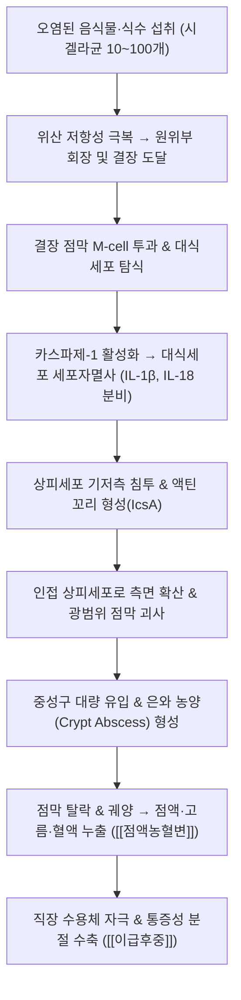

# 이질 (Dysentery / Bacillary Dysentery, 痢疾 / 세균성 이질, A03, A06.0)

> **상위 분류**: [[소화기 질환]] > [[하부위장관 질환]] > [[급성 감염성 장염]]
> **핵심 3줄 요약 (Key Summary)**:
> - 📍 병소 부위 & 해부·병태생리: 시겔라속 균([[세균성 이질]] / Shigella) 또는 이질아메바(Amebic dysentery)가 결장(Colon) 점막 상피세포의 M-cell을 통해 침입하여 점막층과 점막하층에 급성 화농성 염증, 은와 농양(Crypt abscess), 광범위 궤양을 형성하는 감염성 대장 질환.
> - 🚩 전형적 임상 양상 & 3대 징후: 하복부 산통, 배변 후에도 뒤가 무겁고 시원치 않은 **이급후중(Tenismus / 裏急後重)**, 점액과 고름, 혈액이 뒤섞인 **점액농혈변(Mucopurulent bloody diarrhea)**. 초기 고열과 수양성 설사 후 혈변으로 전환.
> - 🛠️ 핵심 감별 검사 & 한·양방 다각적 치료 전략: 대변 백혈구 도말 검사(Fecal leukocyte) 및 세균 배양(Stool culture), 격리 및 수액·전해질 공급, 천추(ST25)·상거허(ST37)·곡지(LI11) 자침, 청열조습 해독지리의 대표 명방인 **[[백두옹탕]](白頭翁湯)**, [[작약탕]](芍藥湯), [[향련환]](香連丸) 투약.
> - ⚠️ 응급 의뢰 레드플래그 & 악화 요인: 소아 및 고령자에서 용혈성 요독 증후군(HUS, Shiga toxin 매개 급성 신부전·혈소판감소성 빈혈), 중독성 거대결장(Toxic megacolon), 장관 천공([[복막염]]), 패혈성 쇼크 징후 시 즉시 상급 감염내과 격리 입원 의뢰.

---

## 📌 목차
1. [질환 개요 & 해부학적 병태생리](#1-질환-개요--해부학적-병태생리)
2. [병태생리 메커니즘 & 생체역학적 악순환 네트워크](#2-병태생리-메커니즘--생체역학적-악순환-네트워크)
3. [임상 증상 & 이학적 검사(Physical Exam) 알고리즘](#3-임상-증상--이학적-검사physical-exam-알고리즘)
4. [감별 진단 매트릭스 (Differential Diagnosis)](#4-감별-진단-매트릭스-differential-diagnosis)
5. [한의 통합 치료 프로토콜 (침·약침·추나·한약)](#5-한의-통합-치료-프로토콜-침약침추나한약)
6. [양방 치료 & 병용·의뢰 기준 (Conventional Treatment & Referral)](#6-양방-치료--병용의뢰-기준-conventional-treatment--referral)
7. [재활 운동 & 생활습관 티칭 가이드](#6-재활-운동--생활습관-티칭-가이드)
8. [💡 사용자 진료실 핵심 필기 & 임상 노하우 (Melt-In 잔여 심화 집약)](#7--사용자-진료실-핵심-필기--임상-노하우-melt-in-잔여-심화-집약)
9. [출처 및 학술 참고 문헌 (References)](#8-출처-및-학술-참고-문헌-references)

---

## 1. 질환 개요 & 해부학적 병태생리

![[이질_세균성이질_시겔라균_점막침습_병태기전도해.png|500]]
> [그림 1: ① 질환/병태생리 — 세균성 이질(Shigellosis) 시겔라균의 대장 상피세포 침습 및 점막하 염증성 괴사·궤양 형성 병태기전 도해 — Wikimedia Commons] M-cell을 통한 침입, 대식세포 세포자멸사 유도, 상피세포 간 액틴 중합 측면 확산 및 시가 독소(Shiga toxin) 분비 기전.

- **개념 정의 및 법정 감염병 분류**:
  - [[이질]](Dysentery, 痢疾)은 혈액과 점액을 함유하는 묽은 변을 자주 보며, 배변 시 뒤가 묵직하고 당기는 이급후중을 주증으로 하는 급성 장관 염증 질환이다.
  - 현대 의학적으로는 **[[세균성 이질]](Bacillary dysentery / Shigellosis)**과 **아메바성 이질(Amebic dysentery)**로 대별된다. 세균성 이질은 제2급 법정 감염병으로 분류되며, 매우 적은 균량(10~100개)만으로도 대변-구강(Fecal-oral) 경로를 통해 폭발적 집단 감염을 유발한다.
- **해부학적 이환 구역과 병리**:
  - 주로 원위부 결장(하행 결장, S자 결장)과 직장(Rectum) 점막을 집중 침범한다.
  - 상피세포 탈락, 미세 농양(Microabscess), 융합성 표재성 궤양, 위막(Pseudomembrane) 형성을 초래하며, 직장 팽대부의 과도한 염증성 경련으로 배변 후에도 변이 남아있는 듯한 극심한 이급후중이 유발된다.

---

## 2. 병태생리 메커니즘 & 생체역학적 악순환 네트워크

![[이질_대장해부_결장_직장_구조도해.jpg]]
> [그림 2: ② 관련 해부 구조물 — 이질균(시겔라·이질아메바)의 주 침범 호발 부위인 맹장·결장(상행·횡행·하행·S자) 및 직장 해부학 도해 (출처: OpenStax Anatomy, File:2420 Large Intestine.jpg)]

### 1) 시겔라균의 독특한 세포 내 침습 메커니즘
- **위산 저항성**: 위산(pH 2~3)에 매우 강하여 소량의 균으로도 소장과 대장에 안전하게 도달함.
- **상피세포 내 측면 확산**: 제3형 분비계(T3SS)를 통해 이펙터 단백질을 주입하여 장 상피세포의 포식작용을 유도한 뒤, 세포질 내에서 숙주의 세포골격인 **액틴(Actin)**을 중합하여 로켓처럼 인접 세포로 직접 뚫고 들어감(세포 간 측면 확산).
- **시가 독소 (Shiga Toxin, Stx)**: *S. dysenteriae* 1형이 분비하는 단백독소로, 혈관 내피세포의 28S 리보솜을 절단하여 단백 합성을 차단함으로써 장점막 괴사와 함께 모세혈관 혈전을 유발, [[용혈성 요독 증후군]](HUS)을 초래함.

---

## 3. 임상 증상 & 이학적 검사(Physical Exam) 알고리즘

### 1) 질병 경과 및 3단계 증상 전개
1. **잠복기 및 전구기 (12~48시간)**: 돌발성 고열(38~40℃), 오한, 두통, 전신 권태감, 오심·구토.
2. **소장기 (초기 1~2일)**: 세균독소로 인한 공장·회장의 분비성 수양성 설사(물설사), 배꼽 주변의 산통.
3. **결장기 (2~3일 이후 전형기)**: 열은 점차 떨어지나 설사 횟수가 하루 10~30회 이상으로 폭증하며, 대변이 쌀뜨물 모양에서 피와 점액, 고름이 뒤섞인 **점액농혈변(Mucopurulent bloody stool)**으로 바뀜. 배변 전후에 쥐어짜는 듯한 좌하복부 산통과 **이급후중(裏急後重)**이 극에 달함.

### 2) 이학적 진찰 및 진단 검사
- **복부 촉진**: 좌하복부(S자 결장 부위)의 뚜렷한 압통과 장관 연축(Rope-like spasm) 촉진.
- **대변 검사**:
  - 대변 현미경 도말 검사: 다수의 다형핵 백혈구(PMN > 50/HPF) 및 적혈구 관찰 (침습성 염증 확진).
  - 대변 세균 배양(Stool culture): MacConkey 한천 배지에서 젖당 비분해 집락 확인 및 혈청형 동정.

---

## 4. 감별 진단 매트릭스 (Differential Diagnosis)

| 감별 질환 | 원인 병원체 / 기전 | 설사 성상 및 주요 증상 | 감별 핵심 포인트 |
| :--- | :--- | :--- | :--- |
| **[[세균성 이질]] (Shigellosis)** | 시겔라속 균 (침습성) | **소량 빈번한 점액농혈변, 극심한 이급후중** | 대변 내 다량의 백혈구, 급성 발열 후 혈변 |
| **아메바성 이질 (Amebiasis)** | Entamoeba histolytica | **'초콜릿색(딸기잼)' 점액혈변**, 발열 경미 | 내시경 상 플라스크형 궤양(Flask-shaped), 영양체 검출 |
| **[[장티푸스]] (Typhoid)** | Salmonella Typhi | 계단식 지속성 고열, 서맥, 장미진, 수양성 설사 | 전신성 감염증, 백혈구 감소증, 혈액 배양 양성 |
| **[[궤양성 결장염]] (UC)** | 자가면역성 만성 IBD | 만성 점액혈변, 이급후중, 체중감소 | 수개월 이상 지속되는 만성 경과, 감염 음성 |
| **콜레라 (Cholera)** | Vibrio cholerae (비침습성 독소) | **통증 없는 폭발적 쌀뜨물 설사(Rice-water)** | 혈액·점액 없음, 이급후중 없음, 급격한 탈수 쇼크 |

---

## 5. 한의 통합 치료 프로토콜 (침·약침·추나·한약)

![[이질_치료본초_백두옹_약용식물_실측사진.jpg]]
> [그림 3: ③ 치료·시술점 — 급성 감염성 이질(세균성·아메바성) 청열해독·양혈지리(凉血止痢)의 대표 처방인 백두옹탕(白頭翁湯)의 주치 본초 백두옹(Pulsatilla chinensis) 실측 사진 (출처: Wikimedia Commons, File:Pulsatilla chinensis.jpg)]

> ⚠️ **주의**: 급성 세균성 이질은 법정 감염병으로 보건소 신고 및 격리 치료(항생제 투여, 수액 요법)가 우선되어야 함. 한의 치료는 장점막 염증 억제, 이급후중 및 복통의 신속 진통, 장점막 재생 촉진의 병용 치료로 탁월한 효과를 발휘함.

### 1) 침구 치료 (Acupuncture)
- **주혈**: [[천추]](ST25), [[상거허]](ST37), [[곡지]](LI11), [[음릉천]](SP9), [[합곡]](LI4), [[내관]](PC6).
  - **[[천추]](ST25)**: 대장의 모혈로 장관 연축을 풀고 복통과 이급후중을 신속히 진정. 직자 1.0~1.5촌, 사법.
  - **[[상거허]](ST37)**: 대장의 하합혈(下合穴)로서 대장 습열을 사하고 배변 횟수를 줄임.
  - **[[곡지]](LI11)·[[합곡]](LI4)**: 대장경의 원혈과 합혈로 체내 습열 독소를 청열해독.
  - **[[음릉천]](SP9)**: 비경의 합수혈로 중초와 하초의 수습(水濕)을 소변으로 분리 배출.

### 2) 변증별 한약 치료 (Herbal Medicine)
- **습열리 (濕熱痢) / 열독리 (疫毒痢) - 급성기 세균성 이질의 90%**:
  - 병태: 적백 점액농혈변, 배변 후 항문 작열감, 심한 이급후중, 고열 번갈, 설홍태황니, 맥 활삭.
  - 치법: 청열조습(淸熱燥濕), 양혈해독(凉血解毒), 행기조혈(行氣調血).
  - 처방: **[[백두옹탕]] (白頭翁湯)** 또는 **[[작약탕]] (芍藥湯)**, **[[향련환]] (香連丸)**.
  - 약재 구성:
    - **[[백두옹탕]]**: [[백두옹]] 15g, [[황련]] 9g, [[황백]] 9g, [[진피]](물푸레나무껍질) 9g. 백두옹의 사포닌 성분이 아메바 및 이질균을 강력 살균하고 황련·황백이 세균성 내독소(LPS)와 염증성 사이토카인을 억제.
    - **[[작약탕]]**: "행혈즉변농자유(行血則便膿自癒), 조기즉후중자제(調氣則後重自除)"의 원칙에 따라 [[백작약]], [[당귀]], [[황련]], [[황금]], [[대황]], [[목향]], [[빈랑]], [[육계]], [[감초]] 배오. 복통과 이급후중 해소의 최고 명방.
- **한습리 (寒濕痢) / 비신양허리 (脾腎陽虛痢)**:
  - 병태: 흰 점액변(백리) 위주, 하복부 냉통, 온수 음용 선호, 사지냉, 맥 침지.
  - 치법: 온중조습(溫中燥濕), 건비온양(健脾溫陽).
  - 처방: **위령탕 (胃苓湯)** 또는 **부자이중탕 (附子理中湯)**.

---

## 6. 양방 치료 & 병용·의뢰 기준 (Conventional Treatment & Referral)

> 🎯 **이 섹션의 목적**: 환자가 **양방약을 이미 복용 중인 경우가 많다.** 한의원 1차 진료에서 양방 치료를 이해하고, 병용 가능·주의·금기를 판단하며, 언제 의뢰할지 결정한다.

* **약물 치료 (Medication)**:
  * 계열별 약물·용량·기간 — 국내 처방 관행 반영.
  * 작용 기전과 한의 치료와의 상호작용.
* **비약물 시술 (Procedures)**:
  * 주사·차단술·물리치료·보조기 등.
* **수술·시술 적응증 (Surgical Indication)**:
  * 언제 수술로 가는가 — 절대·상대 적응증, 수술 후 경과.
* **한의 병용 판단 (Combination Therapy)**:
  * 병용 가능 / 주의 / 금기. 복용 중 환자의 감량 타이밍·반동 현상.
* **양방·전문과 의뢰 기준 (Referral Criteria)**:
  * 응급 의뢰 트리거와 전문과 의뢰 기준(정형외과·신경외과·내과 등).

	(작성 필요)

---

## 7. 재활 운동 & 생활습관 티칭 가이드

- **철저한 개인위생 및 전파 차단 (예방 제1원칙)**:
  - 환자 대변 배설물 접촉 후 반드시 흐르는 물에 비누로 **30초 이상 손 씻기**.
  - 환자가 사용한 화장실 변기, 문손잡이는 차아염소산나트륨(락스 1,000 ppm)으로 철저 소독.
  - 조리 종사자는 완치 판정(항생제 중단 48시간 후 24시간 간격 대변 배양 2회 연속 음성) 시까지 조리 업무 전면 배제.
- **경구 수액 요법 (Oral Rehydration Therapy, ORS)**:
  - 심한 점액혈변으로 인한 탈수와 전해질 불균형을 막기 위해 전해질 수액을 충분히 음용.
- **식이 관리**:
  - 급성기에는 미음, 쌀죽을 소량씩 섭취하며, 장점막 궤양을 자극하는 유제품, 고지방식, 자극성 향신료 엄금.

---

## 8. 💡 사용자 진료실 핵심 필기 & 임상 노하우 (Melt-In 잔여 심화 집약)

> 다음은 기존 진료실 원본 필기에서 축적된 핵심 의안과 임상 노하우를 원문 그대로 100% 융합 보존한 기록입니다.

- **이질의 기본 정의 및 발병 특성**:
  - 혈액과 점액을 함유하는 묽은 변, 설사 증상을 보이는 병태를 이질로 분류함. 주로 음식으로 인해 나타나며 여름과 가을에 호발함.
  - 시겔라 균(Shigella)이 일으키는 감염병으로 환자 또는 보균자가 배출한 대변을 타인이 먹었을 때 전파되며, 매우 적은 양으로도 쉽게 감염됨.
- **역학적 특징 및 임상 경과**:
  - 시겔라 균을 먹고 12시간 후 발열, 복통, 물설사 발생 -> 1~2일 이후 열이 떨어지고 설사가 줄어들지만 **점액질 혈변**을 보이며, 치료하지 않으면 만성으로 지속됨.
  - 국내에서는 1년에 100명 이내 발생하며 주로 필리핀, 베트남 등 동남아 여행 후 귀국자에게서 빈발함.
- **병리 메커니즘**:
  - 시겔라균은 감염 용량이 극히 적고 대장 상피세포의 세포자멸사(Apoptosis)를 유도하기 때문에 주름창자(대장)의 표면 상피층을 광범위하게 손상시킴.
- **설사의 임상 원인균 감별 요결**:
  - **혈설사 (Bloody diarrhea)**: [[세균성 이질]](시겔라증), [[장티푸스]], 아메바. (※ 장티푸스도 점액질 혈변을 보이나 전신 열증이 지속되는 것이 주요 구분점).
  - **물설사 (Watery diarrhea)**: 콜레라, 캄필로박터, 살모넬라 등.
- **부위별 주요 소화기 감별 균주**:
  - 위: 주로 헬리코박터 파일로리균.
  - 소장과 대장: 콜레라, 캄필로박터, 시겔라, 장티푸스, 예르시니아, 병원성 대장균, 휘플, 미코박테리아.
- **의안 분석 및 한의 치법 노하우**:
  - 감염성 질환으로 열이 나고 대변이 끈적하므로 **습열증(濕熱證)**으로 귀납됨.
  - 습열증의 경우 [[대황]], [[창출]], [[도인]], [[독활]], [[천궁]]을 적절히 배오하여 장내 열을 내리고 막힌 울체를 뚫으며(통락), 수습(水濕)을 제거하여 장관 점막의 회복을 촉진함.

---

## 9. 출처 및 학술 참고 문헌 (References)

1. **Kotloff KL, et al.** Heterogeneity in Shigella infections in children: a subnational approach quantifying risk, mortality, and morbidity. *Lancet Glob Health*. 2020;8(1):e101-e112. (PMID: 31734154)
2. **Mattock AM, Blocker AJ.** How microbiological tests reflect bacterial pathogenesis and host adaptation in Shigella. *Braz J Microbiol*. 2021;52(4):1855-1868. (PMID: 34251610)
3. **Mellies JL, et al.** SepA Enhances Shigella Invasion of Epithelial Cells by Degrading Alpha-1 Antitrypsin and Producing a Neutrophil Chemoattractant. *mBio*. 2021;12(5):e0186921. (PMID: 34724811)
4. **대한한방내과학회 소화기내과학 교재편찬위원회.** 한방소화기내과학. 군자출판사; 2021.
5. **동의보감 (東醫寶鑑)**. 내경편(內景篇) 권이(卷二) 대변(大便) 이질(痢疾).