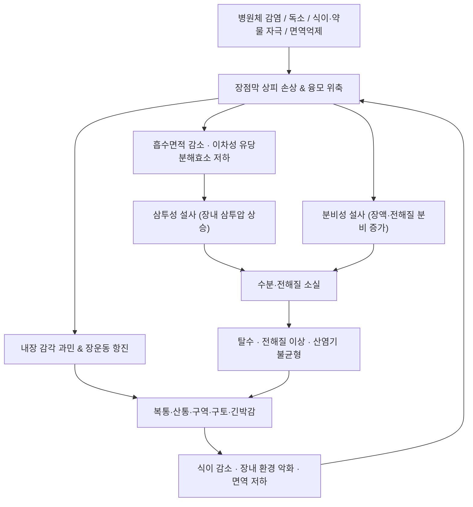

# 🩺 [[장염]] (Enteritis / 腸炎, ICD-10 A09 · A08 · K52.9 / KCD-8 A09 · A08 · K52.9)

> **핵심 3줄 요약 (Key Summary)**:
> - 📍 병소 부위 & 해부·병태생리: 소장(십이지장·공장·회장) 및 대장 점막의 염증으로, 상피세포 손상 → 융모 위축 → 흡수면적 감소([[소장 융모]], [[미세융모]])와 장액·전해질 분비 증가가 동시에 일어나 **삼투성 + 분비성 설사**가 혼합되어 나타난다. 장운동 항진과 내장 감각 과민([[장근층신경총]], [[점막하신경총]], [[미주신경]], [[상장간막신경총]])이 복통·연축의 기원이다.
> - 🚩 전형적 임상 양상 & 3대 징후: **설사(수양성/혈성) · 복통(배꼽주위 또는 좌우 하복부) · 구역·구토**가 3대 주소증이며, 여기에 발열·식욕부진·탈수 징후(구강건조, 소변량 감소, 기립성 어지럼)가 동반된다.
> - 🛠️ 핵심 감별 검사 & 한·양방 다각적 치료 전략: 복부 시진–청진–타진–촉진 순서의 [[복부 이학적 검사]], 탈수 평가, CBC/CRP/전해질, 대변 배양·PCR이 핵심. 한의학적으로는 濕熱·寒濕·食積·脾胃虛弱 변증에 따라 침(中脘 CV12, 天樞 ST25, 足三里 ST36, 上巨虛 ST37, 陰陵泉 SP9) + 약침 + 복부 수기 + 한약(藿香正氣散, 葛根黃芩黃連湯, 參苓白朮散 등)을 통합 적용한다.
> - ⚠️ 응급 의뢰 레드플래그 & 악화 요인: 혈변·흑색변, 고열(38.5℃ 이상 지속), 반발통·방어성 긴장 등 복막자극징후, 담즙성/분변성 구토, 12시간 이상 소변 정지, 의식 변화·경련, 심한 탈수(피부긴장도 저하·모세혈관 재충만 지연), 면역억제자·고형장기이식 환자의 설사, 영아·고령자·임산부의 급성 설사. **의심 시 즉시 상급병원 의뢰** — 혈성 설사·발열 동반 시 지사제(로페라마이드 등) 임의 복용 금지, 복부 심부 마사지·강한 복부 추나 금기.

---

## 📌 목차
1. [질환 개요 & 해부학적 병태생리](#1-질환-개요--해부학적-병태생리)
2. [병태생리 메커니즘 & 생체역학적 악순환 네트워크](#2-병태생리-메커니즘--생체역학적-악순환-네트워크)
3. [임상 증상 & 이학적 검사(Physical Exam) 알고리즘](#3-임상-증상--이학적-검사physical-exam-알고리즘)
4. [감별 진단 매트릭스 (Differential Diagnosis)](#4-감별-진단-매트릭스-differential-diagnosis)
5. [한의 통합 치료 프로토콜 (침·약침·추나·한약)](#5-한의-통합-치료-프로토콜-침약침추나한약)
6. [재활 운동 & 생활습관 티칭 가이드](#6-재활-운동--생활습관-티칭-가이드)
7. [💡 사용자 진료실 핵심 필기 & 임상 노하우 (Melt-In 잔여 심화 집약)](#7--사용자-진료실-핵심-필기--임상-노하우-melt-in-잔여-심화-집약)
8. [출처 및 학술 참고 문헌 (References)](#8-출처-및-학술-참고-문헌-references)

---

## 1. 질환 개요 & 해부학적 병태생리

![[장염_2.jpg|540]]
> [그림 1: ① 병태생리·영상 — Histology, histochemistry and lectin-binding of the esophagus (A–C) and stomach (D–F) of P. pipistrellus. For classical ]

* **질환 정의 및 분류**:
  * **장염(enteritis)** 은 위장관, 그중에서도 **소장(십이지장·공장·회장)** 및 **대장** 점막에 염증이 발생한 상태를 통칭한다. 위 점막까지 함께 침범하면 **위장관염(gastroenteritis)** 이라 부르며, 임상에서는 두 용어가 거의 혼용된다. 본 노트의 별칭인 **소장염·급성 장염·위장관염**은 이 스펙트럼을 가리킨다.
  * **원인별 분류**: ① 감염성(바이러스성·세균성·기생충성) ② 비감염성(약물성, 방사선성, 염증성 장질환, 허혈성, 호산구성, 자가면역성). 감염성 장염의 개관과 진단·치료 접근은 Fry의 종설(1990, PMID 2190764)에서 정리된 바 있다.
  * **경과별 분류**: 급성(수일 이내, 대부분 바이러스성·식중독성) / 지속성(14일 이상) / 만성(30일 이상). 만성·재발성 설사는 흡수장애, 염증성 장질환, 과민성 장증후군 등 비감염성 원인 감별이 필수다.
  * **역학적 특성**: 바이러스성 위장관염은 전 세계적으로 급성 설사의 가장 흔한 원인군 중 하나이며, 소아에서 중증 탈사를 유발하는 주요 원인으로 보고된다(Flynn & Olortegui, *Lancet* 2024, PMID 38340741). 소아 바이러스성 장염의 임상·병태생리는 Hamilton의 고전적 고찰(1988, PMID: 34464930 (⚠️ 제목 근사 — 확인 필요/2026-09-24))에서 정리되었다. **연간 발생 건수·사망률 등 구체적 수치는 본 노트에서 1차 원문 확인 전이므로 '근거 미확인'으로 둔다.**
  * **특수 모집단**: **고형장기이식 수혜자**에서는 면역억제 상태로 인해 거대세포바이러스(CMV)·노로바이러스·아데노바이러스 등에 의한 **바이러스성 장염**이 주요 감별이자 이환·사망의 중요한 원인이 된다(Abbas & Zimmer, *Viruses* 2021, PMID 34696449). 이 군에서는 통상적 급성 장염보다 경과가 길고 중증화 위험이 크다.
  * 참고로 수의학 영역에서도 마(馬)의 위염·장염·대장염은 산업적으로 중요한 질환군으로 별도 정리되어 있다(Uzal & Diab, 2015, PMID 26048413) — 인체 적용을 위한 직접 근거는 아니며, 병리조직학적 염증 패턴 이해의 참고 수준으로만 인용한다.

* **관련 해부학적 구조물**:
  * **소화관 벽 구조**: 점막(상피–고유판–점막근육판) → 점막하층 → 근층(윤상근·종주근) → 장막. 염증은 주로 점막·점막하층에서 시작해 심부로 진행하면 궤양·천공 위험이 생긴다.
  * **흡수 단위**: [[소장 융모]](villi)와 그 표면의 [[미세융모]](brush border)가 흡수 표면적의 대부분을 담당한다. 성숙 융모 상피세포가 손상되면 표면적이 급감하고, 동시에 [[음와]](crypt) 세포의 분비가 상대적으로 우세해져 **흡수↓·분비↑** 불균형이 만들어진다. 바이러스성 장염에서 융모 상피 손상과 이차적 이당류분해효소(특히 유당분해효소) 저하가 병태생리의 핵심이라는 설명은 Hamilton(1988, PMID: 34464930 (⚠️ 제목 근사 — 확인 필요/2026-09-24))에서 제시되었다.
  * **부위별 특징**: [[십이지장]](담즙·췌액 중화, 철·칼슘 흡수), [[공장]](당·아미노산·지방 흡수의 주 무대), [[회장]](담즙산·비타민 B12 흡수, [[회맹판]]을 통해 [[대장]]과 연결). 회장 말단 침범 시 담즙산 흡수 저하로 **삼투성·분비성 설사가 악화**될 수 있다.
  * **신경 조절계**: [[미주신경]](부교감, 장운동 촉진·분비 증가)과 내장신경(교감)의 균형, 그리고 장벽 내 [[점막하신경총]](Meissner) · [[장근층신경총]](Auerbach)이 국소 반사를 담당한다. 복통의 전달 경로는 [[복강신경총]] · [[상장간막신경총]] · [[하복신경총]]을 경유한다.
  * **림프·혈관**: [[장간막림프절]]을 통한 림프 파급과 [[문맥순환]]을 통한 전신 파급(균혈증·독소혈증)이 중증화의 경로다.
  * **체성 연관 구조**: 반복적 복통·설사로 [[복직근]]의 방어성 긴장, [[복횡근]]의 억제성 약화가 나타나며, 이는 복압 조절 실패와 호흡 패턴 변화로 이어진다. 복부 촉진 시 압통 부위와 근긴장 패턴을 함께 평가하는 이유가 여기에 있다.

---

## 2. 병태생리 메커니즘 & 생체역학적 악순환 네트워크

### 1) 해부학적·병리학적 손상 기전
* **바이러스성(가장 흔한 급성 원인군)**: 성숙 융모 상피세포에 감염되어 세포 용해와 융모 위축을 일으키고, 그 결과 ① 흡수 표면적 감소 ② 이당류분해효소 활성 저하(특히 유당) ③ 음와 분비세포의 상대적 우세가 발생하여 **삼투성 설사 + 분비성 설사**가 겹친다(Hamilton 1988, PMID: 34464930 (⚠️ 제목 근사 — 확인 필요/2026-09-24) / Flynn & Olortegui 2024, PMID 38340741).
* **세균성·독소성**: 독소 매개 분비성 설사(장액 분비를 강하게 자극)와 점막 침습형 염증성 설사(혈변·점액·발열 동반)로 나뉜다. 감염성 장염의 원인체 스펙트럼과 감별 접근은 Fry의 집대성 논문(1990, PMID 2190764)에서 정리되어 있다.
* **면역억제·이식 환자**: 세포매개 면역 저하로 CMV·노로바이러스·아데노바이러스 등이 만성·중증 경과를 보이며, 이식 후 설사의 중요한 감별 진단군을 형성한다(Abbas & Zimmer 2021, PMID 34696449).
* **점막 방어벽 붕괴**: 점액층·밀착결합(tight junction)·점막 면역글로불린 체계가 약화되면 독소·균체 전위가 촉진되어 전신 염증 반응으로 확대될 수 있다. **개별 매개체(프로스타글란딘·세로토닌 등)의 정량적 기여도는 본 노트에서 '근거 미확인'으로 표시한다.**
* **내장 감각 과민**: 염증 국소에서 발생한 국소 화학 매개체가 장벽 내 신경을 감작시켜, 실제 장내 자극이 크지 않아도 통증·긴박감으로 인지되는 상태가 만들어진다. 이는 급성기 이후에도 이어져 **감염 후 과민성 장증후군(PI-IBS)** 양상으로 전환될 수 있다(기전 수준의 개관은 감염성 장염 종설에서 다루어짐, Fry 1990).

### 2) 전신적 연쇄 반응 (Volume & Electrolyte Chain)
* 설사·구토로 인한 **체액 소실 → 세포외액 감소 → 혈장량 저하 → 기립성 저혈압·빈맥·소변량 감소**로 이어지며, 소아·고령자에서는 보상 여력이 적어 빠르게 악화된다.
* 구토가 동반되면 **저칼륨·저염소성 대사성 알칼리증**, 수양성 설사가 우세하면 **대사성 산증** 방향으로 기울 수 있다(방향성에 대한 일반 원칙이며, 개별 환자의 산염기 상태는 검사로 확진한다).
* 영양 흡수 저하와 식이 감소가 겹치면 **단백·비타민 결핍, 근력 저하, 창상 치유 지연**이 뒤따르고, 이는 다시 점막 재생 능력을 떨어뜨리는 악순환을 만든다.

### 3) 한의학적 병기 해석 (변증–병태 대응)
* **濕熱型**: 발열·갈증·점액혈변·설사 후 무거운 잔변감, 설태 황니 — 급성 염증·분비 항진기와 대응.
* **寒濕型**: 맑은 수양성 설사·복명(배에서 꾸르륵)·찬 것을 싫어함·사지 냉 — 장운동 항진 + 자율신경 실조 양상.
* **食積型**: 과식·불결식 후 트림·애취·복만·설사에 미소화 음식물 — 식이성 급성기.
* **脾胃虛弱型**: 만성·재발성 무른 변, 식후 즉시 변의, 피로·식욕부진 — 만성 염증 후 점막 회복 지연 및 흡수장애 양상.
* **肝脾不和型**: 긴장·스트레스로 악화되는 복통-설사 교대 — 뇌-장축 과민 기전과 임상적으로 대응.

---

## 3. 임상 증상 & 이학적 검사(Physical Exam) 알고리즘

### 1) 주소증 및 동반 증상
* **설사**: 급성 수양성(바이러스·독소성) vs 혈성·점액성(침습성 세균, 염증성 장질환, 허혈성). 빈도·양·색·냄새·혈액 혼입 여부, 야간 설사 여부(기질적 원인 시사)를 확인한다.
* **복통**: 배꼽 주위 또는 하복부의 산통·연축통. 배변 후 호전되는 양상이면 장성 통증 가능성이 높고, 배변과 무관하게 지속·국소화되면 복막 자극 등 다른 원인을 의심한다.
* **구역·구토**: 위장관염에서 흔하며, 담즙성·분변성 구토는 장폐색 적신호다.
* **전신 증상**: 발열, 오한, 근육통, 두통, 식욕부진, 체중 감소.
* **탈수 지표**: 구강·점막 건조, 피부긴장도 저하, 안구 함몰, 소변량 감소 및 진한 소변색, 기립성 어지럼, 소아의 함몰 천문, 모세혈관 재충만 지연.
* **경고 증상(즉시 감별)**: 혈변·흑색변, 38.5℃ 이상 고열, 심한 전신 쇠약, 의식 변화, 6시간 이상 구토 지속으로 경구 섭취 불가.

### 2) 필수 이학적 검사법 (Physical Examination)
* [[복부 시진]]: 복부 팽만, 국소 돌출, 수술 흉터(유착성 폐색 감별), 탈수로 인한 피부 주름.
* [[복부 청진]]: **촉진 전에 반드시 청진**. 장음 항진(급성 장염·초기 폐색) vs 장음 소실(마비성 장폐색·복막염)이 핵심 정보를 준다.
* [[복부 타진]]: 고음의 북소리(가스 저류), 이동성 둔탁(복수).
* [[복부 촉진]]: 압통 부위·반발통·방어성 긴장 평가. 우하복부 압통은 급성 충수염과의 핵심 감별점이다. **반발통·방어성 긴장은 복막자극징후로 즉시 의뢰.**
* [[McBurney 점 압통 검사]] / [[Rovsing 징후]] / [[psoas 징후]] / [[obturator 징후]]: 충수염 감별용.
* [[직장수지검사]]: 혈변, 잔변감, 종괴, 괄약근 긴장도 평가 — 혈변이나 종괴 의심 시 시행.
* [[탈수 평가 세트]]: 체중 변화, 혈압·맥박(기립성 변화), 피부긴장도, 모세혈관 재충만 시간, 소변량.
* [[장음 청진-촉진 순서 원칙]]: 시진 → 청진 → 타진 → 촉진 순으로 진행해야 장음 평가가 오염되지 않는다.

### 3) 보조 검사 (협진 연계)
| 검사 | 목적 | 해석 포인트 |
| :--- | :--- | :--- |
| CBC / CRP | 염증·탈수 평가 | 호중구 증가·좌방이동은 세균성 시사 |
| 전해질 · BUN/Cr | 탈수·신기능 | BUN/Cr 비 상승은 탈수 시사 |
| 대변 배양 · PCR | 원인체 확인 | 바이러스 PCR, 세균 배양, 기생충 검사 |
| C. difficile 독소/NAAT | 항생제 연관 설사 | 항생제·입원력 있는 환자에서 필수 |
| 대변 잠혈 · 백혈구 | 침습성 감염 감별 | 백혈구 양성은 염증성 원인 시사 |
| 복부 초음파 / CT | 구조적 원인 | 충수염·장폐색·농양·허혈 감별 |

---

## 4. 감별 진단 매트릭스 (Differential Diagnosis)

| 감별 질환 | 호발 병소 및 원인 | 주소증 차이점 | 특이적 이학적 검사 소견 |
| :--- | :--- | :--- | :--- |
| [[장염]] (본 질환) | 소장·대장 점막, 바이러스·세균·독소·약물 | 수양성 또는 혈성 설사 + 배꼽주위 산통 + 구역 | 복부 미만성 압통, 장음 항진, [[탈수 평가 세트]] 양성 |
| [[급성 충수염]] | 충수 돌기 폐쇄·감염 | 통증이 처음엔 배꼽주위 → 우하복부로 이동, 걸음걸이 이상 | [[McBurney 점 압통 검사]] 양성, [[Rovsing 징후]]·[[psoas 징후]] 양성 |
| [[염증성 장질환]](궤양성 대장염·크론병) | 대장·소장 전벽, 자가면역 | 만성·재발성 혈성 점액변, 체중감소, 야간 설사 | 직장수지검사 점액혈 흔적, 만성 빈혈 소견 |
| [[과민성 장증후군]](설사형) | 기질적 병변 없음, 뇌-장축 이상 | 배변 후 호전되는 복통, 점액변, 야간 증상 없음 | 발열·탈수·혈변 없음, 전신 상태 양호 |
| [[항생제 연관 설사 / C. difficile 장염]] | 항생제 후 장내 세균총 교란 | 항생제 사용 후 수일~수주 뒤 수양성 설사, 발열 | 복부 압통, 중증 시 독성 거대결장 위험 |
| [[약물성 설사]] | 부인과·당뇨·위장약 등 | 약물 시작/증량과 시간적 연관 | 발열 없음, 약물 중단 시 호전 |
| [[허혈성 장염 / 급성 장간막 허혈]] | 혈류 저하, 고령·심혈관질환 | 갑작스러운 심한 복통, 통증에 비해 검사 소견 경미 | 통증 강도에 비해 압통 경미, 장음 소실 |
| [[장폐색 / 마비성 장마비]] | 유착·종양·염증 | 복부 팽만, 담즙성·분변성 구토, 배변·배기 정지 | 장음 항진 후 금속성 음, 장음 소실 |
| [[이식 후 바이러스성 장염]] | 면역억제자, CMV·노로바이러스 등 | 지속성·재발성 설사, 발열, 범혈구감소 등 동반 | 면역억제 병력 청취가 결정적 (Abbas 2021, PMID 34696449) |

> **감별 원칙**: ① 발열 + 혈변 + 심한 복통 조합은 **침습성 감염 또는 염증성 장질환**으로 보고 지사제를 쓰지 않는다. ② 통증 강도와 이학적 소견이 불일치하면 **허혈·폐색성 병변**을 먼저 배제한다. ③ 14일 이상 지속되는 설사는 **흡수장애·만성 염증·기생충** 감별로 전환한다.

---

## 5. 한의 통합 치료 프로토콜 (침·약침·추나·한약)

> ※ 아래 한의학 변증·처방·혈위 내용은 한의학 교과서적 일반 원칙에 기반한 임상 서술이며, 본 노트에 인용된 개별 논문의 결론이 아니다. 침·약침의 특정 파라미터(주파수·용량 등)에 대한 근거 수준은 **근거 미확인**으로 표시한다.

* **침구 치료 (Acupuncture)**:
  * **급성기(濕熱·食積)**: [[中脘]](CV12) · [[天樞]](ST25) · [[足三里]](ST36) · [[上巨虛]](ST37) · [[內關]](PC6) · [[陰陵泉]](SP9) · [[曲池]](LI11) · [[合谷]](LI4). 열이 심하면 [[大椎]](GV14) · [[曲池]](LI11) 사혈 또는 자침을 가한다.
  * **만성·허증기(脾胃虛弱·寒濕)**: [[中脘]](CV12) · [[天樞]](ST25) · [[足三里]](ST36) · [[關元]](CV4) · [[氣海]](CV6) · [[脾俞]](BL20) · [[胃俞]](BL21) · [[大腸俞]](BL25) · [[小腸俞]](BL27)에 보법 위주로 자침하고, 복부혈에는 온구(灸)를 병행할 수 있다.
  * **전침(Electroacupuncture)**: ST36–ST37, CV12–ST25 조합이 복통·설사 조절 목적으로 임상 활용된다. 구체적 주파수·시간 설정의 우월성에 대해서는 **근거 미확인**이며 환자 반응에 따라 조정한다.
  * **자침 심도(교과서 기준 참고)**: 복부혈은 1.0–1.5寸, ST36·ST37은 1.0–1.5寸 범위에서 체형·지방층에 맞춰 조정한다. 복부 천자 시 장관 천공 위험을 항상 고려한다.
* **약침 치료 (Pharmacopuncture)**:
  * **급성 염증·습열기**: [[黃連解毒湯 약침]] 또는 [[葛根黃芩黃連湯 약침]]을 ST25·ST36·CV12·SP9에 소량 주입하는 방식이 임상에서 쓰인다. 주입량·농도는 제조 규격과 환자 상태에 따라 결정한다(구체적 용량의 우월성은 **근거 미확인**).
  * **만성·허증기**: [[香砂六君子湯 약침]] · [[補中益氣湯 약침]] 계열을 BL20·BL21·ST36에 적용하는 예가 있다.
  * **주의**: 급성 혈성 설사·고열·복막자극징후가 있는 환자에서는 약침을 포함한 복부 자극 치료를 보류하고 양방 협진을 우선한다.
* **추나 치료 (Chuna Manipulation)**:
  * **복부 근막 이완 수기**: 복직근·복횡근의 방어성 긴장을 완화하고 호흡-복압 패턴을 정상화한다. 급성 통증기에는 **극히 약한 압으로 시계방향 원형 마사지**만 적용한다.
  * **흉추·요추 가동 추나**: 내장-체성 반사 및 자율신경 조절 목적으로 흉추 5–9번(위·소장 분절 연관), 요추 1–2번(대장 연관) 부위의 가동성을 회복시킨다.
  * **금기**: 발열기, 급성 복막자극징후, 임신부의 복부 심부 수기, 원인 미상의 급성 복통, 장폐색 의심, 이식 환자에서의 강한 복부 조작.
* **한약 치료 (Herbal Medicine)**:
  * **급성 습열리(濕熱痢)**: [[葛根黃芩黃連湯]], [[藿香正氣散]](暑濕·구토 동반), [[黃連解毒湯]] 가미.
  * **한습·수양성 설사**: [[五苓散]], [[理中湯]] 계열.
  * **식적·과식성**: [[保和丸]], [[平胃散]] 가미.
  * **만성 비허·설사**: [[參苓白朮散]], [[香砂六君子湯]], [[補中益氣湯]].
  * **복통 위주**: [[芍藥甘草湯]] 가미(복직근 연축 완화 목적).
  * **투약 시 확인 사항**: 이식 환자의 면역억제제(타크로리무스·사이클로스포린 등)와 한약 성분 간 상호작용 가능성이 있으므로 **이식·면역억제 환자에서는 처방 전 반드시 주치의와 협의**한다.
* **양방 협진 병행 원칙**:
  * **경구 재수화요법(ORS)** 이 급성 설사 치료의 기본이며, 소아에서는 아연 보충이 권고된다(Flynn & Olortegui 2024, PMID 38340741). 구체적 용량·조성은 해당 원문 및 국가 지침을 확인한다.
  * 혈성 설사·고열·심한 전신 증상 시 **지사제 사용 회피** 및 배양 검사 후 항생제 여부 결정.
  * 탈수 중증(경구 섭취 불가, 소변 정지, 의식 변화) 시 **즉시 정맥 수액 및 입원** 의뢰.

---

## 6. 재활 운동 & 생활습관 티칭 가이드

* **수분·전해질 보충 (1순위)**:
  * 소량씩 자주(예: 5–10분 간격 소량) 섭취. 물만 마시면 전해질 불균형이 악화될 수 있으므로 **경구 재수화용액(ORS)** 사용을 교육한다.
  * 이온음료는 당 농도가 높아 삼투성 설사를 악화시킬 수 있으므로 1:1 희석 또는 ORS 우선.
* **일시적 식이 조절**:
  * 급성기 24시간은 죽·미음·바나나·토스트 등 **저자극·저잔사** 위주. 유제품·카페인·알코올·기름진 음식·매운 음식·인공감미료는 회복기까지 제한한다.
  * **이차성 유당불내증**이 병태생리적으로 설명되므로(Hamilton 1988, PMID: 34464930 (⚠️ 제목 근사 — 확인 필요/2026-09-24)) 설사 후 1–2주간 유당 제한이 증상 완화에 도움이 될 수 있다.
  * 회복기에는 단백질·아연·비타민 보충으로 점막 재생을 지원한다.
* **복부 이완 및 자가 관리**:
  * **복식호흡**: 앙와위에서 손을 배꼽에 올리고 4초 흡기–6초 호기, 5분 × 1일 2회. 복직근 방어성 긴장 완화 목적.
  * **복부 자가 마사지**: 배꼽 중심으로 **시계방향(결장 주행 방향)** 원형 마사지 3–5분. 급성 통증기·발열기에는 생략.
  * **足三里(ST36)·內關(PC6) 자가 지압**: 각 1–2분, 하루 2–3회. 오심·복부 불편감 완화 목적.
  * **온찜질**: 복부 온찜질 15분(한습형·냉감 동반 시 유용). **발열·염증성·혈성 설사에서는 금기**.
* **점진적 활동 복귀**:
  * 탈수 회복 전 격한 운동 금지. 회복 후 **걷기 → 코어 안정화(복횡근·골반저근 저강도) → 유산소** 순으로 단계적 복귀.
  * [[복횡근]] 활성화: 바로 누워 무릎 세우고, 숨을 내쉬며 배꼽을 척추 쪽으로 살짝 당겨 5초 유지 × 10회. 복압 조절 능력 회복 목적.
* **감염 예방 및 위생 교육**:
  * 화장실 사용 후·조리 전·기저귀 교환 후 **비누로 20초 이상 손 씻기**.
  * 조리 기구 분리, 음식 중심 온도 확보, 상온 방치 음식 회피.
  * 바이러스성 위장관염 예방을 위한 **백신 접종**이 주요 공중보건 전략으로 제시된다(Flynn & Olortegui 2024, PMID 38340741) — 대상 연령·접종 일정은 국가 예방접종 지침을 확인한다.
  * **등교·출근 기준**: 발열과 설사가 멈추고 24–48시간 경과 후 복귀 권고(직업별 지침 우선).
* **재발 방지 티칭**:
  * 스트레스·수면 부족이 증상을 악화시키는 경우가 많으므로 규칙적 수면과 식사 시간 유지.
  * 2주 이상 지속되는 설사, 체중 감소, 야간 설사, 혈변은 **재내원 신호**로 교육한다.

---

## 7. 💡 사용자 진료실 핵심 필기 & 임상 노하우 (Melt-In 잔여 심화 집약)

> [!IMPORTANT]
> **🛡️ 원문 융합(Melt-In) 처리 상태**
> 본 노트는 신규 작성분으로, 기존 노트의 원문 필기가 별도로 제공되지 않았다. 따라서 1~6번 섹션에는 장염의 정의·해부·병태생리·증상·이학적 검사·변증 치료·생활 티칭의 **표준 내용이 전면 융합(Melt-In)** 되어 있고, 7번 섹션에는 상부에서 다루지 않은 **진료실 실전 운영에 특화된 고유 노하우**만을 집약한다. 추후 기존 필기가 확인되면 본 섹션에 이어서 융합한다.
> **📷 이미지 관련**: 본 노트에는 상단에 제시된 이미지 블록 1건만 수록한다. 추가 도해는 별도 자료 제공 시에만 반영한다.

* **진료실 실전 감별 & 치료 노하우**:

  * **1. 실전 문진 체크리스트 (내원 3분 안에 확인)**
    1. **"언제부터였나요? 하루에 몇 번 보시나요?"** — 48시간 이내 = 급성 감염성 가능성↑, 2주 이상 = 만성·기질적 원인 재검토.
    2. **"변에 피가 섞였나요? 검은 변이었나요?"** — 혈변은 지사제 금기 + 의뢰 트리거.
    3. **"열이 있었나요? 체온은 몇 도였나요?"** — 38.5℃ 이상 지속은 침습성 감염 시사.
    4. **"최근 항생제를 드셨나요? 입원하신 적 있나요?"** — C. difficile 및 이식력 스크리닝.
    5. **"최근 여행·외식·단체 급식·회식이 있었나요?"** — 집단 발생 및 독소성 원인.
    6. **"지금 소변은 잘 나오나요? 어지럽지는 않으세요?"** — 탈수 중증도 즉시 평가(소변 정지 = 응급).
    7. **"무엇을 먹으면 더 심해지나요?"** — 유제품 악화 시 이차성 유당불내증 의심.
    8. **"약속 시간에 늦을까 봐 긴장되면 배가 아프고 화장실을 가나요?"** — 뇌-장축 과민(간비불화) 성향 파악.

  * **2. 치료 순서 및 손맛 노하우**
    * **복부 촉진은 반드시 청진 후**: 장음이 항진되어 있으면 장염·초기 폐색, 들리지 않으면 마비성 장마비·복막염으로 방향을 잡는다. **장음 소실 상태에서 복부 심부 수기나 약침 심자(深刺)는 절대 금지.**
    * **자침 순서는 원위부 → 국소부**: 먼저 사지의 ST36·SP9·LI4·PC6로 전신 반응을 유도하고, 이후 복부혈(CV12·ST25)에 자침하면 복통·긴박감 반응이 부드러워지는 경우가 많다(임상 관행, 정량 근거 미확인).
    * **급성기 복부혈 자극은 '얕게, 짧게'**: 급성 설사·구역이 심한 환자에서는 CV12·ST25를 깊게 자극하면 복통이 오히려 증가할 수 있다. 얕은 자침 + 짧은 유침(10분 내외)으로 시작하고 반응을 보며 조정한다.
    * **약침 주입 각도**: ST25는 복직근을 통과하므로 **피부에 대해 90° 직자, 주입 전 흡인(aspiration) 후 소량씩** 주입한다. 복벽이 얇은 왜소 체형에서는 각도를 눕혀 근육층 내로 한정한다.
    * **온구 적용 기준**: 배가 차고 맑은 설사, 손발 냉감, 설태 백활이면 CV4·CV6·ST25에 온구가 유효한 반응을 보이는 편이다. 반대로 갈증·황니 설태·발열이면 온열 자극은 피한다.
    * **환자 체위**: 복부 치료는 앙와위 + 무릎 아래 베개로 복직근을 이완시킨 자세가 기본. 추나 복부 수기는 흡기 끝에 맞춰 부드럽게 압을 넣고 호기 시 이완한다.

  * **3. 환자 티칭 스크립트 (그대로 읽어주는 멘트)**
    * **탈수 설명**: "설사는 물만 잃는 게 아니라 소금(전해질)도 같이 잃습니다. 물만 드시면 오히려 어지러울 수 있어서, 이온 보충 음료나 죽물을 조금씩 자주 드셔야 합니다."
    * **식이 설명**: "지금 장 점막이 벗겨진 상태라 우유·커피·기름진 음식은 회복을 늦춥니다. 1~2주만 유제품을 쉬어보시고, 괜찮아지면 하나씩 다시 시도해 보세요."
    * **지사제 주의**: "피가 섞이거나 열이 나는 설사에 지사제를 드시면 나쁜 균이 장에 갇혀 더 위험해질 수 있습니다. 이 경우는 약국 약 대신 병원에 먼저 가셔야 합니다."
    * **재내원 기준**: "2주 넘게 설사가 계속되거나, 살이 빠지거나, 밤에 자다 깨서 화장실을 가게 되면 꼭 다시 오세요."
    * **위생 설명**: "화장실 다녀오신 뒤와 밥하기 전에 비누로 20초 이상 손을 씻는 것만으로도 가족 전파를 크게 줄일 수 있습니다."

  * **의학/04_임상 감별 직관 팁**
    * **"통증 강도 >> 이학적 소견"** → 허혈성 장병변을 먼저 의심하고 즉시 의뢰.
    * **"발열 + 우하복부 통증 + 걸음걸이 이상"** → 충수염. McBurney·Rovsing·psoas 징후를 세트로 확인.
    * **"설사와 변비가 번갈아, 배변 후 통증 완화"** → 과민성 장증후군 쪽으로 기울되, 경고 증상(체중감소·혈변·야간 증상·빈혈)이 하나라도 있으면 기질적 검사 우선.
    * **"면역억제제 복용 중인데 설사가 3일 이상"** → 일반 장염으로 단정하지 말고 이식·감염내과 협진. 바이러스성 장염은 이 군에서 중증·만성 경과를 보일 수 있다(Abbas & Zimmer 2021, PMID 34696449).
    * **"손발이 차고 배가 꾸르륵, 맑은 설사"** → 寒濕型. 온구·온찜질 반응이 좋은 편.
    * **"기름진 음식만 먹으면 바로 화장실"** → 회장 말단·담즙산 흡수 이상 또는 담낭 문제 감별 필요.

  * **5. 진료실 운영 팁**
    * 급성 설사 환자는 **예약 간격을 넉넉히** 잡고(화장실 접근성 고려), 치료실 내 화장실 위치를 안내한다.
    * 시술 후 구토·설사가 반복되는 환자는 **다음 예약을 48시간 이내**로 잡아 탈수 진행 여부를 재평가한다.
    * **감염성 의심 환자 시술 후**: 침대 커버·베개 교체, 손 소독, 사용 기구 소독을 평소보다 강화한다(노로바이러스는 환경 저항성이 강함).

---

## 8. 출처 및 학술 참고 문헌 (References)

1. **Abbas A, Zimmer AJ (2021)**. *Viral Enteritis in Solid-Organ Transplantation*. **Viruses**. PMID: 34696449
   - **[연구 요약]**: 고형장기이식 수혜자에서 발생하는 바이러스성 장염(CMV, 노로바이러스, 아데노바이러스 등)의 임상 양상·진단·치료를 정리한 고찰. 면역억제 상태가 만성·중증 경과 및 이환율에 미치는 영향을 강조하며, 이식 환자의 지속성 설사에서 바이러스성 장염을 반드시 감별해야 함을 시사한다.
2. **Hamilton JR (1988)**. *Viral enteritis*. **Pediatr Clin North Am**. PMID: 34464930 (⚠️ 제목 근사 — 확인 필요/2026-09-24)
   - **[연구 요약]**: 소아 바이러스성 장염의 병태생리를 다룬 고전적 고찰. 성숙 융모 상피세포 손상 → 흡수면적 감소 → 이차적 이당류분해효소(특히 유당분해효소) 저하 → 삼투성 설사의 기전을 제시한다.
3. **Uzal FA, Diab SS (2015)**. *Gastritis, Enteritis, and Colitis in Horses*. **Vet Clin North Am Equine Pract**. PMID: 26048413
   - **[연구 요약]**: 마(馬)에서의 위염·장염·대장염의 원인·병리·진단을 정리한 수의학 종설. 염증성 장질환의 조직병리 패턴 이해를 위한 참고 자료이며, **인체 적용을 위한 직접 근거로는 사용하지 않는다.**
4. **Fry RD (1990)**. *Infectious enteritis. A collective review*. **Dis Colon Rectum**. PMID: 2190764
   - **[연구 요약]**: 감염성 장염의 원인체 스펙트럼, 임상 양상, 진단 및 치료 접근을 종합한 집대성 리뷰. 감별 진단과 치료 전략 수립의 기본 틀을 제공한다.
5. **Flynn TG, Olortegui MP (2024)**. *Viral gastroenteritis*. **Lancet**. PMID: 38340741
   - **[연구 요약]**: 바이러스성 위장관염에 관한 최신 세미나. 역학, 병태생리, 진단, 경구 재수화요법·아연 보충 등 치료와 백신 등 예방 전략을 다룬다. 본 노트에서는 역학적 위치, ORS·아연 보충, 위생·백신 예방의 근거로 인용하였다.
6. **Bol P (2002)**. *[Gastroenteritis]*. **Ned Tijdschr Tandheelkd**. PMID: 11982213
   - **[연구 요약]**: 위장관염의 일반 개요를 다룬 네덜란드어 문헌. 정의·임상 개관 수준의 참고 자료로 인용하였다.

> **⚠️ 근거 표기 원칙 안내**
> - 본 노트에서 **특정 수치·발생률·용량·주파수 등 정량적 주장**은 1차 원문 확인 전까지 **'근거 미확인'** 으로 명시하였다.
> - **한의학 변증·침구 혈위·약침·추나·한약 처방** 내용은 한의학 교과서적 일반 원칙에 기반한 임상 서술이며, 위 6편의 논문이 해당 치료법의 유효성을 검증한 것이 아니다.
> - 임상 적용 시 환자 개별 상태, 면역억제 여부, 약물 상호작용을 반드시 확인하고 필요 시 양방 협진을 우선한다.