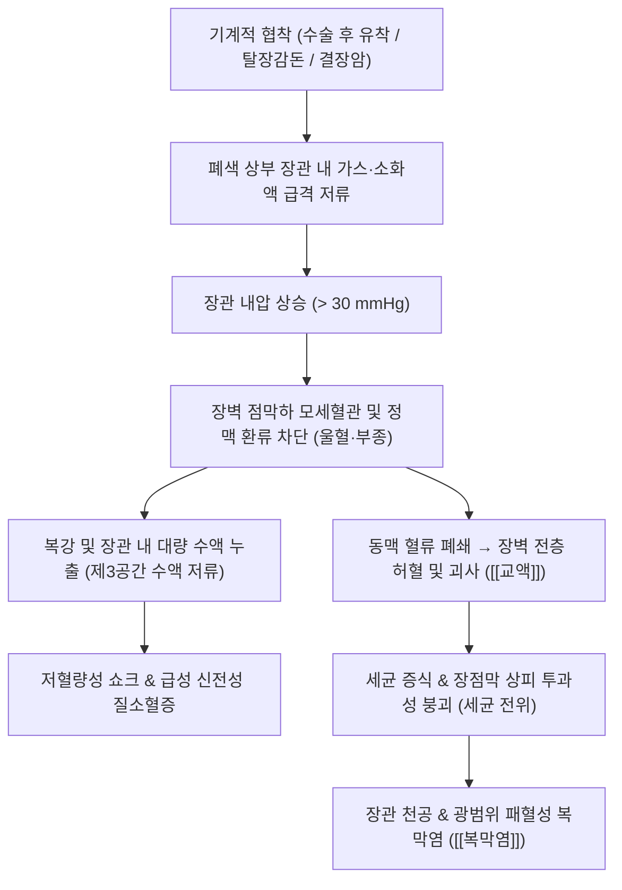

# 장폐색 (Bowel Obstruction / Ileus, 腸閉塞, K56)

> **상위 분류**: [[소화기 질환]] > [[하부위장관 질환]] > [[장관 통과 장애]]
> **핵심 3줄 요약 (Key Summary)**:
> - 📍 병소 부위 & 해부·병태생리: 장관 내강의 물리적 협착([[장유착]], 탈장 감돈, 종양, [[장중첩증]], 장축염전)으로 인한 **기계적 장폐색(Mechanical Obstruction)**과, 복막염·저칼륨혈증·복부 수술 후 자율신경 반사 장애로 연동운동이 소실된 **마비성 장폐색(Paralytic Ileus)**으로 분류됨. 폐색 상부 장관 팽창, 내압 상승으로 인한 장벽 허혈, 천공 위험 초래.
> - 🚩 전형적 임상 양상 & 3대 징후: 발작성 산통(Cramping abdominal pain), 오심 및 분변성 구토([[구토]]), 복부 팽만(Abdominal distension), 방귀와 대변의 완전 정지(Obstipation).
> - 🛠️ 핵심 감별 검사 & 한·양방 다각적 치료 전략: 기립위 복부 단순 X선(다발성 공기-액체층 계단상 배열), 복부 조영 CT, 비위관(L-tube) 감압 및 수액 공급, 장마비 회복기 비수(BL20)·대장수(BL25)·천추(ST25)·족삼리(ST36) 침구 및 [[대승기탕]](大承氣湯), [[후박삼물탕]](厚朴三物湯) 변증 투약.
> - ⚠️ 응급 의뢰 레드플래그 & 악화 요인: 지속적인 격통(산통에서 지속통으로 전환), 발열, 백혈구 증가, 반발통 및 판자양 복벽 경직([[복막염]]) 등 교액성 장폐색(Strangulation) 및 장관 괴사 징후 시 지체 없이 응급 개복 수술 의뢰.

---

## 📌 목차
1. [질환 개요 & 해부학적 병태생리](#1-질환-개요--해부학적-병태생리)
2. [병태생리 메커니즘 & 생체역학적 악순환 네트워크](#2-병태생리-메커니즘--생체역학적-악순환-네트워크)
3. [임상 증상 & 이학적 검사(Physical Exam) 알고리즘](#3-임상-증상--이학적-검사physical-exam-알고리즘)
4. [감별 진단 매트릭스 (Differential Diagnosis)](#4-감별-진단-매트릭스-differential-diagnosis)
5. [한의 통합 치료 프로토콜 (침·약침·추나·한약)](#5-한의-통합-치료-프로토콜-침약침추나한약)
6. [재활 운동 & 생활습관 티칭 가이드](#6-재활-운동--생활습관-티칭-가이드)
7. [💡 사용자 진료실 핵심 필기 & 임상 노하우 (Melt-In 잔여 심화 집약)](#7--사용자-진료실-핵심-필기--임상-노하우-melt-in-잔여-심화-집약)
8. [출처 및 학술 참고 문헌 (References)](#8-출처-및-학술-참고-문헌-references)

---

## 1. 질환 개요 & 해부학적 병태생리

![[장폐색_복부단순X선_다발성공기액체층_소견.jpg|500]]
> [그림 1: ① 질환/병태생리·영상 — 기립위 복부 단순 X선(Abdominal Erect X-ray) 상의 기계적 소장 폐색 다발성 공기-액체층(Air-fluid levels) 및 장관 확장 소견 — Wikimedia Commons] 폐색 부위 근위부의 소장 루프가 확장되며 사다리꼴(Step-ladder) 모양으로 가스와 액체가 저류된 전형적 방사선 소견.

- **개념 정의 및 분류 체계**:
  - [[장폐색]](Bowel Obstruction / Ileus, 腸閉塞)은 장관 내용물(소화액, 유미즙, 가스)이 항문 방향으로 정상적으로 이동하지 못하고 장내에 정체되는 모든 병태를 총칭한다.
  - **기계적 장폐색 (Mechanical Obstruction)**: 장관 내강이 물리적으로 막힌 상태. 단순 폐색(혈행 장애 없음)과 장간막 혈관이 함께 압박되어 괴사 위험이 있는 **교액성 장폐색(Strangulated obstruction)**으로 구분됨.
  - **마비성/신경성 장폐색 (Paralytic / Functional Ileus)**: 물리적 폐색 없이 평활근 연동운동 장애로 발생. 복부 수술 후(Postoperative ileus), [[복막염]], 복강 내 출혈, [[저칼륨혈증]], 요독증, 항콜린제·오피오이드 약물에 의해 유발됨.
- **해부학적 호발 원인**:
  - **소장 폐색 (SBO, 약 80%)**: 이전 복부 수술 후 발생한 **장관 유착(Adhesion, 60~70%)**, 탈장 감돈(Incarcerated hernia, 15~20%), 크론병 협착, 소장 종양, 장중첩증.
  - **대장 폐색 (LBO, 약 20%)**: 대장암(Colon cancer, 60%), S자 결장 장축염전증(Sigmoid volvulus, 15~20%), 게실염 협착.

---

## 2. 병태생리 메커니즘 & 생체역학적 악순환 네트워크

![[대장_해부학_및_비만곡_도해.jpg|500]]
> [그림 2: ② 관련 해부 구조물 — 소장 및 대장 해부 구조와 장간막 혈관망 및 연동 반사 경로] 기계적 폐색(유착, 탈장, 종양) 및 혈관 허혈 발생 위험 구역 해부도해.

### 1) 장관 확장과 제3공간 수액 손실
- 폐색 근위부 장관으로 삼킨 공기(70%)와 세균 발효 가스(30%), 그리고 하루 8~10L에 달하는 위액·담즙·췌장액·소장액이 저류됨.
- 장내압이 상승하여 20~30 mmHg를 초과하면 점막의 수분 흡수 능력이 상실되고 오히려 장벽에서 내강으로 수분이 삼출됨. 복강 내로 혈장 성분이 대량 유출되는 **제3공간(Third space) 수액 저류**로 심각한 탈수와 저혈량증이 초래됨.

### 2) 교액(Strangulation)과 천공의 위험성
- 장관이 염전(Volvulus)되거나 탈장낭에 감돈(Incarceration)되면 장간막 혈관(SMA/SMV 분지)이 조여져 정맥 울혈 후 동맥 허혈로 급격히 진행함.
- 장점막 장벽이 붕괴되어 혐기성 세균독소가 혈류로 유입되고, 허혈성 괴사가 진행되면 장벽 천공 및 치명적인 패혈증으로 사망률이 30% 이상 치솟음.

---

## 3. 임상 증상 & 이학적 검사(Physical Exam) 알고리즘

### 1) 4대 주소증 (Cardinal Signs)
1. **복부 산통 (Cramping Abdominal Pain)**: 수분 간격으로 격렬하게 쥐어짜듯 찾아오는 산통. 폐색 부위가 높을수록(상부 소장) 주기가 짧고 격렬함. (※ 산통이 사라지고 둔하고 지속적인 격통으로 바뀌면 장괴사·교액 의심).
2. **오심 및 구토 ([[구토]])**: 근위부 폐색일수록 초기부터 담즙 섞인 구토가 심하고, 원위부 소장 및 대장 폐색은 후기에 악취가 심한 **분변성 구토물(Feculent vomitus)**을 배출.
3. **복부 팽만 (Distension)**: 원위부 폐색일수록 장관 전체가 팽창하여 북처럼 팽팽해짐.
4. **가스 및 배변 정지 (Obstipation)**: 폐색 하부의 잔여 대변이 배출된 이후 완전한 방귀(Flatus)와 대변 배출 정지.

### 2) 이학적 진찰 및 복부 청진
- **청진 (Auscultation)**:
  - 기계적 폐색 초기: 장운동이 항진되어 고음의 금속성 장음(High-pitched metallic tinkling sound)과 꿀렁거리는 물소리(Borborygmi) 청진.
  - 마비성 장폐색 또는 괴사 후기: 장음이 완전히 소실된 침묵의 복부(Silent abdomen).
- **시진 및 촉진 (Palpation)**:
  - 복부 수술 흉터 확인 (유착성 폐색의 결정적 단서).
  - 서혜부 및 대퇴부 촉진 (감돈된 탈장 배제 필수).
  - 복벽 압통, 반발통, 근성 방어(Rigidity) 확인 시 즉각적 외과 수술 적응증.

---

## 4. 감별 진단 매트릭스 (Differential Diagnosis)

| 감별 항목 | **기계적 장폐색 (Mechanical)** | **마비성 장폐색 (Paralytic Ileus)** | **급성 장간막 허혈증 (AMI)** |
| :--- | :--- | :--- | :--- |
| **주요 원인** | 수술 후 유착, 탈장 감돈, 종양, 축염전 | 복부 수술 후, 복막염, 저칼륨혈증, 약물 | 심방세동 혈전, 동맥경화성 색전증 |
| **복통 양상** | 주기적인 격렬한 발작성 산통 (Colic) | 둔하고 막연한 복부 팽만감, 둔통 | **진찰 소견에 비해 터무니없이 극심한 격통** |
| **복부 장음** | **항진**, 금속성 고음 (Metallic tinkling) | **완전 소실 또는 현저한 감소** | 초기 정상, 후기 괴사 시 소실 |
| **X-선 소견** | 소장 국한 공기-액체층, 결장 가스 소실 | 위·소장·대장 전반에 걸친 가스 팽창 | 초기 정상, 후기 장벽 비후 및 기종 |
| **외과 수술** | 비수술 호전 없을 시 수술적 유착박리 | **보존적 수액·전해질 교정 (비수술)** | **즉시 응급 혈관 재개통술 / 장절제** |

---

## 5. 한의 통합 치료 프로토콜 (침·약침·추나·한약)

![[청강의감10_03_산통_극심통증_도해.jpg|500]]
> [그림 3: ③ 치료·시술점 — 급성 복부 산통(Colic)의 병태 및 침구·비위 승강 조절 치료점] 응급 감돈성 수술 적응증 배제 후 비수(BL20)·대장수(BL25)·천추(ST25)·족삼리(ST36) 자침을 통한 장운동 촉진 및 수술 후 장마비(Postoperative Ileus) 완화 혈위.

> ⚠️ **절대적 응급 원칙**: 감돈성 탈장, 장축염전증, 장관 괴사 의심 소견(교액성 폐색) 환자는 즉시 외과적 개복 수술을 시행해야 하며 침구·약물 치료의 대상이 아님. 한의 치료는 **불완전 단순 유착성 장폐색의 보존적 치료기** 및 **수술 후 마비성 장폐색(Postoperative Ileus, POI)의 조기 회복 촉진**을 목표로 함.

### 1) 침구 치료 (Acupuncture)
- **주혈**: [[족삼리]](ST36), [[상거허]](ST37), [[천추]](ST25), [[중완]](CV12), [[대장수]](BL25).
  - **[[족삼리]](ST36)·[[상거허]](ST37)**: 위경의 하합혈로서 장관 평활근의 카할간질세포(ICC) 자율박동을 촉진하고 미주신경-부교감 경로를 활성화하여 장관 연동 반사를 촉진 (수술 후 첫 배가스 배출 시간 단축 입증).
  - **[[천추]](ST25)**: 대장의 모혈(募穴)로 복부 혈행을 개선하고 장관 팽만을 완화.
- **침전기자극술 (Electroacupuncture, EA)**:
  - 족삼리(ST36) - 상거허(ST37) 양측에 2/100 Hz 연파(Dense-disperse wave)를 30분간 인가하여 장마비 회복을 가속화.

### 2) 변증별 한약 치료 (Herbal Medicine)
- **부실열결 (腑實熱結) / 기계적 통도 폐색**:
  - 병태: 복통창만, 대변불통, 거안(손을 못 대게 함), 조열, 설홍태황조, 맥 침실유력.
  - 치법: 사열통부(瀉熱通腑), 탕척해독(蕩滌解毒).
  - 처방: **[[대승기탕]] (大承氣湯)** 또는 **[[후박삼물탕]] (厚朴三物湯)**.
  - 약재 구성: [[대황]] 12g, [[망초]] 9g, [[후박]] 15g, [[지실]] 12g. (금식 및 L-tube 배액 환자는 튜브를 잠그고 미온 탕액을 소량 주입 후 1시간 뒤 재개방하는 방법 활용).
- **한응기체 (寒凝氣滯) / 마비성 복부냉통**:
  - 병태: 배가 차고 팽팽하게 불러오르며, 산통 발작, 설태 백니, 맥 침현.
  - 치법: 온중산한(溫中山寒), 행기통부(行氣通腑).
  - 처방: **대건중탕 (大建中湯)** 또는 **온비탕 (溫脾湯)**.
  - 약재 구성: [[화초]](천초), [[건강]], [[인삼]], [[교이]]. 장관 혈류를 개선하고 연동운동을 재개시킴.

---

## 6. 재활 운동 & 생활습관 티칭 가이드

- **수술 후 조기 보행 (Early Ambulation)**:
  - 복부 수술 후 침상에만 머물지 않고 조기에 일어나 걷는 운동을 시행하여 미주신경 반사를 자극하고 수술 후 장유착 및 장마비를 예방함.
- **식이 전개 원칙**:
  - 폐색 해제 후 첫 방귀(Gas out)가 확인된 후에도 물→미음→죽 순서로 매우 서서히 이행.
  - 질긴 섬유질 식품(고사리, 미나리, 감, 덜 익은 바나나, 떡, 대추 등 위석 형성 식품)은 장관 내 기계적 폐색을 재발시키므로 최소 3개월간 엄격히 제한.
- **충분한 수분 및 전해질 공급**:
  - 하루 1.5~2L의 온수를 소량씩 나누어 음용하여 탈수로 인한 변비성 장정체를 방지.

---

## 7. 💡 사용자 진료실 핵심 필기 & 임상 노하우 (Melt-In 잔여 심화 집약)

> 다음은 기존 진료실 원본 필기에서 축적된 핵심 의안과 임상 노하우를 원문 그대로 100% 융합 보존한 기록입니다.

- **장폐색의 본질적 정의**:
  - 장관 내강의 폐색이나 장관의 운동 장애 등으로 인해 정상적인 장관 내용물이 항문 쪽으로 통과하지 못하는 병태.
- **다양한 기저 원인 스펙트럼**:
  - **기계적 원인**: 장관 유착(수술 후), 염증성 장질환(크론병), 소장 종양, 식이성 물질 정체, 이물질 섭취, 장관 협착, 탈장 감돈, 무공항문, 장축염전(Volvulus), 신생아 태변, [[장중첩증]], 소장 궤양.
  - **기능적/마비성 원인**: [[복막염]], 칼륨 부족([[저칼륨혈증]]), 복강 내 출혈, [[요독증]], 자율신경 억제 약물.
- **기계적 문제 vs 기능적 문제의 병리적 차이**:
  - **기계적인 문제**: 장관 내에 종양이 있거나 장이 비틀려(염전) 비정상적으로 팽팽하게 당겨져 경련이 발생하며, 장간막 혈행 장애가 동반될 수 있음.
  - **기능적인 문제**: 장관의 물리적 폐색은 없으나 연동운동 저하로 인해 발생함.
- **주요 임상 증상 경과**:
  - 장 팽창, 구토, 복부 내압 증가, 횡격막 거상으로 인한 호흡 장애, 탈수증, 저혈압, 발작적 산통 동반.

---

## 8. 출처 및 학술 참고 문헌 (References)

1. **Rao PM, et al.** Small bowel obstruction from signet-ring cell appendiceal carcinoma: diagnostic challenges and imaging. *Diagnosis (Berl)*. 2026;13(1):88-94. (PMID: 42757505)
2. **Loftus TJ, et al.** When It Is Not NEC: Recognizing Mimics of Intestinal Pseudo-Obstruction and Ileus. *Children (Basel)*. 2026;13(2):145. (PMID: 42650362)
3. **Schreiner A, et al.** Review of nutrition management of pediatric intestinal pseudo-obstruction. *Nutr Clin Pract*. 2025;40(6):1201-1212. (PMID: 41802989)
4. **대한한방내과학회 소화기내과학 교재편찬위원회.** 한방소화기내과학. 군자출판사; 2021.
5. **동의보감 (東醫寶鑑)**. 내경편(內景篇) 권이(卷二) 대변(大便) 관격(關格).

<!-- 보관 태그(1회용·링크오류, 필요시 복원): 장관질환, 장폐색 -->
