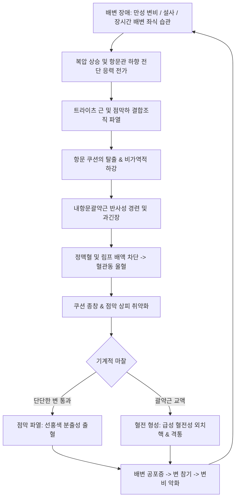

# 🩺 치질 증후군 (Hemorrhoidal Disease & Anorectal Disorders, 痔疾 症候群)

> **핵심 3줄 요약 (Key Summary)**:
> - 📍 병소 부위 & 해부·병태생리: 항문관(anal canal) 점막하의 정상 혈관성 쿠션 조직(corpus cavernosum recti)이 지지 결합조직(Treitz 근)의 퇴행성 파열 및 울혈로 인해 비정상적으로 팽창·하수되는 질환. 치상선(dentate line) 상부의 내치핵(무통성 선홍색 출혈/탈출), 하부의 외치핵(혈전성 격통/피부꼬리) 및 치열·치루를 포괄.
> - 🚩 전형적 임상 양상: 배변 시 선홍색 분출성 출혈(toilet paper/bowl staining), 항문 탈출 종괴, 항문 가려움증(소양증), 불완전 배변감. 급성 혈전성 외치핵이나 감돈성 내치핵 시 보행 곤란을 유발하는 극심한 박동성 항문통.
> - 🛠️ 핵심 검사 & 치료 전략: 쇄석위/측와위 시진, 직장 수지 검사(DRE), 항문경(Anoscopy) 검사로 치핵 도수(Goligher 1~4도) 판정. 보존적 고섬유 식이/좌욕이 1차 치료이며, 2~3도 내치핵은 고무밴드 결찰술(RBL), 3~4도 탈출성/복합 치핵은 결찰절제술(Milligan-Morgan/Ferguson) 시행. 한의학적으로 장풍(腸風), 치루(痔瘻), 습열하주(濕熱下注) 변증 하에 을자탕, 괴화산, 보중익기탕 및 좌욕·침구 치료 적용.
> - <font color="#fa7e7e">⚠️ 응급 의뢰 레드플래그: 지속적이고 대량인 직장 출혈로 인한 저혈압/빈혈 쇼크, 감돈성 치핵의 교액 및 괴사성 흑색 변색, 항문주위 농양 의심 시(발열, 오한, 배뇨 곤란, 심부 박동통) 패혈증 및 푸르니에 괴저(Fournier gangrene) 위험으로 즉각 대장항문외과 응급 배농 및 수술 의뢰.</font>

---

## 📌 목차
1. [질환 개요 & 해부학적 병태생리](#1-질환-개요--해부학적-병태생리)
2. [병태생리 메커니즘 & 생체역학적 악순환 네트워크](#2-병태생리-메커니즘--생체역학적-악순환-네트워크)
3. [임상 증상 & 이학적 검사(Physical Exam) 알고리즘](#3-임상-증상--이학적-검사physical-exam-알고리즘)
4. [감별 진단 매트릭스 (Differential Diagnosis)](#4-감별-진단-매트릭스-differential-diagnosis)
5. [한의 통합 치료 프로토콜 (침·약침·추나·한약)](#5-한의-통합-치료-프로토콜-침약침추나한약)
6. [양방 치료 & 병용·의뢰 기준 (Conventional Treatment & Referral)](#6-양방-치료--병용의뢰-기준-conventional-treatment--referral)
7. [재활 운동 & 생활습관 티칭 가이드](#7-재활-운동--생활습관-티칭-가이드)
8. [💡 사용자 진료실 핵심 필기 & 임상 노하우 (Melt-In 잔여 심화 집약)](#8--사용자-진료실-핵심-필기--임상-노하우-melt-in-잔여-심화-집약)
9. [출처 및 학술 참고 문헌 (References)](#9-출처-및-학술-참고-문헌--references)

---

## 1. 질환 개요 & 해부학적 병태생리

### 1) 정의 및 역학
치질(Hemorrhoids / Piles)은 넓은 의미로 항문에 생기는 질환군(치핵, 치열, 치루, 항문소양증 등)을 총칭하며, 좁은 의미로는 가장 흔한 질환인 **치핵(Hemorrhoidal Disease)**을 가리킨다. 성인의 약 50%가 50세 이전에 한 번 이상 치질 증상을 경험할 정도로 극히 흔하며, 성별 차이는 크지 않으나 임신 및 분만 여성에서 호발한다.

### 2) 항문관의 해부학적 경계와 혈관 쿠션
항문관(anal canal) 점막하에는 동정맥 문합(arteriovenous anastomoses)과 동굴양 혈관망(sinusoids), 평활근 및 탄력 섬유로 이루어진 정상적인 **항문 쿠션(Anal Cushions)**이 존재한다. 이는 평상시 항문을 수밀(water-tight) 상태로 밀폐하여 가스와 점액이 새어 나가지 않도록 돕는 정상 생리 조직이다. 주로 **좌측 외측(3시 방향), 우측 전외측(11시 방향), 우측 후외측(7시 방향)**의 3대 복합체로 분포한다.

```
[항문관의 관상단면과 치상선 경계]

                 ┌───────────────────────────┐
                 │       직장 점막 (대변 통과) │
                 └─────────────┬─────────────┘
                               │
               【치상선 상부 (Dentate Line Above)】
               - 점막: 자율신경 지배 (통각 없음, 팽창/둔통 감지)
               - 상직장동맥 (SMA 가지) 혈류 공급
               - 문맥계 (Portal system) 정맥 배액
               - 【내치핵 (Internal Hemorrhoid)】 발생
                               │
             ══════════════════╪══════════════════ (치상선 / Dentate Line)
                               │
               【치상선 하부 (Dentate Line Below)】
               - 피부/편평상피: 척수신경 (음부신경 지배, 격렬한 체성 통각)
               - 하직장동맥 혈류 공급
               - 대정맥계 (Systemic caval system) 배액
               - 【외치핵 (External Hemorrhoid)】 발생
                               │
                 ┌─────────────┴─────────────┐
                 │    항문 피부 (항문연, 괄약근) │
                 └───────────────────────────┘
```

### 3) 치핵의 분류
1. **내치핵 (Internal Hemorrhoid)**:
   - 치상선 상부의 상직장정맥총에서 기원. 
   - 체성 통각 신경이 없어 출혈이나 탈출이 있어도 통증이 없는 것이 특징(무통성 출혈).
   - 단, 탈출 후 괄약근에 의해 감돈(strangulation)되거나 괴사가 일어나면 극심한 허혈성 통증 유발.
2. **외치핵 (External Hemorrhoid)**:
   - 치상선 하부의 하직장정맥총에서 기원.
   - 음부신경(pudendal nerve) 지배를 받는 항문 상피로 덮여 있어 매우 예민하며 통증에 취약.
   - 혈전 형성 시 즉각적인 팽창과 함께 격렬한 급성 통증(혈전성 외치핵)을 유발하며, 호전 후 피부꼬리(skin tag)를 남김.
3. **혼합치핵 (Mixed / Combined Hemorrhoid)**:
   - 내치핵과 외치핵이 치상선을 가로질러 상호 융합된 형태. 임상 환자의 다수 차지.

---

## 2. 병태생리 메커니즘 & 생체역학적 악순환 네트워크

### 1) 혈관 쿠션 하수설 (Sliding Anal Cushion Theory)
과거에는 정맥류(varicosity) 설이 지배적이었으나, 현대 병태생리학은 **결합조직 파열에 의한 쿠션의 하수 및 울혈**로 설명한다.
- 항문 쿠션을 항문 괄약근에 결찰 고정하는 **트라이츠 근(Treitz's muscle / mucosal suspensory ligament)** 및 결합조직 탄력 섬유가 노화, 만성 변비, 배변 시 과도한 힘주기(straining)로 인해 단열되고 늘어남.
- 배변 시 대변 덩어리가 밀려 내려올 때 쿠션이 함께 밀려 하강하고, 내괄약근의 과긴장으로 인해 정맥 환류가 차단되어 혈관동(sinusoid)이 비정상적으로 팽창·울혈됨.

### 2) 생체역학적 악순환 네트워크


### 3) 염증 및 조직 리모델링
팽창된 쿠션 조직에서는 TGF-β, MMP-2, MMP-9의 발현이 증가하여 탄력 섬유의 붕괴가 가속화된다. 또한 점막 표면의 만성적인 미세 손상으로 비만세포(mast cells)와 염증성 사이토카인이 침윤하여 항문 소양증(pruritus ani)과 점액 누출이 지속된다.

---

## 3. 임상 증상 & 이학적 검사(Physical Exam) 알고리즘

### 1) 임상 증상
- **출혈 (Bleeding)**: 가장 흔한 초기 증상. 배변 말미에 휴지에 선홍색 피가 묻어나거나, 변기에 피가 뚝뚝 떨어지거나, 뿜어지듯 분출함. 대변 자체와 피가 섞이지 않는 것이 대장암/염증성 장질환과의 핵심 감별점.
- **탈출 (Prolapse)**: 배변 시 항문 밖으로 덩어리가 밀려 나옴. 초기에는 저절로 들어가나, 진행되면 손으로 밀어 넣어야 하거나 상시 돌출 상태 지속.
- **통증 (Pain)**: 단순 내치핵은 무통성. 갑작스러운 격통 발생 시 혈전성 외치핵, 감돈성 내치핵, [[치열]](배변 시 찢어지는 통증), 항문주위 농양 의심.
- **소양증 및 분비물**: 탈출된 점막에서 점액이 분비되어 항문 주위 피부가 짓무르고 가려움증 호소.

### 2) 골리거 내치핵 병기 분류 (Goligher's Classification)
| 병기 (Grade) | 탈출 정도 (Prolapse Status) | 전형적 증상 | 1차 표준 치료 권고 |
| :---: | :--- | :--- | :--- |
| **제1도 (Grade I)** | 항문관 내로만 돌출, **항문 밖 탈출 없음** | 무통성 선홍색 출혈 | 보존적 요법 (식이섬유, 좌욕, 약물) |
| **제2도 (Grade II)** | 배변 시 항문 밖 탈출, **저절로 환원됨** | 출혈, 일시적 이물감 | 보존적 요법, 외래 비수술 시술 (고무밴드 결찰) |
| **제3도 (Grade III)** | 배변 시 탈출, **손으로 밀어 넣어야 환원됨** | 잔변감, 점액 누출, 소양증 | 고무밴드 결찰술 또는 수술적 절제술 |
| **제4도 (Grade IV)** | **항시 탈출 상태**, 손으로 밀어도 안 들어감 | 지속적 탈출, 감돈/괴사 위험 | **수술적 절제술 (Hemorrhoidectomy)** |

### 3) 이학적 검사 절차
1. **시진 (Inspection)**:
   - 환자를 좌측와위(Sims position) 또는 쇄석위(Lithotomy)로 눕히고 둔부를 벌려 항문연 관찰.
   - 외치핵, 피부꼬리(skin tag), 치열(6시/12시 방향 열구), 치루 외공(누공 개구부), 탈출된 내치핵 점막 유무 확인.
   - 환자에게 배변하듯 힘을 주게(strain) 하여 내치핵의 탈출 정도를 동적으로 관찰.
2. **직장 수지 검사 (Digital Rectal Examination, DRE)**:
   - 비혈전성, 비섬유화 내치핵은 매우 부드러워 수지 검사만으로는 만져지지 않는 것이 정상.
   - 단, DRE는 **하부 직장암, 전립선 비대/암, 괄약근 긴장도, 농양에 의한 국소 파동감/압통**을 배제하기 위해 필수적으로 선행해야 함.
3. **항문경 검사 (Anoscopy)**:
   - 내치핵 진단의 Gold Standard. 
   - 슬롯형 항문경을 삽입하여 3시, 7시, 11시 방향의 항문 쿠션 비대, 발적, 점막 궤양, 활동성 출혈 유무를 육안으로 직접 확인.

---

## 4. 감별 진단 매트릭스 (Differential Diagnosis)

| 질환명 | 주 증상 (출혈 / 통증) | 이학적 & 항문경 소견 | 특징적 감별 포인트 | 치료 접근 |
| :--- | :--- | :--- | :--- | :--- |
| **내치핵** | **선홍색 무통성 출혈**, 탈출 종괴 | 치상선 상부 혈관성 쿠션 비대 | 통증 없음 (감돈 시 제외), 변과 피 분리 | 보존요법, 결찰술, 절제술 |
| **혈전성 외치핵** | **갑작스러운 격심한 항문통**, 출혈 적음 | 치상선 하부 푸르스름한 단단한 압통 결절 | 배변과 무관한 지속적 통증, 48시간 내 피크 | 온수 좌욕, 72시간 내 절개 혈전제거술 |
| **치열 (Anal Fissure)** | **배변 시 찢어지는 극통**, 소량 선홍색 | 항문 후방(6시) 중앙의 점막 열구, 보초 치태 | 배변 후 수십 분~수 시간 작열통 지속, 괄약근 경련 | 좌욕, 질산염/CCB 연고, 내괄약근 절개술 |
| **항문주위 농양** | **지속적 박동성 통증, 발열**, 종창 | 항문 주위 발적, 열감, 심부 압통 및 파동감 | 배변 무관 극통, 백혈구 증가, 패혈증 위험 | **즉각적 응급 절개 배농** |
| **치루 (Anal Fistula)**| 화농성 분비물 배출, 경미한 둔통 | 항문 주위 외공 촉지, 새끼줄 같은 관상 경결 | 항문선 농양의 기왕력, Goodsall 법칙 | 치루 절개술/절제술 (Fistulotomy) |
| **직장암 (Rectal Cancer)**| **암적색 혈변, 변비/설사 교대, 잔변감** | 직장 수지 검사상 단단하고 불규칙한 궤양성 종괴 | 체중 감소, 빈혈, 배변 습관 변화, 고령 호발 | 대장내시경, 생검, 항암·방사선·근치 수술 |
| **직장 탈출증 (Rectal Prolapse)**| 거대한 장관 전체의 항문 탈출 | **동심원상 점막 주름(concentric folds)** 돌출 | 전층 직장벽 탈출 (치핵은 방사상 주름) | 경회음/복강경 직장고정술 |

---

## 5. 한의 통합 치료 프로토콜 (침·약침·추나·한약)

> 🎯 **한의 치료의 장점과 임상 적용**:
> 1~2도 내치핵 및 만성 항문 울혈, 초기 치열, 수술 후 회복 지연에 한의학적 보존 치료는 탁월한 지혈 및 부종 완화 효과를 나타낸다.

### 1) 변증 감별 체계 (TCM Syndrome Differentiation)
1. **풍열장독증 (風熱腸毒證)**:
   - 원인: 맵고 기름진 음식, 음주로 인한 대장 풍열 습열 정체.
   - 증상: 배변 시 선홍색 분출성 출혈, 항문 작열감, 구갈, 변비, 설홍태황, 맥 삭.
   - 치법: 청열양혈(淸熱凉血), 거풍소종(祛風消腫).
   - 대표 처방: **[[괴화산]] (槐花散)** 가미.
2. **습열하주증 (濕熱下注證)**:
   - 원인: 비위 습열이 대장과 항문으로 흘러내려 어혈과 울혈을 형성.
   - 증상: 항문 종창 및 동통, 농성 점액 분비물, 잔변감, 신체 무거움, 소변 황적, 설태 황니, 맥 활삭.
   - 치법: 청열이습(淸熱利濕), 활혈소종(活血消腫).
   - 대표 처방: **[[을자탕]] (乙字湯)** 또는 **[[지유탕]] (地楡湯)** 가미.
3. **비허기함증 (脾虛氣陷證 / 중기하함)**:
   - 원인: 만성 질환, 과로, 노화, 다산으로 비기 허약, 중기 하함.
   - 증상: 배변 시 치핵 탈출(환원 지연), 탈항 경향, 엷은 혈색의 간헐적 출혈, 만성 피로, 안면 창백, 설담태백, 맥 완약.
   - 치법: 보기승제(補氣升提), 수렴지혈(收斂止血).
   - 대표 처방: **[[보중익기탕]] (補中益氣湯)** 가미.
4. **비한혈어증 (脾寒血瘀證 / 기체혈어)**:
   - 원인: 한습 정체 및 기혈 순환 불량으로 인한 급성 혈전 형성.
   - 증상: 항문 주위 자갈색의 단단한 혈전성 종괴, 찌르는 듯한 격통, 한랭 시 악화, 설암자, 맥 현삽.
   - 치법: 활혈화어(活血化瘀), 온경지통(溫經止痛).
   - 대표 처방: **[[활혈거어탕]]** 또는 **[[계지복령환]]** 가미.

### 2) 본초·약리 성분 배오 전략
- **지혈·혈관 강화 (Flavonoid 계열)**: [[괴화]](rutin 성분 풍부, 모세혈관 투과성 정상화), [[지유]](tannin 성분, 강력한 수렴 지혈).
- **소염·사하·윤장 (대변 완화)**: [[대황]](anthraquinone, 완만한 사하 및 활혈), [[당귀]](윤장통변 및 보혈), [[황금]]·[[황련]](장내 염증 사이토카인 억제).
- **승제(升提) 작용**: [[시호]], [[승마]] (골반강 울혈 완화 및 점막 지지조직 탄력 회복).

### 3) 침구 치료 프로토콜
- **원위 취혈**:
  - **[[승산]](BL57)**: 방광경의 요혈로 비복근 중앙에 위치. 예로부터 '치질의 명혈'로 불리며, 척수 반사를 통해 항문 괄약근의 이상 경련을 완화하고 골반저 정맥 순환을 촉진.
  - **[[공최]](LU6)**: 폐경의 극혈(郄穴). 폐와 대장은 표리관계로 급성 출혈 및 극심한 항문 통증의 즉각적 완화에 탁월.
  - **[[백회]](GV20)**: 독맥의 최고점으로 기함(氣陷)에 의한 치핵 탈출 시 간접구(뜸) 요법 필수.
  - **[[삼음교]](SP6)**, **[[태충]](LR3)**: 하초 습열 및 기체혈어 조절.
- **국소 취혈**:
  - **장강(GV1)**: 미골단과 항문 사이. 항문 국소 혈류 개선 및 괄약근 긴장 완화.
  - **차료(BL32)**, **백환유(BL30)**: 천골신경총을 자극하여 직장-항문 자율신경 밸런스 조정.

### 4) 한방 외용 요법 (한약 좌욕)
- **소종지통 좌욕 처방**:
  - 구성: [[고삼]], [[황백]], [[백반]], [[오배자]], 박하 각 15g.
  - 용법: 약재를 달인 따뜻한 온수(38~40°C)에 둔부를 담그고 10~15분간 좌욕.
  - 약리 기전: [[백반]]과 오배자의 타닌 성분이 점막을 수렴·수축시키고, [[황백]]·고삼이 항균 및 혈관 확장 억제, 박하가 국소 냉각 진통 작용 발휘.

---

## 6. 양방 치료 & 병용·의뢰 기준 (Conventional Treatment & Referral)

### 1) 약물 치료 (Medications)
- **정맥순환개선제 (플라보노이드 제제)**:
  - 성분: 미세정제 플라보노이드 분획물(MPFF, Diosmin / Hesperidin 복합제).
  - 기전: 정맥 긴장도 증가, 미세순환 보호, 림프 배액 촉진. 급성 출혈 및 부종 완화에 1차 권고.
- **완하제 (Laxatives)**:
  - 차전자피(Psyllium) 등 부피형성 완하제(Bulk-forming laxatives)로 변을 부드럽게 만들어 배변 시 물리적 손상 최소화.
- **국소 외용제 (좌약 및 연고)**:
  - 히드로코르티손(스테로이드) + 리도카인(국소마취제) 복합제: 급성 염증과 가려움증을 일시 완화하나, 7일 이상 장기 사용 시 항문 피부 위축 유발하므로 주의.

### 2) 외래 비수술적 시술 (Office-based Procedures)
- **고무밴드 결찰술 (Rubber Band Ligation, RBL)**:
  - 2~3도 내치핵의 가장 효과적인 1차 술식.
  - 치상선 상부 최소 1cm 이상의 무통성 점막 부위에 작은 고무 밴드를 걸어 혈류를 차단, 수일 내 허혈 괴사되어 탈락되도록 유도.
- **경화요법 (Sclerotherapy)**:
  - 5% 페놀 오일이나 황산알루미늄칼륨-탄닌산(ALTA)을 점막하에 주입하여 섬유화 유도. 1~2도 출혈성 내치핵에 적용.
- **적외선 응고술 (Infrared Coagulation, IRC)**:
  - 적외선 열로 단백질을 응고시켜 혈관 폐쇄 유도.

### 3) 수술적 절제술 (Surgical Hemorrhoidectomy)
- **절개 결찰 절제술 (Milligan-Morgan / Ferguson 술식)**:
  - 3~4도 탈출성 치핵, 거대 혼합치핵, 외래 시술 실패 환자의 확실한 근치 술식. 
  - 치핵 조직을 뿌리부터 박리하여 혈관을 결찰하고 절제 (개방형 또는 폐쇄형).
- **원형 자동문합기 수술 (PPH, Procedure for Prolapse and Hemorrhoids)**:
  - 탈출된 점막을 원형으로 잘라내고 상방으로 당겨 올려 고정하는 수술. 수술 후 통증이 적으나 직장 천공 등 드문 합병증 주의.

### 4) 응급 전원 및 레드플래그 (Referral Criteria)
```
[치질/항문 질환 외과 의뢰 가이드라인]
┌─────────────────────────────────────────────────────────────┐
│ 🚨 즉각 응급 외과 의뢰 (Emergency Red Flags)                 │
│ - 감돈성 내치핵 (Strangulated Hemorrhoid): 심한 부종과 함께  │
│   탈출 조직이 암자색/흑색으로 변색되며 손으로 안 들어감 (괴사) │
│ - 직장 대량 출혈로 인한 어지러움, 기립성 저혈압, 실신         │
│ - 항문주위 농양 의심: 지속적 박동통 + 38°C 이상 고열 + 오한   │
│ - 면역저하 환자(당뇨, 항암치료)의 급성 항문통 (푸르니에 괴저) │
└─────────────────────────────────────────────────────────────┘
                              │
┌─────────────────────────────────────────────────────────────┐
│ ⚠️ 대장내시경 검사 의뢰 (Endoscopy Indication)                │
│ - 50세 이상에서 처음 발생한 직장 출혈                         │
│ - 대장암 가족력, 체중 감소, 배변 횟수/굵기 변화 동반          │
│ - 빈혈 소견 (Hb 저하) 또는 대변 잠혈 검사(FOBT) 지속 양성    │
│ - 선홍색이 아닌 흑색/암적색 변, 점액변 동반                   │
└─────────────────────────────────────────────────────────────┘
```

---

## 7. 재활 운동 & 생활습관 티칭 가이드

### 1) 배변 위생 4대 수칙 (Bathroom Habits)
1. **화장실 체류 시간 3분 이내 제한**: 스마트폰이나 책을 보며 장시간 변기에 앉아 있는 행위는 항문 쿠션에 가해지는 정맥압을 극대화하므로 3~5분 내에 배변이 끝나지 않으면 즉시 일어날 것.
2. **배변 시 과도한 힘주기 금지**: 억지로 쥐어짜지 말고, 자연스러운 장운동에 의해 배출되도록 유도.
3. **배변 자세 교정 (스쿼티 포티, Squatty Potty)**:
   - 양변기 사용 시 발밑에 15~20cm 높이의 받침대를 두어 고관절을 35도 각도로 굴곡시킴.
   - 이는 치골직장근(puborectalis muscle)을 완전히 이완시켜 직장-항문 각(anorectal angle)을 일직선으로 펴줌으로써 배변 저항을 최소화.
4. **배변 후 온수 세정**: 거친 화장지로 문지르는 것은 미세 상처를 유발하므로 비데나 미온수 세척 후 부드럽게 건조.

### 2) 온수 좌욕법 (Warm Water Sitz Bath)
- **온도 및 시간**: 38~40°C(체온보다 약간 따뜻한 미온수)의 맹물에 엉덩이를 담그고 3~5분간 시행 (10분 초과 금지).
- **효능**: 내항문괄약근의 기저 압력을 30~40% 감소시켜 항문 혈류를 개선하고 통증 및 부종을 신속히 완화.
- **주의**: 쪼그려 앉는 자세는 오히려 울혈을 조장하므로, 좌욕기를 변기 위에 올려놓고 편안하게 앉아서 시행할 것.

---

## 8. 💡 사용자 진료실 핵심 필기 & 임상 노하우 (Melt-In 잔여 심화 집약)

### 1) 출혈 양상으로 감별하는 진료실 팁
- 환자가 "피가 난다"고 할 때, 색깔과 묻어나는 방식을 반드시 집요하게 캐물어야 한다.
  - "변기 물이 새빨갛게 물들고 똑똑 떨어져요": 95% 이상 내치핵 출혈.
  - "휴지로 닦을 때만 살짝 묻고 변 볼 때 칼로 째는 것 같아요": 전형적인 [[치열]].
  - "변에 검붉은 피가 끈적하게 섞여 나오고 냄새가 역해요": 직장암, 허혈성 대장염, [[궤양성 대장염]] 가능성. 즉시 대장내시경 연계 필수.

### 2) 을자탕(乙字湯)의 임상 응용과 배변 조절
- 한의 진료실에서 치핵 환자 1차 처방으로 [[을자탕]](당귀, 시호, 황금, 감초, 승마, 대황)의 효과는 매우 빠르다. 특히 급성 부종과 배변 곤란이 있을 때 대황의 양을 환자의 변 상태에 따라 1~3g으로 정밀 조절해야 한다.
- 만약 환자가 평소 무른 변이나 설사 경향이 있다면 대황을 빼거나 0.5g으로 줄이고, 백출과 복령을 가미해야 한다. 설사 자체가 항문 쿠션에 심각한 화학적·기계적 자극을 주어 치핵을 악화시키기 때문이다.

### 3) 혈전성 외치핵 환자의 급성기 티칭
- 어느 날 갑자기 항문에 콩알만 한 단단한 혹이 생겨 앉지도 못할 정도로 아파서 오는 혈전성 외치핵 환자는 발생 48시간 이내가 가장 아프다. 72시간이 지나면 혈전이 자연 흡수되면서 통증이 급격히 줄어든다.
- 초기에 내원했다면 무리하게 만지거나 짜내려 하지 말고, 온수 좌욕과 함께 [[승산]], [[공최]] 자침 및 을자탕/계지복령환 투여로 3~5일 내에 통증을 70% 이상 경감시킬 수 있음을 안심시켜야 한다.

---

## 9. 출처 및 학술 참고 문헌 (References)

1. **Davis BR, et al. (2018)**. The American Society of Colon and Rectal Surgeons Clinical Practice Guidelines for the Management of Hemorrhoids. *Dis Colon Rectum*, 61(3):284-292. [PMID 29420423](https://pubmed.ncbi.nlm.nih.gov/29420423/)

2. **Mott T, Latimer K, Edwards C. (2018)**. Hemorrhoids: Diagnosis and Treatment Options. *Am Fam Physician*, 97(3):172-179. [PMID 29431977](https://pubmed.ncbi.nlm.nih.gov/29431977/)

3. **Lohsiriwat V. (2012)**. Hemorrhoids: from basic pathophysiology to clinical management. *World J Gastroenterol*, 18(17):2009-2017. [PMID 22563187](https://pubmed.ncbi.nlm.nih.gov/22563187/)
