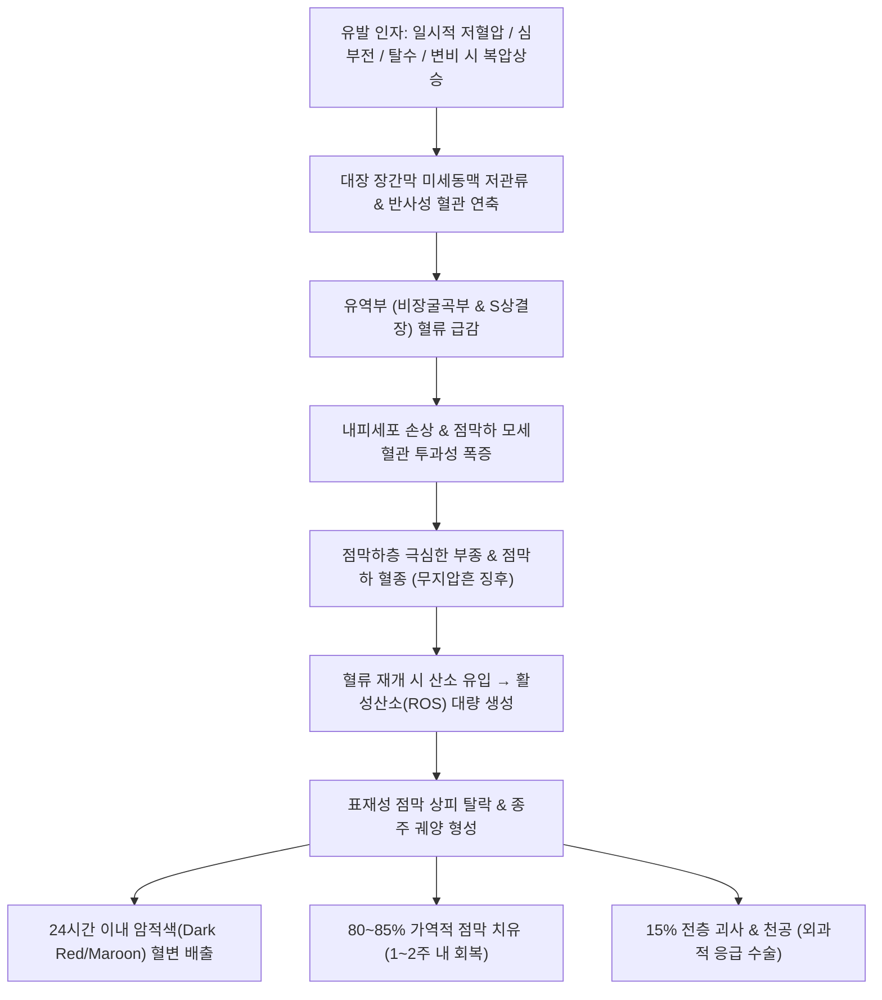

# 🩺 [[허혈 결장염]] (Ischemic Colitis & Colon Ischemia / 虛血性結腸炎, KCD K55.0 / ICD-10 K55.0)

> **핵심 3줄 요약 (Key Summary)**:
> - 📍 **병소 부위 & 병태생리**: [[비장굴곡부]](Splenic Flexure, Griffith's point) 및 [[S상결장]](Sigmoid Colon, Sudeck's point) 등 대장 혈류 유역부(Watershed area) — 장간막 미세순환의 일과성 저관류(Hypoperfusion) 및 혈관 연축 → 점막하층 부종 및 출혈성 경색 → 재관류 손상(Reperfusion injury)에 의한 일측성 점막 탈락 및 궤양 형성.
> - 🚩 **전형적 임상 양상 & 3대 징후**: 고령자나 심혈관 질환자에서 발생하는 **갑작스러운 좌하복부(LLQ) 경련통**, 급박한 변의 및 뒤무직([[후중감]]), 통증 발생 24시간 이내의 **암적색(Dark red/Maroon) 혈변**.
> - 🛠️ **핵심 감별 & 한·양방 치료 전략**: [[급성 장간막 허혈]](SMA 색전증), [[게실염]], [[궤양성 대장염]] 감별. 복부 조영 CT상 결장벽 비후 및 **무지압흔 징후(Thumbprinting)**, 대장내시경 조기 확인. 양방에서는 금식, 수액 정주, 혈압 유지 등 보존적 치료(80~85% 1~2주 내 완전 회복); 한의에서는 기허혈어·어열조체 변증에 따라 [[보양환오탕]], [[당귀작약산]], [[도핵승기탕]] 및 기해·관원·족삼리·삼음교 침구 치료로 미세순환 재건 및 장관 허혈 회복 촉진.
> - ⚠️ **응급 의뢰 레드플래그**: 장관 전층 괴사(Gangrenous Colitis), 패혈성 쇼크, 지속적인 복부 판자형 경직(Peritoneal signs), 복부 CT상 장벽 내 공기(Pneumatosis intestinalis) 또는 문맥 가스 관찰 시 즉시 응급 개복/복강경 결장 절제술 전원.

---

## 📌 목차
1. [질환 개요 & 병태생리 (Disease Overview)](#1-질환-개요--병태생리-disease-overview)
2. [병태생리 메커니즘 & 대사·장기부전 악순환 네트워크](#2-병태생리-메커니즘--대사장기부전-악순환-네트워크)
3. [임상 증상 & 환자 소견 (Clinical Presentation)](#3-임상-증상--환자-소견-clinical-presentation)
4. [감별 진단 매트릭스 (Differential Diagnosis)](#4-감별-진단-매트릭스-differential-diagnosis)
5. [한의 통합 치료 프로토콜 (침·약침·한약)](#5-한의-통합-치료-프로토콜-침약침한약)
6. [양방 치료 & 병용·의뢰 기준 (Conventional Treatment & Referral)](#6-양방-치료--병용의뢰-기준-conventional-treatment--referral)
7. [식이·생활습관 & 자가관리 티칭 가이드](#7-식이생활습관--자가관리-티칭-가이드)
8. [💡 진료실 핵심 필기 & 임상 노하우](#8--진료실-핵심-필기--임상-노하우)
9. [출처 및 학술 참고 문헌 (References)](#9-출처-및-학술-참고-문헌-references)

---

## 1. 질환 개요 & 병태생리 (Disease Overview)

![[허혈_결장염_01_대장혈관해부및유역부GriffithSudeck.png|450]]
> [그림 1: ① 해부 — 골반강 대장 혈관 해부(상장간막동맥 SMA·하장간막동맥 IMA 분지) — ⚠️ 원본 출처 미확인 (2026-10-07 재조달 대상)]

* **질환 정의 및 역학적 위치**:
  * 결장(대장)으로 공급되는 동맥 혈류량이 일시적으로 장관 대사 요구량에 미치지 못하여 발생하는 장관 허혈성 질환이다.
  * 전체 위장관 허혈성 질환 중 **가장 흔하며(약 75% 차지)**, 주로 60세 이상 고령자에서 호발하나, 최근 젊은 층에서도 마라톤 등 격렬한 운동, 약물(피임약, 코카인 등), 탈수로 인해 발병률이 증가하고 있다.
* **혈관 해부학 및 혈류 취약 유역부 (Watershed Areas)**:
  * 대장은 상장간막동맥(SMA)과 하장간막동맥(IMA)이라는 두 대동맥 분지로부터 혈액을 공급받으며, 장관 가장자리의 변연동맥(Marginal artery of Drummond)이 이들을 문합 연결한다.
  * **그리피스 점 (Griffith's Point)**: SMA의 중결장동맥과 IMA의 좌측 결장동맥이 만나는 **비장굴곡부(Splenic flexure)** — 혈관 문합이 불완전하고 혈류 압력이 가장 낮아 허혈 결장염의 **제1 호발 부위**이다.
  * **수덱 점 (Sudeck's Point)**: 하장간막동맥의 최하부 S상결장동맥 분지와 내장골동맥에서 기원하는 상직장동맥이 만나는 **직장S결장 접합부(Rectosigmoid junction)** — **제2 호발 부위**이다.
  * 직장(Rectum)은 내장골동맥(중·하직장동맥)으로부터 풍부한 이중 측부 혈류를 공급받으므로 **허혈 결장염에서 직장은 거의 항상 침범되지 않고 보존(Rectal sparing)**된다.

---

## 2. 병태생리 메커니즘 & 대사·장기부전 악순환 네트워크

![[허혈_결장염_02_일과성허혈및재관류손상병리기전.png|450]]
> [그림 2: ② 조직 병리 — 허혈성 결장염의 점막 조직 소견(H&E): 음와 변형·점막 괴사 — 출처: Wikimedia Commons — File:Ischemic colitis - low mag.jpg]

![[허혈_결장염_02_내시경점막부종출혈및종주궤양소견.png|450]]
> [그림 3: ③ 내시경 소견 — 허혈성 결장염의 점막 부종·출혈 및 종주 궤양 — ⚠️ 원본 출처 미확인 (2026-10-07 재조달 대상)]

### 1) 분자·세포 수준 기전
* **비폐쇄성 허혈(Non-occlusive Mesenteric Ischemia, NOMI)**: 대혈관(SMA/IMA) 본간이 혈전으로 완전히 막히는 소장 허혈과 달리, 허혈 결장염의 95% 이상은 대혈관 폐색 없이 전신적 저혈압, 심박출량 저하, 탈수, 변비 시 과도한 발살바(Valsalva) 복압 상승 등에 의해 발생하는 **미세순환의 일과성 저관류 및 소혈관 연축**이 주원인이다.
* **점막하 부종과 출혈**: 결장벽에서 산소 소모량이 가장 많은 점막층과 점막하층이 저산소증에 가장 먼저 손상된다. 내피세포 파괴로 모세혈관 혈장이 점막하층으로 쏟아져 나와 극심한 부종을 형성하고 적혈구가 조직 내로 누출되어 점막하 혈종이 된다.
* **재관류 손상 (Ischemia-Reperfusion Injury)**: 저관류가 멈추고 혈류가 회복될 때 산소가 재유입되면서 크산틴 산화효소(Xanthine oxidase) 등에 의해 유해 활성산소종(ROS)이 대량 발생하여 지질 과산화와 조직 괴사를 2차적으로 가속한다.

### 2) 병태 경과 및 예후 분류
* **일과성 가역성 결장염(Transient Ischemic Colitis, 80~85%)**: 점막과 점막하층에만 국한된 표재성 손상으로, 장관 안정 및 수액 요법만으로 수일~2주 내에 점막이 정상으로 재생된다.
* **만성 궤양성/협착형 결장염(10~15%)**: 고유근층까지 손상되어 수주~수개월 후 점막하 섬유화로 인한 장관 협착 발생.
* **전층 괴저성 결장염(Gangrenous Colitis, 5~10%)**: 장벽 전층이 괴사하여 천공 및 범발성 복막염으로 진행하는 치명적 형태.

---

## 3. 임상 증상 & 환자 소견 (Clinical Presentation)

![[허혈_결장염_03_복부CT무지압흔징후Thumbprinting.png|420]]
> [그림 4: ④ 영상 — 복부 CT(축상·관상·시상 재구성): 허혈성 결장염의 장벽 비후 및 무지압흔(Thumbprinting) — 출처: Wikimedia Commons — File:Ischaemische Colitis 67W - CT - 001.jpg]

> ⚠️ **이미지 미확보 (2026-10-07)** — 출처·해상도 조건을 만족하는 원본을 확인하지 못해 슬롯을 비웁니다.

### 1) 전형적 임상 3대 경과 (Classic Clinical Triad)
* **제1단계 (급성 복통기)**:
  * 평소 심혈관 질환이 있거나 변비가 있는 60대 이상 환자에서 **갑작스럽게 발생하는 좌하복부(LLQ) 경련통**.
  * 식후 또는 아침 배변 시 힘을 준 직후 호발하며, 경증~중등도의 쥐어짜는 듯한 통증.
* **제2단계 (급박 배변기)**:
  * 복통 발생 직후 장관 점막의 허혈성 자극으로 인해 급박한 변의(Fecal urgency)와 잦은 설사, 잔변감([[후중감]]) 발생.
* **제3단계 (혈변기, 발병 수시간~24시간 이내)**:
  * 통증 시작 후 12~24시간 이내에 묽은 변과 함께 **암적색(Dark red/Maroon) 또는 포도주색 혈변** 배출.
  * 하부 직장 출혈의 선홍색(Bright red)과 구별되며, 출혈량은 대개 소량~중등도(수혈이 필요할 정도의 대량 출혈은 드묾). 혈변 배출 후 복통은 오히려 완화되는 경향을 보임.

### 2) 객관적 검사 소견
* **복부 조영증강 CT (1차 표준 진단 검사)**:
  * 이환된 결장 분절(주로 비장굴곡부~하행결장~S상결장)의 원심성 장벽 비후(Wall thickening).
  * 점막하층 부종으로 인한 **표적 징후(Target sign / Double halo sign)**.
  * **무지압흔 징후(Thumbprinting)**: 엄지손가락으로 점막벽을 누른 듯한 결절성 융기 음영.
* **대장내시경 검사 (발병 48시간 이내 조기 시행)**:
  * 병변과 정상 점막의 경계가 뚜렷함(Sharp demarcation).
  * 점막하 출혈성 암적색 결절, 창백하고 부종성인 점막, 장관 장축을 따라 형성된 **일측성 종주 궤양(Single longitudinal ulcer)**.
  * 직장 점막은 완전히 정상 소견(Rectal sparing).

---

## 4. 감별 진단 매트릭스 (Differential Diagnosis)

| 감별 질환 | 특징적 양상 | 감별 포인트 (검사·수치) |
| :--- | :--- | :--- |
| **[[허혈 결장염]] (본 질환)** | 고령자, 일시적 좌하복통 직후 24시간 내 암적색 혈변 | **직장 보존(Rectal sparing)**, CT 무지압흔, 1~2주 내 자발 호전 |
| [[급성 장간막 허혈]](SMA 색전증) | 심방세동 병력, **신체 진찰 소견에 비해 극심한 통증** | **소장 침범**, 조영 CT상 SMA 혈전 확인, 조기 개복 혈전제거술 필수 |
| [[우측 결장 게실염]] / 좌측 게실염 | 지속적인 국소 복통, 발열, 백혈구 증가, 혈변은 드묾 | 복부 CT상 결장 외벽 돌출 게실 및 주변 연부조직 염증 |
| [[궤양성 대장염]] | 젊은 연령층, 만성적 혈변 및 점액변, 뒤무직 우세 | **직장 침범 필수(직장염 동반)**, 연속적 미만성 점막 염증 |
| 결장암 출혈 | 수개월간의 배변 습관 변화, 체중 감소, 점진적 빈혈 | 대장내시경 검사상 장관 내강을 막는 불규칙한 궤양성 종괴 |

---

## 5. 한의 통합 치료 프로토콜 (침·약침·한약)

![[허혈_결장염_05_침구치료기해관원족삼리삼음교.png|450]]
> [그림 6: ⑥ 한의 시술 — 동아시아 전통 경락·경혈 도해(기해·관원·족삼리·삼음교) — ⚠️ 원본 출처 미확인 (2026-10-07 재조달 대상)]

* **변증 분류**:
  * **기허혈어형(氣虛血瘀型)**: 고령자 만성 최빈형, 기력 저하, 복부 은은한 둔통, 암자색 혈변, 사지 권태, 설담어반, 맥세삽.
  * **어열조체형(瘀熱阻滯型)**: 급성기, 좌하복부 경련통, 혈변 포도주색, 구갈, 설자홍태황, 맥현삭.
  * **비신양허형(脾腎陽虛型)**: 복부 냉통, 설사 후 냉감, 보온 시 통증 완화, 설담태백, 맥침지약.
* **침구 치료 (Acupuncture)**:
  * **주혈 구성**:
    * **[[기해]](CV6) · [[관원]](CV4)**: 하초 원기를 보양하고 복강 내 내장 혈류 관류압을 회복.
    * **[[족삼리]](ST36)**: 위경 하합혈, 소화관 점막 미세순환을 촉진하고 허혈성 손상 복구.
    * **[[삼음교]](SP6)**: 족삼음경 교회혈, 골반강 및 복강 하부의 활혈화어(活血化瘀) 특효혈.
    * **[[비수]](BL20) · [[대장수]](BL25)**: 배수혈 온구(溫灸) 요법으로 장관 자율신경 연축 완화.
  * **수기법**: 기허혈어형에는 보법(補法)과 뜸 요법을 적용하여 장관 허혈과 부종을 흡수.
* **약침 치료 (Pharmacopuncture)**:
  * **자하거 약침**: 기허혈어형의 회복기에 족삼리, 기해에 주입하여 미세혈관 재생 촉진.
  * **황련해독탕 약침**: 어열조체형 급성 출혈기 천추 부위 적용.
* **한약 치료 (Herbal Medicine)**:
  * **활혈화어(活血化瘀) 및 보기통락 방제**:
    * **[[보양환오탕]](補陽還五湯)**: 황기(생황기 대량), 당귀미, 적작약, 천궁, 도인, 홍화, 지룡 — 기허혈어에 의한 미세혈관 순환 부전의 명방. 장간막 미세혈전을 예방하고 허혈 후 결장 점막의 측부 혈류 재생을 촉진함 (Kassner et al., 2025).
    * **[[당귀작약산]](當歸芍藥散)**: 혈허어혈과 수습(水濕) 정체로 인한 점막하 부종 흡수.
    * **[[도핵승기탕]](桃核承氣湯) 가미방**: 어혈과 열이 뭉쳐 변비와 좌하복통이 극심한 급성 초기 환자에게 일시적 파어사열(破瘀瀉熱) 목적으로 단기 사용.

---

## 6. 양방 치료 & 병용·의뢰 기준 (Conventional Treatment & Referral)

* **보존적 치료 (표준 1차 요법)**:
  * **장관 휴식 및 금식(NPO)**: 장 연동운동에 따른 장관 산소 소모량을 줄이기 위해 24~48시간 금식.
  * **적극적 수액 요법(IV Hydration)**: 생리식염수 또는 하트만액 정주로 순환 혈장량을 유지하여 장간막 관류압 확보.
  * **광범위 항생제 투여**: 점막 장벽 파괴로 인한 세균 전위(Bacterial translocation) 및 패혈증 예방을 위해 2/3세대 세팔로스포린 + 메트로니다졸 투여 권고 (Brandt et al., 2015).
  * **혈관 수축 유발 약물 중단**: 디곡신, 베타차단제, 알파작용제 등 장간막 혈관을 수축시킬 수 있는 약물 감량 또는 중단.
* **수술 치료 적응증 (외과적 절제)**:
  * **절대 적응증**: 장관 전층 괴저(Gangrenous colitis), 장 천공, 복막염, 대량 출혈로 인한 쇼크, 보존적 치료에도 2~3일 이상 지속되는 고열과 백혈구 급증.
  * **수술 방법**: 괴사된 결장 분절 절제술 및 일시적 장루 조성술(Hartmann's procedure).
* **한의 병용 치료 원칙**:
  * 급성 복통기에는 양방 금식 및 수액 치료와 병행하며, 혈변이 멎고 안정을 찾은 회복기에 보기활혈 한약과 침구 치료를 투여하여 만성 협착(Stricture) 합병증을 방지함.
* **양방 응급 의뢰 기준 (Emergency Referral)**:
  * 복부 진찰상 반발통(Rebound tenderness) 또는 복벽 근성 방어(Guarding) 출현.
  * CT상 장벽 내 공기(Pneumatosis) 또는 문맥 가스 발견 시 즉시 응급 수술 의뢰.

---

## 7. 식이·생활습관 & 자가관리 티칭 가이드

![[허혈_결장염_07_탈수방지혈압관리및변비예방티칭.png|400]]
> [그림 7: ⑦ 생활관리 — 혈압 측정(수은 혈압계) 실사 — ⚠️ 원본 출처 미확인 (2026-10-07 재조달 대상)]

* **탈수 방지 및 충분한 수분 섭취**:
  * "물이 부족하면 피가 끈적해지고 장으로 가는 피가 가장 먼저 줄어듭니다."
  * 하루 1.5~2.0L 미온수를 수시로 음용하여 혈액 점도를 낮추고 장간막 혈류 유지.
* **혈압 관리 및 기립성 저혈압 예방**:
  * 고혈압약을 복용하는 고령 환자에서 혈압이 너무 낮게 떨어지지 않도록(수축기 혈압 100 mmHg 이상 유지) 가정 혈압 모니터링 지도.
  * 앉거나 누웠다 일어날 때 천천히 일어나는 습관 티칭.
* **배변 시 과도한 힘주기(발살바 조작) 절대 금지**:
  * 변비로 인해 화장실에서 얼굴이 빨개질 정도로 힘을 주면 복강내압이 급상승하여 장동맥 혈류가 일시 차단됨.
  * 마그네슘 완하제 복용 및 부드러운 수용성 식이섬유 섭취로 바나나 모양의 무른 변 유지.
* **회복기 식단 단계적 진행**:
  * 복통 소실 후 미음 → 쌀죽 → 진밥 순으로 서서히 식이를 진행하며 기름진 육류나 자극성 음식은 4주간 제한.

---

## 8. 💡 진료실 핵심 필기 & 임상 노하우

* **비오님 임상 포인트: "변 보고 나서 붉은 피 쏟은 할머니를 보면 놀라지 마라"**:
  * 70대 어르신이 "아침에 변비 때문에 배에 힘을 꽉 주고 변을 봤는데, 아랫배가 살살 아프더니 점심때 시커멓고 붉은 피를 한 바가지 쌌다"며 사색이 되어 내원하는 경우가 허혈 결장염의 전형이다. 이때 당황하지 말고 "배에 힘주면서 장 혈관이 잠깐 체한 것"이라고 안심시키고, 수액과 금식을 지도하면 대부분 며칠 내 깨끗이 낫는다.
* **소장 허혈(SMA 색전증)과의 결정적 차이**:
  * 허혈 결장염은 아프고 나서 피가 나지만 환자의 혈압과 활력징후는 비교적 안정적이다. 반면 상장간막동맥(SMA) 색전증은 소장이 썩어 들어가는 병으로, 배를 살짝만 만져도 기절할 듯 소리를 지르며 혈변이 나기 전에 이미 쇼크에 빠진다. 이 둘을 절대 혼동해서는 안 된다.
* **보양환오탕(補陽還五湯)의 혈류 재건력**:
  * 허혈 결장염 앓고 난 뒤 대변이 좁아지거나 만성 복통이 남는 협착을 예방하는 데 황기를 군약으로 한 보양환오탕은 미세 측부 혈관망을 증식시키는 강력한 효과를 낸다.

---

## 9. 출처 및 학술 참고 문헌 (References)

- **Brandt LJ et al. (2015)**. ACG clinical guideline epidemiology risk factors patterns of presentation diagnosis and management of colon ischemia. *Am J Gastroenterol*. [PMID 25559486](https://pubmed.ncbi.nlm.nih.gov/25559486/)

- **Kassner M et al. (2025)**. Patient characteristics antibiotic use and in-hospital outcomes in patients with ischaemic colitis A nationwide retrospective cohort study. *Colorectal Dis*. [PMID 41656491](https://pubmed.ncbi.nlm.nih.gov/41656491/)

- **Yamamoto H et al. (2026)**. Mass-forming ischemic colitis mimicking colon cancer A case report of early repeat colonoscopy. *Int Cancer Conf J*. [PMID 42798111](https://pubmed.ncbi.nlm.nih.gov/42798111/)
