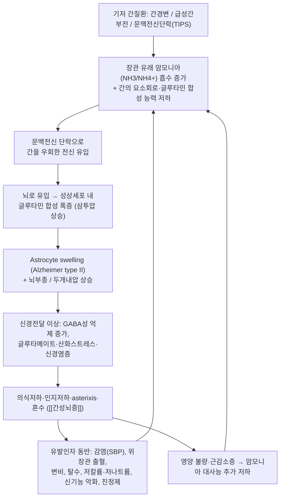

# 🩺 [[간성뇌증]] (Hepatic Encephalopathy / 肝性腦症, ICD-10: K72.9 / KCD: K72.9)

> **핵심 3줄 요약 (Key Summary)**:
> - 📍 병소 부위 & 해부·병태생리: 일차 병소는 **뇌(특히 성상세포 astrocyte)**이지만, 원인은 **간-문맥계 기능부전과 문맥전신 단락(portosystemic shunt)**이다. 장관에서 흡수된 **암모니아(NH₃/NH₄⁺)**가 간에서 요소회로(urea cycle)로 처리되지 못하고 전신 순환을 통해 뇌로 유입되면, 성상세포 내 **글루타민(glutamine) 합성 증가 → 삼투압성 세포 부종(astrocyte swelling)** → 뇌부종·신경전달 이상을 유발한다. 조직학적으로 **Alzheimer type II astrocyte**가 특징적이다. ([[간경변]], [[문맥전신단락]], [[고암모니아혈증]])
> - 🚩 전형적 임상 양상 & 3대 징후: ① **의식·인지 변화**(수면-각성 역전, 시간·장소 지남력 저하, 성격 변화, 혼돈에서 혼수까지) ② **asterixis(간성 진전, flapping tremor)** ③ **fetor hepaticus(간성 악취)**. 여기에 **구축(constructional apraxia), 서툰 필기, 반사항진·경련, 졸림–혼수 진행**이 더해진다. 최소간성뇌증(MHE)은 증상이 겉으로 드러나지 않고 **신경심리검사에서만 이상**을 보인다([[West Haven 등급]], [[NCT-A]], [[Digit Symbol Test]]).
> - 🛠️ 핵심 감별 검사 & 한·양방 다각적 치료 전략: 대표 검사는 **혈중 암모니아(동맥혈 권장)**, **유발인자 스크리닝(복수천자·CBC·전해질·BUN/Cr·요검사·흉복부 영상)**, **EEG(삼상파 triphasic wave)**, **뇌 CT/MRI(다른 원인 배제, 담창구 T1 고신호)**. 서양의학 치료의 축은 **유발인자 교정 + 락툴로오스(1차) ± 리팍시민**이며, 한의 치료는 **뇌신(腦神) 안정–담습(痰濕)·어열(瘀熱) 제거–간비(肝脾) 조화**를 목표로 침·약침·한약을 **양방 치료에 부가(add-on)**하는 통합 프로토콜로 접근한다([[락툴로오스]], [[리팍시민]], [[백회 GV20]], [[족삼리 ST36]]).
> - ⚠️ 응급 의뢰 레드플래그 & 악화 요인: Grade III–IV(혼수·반혼수), **기도 보호 실패·흡인 위험**, 두부외상/두개내출혈 의심, **저혈당·저나트륨혈증·패혈증·상부위장관 출혈** 동반, **간성뇌증 첫 발현(간질환 미진단 상태)**, TIPS 직후 급격한 의식 저하는 즉시 응급 의뢰. **절대 금기/주의: 진정제·벤조디아제핀·오피오이드·과량 이뇨제 투여, 단백질 극단 제한, 복수·식도정맥류 환자에서의 강한 복부 압박 추나 및 심부 자침.**

---

## 📌 목차
1. [질환 개요 & 해부학적 병태생리](#1-질환-개요--해부학적-병태생리)
2. [병태생리 메커니즘 & 생체역학적 악순환 네트워크](#2-병태생리-메커니즘--생체역학적-악순환-네트워크)
3. [임상 증상 & 이학적 검사(Physical Exam) 알고리즘](#3-임상-증상--이학적-검사physical-exam-알고리즘)
4. [감별 진단 매트릭스 (Differential Diagnosis)](#4-감별-진단-매트릭스-differential-diagnosis)
5. [한의 통합 치료 프로토콜 (침·약침·추나·한약)](#5-한의-통합-치료-프로토콜-침약침추나한약)
6. [양방 치료 & 병용·의뢰 기준 (Conventional Treatment & Referral)](#6-양방-치료--병용의뢰-기준-conventional-treatment--referral)
7. [재활 운동 & 생활습관 티칭 가이드](#6-재활-운동--생활습관-티칭-가이드)
8. [💡 사용자 진료실 핵심 필기 & 임상 노하우 (Melt-In 잔여 심화 집약)](#7--사용자-진료실-핵심-필기--임상-노하우-melt-in-잔여-심화-집약)
9. [출처 및 학술 참고 문헌 (References)](#8-출처-및-학술-참고-문헌-references)

---

## 1. 질환 개요 & 해부학적 병태생리
![[간성뇌증_1.jpg|540]]

> [그림 1: ① 병태생리·영상 — 간성뇌증_1]

### 1) 질환 정의 및 분류

* **정의**: 간성뇌증(Hepatic Encephalopathy, HE)은 **간기능 부전 및/또는 문맥전신 단락(portosystemic shunt)에 의해 발생하는 신경·정신과적 이상 증후군**으로, 단순히 "간이 나빠서 졸린 상태"가 아니라 **의식 수준, 인지, 성격, 운동기능, 각성도가 가역적으로 변하는 스펙트럼성 뇌병증**이다. 다른 원인의 뇌병증(구조적 뇌병변, 대사성·중독성·감염성 원인)을 **배제한 뒤** 진단하는 것이 원칙이다 (Wijdicks 2016, PMID 27783916; Rose & Amodio 2020, PMID 33097308).
* **유형 분류 (Type, 기저 간질환에 따른 분류)**:

| 유형 | 기저 상태 | 임상적 특징 |
| :--- | :--- | :--- |
| **Type A** | **급성 간부전**(Acute Liver Failure) | 뇌부종·두개내압 상승 위험이 가장 높고 경과가 급격. 단기 사망률 높음 |
| **Type B** | **문맥전신 단락**(bypass/shunt)이 있으나 **기저 간질환 없음** | TIPS 시술 후, 선천성 단락 등. 간수치는 비교적 정상일 수 있음 |
| **Type C** | **간경변 + 문맥고혈압/단락** | 임상에서 가장 흔함. 만성 재발성 경과, 유발인자에 의해 반복 악화 |

* **중증도·경과 분류 (임상에서 가장 실용적인 축)**:
  * **Covert HE (숨은 간성뇌증)** = **Minimal HE(MHE) + Grade I**. 겉으로는 정상처럼 보이거나 아주 미세한 변화만 있고, **신경심리검사(psychometric test)에서만 이상**을 보인다. MHE는 간경변 환자에서 문헌에 따라 **20~80%**까지 보고되며, **운전 능력 저하·낙상·삶의 질 저하·입원 및 사망 위험 증가**와 연관된다 (Karanfilian & Park 2020, PMID 32245528).
  * **Overt HE (현성 간성뇌증)** = **Grade II~IV**. 가족·보호자나 의료진이 명확히 인지할 수 있는 의식·행동 변화가 나타난다.
  * **재발성(Recurrent) HE**: 6개월 내 2회 이상의 overt HE 에피소드. **지속성(Persistent) HE**: 지속적 신경학적 결손. **유발인자 교정 후에도 호전되지 않는 경우**는 예후가 불량하다 (Rudler & Weiss 2021, PMID 33838857).
* **역학 및 호발 상황**: 간경변 환자에서 **overt HE의 누적 발생률은 상당히 높으며(문헌에 따라 1년 내 20~40% 수준으로 보고)**, 한 번 발생하면 **재발률이 매우 높다**. Child-Pugh 등급 B–C, MELD 상승, 낮은 혈청 알부민, TIPS 시술력, 이전 HE 에피소드 병력이 주요 위험인자이다. HE 발생 자체가 **간이식 대기 우선순위 및 예후 판정에 반영되는 중요한 사건**이다. (개별 수치의 정확한 값은 기관·코호트에 따라 차이가 있어 **정확한 백분율은 근거 미확인**으로 표기한다.)

### 2) 관련 해부학적 구조물

* **중추신경계(1차 표적 장기)**:
  * **대뇌피질([[대뇌피질]])**: 의식 수준·인지·성격 변화의 기질. 광범위 대사성 뇌기능 저하 양상.
  * **성상세포([[Astrocyte]])**: HE의 **세포병리학적 핵심**. 암모니아 해독(글루타민 합성)을 담당하며, 만성 고암모니아 상태에서 **Alzheimer type II astrocyte**로 형태가 변하고 세포 부종을 일으킨다 (그림 1 참조).
  * **기저핵·담창구([[Globus pallidus]])**: 망간(manganese) 침착으로 **MRI T1 강조영상에서 양측 담창구 고신호**가 관찰된다. 추체외로 증상(서툰 운동, 진전)과 관련.
  * **소뇌([[Cerebellum]])**: 구음장애, 운동실조, 필기 악화.
  * **뇌간([[Brainstem]])**: 심한 경우 각성·호흡 조절 이상, 제뇌/제피질 자세.
* **간-문맥계(원인 장기)**:
  * **간([[Liver]])**: 요소회로(urea cycle)를 통한 암모니아 제거, 글루타민 합성, 망간·담즙산 대사.
  * **문맥([[Portal vein]]) 및 측부순환**: 식도·위정맥류, 위신장단락, TIPS 등 **문맥전신 단락**이 있으면 장관 유래 독성물질이 간을 우회해 전신으로 직행한다.
* **장-간축([[Gut-liver axis]])**:
  * 장내 세균총, 장점막 투과성 증가(leaky gut), 세균전위(bacterial translocation)가 암모니아·내독소·염증성 사이토카인 생성을 증가시켜 뇌증을 악화시킨다.

---

## 2. 병태생리 메커니즘 & 생체역학적 악순환 네트워크

![[간성뇌증_3.jpg|540]]
> [그림 2: ② 관련 해부 구조물 — Case 2. A 41-year-old man with active variceal bleeding. A, B. Sequential MR images (1 cm slice thickness) depict approx]

### 1) 암모니아 중심 병태생리 (Ammonia hypothesis)

* **암모니아의 생성·제거 경로**: 장관 내 세균의 요소분해효소(urease)와 아미노산 탈아미노화로 **NH₃가 다량 생성**되며, 정상에서는 문맥을 통해 간으로 들어가 **요소회로(urea cycle)에서 요소로 전환**되거나 **근육·뇌의 글루타민 합성**으로 처리된다. 간경변에서는 ① 간세포 기능 저하, ② 문맥전신 단락, ③ **근감소증(sarcopenia)으로 인한 근육 내 암모니아 대사 저하**가 겹쳐 **고암모니아혈증**이 초래된다.
* **뇌에서의 독성 기전**:
  * 성상세포 내 **글루타민 합성효소(glutamine synthetase)**가 암모니아를 글루타민으로 전환 → 세포 내 **글루타민 축적 → 삼투압 상승 → astrocyte swelling**.
  * 세포 부종은 **뇌부종·두개내압 상승**으로 이어지며, 특히 **급성 간부전(Type A)**에서 치명적이다.
  * **신경염증(neuroinflammation)**: 미세아교세포(microglia) 활성화, TNF-α·IL-6 등 사이토카인, 산화스트레스(ROS), 혈뇌장벽 투과성 증가가 병리를 증폭시킨다 (Sen & Pan 2025, PMID 40153081).
  * **신경전달 불균형**: GABA–벤조디아제핀 수용체 활성 증가(억제성 톤 항진), 글루타메이트계 기능 이상, 도파민계 이상이 의식저하·운동이상에 기여한다.
* **암모니아 외 병태생리 인자(다인성 모델)**:
  * **망간(manganese)**: 간의 담즙 배설 저하로 축적 → 기저핵 침착, 추체외로 증상.
  * **메르캅탄(mercaptans)·황화합물**: fetor hepaticus(간성 악취)와 연관.
  * **저나트륨혈증**: 뇌 내 삼투질 변화로 astrocyte swelling을 **직접 악화**시킨다 → **HE 환자에서 저나트륨 교정은 매우 중요**하다.
  * **담즙산(bile acids)·내독소(LPS)**: 신경염증 유발, 혈뇌장벽 손상.
  * **저혈당·요독증·저산소증·패혈증**: 뇌 대사 예비능을 소진시켜 증상을 급격히 악화시킨다 (Rose & Amodio 2020, PMID 33097308).

### 2) 유발인자(Precipitating factors) — "악순환을 촉발하는 방아쇠"

| 범주 | 대표 유발인자 | 실전 포인트 |
| :--- | :--- | :--- |
| **감염** | 자발성 세균성 복막염(SBP), 요로감염, 폐렴, 균혈증 | **입원 HE 환자에서 가장 흔하고 중요한 유발인자**. 복수 천자 반드시 시행 |
| **위장관 출혈** | 식도·위정맥류 출혈, 소화성 궤양 | 장관 내 혈액 단백질이 암모니아 생성 기질로 작용 |
| **변비** | 만성 변비, 장폐색 | 장내 세균 증식·암모니아 흡수 시간 연장 → 락툴로오스 적정화의 근거 |
| **전해질 이상** | **저칼륨혈증**, **저나트륨혈증**, 대사성 알칼리증, 탈수 | 이뇨제 과용·구토·설사가 흔한 원인 |
| **신기능 악화** | 간신증후군, AKI, 탈수성 신전부하 저하 | 암모니아 배설 감소 |
| **약물** | **벤조디아제핀·오피오이드·진정제**, 과량 이뇨제, 일부 항정신병약 | 진정 목적 투여는 진단을 흐리고 악화시킴 |
| **시술/수술** | **TIPS**, 대량 복수천자 후 순환허탈 | TIPS 후 급격한 의식변화는 응급 |
| **기타** | 간암 진행, 위장관 출혈 없는 단백질 과다 섭취(논쟁적), 저산소증, 빈혈 | 원인 미상이면 반드시 재평가 |

> ※ 과거에 "단백질 제한이 HE를 호전시킨다"는 통념이 있었으나, 현재는 **단백질 제한이 오히려 근감소증을 악화시켜 예후를 나쁘게 한다**는 견해가 지배적이다. 이는 6번 섹션에서 다시 다룬다.

---

## 3. 임상 증상 & 이학적 검사(Physical Exam) 알고리즘

### 1) 주소증 및 신경학적 증상 (스펙트럼적 발현)

* **정신·의식 상태 및 각성도**:
  * **초기(covert/Grade I)**: 주의력 저하, 집중력 감소, 미세한 성격 변화, 불안·다행감(euphoria), **수면-각성 주기 역전(밤에 깨어 있고 낮에 졸림)** — 환자·보호자가 "야간 배회"로 호소하는 경우가 많다.
  * **중기(Grade II)**: 무기력·졸림, **시간 지남력 상실**, 부적절한 행동, 발음 어눌, 건망.
  * **중증(Grade III–IV)**: 반혼수(somnolence to semi-stupor)에서 **혼수(coma)**로 진행, 통증 자극에도 반응 저하.
* **운동기능 이상**:
  * **Asterixis(간성 진전, flapping tremor)**: 팔을 앞으로 뻗고 손목을 배굴시킨 상태에서 손목이 불규칙하게 툭툭 떨어지는 양상. **Grade II–III에서 전형적**이며, 대사성 뇌병증(요독증, CO₂ 축적)에서도 나타나므로 특이적이지 않다.
  * **구축(Constructional apraxia)**: 간단한 5각별·시계 그리기 실패.
  * 필기·도형 모사 능력 저하, 반사항진, 간대성 경련(clonus), 근긴장 이상, 심한 경우 **제뇌/제피질 자세**.
* **특징적 신체 징후**:
  * **Fetor hepaticus(간성 악취)**: 달콤하고 곰팡이 같은 냄새. 메르캅탄 대사물과 연관.
  * **황달, 거미혈관종(spider angioma), 수장 홍반, 복수, 하지부종, 여성형 유방** 등 **만성 간질환의 전신 징후**.
  * **체온 상승·압통 복부** → SBP 등 감염을 시사하는 소견.
* **신경심리검사(Covert HE 선별)**:
  * **NCT-A(Number Connection Test-A)**, **DST(Digit Symbol Test)**, **선로잇기검사**, **Critical Flicker Frequency(CFF)**, **Stroop test** 등.
  * MHE 선별은 임상에서 과소평가되기 쉬우며, **운전·직업 수행·낙상 위험**과 직결되므로 간경변 외래 환자에서 적극 시행이 권장된다 (Karanfilian & Park 2020, PMID 32245528).

### 2) 필수 이학적 검사법 (Physical Examination)

* **[[의식수준 및 지남력 평가]] (Mental status / West Haven grading)**:
  * 목적: 중증도 등급화 및 치료 반응·악화 추적.
  * 방법: 시간·장소·인물 지남력, 간단한 계산(100−7 연속), 주의력, 명령 수행. **Grade 변화 자체가 치료 효과 판정의 지표**다.
* **[[Asterixis 검사]]**:
  * 목적: 현성 HE의 대표 소견 확인.
  * 방법: 앙와위/좌위에서 양팔을 앞으로 뻗고 손목을 배굴, 30초 이상 관찰. **양측성 불규칙 이완성 진전**이면 양성.
  * 한계: 환자가 혼수(Grade IV)이면 소실되며, 요독증·CO₂ 축적·진정제 효과에서도 양성 → **단독 진단 불가**.
* **[[심부건반사 및 신경학적 검사]]**:
  * 반사항진, clonus, 근력·감각 대칭성 확인. **국소 신경학적 결손이 있으면** HE보다 뇌졸중·출혈 등 구조적 원인을 우선 의심.
* **[[복부 진찰 및 복수 평가]]**:
  * 복부 팽만, 액파동(shifting dullness), 간비대/비장비대, 압통 여부. **복수 존재 시 진단적 복수천자(SAAG·호중구 수)로 SBP 배제**.
* **[[활력징후 및 탈수 평가]]**:
  * 발열(감염), 저혈압·빈맥(출혈·탈수·패혈증), 체위성 저혈압(과량 이뇨제) 확인.
* **[[혈당 측정]]**:
  * **저혈당은 즉시 교정해야 하는 가역적 혼수 원인** → 모든 의식 저하 환자에서 가장 먼저 시행.

### 3) 검사실 및 영상 검사

| 검사 | 목적 및 해석 | 주의점 |
| :--- | :--- | :--- |
| **혈중 암모니아 (동맥혈 우선)** | HE 진단의 보조. **정상 암모니아는 HE 가능성을 낮춘다**. 매우 높은 수치는 중증·뇌부종 위험과 연관 | **단독으로 진단·등급화 불가**. 채혈 지연·정맥혈 채혈 시 위양성 |
| **CBC, 전해질(Na⁺, K⁺), BUN/Cr, 혈당, LFT, PT/INR, 알부민** | 유발인자 및 간기능·신기능 평가, Child-Pugh/MELD 산정 | 저나트륨·저칼륨 교정은 우선순위 높음 |
| **복수 천자(진단적)** | SBP(호중구 ≥250/mm³) 배제 — **HE의 흔한 유발인자** | 시술 전 응고 확인 |
| **요검사·흉부 X선·혈액배양** | 요로감염·폐렴·균혈증 확인 | 발열 없어도 시행 고려 |
| **EEG** | 광범위 서파화, **삼상파(triphasic waves)**. 경련성 활동 감별 | 비특이적, 다른 대사성 뇌병증에서도 관찰 |
| **뇌 CT / MRI** | **구조적 원인 배제**(출혈, 경색, 종양). MRI T1에서 **양측 담창구 고신호**(망간 침착) | 급성 간부전에서는 뇌부종 평가에 유용 |
| **두개내압 감시** | Type A(급성 간부전) 중증에서 고려 | 침습적, 전문센터 한정 |

---

## 4. 감별 진단 매트릭스 (Differential Diagnosis)

| 감별 질환 | 호발 병소 및 원인 | 주소증 차이점 | 특이적 이학적 검사 소견 |
| :--- | :--- | :--- | :--- |
| **[[간성뇌증]] (본 질환)** | 간기능 부전 + 문맥전신 단락, **고암모니아혈증** | 수면 역전 → 지남력 저하 → 혼수로 **서서히 파상적 진행**, 유발인자 동반 | **Asterixis 양성**, fetor hepaticus, **혈중 암모니아 상승**, 간질환 징후(황달·복수·거미혈관종) |
| **[[알코올 금단 진전섬망(Delirium tremens)]]** | 만성 알코올 중독, 금주 후 48–96시간 | **교감신경 항진(발한·빈맥·진전)이 두드러짐**, 환각, 초조 | 진전은 **지속성·세동성**, 자율신경 항진. 암모니아는 정상이거나 경도 상승 |
| **[[Wernicke 뇌병증]] / [[티아민 결핍]]** | 알코올·영양결핍, 티아민 결핍 | 안구운동 마비, **운동실조**, 혼돈의 3징 | 안진·외안근 마비, **티아민 투여 시 급속 호전** |
| **[[저혈당 뇌병증]]** | 인슐린·경구혈당강하제, 간기능 저하로 인한 당 신생 저하 | 급격한 의식저하, 발한, 진전 | **혈당 저하**, 포도당 투여 시 즉시 호전 |
| **[[요독성 뇌병증]]** | 만성 신장질환, AKI | 무기력·경련·혼수, 전신 부종 | BUN/Cr 상승, 요독 냄새, **투석으로 호전** |
| **[[패혈증 관련 뇌병증]]** | 중증 감염(SBP 포함) | 발열·저혈압과 동반된 급격한 의식변화 | 염증지표 상승, 혈역학 불안정, **감염원 교정 시 호전** |
| **[[약물·중독성 뇌병증]]** | 벤조디아제핀·오피오이드·진정제·알코올 | **투약력과 시간적 연관**, 축동/호흡저하 | 길항제(날록손/플루마제닐) 반응, 독성검사 |
| **[[구조적 뇌병변(뇌출혈·뇌경색·뇌종양·뇌막염)]]** | 두개내 병변 | **국소 신경학적 결손**, 급격한 두통·경부강직·발열 | **편측 징후**, 경부강직, 영상/뇌척수액 검사로 확진 |
| **[[저나트륨혈증 뇌병증]]** | 과량 이뇨제, SIADH, 간경변 자체 | 두통·구역·혼돈·경련 | 혈청 Na⁺ 저하, **교정 속도 조절 필수(삼투성 탈수초 위험)** |

> **실전 감별 원칙**: 간질환 병력이 있는 환자의 의식 변화는 **"무조건 HE"로 단정하지 않는다.** ① 혈당 확인 → ② 활력징후/감염 스크리닝 → ③ 전해질·암모니아·신기능 → ④ **국소 신경학적 결손이 있으면 즉시 뇌 영상**. HE는 **배제 진단(by exclusion)**이라는 점이 핵심이다.

---

## 5. 한의 통합 치료 프로토콜 (침·약침·추나·한약)

![[간성뇌증_4.jpg|540]]
> [그림 3: ③ 치료·시술점 — Microglia activation occurs globally in the brain during <b>hepatic encephalopathy</b>. (A) Field IBA1 field fluorescenc]

> ⚠️ **전제**: 간성뇌증은 **생명을 위협하는 응급성 질환**이며, 한의 치료는 **양방 표준치료(유발인자 교정 + 락툴로오스 ± 리팍시민)를 대체하는 것이 아니라 부가(add-on)하는 보조 요법**이다. Grade III–IV, 활력징후 불안정, 상부위장관 출혈, SBP 동반 시 **한의 시술보다 응급 이송이 우선**이다. 또한 간부전 환자에서 한약(특히 간독성 우려 약재) 투여는 **신중해야 하며, 근거 수준이 확립되지 않은 부분은 "근거 미확인"으로 표기**한다.

* **침구 치료 (Acupuncture)**:
  * **치료 목표(한의학적 변증)**: ① **담습(痰濕) 몽폐로 인한 신혼(神昏)** — 의식 혼탁·졸림, ② **어혈(瘀血)·어열(瘀熱)**, ③ **간비불화(肝脾不和)·기허(氣虛)**. 즉 **"뇌신(腦神)을 깨우고(醒腦開竅), 담습을 내리며(化濕豁痰), 간비를 조화(調和肝脾)"** 하는 방향.
  * **주요 혈위**:
    * **개규성뇌(醒腦開竅)**: [[백회 GV20]], [[사신총 EX-HN1]], [[인중 GV26]], [[수구 GV26]], [[용천 KI1]] — 의식 회복 및 각성 유도.
    * **안신정지(安神定志)**: [[신문 HT7]], [[내관 PC6]], [[삼음교 SP6]] — 초조·수면 역전 조절.
    * **간비조화·화습(調和肝脾·化濕)**: [[족삼리 ST36]], [[태충 LR3]], [[양릉천 GB34]], [[음릉천 SP9]], [[중완 CV12]] — 간담·비위 기능 조절, 복수·소화기 증상 동반 시.
    * **기허·근감소 대응**: [[기해 CV6]], [[관원 CV4]], [[족삼리 ST36]].
  * **자침 강도**: 간부전 환자는 **출혈 경향(INR 상승, 혈소판 저하)**이 흔하므로 **자침 심도·자극량을 최소화**하고, 시술 후 **압박 지혈을 충분히** 한다. 전침은 자극이 과하면 초조·섬망을 악화시킬 수 있어 **저빈도·저강도(예: 2 Hz, 감각 역치 수준)**로 제한하는 것이 안전하다. (구체적 전침 프로토콜의 HE 대상 RCT 근거는 **현재 근거 미확인**.)
  * **금기/주의**: 두개내압 상승이 의심되는 급성 간부전(Type A), 경련 조절이 안 되는 상태, 심한 출혈 경향 시 자침은 **상대적 금기**로 본다.
* **약침 치료 (Pharmacopuncture)**:
  * **개념**: 경락·경혈에 약물을 주입하여 **경락 자극 + 약리 작용**을 동시에 도모. HE 자체에 대한 고유 약침 프로토콜은 **문헌 근거가 확립되어 있지 않음(근거 미확인)**.
  * **실전 적용(보조적)**: [[족삼리 ST36]], [[간수 BL18]], [[비수 BL20]], [[신수 BL23]] 등에 **소량(0.1–0.3 mL/점) 저자극**으로 적용. **간독성 우려 약재(예: 특정 생약 추출물)는 절대 사용하지 않는다.**
  * **주의**: 응고장애 환자에서 **혈종·출혈 위험**이 크므로 시술 전 PT/INR·혈소판 확인. 감염 위험이 높은 복수 환자에서 피부 소독 철저.
* **추나 치료 (Chuna Manipulation)**:
  * **적응**: HE 자체보다는 **동반된 근골격계 문제**(간경변 환자의 근감소·자세 이상·요통)에 대한 **완화 목적**.
  * **기법**: 흉추·요추의 **부드러운 관절가동술(mobilization)**, 근막 이완(JS 기법) 위주. 강한 thrust 기법은 금지.
  * **금기 수기(매우 중요)**:
    * **복수(ascites)**, **식도·위정맥류**, **간비대·비장비대** 환자에서 **복부 압박·강한 흉요추 회전 추나 금지**(정맥류 파열, 간파열 위험).
    * **간암 골전이·골다공증** 의심 시 강한 교정 금지.
    * **INR 상승/혈소판 저하** 시 연부조직 손상 위험 증가.
* **한약 치료 (Herbal Medicine)**:
  * **변증별 접근(개념적)**:
    * **담습·열담 몽규(痰濕·熱痰 蒙竅)**: 화담·개규 방향 — [[온담탕]], [[도담탕]] 계열 (※ HE 대상 임상 근거는 **미확립**).
    * **어혈·어열(瘀血·瘀熱)**: 활혈거어 — [[혈부축어탕]] 계열 (※ 간부전 환자에서 활혈 약재는 출혈 위험 증가 가능 → **극히 신중**).
    * **간울비허·기혈양허(肝鬱脾虛·氣血兩虛)**: [[소요산]], [[보중익기탕]], [[귀비탕]] 계열로 **만성기 체력·식욕·근감소 보조**.
    * **간담습열(肝膽濕熱)**: [[인진호탕]](茵蔯蒿湯), [[용담사간탕]] 계열 — 황달·습열 동반 시 고려되나 **간독성 모니터링 필수**.
  * **핵심 안전 원칙**:
    1. **간독성 의심 약재(예: 마두령, 토근, 천오두, 세신 과량, 일부 복합 처방)는 절대 배제**한다.
    2. 한약 투여 시작 전·중 **LFT(ALT/AST/빌리루빈/INR) 추적**.
    3. 의식이 저하된 환자에서 **경구 투여는 흡인 위험** → 시럽·산제 등 안전한 제형 또는 시술 중단.
    4. **락툴로오스·리팍시민과의 상호작용 및 설사 유발 중첩**을 고려해 용량 조절.
  * **근거 수준 고지**: 한약 단독 또는 병용이 HE 재발·사망률을 개선한다는 **고품질 RCT 근거는 이 노트에서 확인되지 않음(근거 미확인)**. 따라서 **환자·보호자에게 "보조 요법"임을 명확히 설명**해야 한다.
* **양방 치료 요약(통합 프로토콜의 축)**:
  * **① 유발인자 교정**: 감염 치료(SBP → 3세대 세팔로스포린 등), 출혈 지혈, 탈수·전해질 교정, 변비 해소, 유발 약물 중단.
  * **② 락툴로오스(Lactulose)**: 1차 치료. **하루 2~3회 무른 변**을 목표로 용량 적정(경구/관장). 과량 시 탈수·저칼륨 → 오히려 악화.
  * **③ 리팍시민(Rifaximin)**: 재발성 HE에서 **락툴로오스에 추가(add-on)** 시 재발 감소. 장내 암모니아 생성 세균 억제.
  * **④ 기타**: L-오르니틴-L-아스파르테이트(LOLA), 가지사슬 아미노산(BCAA), 아연, 폴리에틸렌글리콜(PEG) — 급성기 장정결 목적 등 (Rudler & Weiss 2021, PMID 33838857; Wijdicks 2016, PMID 27783916).
  * **⑤ 난치성**: 반복적·난치성 HE, 간이식 평가 의뢰. TIPS 관련 난치성에서는 단락 축소술 고려.
  * **⑥ 영양**: **단백질 제한은 권장되지 않으며**, 오히려 적절한 단백질 공급이 근감소증과 예후 개선에 중요 (아래 6번 참조).

---

## 6. 양방 치료 & 병용·의뢰 기준 (Conventional Treatment & Referral)

> 🎯 **이 섹션의 목적**: 환자가 **양방약을 이미 복용 중인 경우가 많다.** 한의원 1차 진료에서 양방 치료를 이해하고, 병용 가능·주의·금기를 판단하며, 언제 의뢰할지 결정한다.

* **약물 치료 (Medication)**:
  * 계열별 약물·용량·기간 — 국내 처방 관행 반영.
  * 작용 기전과 한의 치료와의 상호작용.
* **비약물 시술 (Procedures)**:
  * 주사·차단술·물리치료·보조기 등.
* **수술·시술 적응증 (Surgical Indication)**:
  * 언제 수술로 가는가 — 절대·상대 적응증, 수술 후 경과.
* **한의 병용 판단 (Combination Therapy)**:
  * 병용 가능 / 주의 / 금기. 복용 중 환자의 감량 타이밍·반동 현상.
* **양방·전문과 의뢰 기준 (Referral Criteria)**:
  * 응급 의뢰 트리거와 전문과 의뢰 기준(정형외과·신경외과·내과 등).

	(작성 필요)

---

## 7. 재활 운동 & 생활습관 티칭 가이드

* **식이 관리 (Diet & Protein)**:
  * **단백질 제한 금지**: 과거의 "단백질을 줄여라"는 지침은 **현재 권장되지 않는다**. 간경변 환자는 **근감소증**이 흔하고, 근육이 암모니아 대사의 중요한 장소이므로 **적절한 단백질 섭취(체중 kg당 약 1.2–1.5 g 수준이 일반적으로 논의됨)**가 오히려 예후에 유리하다. 단, 개별 환자의 간기능·신기능에 따라 조정이 필요하며 **정확한 용량은 영양팀·주치의 판단**을 따른다.
  * **야식(late evening snack)**: 야간 공복은 단백질 이화를 촉진하므로 **취침 전 소량의 탄수화물+단백질 간식**이 권장된다.
  * **소량 다빈도 식사**, **식물성·유제품 단백질 우선**, 가공육·과도한 염분 제한(복수 시).
  * **음주 절대 금지**: 재발의 강력한 위험인자.
* **변비 예방 (Bowel management)**:
  * 락툴로오스 유지, **수분 섭취**(저나트륨 제한과 균형), 규칙적 배변 습관. 변비는 HE 재발의 직접적 유발인자다.
* **이완 및 스트레칭 (Stretching)**:
  * 간경변 환자의 근긴장·자세 이상 완화 목적. **복부 압박을 유발하는 자세(강한 앞굽힘·비틀기)는 피한다.**
  * 목·어깨·흉추 이완, 하지 정맥 순환 도모(부종 시 **하지 거상**).
* **강화 및 안정화 운동 (Strengthening)**:
  * **근감소증 대응이 HE 관리의 핵심 축 중 하나**이다. 무리한 고강도보다 **저강도 저항운동 + 유산소(걷기)**를 단계적으로.
  * 복수·식도정맥류가 있으면 **발살바(Valsalva)를 유발하는 무거운 역기·복부 압박 운동 금지**.
  * 낙상 예방을 위한 **하지·체간 안정화 운동** (MHE 환자는 낙상 위험이 높다 — Karanfilian & Park 2020).
* **신경 활주 운동 (Neurodynamics)**:
  * 본 질환은 말초신경 포착 질환이 아니므로, 신경 슬라이딩보다는 **인지기능 훈련(주의력·기억 과제, 독서, 퍼즐, 컴퓨터 기반 인지훈련)**이 실제적이다.
  * **MHE 환자에서 인지 훈련·운전 자제 교육**이 중요하다.
* **일상생활 자세 티칭 (Ergonomics)**:
  * **운전 금지 지침**: MHE 또는 최근 overt HE 에피소드가 있는 환자는 **운전을 자제**하도록 하고, 보호자에게도 반드시 교육한다 (반응시간 저하, 사고 위험).
  * 약물 관리: **벤조디아제핀·수면제·오피오이드·과량 이뇨제를 임의로 복용하지 않도록** 교육. 감기약·진통제 중 진정 성분 확인.
  * 예방접종(A형·B형 간염, 인플루엔자, 폐렴구균), 정기 외래 추적, **금연**.
  * 보호자 교육: **"평소와 다른 졸림, 성격 변화, 밤낮 바뀜, 손 떨림"**은 재발 신호이므로 즉시 내원.

---

## 8. 💡 사용자 진료실 핵심 필기 & 임상 노하우 (Melt-In 잔여 심화 집약)

> [!IMPORTANT]
> **🛡️ 원문 융합(Melt-In) 원칙 준수**
> 질환의 정의·분류·병태생리·증상·검사·치료·생활교육의 기본 골격은 상부 1~6번 섹션에 전부 녹여 넣었다. 본 7번 섹션은 **상부에 담기 어려운 실전 감별 직관, 문진 스크립트, 시술 순서 및 환자 교육 멘트**만을 집약한다.
> 또한 본 노트의 이미지는 상단 제목 아래 **① 병태생리·영상(Alzheimer type II astrocyte) 도해 1종**만을 배치하였다(템플릿상의 다른 이미지 슬롯은 실제 파일 미보유로 미수록).

* **상부 섹션에 미처 다 담지 못한 고유 필기**:
  * **"HE는 진단명이 아니라 증후군이며, 원인을 찾는 순간이 치료의 시작이다."** 즉 진단 자체보다 **유발인자 색출**이 임상의의 실력이다.
  * **Grade I과 MHE의 경계는 환자가 아니라 보호자가 먼저 안다.** 보호자가 "성격이 달라졌다", "자꾸 밤에 깨서 돌아다닌다"고 하면 이미 covert HE를 의심해야 한다.
  * **문진에서 "약속을 잊는다"와 "계산이 안 된다"는 다르다.** 전자는 일상적 망각, 후자는 **주의력·작업기억 저하**로 HE 쪽에 무게가 실린다.
  * **복수 + 의식변화 = SBP를 먼저 떠올린다.** 복수천자 없이 "암모니아만" 보는 것은 함정이다.

* **진료실 실전 감별 & 치료 노하우**:
  * **1. 실전 문진 체크리스트 (내원 즉시 5문항)**
    1. **"언제부터 달라지셨어요? 어제인가요, 일주일 전인가요?"** → 급성(감염·출혈·약물) vs 만성(단락 진행, 종양) 감별의 첫 단추.
    2. **"최근 변은 보셨나요? 며칠 만에 보셨나요?"** → 변비는 즉시 교정 가능한 유발인자.
    3. **"술은 어떻게 하시나요? 며칠 전까지 드셨나요?"** → 알코올 금단·진전섬망 감별.
    4. **"잠은 밤에 주무시나요, 낮에 주무시나요?"** → 수면 역전은 HE의 초기 예민한 지표.
    5. **"새로 드시기 시작한 약(수면제·진통제·이뇨제)이 있나요?"** → 벤조디아제핀·오피오이드 확인.
  * **2. 치료 순서 및 손맛 노하우**
    * **Step 1 — 항상 ABC와 혈당, 활력징후 먼저.** 의식 저하 환자에서 침부터 잡는 것은 금물.
    * **Step 2 — 국소 신경학적 결손 확인.** 편측 징후가 있으면 즉시 영상 의뢰. 여기서 "HE일 것이다"라는 확신은 위험하다.
    * **Step 3 — 자침 순서(시행 시)**: **인중(GV26)·백회(GV20)로 각성 유도 → 내관(PC6)·신문(HT7)으로 안정 → 족삼리(ST36)·태충(LR3)으로 간비 조화 → 음릉천(SP9)으로 이수(利水)**. 자극은 **환자가 눈을 뜨거나 반응하는 즉시 강도를 낮추는** "반응 확인 후 감량" 방식이 안전하다.
    * **Step 4 — 약침·추나 적용 시점**: **급성기(의식 불안정)에는 시행하지 않는다.** 회복기·외래 추적 단계에서 **근감소·요통·자세 관리 목적**으로 국소적, 저강도로 적용한다.
    * **Step 5 — 복수 환자 추나**: **복부 압박만 피하면 흉추 가동술은 가능**하다. 환자를 **측와위로 눕히고 베개로 복부 압력을 분산**시킨 뒤, 흉추 회전은 **10~15도 이내**로 제한한다. 시술 중 환자가 "배가 아프다"고 하면 즉시 중단.
  * **3. 환자·보호자 티칭 스크립트**
    * **재발 예방 설명(보호자용)**: *"이 병은 한 번 생기면 재발이 잦습니다. 집에서 보시기에 평소보다 말이 어눌해지거나, 밤낮이 바뀌거나, 손이 툭툭 떨리거나, 갑자기 조용해지거나 화를 내시면 그게 재발 신호입니다. 그때는 '컨디션이 안 좋다'고 넘기지 마시고 바로 연락 주세요."*
    * **변비 교육**: *"변비는 이 병의 가장 흔한 방아쇠입니다. 화장실을 며칠 못 가시면 머리가 흐려질 수 있어요. 변이 하루 두세 번 무르게 나올 정도로 유지하는 것이 목표입니다."*
    * **단백질 교육(오해 교정)**: *"예전에는 고기를 끊으라고 했지만 지금은 아닙니다. 오히려 단백질을 안 드시면 근육이 빠지고, 그 근육이 독소를 처리하는데, 그게 더 나빠집니다. 다만 한 번에 많이 드시지 말고, 조금씩 여러 번 나눠 드세요. 그리고 밤에 오래 굶지 마시고 자기 전에 가벼운 간식을 드세요."*
    * **약물·음주 교육**: *"수면제나 진정제, 그리고 술은 이 병을 확실히 악화시킵니다. 다른 병원에서 약을 받으실 때도 '간이 안 좋다'고 꼭 말씀하세요."*
    * **운전 교육**: *"집중력이 떨어져 있을 때는 운전이 위험합니다. 보호자분이 판단하셔서 당분간은 운전을 쉬게 해주세요."*
  * **_의학/04_임상 감별 직관 팁**
    * **Asterixis가 없다고 HE가 아니다.** Grade I이나 혼수(Grade IV)에서는 소실된다.
    * **암모니아가 정상이라고 HE가 아니다.** 특히 만성 Type C에서는 정상 범위에서도 증상이 나타난다. 반대로 **암모니아가 매우 높으면 중증·뇌부종 위험**을 경고하는 신호다.
    * **"간경변 + 새로운 의식변화"**에서 **두부외상**을 반드시 물어본다. 알코올 동반 환자에서 경막하출혈이 HE로 오인되는 경우가 드물지 않다.
    * **갑작스러운 의식저하 + TIPS 병력** → 단락 관련 급성 HE로 즉시 응급.

---

## 9. 출처 및 학술 참고 문헌 (References)

1. **Rudler M, Weiss N (2021)**. *Diagnosis and Management of Hepatic Encephalopathy*. **Clin Liver Dis**.
   - **PMID: 33838857**
   - **[연구 요약]**: 간성뇌증의 진단 접근과 치료 전략을 정리한 임상 리뷰. 임상적 평가(West Haven 등급), 혈중 암모니아의 보조적 역할과 한계, 유발인자 색출의 중요성, 및 **락툴로오스·리팍시민·LOLA·PEG 등 치료 옵션**의 근거와 적용 순서를 제시한다. 재발성·난치성 HE에서의 관리 및 간이식 고려 기준을 다룬다.
2. **Wijdicks EF (2016)**. *Hepatic Encephalopathy*. **N Engl J Med**.
   - **PMID: 27783916**
   - **[연구 요약]**: NEJM 종설로, HE의 임상 스펙트럼(최소뇌증에서 혼수까지), 병태생리(암모니아 중심 가설과 그 한계), 진단 시 배제해야 할 감별질환, 그리고 치료 원칙(유발인자 교정, 락툴로오스, 리팍시민 등)을 포괄적으로 정리한다.
3. **Ohikere K, Wong RJ (2024)**. *Hepatic Encephalopathy: Clinical Manifestations*. **Clin Liver Dis**.
   - **PMID: 38548437**
   - **[연구 요약]**: HE의 **임상 발현**에 초점을 맞춘 리뷰. 의식·인지·운동 증상의 단계적 양상, asterixis·fetor hepaticus 등 특징적 징후, covert/overt HE의 구분과 임상적 인식의 중요성을 정리한다.
4. **Karanfilian BV, Park T (2020)**. *Minimal Hepatic Encephalopathy*. **Clin Liver Dis**.
   - **PMID: 32245528**
   - **[연구 요약]**: **최소간성뇌증(MHE)**의 정의, 유병률, 신경심리검사(NCT-A, DST, CFF 등)를 통한 진단, 운전·낙상·삶의 질·예후에 미치는 영향, 그리고 치료적 접근을 다룬다. 겉으로 정상인 간경변 환자에서의 선별 필요성을 강조한다.
5. **Rose CF, Amodio P (2020)**. *Hepatic encephalopathy: Novel insights into classification, pathophysiology and therapy*. **J Hepatol**.
   - **PMID: 33097308**
   - **[연구 요약]**: HE의 **분류 체계(Type A/B/C, covert/overt)**, **병태생리(암모니아·글루타민·삼투성 astrocyte swelling, 신경염증, 담즙산, 저나트륨혈증 등 다인성 기전)**, 그리고 치료 표적에 대한 최신 견해를 정리한 종설. 다기전 모델을 통한 새로운 치료 접근을 논의한다.
6. **Sen BK, Pan K (2025)**. *Hepatic Encephalopathy: Current Thoughts on Pathophysiology and Management*. **Curr Neurol Neurosci Rep**.
   - **PMID: 40153081**
   - **[연구 요약]**: HE 병태생리에 대한 **최신 견해(암모니아 대사, 신경염증, 산화스트레스, 장-간축 및 미생물총의 역할)**와 이에 기반한 관리 전략의 현주소를 정리한 최신 리뷰.

> **※ 근거 수준 고지**: 본 노트에서 구체적 수치(유병률, 용량, 예후 통계)로 명시되지 않고 "문헌에 따라", "근거 미확인"으로 표기한 부분은, 상기 참고문헌의 세부 데이터를 원문 수준에서 재확인하지 않은 항목이다. 실제 처방·시술 전에는 **원문 및 최신 가이드라인(AASLD/EASL) 확인**이 필요하다.

<!-- 보관 태그(1회용·링크오류, 필요시 복원): 간성뇌증, 간부전, red flag, Child-Pugh -->
