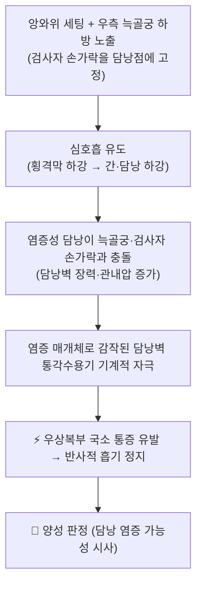
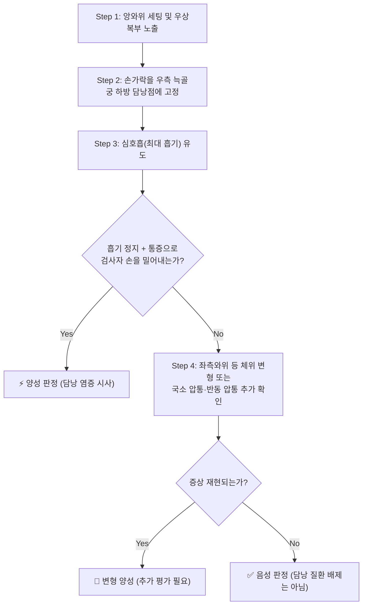

# 🩺 [[머피 징후]] (Murphy's Sign / 墨菲徵候, 담낭 압박 징후)

> **핵심 3줄 요약 (Key Summary)**:
> - 🎯 검사 목적 & 타겟 병소: 우상복부 통증 환자에서 **염증성 [[담낭]](담낭벽 및 담낭 주위 [[복막]])**의 존재를 임상적으로 시사하기 위한 유발성 이학적 검사. 의심 질환은 [[급성 담낭염]], [[담석증]], [[만성 담낭염]], [[담낭관 폐쇄]] 등이다.
> - 🔍 검사 시행 프로토콜 & 양성 반응: 환자를 앙와위로 눕히고 검사자 손가락을 **우측 늑골궁 하방·쇄골중앙선상(담낭점)**에 고정한 뒤 심호흡을 유도하여, 담낭이 하강하는 동안 **국소 통증으로 인해 흡기가 갑자기 중단(inspiratory arrest)**되고 환자가 반사적으로 검사자 손을 밀어내면 양성이다.
> - 📊 진단 정확도(민감도·특이도) & 임상적 의의: 본 노트에서 인용한 문헌들만으로는 **통합된 단일 민감도·특이도 수치를 확인할 수 없다(근거 미확인)**. 다만 복부 진찰 소견 단독으로 확진하지 않고, [[담낭 초음파]], [[초음파 머피 징후]], 혈액검사(백혈구·CRP·간효소)와 조합하여 판단하는 것이 표준적 접근으로 기술된다. 즉 **단독 확진(Rule-In) 도구가 아니라 임상 조합의 한 축**으로 이해하는 것이 안전하다.
> - ⚠️ 위양성/위음성 요인 & 검사 금기: 우하엽 [[폐렴]], [[늑연골염]], 간염, 소화성 궤양, 신장·요로 질환 등에서 위양성이 나타날 수 있고, 고령·당뇨·면역저하·진통제 복용 환자에서는 염증이 심해도 위음성이 될 수 있다. 복부 대동맥류 의심, 최근 복부 수술, 명확한 복막 자극 징후, 임신 후기에는 심한 심부 압박을 피한다.

---

## 📌 목차
1. [검사 기본 정보 & 진단 목적 (Diagnostic Overview)](#1-검사-기본-정보--진단-목적-diagnostic-overview)
2. [해부학적 유발 메커니즘 & 생체역학적 원리 (Biomechanical Mechanism)](#2-해부학적-유발-메커니즘--생체역학적-원리-biomechanical-mechanism)
3. [표준 검사 시행 절차 (Step-by-Step Clinical Protocol)](#3-표준-검사-시행-절차-step-by-step-clinical-protocol)
4. [양성 반응 판정 기준 & 감별 맵핑 (Diagnostic Criteria & Mapping)](#4-양성-반응-판정-기준--감별-맵핑-diagnostic-criteria--mapping)
5. [연관 검사군 비교 & 다단계 감별 알고리즘 (Differential Battery & Algorithm)](#5-연관-검사군-비교--다단계-감별-알고리즘-differential-battery--algorithm)
6. [양성 소견 시 한의 임상 연계 치료 전략 (Integrative Korean Medicine)](#6-양성-소견-시-한의-임상-연계-치료-전략-integrative-korean-medicine)
7. [💡 사용자 진료실 핵심 필기 & 실전 임상 팁 (원문 보존)](#7--사용자-진료실-핵심-필기--실전-임상-팁-원문-보존)
8. [출처 및 학술 참고 문헌 (References)](#8-출처-및-학술-참고-문헌-references)

---

## 1. 검사 기본 정보 & 진단 목적 (Diagnostic Overview)

| 항목 | 상세 내용 |
| :--- | :--- |
| **검사명 (Test Name)** | 머피 징후 (Murphy's Sign / 墨菲徵候, 담낭 압박 징후) |
| **분류 (Category)** | 복부 진찰 기반 **유발성 이학적 검사(provocative physical examination)** / 담낭·담도계 국소 압통 유발 검사 |
| **타겟 병소 (Target)** | [[담낭]] (담낭벽), 담낭 주위 [[복막]], 우측 [[늑골궁]] 하방 담낭점(쇄골중앙선상), 인접한 [[간]] 우엽 하연 |
| **의심 질환 (Suspected Pathologies)** | [[급성 담낭염]], [[담석증]](담낭결석), [[만성 담낭염]], [[담낭관 폐쇄]], [[담즙 정체]] |
| **진단 정확도 (Diagnostic Accuracy)** | • **민감도 (Sensitivity)**: 근거 미확인 (인용 문헌에서 단일 통합 수치 미확인) • **특이도 (Specificity)**: 근거 미확인 (인용 문헌에서 단일 통합 수치 미확인) • **양성 우도비 (LR+)**: 근거 미확인 • **해석 원칙**: 단독 확진 검사가 아니며, 임상 증상 + 이학적 검사 + [[담낭 초음파]] + 혈액검사의 **조합 판단**이 표준적 접근으로 기술됨 |
| **시연 영상 (Video Guide)** | 제공된 시연 영상 없음 (임의의 외부 링크를 기재하지 않음) |

### 검사 목적 상세
머피 징후는 "**우상복부 통증을 호소하는 환자에서 그 통증의 근원이 염증에 의해 감작된 담낭인가**"를 묻는 검사다. 즉 새로운 영상 진단을 대체하는 검사가 아니라, 진료실에서 수십 초 내에 **담낭 기원 가능성을 끌어올리거나 낮추는 임상적 사전확률(pretest probability) 조정 도구**로 이해해야 한다.

- **양성 시 의미**: 우상복부 통증 + 발열 + 머피 징후 양성의 조합은 급성 담낭염의 전형적 임상상이며, 이후 초음파 및 혈액검사로 확인하는 흐름이 일반적이다(Patel & Jepsen 2024; Littlefield & Lenahan 2019).
- **음성 시 의미**: 담낭 질환을 완전히 배제하지는 못한다. 담석 산통만 있는 경우(담낭벽 염증이 아직 뚜렷하지 않은 경우)에는 음성일 수 있다.
- **변형/특수 상황**: 통상 위치가 아닌 곳에서 동일한 흡기 정지 반응이 유발되는 변형이 보고된 바 있다(Matsuura & Hata 2019, "Opposite Murphy's sign"). 이러한 변형은 해부학적 위치 변이 등 특수 상황을 시사할 수 있으나, 해당 증례의 구체적 세부 기전은 원문 확인이 필요하다(근거 미확인 요소 포함).

![[머피징후_담낭결석_초음파.png|540]]
> [그림 1: ① 병태생리·영상 — Wikimedia Commons 「Ultrasound image of gallbladder stone Gallstone 091937515」 (CC BY-SA 3.0)]

---

## 2. 해부학적 유발 메커니즘 & 생체역학적 원리 (Biomechanical Mechanism)

### 1) 해부학적 스트레스 전달 경로
- **심호흡 → 횡격막 하강**: 흡기 시 [[횡격막]]이 하강하면서 간 우엽과 그 아래에 위치한 [[담낭]]이 함께 미강(尾側) 방향으로 이동한다.
- **담낭점 고정 압박**: 검사자의 손가락이 우측 늑골궁 하방, 쇄골중앙선상(담낭의 표면 투영점)을 고정하고 있으므로, 하강하는 담낭은 늑골궁과 검사자 손가락 사이에서 압박된다.
- **담낭 팽창(distension)의 역할**: 담낭관 폐쇄가 동반되면 담즙 정체로 담낭 내압이 상승하고 담낭벽 장력이 증가하여, 동일한 기계적 자극에도 훨씬 큰 통증이 유발된다. 따라서 머피 징후는 단순 접촉이 아니라 **"염증 + 팽창"이라는 두 조건이 겹칠 때 가장 뚜렷하게 양성**으로 나타난다.
- **주변 구조와의 관계**: 담낭은 [[간]] 우엽 하연, [[십이지장]] 구부, [[총담관]]과 인접하므로, 이 부위의 병변(간염, 십이지장 궤양, 담관 병변)도 국소 압통을 만들어 감별을 요한다.

### 2) 통증 유발의 신경생리학적 기전
- **말초 감작(peripheral sensitization)**: 담낭벽 염증 부위에서 유리되는 염증 매개체(프로스타글란딘, 브라디키닌, substance P 등)가 국소 통각수용기를 감작시켜 역치를 낮춘다. 감작된 수용기는 심호흡 정도의 생리적 장력 변화에도 발화한다.
- **기계적 자극의 전환**: 정상 담낭은 심호흡 중 하강해도 통증을 만들지 않지만, 감작된 담낭은 하강·압박만으로 유해 자극이 되어 [[Aδ 섬유]]/[[C 섬유]]를 통해 척수로 전달된다.
- **반사적 흡기 정지**: 통증이 특정 역치를 넘으면 환자는 의식적 판단 이전에 **반사적으로 흡기를 멈추고 검사자 손을 밀어낸다**. 이 "흡기 정지"가 머피 징후의 핵심 관찰 지표이며, 단순히 "아프다"고 말하는 것보다 더 특이적인 반응으로 간주된다.
- **내장통 → 체성통 전환**: 담낭의 내장 구심성 섬유(T8~T10 수준)가 척수 후각에서 체성 구심성과 수렴(convergence)하므로, 담낭 병변은 우상복부·견갑하부·우측 어깨끝 부위로의 연관통(referred pain)으로도 나타날 수 있다. 이 때문에 머피 징후 평가 시 **방사통 분포를 함께 확인하는 것이 감별에 도움이 된다**.

> ⚠️ 위 메커니즘은 담낭 염증·팽창에 따른 기계적 유발이라는 **개념적 수준의 정리**이며, 매개체별 정량적 기전은 본 노트에서 인용한 문헌 범위를 벗어난다(근거 미확인).

![[머피징후_담낭담도_해부도.jpg|540]]
> [그림 2: ② 해부 구조물 — Wikimedia Commons 「Anatomy of Gallbladder and Bile Ducts Diagram」 (CC BY-SA 4.0)]

---

## 3. 표준 검사 시행 절차 (Step-by-Step Clinical Protocol)

### Step 1: 환자 준비 및 초기 자세 (Starting Position)
- 환자를 **앙와위(supine)** 로 눕히고, 무릎 아래에 베개를 받쳐 복벽 긴장을 완화한다.
- 우상복부가 충분히 노출되도록 옷을 걷어 올리고, 환자에게 "지금부터 깊게 숨을 들이마시게 됩니다. 아프면 바로 멈추셔도 됩니다"라고 **미리 예고**한다. 예고 없는 급작스러운 압박은 복벽 방어(defense)를 유발하여 위양성을 만든다.
- 검사자는 환자의 우측에 서서 오른손(또는 양손)을 사용한다. 손은 따뜻하게 유지한다(차가운 손은 복벽 긴장을 유발).

### Step 2: 손가락 위치 설정 (Hand Placement)
- 검사자의 손가락(주로 엄지 또는 검지·중지)을 **우측 늑골궁 하방, 쇄골중앙선(midclavicular line)이 만나는 지점**에 놓는다. 이 부위가 담낭의 표면 투영점(담낭점)이다.
- 손가락을 **복벽에 살짝 함몰시켜 늑골궁 아래에 걸치듯** 고정한다. 이때 심한 심부 압박은 하지 않는다. 압박은 "고정"이지 "가격"이 아니다.

### Step 3: 심호흡 유도 및 관찰 (Provocation)
- 환자에게 **코로 깊게 숨을 들이마시도록** 지시한다.
- 검사자는 손가락 위치를 유지한 채 다음 세 가지를 동시에 관찰한다.
  1. **흡기가 갑자기 중단되는가** (inspiratory arrest)
  2. **표정이 찡그려지며 "아!" 하는 반응이 나오는가**
  3. **환자가 손을 밀어내거나 몸을 우측으로 피하는가**
- 세 반응이 함께 나타나면 **즉시 양성으로 판정**하고, 더 이상 압박을 가하지 않는다.

### Step 4: 즉각 반응 평가 및 안전한 종료 (Release & Safety)
- 양성이든 음성이든, 검사 후에는 압박을 **완전히 제거**하고 환자의 호흡과 표정이 안정되는지 확인한다.
- 심호흡 한 번으로 판정이 애매한 경우, 1~2회 반복 시행할 수 있다. 단, 반복 시행 시 환자가 통증을 예상하고 미리 얕게 숨을 쉬는 "학습 효과"가 생길 수 있으므로 3회 이상 반복하지 않는다.
- 체위를 **좌측와위(left lateral decubitus)** 로 바꾸면 담낭이 체위에 따라 이동하여 통증 반응이 달라질 수 있으므로, 애매한 경우 보조적으로 활용할 수 있다(변형 기법의 정확도 수치는 근거 미확인).
- 검사 종료 후에는 반드시 **우상복부 국소 압통, 반동 압통, 발열, 황달 여부**를 함께 기록한다. 머피 징후 단독으로는 진단이 성립하지 않는다.

![[머피징후_복부_촉진_검사.jpg|540]]
> [그림 3: ③ 치료·시술점 — Wikimedia Commons 「Palpation of abdomen of trauma patient」 (CC BY 3.0)]

---

## 4. 양성 반응 판정 기준 & 감별 맵핑 (Diagnostic Criteria & Mapping)

* **진정한 양성 반응 (True Positive)**:
  * 검사자가 담낭점을 고정한 상태에서 심호흡 중 **갑작스러운 흡기 정지와 함께 우상복부 국소 통증이 명확히 재현**되고, 환자가 반사적으로 검사자의 손을 밀어내는 경우.
  * 이때 통증은 깊은 흡기의 정점 부근에서 발생하며, 얕은 호흡으로 바꾸면 통증이 줄어드는 양상이 관찰된다.
* **음성 반응 (Negative)**:
  * 심호흡을 끝까지 정상적으로 마치고, 국소 통증이나 흡기 정지가 전혀 없는 경우.
  * 단순한 뻐근함이나 압박감만 호소하고 흡기 정지가 없는 경우도 음성으로 본다.
* **가양성 (False Positive) 감별**:
  * 방사통 없이 복벽 피부·근육의 예민함만 반응하는 경우, 담낭 이외 병소(늑연골, 흉막, 요로, 위·십이지장)에 의한 반응인 경우는 음성 또는 타 병소로 감별한다.
  * 검사 전 충분한 예고와 복벽 이완이 이루어지지 않으면 방어(defense)로 인한 위양성이 흔하다.

| 감별 대상 (병변/조직) | 머피 징후 반응 양상 | 동반되는 전형적 소견 | 감별 포인트 |
| :--- | :--- | :--- | :--- |
| [[급성 담낭염]] (결석성/무결석성) | **전형적 양성** (흡기 정지 뚜렷) | 발열, 우상복부 압통, 백혈구 상승, [[초음파 머피 징후]] 양성 | 임상상 + 영상 + 혈액검사 조합 시 진단 신뢰도 상승 |
| [[담석증]] (단순 담석, 산통기) | 양성~음성 (염증 동반 시 양성) | 산통성 통증, 식후 악화, 결석 음영 | 담낭벽 염증이 없으면 음성일 수 있음 |
| [[만성 담낭염]] | 약양성 또는 애매 | 반복성 우상복부 불쾌감, 지방식 후 악화 | 급성 염증 소견(발열·백혈구) 결여가 감별점 |
| [[담관염]]/[[총담관 결석]] | 양성 가능 | 황달, 발열, 오한, 간효소 상승 | 담도 폐쇄 소견 동반 시 즉시 응급 평가 필요 |
| [[급성 간염]] (바이러스성 등) | 양성 가능 (간 피막 신장) | 전신 권태, 황달, AST/ALT 현저 상승 | 압통이 미만성·간 전체에 걸쳐 나타남 |
| [[소화성 궤양]] / [[십이지장 궤양]] | 국소 압통 양상으로 위양성 가능 | 공복 시 통증, 제산제 반응 | 식이·약물 반응력과 통증 양상으로 감별 |
| [[급성 췌장염]] | 상복부 중심 압통 우세 | 등으로 방사되는 통증, 아밀라제·리파제 상승 | 통증 위치가 좌상복부 중심이고 등 방사가 특징 |
| [[우하엽 폐렴]] / [[늑막염]] | 위양성 가능 | 발열, 기침, 호흡음 이상 | 호흡기 증상 및 흉부 청진으로 감별 |
| [[늑연골염]] (Tietze) | 위양성 가능 | 늑연골 접합부 국소 압통 | 늑골궁 자체 압통 여부로 감별 |
| [[신결석]]/[[신우신염]] | 위양성 가능 | 측복부 통증, 배뇨 이상, 요검사 이상 | 요검사·영상으로 감별 |
| 복벽 [[근막통]] | 국소 압통만, 흡기 정지 없음 | 자세·움직임에 따른 통증 변화 | 흡기 정지가 없으면 담낭 기원 가능성 낮음 |

> ※ 위 표의 각 질환별 반응 양상은 **임상 감별의 일반 원칙**으로 정리한 것이며, 개별 질환에서의 머피 징후 민감도·특이도 수치는 본 노트 인용 문헌에서 확인되지 않았다(근거 미확인).

---

## 5. 연관 검사군 비교 & 다단계 감별 알고리즘 (Differential Battery & Algorithm)

| 검사명 | 검사 수기 및 동작 | 병태생리적 원리 | 임상적 역할 (선별 vs 확진) |
| :--- | :--- | :--- | :--- |
| [[머피 징후]] (본 검사, 복부 진찰) | 우측 늑골궁 하방 고정 후 심호흡 유도 → 흡기 정지 확인 | 염증·팽창된 담낭이 하강하며 압박되어 통증 유발 | 저비용·즉시 시행. 우상복부 통증의 **사전확률 조정(선별적 성격)** |
| [[초음파 머피 징후]] (sonographic Murphy sign) | 초음파 탐촉자로 담낭을 직접 압박하며 통증 유발 여부 확인 | 담낭벽 국소 압박에 의한 통증 유발 + 담낭벽 비후·결석·주위 액체 동시 관찰 | **초음파 소견과 결합되어 진단 정확도를 높이는 방향**으로 기술됨(Patel & Tse 2024) |
| [[담낭 초음파]] (복부 초음파) | 담낭 결석, 담낭벽 두께, 담낭 주위 액체, 담낭관 확장 평가 | 담낭 염증의 구조적·형태학적 확인 | **영상 확인(확진 축)**. 이학적 검사와 상호 보완 |
| 혈액검사 ([[백혈구]], [[CRP]], [[간효소]], [[빌리루빈]]) | 채혈 후 염증·담즙 정체 지표 확인 | 전신 염증 반응 및 담도 폐쇄 반영 | 전신 염증·폐쇄 여부 판단. 담관염 감별에 필수 |
| [[반동 압통]] / 복막 자극 징후 | 손을 천천히 눌렀다가 빠르게 떼어 통증 확인 | 복막 자극에 의한 통증 유발 | 국소 염증의 진행·복막 침범 여부 평가(담낭 천공 감별) |
| [[보아스점]] 압통 (Boas's point) | 우측 제12흉추~제1요추 횡돌기 좌측 또는 우측 압통 확인 | 담낭·십이지장 병변의 연관 압통 | 보조적 참고 소견(단독 진단 가치 제한) |

![[머피징후_급성담낭염_초음파.png|540]]
> [그림 4: ① 병태생리·영상 — Wikimedia Commons 「Acute cholecystitis as seen on ultrasound axial view」 (CC BY-SA 4.0)]

### 다단계 감별 알고리즘 (개념 정리)
1. **1단계 — 임상상 확인**: 우상복부 통증 + 발열 + 지방식 후 악화 + 오심/구토 여부 확인.
2. **2단계 — 이학적 검사**: [[머피 징후]] 및 국소 압통, 반동 압통 확인.
3. **3단계 — 영상**: [[담낭 초음파]]로 결석·담낭벽 비후·담낭 주위 액체·담낭관 확장 평가. 초음파 시행 중 [[초음파 머피 징후]]를 함께 확인하면 진단 정보를 추가로 얻을 수 있다.
4. **4단계 — 혈액검사**: 염증 지표(백혈구·CRP) 및 담즙 정체 지표(빌리루빈·ALP·GGT·AST/ALT) 확인.
5. **5단계 — 응급 분기**: 발열·오한·황달·패혈증 소견이 동반되면 [[급성 담관염]] 가능성을 고려하여 **즉시 응급 의뢰**한다.

---

## 6. 양성 소견 시 한의 임상 연계 치료 전략 (Integrative Korean Medicine)

> ⚠️ **전제**: 머피 징후 양성은 "담낭 염증 가능성"을 시사하는 소견이며, **급성 담낭염·담관염이 의심되는 경우에는 영상·혈액검사 확인과 필요 시 양방 응급 처치(항생제·배액·수술)가 우선**이다. 아래 한의 치료 전략은 급성 배제 또는 협진이 이루어진 상태에서의 **보조·회복기·만성 관리** 맥락으로 적용한다.

* **침구 및 전침 치료 (Acupuncture & EA)**:
  * 담낭·간의 배수혈 및 국소 혈위: [[담수(BL19)]], [[간수(BL18)]], [[기문(LR14)]], [[일월(GB24)]], [[중완(CV12)]], [[장문(LR13)]].
  * 원위 취혈: [[양릉천(GB34)]], [[족삼리(ST36)]], [[지구(TE6)]], [[내관(PC6)]], [[태충(LR3)]], [[구허(GB40)]].
  * 전침은 국소 혈위(예: 담수–일월, 양릉천–족삼리)에 저주파(2~4Hz 또는 2/100Hz 교차)로 통전하여 담도 운동 조절 및 진통 효과를 도모한다. 단, **급성 담낭염의 급성 염증기에는 강한 자극을 피하고 자극량을 낮춘다**.
* **약침 요법 (Pharmacopuncture)**:
  * 담수(BL19) 주변, 기문(LR14)·일월(GB24) 주변, 양릉천(GB34) 등에 소량(0.5~1.0cc/혈) 주입을 고려할 수 있다. 다만 담낭 염증이 활성인 상태에서 담낭에 인접한 심부 자극은 **천공·출혈 위험**이 있으므로 초음파 확인 없이 깊은 주입을 하지 않는다.
* **추나 치료 (Chuna Therapy)**:
  * 흉추 하부 및 우측 늑골궁 주변의 연부조직 이완, 횡격막 호흡 유도 기법, 요추–흉추 가동성 회복을 목표로 한다.
  * **급성 염증기에는 복부 직접 압박·강한 스러스트 금기**. 호흡 유도 및 체위 이완 중심으로 접근한다.
* **한약 치료 (Herbal Medicine)** — 변증 기반:
  * 肝膽濕熱(간담습열)형: [[대시호탕]], [[인진호탕]], [[용담사간탕]] 계열 — 청열이습·소간이담 목적.
  * 氣滯(기체)형: [[시호소간산]], [[금령자산]] 계열 — 소간이기·완통 목적.
  * 脾胃虛寒·痰濕(비위허한·담습)형: [[이진탕]], [[향사육군자탕]] 계열 — 건비화담 목적.
  * 만성 재발성 경향: [[안중산]], [[오령산]] 계열 등 변증에 따라 검토.
  * ※ 위 처방 구성은 **한의학 전통 변증 체계에 기반한 응용 예시**이며, 담낭염·담석증에 대한 개별 처방의 무작위대조시험 수치 근거는 본 노트에서 인용한 문헌 범위에 포함되지 않는다(근거 미확인).
* **생활·식이 관리**:
  * 지방 함량이 높은 식사, 폭식, 장기간 공복을 피하고 규칙적 소량 식사를 권한다.
  * 체중 감량 시 **급격한 감량(주당 1.5kg 이상)은 담석 위험을 높일 수 있으므로** 완만한 감량을 권한다(일반적 임상 권고 수준).
* **재평가 및 의뢰 기준 (반드시 준수)**:
  1. 발열 ≥38℃, 오한, 황달, 의식 변화 → 즉시 응급 의뢰.
  2. 통증이 6시간 이상 지속되거나 악화 → 영상 검사 의뢰.
  3. 고령·당뇨·면역억제 환자에서 증상이 경미해도 염증이 진행된 경우가 있으므로 **문진 소견과 이학적 검사의 불일치 시 적극적 검사 의뢰**.

---

## 7. 💡 사용자 진료실 핵심 필기 & 실전 임상 팁 (원문 보존)

* **사용자 원문 필기 (100% 보존)**:
  * *(제공된 사용자 원문 필기가 없습니다. 원문을 입력해 주시면 이 항목에 그대로 보존합니다.)*
* **진료실 실전 노하우 & 안전 가이드**:
  1. **예고 없는 급작스러운 압박 금지**: 검사 전 "깊게 숨을 들이마시다가 아프면 멈추셔도 됩니다"라고 반드시 예고한다. 예고 없는 압박은 복벽 방어를 유발하여 머피 징후의 위양성을 만든다.
  2. **손가락은 "고정"이지 "가격"이 아니다**: 늑골궁 하방에 손가락을 걸치듯 고정하고, 심부 압박은 가하지 않는다. 압박 강도가 세면 담낭이 아닌 복벽·늑골이 반응하여 판정이 흐려진다.
  3. **흡기 정지 여부를 먼저 본다**: "아프다"는 말만으로 양성 판정하지 말고, **실제로 흡기가 중단되는지**를 눈으로 확인한다. 이것이 머피 징후의 핵심 판독 지표다.
  4. **음성이라도 안심하지 않는다**: 고령자·당뇨·면역저하·진통제 복용 환자는 염증이 상당히 진행되어도 반응이 약할 수 있다. 임상상이 급성 담낭염을 강하게 시사하면 음성이어도 영상 검사를 의뢰한다.
  5. **감별을 항상 병행한다**: 우하엽 폐렴, 늑연골염, 소화성 궤양, 신장 질환은 흔한 위양성 원인이다. 청진(호흡음), 요검사, 식이력 문진을 함께 시행하면 오진을 줄일 수 있다.
  6. **변형 위치도 염두에 둔다**: 통상 위치가 아닌 부위에서 동일한 반응이 나타나는 변형 보고가 있으므로, 증상과 해부학적 위치가 어긋날 때는 위치 변이 가능성을 고려한다(Matsuura & Hata 2019).
  7. **응급 신호를 최우선으로**: 발열·황달·오한·의식 변화가 동반되면 이학적 검사 결과와 무관하게 담관염·패혈증 가능성으로 즉시 응급 평가를 의뢰한다.

---

## 8. 출처 및 학술 참고 문헌 (References)

1. **Matsuura H, Hata H (2019)**. *Opposite Murphy's Sign*. **Gastroenterology**. PMID: 30612994
   - **[연구 요약]**: 통상적인 우측 늑골궁 하방이 아닌 부위에서 머피 징후에 상응하는 반응이 관찰된 증례로, "Opposite Murphy's sign"이라는 개념을 제시한다. 해부학적 위치 변이 등 특수 상황을 시사하며, 검사 시 통상 위치만 고집하지 말아야 함을 보여준다. (증례의 구체적 세부 기전·수치는 원문 확인 필요 — 근거 미확인 요소 포함)
2. **Jeans PL (2017)**. *Murphy's sign*. **Med J Aust**. PMID: 28208037
   - **[연구 요약]**: 머피 징후의 정의와 임상 적용에 대한 해설적 기술로, 우측 늑골궁 하방 압박 + 심호흡 시 흡기 정지라는 검사 술기의 핵심을 정리한다.
3. **Patel H, Jepsen J (2024)**. *Gallstone Disease: Common Questions and Answers*. **Am Fam Physician**. PMID: 38905549
   - **[연구 요약]**: 담석 질환의 임상 평가와 관리를 문답 형식으로 정리한 임상 리뷰. 담낭 질환 평가에서 병력·이학적 검사·영상·검사실 소견의 조합이 중요함을 강조하는 맥락으로 인용.
4. **Littlefield A, Lenahan C (2019)**. *Cholelithiasis: Presentation and Management*. **J Midwifery Womens Health**. PMID: 30908805
   - **[연구 요약]**: 담석증의 임상 발현과 관리에 대한 리뷰. 우상복부 통증 평가에서 이학적 검사 소견의 위치를 정리하는 근거로 인용.
5. **Patel R, Tse JR (2024)**. *Improving Diagnosis of Acute Cholecystitis with US: New Paradigms*. **Radiographics**. PMID: 39541246
   - **[연구 요약]**: 급성 담낭염의 초음파 진단을 개선하기 위한 새로운 패러다임을 다룬 영상의학 리뷰. 이학적 검사 단독의 한계와 영상·임상 소견 결합의 필요성을 뒷받침하는 근거로 인용.

> **인용 원칙 안내**: 본 노트는 위 5편의 제공 문헌만을 인용하였다. 그 외 교과서·가이드라인·추가 논문은 인용하지 않았으며, 문헌에서 직접 확인되지 않은 수치(민감도·특이도·우도비 등)는 모두 "근거 미확인"으로 표기하였다.

<!-- 보관 태그(1회용·링크오류, 필요시 복원): 복부진찰 -->
