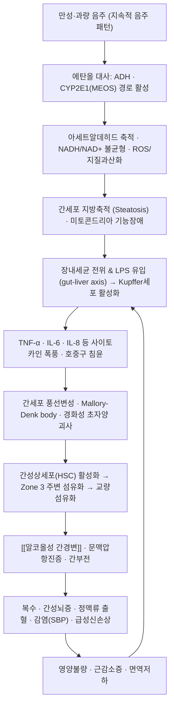

# 🩺 [[알코올성 간질환]] (Alcoholic Liver Disease / 酒疸·酒癖, ICD-10 K70 / KCD K70)

> **핵심 3줄 요약 (Key Summary)**:
> - 📍 병소 부위 & 해부·병태생리: 간 실질, 그중에서도 중심정맥 주위 구역(Zone 3, perivenular region)이 가장 먼저·가장 심하게 손상된다. 만성 음주에 의한 에탄올 대사 부산물(아세트알데히드, ROS)과 NADH/NAD⁺ 불균형 → 간세포 지방축적 → Kupffer 세포·호중구 활성화(TNF-α, IL-6, 장내 LPS 전위) → 간세포 풍선변성(ballooning degeneration)·Mallory-Denk body·호중구 침윤 → 간성상세포 활성화와 주변 섬유화 → [[알코올성 간경변]]·문맥압항진으로 진행하는 연쇄 구조를 갖는다.
> - 🚩 전형적 임상 양상 & 3대 징후: ① 급성·진행성 **황달**, ② **압통을 동반한 간비대**, ③ **발열·백혈구 증가(호중구 우세)**. 여기에 식욕부진·오심·체중감소·전신쇠약이 동반되고, 중증에서는 복수·부종·간성뇌증·정맥류 출혈 등 [[문맥압항진증]] 합병증이 나타난다.
> - 🛠️ 핵심 감별 검사 & 한·양방 다각적 치료 전략: **AST/ALT 비 > 2 (AST 우세)** 소견과 Maddrey Discriminant Function(MDF)·MELD·Glasgow AH score로 중증도를 평가하고, 필요 시 경경정맥 간생검(transjugular liver biopsy)으로 확진한다. 양방은 **금주 + 영양지원 + 중증례에서 코르티코스테로이드**가 축이며, 한방은 [[변증]]에 따른 淸熱利濕·疏肝健脾·活血軟堅 처방과 [[침구치료]], [[약침치료]]를 **협진 보조 요법**으로 운용한다(한약·약침의 ALD 직접 근거는 본 논문에서 다루지 않아 **근거 미확인**).
> - ⚠️ 응급 의뢰 레드플래그 & 악화 요인: 급성 알코올성 간염은 그 자체가 응급이다. MDF ≥ 32 또는 MELD ≥ 20, 신속히 진행하는 황달·INR 연장, 간성뇌증, 복수·급성신손상(AKI), 감염(자발성 세균성 복막염 등), 상부위장관 출혈이 있으면 즉시 상급 병원 의뢰. 절대 금기: 식도·위 정맥류 및 혈소판 감소·응고장애 환자에 대한 강한 복부 압박·심부 복부 자극, 급성기 음주 지속, 간독성 의심 약물·한약의 무검증 병용.

---

## 📌 목차
1. [질환 개요 & 해부학적 병태생리](#1-질환-개요--해부학적-병태생리)
2. [병태생리 메커니즘 & 생체역학적 악순환 네트워크](#2-병태생리-메커니즘--생체역학적-악순환-네트워크)
3. [임상 증상 & 이학적 검사(Physical Exam) 알고리즘](#3-임상-증상--이학적-검사physical-exam-알고리즘)
4. [감별 진단 매트릭스 (Differential Diagnosis)](#4-감별-진단-매트릭스-differential-diagnosis)
5. [한의 통합 치료 프로토콜 (침·약침·추나·한약)](#5-한의-통합-치료-프로토콜-침약침추나한약)
6. [재활 운동 & 생활습관 티칭 가이드](#6-재활-운동--생활습관-티칭-가이드)
7. [💡 사용자 진료실 핵심 필기 & 임상 노하우 (Melt-In 잔여 심화 집약)](#7--사용자-진료실-핵심-필기--임상-노하우-melt-in-잔여-심화-집약)
8. [출처 및 학술 참고 문헌 (References)](#8-출처-및-학술-참고-문헌-references)

---

## 1. 질환 개요 & 해부학적 병태생리

![[알코올성 간질환_1.jpg|540]]
> [그림 1: ① 병태생리·영상 — 알코올성 간질환_1]

![[알코올성 간질환_1.jpg|540]]
> [그림 2: Ballooning degeneration high mag cropped annotated.jpg]

* **질환 정의 및 분류**:
  * **알코올성 간질환(ALD)** 은 만성적·과량의 음주에 의해 발생하는 **연속적 스펙트럼 질환**이다. 병리조직학적으로 **단순 지방간(steatosis) → 알코올성 지방간염(steatohepatitis) → 섬유화(fibrosis) → [[알코올성 간경변]](cirrhosis) → 간세포암** 순으로 진행하며, 각 단계가 반드시 순차적으로 진행하는 것은 아니고 중첩되어 나타날 수 있다 (Hosseini & Shor, 2019, PMID 31219169).
  * **알코올성 간염(Alcoholic Hepatitis, AH)** 은 이 스펙트럼 중 **황달을 주 증상으로 하는 급성 염증성 증후군**으로, 대개 기저의 만성 간질환(지방간 또는 간경변) 위에 급성으로 발생한다. 즉 "알코올성 간염"은 단순한 간수치 상승이 아니라, **임상적으로 유의한 황달과 염증 소견이 함께 있는 질환 실체**로 취급해야 한다 (Im, 2019, PMID 30454835).
  * **ICD-10 / KCD-10 분류 (K70)**:
    | 코드 | 명칭 |
    | :--- | :--- |
    | K70.0 | 알코올성 지방간 (Alcoholic fatty liver) |
    | K70.1 | 알코올성 간염 (Alcoholic hepatitis) |
    | K70.2 | 알코올성 간섬유화 및 경화 (Alcoholic fibrosis and sclerosis) |
    | K70.3 | 알코올성 간경변 (Alcoholic cirrhosis of liver) |
    | K70.4 | 알코올성 간부전 (Alcoholic hepatic failure) |
    | K70.9 | 알코올성 간질환, 상세불명 |
  * **역학적 특성**: 만성 음주자 중 실제로 진행성 간질환으로 이행하는 비율은 일부에 그치며, 이는 음주량·음주기간 외에 **여성, 비만/대사증후군, 유전적 소인, 동반 바이러스간염, 흡연, 영양결핍** 등이 복합적으로 관여하기 때문으로 설명된다 (Hosseini & Shor, 2019). 정확한 국가별 발생률·유병률·성비 수치는 제공된 두 논문에서 인용 가능한 수치를 확인하지 못하여 **근거 미확인**으로 표기한다.
  * **중요한 임상 전제**: 알코올성 간염은 **음주량과 반드시 비례하지 않는다.** 즉 "적당히 마셨는데 걸릴 수 있다"는 점, 그리고 **금주만 해도 생존율이 개선된다**는 점을 환자에게 반드시 설명해야 한다 (Hosseini & Shor, 2019).

* **관련 해부학적 구조물**:
  * **간 실질 및 소엽 구조 (Liver parenchyma & lobule)**:
    * 간소엽은 중심정맥(terminal hepatic venule)을 중심으로 한 구조를 이루며, **중심정맥 주위 구역인 Zone 3 (perivenular zone)** 이 알코올 대사 부산물 및 저산소에 가장 취약하다. 알코올성 간염의 특징적 병변인 **경화성 초자양 괴사(sclerosing hyaline necrosis)** 와 **주변 섬유화(perivenular/pericellular fibrosis, 이른바 chicken-wire pattern)** 가 이 구역에서 시작된다 (Im, 2019, PMID 30454835).
    * 조직학적 3대 표지: **간세포 풍선변성(ballooning degeneration)**, **Mallory-Denk body**, **호중구 침윤(neutrophilic infiltration)** 과 지방축적(macrovesicular steatosis) — 이 조합이 알코올성 간염의 병리학적 진단 골격을 이룬다 (Im, 2019).
  * **혈관 및 문맥 순환 (Vasculature & portal circulation)**:
    * 간은 **문맥(portal vein)과 간동맥(hepatic artery)의 이중 혈류 공급**을 받는다. 장관에서 흡수된 내독소(LPS)와 사이토카인이 문맥을 통해 간으로 유입되는 **장-간 축(gut–liver axis)** 이 알코올성 간손상의 핵심 통로다 (Hosseini & Shor, 2019).
    * 섬유화가 진행되면 **동양혈관(sinusoid) 구조 변형 → 간내 혈관저항 증가 → 문맥압항진(portal hypertension)** → 식도·위 정맥류, 복수, 비장비대, 간성뇌증으로 연결된다.
  * **담도계 (Biliary tree)**:
    * 알코올성 간손상에서 **GGT 상승**이 흔히 동반되며, 황달이 있는 환자에서 담도 폐쇄성 질환(담관결석, 담관암 등)과의 감별이 필요하다.
  * **간 외 연관 구조 (Extrahepatic involvement)** — 알코올의 전신 독성:
    * **신경계**: 알코올성 말초신경병증, 베르니케-코르사코프 증후군(티아민 결핍), 간성뇌증 시 진전(asterixis)·의식 변화. 즉 알코올성 간질환 환자의 "신경학적 증상"은 간 자체보다 **동반 알코올 독성 및 대사 이상**에서 기인하는 경우가 많다.
    * **근육**: 알코올성 근병증 및 **근감소증(sarcopenia)** 동반이 흔하며, 이는 알코올성 간염의 예후 악화 인자로 다루어진다 (Hosseini & Shor, 2019).
    * **골격**: 만성 음주 및 간경변과 동반된 골다공증·골절 위험 증가(단, 본 논문의 상세 수치 근거 미확인).

---

## 2. 병태생리 메커니즘 & 생체역학적 악순환 네트워크

![[알코올성 간질환_4_2.jpg|540]]
> [그림 3: ② 관련 해부 구조물 — Alcohol related liver disease.webm]

### 1) 해부학적·조직학적 손상 기전 (간 구역별 병태생리)
* **Zone 3 (중심정맥 주위) 우선 손상**: 알코올 대사 효소(CYP2E1)가 이 구역에 집중되어 있고 상대적 저산소 상태이므로, 만성 음주 시 **ROS(활성산소종) 및 지질과산화**가 가장 먼저 축적된다. 이 결과 간세포 내 지방방울 축적(steatosis)과 **간세포 풍선변성(ballooning degeneration)** 이 나타난다 (Im, 2019, PMID 30454835).
* **아세트알데히드 및 NADH/NAD⁺ 불균형**: 에탄올이 ADH(알코올탈수소효소)와 CYP2E1(MEOS)에 의해 대사되면서 **아세트알데히드**와 **과잉 NADH** 가 생성된다. 아세트알데히드는 단백질·DNA와 부가체를 형성해 세포독성을 유발하고, NADH 과잉은 지방산 산화를 억제하고 지방합성을 촉진하여 **지방간**을 만든다 (Hosseini & Shor, 2019).
* **호중구 침윤과 Mallory-Denk body**: 손상된 간세포 내 케라틴이 응집되어 **Mallory-Denk body** 를 형성하고, 이에 대한 염증반응으로 **호중구가 침윤**한다. 알코올성 간염의 조직학적 진단에서 이 호중구 침윤이 특히 중요하게 다루어진다 (Im, 2019).
* **경화성 초자양 괴사(sclerosing hyaline necrosis)**: 중심정맥 주위 간세포 괴사와 주변 섬유화가 결합된 병변으로, 알코올성 간염에서 문맥압항진이 조기에 발생하는 구조적 원인이 된다 (Im, 2019).

### 2) 면역·대사 악순환 네트워크 (Gut–Liver Axis & Cytokine Loop)
* **장-간 축**: 만성 음주는 장점막 투과성을 증가시켜 **장내세균 및 내독소(LPS)가 문맥으로 전위**되게 한다. LPS는 간 내 **Kupffer 세포**를 활성화하고, 이어서 **TNF-α, IL-6, IL-8** 등의 전염증성 사이토카인이 분비되어 간세포 손상과 호중구 동원을 증폭시킨다 (Hosseini & Shor, 2019).
* **산화 스트레스-미토콘드리아 축**: ROS 증가 → 미토콘드리아 기능장애 → ATP 생산 저하 → 간세포 괴사·세포자멸사 → 추가 염증. 이 고리가 반복되며 지방간에서 지방간염으로 이행한다.
* **섬유화 축**: 반복적 염증은 **간성상세포(hepatic stellate cell)** 를 활성화하고, 세포주변(pericellular)·중심정맥주변(perivenular) 섬유화가 진행되어 결국 교량섬유화(bridging fibrosis)와 간경변으로 귀결된다 (Im, 2019).
* **영양·대사 악순환**: 알코올 자체가 칼로리를 제공하면서도 필수 영양소 흡수를 방해하여 **단백질-칼로리 영양불량, 티아민·엽산·아연 결핍**을 초래한다. 영양불량은 다시 면역저하와 근감소증을 유발하고, 근감소증은 감염 및 사망 위험을 높여 악순환을 강화한다 (Hosseini & Shor, 2019).

---

## 3. 임상 증상 & 이학적 검사(Physical Exam) 알고리즘

### 1) 주소증 및 전신·소화기 증상
* **핵심 3대 증상**:
  1. **황달(jaundice)**: 최근 수주 내 발생·진행하는 황달이 가장 대표적인 발현이며, 진료실에서 "눈이 노래졌다"는 호소로 내원하는 경우가 많다 (Im, 2019).
  2. **압통을 동반한 간비대(tender hepatomegaly)**: 우상복부 불쾌감·동통과 함께 간이 커지고 눌렀을 때 아프다.
  3. **발열 및 백혈구 증가**: 감염성 질환과 혼동되기 쉬운 발열·호중구 우세 백혈구 증가가 특징적이다 (Hosseini & Shor, 2019).
* **동반 소화기 증상**: 식욕부진, 오심·구토, 상복부 팽만, 체중감소, 전신쇠약감.
* **중증 진행 시**: 복수로 인한 복부 팽만, 하지 부종, 호흡곤란(복수·흉수), 의식 변화(간성뇌증), 토혈·흑색변(정맥류 출혈).
* **알코올 금단 관련**: 진전(delirium tremens 전구 증상), 발한, 초조, 불면 — 금단 증상은 그 자체로 응급 관리 대상이다.

### 2) 필수 이학적 검사법 (Physical Examination)
* **[[황달 및 피부 점막 관찰]]**: 공막 황달의 정도와 진행 속도 확인. 거미혈관종(spider angioma), 수장홍반(palmar erythema), 여성형 유방, 고환 위축, 체모 감소 등 **만성 간질환 징후**를 함께 본다.
* **[[복부 촉진 및 타진 (간비대·비장비대·복수)]]**:
  * 간 하연을 촉진하여 **크기와 압통**을 평가하고, **비장비대** 여부를 확인한다(문맥압항진 시사).
  * **복수** 평가: 이동성 둔탁(movable dullness), 파동성(fluid wave). 복수가 의심되면 진단적 복수 천자가 필요하다.
* **[[간성뇌증 평가 (의식수준·Asterixis)]]**: 의식 수준, 방향감각, 진전(asterixis), 수면-각성 역전 패턴을 확인. 간성뇌증은 **즉시 의뢰 기준**이다.
* **[[활력징후 및 체액 상태 평가]]**: 발열(감염 여부), 빈맥·저혈압(출혈·패혈증), 체중 변화(복수·부종), 소변량 감소(AKI).
* **[[음주력 정량 문진 (AUDIT-C 등)]]**: 음주량·음주기간·최근 음주 여부·금주 시도력·금단 병력을 구조적으로 청취. 이는 진단뿐 아니라 **치료 방향과 예후 판단**의 핵심이다 (Hosseini & Shor, 2019).

### 3) 검사실 소견 및 중증도 평가 알고리즘
* **간기능·염증 지표**:
  * **AST/ALT 비 > 2** 이며 AST가 우세한 패턴이 알코올성 손상의 전형적 소견이다 (Hosseini & Shor, 2019; Im, 2019).
  * 총빌리루빈 상승, ALP·GGT 상승, 알부민 저하, PT/INR 연장.
  * 혈소판 감소(문맥압항진 시사), MCV 증가, 백혈구 증가(호중구 우세).
  * 매우 높은 AST(예: 수백~수천 단위) 또는 ALT 우세 상승은 다른 원인을 시사하나, **구체적 컷오프 수치는 본 논문에서 확인되지 않아 근거 미확인**으로 둔다.
* **중증도 평가 도구 (반드시 기록)**:
  | 도구 | 구성 | 임상적 의미 |
  | :--- | :--- | :--- |
  | **Maddrey Discriminant Function (MDF)** | 4.6 × (PT − 대조 PT) + 총빌리루빈(mg/dL) | **MDF ≥ 32 = 중증(severe)**, 스테로이드 치료 고려 대상 (Hosseini & Shor, 2019) |
  | **MELD score** | 빌리루빈·INR·크레아티닌 기반 | 중증도 및 단기 사망 위험 예측, 치료 결정 보조 |
  | **Glasgow Alcoholic Hepatitis Score** | 연령·WBC·요소·INR·빌리루빈 | 중증도分层 평가 |
  | **Lille score** | 치료 7일째 빌리루빈 변화 등 | **스테로이드 반응 평가(비반응자 조기 판별)** — 정확한 컷오프 수치는 근거 미확인 |
* **영상 검사**: 복부 초음파(지방간·간경변·복수·담도 폐쇄 감별), Doppler(문맥 혈류), CT/MRI는 합병증·종양 감별 시 시행.
* **조직검사(확진)**: **경경정맥 간생검(transjugular liver biopsy)** 이 응고장애·복수가 있는 환자에서 선호되며, 조직학적으로 풍선변성·Mallory-Denk body·호중구 침윤·주변 섬유화를 확인한다 (Im, 2019, PMID 30454835).
* **반드시 함께 배제할 원인**: B형·C형 간염, 자가면역간염, 약물성 간손상, 허혈성 간손상, 윌슨병, Budd-Chiari 증후군 등 (Im, 2019).

---

## 4. 감별 진단 매트릭스 (Differential Diagnosis)

| 감별 질환 | 호발 병소 및 원인 | 주소증 차이점 | 특이적 이학적/검사실 소견 |
| :--- | :--- | :--- | :--- |
| **[[알코올성 간염]]** (본 질환) | Zone 3 중심정맥 주위, 만성 음주력 | 최근 수주 내 진행하는 황달 + 발열 + 압통성 간비대 | **AST/ALT > 2**, 호중구 우세 백혈구 증가, MDF ≥ 32(중증), 조직검사상 풍선변성·Mallory-Denk body (Im, 2019) |
| **[[바이러스성 간염]] (급성 B형/C형)** | 전 간엽, 바이러스 감염 | 황달 + 전구기 독감 유사 증상, 음주력 없거나 적음 | B형 표지자(HBsAg, anti-HBc IgM), HCV RNA 양성, AST/ALT 비(ALT 우세 경향) |
| **[[약물 유발 간손상 (DILI)]]** | 전 간엽, 약물·건강기능식품·한약 | 황달·발진·호산구 증가 등 전신 알레르기 양상 동반 가능 | 약물 복용력가 핵심, 호산구 증가, RUCAM 등 인과성 평가 |
| **[[허혈성 간손상 (Shock liver)]]** | Zone 3, 저혈압·저관류 | 중증 전신질환 중 급격한 AST/ALT/AST 급상승 | 저혈압·패혈증 병력, 매우 높은 AST/ALT, LDH 상승 |
| **[[Budd-Chiari 증후군]]** | 간정맥 폐색 | 급성 복통 + 복수 + 간비대 | Doppler상 간정맥 혈류 소실, 혈전 소인 |
| **[[담도 폐쇄성 질환]] (담관결석·담관암)** | 담관 | 황달 + 발열 + 우상복부 통증(Charcot 3징) | ALP·GGT 우세 상승, 영상에서 담관 확장 |
| **[[자가면역간염]]** | 전 간엽 | 황달·무증상 간수치 이상, 여성·중년 호발 | ANA/SMA/LKM-1 양성, IgG 상승, 스테로이드 반응 |
| **[[자발성 세균성 복막염 (SBP)]]** | 복수액 감염 (합병증 감별) | 알코올성 간염에 복수·발열·복통 동반 | 복수 천자 **PMN ≥ 250/mm³** — 알코올성 간염 환자에서 반드시 배제해야 하는 동반 질환 |

---

## 5. 한의 통합 치료 프로토콜 (침·약침·추나·한약)

> ⚠️ **원칙**: 알코올성 간질환, 특히 **급성 알코올성 간염은 양방 표준치료(금주·영양지원·중증례 스테로이드)가 축**이다. 한의 치료는 **반드시 금주 및 양방 치료와 병행하는 협진 보조 요법**으로 운용하고, 중증( MDF ≥ 32 ) 또는 합병증이 있으면 한의 단독 치료를 고집하지 않는다. 아래 한약·약침·침구의 알코올성 간질환에 대한 직접 임상근거는 **제공된 두 논문에서 다루지 않아 근거 미확인**이며, 전통적 변증 체계에 기반한 임상 활용이다.

* **변증(辨證) 접근 개요**:
  * 한의학에서 알코올성 간질환은 **[[酒疸]]**(술로 인한 황달), **[[酒癖]]**(술로 인한 積聚), **[[臌脹]]**(복수·팽만), **[[肝積]]** 등의 범주에 대응된다.
  * 대표 변증: **濕熱內蘊**, **酒毒傷肝**, **肝鬱脾虛**, **氣滯血瘀**, **肝腎陰虛**, **脾腎陽虛(臌脹 단계)**.
  * 변증별 치료 대법: 淸熱利濕 · 利膽退黃 · 疏肝健脾 · 活血化瘀 · 軟堅散結 · 溫補脾腎.

* **침구 치료 (Acupuncture)**:
  * **기본 혈위 조합**: [[太衝]](LR3), [[肝俞]](BL18), [[膽俞]](BL19), [[脾俞]](BL20), [[足三里]](ST36), [[陽陵泉]](GB34), [[陰陵泉]](SP9), [[三陰交]](SP6), [[中脘]](CV12), [[期門]](LR14).
  * **濕熱·황달 시**: [[陰陵泉]](SP9), [[陽陵泉]](GB34), [[至陰]](BL67), [[腕骨]](SI4) 등을 추가하여 淸熱利濕을 도모.
  * **복수·팽만 시**: [[水分]](CV9), [[氣海]](CV6), [[陰交]](CV7), [[足三里]](ST36) 등 — 단, **복수·정맥류·혈소판 감소 환자에서는 자침 깊이와 자극량을 극도로 제한**한다.
  * **전침(Electroacupuncture)**: 足三里·太衝 등에 저주파(2 Hz) 위주, 자극 강도는 환자가 견딜 수 있는 최소 강도로 설정. **식도정맥류·응고장애 환자에서 과도한 자극은 금기.**
  * **이침(耳鍼)**: 肝·脾·胃·神門·交感 — 금주 의지 강화 및 금단 불안 관리에 보조적으로 활용.

* **약침 치료 (Pharmacopuncture)**:
  * 원칙: **간독성 가능성이 있는 약재는 배제**하고, 간 대사 부담을 고려하여 최소 용량·최소 자극으로 시행.
  * 임상 활용 예(변증에 따라 선택, **ALD 특이 근거 미확인**): 茵陳·柴胡·丹蔘·五味子 계열 약침을 간俞·膽俞·足三里·太衝 등에 소량 주입하는 방식.
  * **금기·주의**: INR 연장 및 혈소판 감소 시 출혈 위험, 복수로 피부가 얇아진 경우 주입 후 누출·감염 위험 → **혈액응고 검사 및 복수 유무 확인 후 시행**.

* **추나 치료 (Chuna Manipulation)**:
  * 알코올성 간질환에서 추나는 **간 자체를 치료하는 수기가 아니라**, 동반되는 **흉추·늑골 가동성 저하, 횡격막 긴장, 자세 불균형, 근감소성 허리 통증**을 관리하는 보조 요법으로 접근한다.
  * 기법: 흉추 신전 가동, 늑골 회전 이완, 횡격막 호흡 유도(복식호흡 유도 수기), 경흉부 근막 이완(JS 계열).
  * **절대 금기**: 식도·위 정맥류 환자에 대한 강한 복부 압박·심부 복부 추나, 급성 알코올성 간염 활동기에서의 격한 전신 추나. 간비대·복수·혈소판 감소증에서는 **복부 직접 수기 전면 금지**.

* **한약 치료 (Herbal Medicine)**:
  * **濕熱內蘊(황달·발열·소변황)**: [[茵陳蒿湯]](茵陳·梔子·大黃) 계열, [[茵陳五苓散]] 가미 — 淸熱利濕退黃.
  * **肝鬱脾虛(피로·식욕부진·복부팽만)**: [[柴胡疏肝散]] 합 [[四君子湯]] 가미 — 疏肝健脾.
  * **氣滯血瘀(간비대·통증·만성화)**: [[血府逐瘀湯]] 또는 [[膈下逐瘀湯]] 계열 가미 — 活血化瘀.
  * **臌脹(복수·脾腎陽虛)**: [[實脾飮]], [[濟生腎氣丸]] 계열 — 溫陽利水.
  * **주의사항**: 간 대사 부담 및 잠재적 간독성을 감안하여 **약재 하나하나의 간독성 이력을 검토**하고, 양방 처방(스테로이드 등)과의 상호작용을 확인한다. 금주 없이 한약만 복용하는 것은 치료가 아니라는 점을 환자에게 명확히 교육한다.

---

## 6. 재활 운동 & 생활습관 티칭 가이드

* **1순위: 금주(Abstinence)**:
  * 알코올성 간질환 관리의 **유일한 근본 치료이자 가장 강력한 예후 개선 인자**다. 금주는 생존율과 간기능 회복을 개선한다 (Hosseini & Shor, 2019).
  * 단, **만성 중증 음주자의 갑작스러운 금주는 금단 증후군(진전, 발작, 섬망)을 유발할 수 있으므로** 반드시 의료기관 관리 하에 시행한다. 금단 위험이 있으면 즉시 의뢰.
  * 중독 치료 연계(정신건강의학과, 중독관리통합지원센터, 알코올 금단 약물치료)를 병행한다.

* **영양 관리 (Nutrition)**:
  * 알코올성 간염 환자에서 **영양불량이 흔하고 예후를 악화시키므로 적극적 영양지원이 필요**하다 (Hosseini & Shor, 2019).
  * 실무 권고: 고단백·고열량 식이(단백질 및 칼로리 목표량은 환자 체중·상태에 따라 개별화하며, **구체적 g/kg 수치는 본 논문 요약 범위에서 근거 미확인**), 티아민·엽산·아연 등 미량영양소 보충.
  * 금기: 간성뇌증이 동반된 경우 단백질 제한 여부는 전문의 판단에 따른다(최근에는 과도한 제한을 지양하는 경향).
  * 카페인·과당 음료·고지방 가공식품 최소화, 규칙적 소량 다식.

* **이완 및 스트레칭 (Stretching)**:
  * 흉곽·늑골·횡격막 이완을 위한 **복식호흡 및 늑골 가동 스트레칭** — 호흡 효율과 자세 개선.
  * 하지·요부 정적 스트레칭은 근긴장 완화 및 낙상 예방 목적으로 부드럽게 수행.
  * **급성기(황달 진행 중, 복수·전신쇠약)에는 스트레칭조차 최소화하고 안정**한다.

* **강화 및 안정화 운동 (Strengthening)**:
  * 회복기에는 **근감소증 예방**을 위해 저강도 저항운동(밴드, 자체중량)을 주 2~3회, 점진적으로 시행.
  * 유산소 운동은 걷기 위주로 시작하고, **어지럼·피로·호흡곤란이 나타나면 즉시 중단**.
  * 복수·부종이 있는 경우 균형 운동 및 낙상 예방에 우선순위를 둔다.

* **신경 활주 운동 (Neurodynamics)**:
  * 동반된 알코올성 말초신경병증이 있을 때 하지 신경 슬라이딩(좌골신경·대퇴신경 계열)을 **무통 범위 내에서** 부드럽게 수행. 급성 통증 유발 시 중단.

* **일상생활 자세 및 환경 티칭 (Ergonomics)**:
  * 금주 환경 조성: 집 안의 술 병 제거, 음주 유발 상황(모임·스트레스) 회피 전략 수립.
  * 수면 위생: 규칙적 취침·기상, 야식·야간 음주 습관 교정.
  * **약물 주의**: 아세트아미노펜 과량, NSAIDs, 일부 건강기능식품·한약은 간손상을 악화시킬 수 있으므로 **복용 전 반드시 의료진과 상의**하도록 교육.
  * 예방접종: A형·B형 간염 백신 접종 권고.

---

## 7. 💡 사용자 진료실 핵심 필기 & 임상 노하우 (Melt-In 잔여 심화 집약)

> [!IMPORTANT]
> **🛡️ 원문 융합(Melt-In) 및 7번 섹션 작성 불변 규칙 (CRITICAL)**
> 1. **기존 필기 내용 상부 전면 융합 (Melt-In)**: 기존 노트에 있던 질환의 정의, 해부학적 원인, 증상, 이학적 검사법, 치료법, 생활 티칭 등은 상부 1~6번 섹션에 유기적으로 100% 녹여내어(Melt-In) 고도화합니다.
> 2. **7번 섹션의 차별화된 심화 집약 (녹이고 남은 고유 필기만 수록)**: 7번 섹션은 상부에 이미 녹여낸 기본 원문을 단순 중복 나열(복사-붙여넣기)하는 공간이 아닙니다. **상부 1~6번에 다 담기지 않은, 기존 노트에만 있었던 녹이고 남은 고유한 내용(원장님만의 독창적인 진료실 노하우, 실전 문진 체크리스트, 환자 설명 스크립트, 임상 감별 직관 팁 등)만이 엄선되어 집약**되어야 합니다.
> 3. **📷 질환 노트 필수 3종 이미지 수록**: 노트 하나당 ① 질환/병태생리 사진, ② 관련 해부 구조물 사진, ③ 치료/시술점 사진 등 **최소 3개 이상의 이미지를 단독 블록으로 필수 배치**합니다.

* **상부 섹션에 미처 다 담지 못한 고유 원문 필기**:
  * **한의학적 병명 대응 정리**: 알코올성 간질환은 단계별로 대응되는 한의 병명이 다르다. 지방간·초기 지방간염은 **酒癖·酒傷**, 황달이 뚜렷한 급성 알코올성 간염은 **酒疸**, 간비대·딱딱한 덩어리 촉지는 **肝積·積聚**, 복수가 찬 말기는 **臌脹(고창)** 으로 본다. **진료실에서 환자에게 설명할 때 이 단계 구분을 쓰면 "내 병이 어디쯤인지"를 직관적으로 이해시킬 수 있다.**
  * **"술을 끊으면 좋아진다"는 말의 정확한 전달**: 알코올성 간염에서 금주는 단순 권고가 아니라 **생존율을 바꾸는 치료**다. 다만 환자에게 "끊으면 다 낫는다"고 단정하지 말고, **"지금 끊는 것이 가장 강력한 치료이며, 금단 증상 때문에 혼자 끊는 것은 위험할 수 있다"** 는 두 가지를 반드시 함께 말한다. 이 두 문장을 같이 말하지 않으면 환자가 집에서 무리하게 금주하다 금단 섬망으로 응급실에 실려 오는 경우가 생긴다.
  * **알코올성 간질환의 함정 — 무증상 구간**: 단순 지방간 단계는 대개 증상이 없고 간수치도 정상에 가깝다. 그래서 **환자는 "나 술 잘 견디는데?"라고 말하고, 실제로 그 시점에 개입을 놓치면** 다음 내원은 황달 또는 복수로 이루어진다. 진료실에서는 간수치가 정상이어도 **음주력 + GGT + MCV + 혈소판 + 초음파 지방간 소견**을 묶어서 보는 습관이 필요하다.
  * **"AST/ALT > 2" 하나로 끝내지 말 것**: 이 비율은 알코올성 손상을 **시사**하는 소견이지 확진 기준이 아니다. 다른 원인(바이러스·약물·자가면역)이 겹쳐 있을 수 있으므로, 첫 진료에서 반드시 **B형·C형 간염 검사, 자가면역抗体, 약물·건강기능식품·한약 복용력**을 확인한다 (Im, 2019).

* **진료실 실전 감별 & 치료 노하우**:
  * **1. 실전 문진 체크리스트 (내원 5분 안에 확인할 것)**:
    * ① **최근 3개월 내 황달이 생겼는가?** → 생겼다면 이 환자는 "만성 관리 환자"가 아니라 **급성 알코올성 간염 의심 응급 후보**다.
    * ② **마지막 음주가 언제인가?** → 오늘/어제라면 금단 위험 평가가 먼저다.
    * ③ **하루 평균 음주량과 총 음주 기간은?** ④ **금주 시도 시 진전·발한·불안이 있었는가?**
    * ⑤ **복부 팽만·하지 부종·소변량 감소·의식 변화가 있는가?** → 있으면 즉시 의뢰.
    * ⑥ **현재 복용 중인 약·건강기능식품·한약이 있는가?** → 간독성 중첩 여부 확인.
    * ⑦ **체중 변화(최근 3개월 급격한 감소)와 식사량** → 영양 상태 평가.
  * **2. 치료 순서 및 손맛 노하우**:
    * **순서 원칙**: ① 금주·금단 평가(안전 확보) → ② 양방 검사·중증도 평가(MDF/MELD) 및 의뢰 여부 결정 → ③ 영양·수액 보충 → ④ 그 다음에 한의 치료(침·한약)를 병행. **이 순서를 뒤집어 침부터 놓는 것은 위험하다.**
    * **자침 시**: 足三里·太衝 등 원위혈 위주로 자극하고, **복부 혈(中脘·期門 등)은 복수·간비대·혈소판 감소 여부를 확인한 후에만 신중히** 사용한다. 자침 후 어지럼·식은땀이 나타나면 즉시 발침하고 혈압·혈당을 확인한다.
    * **한약 처방 시**: 알코올성 간질환 환자는 **간 대사능이 떨어져 있어 일반 성인 용량이 과할 수 있다.** 소량으로 시작해 반응을 보며 조정하고, 복용 2~4주 후 반드시 간수치를 재확인한다.
    * **금주 교육의 타이밍**: 황달이 보이는 환자에게는 첫 진료에서 바로 금주를 강하게 말하되, **"혼자 끊지 말고 함께 끊자"** 는 프레임으로 전달한다.
  * **3. 환자 티칭 스크립트 (그대로 읽어도 되는 문장)**:
    * *"간은 술을 대사하는 과정에서 생기는 독한 중간물질 때문에 다칩니다. 그런데 이 간은 다른 장기와 달리 **술을 끊으면 회복될 여지가 큰 장기**입니다. 그래서 지금 드리는 약보다 더 중요한 처방은 '금주'입니다."*
    * *"다만 술을 오래·많이 드신 분이 갑자기 끊으면 손 떨림, 식은땀, 심하면 경련이나 헛것이 보이는 금단 증상이 생길 수 있습니다. 그래서 끊는 것도 **혼자 하지 말고 저와 함께 안전하게** 해야 합니다."*
    * *"눈이 노래지거나 배가 붓고 소변이 줄면, 그건 예약일까지 기다릴 상황이 아니라 **바로 큰 병원에 가셔야 하는 신호**입니다."*
    * *"간에 부담을 주는 약이나 건강기능식품, 한약도 있습니다. 새로 드시기 전에는 꼭 저에게 먼저 말씀해 주세요."*

---

## 8. 출처 및 학술 참고 문헌 (References)

1. **Hosseini N, Shor J (2019)**. *Alcoholic Hepatitis: A Review*. **Alcohol and Alcoholism**.
   - **PMID: 31219169**
   - **[연구 요약]**: 알코올성 간염의 역학·위험인자·병태생리(에탄올 대사, 산화 스트레스, 장-간 축 및 사이토카인 매개 염증, 영양불량)를 정리하고, 진단적 접근과 중증도 평가 도구(Maddrey Discriminant Function ≥ 32를 중증 기준으로 제시), 치료 전략(금주, 영양지원, 중증례 코르티코스테로이드, 기타 약물 및 간이식 고려)을 종합한 리뷰.
2. **Im GY (2019)**. *Acute Alcoholic Hepatitis*. **Clinics in Liver Disease**.
   - **PMID: 30454835**
   - **[연구 요약]**: 급성 알코올성 간염의 임상상(최근 발생하는 황달, 발열, 압통성 간비대), 조직학적 진단 기준(간세포 풍선변성, Mallory-Denk body, 호중구 침윤, 중심정맥 주위 섬유화 및 경화성 초자양 괴사), 경경정맥 간생검의 역할, 감별해야 할 다른 급성 간손상 원인, 중증도 평가 및 치료 방침을 다룬 임상 리뷰.
3. **기타 교과서 및 진료 가이드라인(대한간학회 등)**: 본 노트에서는 **제공된 위 2편의 논문만 인용**하였으며, 그 외 교과서·가이드라인·기타 논문은 인용하지 않았다. 따라서 본문 중 "근거 미확인"으로 표기된 항목은 추후 별도 문헌 확인이 필요하다.

<!-- 보관 태그(1회용·링크오류, 필요시 복원): 알코올, 중독 -->
