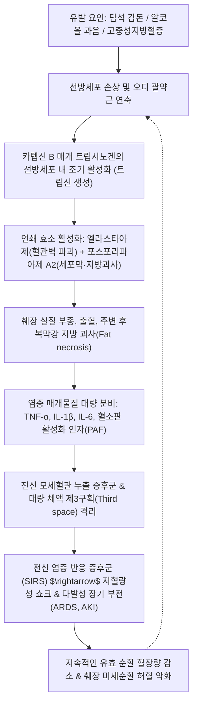

# 🩺 급성 췌장염 (Acute Pancreatitis)

> **핵심 3줄 요약 (Key Summary)**:
> - 📍 **병소 부위 & 해부·병태생리**: 후복막 장기인 [[췌장]]의 선방세포(Acinar cell) 내 지모겐 과립에서 트립시노겐(Trypsinogen)이 비정상적으로 조기 활성화되어 췌장 실질 및 주변 조직을 자가소화(Auto-digestion)하고 전신 염증 반응을 촉발하는 급성 가역적 염증성 질환.
> - 🚩 **전형적 임상 양상 & 3대 진단 기준**: 심와부에서 등 쪽으로 관통하듯 방사되는 극심한 지속성 복통(좌위 전굴 시 완화, 앙와위 시 악화), 혈청 [[아밀라아제]](Amylase) 또는 [[리파아제]](Lipase) 정상 상한치 3배 이상 상승, 조영증강 복부 CT 상 췌장 종대 및 삼출액 저류 중 2가지 이상 충족 시 확진.
> - 🛠️ **핵심 검사 & 한·양방 통합 치료**: 조영 복부 CT, 복부 초음파(담석 배제), BISAP/Ranson 중증도 평가; 양방의 초기 대량 수액 요법(Lactated Ringer's), 금식 및 단계적 경장 영양 요법과 함께, 한의학의 양명부실(陽明腑實)·간담습열(肝膽濕熱) 변증에 따른 [[대시호탕]], [[청담사간탕]], [[황련해독탕]] 투여 및 복부 염증 해소와 위장관 운동 회복을 위한 중완(CV12)·하완(CV10)·족삼리(ST36) 침구 치료.
> - ⚠️ **응급 의뢰 레드플래그**: 장기 부전(호흡곤란 PaO2/FiO2 < 300, 핍뇨 Cr > 2.0 mg/dL, 수축기 혈압 < 90 mmHg 쇼크), 전격성 출혈 징후(쿨렌 징후, 그레이 터너 징후), 급성 담관염 합병(발열, 황달, 오한), 조영 CT 상 췌장 실질 광범위 괴사(Necrotizing pancreatitis) 의심 시 즉시 상급종합병원 응급 전원.

---

## 📌 목차
1. [질환 개요 & 해부학적 병태생리](#1-질환-개요--해부학적-병태생리)
2. [병태생리 메커니즘 & 생체역학적 악순환 네트워크](#2-병태생리-메커니즘--생체역학적-악순환-네트워크)
3. [임상 증상 & 이학적 검사(Physical Exam) 알고리즘](#3-임상-증상--이학적-검사physical-exam-알고리즘)
4. [감별 진단 매트릭스 (Differential Diagnosis)](#4-감별-진단-매트릭스-differential-diagnosis)
5. [한의 통합 치료 프로토콜 (침·약침·추나·한약)](#5-한의-통합-치료-프로토콜-침약침추나한약)
6. [양방 치료 & 병용·의뢰 기준 (Conventional Treatment & Referral)](#6-양방-치료--병용의뢰-기준-conventional-treatment--referral)
7. [재활 운동 & 생활습관 티칭 가이드](#7-재활-운동--생활습관-티칭-가이드)
8. [💡 사용자 진료실 핵심 필기 & 임상 노하우 (Melt-In 잔여 심화 집약)](#8--사용자-진료실-핵심-필기--임상-노하우-melt-in-잔여-심화-집약)
9. [출처 및 학술 참고 문헌 (References)](#9-출처-및-학술-참고-문헌-references)

---

## 1. 질환 개요 & 해부학적 병태생리

![[급성_췌장염_01_췌장의구조와기능내외분비도해.png|450]]
> [그림 1: ① 해부 구조 및 기능 도해 — 췌장(이자)과 담관·췌장관·십이지장 해부학적 위치 및 외분비(소화효소)/내분비(인슐린·글루카곤) 2대 기능 한국어 도해 — 질병관리청 국가건강정보포털 「췌장염」 cntntsSn 5248 — SEQ 176cbf2314f4]

* **정의 및 질환 개념**:
  * [[급성 췌장염]](Acute Pancreatitis)은 췌장의 선방세포가 다양한 병인에 의해 손상되면서 비정상적으로 조기 활성화된 췌장 소화효소에 의해 췌장 실질 및 주위 조직이 자가소화되어 급성 염증과 부종, 심할 경우 출혈 및 괴사를 일으키는 질환입니다.
  * 대부분(약 80~85%)은 염증이 췌장 실질과 주위 지방층에 국한되는 **간질부종성 췌장염(Interstitial edematous pancreatitis)**으로 양호한 경과를 보이나, 15~20%는 췌장 실질 또는 주위 조직의 괴사가 동반되는 **괴사성 췌장염(Necrotizing pancreatitis)**으로 진행하여 다발성 장기 부전(MODS)과 15~30%에 이르는 높은 사망률을 초래합니다.
* **관련 해부학적 구조물**:
  * **후복막강 위치**: 췌장은 제1~2 요추 높이에서 위(Stomach) 후방, 척추 전방에 가로누운 후복막(Retroperitoneal) 장기입니다.
  * **담관-췌관 합류부(바터 팽대부)**: 주췌관(Wirsung duct)과 총담관(Common bile duct)이 합류하여 십이지장 제2부의 대십이지장유두(바터 팽대부, Ampulla of Vater)로 개구하며, 오디 괄약근(Sphincter of Oddi)이 담즙과 췌장액의 분출을 조절합니다.
* **역학 및 2대 주요 병인**:
  * **담석증(Biliary causes, 40~50%)**: 작은 담석이나 담즙 찌꺼기(Microlithiasis)가 바터 팽대부를 통과하거나 감돈되면서 일시적으로 췌관 내압이 급상승하고 담즙 역류가 발생하여 발병합니다.
  * **알코올(Alcoholic causes, 30~40%)**: 과도한 음주가 오디 괄약근의 일시적 연축 및 췌관 상피 손상을 유발하고, 지모겐 과립의 조기 붕괴와 산화 스트레스를 증폭시킵니다.
  * 기타 병인: 고중성지방혈증(TG > 1,000 mg/dL), 고칼슘혈증, ERCP 시술 후 합병증, 외상, 약물성(아자티오프린, 티아지드 등).

---

## 2. 병태생리 메커니즘 & 생체역학적 악순환 네트워크

![[급성_췌장염_02_선방세포자가소화및가성낭종형성기전.png|450]]
> [그림 2: ② 병태생리 진행 도해 — 알코올 및 담석 폐색에 의한 췌장세포 손상, 소화효소 조기 유출 및 자가소화, 가성낭종 형성 4단계 한국어 도해 — 질병관리청 국가건강정보포털 「췌장염」 cntntsSn 5248 — SEQ 176cbf2315e1]

* **선방세포 내 효소 조기 활성화(Premature Zymogen Activation)**:
  * 정상 생리 상태에서는 지모겐 과립 내 트립시노겐이 십이지장으로 분비된 후에야 장세포의 엔테로키나아제(Enterokinase)에 의해 트립신으로 전환되며, 췌장 분비 트립신 억제제(SPINK1)가 조기 활성화를 방어합니다.
  * 급성 손상 시 선방세포 내에서 리소좀 효소인 **카텝신 B(Cathepsin B)**와 지모겐 과립이 이상 융합(Colocalization)되어 트립시노겐이 세포질 내에서 **트립신(Trypsin)**으로 조기 전환됩니다.
* **자가소화 연쇄 캐스케이드(Auto-digestion Cascade)**:
  * 생성된 트립신이 키모트립신, 엘라스타아제(Elastase, 모세혈관 기저막 및 탄력섬유를 융해하여 후복막 출혈 유발), 포스포리파아제 A2(Phospholipase A2, 세포막 인지질을 분해하여 광범위한 지방 괴사 유발)를 연쇄 활성화합니다.
* **미세순환 파탄 및 제3구획 체액 손실**:
  * 혈관 투과성 증가로 수 리터에 달하는 체액이 후복막강 및 복강 내(제3구획)로 빠져나가 심각한 저혈량증(Hypovolemia)과 췌장 미세순환 허혈을 초래하며, 이는 다시 췌장 괴사를 심화시키는 치명적인 악순환을 형성합니다.

---

## 3. 임상 증상 & 이학적 검사(Physical Exam) 알고리즘

![[급성_췌장염_03_복부조영CT급성삼출성췌장염소견.png|450]]
> [그림 3: ① 영상 진단 소견 — 급성 삼출성 췌장염 환자의 조영증강 복부 CT 축면상, 췌장 미만성 종대 및 주위 삼출액 저류 실사 — Wikimedia Commons, File:Akute exsudative Pankreatitis - CT axial.jpg]

![[급성_췌장염_03_그레이터너징후옆구리반상출혈.png|450]]
> [그림 4: ① 임상 징후 실사 — 중증 출혈성 췌장염 환자의 좌측 옆구리에 발생한 그레이 터너 징후(Grey Turner's sign) 피부 반상출혈 실사 — Wikimedia Commons, File:Hemorrhagic pancreatitis - Grey Turner's sign.jpg]

### 1) 주요 임상 증상
* **심와부 복통(Epigastric Pain)**:
  * 찌르는 듯하거나 타는 듯한 극심한 통증이 돌발적으로 시작되어 수 시간 내 최고조에 달하며, 등(Th10~L2 레벨) 또는 좌측 늑골하부로 관통하듯 방사됩니다.
  * 환자는 몸을 앞으로 웅크리고 무릎을 세운 자세(Tripod position)를 취할 때 후복막 압박이 줄어들어 통증이 약간 완화되며, 반대로 반듯하게 누우면(앙와위) 통증이 악화됩니다.
* **동반 증상**: 지속적인 오심, 담즙성 분출성 구토(구토 후에도 복통이 경감되지 않음), 발열, 빈맥, 복부 팽만 및 장음 감소(마비성 장폐색 동반).

### 2) 이학적 검사 및 신체 징후
* **상복부 압통 및 복벽 강직**: 심와부 깊은 압통이 현저하나, 초기에는 충수염에 비해 반발통이나 뚜렷한 복막 자극 징후가 상대적으로 경미할 수 있습니다(후복막 장기 특성).
* **출혈성 징후 (괴사성 출혈성 췌장염의 위험 신호)**:
  * **[[Cullen 징후]](Cullen's sign)**: 후복막 출혈이 간겸상인대를 타고 전복벽으로 확산되어 배꼽 주위 피부가 청자색으로 변하는 반상출혈.
  * **[[Grey Turner 징후]](Grey Turner's sign)**: 췌장 괴사 삼출액과 혈종이 신장 주위 공간을 따라 측복부 피하로 파급되어 나타나는 옆구리 반상출혈.

### 3) 2012 Revised Atlanta 분류 진단 기준 (2가지 이상 만족 시 확진)
1. 급성으로 발생하는 지속적이고 심한 심와부 통증(등으로 방사됨).
2. 혈청 [[아밀라아제]](Amylase) 또는 [[리파아제]](Lipase) 수치가 정상 상한치의 3배 이상 상승.
3. 조영 복부 CT, MRI 또는 복부 초음파에서 급성 췌장염의 전형적인 영상 소견 확인.

---

## 4. 감별 진단 매트릭스 (Differential Diagnosis)

| 질환명 | 주 통증 부위 & 특징 | 검사 소견 특징 | 영상 소견 감별점 | 임상적 핵심 감별 팁 |
| :--- | :--- | :--- | :--- | :--- |
| **[[급성 췌장염]]** | 심와부 $\rightarrow$ 등 쪽 관통통, 전굴위 완화 | 아밀라아제/리파아제 $\ge 3\times$ 정상 상한 | 조영 CT상 췌장 종대 및 주위 삼출액 | 구토 후에도 통증 지속, 등의 방사통 |
| **[[소화성 궤양 천공]]** | 심와부 급발성 판자 같은 복벽 판상강직 | 백혈구 증가, 혈청 아밀라아제 경도 상승 | 단순 X선/CT상 횡격막하 유리 가스(Free air) | 복벽이 돌처럼 굳는 즉각적 범발성 복막염 |
| **[[급성 담낭염]]** | 우상복부(RUQ) 통증, 우측 견갑골 방사 | 백혈구 증가, 빌리루빈 경도 상승 | 초음파상 담낭벽 비후(>3mm), 담석, 담낭 주위 액체 | **머피 징후(Murphy's sign)** 양성 |
| **[[급성 심근경색]] (하벽)** | 심와부 압박감, 흉통, 턱/좌측 팔 방사 | 심근효소(Troponin-I, CK-MB) 상승 | 심전도상 II, III, aVF ST분절 상승 | 소화기 효소 정상, 심혈관계 불안정 |
| **[[장간막 허혈]]** | 복부 전반의 참을 수 없는 극심한 통증 | 대사성 산증, 혈청 젖산(Lactate) 급상승 | CT 혈관조영술상 장간막동맥 폐색 | **이학적 소견에 비해 통증이 지나치게 극심함** |

---

## 5. 한의 통합 치료 프로토콜 (침·약침·추나·한약)

![[급성_췌장염_05_침구치료중완하완양릉천혈위도해.png|450]]
> [그림 5: ③ 한의 침구 혈위 도해 — 명·청대 침구목판본 흉복부 경혈도(胸腹部 穴位圖), 상복부 급성 염증 완화 및 위장관 운동 조절을 위한 임맥(任脈) 중완(CV12), 하완(CV10), 거궐(CV14) 및 족양명위경 복부 혈위 주행도 — Wikimedia Commons, File:Acupuncture chart of chest and abdomen, 17th C. Chinese Wellcome L0034709.jpg (CC BY 4.0)]

* **한의 병태 인식**:
  * 한의학에서 급성 췌장염은 '위완통(胃脘痛)', '협통(脅痛)', '비만(痞滿)', '결흉(結胸)'의 범주에 속합니다.
  * 주된 병기는 폭음폭식 및 주열(酒熱)로 인해 **간담습열(肝膽濕熱)**이 옹체되거나, 열사(熱邪)가 양명부(陽明腑)에 맺혀 통하지 않는 **양명부실(陽明腑實)**로 파악합니다.

### 1) 변증별 한약 투여 프로토콜 (안정기 및 회복기 중심)
* **간담습열·양명부실증(肝膽濕熱·陽明腑實證) — 급성기 울체 완화**:
  * **[[대시호탕]](大柴胡湯)**: 시호 12g, 황금 8g, 작약 8g, 반하 8g, 대황 6g, 지실 6g, 생강 6g, 대조 4g.
  * 기전: 간담의 울열을 꺾고 대변을 통하게 하여 오디 괄약근의 내압을 낮추고 장관 마비를 해소하며, 염증성 사이토카인(TNF-α, IL-6) 분비를 억제합니다.
* **습열온결증(濕熱蘊結證) — 담도계 염증 및 황달 동반**:
  * **[[인진호탕]](茵蔯蒿湯)** 또는 **[[청담사간탕]](淸膽瀉肝湯)**: 인진 16g, 치자 8g, 대황 6g. 이담(利膽), 습열 사하 작용을 통해 담즙 울체를 신속히 배출합니다.
* **비위허약·담음정체증(脾胃虛弱·痰飮停滯證) — 회복기 소화 흡수 재건**:
  * **[[향사육군자탕]](香砂六君子湯)** 가미: 급성기 경과 후 비위의 운화 기능을 돕고 췌장 외분비 부담을 줄여 식후 복부 팽만과 소화불량을 예방합니다.

### 2) 침구 치료 프로토콜
* **주요 혈위 선혈**:
  * 복모혈 및 국소 혈위: **중완(CV12)**, **하완(CV10)**, **천추(ST25)**, **기문(LR14)**.
  * 원위 배혈: **족삼리(ST36)**, **상거허(ST37)**, **양릉천(GB34)**, **지기(SP8)**, **태충(LR3)**.
* **침구 수기법**:
  * 급성 복통 완화 및 복부 내압 강하를 위해 양릉천과 족삼리에 사법(瀉法)을 적용하고, 전침(2/100 Hz 혼합파)을 연계하여 장운동을 정상화합니다.

---

## 6. 양방 치료 & 병용·의뢰 기준 (Conventional Treatment & Referral)

### 1) 표준 현대의학적 보존 치료
* **초기 대량 수액 요법(Aggressive Fluid Resuscitation)**:
  * 초기 12~24시간 동안 **Lactated Ringer's 용액**을 200~250 mL/h(또는 10 mL/kg 볼루스 후 유지) 투여하여 헤마토크릿(Hct)과 BUN을 정상화하고 췌장 미세순환 허혈을 방지합니다.
* **영양 공급 전략**:
  * 경증 췌장염: 과거의 장기 금식 원칙에서 벗어나, 심한 복통과 오심이 호전되면 즉시 조기 경구 식이(저지방 유동식)를 시작합니다.
  * 중증 췌장염: 장점막 장벽 보존 및 세균 전위 방지를 위해 비위관/비공장관을 통한 조기 경장 영양(Enteral nutrition)을 우선합니다.
* **통증 조절**: 비스테로이드성 소염진통제(NSAIDs) 또는 필요 시 오피오이드 진통제 투여.

### 2) 응급 상급병원 전원 레드플래그
* **지속적 장기 부전(Organ Failure > 48시간)**:
  * 심혈관계: 승압제(Vasopressor) 투여가 필요한 저혈압 쇼크.
  * 호흡기계: PaO2/FiO2 $\le 300$의 급성 호흡곤란.
  * 신장계: 수액 투여 후에도 지속되는 혈청 크레아티닌 $\ge 2.0$ mg/dL의 급성 신손상.
* **감염성 췌장 괴사(Infected Pancreatic Necrosis)**: CT상 괴사 조직 내 공기 방울(Gas bubbles) 발견 시 즉시 경피적 배액술 또는 내시경적 괴사절제술 의뢰.
* **급성 담석성 담관염**: 발열, 황달, 저혈압 동반 시 24시간 이내 응급 ERCP(내시경 유두절개술 및 담도 배액) 시행 필요.

---

## 7. 재활 운동 & 생활습관 티칭 가이드

* **절대 금주 (Abstinence from Alcohol)**:
  * 알코올성 췌장염 환자뿐만 아니라 모든 급성 췌장염 회복기 환자는 **완전 금주**가 필수적입니다. 소량의 알코올 재섭취로도 급성 재발률이 급격히 증가합니다.
* **식이 관리 원칙**:
  * **저지방 식이**: 회복기 식사는 지방 섭취를 엄격히 제한(1일 지방량 30g 이하)하여 췌장 외분비 자극을 최소화합니다.
  * **소량 다식**: 한 번에 과식하지 않고 하루 5~6회로 나누어 섭취하며, 튀김류·육류 기름진 부위·버터·치즈 등을 피합니다.
* **체중 및 지질 관리**:
  * 고중성지방혈증성 췌장염 예방을 위해 체중 감량, 혈당 관리 및 오메가-3/피브레이트 제제 복약을 지도합니다.

---

## 8. 💡 사용자 진료실 핵심 필기 & 임상 노하우 (Melt-In 잔여 심화 집약)

* **통증 발현 자세의 임상적 단서**:
  * 급성 복통 환자가 진료실 침대에서 똑바로 눕지 못하고, 몸을 새우등처럼 둥글게 말거나 앞으로 숙인 채 앉아 있다면 급성 췌장염을 최우선으로 의심해야 합니다. 앙와위에서는 팽창된 위와 복벽이 후복막의 췌장을 직접 압박하여 신경총을 자극하기 때문입니다.
* **아밀라아제 vs 리파아제 추적의 함정**:
  * 아밀라아제는 발병 2~12시간 내 상승하여 3~5일이면 빠르게 정상화되지만, 리파아제는 8~14일간 지속 상승합니다. 내원 시점이 증상 발생 후 수일이 경과한 환자라면 아밀라아제가 정상이더라도 반드시 리파아제를 확인해야 합니다.
  * 알코올성 췌장염 환자에서는 췌장 선방세포의 효소 생성 결핍으로 아밀라아제 상승폭이 3배 미만으로 미미할 수 있음에 유의합니다.

---

## 9. 출처 및 학술 참고 문헌 (References)

1. **Banks PA, Bollen TL, Dervenis C, et al. (2013)**. Classification of acute pancreatitis--2012: revision of the Atlanta classification and definitions by international consensus. *Gut*, 62(1):102-111. [PMID 23100216](https://pubmed.ncbi.nlm.nih.gov/23100216/)
2. **Working Group IAP/APA. (2013)**. IAP/APA evidence-based guidelines for the management of acute pancreatitis. *Pancreatology*, 13(4 Suppl 2):e1-e15. [PMID 24054878](https://pubmed.ncbi.nlm.nih.gov/24054878/)
3. **Zhang D, Zhao D, Shen Y, et al. (2021)**. Acupuncture for Relieving Abdominal Pain and Distension in Acute Pancreatitis: A Systematic Review and Meta-Analysis. *Front Med*, 8:782412. [PMID 34925110](https://pubmed.ncbi.nlm.nih.gov/34925110/)
4. 질병관리청 국가건강정보포털. (2023). 「급성 췌장염」 질환정보. cntntsSn: 5248.
