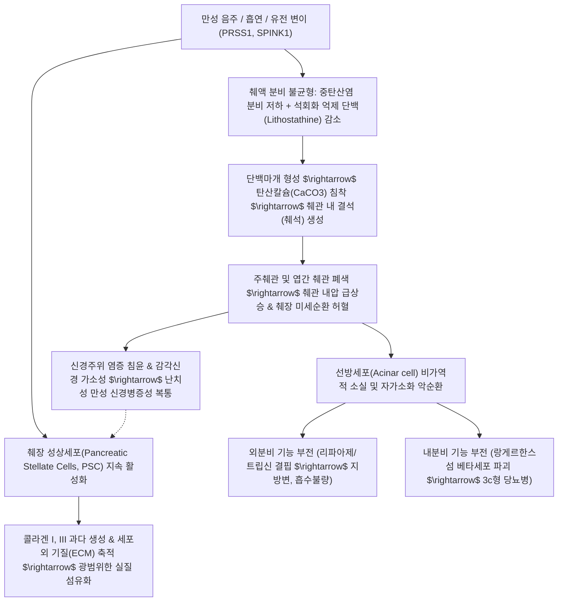

# 🩺 만성 췌장염 (Chronic Pancreatitis)

> **핵심 3줄 요약 (Key Summary)**:
> - 📍 **병소 부위 & 해부·병태생리**: 지속적이고 반복적인 염증 손상으로 인해 [[췌장]] 실질의 비가역적인 위축, 광범위한 섬유화, 주췌관 불규칙 협착 및 췌석(Pancreatic stones) 형성이 진행되어 외분비 및 내분비 기능이 영구적으로 상실되는 만성 염증성 질환.
> - 🚩 **전형적 임상 양상 & 3대 징후**: 난치성 상복부·등 통증(식후 악화), 외분비 기능 저하에 따른 흡수장애성 **지방변(Steatorrhea)** 및 영양실조, 췌장 랑게르한스섬 파괴로 인한 이차성 **[[당뇨병]]**(3c형 당뇨병)의 '3대 고전적 징후'.
> - 🛠️ **핵심 검사 & 한·양방 통합 치료**: 조영 복부 CT(석회화), MRCP(췌관 연주창 변화), 대변 엘라스타아제-1(Fecal elastase-1 < 200 $\mu$g/g); 양방의 췌장 소화효소 대체요법(PERT, 고역가 판크레리파아제), 내시경적 췌관 쇄석술/스텐트 삽입술과 함께, 한의학의 비위기허(脾胃氣虛)·간비불화(肝脾不和)·어혈정체(瘀血停滯) 변증에 따른 [[향사육군자탕]], [[시호소간산]], [[보중익기탕]] 가미방 투여 및 소화 흡수 촉진을 위한 비수(BL20)·위수(BL21)·중완(CV12)·족삼리(ST36) 침구 치료.
> - ⚠️ **응급 의뢰 및 악화 레드플래그**: 총담관 섬유화 협착에 따른 진행성 폐쇄성 황달, 십이지장 협착(위출구 폐색), 췌장 가성낭종의 급성 감염 및 파열, 췌성 복수, 가성동맥류 파열성 위장관 대출혈, 만성 염증 기반 [[췌장암]] 악성 전환 의심(체중 급감, CA 19-9 급상승) 시 즉시 상급종합병원 소화기내과/간담췌외과 정밀 의뢰.

---

## 📌 목차
1. [질환 개요 & 해부학적 병태생리](#1-질환-개요--해부학적-병태생리)
2. [병태생리 메커니즘 & 생체역학적 악순환 네트워크](#2-병태생리-메커니즘--생체역학적-악순환-네트워크)
3. [임상 증상 & 이학적 검사(Physical Exam) 알고리즘](#3-임상-증상--이학적-검사physical-exam-알고리즘)
4. [감별 진단 매트릭스 (Differential Diagnosis)](#4-감별-진단-매트릭스-differential-diagnosis)
5. [한의 통합 치료 프로토콜 (침·약침·추나·한약)](#5-한의-통합-치료-프로토콜-침약침추나한약)
6. [양방 치료 & 병용·의뢰 기준 (Conventional Treatment & Referral)](#6-양방-치료--병용의뢰-기준-conventional-treatment--referral)
7. [재활 운동 & 생활습관 티칭 가이드](#7-재활-운동--생활습관-티칭-가이드)
8. [💡 사용자 진료실 핵심 필기 & 임상 노하우 (Melt-In 잔여 심화 집약)](#8--사용자-진료실-핵심-필기--임상-노하우-melt-in-잔여-심화-집약)
9. [출처 및 학술 참고 문헌 (References)](#9-출처-및-학술-참고-문헌-references)

---

## 1. 질환 개요 & 해부학적 병태생리

![[만성_췌장염_01_췌장관담관바터팽대부해부도판.png|450]]
> [그림 1: ① 해부 구조 도해 — 십이지장과 췌장, 주췌관(Pancreatic duct), 부췌관, 총담관 및 대십이지장유두(바터 팽대부) 개구부 해부도판 — Wikimedia Commons, File:Gray1100.png (공중도메인 / Gray's Anatomy)]

* **정의 및 질환 개념**:
  * [[만성 췌장염]](Chronic Pancreatitis)은 췌장에 지속적인 염증 손상이 누적되어 췌장 실질(선방세포 및 랑게르한스섬)의 비가역적인 파괴와 섬유화, 주췌관 및 분지 췌관의 협착·확장, 췌관 내 결석(석회화) 형성이 초래되는 질환입니다.
  * 가역적 회복이 가능한 [[급성 췌장염]]과 달리, 만성 췌장염은 염증의 유발 원인이 제거된 후에도 섬유화와 기능 감퇴가 자가영속적(Self-perpetuating)으로 비가역적 진행을 보입니다.
* **관련 해부학적 구조물**:
  * **주췌관(Wirsung duct)**: 췌미부에서 시작하여 체부를 거쳐 두부로 주행하며, 만성 염증 시 불규칙한 협착과 국소적 낭성 확장이 교대로 나타나는 '연주창(Chain of lakes)' 모양의 변형이 발생합니다.
  * **바터 팽대부 및 총담관 인접부**: 췌두부의 심한 섬유화성 종괴는 인접한 총담관(Common bile duct) 원위부를 압박하여 이차적인 폐쇄성 황달과 담즙성 간경변을 유발할 수 있습니다.
* **역학 및 위험 인자 (TIGAR-O 분류 체계)**:
  * **독성-대사성(Toxic-metabolic, 70~80%)**: 만성적 다량의 알코올 섭취(1일 60~80g 이상 5~10년 이상) 및 흡연(독립적 위험 인자이자 질병 진행 가속 인자).
  * **특발성(Idiopathic)**: 조기 발병형(20대 전후) 및 후기 발병형(50대 이후).
  * **유전성(Genetic)**: PRSS1(양이온 트립시노겐 유전자 변이), SPINK1, CFTR 유전자 돌연변이.
  * **자가면역성(Autoimmune)**: [[자가면역성 췌장염]](AIP, Type 1 및 Type 2).
  * **재발성/중증 급성 췌장염 후유증(Recurrent severe AP)**: 반복된 급성 췌장염 후 췌관 협착 및 허혈성 섬유화.
  * **폐쇄성(Obstructive)**: 바터 팽대부 종양, 외상성 췌관 단절, 분열췌(Pancreas divisum).

---

## 2. 병태생리 메커니즘 & 생체역학적 악순환 네트워크

![[만성_췌장염_02_만성염증섬유화및췌석형성기전.png|450]]
> [그림 2: ② 병태생리 진행 도해 — 음주 및 만성 염증으로 인한 췌석 형성, 췌관 협착 및 췌장 실질의 비가역적 괴사·섬유화 위축 병태도해 — 질병관리청 국가건강정보포털 「췌장염」 cntntsSn 5248 — SEQ 176cbf231587]

* **췌장 성상세포(PSC)의 만성 활성화와 섬유화**:
  * 간의 이토세포(Hepatic stellate cell)와 상동인 췌장 성상세포(PSC)가 만성 알코올 대사산물(아세트알데히드)과 활성산소종(ROS), PDGF, TGF-$\beta$의 자극을 받아 근섬유모세포(Myofibroblast)로 분화합니다.
  * 활성화된 PSC가 과도한 콜라겐과 섬유 결합조직을 췌장 실질 전반에 비가역적으로 축적시켜 선방세포를 교체하고 췌장을 경화시킵니다.
* **단백마개와 췌석(Pancreatic Stone) 형성**:
  * 만성 음주는 췌장액 내 단백질 농도를 증가시키고, 결석 형성을 억제하는 리토스타틴(Lithostathine, PSP)의 분비를 감소시킵니다.
  * 농축된 단백마개(Protein plug)에 탄산칼슘(CaCO3)이 침착되면서 단단한 췌석이 발생하며, 이는 췌관 내강을 막아 췌관 내압 상승과 상류 부위의 낭성 확장을 유발합니다.
* **신경 가소성과 난치성 통증 기전**:
  * 지속적인 신경주위 염증(Perineural inflammation), 췌관 내 고압 및 췌장 캡슐 팽창은 후복막 복강신경총의 C-섬유를 만성 감작시키며, 중추신경계 감작(Central sensitization)을 초래하여 일반 진통제에 반응하지 않는 신경병증성 양상의 난치성 통증을 형성합니다.

---

## 3. 임상 증상 & 이학적 검사(Physical Exam) 알고리즘

![[만성_췌장염_03_복부CT췌장실질다발성석회화소견.png|450]]
> [그림 3: ① 영상 진단 소견 — 만성 췌장염 환자의 조영 복부 CT 축면상, 췌장 체부 및 미부 실질을 따라 발생한 다발성 췌석 및 고음영 석회화(화살표) 소견 실사 — Wikimedia Commons, File:Chronische Pankreatitis mit Verkalkungen - CT axial.jpg]

### 1) 3대 주요 임상 양상
1. **만성 복통(Abdominal Pain)**:
   - 심와부에서 시작되어 등(Th10~L2)이나 좌우 늑하부로 방사되는 둔하고 지속적인 통증.
   - 고지방 식사 15~30분 후 통증이 현저히 악화되며, 질환이 10~20년 이상 진행되어 췌장 외분비 조직이 90% 이상 완전 소실되면 오히려 통증이 감소(Burn-out phenomenon)하기도 합니다.
2. **외분비 기능 부전 & 지방변(Steatorrhea)**:
   - 췌장 리파아제 분비량이 정상의 10% 이하로 감소하면 지방 흡수 장애가 발생합니다.
   - 기름기가 둥둥 뜨고 악취가 심하며 변기 물을 내려도 잘 씻기지 않는 다량의 황백색 변(지방변)을 배설하며, 체중 감소, 지용성 비타민(A, D, E, K) 결핍(야맹증, 골연화증, 응고장애)이 동반됩니다.
3. **내분비 기능 부전 & 당뇨병 (3c형 당뇨병, 췌장원성 당뇨)**:
   - 인슐린을 분비하는 베타세포뿐만 아니라 글루카곤을 분비하는 알파세포까지 함께 파괴되므로, 인슐린 저항성보다는 심각한 **인슐린 결핍**과 함께 저혈당 방어 기전 상실로 인한 **취약성 당뇨(Brittle diabetes)** 양상을 띱니다.

### 2) 핵심 진단 검사
* **조영 복부 CT**: 췌장 실질의 위축, 췌관 확장, 다발성 실질 석회화 및 췌석 확인(진단의 가장 신뢰할 수 있는 초기 영상 검사).
* **자기공명 담췌관조영술(MRCP)**: 침습적인 ERCP를 대체하여 주췌관의 협착, 불규칙성, 엽간 분지 췌관의 확장 소견을 비침습적으로 평가.
* **대변 엘라스타아제-1(Fecal Elastase-1)**:
  * 외분비 기능 저하를 평가하는 가장 간편한 비침습 검사.
  * < 200 $\mu$g/g: 외분비 기능 저하 / < 100 $\mu$g/g: 중증 췌장 외분비 기능 부전 확진.

---

## 4. 감별 진단 매트릭스 (Differential Diagnosis)

| 질환명 | 주 증상 및 양상 | 영상의학적 소견 (CT/MRCP) | 생화학 및 병리 소견 | 감별 핵심 포인트 |
| :--- | :--- | :--- | :--- | :--- |
| **[[만성 췌장염]]** | 식후 상복부·등 통증, 지방변, 3c형 당뇨 | 미만성 석회화, 췌관 연주창 불규칙 확장 | 대변 엘라스타아제-1 저하 (<100 $\mu$g/g) | 만성 음주력, 실질 석회화와 외분비 장애 |
| **[[췌장암]] (PDAC)** | 무통성 황달, 급격한 체중 감소, 새로 발병한 당뇨 | 경계가 불분명한 저음영 종괴, 췌관 절단 징후(Duct cutoff) | **CA 19-9 현저한 상승**, EUS-FNA 악성 상피 | 고령자에서 체중 급감, 혈관 침윤 여부 확인 |
| **[[자가면역성 췌장염]] (AIP)** | 경미한 복통, 폐쇄성 황달 | **소시지 모양 미만성 종대**, 피막양 저신호 테두리 | **혈청 IgG4 현저한 상승** (>140 mg/dL) | 스테로이드 투여 후 극적인 병변 소실 |
| **[[소화성 궤양]]** | 공복통, 식후 완화(십이지장) 또는 식후통(위) | 내시경상 점막 결손 및 궤양 소견 | 췌장 효소 및 영상 정상 | 제산제 및 PPI에 극적인 통증 완화 |
| **[[과민성 대장 증후군]]** | 배변 후 완화되는 하복통, 설사/변비 교대 | 복부 CT 및 내시경상 기질적 병변 없음 | 대변 엘라스타아제 정상, 체중 감소 없음 | 지방변이나 영양실조, 야간 설사 부재 |

---

## 5. 한의 통합 치료 프로토콜 (침·약침·추나·한약)

![[만성_췌장염_05_침구치료족태음비경비수위수혈위도해.png|450]]
> [그림 4: ③ 한의 침구 혈위 도해 — 족태음비경(足太陰脾經) 경혈도, 만성 췌장 외분비·내분비 기능 저하 및 소화 흡수 장애 개선을 위한 음릉천(SP9), 삼음교(SP6), 공손(SP4), 대도(SP2) 및 복부 혈위 도판 — Wikimedia Commons, File:Acupuncture chart, spleen channel of foot taiyin, Chinese Wellcome L0037485.jpg (CC BY 4.0)]

* **한의 병태 인식**:
  * 만성 췌장염은 '복통(腹痛)', '비만(痞滿)', '설사(泄瀉)', '허로(虛勞)', '소갈(消渴)'의 복합 범주에 속합니다.
  * 장기간의 음주와 노권(勞倦)으로 인해 비위의 기운이 극도로 허약해진 **비위기허(脾胃氣虛)**를 바탕으로, 간기울결(肝氣鬱結)이 겹친 **간비불화(肝脾不和)** 및 오래된 통증으로 인한 **어혈정체(瘀血停滯)**가 본허표실(本虛標實)의 병기를 이룹니다.

### 1) 변증별 한약 투여 프로토콜
* **비위허약·수곡불화증(脾胃虛弱·水穀不化證) — 지방변, 식후 팽만, 영양실조**:
  * **[[향사육군자탕]](香砂六君子湯)** 또는 **[[보중익기탕]](補中益氣湯)** 가감:
    * 백출 12g, 백복령 10g, 인삼 8g, 진피 6g, 반하 6g, 목향 4g, 사인 4g, 감초 4g.
    * 기전: 중초(中焦) 비위의 운화 기능을 북돋워 소화 흡수를 증진하고 장내 삼출액을 억제하며 기력을 회복시킵니다.
* **간비불화·기체혈어증(肝脾不和·氣滯血瘀證) — 지속적인 상복부 둔통 및 등 방사통**:
  * **[[시호소간산]](柴胡疎肝散)** 합 **[[단삼음]](丹參飮)** 가감:
    * 시호 10g, 백작약 12g, 지각 8g, 향부자 8g, 단삼 12g, 단향 4g, 사인 4g, 현호색 8g.
    * 기전: 간기를 소통시켜 오디 괄약근의 과긴장을 풀고, 활혈거어(活血祛瘀) 지통 약물로 후복막 복강신경총 주변의 미세혈류 순환을 개선하여 만성 통증을 완화합니다.
* **비신양허증(脾腎陽虛證) — 오경설사(새벽설사), 수척, 극심한 한랭감**:
  * **[[사신환]](四神丸)** 또는 **[[이중탕]](理中湯)** 가미: 보골지 10g, 오수유 4g, 육두구 6g, 오미자 6g, 건강 8g, 백출 12g.

### 2) 침구 치료 프로토콜
* **배수혈 및 복모혈 배혈**:
  * 등 부위 배수혈: **비수(BL20)**, **위수(BL21)**, **간수(BL18)**, **담수(BL19)**. (흉추 9~12번 분절성 내장-체성 반사 조절)
  * 복부 복모혈: **중완(CV12)**, **하완(CV10)**, **양문(ST21)**, **천추(ST25)**.
* **사지 원위 취혈**:
  * **족삼리(ST36)**, **음릉천(SP9)**, **공손(SP4)**, **태충(LR3)**, **내관(PC6)**.
* **수기법**: 비수와 족삼리에는 보법(補法)과 뜸(간접구)을 적용하여 소화 흡수를 촉진하고, 기체복통 시 태충과 내관에 염전사법을 병행합니다.

---

## 6. 양방 치료 & 병용·의뢰 기준 (Conventional Treatment & Referral)

### 1) 현대의학적 표준 보존 및 내시경 치료
* **췌장 소화효소 대체요법 (Pancreatic Enzyme Replacement Therapy, PERT)**:
  * 외분비 기능 저하 및 지방변 환자에게 고역가 장용피 판크레리파아제(Creon 등)를 매 식사 시 25,000~50,000 IU 이상 복용시킵니다. 식사와 함께 복용하여 미즙과 고르게 섞이도록 지도합니다.
* **통증 조절 단계별 요법**:
  * 비마약성 진통제(아세트아미노펜, 트라마돌), 항산화제 병용, 필요 시 신경병증성 통증 약물(가바펜틴, 프레가발린) 투여.
  * 복강신경총 차단술(Celiac plexus block): 난치성 통증 환자에서 일시적 완화 고려.
* **내시경 및 외과적 치료 (ERCP / 수술)**:
  * 주췌관 결석: 체외충격파쇄석술(ESWL) 및 내시경적 췌관 결석 제거술, 췌관 스텐트 삽입술.
  * 수술적 배액술(Frey 수술, Puestow 수술): 내시경 치료에 반응하지 않는 심한 췌관 확장 및 난치성 통증 환자.

### 2) 상급종합병원 긴급 의뢰 기준
* **폐쇄성 황달(Obstructive Jaundice)**: 혈청 빌리루빈 상승 및 담도 확장 동반 시(총담관 협착 또는 동반 악성 종양 감별).
* **췌장암 악성 전환 감별 요망**: 흡연력이 있는 만성 췌장염 환자에서 설명되지 않는 급격한 체중 감소, 복통 양상의 급변, 혈청 CA 19-9 급증 시 조영 CT 및 EUS-FNA 의뢰.
* **위출구 폐색(Gastric Outlet Obstruction)**: 십이지장 협착으로 인한 지속적 식후 구토.
* **췌성 가성동맥류 출혈**: 가성낭종 주변 비장동맥 또는 위십이지장동맥 미란으로 인한 위장관 대출혈(토혈, 흑색변).

---

## 7. 재활 운동 & 생활습관 티칭 가이드

* **완전하고 영구적인 금주 (Total Alcohol Abstinence)**:
  * 만성 췌장염 진행 지연과 통증 빈도 감소의 제1원칙입니다. 알코올 섭취를 중단하지 않으면 췌관 석회화와 실질 파괴가 급속도로 진행합니다.
* **금연 (Smoking Cessation)**:
  * 흡연은 췌장 석회화 진행을 2~3배 가속화하고 [[췌장암]] 발생 위험을 기하급수적으로 높이므로 반드시 금연해야 합니다.
* **영양 관리 및 식단 수칙**:
  * **저지방 고단백 소량 다식**: 지방 섭취를 1일 30~50g 이하로 제한하되, 심각한 영양실조를 예방하기 위해 소화가 용이한 단백질 위주로 하루 5~6회 나누어 섭취합니다.
  * **MCT 오일(중쇄지방산)**: 담즙산이나 췌장 리파아제 없이도 문맥으로 직접 흡수되는 MCT 오일을 보조 열원(1일 15~30mL)으로 활용합니다.
  * **지용성 비타민 보충**: 비타민 A, D, E, K 및 비타민 B12 결핍 여부를 정기 혈액검사로 확인하고 보충합니다.

---

## 8. 💡 사용자 진료실 핵심 필기 & 임상 노하우 (Melt-In 잔여 심화 집약)

* **만성 소화불량 환자에서 만성 췌장염을 놓치지 않는 법**:
  * 만성 위염이나 기능성 소화불량으로 장기간 치료받았으나 호전이 없고, "기름진 음식만 먹으면 몇 시간 뒤 배가 묵직하게 아프고 설사가 난다"고 호소하는 40~60대 환자(특히 음주력이 있는 남성)에서는 반드시 단순 복부 X선(KUB)이나 복부 CT를 확인하여 췌장 석회화 여부를 감별해야 합니다.
* **3c형 당뇨병(췌장원성 당뇨)의 인슐린 처방 주의점**:
  * 만성 췌장염으로 인한 당뇨병은 글루카곤 분비 결핍이 동반되어 인슐린 투여 시 **치명적인 저혈당**에 빠지기 매우 쉽습니다. 혈당 조절 목표치를 일반 당뇨 환자보다 다소 느슨하게(당화혈색소 7.5~8.0% 수준) 유지하는 것이 안전합니다.

---

## 9. 출처 및 학술 참고 문헌 (References)

1. **Löhr JM, Dominguez-Munoz E, Rosendahl J, et al. (2017)**. United European Gastroenterology evidence-based guidelines for the diagnosis and therapy of chronic pancreatitis (HaPanEU). *United European Gastroenterol J*, 5(2):153-199. [PMID 28344786](https://pubmed.ncbi.nlm.nih.gov/28344786/)
2. **Working Group IAP/APA. (2013)**. IAP/APA evidence-based guidelines for the management of acute pancreatitis. *Pancreatology*, 13(4 Suppl 2):e1-e15. [PMID 24054878](https://pubmed.ncbi.nlm.nih.gov/24054878/)
3. **Banks PA, Bollen TL, Dervenis C, et al. (2013)**. Classification of acute pancreatitis--2012: revision of the Atlanta classification and definitions by international consensus. *Gut*, 62(1):102-111. [PMID 23100216](https://pubmed.ncbi.nlm.nih.gov/23100216/)
4. 질병관리청 국가건강정보포털. (2023). 「만성 췌장염」 질환정보. cntntsSn: 5248.
