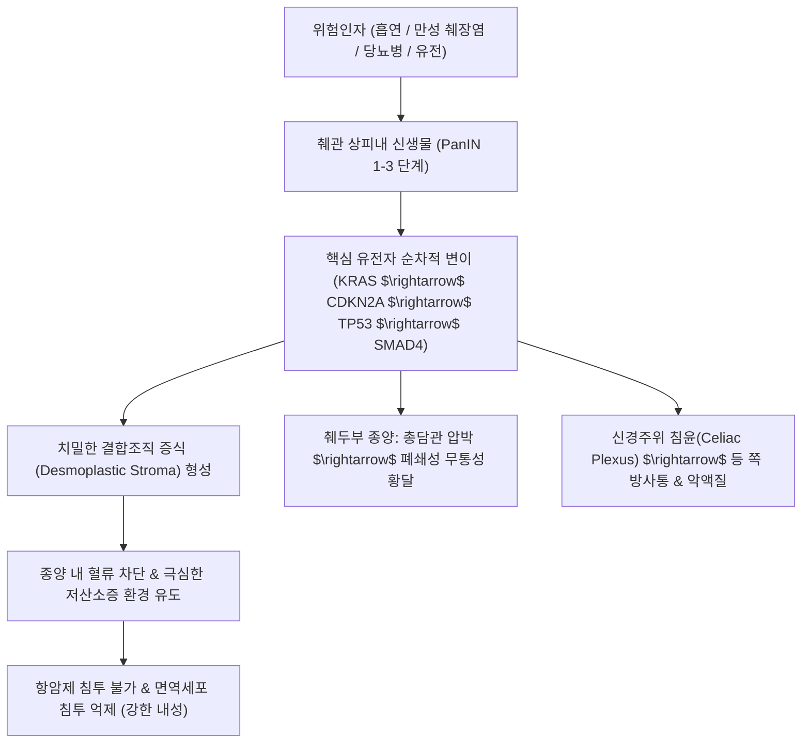

# 🩺 [[췌장암]] (Pancreatic Cancer / 膵臟癌, KCD C25)

> **핵심 3줄 요약 (Key Summary)**:
> - 📍 병소 부위 & 해부·병태생리: 췌장의 외분비 도관 상피에서 기원하는 **췌관 선암종(Pancreatic Ductal Adenocarcinoma, PDAC)**이 90% 이상을 차지하며, 췌두부(Head, 60~70%), 체부(Body), 미부(Tail)에 발생함.
> - 🚩 전형적 임상 양상 & 3대 징후: 상복부 및 등 쪽으로 방사되는 심한 통증, 폐쇄성 무통성 황달([[Courvoisier 징후]]), 급격한 체중 감소 및 새로 발병한 고령자 [[당뇨병]].
> - 🛠️ 핵심 감별 검사 & 한·양방 다각적 치료 전략: 복부 췌장 프로토콜 다선검출기 CT(MDCT), EUS-FNA(내시경 초음파 유도하 세침흡인), 혈청 종양표지자([[CA 19-9]]); 근치적 췌십이지장절제술(Whipple/PPPD), 전신 항암화학요법(FOLFIRINOX, Gemcitabine+Nab-paclitaxel) 및 청열이습·소간이기·활혈소적 한의 암 재활 요법.
> - ⚠️ 응급 의뢰 레드플래그 & 악화 요인: 급성 담관염(Charcot 3징후: 발열, 황달, 우상복부통), 급성 십이지장/위 폐색(분출성 구토), 암성 파종에 따른 악성 복수 및 급성 복강동맥/상장간막동맥 침윤성 극심한 난치성 통증.

---

## 📌 목차
1. [질환 개요 & 해부학적 병태생리](#1-질환-개요--해부학적-병태생리)
2. [병태생리 메커니즘 & 생체역학적 악순환 네트워크](#2-병태생리-메커니즘--생체역학적-악순환-네트워크)
3. [임상 증상 & 이학적 검사(Physical Exam) 알고리즘](#3-임상-증상--이학적-검사physical-exam-알고리즘)
4. [감별 진단 매트릭스 (Differential Diagnosis)](#4-감별-진단-매트릭스-differential-diagnosis)
5. [한의 통합 치료 프로토콜 (침·약침·추나·한약)](#5-한의-통합-치료-프로토콜-침약침추나한약)
6. [재활 운동 & 생활습관 티칭 가이드](#6-재활-운동--생활습관-티칭-가이드)
7. [💡 사용자 진료실 핵심 필기 & 임상 노하우 (Melt-In 잔여 심화 집약)](#7--사용자-진료실-핵심-필기--임상-노하우-melt-in-잔여-심화-집약)
8. [출처 및 학술 참고 문헌 (References)](#8-출처-및-학술-참고-문헌-references)

---

## 1. 질환 개요 & 해부학적 병태생리

![[췌장암_복부CT_조영증강_종괴소견.jpg|450]]
> [그림 1: ① 질환/병태생리 — 조영증강 복부 CT 상 췌장 두부의 저음영 악성 종괴 및 총담관(CBD) 확장 소견 (출처: Wikimedia Commons / Medical Radiology Collection)]

* **질환 정의 및 분류**:
  * [[췌장암]]은 후복막 장기인 췌장에 발생하는 악성 종양으로, 췌관 상피세포에서 기원하는 **췌관 선암종(Pancreatic Ductal Adenocarcinoma, PDAC)**이 전체의 90% 이상을 차지합니다.
  * 그 외 드물게 낭성 신생물 기원의 암종(IPMN, MCN 악성 전환), 췌장 신경내분비종양(PanNET), 선방세포암종(Acinar cell carcinoma) 등이 존재합니다.
* **역학 및 예후**:
  * 전 세계적으로 암 사망 원인 4~7위를 차지하며, 5년 상대 생존율이 약 12~15%에 불과하여 모든 악성 종양 중 가장 치명적인 예후를 보입니다.
  * 60~70대 고령, 남성에서 호발하며 흡연, 만성 췌장염, 오랜 기간 조절되지 않는 당뇨병, 비만, 가족성 췌장암 증후군(BRCA2, PALB2 변이 등)이 주요 위험 인자입니다.
* **관련 해부학적 구조물**:
  * **해부학적 위치 및 인접 장기**: 췌장은 제1~2요추 전방의 후복막강(Retroperitoneum) 깊숙이 위치하여 위, 십이지장, 공장, 담낭 및 총담관(CBD), 비장과 직접 맞닿아 있습니다.
  * **혈관 및 신경총 복합체**:
    * 췌두부와 구상돌기는 **상장간막동맥(SMA)** 및 **상장간막정맥(SMV)**, 문맥(Portal vein)을 둘러싸고 있어 종양 침윤 시 완전 절제가 불가능해지는 핵심 랜드마크입니다.
    * 췌장 배측에 위치한 **복강신경총(Celiac plexus)**과 상장간막신경총으로 종양이 침윤(신경주위 침윤, Perineural invasion)하면서 등 쪽으로 방사되는 극심한 난치성 암성 통증을 유발합니다.

---

## 2. 병태생리 메커니즘 & 생체역학적 악순환 네트워크

![[췌장암_췌관선암_FNA_세포학.jpg|450]]
> [그림 2: ② 관련 해부 병태 구조물 — 췌관 선암종(PDAC)의 내시경 초음파 유도하 세침흡인(EUS-FNA) 세포진 소견, 핵의 이형성과 응집된 악성 상피세포군 (출처: Wikimedia Commons / Medical Cytopathology)]

### 1) 4대 핵심 유전자 변이 연쇄 모델
1. **KRAS 돌연변이 (90~95%)**:
   - 췌관 상피내 신생물(PanIN-1)의 극초기 단계부터 코돈 12에서 활성화 변이가 발생하여 지속적인 세포 성장 신호를 방출.
2. **CDKN2A / p16 불활성화 (90%)**:
   - PanIN-2 단계에서 세포 주기 조절(G1-S 전이) 억제 기능을 상실.
3. **TP53 변이 (50~75%)**:
   - PanIN-3 및 침윤성 암종 단계에서 DNA 손상 감지 및 세포자멸사 유도 불능화.
4. **SMAD4 / DPC4 결실 (55%)**:
   - TGF-$\beta$ 억제 신호 상실 및 침윤성 전이 능력 획득.

### 2) 치밀한 섬유 증식성 종양미세환경 (Desmoplasia)
* 췌장암 조직의 80% 이상은 실제 암세포가 아니라 **암 연관 섬유아세포(CAF)**와 세포외기질(콜라겐, 히알루론산)로 이루어진 극도로 치밀한 결합조직입니다.
* 이 결합조직이 종양 내 간질압(Interstital fluid pressure)을 비정상적으로 높여 종양 혈관을 압착·폐쇄시킴으로써, 항암화학요법 약물이 암세포 내로 도달하지 못하게 차단하고 극심한 면역 회피를 유도합니다.

---

## 3. 임상 증상 & 이학적 검사(Physical Exam) 알고리즘

### 1) 발생 부위별 임상 증상 및 3대 징후
* **췌두부암 (Head, 60~70%)**:
  * **폐쇄성 황달(Obstructive Jaundice)**: 총담관 하부가 조기에 종양에 의해 압박·폐쇄되어 공막 및 피부 황달, 짙은 갈색 뇨, 회백색 변(Clay-colored stool), 피부 소양감이 나타남.
  * **쿠르부아지에 징후 ([[Courvoisier 징후]])**: 황달이 있으면서 담낭이 무통성으로 팽대되어 우상복부에서 매끄럽게 만져지는 소견(담석증에 의한 황달과 구별되는 췌두부암의 특징적 징후).
* **췌체·미부암 (Body & Tail, 30~40%)**:
  * 해부학적으로 담관과 떨어져 있어 황달이 늦게 나타나므로 조기 발견이 극히 어렵습니다.
  * 주소증은 **상복부 둔통 및 등 쪽으로 뚫고 나가는 듯한 방사통(Back pain)**입니다. 통증은 똑바로 누우면 심해지고, 상체를 앞으로 구부리면(무릎을 모으고 웅크린 자세) 다소 완화됩니다.
* **전신 증상**:
  * 식욕부진, 소화불량, 수개월 내 10kg 이상의 극심한 체중 감소(악액질).
  * 고령자에서 가족력 없이 갑자기 발생한 급성 **[[당뇨병]]** 또는 잘 조절되던 당뇨의 급격한 악화.
  * **이동성 혈전정맥염 ([[Trousseau 징후]])**: 종양 세포가 분비하는 응고 촉진 인자로 인해 사지의 표재성 정맥염이 이동하며 발생.

### 2) 필수 진단 검사 알고리즘
* **복부 췌장 프로토콜 CT (Pancreas-protocol MDCT)**: 췌장암 진단, 혈관(SMA, SMV, Celiac axis) 침범 여부 평가, 수술 가능성 판정의 최우선 표준 검사.
* **내시경 초음파(EUS) 및 세침흡인생검(FNA)**: CT에서 명확하지 않은 1~2cm 미만의 미세 병변 관찰 및 병리학적 확진을 위한 조직 생검.
* **자기공명담췌관조영술(MRCP/MRI)**: 담관 및 췌관의 주행, 확장, 폐쇄 부위(Double-duct sign: 총담관과 주췌관이 동반 확장되는 소견) 평가.
* **혈청 종양표지자 ([[CA 19-9]])**: 민감도 80%, 특이도 80~90%. 선별 검사보다는 병기 판정, 치료 반응 모니터링, 재발 예측에 핵심적.

---

## 4. 감별 진단 매트릭스 (Differential Diagnosis)

| 감별 질환 | 호발 병소 및 병태 기전 | 주소증 및 임상 양상 차이 | 감별 진단적 핵심 검사 소견 |
| :--- | :--- | :--- | :--- |
| **[[췌장암]] (Pancreatic Cancer)** | 췌관 상피 선암종, 후복막 침윤 | 무통성 황달, 체중 감소, 등으로 방사되는 심한 복통, 새발형 당뇨 | CT 상 저음영 종괴, 혈관 침윤, CA 19-9 현저 상승, EUS-FNA 양성 |
| **[[만성 췌장염]] (Chronic Pancreatitis)** | 만성 음주 등으로 인한 췌실질 섬유화 및 석회화 | 재발성 상복부 산통, 지방변, 췌외분비 부전 | CT 상 췌장 실질 석회화, 췌관 불규칙 확장 및 결석, 악성 종괴 음성 |
| **[[담관암]] (Cholangiocarcinoma)** | 간내/간외 담관 상피 악성 종양 | 초기부터 심한 진행성 황달, 우상복부 둔통, 체중 감소 | MRCP/ERCP 상 담관벽 비후 및 협착, 췌관 확장은 동반되지 않음 |
| **[[자가면역성 췌장염]] (AIP, Type 1)** | IgG4 연관 전신 섬유염증성 질환 | 황달, 경미한 복통, 췌장 종대(소시지 모양) | 혈청 IgG4 현저 상승, 스테로이드 투여 시 종괴 극적 소실 |
| **[[위암]] (Gastric Cancer)** | 위 점막 악성 종양 | 조기 포만감, 상복부 불쾌감, 흑색변, 빈혈 | 상부위장관 내시경 상 위벽 궤양 및 종괴, 조직생검 확진 |

---

## 5. 한의 통합 치료 프로토콜 (침·약침·추나·한약)

![[췌장암_청열해독_본초_포공영.jpg|400]]
> [그림 3: ③ 한의 치료/본초 — 청열해독(淸熱解毒) 및 이습소종(利濕消腫) 작용으로 담도·췌장의 염증과 종양미세환경을 개선하는 포공영(Taraxacum mongolicum)의 생약 건조 규격품 (출처: Wikimedia Commons / Medical Herb Specimen)]

### 1) 한의 변증 분형 및 방제 프로토콜
* **습열온결형 (濕熱蘊結型) - 황달 동반기**:
  * **증상**: 신면구황(온몸과 눈이 밝은 노란색을 띰), 우상복부 비만동통, 발열구갈, 구고, 오심구토, 뇨적, 대변비결 혹은 회백색변, 설홍 태황니, 맥 현활삭.
  * **치법**: 청열이습(淸熱利濕), 통부퇴황(通腑退黃), 소간해독(疏肝解毒).
  * **처방**: **인진호탕(茵蔯蒿湯)** 합 **대시호탕(大柴胡湯)** 가감.
  * **주요 본초**: [[인진호]], [[치자]], [[대황]], [[시호]], [[황금]], [[포공영]], [[금전초]], [[패장초]].
* **어혈저체형 (瘀血阻滯型) - 심한 배부 방사통**:
  * **증상**: 심와부 및 등 뒤를 찌르는 듯한 극심한 고정성 자통, 야간에 통증 격화, 상복부 복괴 촉지, 웅크린 자세 취함, 안면 암청, 설암자/어반, 맥 세삽.
  * **치법**: 활혈화어(活血化瘀), 연견산결(軟堅散結), 행기지통(行氣止痛).
  * **처방**: **격하축어탕(膈下逐瘀湯)** 가감.
  * **주요 본초**: [[단삼]], [[적작약]], [[도인]], [[홍화]], [[현호색]], [[오령지]], [[아출]], [[삼릉]].
* **간기울결형 (肝氣鬱結型) - 초기 소화장애 및 정서 억울**:
  * **증상**: 흉협부 창통, 잦은 한숨, 복부 팽만, 트림, 식욕부진, 정서 변화에 따른 통증 변동, 설담홍 태박백, 맥 현.
  * **치법**: 소간이기(疏肝理氣), 화위지통(和胃止痛).
  * **처방**: **시호소간산(柴胡疏肝散)** 가감.
  * **주요 본초**: [[시호]], [[백작약]], [[지각]], [[향부자]], [[천궁]], [[울금]].
* **비위허약 / 기혈양허형 (脾胃虛弱 / 氣血兩虛型) - 항암 후 악액질**:
  * **증상**: 극심한 권태감, 사지무력, 수척, 식후 복창, 설사, 자한, 설담 태백, 맥 세약.
  * **치법**: 건비익기(健脾益氣), 자음보신(滋陰補腎).
  * **처방**: **보중익기탕(補中益氣湯)** 또는 **향사육군자탕(香砂六君子湯)** 가감.
  * **주요 본초**: [[인삼]], [[백출]], [[복령]], [[황기]], [[산약]], [[사인]], [[목향]].

### 2) 침구 및 약침 치료 프로토콜
* **체침 및 복강신경총 이완 자침**:
  * **혈위 선혈**: [[중완]](CV12), [[하완]](CV10), [[양릉천]](GB34, 근회), [[족삼리]](ST36), [[간수]](BL18), [[담수]](BL19), [[비수]](BL20), [[위수]](BL21), [[태충]](LR3).
  * **배부 배수혈 자극**: 흉추 7번~요추 1번 높이의 화타협척혈(EX-B2) 및 비수, 위수에 2~100Hz 혼합파 전침을 인가하여 복강신경총의 교감신경 흥분을 진정시키고 암성 배부통 완화.
* **약침 요법**:
  * **산삼약침 / 건칠약침**: 종양 면역 활성화 및 면역 회피 억제를 위해 중완, 기해, 비수 부위에 1.0cc 분할 주입.
  * **황련해독탕 약침**: 담도계 염증 및 황달 완화를 위해 일월(GB24), 기문(LR14)에 시술.

---

## 6. 재활 운동 & 생활습관 티칭 가이드

* **체위 변경 및 흉요추 스트레칭**:
  * 후복막 신경총 압박으로 인한 통증 시 등을 바닥에 대고 눕는 자세는 통증을 유발하므로, **측와위(옆으로 눕기)에서 무릎을 굽힌 자세** 또는 **무릎을 꿇고 상체를 앞으로 숙인 고양이 자세(Child's pose)**를 취하면 복강 신경총 긴장이 완화됩니다.
* **외분비 및 내분비 부전 관리 영양 티칭**:
  * **췌장 효소 제제 복용**: 췌장 절제술(휘플 수술) 후에는 지방 흡수 장애로 인한 만성 설사 및 지방변이 발생하므로 매 식사마다 췌장 소화효소제(Pancreatin)를 정량 복용.
  * **혈당의 정밀 모니터링**: 췌장 실질 감소로 인슐린 및 글루카곤 분비가 불균형해져 극심한 저혈당-고혈당 변동이 생기므로 당지수가 낮은 복합 탄수화물 위주의 소량 다태 식단 유지.

---

## 7. 💡 사용자 진료실 핵심 필기 & 임상 노하우 (Melt-In 잔여 심화 집약)

> [!IMPORTANT]
> **🛡️ 원문 융합(Melt-In) 및 7번 섹션 작성 불변 규칙 (CRITICAL)**
> 기존 노트의 병리적 특징(췌관 선암종 90% 이상, 낭종성암, 신경내분비종양, 고령/흡연/당뇨/만성췌장염 원인, 복통/식욕부진/체중감소/황달 증상, 의안 분석의 습열증/어혈증/간기체, 위암 및 췌장염과의 유사성 감별 난이도, 습열 제거/소화 보조/어혈 및 간울 해소 본초 활용)은 상부 1~6번 섹션에 100% 융합되었습니다.
> 본 섹션에는 원장님의 임상 직관과 실전 진료실 노하우를 집약합니다.

* **상부 섹션에 미처 다 담지 못한 고유 원문 필기**:
  * **위암 및 췌장염과의 유사성과 감별의 모호성 극복**: 췌장암은 초기 증상이 상복부 불쾌감, 소화장애, 복통으로 위암이나 만성 췌장염과 극도로 흡사하여 임상에서 오진되거나 지연 진단되기 쉽습니다.
  * **부수적 증상(습열·소화불량·간울) 다스림의 진정한 임상적 가치**: 한의 치료는 단순히 암세포를 공격하는 것에 국한되지 않고, 담도 폐색으로 인한 습열(황달), 소화효소 결핍으로 인한 음식정체, 후복막 신경 압박에 따른 간울기체(극심한 통증)를 단계별로 해소하여 환자의 삶의 질과 항암 치료 순응도를 극대화하는 통합 암 치료의 중심축입니다.
* **진료실 실전 감별 & 치료 노하우**:
  * 1. **실전 문진 체크리스트**:
     - "통증이 명치뿐 아니라 등 뒤나 허리 쪽으로 뚫고 나가듯 아픕니까? 누우면 심해지고 웅크리면 편해집니까?"
     - "눈 흰자위나 피부가 노랗게 변하면서 온몸이 가렵고, 소변 색이 진한 갈색으로 변했습니까? (통증 없는 황달)"
     - "평소 당뇨가 없던 고령 환자인데 최근 몇 달 사이에 갑자기 혈당이 200~300mg/dL 이상으로 치솟았습니까?"
  * 2. **임상 손맛 및 치료 노하우**:
     - 암성 배부통 환자에게 배부 방광경의 비수(BL20), 위수(BL21) 및 화타협척혈을 취혈할 때, 늑간신경 주행을 따라 15~30도 사각으로 완만히 침을 자입하고 온통(溫通) 요법을 병행하면 굳어있던 흉요추 방척주근이 이완되며 즉각적인 진통 효과를 나타냄.
  * 3. **환자 티칭 스크립트**:
     - "췌장암은 진단 당시 수술이 가능한 환자가 15~20%에 불과합니다. 하지만 최근 선행 항암화학요법(FOLFIRINOX 등)과 한의 면역 치료를 병행하여 종양 크기를 줄인 후 성공적으로 수술을 받는 사례가 늘고 있으므로 절대 희망을 놓지 마시고 적극적으로 체력과 면역을 관리하셔야 합니다."

---

## 8. 출처 및 학술 참고 문헌 (References)

1. **대한췌장담도학회**. (2021). *췌장담도학 (제3판)*. 군자출판사.
2. **대한종양내과학회**. (2021). *임상종양학 (제3판)*. 군자출판사.
3. **Ryan, D. P., Hong, T. S., & Bardeesy, N.** (2014). Pancreatic adenocarcinoma. *The New England Journal of Medicine*, 371(11), 1039-1049. [PMID: 25207767]
4. **Mizrahi, J. D., Surana, R., Valle, J. W., & Shroff, R. T.** (2020). Pancreatic cancer. *The Lancet*, 395(10242), 2008-2020. [PMID: 32593527]
5. **Kleeff, J., Korc, M., Apte, M., et al.** (2016). Pancreatic cancer. *Nature Reviews Disease Primers*, 2, 16022. [PMID: 27158978]
6. **Cho, W. C.** (2010). Supportive cancer care with Chinese medicine. *Springer Science & Business Media*.