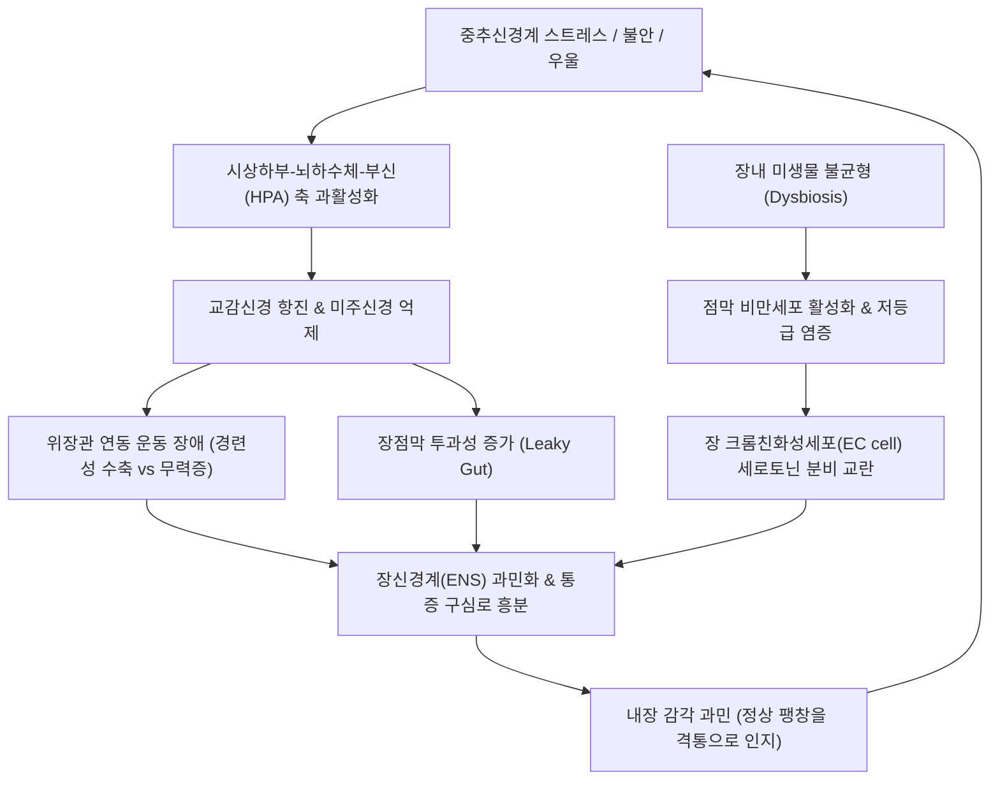
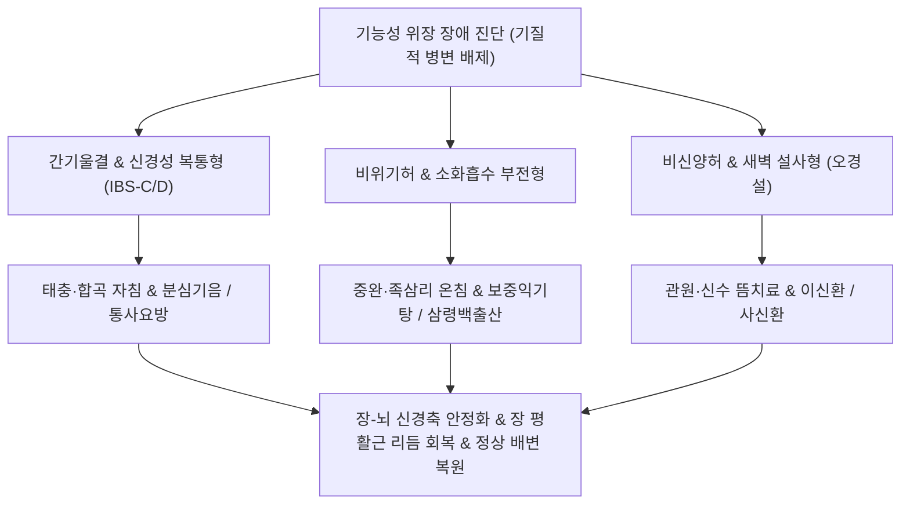

# 기능성 위장 장애 (Functional Gastrointestinal Disorders, FGID / 腸-腦 相互作用 障碍, DGBI)

> **상위 분류**: [[소화기 질환]] > [[상부위장관 질환]] / [[하부위장관 질환]]
> **핵심 3줄 요약 (Key Summary)**:
> - 📍 병소 부위 & 해부·병태생리: 식도부터 항문직장까지 위장관 전반에 걸쳐 생화학적·기질적 병변(염증, 궤양, 종양) 없이 발생하는 위장관 운동성 이상, 내장 과민성(Visceral hypersensitivity), 점막 면역 및 장내 미생물총(Microbiota) 교란, 그리고 중추신경계와 장신경계(ENS) 간의 양방향 상호작용 장애(Disorders of Gut-Brain Interaction, DGBI).
> - 🚩 전형적 임상 양상 & 3대 징후: 로마 기준 IV(Rome IV) 분류에 따른 1) 상부 장애: 조기 포만, 비심장성 흉통, 상복부 작열감 및 팽만감; 2) 하부 장애: 복통과 함께 배변 빈도·성상 이상([[과민성 장 증후군]], 설사, 변비).
> - 🛠️ 핵심 감별 검사 & 한·양방 다각적 치료 전략: 내시경·혈액·대변 칼프로텍틴 검사(염증성 장질환 및 악성 종양 배제), 뇌-장관 신경조절제 및 저FODMAP 식이 티칭, 중완(CV12)·천추(ST25)·족삼리(ST36)·태충(LR3) 자침 및 소염약침, [[분심기음]], [[반하사심탕]], [[곽향정기산]], [[통사요방]] 처방.
> - ⚠️ 응급 의뢰 레드플래그 & 악화 요인: 50세 이상 신규 발병, 배변 중 출혈(혈변/흑색변), 설명되지 않는 체중 감소, 야간 수면 중 복통 및 설사, 염증성 장질환(IBD) 및 대장암 가족력 확인 시 즉시 대장내시경 및 복부 CT 의뢰.

---

## 📌 목차
1. [질환 개요 & 해부학적 병태생리](#1-질환-개요--해부학적-병태생리)
2. [병태생리 메커니즘 & 생체역학적 악순환 네트워크](#2-병태생리-메커니즘--생체역학적-악순환-네트워크)
3. [임상 증상 & 이학적 검사(Physical Exam) 알고리즘](#3-임상-증상--이학적-검사physical-exam-알고리즘)
4. [감별 진단 매트릭스 (Differential Diagnosis)](#4-감별-진단-매트릭스-differential-diagnosis)
5. [한의 통합 치료 프로토콜 (침·약침·추나·한약)](#5-한의-통합-치료-프로토콜-침약침추나한약)
6. [양방 치료 & 병용·의뢰 기준 (Conventional Treatment & Referral)](#6-양방-치료--병용의뢰-기준-conventional-treatment--referral)
7. [재활 운동 & 생활습관 티칭 가이드](#6-재활-운동--생활습관-티칭-가이드)
8. [💡 사용자 진료실 핵심 필기 & 임상 노하우 (Melt-In 잔여 심화 집약)](#7--사용자-진료실-핵심-필기--임상-노하우-melt-in-잔여-심화-집약)
9. [출처 및 학술 참고 문헌 (References)](#8-출처-및-학술-참고-문헌-references)

---

## 1. 질환 개요 & 해부학적 병태생리

![[소화 생병리 및 위장약-20241107164830583.jpg|500]]
> [그림 1: ① 병태생리·내시경 — 기능성 위장관 장애(FGID/DGBI)의 장관 평활근 연동 불균형 및 생체역학적 병태도해] 기질적 궤양이나 종양 없이도 평활근 긴장도 이상과 자율신경 조절 부전으로 다발하는 위장관 기능 장애.

- **개념 정의 및 패러다임 전환**:
  - [[기능성 위장 장애]](Functional Gastrointestinal Disorders, FGID)는 내시경, 복부 초음파, CT, 혈액 검사 등 현존하는 의학적 진단 검사로 설명 가능한 구조적·기질성 병변이 없음에도 불구하고 만성적이고 반복적인 소화기 증상이 지속되는 임상 증후군이다.
  - 최신 로마 기준 IV(Rome IV)에서는 단순 '기능성(Functional)'이라는 모호한 개념을 탈피하여, 신경계와 장관계의 소통 이상을 반영한 **장-뇌 상호작용 장애(Disorders of Gut-Brain Interaction, DGBI)**로 공식 명칭을 개정하였다.
- **해부학적 범위 및 6대 대분류 (Rome IV)**:
  - A. 식도 장애 (기능성 흉통, 기능성 속쓰림 등)
  - B. 위십이지장 장애 ([[소화불량]], 트림 장애, 오심·구토 증후군 등)
  - C. 장 장애 ([[과민성 장 증후군]], 기능성 변비, 기능성 설사, 기능성 복부 팽만 등)
  - D. 중추 매개 복통 증후군 (CAPS)
  - E. 담낭 및 오디괄약근 장애 (담도 이상운동증)
  - F. 항문직장 장애 (기능성 대변실금, 항문직장통)

---

## 2. 병태생리 메커니즘 & 생체역학적 악순환 네트워크

![[청강의감13_010_아우어바흐_장신경총.gif|500]]
> [그림 2: ② 관련 해부 구조물 — 장관벽 근층 사이에 위치한 아우어바흐 근층간신경총(Auerbach's myenteric plexus)] 장관의 자율적 분절 운동과 연동 반사를 지휘하는 장신경계(ENS) 핵심 네트워크.

### 1) 뇌-장관 축(Brain-Gut Axis)의 양방향 소통 이상
- 위장관은 1억 개 이상의 신경세포로 이루어진 '제2의 뇌'인 장신경계(Enteric Nervous System, ENS)를 보유하며, 미주신경과 척수신경을 통해 중추신경계(CNS)와 실시간 양방향 정보를 교환한다.
- 심리적 스트레스나 우울은 중추에서 하행 통증 조절 경로를 차단하고 장운동을 교란시키며, 반대로 장내 세균총 이상이나 미세 염증은 미주신경 구심성 섬유를 통해 뇌로 부정적 정서 신호를 역송신한다.

### 2) 내장 감각 과민(Visceral Hypersensitivity)과 세로토닌(5-HT)
- 인체 세로토닌의 약 90% 이상이 위장관 점막의 크롬친화성(EC) 세포에서 합성·분비된다.
- DGBI 환자는 세로토닌 수용체(5-HT3, 5-HT4)의 발현 및 재흡수 이상으로 장관벽의 미세한 연동이나 가스 팽창에도 지각 역치가 극도로 낮아져 심한 쥐어짜는 복통과 팽만감을 호소한다.

---

## 3. 임상 증상 & 이학적 검사(Physical Exam) 알고리즘

### 1) 상부 vs 하부 위장관 기능 장애 증상 스펙트럼
1. **상부 위장관 기능 장애 (Upper GI Dysfunction)**:
   - 기능성 위장장애, 신경성 위염, 비궤양성 소화불량, 원인불명의 비심장성 흉통.
   - 주증상: 식후 조기 포만감, 더부룩함, 잦은 트림, 구역, 속쓰림, 명치 부위의 뻐근한 불쾌감.
2. **하부 위장관 기능 장애 (Lower GI Dysfunction - [[과민성 장 증후군]])**:
   - 신경성 설사, 경련성 장염, 점액성 결장염.
   - 주증상: 아랫배의 쥐어짜는 복통(배변 후 완화), 복부 팽만감, 헛배부름, 가스 배출 불량, 만성 설사와 변비의 교대.

### 2) 이학적 진찰 및 복부 촉진법
- **복진(腹診) 소견**:
  - 중완(CV12), 천추(ST25), 관원(CV4) 부위의 광범위한 압통과 장내 가스 탁음(Tympanitic resonance).
  - 좌하복부 S자 결장(Sigmoid colon) 부위의 팽창된 분변 덩어리 및 경련성 밧줄 모양 결결 촉진.
- **카르네트 징후(Carnett sign)**: 환자가 머리를 들어 복근을 수축한 상태에서 압통이 감소함을 확인(복벽 근막 통증 배제).

---

## 4. 감별 진단 매트릭스 (Differential Diagnosis)

| 질환명 | 주 침범 및 발병 기전 | 감별 핵심 징후 | 배제 필수 검사 |
| :--- | :--- | :--- | :--- |
| **[[기능성 위장 장애]] (DGBI)** | 전 장관, 장뇌축 및 운동성 장애 | 기질성 병변 없음, 스트레스 악화 | EGD, 대장내시경 정상 |
| **염증성 장질환 (IBD, 크론/UC)** | 점막 궤양, 자가면역성 만성 염증 | 혈변, 체중감소, 발열, 야간 설사 | 대변 Calprotectin 상승, 대장경 궤양 |
| **대장암 (Colorectal Cancer)** | 대장 상피 악성 종양, 내강 폐쇄 | 배변 습관 급변, 빈혈, 흑색변 | 대장내시경 조직 생검 |
| **복강 질환 (Celiac Disease)** | 글루텐 유발 자가면역 소장염 | 흡수장애, 만성 지방변 | 혈청 tTG-IgA 항체 양성 |
| **담도 이상운동증 (Sphincter of Oddi)** | 오디괄약근 기능부전 | 담낭 절제 후에도 지속되는 담도통 | 간기능 효소, 췌담도 MRCP |

---

## 5. 한의 통합 치료 프로토콜 (침·약침·추나·한약)

![[청강의감13_013_EC세포_5HT_세로토닌.gif|500]]
> [그림 3: ③ 치료·시술점 — 장 크롬친화성세포(EC cell)의 세로토닌(5-HT) 분비 조절 및 한의 침구 치료 작용점] 중완(CV12), 천추(ST25), 족삼리(ST36) 자침을 통한 미주신경-세로토닌 대사 정상화 경로.

한의학에서 기능성 위장 장애는 비만(痞滿), 복통(腹痛), 설사(泄瀉), 변비(便秘), 울증(鬱證), 간비불화(肝脾不和)의 범주에 속하며, 간기범위(肝氣犯胃), 비위기허(脾胃氣虛), 대장습열(大腸濕熱), 비신양허(脾腎陽虛)로 변증한다.

### 1) 침구 치료
- **사암침법 및 사관혈(四關穴)**:
  - 합곡(LI4), 태충(LR3): 사관혈로서 전신 기혈 순환을 소통시키고 자율신경계 긴장을 이완하여 장관 경련 즉각 해제.
- **복부 모혈 및 하합혈 배오**:
  - 중완(CV12), 천추(ST25): 상하부 위장관의 복모혈로서 장벽 신경총의 감각 과민을 감압.
  - 상거허(ST37), 하거허(ST39): 대장과 소장의 하합혈로서 장관 연동 반사 정상화.
  - 내관(PC6), 공손(SP4): 횡격막과 흉복부 기체를 열어주어 가스 팽만과 오심 진정.

### 2) 약침 요법
- **중성어혈약침 및 황련해독탕 약침**: 천추(ST25) 및 중완(CV12)에 0.3~0.5 cc 주입하여 장관벽의 미세 저등급 염증과 신경 감작(Sensitization) 해소.
- **오공 약침 또는 봉약침**: 난치성 경련성 복통 환자에게 미세 주입하여 장관 평활근의 과도한 수축 진경.

### 3) 한약물 요법
- **간비불화(肝脾不和) 및 스트레스성 복통·설사**: [[통사요방]](痛瀉要方) 또는 [[분심기음]](分心氣飲)을 처방하여 간기를 소통시키고 비토(脾土)를 보하여 설사 멎게 함.
- **상하부 복합 체기 및 팽만감**: [[반하사심탕]](半夏瀉心湯) 또는 [[곽향정기산]](藿香正氣散) 가미방으로 장내 습열과 담음을 배출.
- **만성 무기력 및 비위허약**: 삼령백출산(蔘苓白朮散) 또는 [[보중익기탕]](補中益氣湯)으로 장점막 상피 재생 및 흡수능 증대.
- **새벽 복통과 설사 (오경설)**: 사신환(四神丸)을 투여하여 하초의 양기를 북돋움.

---

## 6. 양방 치료 & 병용·의뢰 기준 (Conventional Treatment & Referral)

> 🎯 **이 섹션의 목적**: 환자가 **양방약을 이미 복용 중인 경우가 많다.** 한의원 1차 진료에서 양방 치료를 이해하고, 병용 가능·주의·금기를 판단하며, 언제 의뢰할지 결정한다.

* **약물 치료 (Medication)**:
  * 계열별 약물·용량·기간 — 국내 처방 관행 반영.
  * 작용 기전과 한의 치료와의 상호작용.
* **비약물 시술 (Procedures)**:
  * 주사·차단술·물리치료·보조기 등.
* **수술·시술 적응증 (Surgical Indication)**:
  * 언제 수술로 가는가 — 절대·상대 적응증, 수술 후 경과.
* **한의 병용 판단 (Combination Therapy)**:
  * 병용 가능 / 주의 / 금기. 복용 중 환자의 감량 타이밍·반동 현상.
* **양방·전문과 의뢰 기준 (Referral Criteria)**:
  * 응급 의뢰 트리거와 전문과 의뢰 기준(정형외과·신경외과·내과 등).

	(작성 필요)

---

## 7. 재활 운동 & 생활습관 티칭 가이드

- **저FODMAP(Low-FODMAP) 식이 요법**:
  - 발효성 올리고당, 이당류, 단당류 및 폴리올(FODMAP)은 소장에서 흡수되지 않고 대장 세균에 의해 급격히 발효되어 가스를 팽창시키므로, 고FODMAP 식품(마늘, 양파, 사과, 우유, 콩, 밀가루)을 4~6주간 엄격히 제한한 후 순차 재도입.
- **스트레스 완화 및 자율신경 훈련**:
  - 복식 호흡(4초 흡기, 6초 호기)을 하루 3회 10분씩 시행하여 미주신경 톤을 능동적으로 활성화.
- **수분 및 섬유소 섭취 조절**:
  - 가용성 섬유소(차전자피 등)를 충분한 미온수와 함께 섭취하여 대변 점도를 정상화.

---

## 8. 💡 사용자 진료실 핵심 필기 & 임상 노하우 (Melt-In 잔여 심화 집약)

### 1) 기능성 위장장애의 본태 및 2대 영역 분류 (원문 필기 정본)
- **개념 정의**:
  - "여러 검사법으로 기질성 병변이 발견되지 않는데도 소화기 계통의 증상을 나타내는 임상 증후군."
  - 원인불명의 흉통(비심장성 흉통), 비궤양성 소화불량, 담도이상운동증(오디괄약근 기능장애) 등이 광범위하게 포함된다.
- **2대 핵심 영역 분류 (원문 필기 100% 보존)**:
  1. **[[상부 위장관 기능 장애]]**:
     - 기능성 위장장애, 신경성 위장병, 신경성 위염, 비궤양성 소화불량증.
     - 주증상: 구역, 구토, 트림, 속쓰림, 식후 상복부 불쾌감, 공복 시 상복부 통증.
  2. **[[하부 위장관 기능 장애]]([[과민성 장 증후군]])**:
     - 신경성 설사, 경련성 장염, 점액성 장염, 소화불량증.
     - 주증상: 하복부 불쾌감, 동통, 복부 팽만감, 헛배부름, 우상복부 불쾌감, 복통, 변비, 설사.

### 2) 진료실 상담 시 안심 기법 (Reassurance Technique)
- DGBI 환자는 잦은 검사 상 '아무 이상 없다'는 말에 오히려 불신과 암공포증을 키운다.
  *"환자분, 엑스레이나 내시경은 '뼈나 점막의 모양'을 보는 것이지 '움직임과 감각'을 보지는 못합니다. 위장의 하드웨어(구조)는 깨끗하지만 소프트웨어(신경 조절과 움직임)에 과부하가 걸려 과민해진 상태이므로, 침과 한약으로 장-뇌 신경 소프트웨어를 조율하면 완치될 수 있습니다."*라고 설명하여 치료 순응도를 극대화한다.

---

## 9. 출처 및 학술 참고 문헌 (References)

1. Drossman DA (2016). Functional Gastrointestinal Disorders: History, Pathophysiology, Clinical Features and Rome IV. *Gastroenterology*, 150(6):1262-1279. [PMID: 27144617](https://pubmed.ncbi.nlm.nih.gov/27144617/)
   - [연구 요약]: 기능성 위장관 질환(FGID)에서 장-뇌 상호작용 장애(DGBI)로의 패러다임 전환, 로마 기준 IV의 다학제적 진단 체계 및 생물심리사회적 병태생리를 정립한 랜드마크 논문.
2. Black CJ, Drossman DA, Talley NJ et al. (2020). Functional gastrointestinal disorders: advances in understanding and management. *Lancet*, 396(10263):1664-1674. [PMID: 33049221](https://pubmed.ncbi.nlm.nih.gov/33049221/)
   - [연구 요약]: 기능성 위장관 장애의 분자생물학적 이해, 장내 세균총 교란, 장 투과성 증가, 신경조절 치료법 및 다각적 임상 관리 가이드라인을 제시한 란셋 종설.
3. Sperber AD, Bangdiwala SI, Drossman DA et al. (2021). Worldwide Prevalence and Burden of Functional Gastrointestinal Disorders, Results of Rome Foundation Global Study. *Gastroenterology*, 160(1):99-114.e3. [PMID: 32294476](https://pubmed.ncbi.nlm.nih.gov/32305521/)
   - [연구 요약]: 전 세계 33개국 73,000명 이상을 대상으로 조사한 DGBI의 글로벌 유병률(전체 성인의 40% 이상 이환)과 사회경제적 질병 부담을 보고한 대규모 역학 연구.

<!-- 보관 태그(1회용·링크오류, 필요시 복원): 뇌장관축 -->
