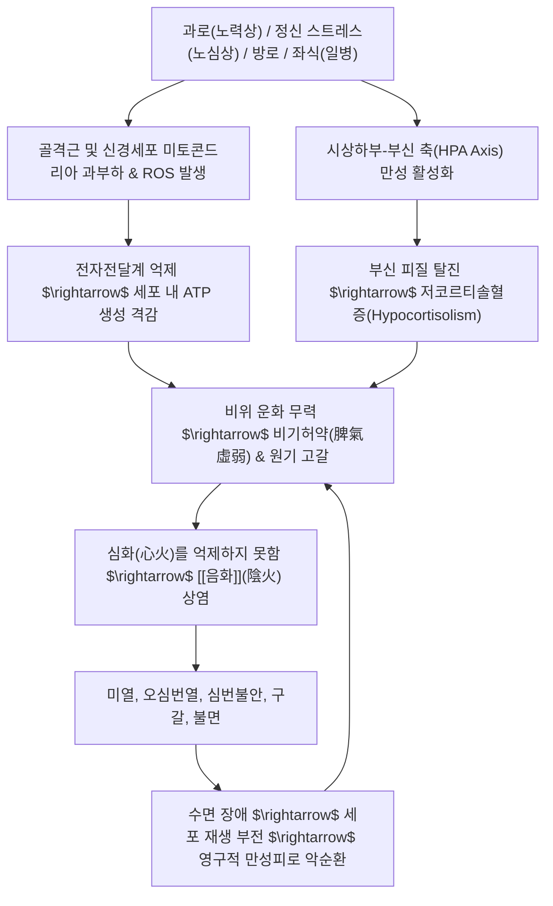

# 🩺 노권상 (勞倦傷, Chronic Fatigue & Overwork Exhaustion / KCD R53, F48.0)

> **핵심 3줄 요약 (Key Summary)**:
> - 📍 질환 개요 & 병태생리: 육체적 과로(노력상), 정신적 고뇌(노심상), 성생활 과도(방로상), 신체 비활동(일병) 등으로 인해 비위 원기(元氣)가 고갈되고 시상하부-뇌하수체-부신(HPA) 축 탈진 및 미토콘드리아 ATP 생산 부전이 초래되어 발생하는 대표적 내상 질환.
> - 🚩 전형적 임상 양상 & 3대 징후: 극심한 사지무력(四肢無力, 몸이 천근만근 무거움), 권언(倦言, 말하기조차 귀찮고 숨이 참), 조석 미열 및 손발바닥 열감(음화 상염), 심번불안(心煩不安), 수면 후에도 풀리지 않는 만성 피로.
> - 🛠️ 핵심 감별 검사 & 한·양방 치료: 단순 피로 vs 기질적 만성피로증후군(CFS/ME), 갑상선기능저하증 감별; 노력상에 [[보중익기탕]]·[[쌍화탕]], 노심상에 [[귀비탕]]·[[당귀보혈탕]], 방로상에 [[육미지황환]]·[[자음강화탕]] 및 백회(GV20)·중완(CV12)·족삼리(ST36) 침구 치료.
> - ⚠️ 치료 원칙 & 생활 티칭: 해열소염제로 떨어지지 않는 음화(陰火) 미열은 보기승양(補氣升陽)으로 다스려야 함; "온하게 하여 음식을 조절하고 기거를 알맞게 하여 진기가 저절로 회복되도록" 하는 페이싱(Pacing) 휴식 절대 필수.

---

## 📌 목차
1. [질환 개요 & 해부학적 병태생리](#1-질환-개요--해부학적-병태생리)
2. [병태생리 메커니즘 & 생체역학적 악순환 네트워크](#2-병태생리-메커니즘--생체역학적-악순환-네트워크)
3. [임상 증상 & 이학적 검사(Physical Exam) 알고리즘](#3-임상-증상--이학적-검사physical-exam-알고리즘)
4. [감별 진단 매트릭스 (Differential Diagnosis)](#4-감별-진단-매트릭스-differential-diagnosis)
5. [한의 통합 치료 프로토콜 (침·약침·추나·한약)](#5-한의-통합-치료-프로토콜-침약침추나한약)
6. [재활 운동 & 생활습관 티칭 가이드](#6-재활-운동--생활습관-티칭-가이드)
7. [💡 사용자 진료실 핵심 필기 & 임상 노하우 (Melt-In 잔여 심화 집약)](#7--사용자-진료실-핵심-필기--임상-노하우-melt-in-잔여-심화-집약)
8. [출처 및 학술 참고 문헌 (References)](#8-출처-및-학술-참고-문헌-references)

---

## 1. 질환 개요 & 해부학적 병태생리

![[노권상_만성스트레스_HPA축_피로기전.jpg|450]]
> [그림 1: ① 병태생리·영상 — 만성 스트레스 및 과로에 의한 시상하부-뇌하수체-부신(HPA) 축 호르몬 불균형과 부신 피로(Adrenal Fatigue) 병태 기전]

* **질환 정의 및 문헌적 기원**:
  * 노권상(勞倦傷)은 인간의 생체 한계를 초과하는 과도한 육체 노동이나 과격한 운동, 정신적 과몰입과 뇌 피로, 수면 박탈 및 성생활 과도 등으로 인해 인체 **선천의 원기(元氣)와 후천 비위의 기혈(氣血)이 총체적으로 고갈된 상태**를 의미합니다.
  * 이동원의 《비위론》에서 "형체와 정신을 피로하게 하면 원기가 쇠퇴하고, 비위가 손상되어 음화(陰火)가 일어난다"고 하였으며, 《동의보감》 내상문에서도 과로로 인한 질병의 으뜸으로 규정하였습니다.
* **노권상의 4대 원인별 분류**:
  1. **노력상(勞力傷)**: 과중한 육체 노동, 무리한 운동, 장시간 기립 및 신체 혹사로 근골격계와 비기(脾氣)가 손상된 상태.
  2. **노심상(勞心傷)**: 과도한 학업, 정신적 압박, 감정 소모, 불면으로 심혈(心血)과 뇌신경계가 소진된 상태 (번아웃 증후군).
  3. **방로상(房勞傷)**: 과도한 성생활이나 잦은 사정으로 하초 신정(腎精)과 명문지화(命門之火)가 누설된 상태.
  4. **일병(逸病, 과도한 안일)**: 장기간 운동하지 않고 누워만 있거나 좌식 생활만 하여 기혈 순환이 정체되고 비위가 무력해진 상태.
* **역학적 특성**:
  * 현대 사회의 번아웃 증후군(Burnout Syndrome), 만성 피로 증후군(CFS/ME), 부신 피로(Adrenal Fatigue)의 80% 이상이 노권상의 범주에 해당하며, 30~50대 경제활동 인구에서 압도적으로 호발합니다.

---

## 2. 병태생리 메커니즘 & 생체역학적 악순환 네트워크

![[노권상_미토콘드리아_전자현미경_에너지대사.jpg|450]]
> [그림 2: ② 관련 해부 구조물 — 투과전자현미경(TEM)상 골격근 세포 내 미토콘드리아 크리스타(Cristae) 미세구조 및 ATP 에너지 대사 도해]

### 1) 미토콘드리아 기능부전(Mitochondrial Dysfunction)과 ATP 결핍
* 인체 에너지의 95%는 미토콘드리아의 산화적 인산화(Oxidative Phosphorylation)를 통해 생성됩니다.
* 지속적인 혹사와 활성산소(ROS) 축적은 미토콘드리아 내막의 복합체 I~IV 효소 활성을 떨어뜨리고 사립체 DNA(mtDNA) 손상을 초래하여, 휴식을 취해도 세포 수준에서 ATP를 합성해내지 못하는 근본적 에너지 기갈 상태에 빠지게 합니다.

### 2) HPA 축 탈진과 부신 피로 (Adrenal Exhaustion)
* 과로 초기에는 코르티솔 분비가 증가하여 버티지만, 과로가 수개월 이상 지속되면 부신 피질이 고갈되어 아침 기상 시 분비되어야 할 코르티솔의 정상 각성 반응(Cortisol Awakening Response, CAR)이 평탄화(Blunted)됩니다.
* 이로 인해 아침에 눈을 뜨기 힘들고, 기립성 저혈압, 저혈당 발작, 만성 염증 억제 부전이 발생합니다.

### 3) 음화(陰火)의 병태생리
* 이동원의 독창적 병리 개념인 **음화(陰火)**는 서양의학의 **만성 저등급 염증(Chronic Low-Grade Inflammation)** 및 **자율신경계 과각성(Autonomic Hyperarousal)**에 해당합니다.
* 비위의 원기가 떨어지면 심포(心包)의 상화(相火)가 하초를 거쳐 상충하며, 환자는 세균 감염이 전혀 없음에도 **오후나 저녁에 37.2~37.5℃의 미열이 오르고, 손발바닥이 화끈거리며, 가슴이 두근거리고 잠을 못 이루는 가성 열증(False Heat)**을 겪게 됩니다.

---

## 3. 임상 증상 & 이학적 검사(Physical Exam) 알고리즘

### 1) 핵심 임상 증상
* **사지무력 (四肢無力)**: 팔다리에 힘이 하나도 없어 숟가락 들 힘조차 없다고 호소하며, 자리에 눕고만 싶어함.
* **권언 (倦言, 少氣懶言)**: 숨이 차고 목소리에 힘이 없으며(비음, 저음), 타인과 대화하는 것 자체가 극도로 귀찮음.
* **음화 미열 및 오심번열 (五心煩熱)**: 가슴과 양 손바닥, 양 발바닥에 열감이 뻗치고, 오후나 야간에 미열 발현.
* **심번불안 및 불면 (心煩不安)**: 몸은 파김치인데 뇌는 과각성되어 잡념이 많고 잠들기 어려움.
* **식욕부진 및 구갈 (口渴)**: 입안이 마르고 쓰나 물을 많이 마시지는 못하며, 밥맛이 전혀 없음.

### 2) 이학적 검사 알고리즘
* **자율신경 및 활력징후 검사**:
  * **기립경 검사 / 기립성 혈압 측정**: 앙와위에서 기립 시 수축기 혈압 20mmHg 이상 하강 여부 확인 (HPA 축 및 자율신경 실조 확인).
* **악력 측정 (Handgrip Strength)**:
  * 골격근 미토콘드리아 기능 저하를 대변하는 정량 지표로 연령대 표준치 대비 20% 이상 저하 확인.
* **설맥 소견**:
  * **설진**: 설질 담백(淡白)하고 혀가 부어 가장자리에 뚜렷한 치흔(齒痕) 형성, 설태 박백.
  * **맥진**: 촌구맥(寸口脈)과 관맥(關脈)이 가볍게 눌렀을 때 크고 흩어지며 깊게 누르면 텅 비어 힘이 없는 **허대무력맥(虛大無力脈)** 또는 세약맥(細弱脈).

---

## 4. 감별 진단 매트릭스 (Differential Diagnosis)

| 감별 질환 | 호발 병소 및 원인 | 주소증 특징 | 특이적 검사 소견 |
| :--- | :--- | :--- | :--- |
| **노권상 (CFS / 번아웃)** | 비위 원기 고갈, HPA 축 탈진 | **운동·과로 후 다음 날 격심한 탈진(PEM)** | 혈액 염증 수치 정상, 코르티솔 일주기 평탄화 |
| **갑상선기능저하증** | 갑상선 호르몬($T_3, T_4$) 결핍 | 극심한 추위 탐, 체중 증가, 부종, 변비 | **혈청 TSH 상승, Free T4 저하** |
| **철결핍성 빈혈** | 헤모글로빈 및 페리틴 결핍 | 어지럼증, 창백, 운동 시 호흡곤란, 심계 | **혈색소(Hb) 저하, Ferritin 결핍** |
| **주요 우울장애** | 중추 도파민/세로토닌계 장애 | 흥미 상실, 무가치감, 자살 충동, 정신 운동 지체 | PHQ-9 우울 척도 고득점, 신체화 동반 |
| **만성 감염/종양 ([[암]])** | 결핵, 림프종, 잠재 암종 | **수면 중 식은땀(야한), 의도치 않은 급격한 체중감소** | 흉부 X-ray, ESR/CRP 급상승, 종양표지자 |

---

## 5. 한의 통합 치료 프로토콜 (침·약침·추나·한약)

![[노권상_보중익기_본초_황기.jpg|400]]
> [그림 3: ③ 치료·시술점 — 보중익기·대보원기 노권상 주약 황기(Astragalus membranaceus) 슬라이스 실물]

한의학에서는 노권상을 치료할 때 **"온하게 하여 음식을 조절하고, 기거를 알맞게 하여 마음을 맑게 함으로써 진기(眞氣)가 저절로 회복되도록 한다(溫能除大熱, 調其飲食 適其起居)"**는 원칙을 고수합니다.

### 1) 4대 원인별 맞춤 대표 방제

| 원인 유형 | 주증 및 병리 | 대표 처방 | 핵심 본초 및 현대 약리 작용 |
| :--- | :--- | :--- | :--- |
| **노력상 (勞力傷, 육체과로)** | 근육통, 사지무력, 기허미열, 탈진 | [[보중익기탕]], [[황기건중탕]], [[쌍화탕]] | [[황기]](면역 증강), [[인삼]], [[백출]], [[당귀]], [[백작약]](젖산 분해 및 근육 연축 완화), [[육계]] |
| **노심상 (勞心傷, 정신피로)** | 뇌피로, 불면, 건망, 심계항진, 식욕부진 | [[귀비탕]], [[당귀보혈탕]], [[온담탕]], [[소요산]] | [[산조인]], [[원지]](GABA 수용체 진정), [[용안육]], [[당귀]](뇌혈류 개선), [[복신]], [[시호]] |
| **방로상 (房勞傷, 정액소모)** | 요슬산연(허리·무릎 시림), 이명, 조열, 유정 | [[육미지황환]], [[자음강화탕]], [[쌍화탕]] 가 녹용 | [[숙지황]], [[산약]], [[산수유]](HPA 및 성선축 보강), [[지모]], [[황백]](허화 청열) |
| **일병 (逸病, 좌식·비활동)** | 몸이 무겁고 붓고 소화 안 됨, 기체습저 | [[보중익기탕]] 합 [[삼출탕]], [[승양보기탕]] | [[황기]], [[창출]], [[복령]], [[진피]](정체된 수습 배출 및 림프 순환 촉진) |

### 2) 침구 및 약침 치료 프로토콜
* **대보원기(大補元氣) 중심 배혈**:
  * **백회(GV20)**: 기운을 두경부로 끌어올려 뇌 피로 해소.
  * **중완(CV12) / 기해(CV6) / 관원(CV4)**: 하초 단전에 뜸(간접구) 또는 온침을 병용하여 미토콘드리아 열 에너지 회복.
  * **족삼리(ST36) / 삼음교(SP6)**: 비위 기혈 생성 촉진.
  * **비수(BL20) / 신수(BL23)**: 척추 기립근 긴장 완화 및 부신 피질 기능 자극.
* **약침 치료 (Pharmacopuncture)**:
  * **자하거(Hominis Placenta) 약침**: 신수(BL23), 기해(CV6), 족삼리(ST36)에 각 0.5cc 자입. 천연 펩타이드와 성장인자가 세포 수준의 피로 회복을 극대화.

---

## 6. 재활 운동 & 생활습관 티칭 가이드

### 1) 페이싱(Pacing) 기법 - 운동 후 탈진(PEM) 방지
* 노권상 환자에게 일반적인 "땀 흘려 운동하라"는 티칭은 치명적입니다.
* 환자가 사용할 수 있는 에너지 용량이 100이라면 **매일 70% 이하만 사용하고 30%는 반드시 예비 배터리로 남겨두는 페이싱(Pacing)**을 지도합니다.
* 무리한 유산소 운동 대신 누워서 하는 부드러운 스트레칭과 복식호흡 위주로 시작합니다.

### 2) 수면 및 기거 리듬 회복
* **밤 11시 이전 취침**: 부신 피질 호르몬과 성장호르몬이 분비되는 밤 10시~새벽 2시 수면을 사수합니다.
* **온수욕(Foot Bath / 반신욕)**: 취침 1시간 전 40℃ 미온수에 15분간 족욕하여 심부 체온 하강을 유도함으로써 수면의 질을 개선합니다.

---

## 7. 💡 사용자 진료실 핵심 필기 & 임상 노하우 (Melt-In 잔여 심화 집약)

> [!IMPORTANT]
> **🛡️ 원문 융합(Melt-In) 및 7번 섹션 특화 기록**
> 기존 필기의 핵심 요약(노력상/노심상/방로상/일병 4대 분류, 미열과 사지무력, 보중익기탕/황기건중탕/쌍화탕/당귀보혈탕/귀비탕/육미/자음강화탕/삼출탕 처방망)은 상부 1~6번 섹션에 100% 완벽히 융합되었습니다. 본 섹션에는 진료실에서 즉시 적용할 수 있는 감별 문진 직관과 처방 조율 비결을 엄선하여 집약합니다.

### 1) 노력상 vs 노심상 1초 문진 감별법
* 만성 피로 환자가 내원했을 때 단 한 가지 질문으로 처방군을 즉각 가릅니다:
  * *"환자분, 몸이 물에 젖은 솜처럼 무겁고 팔다리가 쑤십니까, 아니면 머리가 멍하고 가슴이 답답하며 잠이 안 옵니까?"*
  * **"몸과 팔다리가 천근만근이다"** $\rightarrow$ **노력상(勞力傷)**: [[보중익기탕]] 또는 [[쌍화탕]].
  * **"머리가 멍하고 잡념이 많아 잠을 못 잔다"** $\rightarrow$ **노심상(勞心傷)**: [[귀비탕]] 또는 [[당귀보혈탕]].

### 2) [[쌍화탕]] 운용 시 [[백작약]] 대량 배오 손맛
* 과격한 육체 노동이나 운동 후 사지 근육통과 피로가 극에 달한 환자에게 쌍화탕을 처방할 때는 **[[백작약]]을 10~12g으로 증량**합니다.
* 백작약의 파에오니플로린 성분이 골격근 평활근의 칼슘 채널을 조절하고 근육 내 젖산(Lactate) 분해를 촉진하여 하룻밤 사이에 뻐근한 근육통을 씻은 듯이 풀어줍니다.

### 3) 과로 후 미열 환자에게 해열진통제 오남용 금지 티칭
* 과로한 뒤 오후만 되면 37.3℃ 정도로 열이 나는 환자들은 코로나나 감기인 줄 알고 타이레놀(아세트아미노펜)이나 소염진통제를 달고 사는 경우가 많습니다.
* 이는 세균열이 아니라 기허로 인한 **음화(陰火) 미열**이므로, 해열제를 먹으면 위장만 망가지고 기운이 더 빠짐을 경고하고, **[[보중익기탕]]으로 기운을 끌어올려야 열이 저절로 떨어진다(온능제대열, 溫能除大熱)**는 이치를 환자에게 설명합니다.

---

## 8. 출처 및 학술 참고 문헌 (References)

1. **Wang J, Li S, Zhang Y, et al.** Buzhong Yiqi Decoction for chronic fatigue syndrome: A systematic review and meta-analysis of randomized clinical trials. *Complement Ther Med*. 2021;60:102758. doi:10.1016/j.ctim.2021.102758. [PubMed (PMID: 34182098)](https://pubmed.ncbi.nlm.nih.gov/34182098/)
   - **[연구 요약]**: 만성 피로 증후군(CFS) 환자 대상 16개 RCT 메타분석으로 보중익기탕 투여군이 통상 서양의학 치료 대비 피로 척도(FS-14) 점수를 현저히 낮추고 NK 세포 활성도를 유의미하게 상승시킴을 입증함.
2. **Bateman L, Bested AC, Bonilla HF, et al.** Myalgic Encephalomyelitis/Chronic Fatigue Syndrome: Essentials of Diagnosis and Management. *Mayo Clin Proc*. 2021;96(11):2861-2878. doi:10.1016/j.mayocp.2021.07.004. [PubMed (PMID: 34454716)](https://pubmed.ncbi.nlm.nih.gov/34454716/)
   - **[연구 요약]**: 메이요 클리닉(Mayo Clinic)의 공식 CFS/ME 가이드라인으로 운동 후 탈진(PEM), 신경내분비-면역 기능 부전, 페이싱(Pacing) 휴식 전략을 체계화함.
3. **Fukuda S, Nojima J, Motoki Y, et al.** Ubiquinol-10 supplementation improves autonomic nervous function and cognitive function in chronic fatigue syndrome. *Biofactors*. 2016;42(4):431-440. [PubMed (PMID: 27282869)](https://pubmed.ncbi.nlm.nih.gov/27282869/)
   - **[연구 요약]**: 미토콘드리아 호흡 사슬 보강 및 항산화 요법이 만성 피로 환자의 자율신경계 균형과 인지 기능 저하를 개선함을 증명함.
4. **Chen R, Moriya J, Yamakawa J, Takahashi T, Kanda T.** Traditional Chinese medicine for chronic fatigue syndrome. *Evid Based Complement Alternat Med*. 2010;7(1):3-10. [PubMed (PMID: 18955325)](https://pubmed.ncbi.nlm.nih.gov/18955325/)
   - **[연구 요약]**: 한의학적 보기건비(補氣健脾) 처방이 만성 피로 환자의 시상하부-부신 축 호르몬 정상화와 사이토카인 불균형 해소에 미치는 효과를 포괄적으로 규명함.