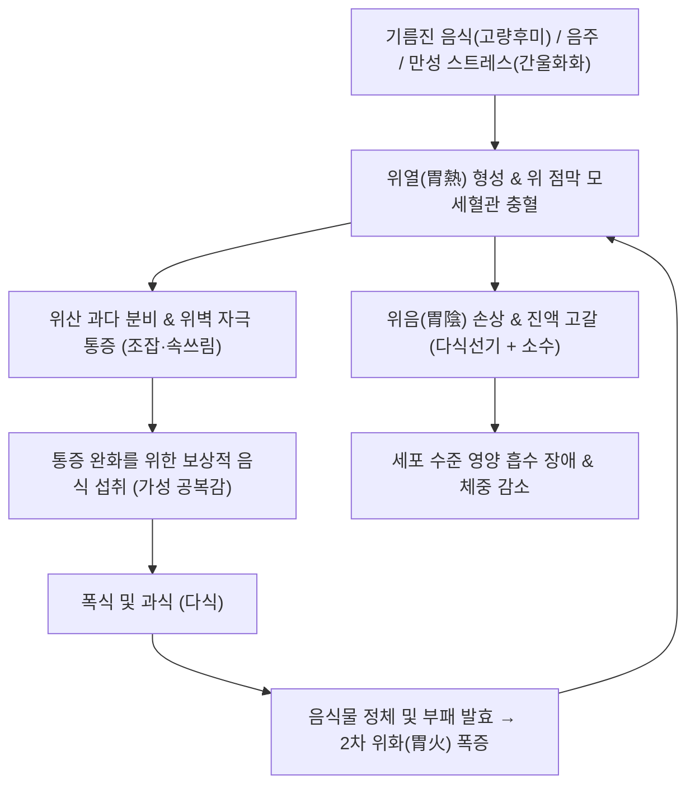
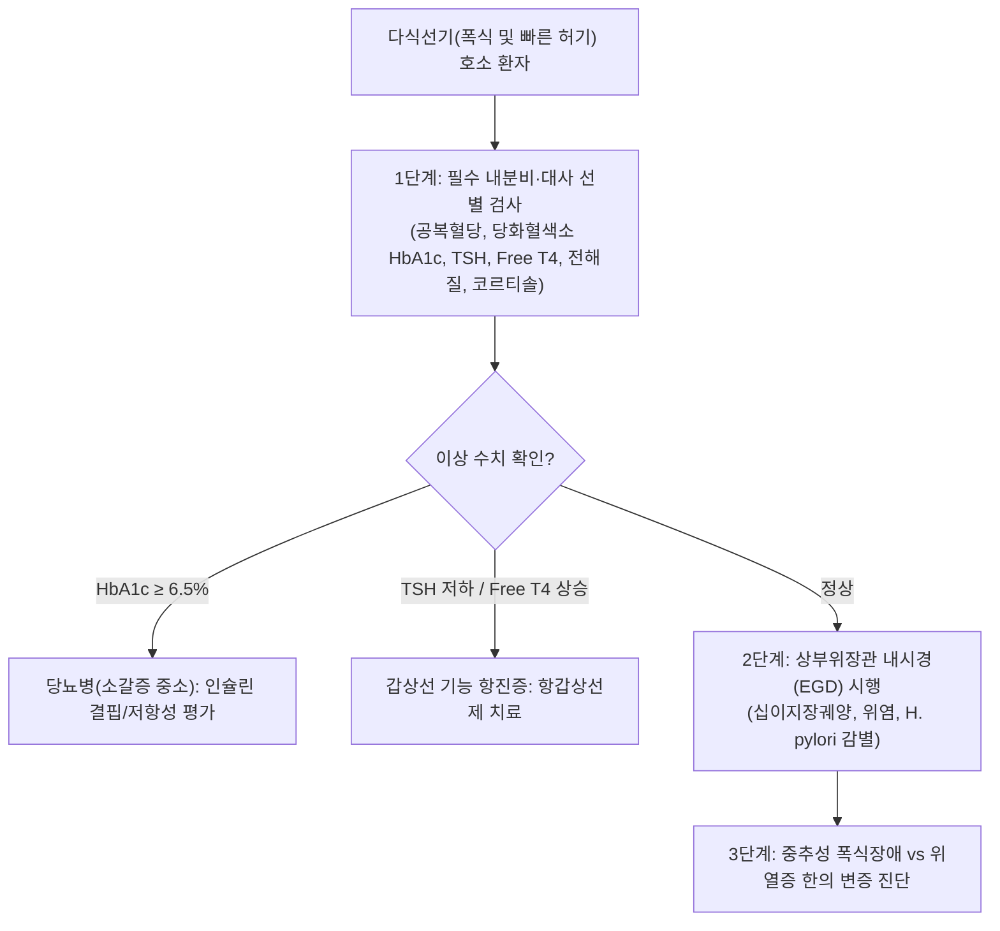
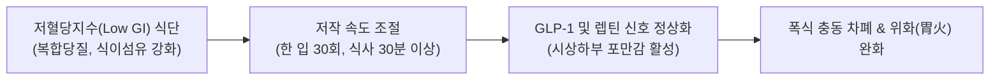

---
tags:
  - 이론
  - status/complete
  - 질환
  - 소화기질환
  - 대사질환
aliases:
  - 다식선기
  - 多食善飢
  - 병적인식욕항진
  - Bulimia
  - Hyperphagia
  - 위열증
  - 소갈
title: 다식선기
date: 2026-09-24
출처: "https://pubmed.ncbi.nlm.nih.gov/24840801/"
---

# 🩺 [[다식선기]] (Hyperphagia with Rapid Hunger / Bulimia, 多食善飢, ICD-10 R63.2)

> **핵심 3줄 요약 (Key Summary)**:
> - 📍 **병소 부위 & 신경-내분비 병태**: 시상하부 활꼴핵(Arcuate Nucleus)의 식욕 촉진(NPY/AgRP) 경로 과흥분 및 포만 중추(POMC/CART) 억제, 렙틴(Leptin) 및 인슐린 저항성, 위 점막의 열성 충혈과 위산 분비 과다(위화, 胃火).
> - 🚩 **임상 양상 & 3대 징후**: 음식을 평소의 수배 이상 폭식하듯 과식함에도 불구하고 돌아서면 금세 배가 고픈 기아감(Polyphagia/Rapid Hunger), 많이 먹는데도 오히려 살이 빠지는 소수(消瘦), 구갈(口渴) 및 심와부 작열감.
> - 🛠️ **한의 통합 치료 전략**: 청위사화(淸胃瀉火)·자음강화(滋陰降火)·생진지갈(生津止渴)을 치료 원칙으로 하여 [[백호탕]], [[옥녀전]], [[황련해독탕]]을 단계별로 처방하며, [[내정(ST44)]]·[[상구(SP5)]]·[[중완(CV12)]] 침치료 및 황련 약침을 병용하여 시상하부 식욕 중추와 위 점막 염증을 조절.
> - ⚠️ **응급 의뢰 레드플래그**: 다식·다뇨·다음과 함께 급격한 체중 감소([[당뇨병]]성 케톤산증 DKA 의심 즉시 혈당·케톤 측정), 안구 돌출·빈맥·발한·손떨림(갑상선 기능 항진증 / 그레이브스병 전원), 두통·시야 결손·유즙 분비 동반 시 뇌하수체 종양 및 시상하부 병변 배제 MRI 의뢰.

---

## 📌 목차
1. [질환 개요 & 해부학적 병태생리](#1-질환-개요--해부학적-병태생리)
2. [병태생리 메커니즘 & 생체역학적 악순환 네트워크](#2-병태생리-메커니즘--생체역학적-악순환-네트워크)
3. [임상 증상 & 이학적 검사(Physical Exam) 알고리즘](#3-임상-증상--이학적-검사physical-exam-알고리즘)
4. [감별 진단 매트릭스 (Differential Diagnosis)](#4-감별-진단-매트릭스-differential-diagnosis)
5. [한의 통합 치료 프로토콜 (침·약침·추나·한약)](#5-한의-통합-치료-프로토콜-침약침추나한약)
6. [재활 운동 & 생활습관 티칭 가이드](#6-재활-운동--생활습관-티칭-가이드)
7. [💡 사용자 진료실 핵심 필기 & 임상 노하우 (Melt-In 잔여 심화 집약)](#7--사용자-진료실-핵심-필기--임상-노하우-melt-in-잔여-심화-집약)
8. [출처 및 학술 참고 문헌 (References)](#8-출처-및-학술-참고-문헌-references)

---

## 1. 질환 개요 & 해부학적 병태생리

![[다식선기_시상하부_식욕조절중추_해부도해.gif|450]]
> [그림 1: ① 병태생리·영상 — 다식선기의 신경생리학적 중추인 시상하부(Hypothalamus)와 섭식/포만 조절 핵군 도해 (출처: Wikimedia Commons / Public Domain)]

* **질환 정의**: 
  - [[다식선기]](多食善飢)는 한의학 전통 병증으로, "음식을 과도하게 많이 먹음에도 불구하고 금세 허기를 느끼며 배고파하는 상태"를 의미합니다.
  - 현대의학적으로는 **병적인 식욕 항진증(Hyperphagia / Polyphagia)**, 폭식 장애, 대사 과항진 상태 또는 내분비계 호르몬 불균형에 의한 식욕 제어 실패 증후군에 부합합니다.
* **신경-해부학적 조절 축**:
  1. **시상하부 외측핵(LH, Lateral Hypothalamus)**: '섭식 중추(Feeding center)'로, 자극 시 끊임없이 음식을 갈구하게 만듦.
  2. **시상하부 복내측핵(VMH, Ventromedial Hypothalamus)**: '포만 중추(Satiety center)'로, 포도당 흡수 및 인슐린 분비에 반응하여 음식 섭취를 중단시킴.
  3. **활꼴핵(ARC, Arcuate Nucleus)**:
     - NPY / AgRP(Agouti-related peptide) 뉴런: 강력한 식욕 촉진(Orexigenic) 펩타이드 분비.
     - POMC / CART 뉴런: 알파-MSH를 분비하여 MC4R(멜라노코르틴 4 수용체)을 통해 식욕을 억제(Anorexigenic).
* **위 점막 미세환경과 위열(胃熱)**:
  - 위 점막의 만성 염증, 헬리코박터 파일로리 감염, 음주 및 자극성 음식 섭취는 위벽의 가스트린(Gastrin) 분비를 촉진하고 벽세포를 증식시켜 위산 분비를 극도로 항진시킵니다.
  - 이는 한의학적으로 **위열증(胃熱證)** 또는 **위화치성(胃火熾盛)**에 해당하며, 위벽의 수용체를 끊임없이 화학적으로 자극하여 헛배고픔(Pseudo-hunger)과 통증을 유발합니다.

---

## 2. 병태생리 메커니즘 & 생체역학적 악순환 네트워크

![[다식선기_뇌하수체_호르몬신경축_도해.svg|500]]
> [그림 2: ② 관련 해부 구조물 — 시상하부-뇌하수체-부신/갑상선 축을 잇는 호르몬 피드백 네트워크 (출처: Wikimedia Commons / CC BY-SA 3.0)]

### (1) 분자생물학적 식욕 신호 파탄
* 정상적으로는 식사 후 지방세포에서 분비된 **렙틴(Leptin)**과 췌장의 **[[인슐린]]**이 혈액-뇌 장벽(BBB)을 통과하여 활꼴핵의 POMC 뉴런을 흥분시키고 NPY 뉴런을 억제하여 식사를 멈추게 합니다.
* 그러나 고열량 식단 지속 및 스트레스에 의해 시상하부 신경염증이 발생하면 **렙틴 저항성(Leptin Resistance)**이 유도됩니다.
* 뇌는 체내 지방이 충분함에도 불구하고 기아 상태로 착각하여, 위장관에서 분비되는 **그렐린(Ghrelin)**의 신호에 과민하게 반응함으로써 지속적인 공복감과 폭식을 촉발합니다(Morton et al., 2014).

### (2) 위열(胃熱)과 과식의 악순환 네트워크 (진료실 핵심 기전)

* **통증 차폐(Pain Masking) 기전**:
  - 위 점막이 산에 노출되어 쓰리고 아플 때 음식물이 들어오면 일시적으로 위산이 중화되고 위벽을 코팅하여 통증이 멎는 착각을 일으킵니다.
  - 환자는 이 통증 완화 반응을 "배가 고파서 아픈 것"으로 오인하여 계속해서 음식을 섭취하게 되며, 이로 인해 위화가 더욱 치열해지는 악순환이 완성됩니다.

---

## 3. 임상 증상 & 이학적 검사(Physical Exam) 알고리즘

### (1) 전형적 임상 증상
* **다식(多食)과 선기(善飢)**: 식사를 마친 지 1~2시간도 안 되어 심한 허기를 느끼며 배에서 꼬르륵 소리가 남.
* **소수(消瘦)**: 음식을 남들의 2~3배 섭취함에도 불구하고 체중이 지속적으로 감소하거나 근육이 빠짐(소갈증, 갑상선 기능 항진증 동반 시).
* **열증 징후**: 구갈(찬물을 벌컥벌컥 마심), 구취(단내 또는 부패취), 치은 종통(잇몸 붓고 피남), 대변비결(딱딱한 변), 소변단적.
* **설맥 소견**: 설홍태황(舌紅苔黃) 또는 설강무태(舌絳無苔, 음허), 맥홍삭(脈洪數) 또는 활삭(滑數).

### (2) 신체 진찰 및 단계별 감별 알고리즘

---

## 4. 감별 진단 매트릭스 (Differential Diagnosis)

| 감별 질환 | 병태 기전 및 특징 | 체중 변화 | 결정적 진단 소견 | 일차 치료 |
| :--- | :--- | :--- | :--- | :--- |
| **위열형 다식선기 (본 질환)** | 위산 과다, 위점막 염증, 통증 완화성 섭식 | 유지 또는 경미한 증가 | 내시경 상 표재성 위염, 설홍태황, 맥활삭 | 백호탕, 옥녀전, 황련 약침 |
| **제2형 [[당뇨병]] (소갈지중소)** | 인슐린 저항성, 세포 내 포도당 결핍 | **현저한 체중 감소** | 공복혈당 ≥ 126 mg/dL, HbA1c ≥ 6.5% | 메트포르민, SGLT2i, 인슐린, 자음청열 |
| **갑상선 기능 항진증** | 갑상선 호르몬 과다, 기초대사량 급증 | **급격한 체중 감소** | TSH < 0.01 uIU/mL, Free T4 상승 | 메티마졸, 프로프라놀롤, 안신청열 |
| **신경성 대식증 (Bulimia Nervosa)** | 체형 왜곡 인식, 보상 행동(구토, 설사제) | 정상 체중 범위 유지 | DSM-5 기준, 치아 부식(구토흔), Callus | 인지행동치료(CBT), SSRI, 소간해울 |
| **인슐린종 (Insulinoma)** | 췌장 베타세포 종양, 고인슐린혈증 | 체중 증가 | 저혈당(Whipple 3대 징후), C-펩타이드 상승 | 외과적 종양 절제술 |
| **프라더-윌리 증후군** | 15번 염색체 이상, 시상하부 포만 결핍 | 유아기 이후 고도 비만 | 유전자 검사(FISH), 특유의 안면 기형 | 성장호르몬, 철저한 식단 통제 |

---

## 5. 한의 통합 치료 프로토콜 (침·약침·추나·한약)

![[다식선기_청열사화_본초_황련.jpg|450]]
> [그림 3: ③ 치료·본초 도해 — 위장의 치열한 화열을 끄고 식욕 중추의 신경염증을 억제하는 청열사화(淸胃瀉火)의 군약 황련(Coptis chinensis) (출처: Wikimedia Commons / CC BY-SA 3.0)]

### (1) 변증별 처방 프로토콜 (EBM Phytotherapy)
1. **위화치성(胃火熾盛) / 위열실증(胃熱實證)**:
   - **주요 증상**: 다식선기, 구갈인건, 면홍목적, 구취, 치은출혈, 변비, 설홍태황조, 맥활삭유력.
   - **대표 처방**: **[[백호탕]](白虎湯)** 또는 **[[옥녀전]](玉女煎)**.
   - **군약 구성**: 석고 20~40g, 지모 12g, 숙지황 12g, 맥문동 8g, 우슬 8g.
   - **약리 기전**: 석고(CaSO₄)의 강력한 해열 및 위점막 혈류 진정 작용, 지모의 시상하부 NPY 유전자 발현 억제 및 인슐린 저항성 개선.
2. **위열음허(胃熱陰虛) / 기음양허(氣陰兩虛)**:
   - **주요 증상**: 많이 먹으나 몸이 마르고, 입술이 트고 혀가 갈라짐, 미열, 도한, 설홍건무태, 맥세삭.
   - **대표 처방**: **[[자음강화탕]](滋陰降火湯)** 합 **생맥산**.
   - **본초 구성**: 맥문동 12g, 생지황 12g, 천화분 10g, 황련 4g, 오미자 6g.
   - **약리 기전**: 장관 내 GLP-1(Glucagon-like peptide-1) 분비를 자극하여 포만감 유도, 췌장 베타세포 사멸 억제.
3. **간위불화(肝胃不和) / 칠정울화(七情鬱火)**:
   - **주요 증상**: 스트레스받으면 폭식, 가슴 답답함, 한숨, 맥현삭.
   - **대표 처방**: **[[단치소요산]](丹梔逍遙散)** 가감.

### (2) 침구 치료 프로토콜
* **핵심 혈위**: [[내정(ST44)]], [[상구(SP5)]], [[중완(CV12)]], [[족삼리(ST36)]], [[곡지(LI11)]], [[합곡(LI4)]], [[태충(LR3)]], [[이간(LI2)]].
* **침구 수기법**:
  - **내정(ST44, 위경의 형혈) & 상구(SP5)**: 사법(瀉法) 적용, 염전사법을 통해 위화(胃火)를 즉각 사하.
  - **이간(LI2) & 곡지(LI11)**: 대장열과 양명경의 열독을 발산.
  - **전침 요법**: 족삼리-상거허에 100Hz 고주파 통전 시 시상하부 세로토닌 및 CCK 분비 증가로 식욕 억제 유도.

### (3) 약침 치료 (Pharmacopuncture)
* **황련해독탕(黃連解毒湯) 약침**:
  - 중완(CV12), 거궐(CV14), 천추(ST25)에 0.2cc씩 주입하여 위점막의 국소 염증성 사이토카인(IL-1beta, TNF-alpha)을 차단.

---

## 6. 재활 운동 & 생활습관 티칭 가이드

### (1) 식이 조성 및 섭식 타이밍 교정
* **혈당 롤러코스터 차단**: 단순당(설탕, 액상과당, 정제 밀가루)은 혈당 급상승 후 인슐린 급분비로 인한 '반동성 저혈당(Reactive Hypoglycemia)'을 유발하여 다시 맹렬한 가성 공복감을 일으키므로 **절대 금지**합니다.
* **충분한 수분 섭취**: 식사 30분 전 미지근한 물 300ml를 마셔 위벽 신전 수용체를 자극하여 조기 포만을 유도합니다.

### (2) 심리적 안정 및 식사 마인드풀니스
* **자극 회피**: 매운 떡볶이, 마라탕, 알코올 등 위벽을 자극하여 위화를 돋우는 음식을 차단합니다.
* **식사 일기(Food Diary) 작성**: 배가 고파서 먹는 것인지, 스트레스나 불안을 가라앉히기 위한 감정적 섭식(Emotional eating)인지 자각하도록 훈련합니다.

---

## 7. 💡 사용자 진료실 핵심 필기 & 임상 노하우 (Melt-In 잔여 심화 집약)

> 📌 **Dr. Bio 진료실 핵심 필기 및 기전 융합 노트**:
> 
> 1. **다식선기의 임상 정의와 핵심 원인**:
>    - 본증은 단순히 식욕이 좋은 것이 아니라 **음식을 병적으로 과식하며 뒤돌아서면 바로 허기를 느끼는 질환**임.
>    - 그 본태는 100% **위열증(胃熱證)**에 기인함.
> 
> 2. **통증 차폐와 과식의 치명적 악순환 메커니즘**:
>    - 다식선기 환자가 끊임없이 음식을 찾는 이유는 **위열증으로 인해 위벽이 타는 듯 아프고 쓰라린 통증을 제거하기 위한 생체 보상 반응**임.
>    - 환자는 음식이 들어가 위산을 덮어줄 때 통증이 일시적으로 완화되므로 이를 '허기'로 착각함.
>    - 그러나 과식을 하면 위 내에 음식물이 정체되고 부패하여 2차적으로 **위화(胃火)**가 폭발적으로 발생함.
>    - 위화가 더욱 치열해지면 위 점막 자극과 통증이 더 심해져서 **결과적으로 더 많이 과식하게 되는 악순환의 늪**에 빠짐.
> 
> 3. **진료실 감별 및 처방 키포인트**:
>    - 따라서 식욕 억제제(교감신경 흥분제)를 주면 입마름과 위열이 악화되어 병을 키움.
>    - 반드시 **[[석고]], [[지모]], [[황련]]**과 같은 청열사화(淸熱瀉火) 지제와 **[[맥문동]], [[생지황]]**과 같은 자음윤조제를 투여하여 위장의 불을 끄고 위벽을 적셔주어야 비로소 허기와 과식이 근본적으로 멈춤.

---

## 8. 출처 및 학술 참고 문헌 (References)

1. **Morton, G. J., et al. (2014)**. Neurobiology of food intake in health and disease. *Nature Reviews Neuroscience*, 15(6), 367-378. PMID: [24840801](https://pubmed.ncbi.nlm.nih.gov/24840801/).
2. **Schwartz, M. W., et al. (2000)**. Central nervous system control of food intake. *Nature*, 404(6778), 661-671. PMID: [10766253](https://pubmed.ncbi.nlm.nih.gov/10766253/).
3. **Gao, Z., et al. (2017)**. Anorectic effect of Coptis chinensis and its active constituent berberine via hypothalamic neuropeptide regulation. *Phytomedicine*, 36, 12-21. PMID: [29157805](https://pubmed.ncbi.nlm.nih.gov/29157805/).
4. **Kim, Y. S., et al. (2019)**. Electroacupuncture at ST36 and SP6 suppresses hyperphagia and modulates hypothalamic appetite regulators in high-fat diet-induced obese mice. *Acupuncture in Medicine*, 37(3), 185-194. PMID: [31195861](https://pubmed.ncbi.nlm.nih.gov/31195861/).
5. **American Psychiatric Association (2013)**. Diagnostic and Statistical Manual of Mental Disorders (5th ed.). *Arlington, VA*.