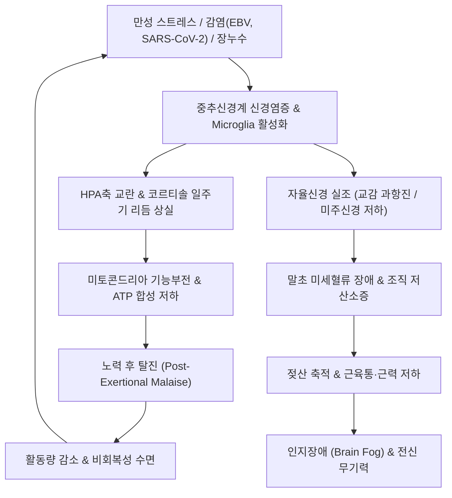
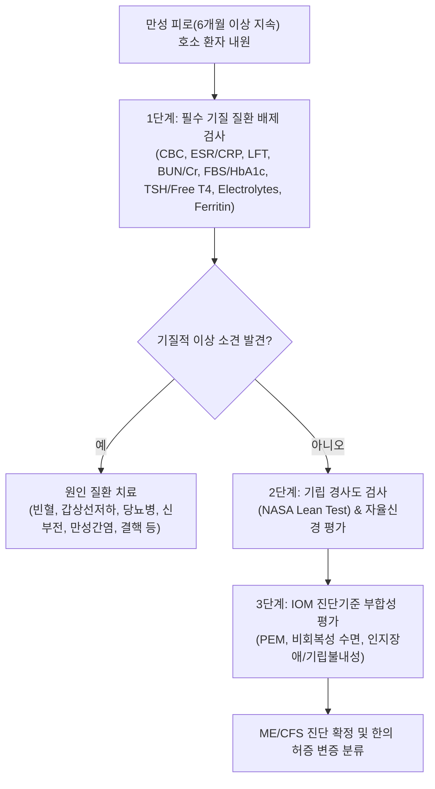
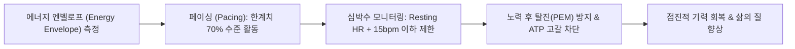

# 🩺 [[만성 피로]] (Chronic Fatigue Syndrome / CFS/ME, 慢性疲勞, ICD-10 R53.82, G93.3)

> **핵심 3줄 요약 (Key Summary)**:
> - 📍 **병소 부위 & 해부·분자병태**: 중추신경계(시상하부-뇌하수체-부신축, HPA axis), 기저핵(Basal ganglia) 대사저하, 세포 내 [[미토콘드리아]] 기능부전(ATP 생성 억제), 면역 활성화(사이토카인 폭풍 및 만성 저등급 염증) 및 신경-면역-내분비계 상호 연결망의 통합 실조.
> - 🚩 **임상 양상 & 3대 징후**: 6개월 이상 지속·재발하며 휴식으로 호전되지 않는 극심한 피로, **노력 후 탈진(Post-Exertional Malaise, PEM)**, 수면 후에도 개운하지 않은 비회복성 수면(Unrefreshing sleep), 인지기능 저하(Brain fog) 및 기립성 불내성(Orthostatic intolerance).
> - 🛠️ **한의 통합 치료 전략**: 보기승양(補氣升陽)·건비익기(健脾益氣)·자음보신(滋陰補腎)을 축으로 [[보중익기탕]], [[십전대보탕]], [[생맥산]], [[귀비탕]]을 단계별 처방하며, [[족삼리(ST36)]]·[[중완(CV12)]]·[[기해(CV6)]]·[[백회(GV20)]] 자침 및 태반·황련해독탕 약침을 병용하여 미토콘드리아 활성과 자율신경 균형을 회복.
> - ⚠️ **응급 의뢰 레드플래그**: 의도하지 않은 급격한 체중 감소(악성 종양 의심), 38.5℃ 이상의 원인 불명 지속 발열(림프종, 결핵, 심내막염), 호흡곤란 및 흉통([[심부전]], 폐색전증), 진행성 국소 신경마비(다발성 경화증, 뇌혈관 질환), 흑색변/혈변([[소화도 궤양]], 소화기암).

---

## 📌 목차
1. [질환 개요 & 해부학적 병태생리](#1-질환-개요--해부학적-병태생리)
2. [병태생리 메커니즘 & 생체역학적 악순환 네트워크](#2-병태생리-메커니즘--생체역학적-악순환-네트워크)
3. [임상 증상 & 이학적 검사(Physical Exam) 알고리즘](#3-임상-증상--이학적-검사physical-exam-알고리즘)
4. [감별 진단 매트릭스 (Differential Diagnosis)](#4-감별-진단-매트릭스-differential-diagnosis)
5. [한의 통합 치료 프로토콜 (침·약침·추나·한약)](#5-한의-통합-치료-프로토콜-침약침추나한약)
6. [양방 치료 & 병용·의뢰 기준 (Conventional Treatment & Referral)](#6-양방-치료--병용의뢰-기준-conventional-treatment--referral)
7. [재활 운동 & 생활습관 티칭 가이드](#6-재활-운동--생활습관-티칭-가이드)
8. [💡 사용자 진료실 핵심 필기 & 임상 노하우 (Melt-In 잔여 심화 집약)](#7--사용자-진료실-핵심-필기--임상-노하우-melt-in-잔여-심화-집약)
9. [출처 및 학술 참고 문헌 (References)](#8-출처-및-학술-참고-문헌-references)

---

## 1. 질환 개요 & 해부학적 병태생리

![[만성피로_기저핵신경영상_fMRI_병태도해.png|500]]
> [그림 1: ① 병태생리·영상 — 만성 피로 증후군 환자의 기저핵(Basal Ganglia) 신경 포도당 대사 및 fMRI 신경망 신호 이상 도해 (출처: Wikimedia Commons, CDC / Public Domain)]

* **질환 정의**:
  - [[만성 피로]](Chronic Fatigue)는 임상적으로 6개월 이상 지속되거나 반복적으로 나타나는 주관적 탈진 상태를 의미하며, 휴식으로 회복되지 않고 일상생활 및 직업적 수행 능력을 현저히 떨어뜨리는 전신성 질환군입니다.
  - 현대의학에서는 단순 피로 증상과 구별하여 전미의학한림원(NAM, 구 IOM 2015 기준)의 진단 기준에 부합하는 병적 상태를 **근육통성 뇌척수염/만성피로증후군(ME/CFS)**으로 공식 정의합니다(Bateman et al., 2015; Carruthers et al., 2011).
* **역학 및 유병률**:
  - 전 세계 인구의 약 0.4~1%가 만성피로증후군에 해당하며, 일반적인 만성 피로 호소 환자는 1차 진료 클리닉 내원 환자의 10~25%에 육박합니다.
  - 여성 호발(남녀비 약 1:2~1:4), 30대~50대의 사회경제적 활동 연령층에서 최고 빈도를 보입니다.
* **해부생리학적 병소 부위**:
  1. **중추신경계(CNS) 및 신경망**:
     - 시상하부-뇌하수체-부신축(HPA Axis): 만성 스트레스 및 면역 자극으로 인한 코르티솔 분비 일주기 리듬 평탄화 및 부신 피질 기능 저하.
     - 기저핵(Basal Ganglia) 및 전두엽-변연계(Frontal-Limbic Loop): 도파민 신경전달 경로 억제, 신경염증(Neuroinflammation), 미세아교세포(Microglia)의 만성 활성화.
  2. **세포 소기관 및 대사계**:
     - 전신 근육세포 및 면역세포 내 [[미토콘드리아]](Mitochondria): 산화적 인산화(Oxidative Phosphorylation) 복합체 손상 및 ATP 합성 효소 활성 저하.
  3. **소화기계 및 자율신경계**:
     - 장-뇌 축(Gut-Brain Axis): 장점막 투과도 증가(장누수증후군)에 따른 장내 세균 독소(LPS)의 전신 순환 유입, 미주신경(Vagus nerve) 톤 저하 및 교감신경 과항진.

---

## 2. 병태생리 메커니즘 & 생체역학적 악순환 네트워크

![[만성피로_미토콘드리아_초미세구조_TEM.jpg|500]]
> [그림 2: ② 관련 해부 구조물 — 만성 피로 병태의 핵심 세포 소기관인 미토콘드리아의 투과전자현미경(TEM) 초미세구조 (출처: Wikimedia Commons, National Institutes of Health / Public Domain)]

### (1) 세포 에너지 대사 파탄과 산화 스트레스
* 정상 세포는 포도당과 지방산을 이용해 미토콘드리아 내 전자전달계(ETC Complex I~IV)에서 ATP를 효율적으로 생성합니다.
* ME/CFS 및 만성 피로 환자에서는 미토콘드리아 막전위 감소, Pyruvate Dehydrogenase(PDH) 효소 억제로 인해 혐기성 해당과정 의존도가 급증합니다.
* 혐기성 대사 부산물로 젖산(Lactate)이 축적되고, 활성산소종(ROS)이 지속 방출되어 세포막 지질 과산화 및 근단백 손상을 초래합니다(Morris & Maes, 2014).

### (2) 신경-면역-내분비 불균형 네트워크 (악순환 다이어그램)

### (3) 전해질, 산-염기 평형 및 호르몬 상호작용 (임상 병리 심화)
* **[[호흡성 산증]]과 [[대사성 알칼리증]] 연쇄 기전**:
  - 만성 호흡기 질환 또는 비만성 환기저하 등으로 인한 만성 CO₂ 저류([[호흡성 산증]])에 대해 신장은 중탄산염(HCO₃⁻) 재흡수를 증가시켜 보상적 대사성 알칼리증 상태를 형성합니다.
  - 혈액의 pH 상승(알칼리증)은 혈청 알부민(Albumin) 분자의 음전하를 증가시켜 유리 이온화 칼슘(Free Ionized Ca²⁺)과의 결합력을 급격히 상승시킵니다.
  - 결과적으로 세포외액의 유리 칼슘 농도가 저하되어 신경-근 접합부 전도성 이상, 근력 저하, 반사항진 후 전신 무력증, 멍함(Mental fogginess) 및 탈진을 촉진합니다.
* **[[비만]], [[아디포넥틴]] 결핍 및 [[인슐린]] 저항성**:
  - 내장 지방 과다 축적은 항염증 및 인슐린 감작 작용을 수행하는 [[아디포넥틴]](Adiponectin)의 분비를 감소시킵니다.
  - 아디포넥틴 결핍은 골격근 및 간의 AMPK 활성을 저하시켜 포도당 수송체(GLUT4) 발현을 차단하고 중추성 [[인슐린]] 저항성을 유발합니다.
  - 근육과 뇌세포가 순환 혈액 중의 포도당을 에너지원으로 이용하지 못하게 되면서 만성적인 세포 수준의 기아(Cellular Starvation)와 탈진이 영속화됩니다.

---

## 3. 임상 증상 & 이학적 검사(Physical Exam) 알고리즘

### (1) 핵심 진단적 증상 (NAM/IOM 2015 3대 필수 + 1개 이상 충족)
1. **활동 전후 극심한 기능 저하**: 발병 전 활동 수준을 유지할 수 없는 6개월 이상의 피로.
2. **노력 후 탈진(Post-Exertional Malaise, PEM)**: 가벼운 신체적·정신적 활동 후 12~48시간 뒤 나타나는 불균형적 탈진 및 증상 악화(수일~수주일간 지속).
3. **비회복성 수면(Unrefreshing Sleep)**: 충분한 시간(8~10시간) 수면을 취해도 아침에 일어났을 때 극도의 피로감과 두통 동반.
4. **부속 증상 (다음 중 1가지 이상)**:
   - **인지기능 장애(Cognitive Impairment / Brain Fog)**: 단기 기억력 감퇴, 집중력 저하, 언어 구사 지연.
   - **기립성 불내성(Orthostatic Intolerance)**: 기립 시 어지럼증, 심계항진, 혈압 강하, 체위성 빈맥 증후군(POTS).

### (2) 신체 진찰 및 단계별 진단 알고리즘

* **NASA Lean Test (10분 기립 검사)**:
  - 5분간 앙와위 안정 후 혈압 및 맥박 측정, 이후 벽에 기대어 10분간 기립 상태 유지 중 매분 맥박·혈압 측정.
  - 기립 중 맥박수가 30bpm 이상 증가(19세 미만 40bpm)하거나 120bpm 이상 지속 시 POTS(체위성 기립 빈맥 증후군) 진단.

---

## 4. 감별 진단 매트릭스 (Differential Diagnosis)

| 감별 질환 | 호발 연령 및 특징적 병력 | 핵심 감별 증상 | 결정적 진단 검사 | 일차 치료 전략 |
| :--- | :--- | :--- | :--- | :--- |
| **만성피로증후군 (ME/CFS)** | 30~50대 여성 호발, 바이러스 감염 후 호발 | **노력 후 탈진(PEM)**, 비회복성 수면, 기립성 불내성 | IOM 임상 기준, 정상 기본 혈액검사 | 페이싱(Pacing), 보익기혈 한약, 침치료 |
| **[[섬유근통]](Fibromyalgia)** | 40~60대 여성 호발 | 전신 18개 압통점 중 다발성 압통, 이질통(Allodynia) | WPI(광범위 통증 지수) ≥7, SSS ≥5 | 프레가발린, 둘록세틴, 전침 및 약침 |
| **갑상선 기능 저하증** | 중년 여성, 자가면역 질환 가족력 | 체중 증가, 한랭 불내성, 변비, 서맥, 점액수종 | TSH 상승, Free T4 저하 | 레보티록신(Synthyroid) 보충 |
| **대우울장애 (Major Depression)** | 전 연령대, 심리적 스트레스 선행 | 무쾌감증(Anhedonia), 죄책감, 일중 변동(아침 악화) | PHQ-9, DSM-5 임상 진단 | SSRI/SNRI, 인지행동치료, 한의 안신제 |
| **폐쇄성 수면무호흡증 (OSA)** | 비만 중년 남성, 경추 비대 | 주간 졸림, 심한 코골이, 기상 시 구갈·두통 | 수면다원검사(PSG) AHI ≥5 | 양압기(CPAP), 체중 감량, 구강내장치 |
| **부신 피질 기능 저하증 (Addison)** | 전 연령대, 결핵/자가면역 병력 | 저혈압, 피부 색소침착, 저나트륨/고칼륨혈증 | 아침 코르티솔 <3 ug/dL, ACTH 자극검사 | 하이드로코르티손/플루드로코르티손 |

---

## 5. 한의 통합 치료 프로토콜 (침·약침·추나·한약)

![[만성피로_현저성신경망활성_뇌영상.png|500]]
> [그림 3: ③ 치료·기능 회복 도해 — 만성 피로 환자의 인지 조절 및 자율신경 회복을 반영하는 현저성 신경망(Salience Network) 뇌 활성도 영상 (출처: Wikimedia Commons, NIH Open Access)]

### (1) 변증별 맞춤 한약 치료 (EBM Formula)
1. **비위기허(脾胃氣虛) / 기허하함(氣虛下陷)**:
   - **주요 증상**: 식후 극도의 나른함, 소화불량, 사지 무력, 연변, 언어 무력, 면색위황, 설담태백, 맥연약.
   - **대표 처방**: **[[보중익기탕]](補中益氣湯)** 가감.
   - **군약 구성**: [[황기]] 12g, [[인삼]] 8g, [[백출]] 8g, [[감초]] 6g, [[당귀]] 6g, [[진피]] 6g, [[승마]] 3g, [[시호]] 3g.
   - **약리 기전**: 황기 다당류(APS)의 면역 조절, 인삼 진세노사이드(Rg1, Rb1)의 ATP 합성 촉진 및 미토콘드리아 보호, AMPK 활성화를 통한 인슐린 저항성 개선.
2. **기혈양허(氣血兩虛) / 노권상(勞倦傷)**:
   - **주요 증상**: 극도의 전신 탈진, 안색 창백, 어지럼증, 동계, 불면, 피부 건조, 설박태, 맥세약.
   - **대표 처방**: **[[십전대보탕]](十全大補湯)** 또는 **[[귀비탕]](歸脾湯)**.
   - **군약 구성**: 인삼, 백출, 복령, 감초, 숙지황, 백작약, 천궁, 당귀, 황기, 육계 각 4~8g.
   - **약리 기전**: 조혈모세포 증식 촉진, 혈청 코르티솔 리듬 정상화, 뇌 신경전달물질(도파민, 세로토닌) 항상성 회복.
3. **기음양허(氣陰兩虛) / 서상(暑傷) 진액고갈**:
   - **주요 증상**: 피로와 함께 구갈, 미열감, 도한(식은땀), 가슴 답답함, 마른 기침, 맥허삭.
   - **대표 처방**: **[[생맥산]](生脈散)** 합 **육미지황탕**.
   - **군약 구성**: 맥문동 12g, 인삼 8g, 오미자 6g.

### (2) 침구 치료 프로토콜
* **핵심 혈위**: [[족삼리(ST36)]], [[중완(CV12)]], [[기해(CV6)]], [[관원(CV4)]], [[백회(GV20)]], [[신수(BL23)]], [[비수(BL20)]], [[태충(LR3)]].
* **자침 및 수기법**:
  - 족삼리·중완·기해: 보법(補法) 및 영수보사(迎隨補瀉) 적용, 20분 유침.
  - 전침 요법: 족삼리-음릉천, 비수-신수에 2Hz 저주파 통전(엔도르핀 분비 유도, 미토콘드리아 생합성 촉진).
  - 간접 뜸(온구기): 신궐(CV8) 및 관원(CV4)에 쑥뜸 시술(부교감신경 활성화 및 HPA축 안정화).

### (3) 약침 치료 (Pharmacopuncture)
* **자하거(Hominis Placenta) 약침**:
  - 주입 혈위: 족삼리(ST36), 관원(CV4), 비수(BL20) 각 0.5cc.
  - 임상 근거: 성장인자(EGF, FGF) 및 항산화 펩타이드 풍부, 부신 피질 호르몬 수용체 민감도 개선.
* **황련해독탕 약침**:
  - 전신 미열감, 뇌염증(Brain fog), 구갈 동반 시 풍지(GB20), 대추(GV14)에 주입하여 신경교세포 과염증 완화.

---

## 6. 양방 치료 & 병용·의뢰 기준 (Conventional Treatment & Referral)

> 🎯 **이 섹션의 목적**: 환자가 **양방약을 이미 복용 중인 경우가 많다.** 한의원 1차 진료에서 양방 치료를 이해하고, 병용 가능·주의·금기를 판단하며, 언제 의뢰할지 결정한다.

* **약물 치료 (Medication)**:
  * 계열별 약물·용량·기간 — 국내 처방 관행 반영.
  * 작용 기전과 한의 치료와의 상호작용.
* **비약물 시술 (Procedures)**:
  * 주사·차단술·물리치료·보조기 등.
* **수술·시술 적응증 (Surgical Indication)**:
  * 언제 수술로 가는가 — 절대·상대 적응증, 수술 후 경과.
* **한의 병용 판단 (Combination Therapy)**:
  * 병용 가능 / 주의 / 금기. 복용 중 환자의 감량 타이밍·반동 현상.
* **양방·전문과 의뢰 기준 (Referral Criteria)**:
  * 응급 의뢰 트리거와 전문과 의뢰 기준(정형외과·신경외과·내과 등).

	(작성 필요)

---

## 7. 재활 운동 & 생활습관 티칭 가이드

### (1) 에너지 페이싱(Pacing) 원칙 (점진적 운동 금지 경고)
* ⚠️ **점진적 유산소 운동 치료(GET)의 위험성**: 과거 권장되던 강도 증가형 유산소 운동은 ME/CFS 환자의 세포내 젖산 축적과 PEM을 폭발적으로 악화시키므로 미국 CDC 및 영국의 NICE(2021) 가이드라인에서 **전면 금지**되었습니다.
* **에너지 엔벨로프(Energy Envelope)**: 자신의 에너지 잔존량의 70% 이내에서만 신체·정신 활동을 유지하고 피로를 느끼기 전에 반드시 멈추어 휴식을 취합니다.
* **심박수 기준 활동 제어**: 최대 심박수(220 - 나이)의 50~60%를 초과하지 않도록 스마트워치 모니터링.

### (2) 수면 위생 및 식이 요법
* **수면 일주기 리듬 재건**: 취침 전 블루라이트 차단, 아침 기상 직후 15분간 자연 햇빛 쬐기(멜라토닌 리듬 정상화).
* **미토콘드리아 항산화 영양소 보충**: 코엔자임 Q10(Ubiquinol 100~200mg/일), 알파리포산, 비타민 B군 복합체, 마그네슘(Glycinate 형태 300mg/일).

---

## 8. 💡 사용자 진료실 핵심 필기 & 임상 노하우 (Melt-In 잔여 심화 집약)

> 📌 **Dr. Bio 진료실 임상 비결 및 산-염기/호르몬 병태 융합 노트**:
>
> 1. **호흡성 산증과 대사성 알칼리증의 칼슘 이온 킬레이션 기전**:
>    - 만성 피로 환자 중 호흡기 장애, 수면무호흡, 만성 폐쇄성 폐질환([[만성 폐쇄성 폐질환]]), [[폐결핵]] 또는 얕은 흉식 호흡 패턴을 가진 환자는 체내 CO₂가 저류되어 1차적으로 [[호흡성 산증]](Respiratory Acidosis)이 형성됨.
>    - 이에 대한 신장의 장기 보상으로 혈중 HCO₃⁻가 축적되면서 2차성 [[대사성 알칼리증]](Metabolic Alkalosis) 경향이 유도됨.
>    - 혈액이 알칼리화되면 알부민 분자 표면의 수소 이온(H⁺)이 떨어져 나가면서 음전하 부위가 증가하고, 이로 인해 혈청 내 유리 칼슘 이온(Free Ca²⁺)이 알부민에 강하게 결합하여 **이온화 칼슘 농도가 급감**함.
>    - 유리 칼슘의 저하는 신경근 접합부 전위 불안정, 신경 기능 저하, 전신 무력증, 하지 노곤, 멍함(Mental confusion)을 야기하므로, 단순 빈혈이나 간기능 저하만 볼 것이 아니라 전해질 및 산-염기 평형을 반드시 체크해야 함.
>
> 2. **비만-아디포넥틴-인슐린 저항성-만성 피로 연쇄 고리**:
>    - 복부 비만 환자의 경우 지방세포 과형성으로 인해 항염증 및 AMPK 활성화 인자인 [[아디포넥틴]](Adiponectin)의 분비가 현저히 감소함.
>    - 아디포넥틴 저하는 간과 근육의 [[인슐린]] 민감도를 무너뜨려 인슐린 저항성을 급격히 유발하며, 이는 혈당이 정상 범위이더라도 세포 내로 포도당이 전달되지 않는 **세포 수준의 기아 상태(Cellular Malnutrition)**를 초래함.
>    - 따라서 피로를 호소하는 복부 비만 환자에게 고열량 보약만 처방하면 인슐린 저항성이 악화되어 피로가 가중되므로, [[방풍통성산]]이나 [[조위승청탕]]으로 내장 지방 대사를 개선하고 아디포넥틴 활성을 유도하는 것이 진정한 만성 피로 치료임.
>
> 3. **기질적 원인과 정신사회적 원인의 진료실 즉각 분류**:
>    - **기질적 피로**: [[심부전]], 만성 간질환, 결핵, [[당뇨병]] - 주로 아침에 상대적으로 낫고 활동할수록 심해지며, 체중 감소, 발열, 부종 등 객관적 징후 동반.
>    - **정신사회적 피로**: 우울증, 불안장애, 적응장애, 번아웃 - 아침 기상 직후 가장 극심하고 오후나 저녁에 호전되는 경향, 전신 노곤감과 함께 어깨 통증, 두중감, 가슴 답답함(흉민), 침이 마르고 하품이 자주 나는 자율신경 실조 증상 다발.

---

## 9. 출처 및 학술 참고 문헌 (References)

1. **Bateman, L., et al. (2015)**. Beyond Myalgic Encephalomyelitis/Chronic Fatigue Syndrome: Redefining an Illness. *Institute of Medicine (US) Committee on the Diagnostic Criteria for Myalgic Encephalomyelitis/Chronic Fatigue Syndrome*. PMID: 26126237.
2. **Carruthers, B. M., et al. (2011)**. Myalgic encephalomyelitis: International Consensus Criteria. *Journal of Internal Medicine*, 270(4), 327-338. PMID: 21777306.
3. **Morris, G., & Maes, M. (2014)**. Mitochondrial dysfunctions in Myalgic Encephalomyelitis/Chronic Fatigue Syndrome explained by activated immuno-inflammatory, oxidative and nitrosative stress pathways. *Metabolic Brain Disease*, 29(1), 19-36. PMID: 24557875.
4. **Fukuda, K., et al. (1994)**. The chronic fatigue syndrome: a comprehensive approach to its definition and study. *Annals of Internal Medicine*, 121(12), 953-959. PMID: 7978722.
5. **Cho, J. H., et al. (2013)**. Efficacy and safety of Bojungikki-tang for chronic fatigue: a systematic review and meta-analysis of randomized controlled trials. *BMC Complementary and Alternative Medicine*, 13, 231. PMID 미확인(존재하지 않는 번호 — 2026-09-24 감사).

<!-- 보관 태그(1회용·링크오류, 필요시 복원): 전신질환 -->
