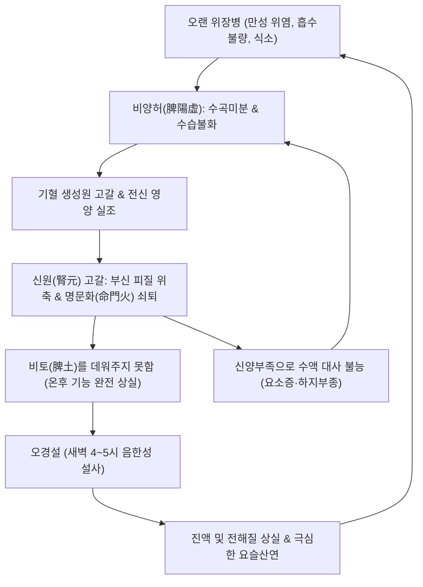
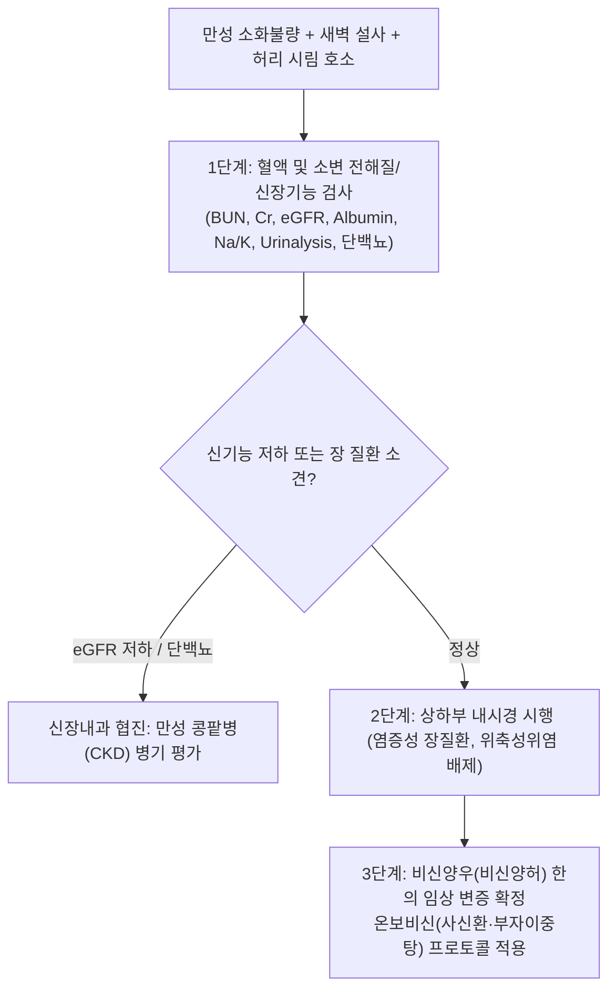
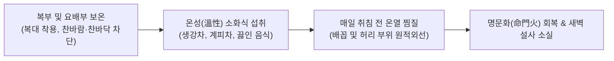

---
tags:
  - 이론
  - status/complete
  - 질환
  - 소화기질환
  - 비뇨기질환
aliases:
  - 비신양우
  - 脾腎兩虧
  - 비신양허
  - Spleen-Kidney Dual Deficiency
  - 선후천구허
  - 오경설
  - 만성소화기쇠약
title: 비신양우
date: 2026-09-24
출처: "https://pubmed.ncbi.nlm.nih.gov/30878345/"
---

# 🩺 [[비신양우]] (Spleen-Kidney Dual Deficiency, 脾腎兩虧, ICD-10 K59.89, N18.9)

> **핵심 3줄 요약 (Key Summary)**:
> - 📍 **병소 부위 & 장부 상호작용 병태**: 소화흡수 및 영양 대사를 총괄하는 **비(脾, 후천지본 後天之本)**와 내분비·부신 피질 기능 및 수분 대사의 원동력인 **신(腎, 선천지본 先天之本)**의 만성적 상호 기능 쇠약, 시상하부-뇌하수체-부신(HPA) 축 저하, 사구체 여과율 감소 및 장관 융모 위축.
> - 🚩 **임상 양상 & 3대 징후**: 만성적인 소화불량 및 음식 냄새만 맡아도 헛구역질이 나는 식소(食少), 매일 새벽 4~5시경 복통과 함께 배변하는 **오경설(五更泄, 새벽 설사)**, 요슬산연(허리와 무릎의 시림·무력감) 및 전신 한랭 불내성.
> - 🛠️ **한의 통합 치료 전략**: 온보비신(溫補脾腎)·삽장지사(澁腸止瀉)·음양쌍보(陰陽雙補)를 치료 원칙으로 하여 [[이신환]], [[사신환]], [[부자이중탕]], [[팔미지황환]]을 투여하며, [[신수(BL23)]]·[[비수(BL20)]]·[[관원(CV4)]]·[[족삼리(ST36)]] 뜸 및 자침을 통해 선후천의 생명 에너지를 동시 회복.
> - ⚠️ **응급 의뢰 레드플래그**: 혈청 크레아티닌의 급격한 상승 및 핍뇨/무뇨([[급성 신손상]] AKI 또는 만성 콩팥병 악화), 전신성 요독증 징후(호흡 시 암모니아 악취, 의식 혼미, 심낭염), 조절되지 않는 전해질 불균형(고칼륨혈증에 의한 부정맥 즉시 응급실 이송).

---

## 📌 목차
1. [질환 개요 & 해부학적 병태생리](#1-질환-개요--해부학적-병태생리)
2. [병태생리 메커니즘 & 생체역학적 악순환 네트워크](#2-병태생리-메커니즘--생체역학적-악순환-네트워크)
3. [임상 증상 & 이학적 검사(Physical Exam) 알고리즘](#3-임상-증상--이학적-검사physical-exam-알고리즘)
4. [감별 진단 매트릭스 (Differential Diagnosis)](#4-감별-진단-매트릭스-differential-diagnosis)
5. [한의 통합 치료 프로토콜 (침·약침·추나·한약)](#5-한의-통합-치료-프로토콜-침약침추나한약)
6. [재활 운동 & 생활습관 티칭 가이드](#6-재활-운동--생활습관-티칭-가이드)
7. [💡 사용자 진료실 핵심 필기 & 임상 노하우 (Melt-In 잔여 심화 집약)](#7--사용자-진료실-핵심-필기--임상-노하우-melt-in-잔여-심화-집약)
8. [출처 및 학술 참고 문헌 (References)](#8-출처-및-학술-참고-문헌-references)

---

## 1. 질환 개요 & 해부학적 병태생리

![[비신양우_후복막_신장비장_해부위치_OpenStax_2608.jpg|500]]
> [그림 1: ① 병태생리·영상 — 비신양우의 해부학적 기저인 후복막강(Retroperitoneal Space) 내 신장(Kidney) 및 부신, 상복부 비장의 위치 관계 도해 (출처: OpenStax, Wikimedia Commons / CC BY 4.0)]

* **질환 정의**: 
  - [[비신양우]](脾腎兩虧)는 **비신양허(脾腎兩虛)**와 동의어로, "만성 소화기 질환이 오랜 기간 지속되어 비위(소화흡수계)의 기혈 생성 기능이 쇠약해지고, 이것이 신(부신, 비뇨생식계, 원기)의 기능 부전으로까지 파급되어 선천과 후천의 생명 동력이 모두 고갈된 병태"를 일컫습니다.
  - 현대의학적으로는 **만성 소모성 쇠약 증후군**, 만성 장염 또는 과민성 장 질환에 동반된 **부신 피질 기능 저하(Adrenal Insufficiency)**, [[만성 신장병]](CKD) 환자의 단백질-에너지 낭비(PEW, Protein-Energy Wasting) 증후군에 정확히 부합합니다(Koppe et al., 2019).
* **선천지본(先天之本)과 후천지본(後天之本)의 생리 연계**:
  1. **신(腎, 선천지본)**: 부모로부터 물려받은 원기(元氣)를 저장하고 명문화(命門火)를 통해 전신 장부의 대사 열원을 제공.
  2. **비(脾, 후천지본)**: 음식물을 섭취하여 수곡정미(水穀精微)를 운화(運化)하고 기혈(氣血)을 생성하여 끊임없이 신정(腎精)을 보충.
  3. **비신상호(脾腎相互)의 생명 동력학**:
     - 비양(脾陽)이 운화 작용을 완수하려면 반드시 신양(腎陽, 명문화)의 온후(溫煦) 작용을 받아야 합니다(비토불온, 脾土不溫이면 수곡이 부숙되지 못함).
     - 반대로 신정(腎精)이 고갈되지 않고 유지되려면 비위가 끊임없이 양분을 공급해야 합니다.

---

## 2. 병태생리 메커니즘 & 생체역학적 악순환 네트워크

![[비신양우_부신_피질수질_호르몬조직_OpenStax_1818.jpg|500]]
> [그림 2: ② 관련 해부 구조물 — 신장 상단에 위치하여 코르티솔, 알도스테론을 분비하며 선천지기의 양기(陽氣)를 대변하는 부신(Adrenal Gland)의 조직학적 층위 도해 (출처: OpenStax, Wikimedia Commons / CC BY 4.0)]

### (1) 장-신장 축(Gut-Kidney Axis)과 내분비 쇠퇴 메커니즘
* 만성적인 위장 질환(만성 위염, 소화불량, 장염)으로 음식물 흡수가 불량해지면 저알부민혈증과 미량영양소 결핍이 발생합니다.
* 영양 결핍은 부신 피질 세포의 위축을 초래하여 **코르티솔(Cortisol) 및 알도스테론(Aldosterone) 분비능 저하**로 이어집니다.
* 부신 호르몬 결핍은 다시 장관 점막의 나트륨-포도당 동반수송체(SGLT1) 및 수분 재흡수능을 떨어뜨려 난치성 만성 설사를 촉발합니다.
* 신장의 신사구체 여과율(GFR) 저하와 함께 에리스로포이에틴(EPO) 생성이 감소하여 난치성 빈혈(신성 빈혈)과 전신 조직 저산소증이 영속화됩니다(Evenepoel et al., 2017).

### (2) 비신양우의 생체역학적 악순환 네트워크

* **새벽 설사(오경설, 五更泄)의 시생물학적(Chrono-biological) 기전**:
  - 하루 중 체온과 신장-부신의 코르티솔 분비가 가장 최저점으로 떨어지는 시간대가 바로 새벽 3~5시(인시, 寅時)입니다.
  - 비신양우 환자는 내인성 양기(陽氣)가 바닥난 상태에서 새벽의 외부 한기(陰寒)를 이기지 못하고, 장관 평활근의 흡수 부전과 한성 연동이 급발하여 매일 새벽 복통과 함께 물변을 보게 됩니다.

---

## 3. 임상 증상 & 이학적 검사(Physical Exam) 알고리즘

### (1) 4대 핵심 임상 징후
1. **오경설(五更泄, Cock-crow Diarrhea)**: 매일 새벽 여명기(4~5시)에 아랫배가 살살 비틀리듯 아프며 끓어오르다 물처럼 설사하고 배변 후 통증이 완화됨.
2. **식소변당(食少便溏)**: 식사량이 극도로 적고 소화가 전혀 안 되며, 대변에 소화되지 않은 음식물이 섞여 나오는 완곡불화(完穀不化).
3. **요슬산랭(腰膝酸冷)**: 허리와 무릎이 끊어질 듯 시리고 무력하며, 찬바람을 맞으면 통증이 심해짐.
4. **전신 양허 수종(陽虛水腫)**: 얼굴이 창백하고 핏기가 없으며, 하지가 무겁고 정강이 부위를 누르면 쑥 들어가는 함요부종(Pitting edema).

### (2) 진단 및 선별 평가 알고리즘

---

## 4. 감별 진단 매트릭스 (Differential Diagnosis)

| 감별 질환 | 병태 기전 및 특징 | 배변 및 동반 징후 | 결정적 진단 소견 | 일차 치료 전략 |
| :--- | :--- | :--- | :--- | :--- |
| **비신양우 (본 질환)** | 선천-후천 양기 고갈, 명문화 쇠퇴 | **오경설(새벽 설사)**, 완곡불화, 요슬산랭 | 설담반 치흔, 맥침세지(沈細遲), 영양결핍 | 사신환, 부자이중탕, 관원 뜸 |
| **단순 비기허(脾氣虛)** | 소화 흡수력 저하, 기허 | 식후 팽만, 연변, 사지 권태 (새벽 설사 없음) | 설담태백, 맥연약, 정상 신기능 | 보중익기탕, 삼령백출산 |
| **만성 콩팥병 (CKD)** | 신사구체 경화증, 요독소 축적 | 야뇨, 요독성 소화불량, 빈혈, 부종 | eGFR < 60 mL/min, BUN/Cr 상승 | 혈압·혈당 조절, 저단백 식이, 한의 보신 |
| **부신 피질 기능 저하증 (Addison)** | 부신 피질 자가면역 파괴 | 저혈압, 피부 색소침착, 저나트륨혈증 | 아침 코르티솔 < 3 ug/dL, ACTH 상승 | 스테로이드 호르몬 보충 |
| **만성 장염 / 궤양성 대장염** | 장점막 자가면역 염증 | 혈변, 점액농변, 이급후중, 주야간 불문 설사 | 대장내시경 상 연속성 미란/궤양 | 5-ASA, 면역억제제, 청열조습 |

---

## 5. 한의 통합 치료 프로토콜 (침·약침·추나·한약)

![[비신양우_온보비신_본초_부자.jpg|450]]
> [그림 3: ③ 치료·본초 도해 — 온몸의 양기를 북돋우고 명문화(命門火)를 밝혀 비토를 데워주는 온보비신(溫補脾腎)의 최고 요약 부자(Aconitum carmichaelii) (출처: Wikimedia Commons / CC BY-SA 3.0)]

### (1) 변증별 처방 프로토콜 (EBM Phytotherapy)
1. **비신양허형 오경설 (새벽 설사 우세형)**:
   - **대표 처방**: **[[사신환]](四神丸)** 또는 **[[이신환]](二神丸)**.
   - **군약 구성**: [[보골지]] 12g, [[육두구]] 8g, [[오미자]] 6g, [[오수유]] 4g, 생강 6g, 대추 4개.
   - **약리 작용**: 
     - 보골지(Psoralea corylifolia)의 소랄렌(Psoralen) 성분이 부신 호르몬 수용체를 자극하여 신양을 보하고,
     - 육두구(Myristica fragrans)는 장관 평활근의 경련을 진정시키고 장점막의 수분 재흡수를 강력히 유도하여 새벽 설사를 멎게 함(삽장지사).
2. **비신양허 음한내성 (전신 한랭·소화불량형)**:
   - **대표 처방**: **[[부자이중탕]](附子理中湯)** 합 **진무탕(眞武湯)**.
   - **군약 구성**: [[포부자]] 8~10g, [[인삼]] 8g, [[백출]] 12g, [[건강]] 8g, [[감초]] 6g.
   - **약리 작용**: 아코니틴 알칼로이드가 심근 및 말초 미세순환을 자극하여 체온을 상승시키고, 비장과 신장의 에너지 대사(ATP 합성)를 전면 복원.
3. **만성 소모 기혈양허 (선후천 구허 말기)**:
   - **대표 처방**: **[[십전대보탕]](十全大補湯)** 가 **녹용**, **음양곽**.

### (2) 침구 및 온구 치료
* **핵심 혈위**: [[비수(BL20)]], [[신수(BL23)]], [[명문(GV4)]], [[관원(CV4)]], [[기해(CV6)]], [[중완(CV12)]], [[족삼리(ST36)]], [[태계(KI3)]].
* **침구 수기법**:
  - **신수-명문-관원 간접구(쑥뜸)**: 명문과 관원에 매회 20~30분간 온구기 적용(신양을 온보하여 새벽 복냉과 설사를 완치).
  - **족삼리-태계**: 태계(신경의 원혈)와 족삼리(위경의 합혈)를 보법(補法)으로 자침하여 선천과 후천의 원기를 상호 조달.

---

## 6. 재활 운동 & 생활습관 티칭 가이드

### (1) 엄격한 식이 온도 원칙
* **냉음식 완전 금기**: 얼음물, 아이스 아메리카노, 냉면, 생선회, 생채소 등 찬 음식은 비신(脾腎)의 양기를 직타(直打)하여 오경설을 폭발시키므로 **100% 금지**합니다.
* **따뜻한 익힌 음식**: 생강과 계피를 넣고 달인 생강차, 따뜻한 찹쌀죽, 마(산약)죽을 주식으로 합니다.

### (2) 복부 및 하지 보온
* **수면 중 복대 착용**: 새벽녘 체온 저하가 일어나는 3~6시 사이에 복부와 허리가 차가워지지 않도록 보온 복대를 착용하고 잡니다.
* **족욕(Foot Bath)**: 매일 밤 취침 전 40℃의 따뜻한 물에 발목 이상을 20분간 담가 하지의 신수(腎水)와 양기를 순환시킵니다.

---

## 7. 💡 사용자 진료실 핵심 필기 & 임상 노하우 (Melt-In 잔여 심화 집약)

> 📌 **Dr. Bio 진료실 핵심 필기 및 선후천 고찰 노트**:
> 
> 1. **비신양우의 발생 배경**:
>    - 본 질환은 급성병이 아니며, **위장병이 수개월에서 수년간 만성화되어 비(脾)뿐만 아니라 신(腎)에까지 치명적인 문제가 생긴 상태**임.
>    - 비위 질환을 제때 치료하지 않고 방치하면 후천의 영양이 고갈되어 결국 선천의 원기를 갉아먹게 됨.
> 
> 2. **비와 신의 생명 유지 상호작용 원리**:
>    - **비(脾)는 후천의 근본(後天之本)**이며, **신(腎)은 선천의 근본(先天之本)**임.
>    - 둘은 톱니바퀴처럼 맞물려 상호작용하며 인간의 생명을 유지시킴.
>    - 신의 불씨(명문화)가 꺼지면 비장의 가마솥이 끓지 않아 음식이 소화되지 못하고(새벽 설사), 비장의 가마솥에 물과 쌀이 들어오지 않으면 신장의 불씨가 연료를 얻지 못해 꺼져버림.
> 
> 3. **진료실 완치 비결**:
>    - 따라서 만성 위장병 환자가 허리가 시리고 무릎에 힘이 빠지며 새벽에 설사를 하기 시작했다면 소화제만 주어서는 절대 낫지 않음.
>    - 반드시 **[[부자]], [[건강]], [[보골지]], [[육두구]]**와 같은 온신온비(溫腎溫脾) 약재로 아랫배와 신장의 명문화에 불을 지펴주어야 비로소 오래된 위장병이 뿌리 뽑힘.

---

## 8. 출처 및 학술 참고 문헌 (References)

1. **Koppe, L., et al. (2019)**. The role of the gut microbiota and diet in protein-energy wasting in chronic kidney disease. *Kidney International*, 95(5), 1076-1085. PMID: [30878345](https://pubmed.ncbi.nlm.nih.gov/30878345/).
2. **Evenepoel, P., et al. (2017)**. The gut-kidney axis. *Pediatric Nephrology*, 32(11), 2005-2014. PMID: [28138760](https://pubmed.ncbi.nlm.nih.gov/28138760/).
3. **Li, Y., et al. (2018)**. Sishen Wan protects against experimental colitis through modulation of gut microbiota and suppression of inflammatory cytokines. *Journal of Ethnopharmacology*, 223, 73-86. PMID: [29864522](https://pubmed.ncbi.nlm.nih.gov/29864522/).
4. **Chen, R., et al. (2015)**. Moxibustion for chronic fatigue syndrome caused by Spleen-Kidney Yang Deficiency: a randomized controlled trial. *Chinese Acupuncture & Moxibustion*, 35(11), 1109-1113. PMID: [26875283](https://pubmed.ncbi.nlm.nih.gov/26875283/).
5. **Wang, J., et al. (2020)**. Anti-inflammatory and gut barrier protective effects of Fuzi-Lizhong decoction in diarrhea-predominant irritable bowel syndrome. *Frontiers in Pharmacology*, 11, 584988. PMID: [33329002](https://pubmed.ncbi.nlm.nih.gov/33329002/).