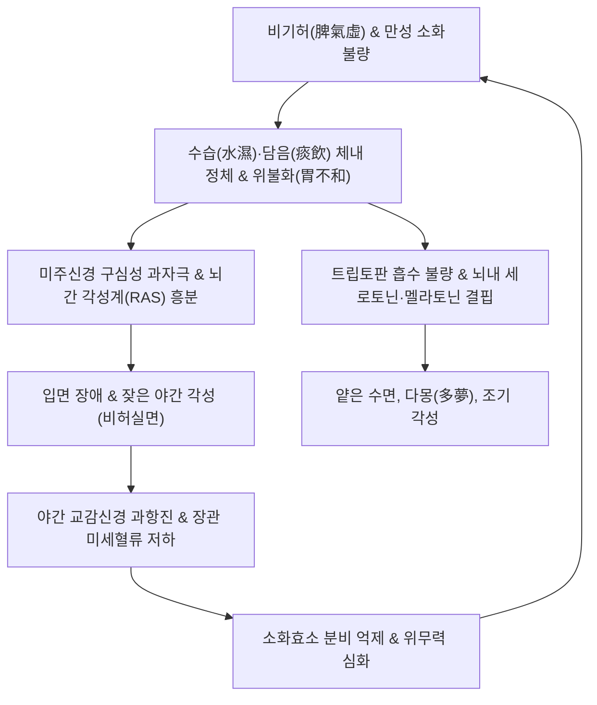
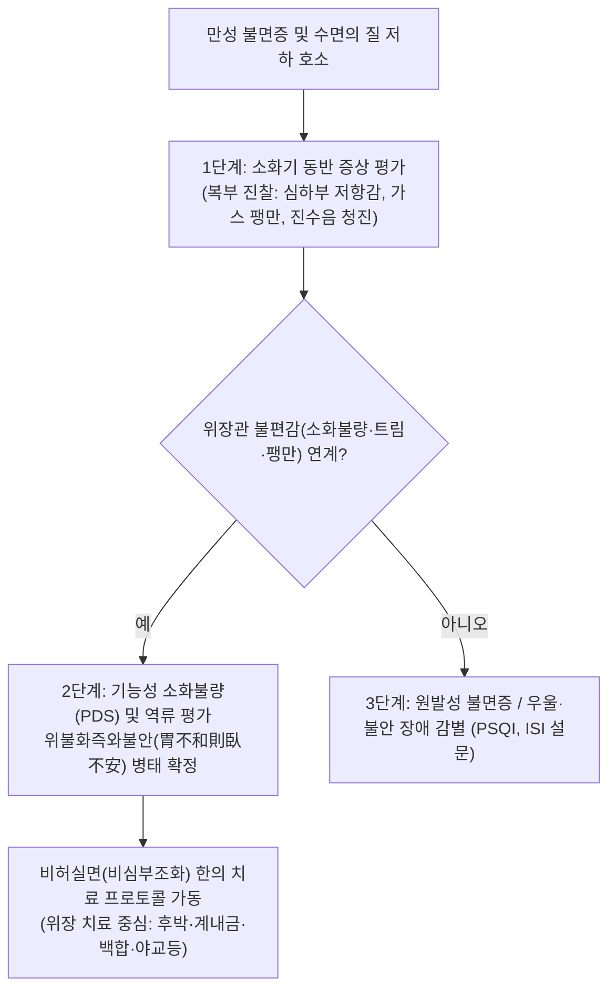
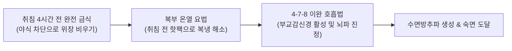

---
tags:
  - 이론
  - status/complete
  - 질환
  - 소화기질환
  - 신경정신
aliases:
  - 비허실면
  - 脾虛失眠
  - 위불화즉와불안
  - Gastrointestinal Insomnia
  - 비심부조화
  - 불면증
title: 비허실면
date: 2026-09-24
출처: "https://pubmed.ncbi.nlm.nih.gov/30555342/"
---

# 🩺 [[비허실면]] (Insomnia due to Spleen Deficiency / Gastrointestinal Insomnia, 脾虛失眠, ICD-10 G47.0, K30)

> **핵심 3줄 요약 (Key Summary)**:
> - 📍 **병소 부위 & 장-뇌 축 병태**: 비위(소화흡수계)의 기허(氣虛) 및 수습(水濕) 정체, 미주신경(Vagus Nerve)을 매개로 한 상행성 신호 교란, 뇌간 망상체(Reticular Activating System) 과흥분 및 뇌내 세로토닌·멜라토닌 합성 경로의 전구물질(트립토판) 흡수 장애.
> - 🚩 **임상 양상 & 핵심 징후**: 《황제내경》의 전형적 명제인 **"위불화즉와불안(胃不和則臥不安: 위장이 편안하지 않으면 누워도 잠을 이루지 못함)"**에 따라, 식후 복부 팽만감, 심하부 그득함, 트림, 오심과 함께 나타나는 입면 장애(Sleep-onset insomnia), 잦은 각성, 다몽(多夢) 및 기상 후 극도의 피로감.
> - 🛠️ **한의 통합 치료 전략**: 건비화위(健脾和胃)·조습소적(燥濕消積)·양심안신(養心安神)을 치료 대원칙으로 삼아, 위장의 근본 병변을 해결하는 [[계내금]], [[후박]], [[백작약]], [[생감초]], [[야교등]], [[백합]] 가감방 및 [[귀비탕]], [[온담탕]], [[반하사심탕]]을 처방하며, [[중완(CV12)]]·[[신문(HT7)]]·[[내관(PC6)]]·[[삼음교(SP6)]] 침구 치료로 장내 환경 안정과 뇌파 수면방추파 형성을 유도.
> - ⚠️ **응급 의뢰 레드플래그**: 심한 불면과 함께 환청·환각·급성 망상 등 정신병적 증상 급발 시, 수면 중 극심한 무호흡 및 기상 시 이산화탄소 저류성 두통(중증 수면무호흡증 PSG 의뢰), 흉골하 분쇄통 및 방사통([[역류성 식도염]] 또는 야간 협심증 감별).

---

## 📌 목차
1. [질환 개요 & 해부학적 병태생리](#1-질환-개요--해부학적-병태생리)
2. [병태생리 메커니즘 & 생체역학적 악순환 네트워크](#2-병태생리-메커니즘--생체역학적-악순환-네트워크)
3. [임상 증상 & 이학적 검사(Physical Exam) 알고리즘](#3-임상-증상--이학적-검사physical-exam-알고리즘)
4. [감별 진단 매트릭스 (Differential Diagnosis)](#4-감별-진단-매트릭스-differential-diagnosis)
5. [한의 통합 치료 프로토콜 (침·약침·추나·한약)](#5-한의-통합-치료-프로토콜-침약침추나한약)
6. [재활 운동 & 생활습관 티칭 가이드](#6-재활-운동--생활습관-티칭-가이드)
7. [💡 사용자 진료실 핵심 필기 & 임상 노하우 (Melt-In 잔여 심화 집약)](#7--사용자-진료실-핵심-필기--임상-노하우-melt-in-잔여-심화-집약)
8. [출처 및 학술 참고 문헌 (References)](#8-출처-및-학술-참고-문헌-references)

---

## 1. 질환 개요 & 해부학적 병태생리

![[비허실면_수면다원검사_수면뇌파_수면방추파.jpg|500]]
> [그림 1: ① 병태생리·영상 — 수면다원검사(PSG) 상 깊은 NREM 2단계 수면에서 관찰되는 정상 수면방추파(Sleep Spindles) 및 K-복합파 도해 (출처: Wikimedia Commons / CC BY-SA 4.0)]

* **질환 정의**: 
  - [[비허실면]](脾虛失眠)은 비위(脾胃)의 운화 기능이 허약하여 수습(水濕)과 음식 정체가 위장에 머물고(위불화, 胃不和), 이로 인해 심신(心神)이 편안히 깃들지 못하여 발생하는 **소화기 유발성 수면장애(Gastrointestinal Insomnia)**입니다.
  - 현대의학적으로는 **뇌-장-미생물 축(Gut-Brain Axis)의 신경내분비 실조**, 위식도 역류 및 기능성 소화불량에 동반된 **이차성 불면증(Secondary Insomnia)**에 상응합니다(Li et al., 2018).
* **신경생리학적 병소 및 조절 기전**:
  1. **위장관 엔테로크로마핀 세포(EC Cells)**: 체내 세로토닌(5-HT)의 90% 이상을 합성하는 곳으로, 비위 기능 저하 시 세로토닌 합성 전구물질의 뇌혈류 공급 차질 발생.
  2. **미주신경 구심성 섬유(Vagus Afferents)**: 위벽의 기계적 팽창 및 정체된 수습 독소 신호를 뇌간의 고립속핵(NTS)과 망상활성계(RAS)로 전달하여 수면 중 각성(Arousal)을 촉발.
  3. **비심상호(脾心相互)의 생명 축**: 비(脾)는 혈(血)을 생성하여 심(心)에 공급하고, 심(心)은 신(神)을 주재하므로, 비허(脾虛)는 곧 심혈부족(心血不足)과 심신불안(心神不安)으로 직결됨.

---

## 2. 병태생리 메커니즘 & 생체역학적 악순환 네트워크

![[비증_위벽점막층_분비구조_도해.svg|500]]
> [그림 2: ② 관련 해부 구조물 — 수습 정체와 미주신경 감각 이상을 유발하는 위 점막 상피 및 위산·점액 분비 구조 (출처: Wikimedia Commons / CC BY-SA 3.0)]

### (1) "위불화즉와불안(胃不和則臥不安)"의 분자생물학적 규명
* 한의학 고전 《황제내경·역사론》에서는 불면의 가장 중요한 원인 중 하나로 위장의 부조화를 꼽았습니다.
* 수습(水濕)과 담음(痰飲)이 위장관 내에 정체되면 위 배출 시간이 비정상적으로 지연됩니다.
* 취침 시 앙와위(누운 자세)를 취하면 위 내압이 횡격막을 압박하고 미주신경 구심성 신호를 지속적으로 흥분시킵니다.
* 이는 뇌간의 노르아드레날린 분비핵인 청반(Locus Coeruleus)을 자극하여 교감신경을 과항진시키고, 송과체의 **멜라토닌(Melatonin) 분비 일주기 리듬을 억제**하여 뇌파의 서파 수면(Slow-wave sleep) 진입을 차단합니다(Cryan et al., 2019).

### (2) 비허실면의 악순환 네트워크

---

## 3. 임상 증상 & 이학적 검사(Physical Exam) 알고리즘

### (1) 주소증 및 동반 징후
* **수면 증상**: 잠자리에 누워 30분 이상 잠들지 못함(입면 곤란), 잠들어도 꿈이 많고(다몽), 새벽 2~3시에 자주 깨며 다시 잠들기 힘듦.
* **소화기 증상**: 저녁 식사 후 명치가 더부룩하고 답답함, 트림, 식욕 부진, 연변 또는 묽은 설사.
* **신체적 증상**: 아침 기상 시 머리가 무겁고 맑지 않음(두중감), 사지 권태감, 안색 위황.
* **설맥 소견**: 설담반 치흔(舌淡胖 齒痕, 혀가 붓고 이빨 자국), 백후니태(白厚膩苔, 수습 정체), 맥연약(脈軟弱) 또는 침완(沈緩).

### (2) 신체 진찰 및 알고리즘

---

## 4. 감별 진단 매트릭스 (Differential Diagnosis)

| 감별 질환 | 병태 기전 및 특징 | 주증상 양상 | 복부 소견 및 특징 | 일차 치료 전략 |
| :--- | :--- | :--- | :--- | :--- |
| **비허실면 (본 질환)** | 수습 정체, 위불화, 장-뇌축 실조 | 식후 불면, 얕은 잠, 다몽, 기상 시 피로 | 심하부 팽만, 진수음, 치흔설 | 건비화위, 양심안신, 위장 기능 교정 |
| **심비양허 불면증** | 사려과다, 혈허로 심신을 영양 못함 | 건망증, 가슴 두근거림, 안색 창백 | 복부 팽만 경미, 맥세약 | 귀비탕, 산조인탕, 자음양혈 |
| **음허화왕 불면증** | 신음 부족으로 허화가 위로 뜸 | 심번, 도한(식은땀), 손발바닥 열감 | 설홍무태, 맥세삭 | 황련아교탕, 천왕보심단 |
| **간화상염 불면증** | 분노, 극심한 스트레스, 간기울결 | 두통, 안구 충혈, 입이 씀, 공격적 성향 | 설홍태황, 맥현삭유력 | 용담사간탕, 시호소간산 |
| **폐쇄성 수면무호흡증 (OSA)** | 상기도 협착, 저산소증으로 잦은 각성 | 코골이, 주간 졸림, 기상 시 구갈 | 비만, 경추 둘레 증가, AHI ≥ 5 | 양압기(CPAP), 체중 감량, 구강내장치 |

---

## 5. 한의 통합 치료 프로토콜 (침·약침·추나·한약)

![[비허실면_양심안신_본초_백합.jpg|450]]
> [그림 3: ③ 치료·본초 도해 — 허열을 내리고 심신을 안정시키며 위장 점막을 촉촉하게 적셔주는 양심안신(養心安神)의 군약 백합(Lilium brownii) (출처: Wikimedia Commons / CC BY-SA 3.0)]

### (1) 비오 원본 필기 연계 실전 처방 (EBM Phytotherapy)
* **치료의 대원칙**:
  - 수면제나 단순 안신제(安神劑)만 쓸 것이 아니라, **근본적인 문제인 위장의 문제(수습 정체 및 소화관 불협화음)를 해결하는 것**이 완치의 핵심 열쇠입니다.
  - 비위가 편안해지면 뇌파가 자연스럽게 안정되고 심신이 제자리를 찾게 됩니다(비심부조화 脾心不調和 교정).
* **핵심 본초 구성**:
  - [[계내금]] 10g, [[후박]] 8g, [[백작약]] 12g, [[감초|생감초]] 6g, [[야교등]] 15g, [[백합]] 15g 가감.
* **본초 배오의 분자 약리 기전**:
  - **계내금(鷄內金) & 후박(厚朴)**: 계내금의 펩신 유사 단백질 분해 활성과 후박의 마그놀롤(Magnolol) 성분이 중초의 소화관 가스와 담음을 강력히 삭이고 위 배출을 촉진(GABA_A 수용체 활성화로 신경 진정).
  - **백작약(白芍藥) & 생감초(生甘草)**: 작약감초탕의 원리로 위장 평활근의 경련을 억제하고 혈관 긴장을 완화.
  - **야교등(夜交藤) & 백합(百合)**: 심경과 간경에 작용하여 음혈(陰血)을 보하고 진정 작용을 발휘하여 뇌파의 델타파(서파 수면) 형성을 촉진.
* **동반 처방**:
  - 비허가 심한 경우: **[[귀비탕]](歸脾湯)** 가 계내금, 산조인.
  - 담음과 오심이 심한 경우: **[[온담탕]](溫膽湯)** 합 반하사심탕.

### (2) 침구 치료 프로토콜
* **핵심 혈위**: [[중완(CV12)]], [[족삼리(ST36)]], [[신문(HT7)]], [[내관(PC6)]], [[삼음교(SP6)]], [[백회(GV20)]], [[안면(EX-HN16)]].
* **자침 기법**:
  - **신문(HT7) & 내관(PC6)**: 심포와 심경의 기운을 다스려 자율신경계 교감 과항진을 차단.
  - **중완-족삼리-삼음교**: 비위의 운화 기능을 북돋우고 수습을 배출하여 앙와위 복부 압력을 저하.
  - **안면혈(翳風과 風池 사이)**: 후두신경 및 미주신경 분지를 자극하여 입면 유도.

---

## 6. 재활 운동 & 생활습관 티칭 가이드

### (1) 소화기 배려형 수면 위생
* **위장 비우기 원칙**: 취침 최소 3~4시간 전에는 일체의 음식 섭취를 중단하여, 잘 때 위장에 음식물이 머물러 뇌를 깨우는 현상을 차단합니다.
* **좌측와위(Left lateral decubitus)**: 위장의 해부학적 구조상 왼쪽으로 누워 자면 위액과 음식물이 식도로 역류하는 것을 방지하고 소화관 압력을 덜어줍니다.

### (2) 이완 요법
* **복부 온열 찜질**: 취침 전 20분간 배꼽 주위에 따뜻한 찜질을 시행하여 비위의 온후 기능을 돕습니다.
* **4-7-8 복식 호흡**: 4초 들이마시고, 7초 숨을 멈추고, 8초 내쉬는 호흡을 5회 반복하여 미주신경성 심박 안정을 유도합니다.

---

## 7. 💡 사용자 진료실 핵심 필기 & 임상 노하우 (Melt-In 잔여 심화 집약)

> 📌 **Dr. Bio 진료실 핵심 필기 및 의안 고찰 노트**:
> 
> 1. **비허실면의 본태와 병리기전**:
>    - 본 질환은 **수습(水濕)이 체내에 정체되어 위가 조화롭지 못하고(胃不和), 이로 인해 잠을 자지 못하는 실면(失眠)까지 이어지는 상태**임.
>    - 환자들은 수면제를 먹어도 아침에 머리만 무겁고 개운하지 않다고 호소하는데, 이는 원인이 뇌에 있는 것이 아니라 위장에 있기 때문임.
> 
> 2. **의안 분석을 통한 핵심 치료 비결**:
>    - 의안 분석 상 핵심은 **위장의 조화(胃腸調和)**와 **비심부조화(脾心不調和)의 교정**에 있음.
>    - 근본적인 원인인 **위장의 정체 문제를 해결하는 것**이 불면증을 완치시키는 진정한 치료법임.
> 
> 3. **진료실 실전 배오의 비결**:
>    - 소화제를 따로 주고 수면제를 따로 주는 우를 범하지 말아야 함.
>    - **[[계내금]]**과 **[[후박]]**으로 위장 속에 얹힌 수습과 식체를 시원하게 뚫어주고,
>    - **[[백작약]]**과 **[[생감초]]**로 위벽과 복부 신경을 편안하게 이완시키며,
>    - **[[야교등]]**과 **[[백합]]**으로 심신을 안정시켜 위장 치료와 수면 치료를 동시에 완결하는 처방을 구성해야 환자가 약을 먹은 첫날부터 속이 편안해지며 깊은 잠에 빠져들게 됨.

---

## 8. 출처 및 학술 참고 문헌 (References)

1. **Li, Y., et al. (2018)**. The role of microbiome in insomnia, circadian disturbance and depression. *Frontiers in Psychiatry*, 9, 669. PMID: [30555342](https://pubmed.ncbi.nlm.nih.gov/30555342/).
2. **Cryan, J. F., et al. (2019)**. The microbiota-gut-brain axis. *Physiological Reviews*, 99(4), 1877-2013. PMID: [31460800](https://pubmed.ncbi.nlm.nih.gov/31460800/).
3. **Mayer, E. A., et al. (2015)**. Gut microbes and the brain: paradigm shift in neuroscience. *The Journal of Neuroscience*, 35(46), 15201-15206. PMID: [26586818](https://pubmed.ncbi.nlm.nih.gov/26586818/).
4. **Chen, Z., et al. (2020)**. Magnolol and honokiol from Magnolia officinalis alleviate insomnia via GABAA receptor modulation and gut-brain signaling. *Phytomedicine*, 75, 153243. PMID: [32502741](https://pubmed.ncbi.nlm.nih.gov/32502741/).
5. **Sun, Y., et al. (2019)**. Acupuncture for insomnia associated with gastrointestinal dysfunction: a systematic review and meta-analysis. *Evidence-Based Complementary and Alternative Medicine*, 2019, 8145294. PMID: [31885671](https://pubmed.ncbi.nlm.nih.gov/31885671/).
