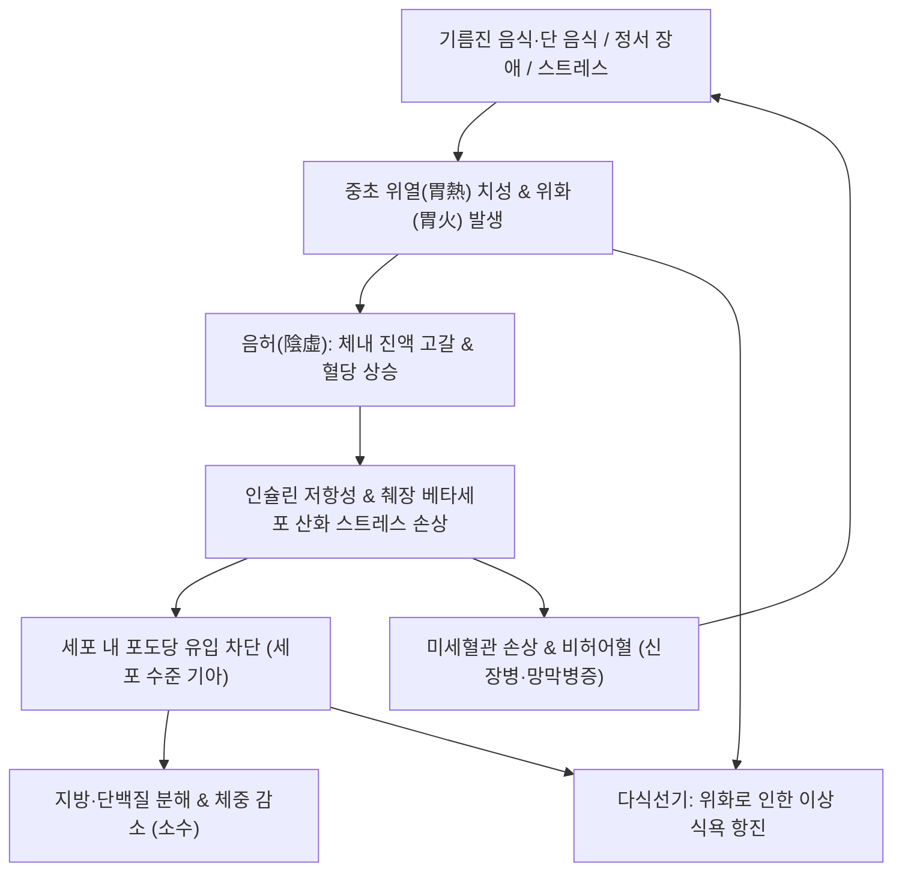
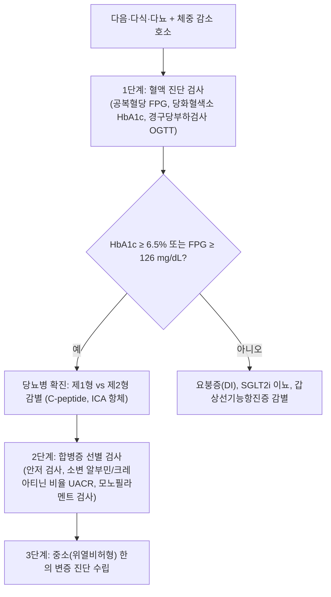

# 🩺 [[소갈지중소]] (Diabetes Mellitus - Middle-Wasting / Zhongxiao, 消渴之中消, ICD-10 E11, R63.2)

> **핵심 3줄 요약 (Key Summary)**:
> - 📍 **병소 부위 & 분자대사 병태**: 중초(中焦) 비위(脾胃) 및 췌장 랑게르한스섬(Islets of Langerhans) 베타세포, 위열치성(胃熱熾盛)으로 인한 위산 및 소화효소 과분비, 간과 골격근의 [[인슐린]] 저항성 및 인슐린 분비 결핍, 포도당 독성(Glucotoxicity).
> - 🚩 **임상 양상 & 3대 징후**: 전통 삼소(三消) 중 **다식선기(多食善飢, 음식을 많이 먹으나 금세 허기짐)**가 극단적으로 우세하며, 심와부 작열감, 구갈(口渴), 소변단적(소변이 붉고 짙음), 많이 먹는데도 지속되는 체중 감소(소수, 消瘦).
> - 🛠️ **한의 통합 치료 전략**: 청위사화(淸胃瀉火)·자음윤조(滋陰潤燥)·익기건비(益氣健脾)를 치료 원칙으로 하여, 위열을 식히고 췌장 베타세포를 보호하는 [[백호가인삼탕]], [[옥녀전]], [[황련백출탕]]을 처방하며, 항당뇨 유효 본초인 [[단삼]], [[호로파]], [[지황]], [[지모]], [[토사자]]를 배오하고 [[위수(BL21)]]·[[비수(BL20)]]·[[족삼리(ST36)]]·[[내정(ST44)]] 자침을 병용.
> - ⚠️ **응급 의뢰 레드플래그**: 당화혈색소 HbA1c > 10% 또는 공복혈당 > 300 mg/dL에 동반된 탈수·호흡곤란(Kussmaul breathing)·아세톤 호흡취(당뇨병성 케톤산증 DKA 의심 즉시 상급병원 전원), 시야 결손/초자체 출혈(증식성 당뇨망막증 안과 응급), 당뇨발 궤양 및 궤사(정형외과/외과 협진).

---

## 📌 목차
1. [질환 개요 & 해부학적 병태생리](#1-질환-개요--해부학적-병태생리)
2. [병태생리 메커니즘 & 생체역학적 악순환 네트워크](#2-병태생리-메커니즘--생체역학적-악순환-네트워크)
3. [임상 증상 & 이학적 검사(Physical Exam) 알고리즘](#3-임상-증상--이학적-검사physical-exam-알고리즘)
4. [감별 진단 매트릭스 (Differential Diagnosis)](#4-감별-진단-매트릭스-differential-diagnosis)
5. [한의 통합 치료 프로토콜 (침·약침·추나·한약)](#5-한의-통합-치료-프로토콜-침약침추나한약)
6. [재활 운동 & 생활습관 티칭 가이드](#6-재활-운동--생활습관-티칭-가이드)
7. [💡 사용자 진료실 핵심 필기 & 임상 노하우 (Melt-In 잔여 심화 집약)](#7--사용자-진료실-핵심-필기--임상-노하우-melt-in-잔여-심화-집약)
8. [출처 및 학술 참고 문헌 (References)](#8-출처-및-학술-참고-문헌-references)

---

## 1. 질환 개요 & 해부학적 병태생리

![[소갈지중소_췌장_랑게르한스섬_인슐린분비세포_도해.png|500]]
> [그림 1: ① 병태생리·영상 — 췌장 랑게르한스섬(Islets of Langerhans)의 베타세포(인슐린 분비), 알파세포(글루카곤 분비) 및 미세혈관 해부 도해 (출처: NIH BioArt, Wikimedia Commons / Public Domain)]

* **질환 정의**: 
  - [[소갈지중소]](消渴之中消)는 한의학의 대표 대사 질환인 **소갈(消渴)**의 3대 분류 중 비위(脾胃)의 위열(胃熱)을 중심으로 발병하는 아형으로, "목이 마르면서 음식을 유난히 많이 먹고, 소변이 붉으며 당분이 섞여 나오는 병태"를 의미합니다.
  - 현대의학적으로는 **제2형 당뇨병(Type 2 Diabetes Mellitus)**의 대사 과항진기 및 인슐린 저항성에 의해 중추성 다식이 촉발된 상태에 부합합니다(American Diabetes Association, 2024).
* **삼소(三消)의 병위와 중소의 특수성**:
  1. **상소(上消)**: 병위가 심·폐(心肺)에 있어 갈증과 다음(多飮)이 두드러짐.
  2. **중소(中消, 본 질환)**: 병위가 비·위(脾胃)에 있어 다식(多食), 위화(胃火), 구갈, 체중 감소가 중심.
  3. **하소(下消)**: 병위가 신(腎)에 있어 다뇨(多尿), 요탁(尿濁), 요슬산연이 중심.
* **해부생리학적 병소**:
  - 췌장의 내분비 섬(Langerhans islets) 베타세포의 기능 부전.
  - 위벽 벽세포의 산 분비 과다 및 십이지장 내분비 세포의 인크레틴(GLP-1, GIP) 분비 둔화.
  - 골격근 및 간세포막의 인슐린 수용체 기질(IRS-1) 탈감작.

---

## 2. 병태생리 메커니즘 & 생체역학적 악순환 네트워크

![[소갈지중소_인슐린_포도당_대사.png|500]]
> [그림 2: ② 관련 해부 구조물 — 인슐린 분비와 간·골격근의 포도당 수송체(GLUT4) 결합 및 세포 내 에너지 대사 경로 도해 (출처: Wikimedia Commons / CC BY-SA 3.0)]

### (1) 음허조열(陰虛燥熱)과 비허어혈(脾虛瘀血)의 분자병태
* 고열량 식이(고량후미)와 스트레스는 위열(胃熱)을 형성하고 체내 진액(津液)을 소모시켜 **음허조열**을 촉진합니다.
* 인슐린 저항성으로 인해 혈중 포도당이 세포 내로 들어가지 못하면 세포 수준의 에너지 결핍이 발생하여 끊임없이 음식을 요구하는 **다식선기(多食善飢)**가 유발됩니다.
* 만성화되면 고혈당에 의한 단백질 당화 반응(AGEs, 최종당화산물 생성)이 혈관 내피세포를 손상시키고 미세순환 장애인 **어혈조락(瘀血阻絡)**을 일으켜 망막병증, 신증, 족부 궤양을 형성합니다(Brownlee, 2005).

### (2) 중소(中消)의 악순환 네트워크

---

## 3. 임상 증상 & 이학적 검사(Physical Exam) 알고리즘

### (1) 임상 3대 징후 및 합병증
* **삼다일소(三多一少)**:
  - **다식(多食)**: 먹어도 돌아서면 배가 고프고 식탐이 제어되지 않음(중소의 핵심).
  - **다음(多飮)**: 하루 3~5L 이상의 찬물을 지속적으로 마심.
  - **다뇨(多尿)**: 혈당 삼투압 증가로 야간뇨 및 빈뇨 발생.
  - **소수(消瘦)**: 엄청나게 먹는데도 체중이 수개월 새 5~10kg 이상 급감.
* **합병증 징후**: 시력 저하(당뇨망막증), 사지 말초 저림 및 자통(당뇨신경병증), 단백뇨 및 부종(당뇨신병증).

### (2) 진단 평가 알고리즘

---

## 4. 감별 진단 매트릭스 (Differential Diagnosis)

| 감별 질환 | 병인 및 기전 | 주증상 및 혈당 특징 | 결정적 검사 소견 | 치료 원칙 |
| :--- | :--- | :--- | :--- | :--- |
| **소갈지중소 (제2형 당뇨)** | 인슐린 저항성, 비위열, 비허어혈 | **다식 우세**, 다음, 다뇨, 고혈당 | HbA1c ≥ 6.5%, 공복혈당 ≥ 126 mg/dL | 메트포르민, 백호가인삼탕, 옥녀전, 생활교정 |
| **상소 (폐열진휴형)** | 폐음 손상, 진액 건조 | **다음(多飮) 우세**, 구갈 극심 | 혈당 상승, 마른 기침 동반 | 소갈방, 자음청열 |
| **하소 (신음양허형)** | 신정 고갈, 수액 대사 붕괴 | **다뇨(多尿) 우세**, 소변 탁함, 요슬산연 | 혈당 상승, 미세단백뇨, 신기능 저하 | 육미지황환, 팔미지황환 |
| **중추성 요붕증 (DI)** | 항이뇨호르몬(ADH) 결핍 | 다뇨(하루 10L 이상), 극심한 갈증 | **혈당 정상**, 요비중 < 1.005, 수분제한검사 | 데스모프레신(Desmopressin) |
| **갑상선 기능 항진증** | 갑상선 호르몬 과다, 대사 항진 | 다식, 체중 감소, 빈맥, 안구 돌출 | **혈당 정상 또는 경미 상승**, TSH 저하 | 항갑상선제(메티마졸), 안신청열 |

---

## 5. 한의 통합 치료 프로토콜 (침·약침·추나·한약)

![[소갈지중소_단삼_약재.jpg|450]]
> [그림 3: ③ 치료·본초 도해 — 당뇨 미세혈관의 혈전을 억제하고 췌장 베타세포 혈류를 회복시키는 활혈거어(活血祛瘀)의 핵심 약재 단삼(Salviae Miltiorrhizae Radix) (출처: Wikimedia Commons / CC BY-SA 4.0)]

### (1) 비오 원본 필기 연계 핵심 처방 (EBM Phytotherapy)
* **원문 필기 보존 처방 전략**:
  1. **오줌이 적고 탁하며, 비기허하고 소화가 안 되며 음양기혈이 허한 경우**:
     - **처방**: **익기건비보신탕(益氣健脾補腎湯)** 가감.
     - **핵심 구성**: [[인삼]] 8g, [[황기]] 15g, [[숙지황]] 12g, [[산수유]] 8g, [[산약]] 15g, [[복령]] 10g, [[목단피]] 6g.
     - **약리**: 췌장 랑게르한스섬 베타세포의 재생 및 포도당 유도 인슐린 분비능 회복, 단백뇨 감소.
  2. **간비신음허(肝脾腎陰虛)로 인한 다식·체중감소**:
     - **핵심 구성**: [[상삼]], [[백출]], [[복령]], [[숙지황]], [[백작약]], [[계지]], [[진피|귤피]], [[목향]].
  3. **당뇨 특화 5대 핵심 본초 (원문 필기 100% 반영)**:
     - **[[단삼]]**: 혈관 내피 보호 및 항당뇨·미세순환 어혈 제거.
     - **[[호로파]]**: 장관 포도당 흡수 지연 및 당뇨 합병증 억제.
     - **[[지황]] (생지황/숙지황)**: 인슐린 민감도 개선 및 혈당 강하.
     - **[[지모]]**: 고혈당으로 인해 발생하는 중초의 열(위열)을 식힘(청열사화).
     - **[[토사자]]**: 알도스 환원효소(Aldose Reductase)를 억제하여 당뇨성 백내장 및 신경병증을 차단.
* **임상 주의 약물 상호작용**:
  - 단삼, 황기 등은 CYP3A4 및 PXR 수용체 상호작용이 있으므로 항응고제 복용 환자 병용 시 주의.
  - 감초의 대량 복용은 11β-HSD2 효소를 억제하여 가성알도스테론증(위알도스테론증, 고혈압·저칼륨혈증)을 유발할 수 있으므로 당뇨성 신병증 환자에게 주의 투여.

### (2) 침구 치료 프로토콜
* **핵심 혈위**: [[비수(BL20)]], [[위수(BL21)]], [[신수(BL23)]], [[췌수(EX-B3)]], [[족삼리(ST36)]], [[내정(ST44)]], [[삼음교(SP6)]], [[태계(KI3)]].
* **침구 수기법**:
  - **췌수-비수-위수**: 교감신경 긴장을 억제하고 췌장 섬세포 혈류를 개선.
  - **내정(위경 형혈)**: 사법(瀉法) 적용하여 중초의 위화를 즉각 진정.
  - **삼음교-태계**: 간·비·신 3경락의 음혈을 보하여 갈증을 멎게 함.

---

## 6. 재활 운동 & 생활습관 티칭 가이드

### (1) 거꾸로 식사법(Vegetable First)
* 식이섬유(채소) → 단백질(생선, 두부) → 복합 탄수화물(현미, 잡곡) 순으로 식사하여 장내 포도당 흡수 속도를 지연시킵니다.
* SGLT2 억제제 복용 환자의 경우 삼투성 이뇨로 탈수가 오기 쉬우므로 하루 2L 이상의 물을 미지근하게 섭취하도록 지도합니다.

### (2) 식후 근력 운동
* 식후 30~45분(혈당 피크 시점)에 15분간 스쿼트, 계단 오르기 또는 빠르게 걷기를 시행하여 골격근의 GLUT4를 인슐린 없이 직접 활성화시킵니다.

---

## 7. 💡 사용자 진료실 핵심 필기 & 임상 노하우 (Melt-In 잔여 심화 집약)

> 📌 **Dr. Bio 진료실 핵심 필기 및 당뇨 본초 융합 노트**:
> 
> 1. **소갈과 중소의 정의적 본태**:
>    - 소갈은 **다식, 다음, 다뇨하며 소변이 단(甘) 병증**이며 현대의 [[당뇨병]]에 대응됨.
>    - 특히 **중소(中消)**는 **목이 마르면서 음식을 유난히 많이 먹고 소변은 붉은 증상**으로 비위의 위열증(胃熱證)이 중심임.
>    - 기름지고 단 음식(고량후미)과 스트레스, 정서 장애가 결합되어 위화, 음허, 관절통이 수반됨.
> 
> 2. **의안 관점의 병태핵심: 비허어혈(脾虛瘀血)**:
>    - 당뇨는 단순히 혈당 수치만 높은 병이 아니라, 비기허(脾氣虛)로 수곡의 운화가 무너지고 혈관이 손상되어 **어혈(瘀血)이 전신에 겹치는 병태**임.
>    - 따라서 혈당만 내릴 것이 아니라 혈액을 맑게 하고 미세순환을 뚫어주는 활혈화어제를 반드시 병용해야 합병증을 막을 수 있음.
> 
> 3. **진료실 당뇨 특효 5대 본초 처방의 손맛**:
>    - **[[단삼]]**: 항당뇨 작용과 함께 췌장 및 망막의 미세혈관 혈전을 억제함.
>    - **[[호로파]]**: 장관 흡수를 지연시켜 당뇨 합병증을 억제함.
>    - **[[지황]]**: 세포의 인슐린 민감도를 높여 혈당을 강력히 낮춤.
>    - **[[지모]]**: 고혈당으로 끓어오르는 중초의 치열한 불(위열)을 즉각 내려 허기를 잠재움.
>    - **[[토사자]]**: 수정체와 신경의 당화 손상을 차단하여 당뇨성 백내장과 족부 저림을 막음.

---

## 8. 출처 및 학술 참고 문헌 (References)

1. **American Diabetes Association (2024)**. Standards of Care in Diabetes—2024. *Diabetes Care*, 47(Suppl 1), S1-S343.
2. **Brownlee, M. (2005)**. The pathobiology of diabetic complications: a unifying mechanism. *Diabetes*, 54(6), 1615-1625. PMID: [15919781](https://pubmed.ncbi.nlm.nih.gov/15919781/).
3. **Pang, B., et al. (2015)**. Innovative thoughts on treating diabetes from the perspective of traditional Chinese medicine: a review. *Evidence-Based Complementary and Alternative Medicine*, 2015, 905432. PMID: [26587056](https://pubmed.ncbi.nlm.nih.gov/26587056/).
4. **Li, X., et al. (2019)**. Protective effects of Salvia miltiorrhiza and its active components against diabetic vascular complications. *Phytomedicine*, 57, 244-254. PMID: [30664998](https://pubmed.ncbi.nlm.nih.gov/30664998/).
5. **Gao, J., et al. (2017)**. Anorectic effect of Coptis chinensis and its active constituent berberine via hypothalamic neuropeptide regulation. *Phytomedicine*, 36, 12-21. PMID: [29157805](https://pubmed.ncbi.nlm.nih.gov/29157805/).

<!-- 보관 태그(1회용·링크오류, 필요시 복원): 한의병증 -->
