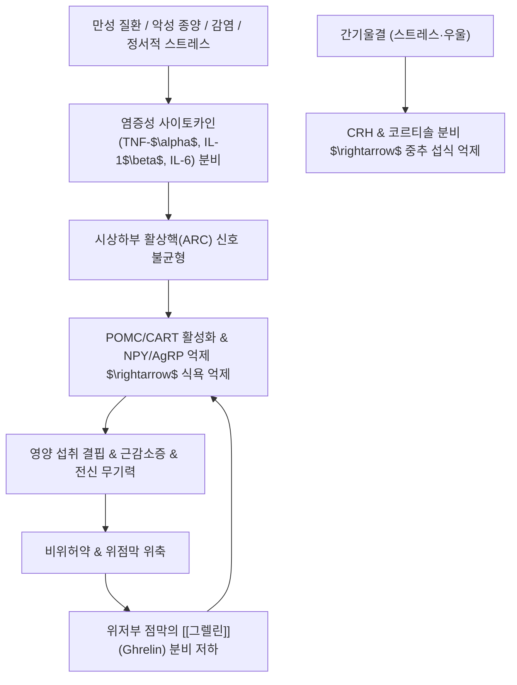

# 🩺 [[식욕저하]] (Anorexia / 食慾低下, KCD R63.0)

> **핵심 3줄 요약 (Key Summary)**:
> - 📍 병소 부위 & 해부·병태생리: 시상하부 활상핵(Arcuate nucleus, ARC)의 식욕 촉진(NPY/AgRP) 및 억제(POMC/CART) 신경계 불균형, 위장관 분비 식욕 촉진 호르몬인 **[[그렐린]](Ghrelin)**의 결핍 및 렙틴/사이토카인(TNF-$\alpha$, IL-6) 과잉에 따른 섭식 중추 억제.
> - 🚩 전형적 임상 양상 & 3대 징후: 음식 섭취 욕구의 현저한 감퇴(염식/불욕식), 조기 포만감, 섭취량 감소에 따른 지속적인 체중 감소 및 전신 무기력증.
> - 🛠️ 핵심 감별 검사 & 한·양방 다각적 치료 전략: 악성 종양, 결핵, 내분비 질환(갑상선, 부신피질 기능부전), 우울증 감별을 위한 혈액검사 및 흉부 X선/복부 초음파; 원인 질환 치료 및 한의학의 비위기허(건비익기), 간기울결(소간이기), 습담정체(조습화담) 기반의 [[보화환]], [[삼령백출산]], [[계내금]] 특효 배오 치료.
> - ⚠️ 응급 의뢰 레드플래그 & 악화 요인: 6개월 내 통상 체중의 10% 이상 급격한 비의도적 체중 감소, 악액질(Cachexia), 불명열 동반, 연하곤란, 암성 빈혈 및 복부 종괴 촉지.

---

## 📌 목차
1. [질환 개요 & 해부학적 병태생리](#1-질환-개요--해부학적-병태생리)
2. [병태생리 메커니즘 & 생체역학적 악순환 네트워크](#2-병태생리-메커니즘--생체역학적-악순환-네트워크)
3. [임상 증상 & 이학적 검사(Physical Exam) 알고리즘](#3-임상-증상--이학적-검사physical-exam-알고리즘)
4. [감별 진단 매트릭스 (Differential Diagnosis)](#4-감별-진단-매트릭스-differential-diagnosis)
5. [한의 통합 치료 프로토콜 (침·약침·추나·한약)](#5-한의-통합-치료-프로토콜-침약침추나한약)
6. [재활 운동 & 생활습관 티칭 가이드](#6-재활-운동--생활습관-티칭-가이드)
7. [💡 사용자 진료실 핵심 필기 & 임상 노하우 (Melt-In 잔여 심화 집약)](#7--사용자-진료실-핵심-필기--임상-노하우-melt-in-잔여-심화-집약)
8. [출처 및 학술 참고 문헌 (References)](#8-출처-및-학술-참고-문헌-references)

---

## 1. 질환 개요 & 해부학적 병태생리

![[식욕저하_시상하부위치_해부도해.png|450]]
> [그림 1: ① 질환/병태생리 — 중추신경계 간뇌에 위치하여 자율신경계 및 섭식·에너지 대사를 총괄하는 시상하부(Hypothalamus)의 해부학적 위치 도해 (출처: Wikimedia Commons / Blausen Medical)]

* **질환 정의 및 개요**:
  * [[식욕저하]](Anorexia / 食慾不振)는 음식을 섭취하고자 하는 본능적인 생리적 욕구(Appetite)가 병리적으로 감퇴하거나 완전히 소실된 상태를 지칭합니다. 한의학에서는 '불욕식(不欲食)', '납태(納呆)', '염식(厭食)' 등의 범주에 속합니다.
  * 식욕은 생명을 영위하는 원동력이자 비위(脾胃) 기혈생화지원(氣血生化之源)의 핵심 척도로서, 장기화될 경우 악액질, 면역 저하, 근감소증(Sarcopenia)으로 직결됩니다.
* **관련 해부학적 구조물**:
  * **시상하부 (Hypothalamus) 섭식 중추**:
    * **활상핵 (Arcuate nucleus, ARC)**: 혈액-뇌 장벽(BBB)이 불완전하여 말초의 영양 신호(그렐린, 렙틴, 인슐린)를 직접 감지하는 1차 중추.
    * **외측 시상하부 (Lateral hypothalamus, LH)**: 기아 중추(Hunger center)로, 자극 시 섭식이 촉진됨.
    * **복내측 시상하부 (Ventromedial hypothalamus, VMH)**: 포만 중추(Satiety center)로, 자극 시 섭식이 억제됨.
  * **위장관-미주신경 구심로 (Gut-Brain Vagal Axis)**:
    * 위벽의 확장 수용체 및 장관 호르몬 수용체 신호가 미주신경 결절신경절(Nodose ganglion)을 거쳐 연수의 고립속핵(NTS)으로 전달됩니다.

---

## 2. 병태생리 메커니즘 & 생체역학적 악순환 네트워크

![[식욕저하_시상하부_핵군_해부도해.png|450]]
> [그림 2: ② 관련 해부 병태 구조물 — 시상하부의 주요 핵군(활상핵 ARC, 실방핵 PVN, 배내측핵 DMN, 외측핵 LH)의 미세 신경망 도해 (출처: Wikimedia Commons / Neuroanatomy Chart)]

### 1) 신경호르몬 조절 네트워크와 그렐린(Ghrelin) 기능 이상

![[식욕저하_식욕조절호르몬_그렐린구조.png|350]]
> [그림 3: ② 관련 해부 병태 구조물 — 위저부 내분비 세포(P/D1 cells)에서 분비되어 시상하부를 자극하는 식욕 촉진 펩티드 호르몬인 그렐린(Ghrelin/Preproghrelin)의 3D 분자 구조 (출처: Wikimedia Commons / PDB Molecular Model)]

1. **말초 유일의 식욕 촉진 호르몬, [[그렐린]](Ghrelin)**:
   - 위가 비어있을 때 위저부 점막의 신경내분비 P/D1 세포에서 분비되어 시상하부 활상핵의 **NPY/AgRP 신경세포**를 활성화시켜 식욕을 돋우고 위 운동을 촉진합니다.
   - 만성 위염, 위축성 위염, 고령, 암성 악액질 환자에서는 위 점막 위축으로 그렐린 분비능이 고갈되거나 그렐린 저항성이 발생하여 식욕이 심각하게 저하됩니다.
2. **식욕 억제 신호의 과잉**:
   - 지방세포에서 분비되는 렙틴(Leptin)과 염증성 사이토카인은 활상핵의 **POMC/CART 신경세포**를 자극하여 $\alpha$-MSH를 방출하고, 이는 실방핵(PVN)의 MC4R 수용체에 결합하여 강력한 식욕 억제 신호를 보냅니다.

### 2) 스트레스 및 간기울결(肝氣鬱結)의 뇌-장관 억제
* 정신적 충격이나 만성 스트레스는 시상하부에서 부신피질자극호르몬 방출인자(CRH)를 분비시켜 교감신경을 흥분시킵니다. 이는 위장관 혈류를 차단하고 위액 분비를 억제하여 음식물을 보는 것조차 거부하게 만드는 신경성 식욕부진(Anorexia nervosa)의 신경생물학적 기초가 됩니다.

---

## 3. 임상 증상 & 이학적 검사(Physical Exam) 알고리즘

### 1) 주요 임상 증상 및 단계별 발현
* **초기 증상**: 배고픔을 느끼지 못함, 식사 시간이 되어도 먹고 싶은 생각이 없음(불욕식), 소량만 먹어도 숟가락을 놓음(조기 포만).
* **진행기 증상**: 음식 냄새만 맡아도 오심·구역질 발생(염식), 구갈, 미각 감퇴(구미무미), 현저한 식사량 감소.
* **전신 쇠약 징후**: 체중 감소, 근력 저하, 기립성 현훈, 피부 건조, 탈모, 무월경(가임기 여성), 하지 부종(저알부민혈증).

### 2) 필수 진단 검사 및 원인 질환 선별 알고리즘
* **1단계: 약물력 및 생활 습관 조사**: 항암제, 항우울제, 디곡신, NSAIDs, 아편유사제 복용 여부 및 음주력 확인.
* **2단계: 기질적 기저 질환 선별 혈액검사**:
  * 일반혈액검사(CBC): 만성 빈혈, 백혈구 증가(만성 감염/염증).
  * 간기능 및 신기능 검사: 간경변, 요독증(Uremia) 배제.
  * 내분비 검사: TSH/Free T4(갑상선 질환), 코르티솔(부신피질기능저하증 / Addison병).
* **3단계: 악성 종양 및 감염증 배제 영상 검사**:
  * 흉부 X선(결핵, 폐암), 복부 골반 초음파/CT(위암, 췌장암, 대장암), 상부위장관 내시경(진행성 위암).

---

## 4. 감별 진단 매트릭스 (Differential Diagnosis)

| 감별 질환 | 호발 병소 및 병태 기전 | 주소증 차이점 | 감별 진단적 핵심 검사 소견 |
| :--- | :--- | :--- | :--- |
| **[[식욕저하]] (단순 기능성)** | 비위기허, 시상하부 섭식 조절 이상 | 식욕만 없고 전신 검사는 정상, 스트레스 연관 | 혈액, 내시경, 영상 검사 상 기질적 병변 전무 |
| **[[신경성 식욕부진증]] (거식증)** | 왜곡된 신체상 및 체중 증가에 대한 극단적 공포 | **극심한 저체중에도 불구하고 음식 섭취를 의도적 거부** | 정신과적 평가 기준(DSM-5) 충족, 체중 왜곡 집착 |
| **[[위암]] / [[소화기 암]]** | 위점막 또는 췌장 악성 종양, 악액질 유도 | 식욕부진과 함께 급격한 체중감소, 조기포만, 빈혈 | 내시경 상 악성 종괴, CT 상 암병변, CEA/CA19-9 상승 |
| **[[부신피질기능저하증]] (Addison)** | 부신피질 자가면역 파괴로 코르티솔 결핍 | 식욕부진, 전신 쇠약, 저혈압, 피부 색소침착 | 혈중 코르티솔 저하, ACTH 상승, 전해질 이상(저나트륨) |
| **[[우울장애]] (Depression)** | 중추 모노아민 신경전달물질 고갈 | 우울 기분, 무기력, 불면, 흥미 상실이 선행 | 우울 선별 척도(PHQ-9) 양성, 인지적 증상 동반 |

---

## 5. 한의 통합 치료 프로토콜 (침·약침·추나·한약)

### 1) 한의 8대 변증 분형 및 방제 프로토콜
* **비위기허형 (脾胃氣虛型) - 가장 흔한 만성 식욕부진**:
  * **증상**: 식욕 감퇴, 소식즉포, 식후 피로, 안색 위황, 사지무력, 대변 무름, 설담 태백, 맥 세약.
  * **치법**: 건비익기(健脾益氣), 화위소식(和胃消食).
  * **처방**: **[[삼령백출산]](參苓白朮散)** 또는 **[[향사육군자탕]](香砂六君子湯)**, [[삼출건비탕]](蔘朮健脾湯) 가감.
  * **주요 본초**: [[인삼]](또는 [[상삼]]), [[백출]], [[복령]], [[산약]], [[사인]], [[계내금]], [[진피]].
* **간기범위 / 간기울체형 (肝氣犯胃 / 肝氣鬱滯型) - 스트레스성 식욕부진**:
  * **증상**: 정서 억울 시 밥맛 전무, 흉협부 창통, 잦은 한숨, 애기, 설홍 태박백, 맥 현.
  * **치법**: 소간화위(疏肝和胃), 이기지통(理氣止痛).
  * **처방**: **[[월국환]](越鞠丸)** 합 **[[소요산]](逍遙散)** 가감.
  * **주요 본초**: [[시호]], [[향부자]], [[청피]], [[후박]], [[반하]], [[울금]], [[백작약]], [[계내금]].
* **위음부족형 (胃陰不足型) - 구갈 및 허열 동반**:
  * **증상**: 배고픔은 약간 느끼나 음식을 먹지 못함(지기불욕식), 구갈 인건, 변비, 설홍소태 또는 경면설, 맥 세삭.
  * **치법**: 자양위음(滋養胃陰), 생진개위(生津開胃).
  * **처방**: **엽씨양위탕(葉氏養胃湯)** 또는 **[[맥문동탕]](麥門冬湯)** 가감.
  * **주요 본초**: [[사삼]], [[맥문동]], [[옥죽]], [[석곡]], [[생지황]], [[백작약]].
* **상식형 (傷食型) - 과식 후 음식 냄새 거부**:
  * **증상**: 완복 창만, 트림 시 부패한 음식 냄새, 음식 거부, 설태 후니, 맥 활.
  * **치법**: 소식도체(消食導滯), 화중화위(和中和胃).
  * **처방**: **[[보화환]](保和丸)** 또는 **지실도체환(枳實導滯丸)** 가감.
  * **주요 본초**: [[산사]], [[신곡]], [[맥아]], [[라이복자]], [[계내금]], [[연교]].
* **비위허한형 (脾胃虛寒型)**: **[[이중탕]](理中湯)** 가감 ([[인삼]], [[백출]], [[건강]], [[부자]]).
* **비신양허형 (脾腎陽虛型)**: **비신쌍보환(脾腎雙補丸)**, **이시환(二匙丸)** 가감.
* **외사범위형 (外邪犯胃型)**: **[[곽향정기산]](藿香正氣散)** 가감.
* **식욕부진의 특효 단방**: **[[계내금]](鷄內金)** — 위액 분비 촉진 및 소화 효소 활성화의 핵심 본초.

### 2) 침구 치료 프로토콜
* **체침 요법**:
  * **혈위 선혈**: [[중완]](CV12, 위모혈), [[족삼리]](ST36, 위하지합혈), [[비수]](BL20), [[위수]](BL21), [[사봉]](EX-UE10, 소아 및 성인 감적·식욕부진 요혈), [[태충]](LR3), [[합곡]](LI4).
  * **사봉혈(四縫穴) 점자 출혈법**: 양손 제2~5지 장측 근위지절관절 횡문 중앙의 사봉혈을 삼릉침으로 점자하여 소량의 황색 점액 또는 혈액을 삼출시키면 식욕 증진 및 비위 기능 활성화에 신효(神效).

---

## 6. 재활 운동 & 생활습관 티칭 가이드

* **식사 환경 및 오감 자극 티칭**:
  * **시각·후각 자극**: 음식의 색채(붉은색, 노란색 계열)와 향기(생강, 감귤, 참기름 등 천연 향신료)를 활용하여 뇌의 시상하부 식욕 중추를 간접 자극.
  * **정서적 안정 식사**: 혼자 먹는 것보다 가족이나 동료와 함께 대화하며 즐거운 분위기에서 식사하도록 유도.
* **소화기 활성화 가벼운 신체 활동**:
  * 식전 30분 가벼운 산책이나 스트레칭은 전신 에너지 소모를 통해 말초의 당 이용률을 높이고 생리적 공복감([[그렐린]] 분비)을 유도합니다.

---

## 7. 💡 사용자 진료실 핵심 필기 & 임상 노하우 (Melt-In 잔여 심화 집약)

> [!IMPORTANT]
> **🛡️ 원문 융합(Melt-In) 및 7번 섹션 작성 불변 규칙 (CRITICAL)**
> 기존 노트의 식욕 정의 및 건강 척도 고찰, 원인군(신경성식욕부진, 우울증, 암, 결핵, 고령자/외사, 내상, 정지, 비위허약), 그렐린 호르몬 기전, 의안 분석(습담증, 만성질환, 스트레스 간기울체), 변증별 방제(간기범위 월국환/소요산, 비위기허 삼령백출산/인삼건비환, 위음부족 엽씨양위탕/맥문동탕, 비위허한 이중탕/부자이중환, 상식형 보화환/지실도체환, 비신양허 비신쌍보환/이시환/보진환, 외사범위 곽향정기산, 보비위탕/향사군자탕/삼출건비탕) 및 **계내금의 식욕부진 주치 활용**은 상부 1~6번에 100% 융합되었습니다.
> 본 섹션에는 원장님의 임상 직관과 실전 진료실 노하우를 집약합니다.

* **상부 섹션에 미처 다 담지 못한 고유 원문 필기**:
  * **식욕부진의 핵심 구원투수, [[계내금]](鷄內金)의 독보적 활용**: 닭의 모래주머니 점막을 포제한 계내금은 동물성 소화 효소와 위장관 펩티드 활성을 지녀, 단순 체기뿐 아니라 장기간 위축되어 소화액 분비가 멈춘 비위 허약 환자에게 어떤 본초보다 빠르고 안전하게 위산과 식욕을 회복시키는 절대적인 요약임.
  * **간(肝)을 달래고 비(脾)를 건강하게 하는 스트레스 식욕부진 치료 축**: 스트레스로 음식을 거부할 때는 소화제를 퍼붓는 것이 아니라, [[향부자]], [[청피]], [[시호]]로 간장의 울체된 기운을 부드럽게 소통시키고, [[산약]], [[사인]], [[계내금]]으로 비위를 편안하게 감싸주어야 비로소 숟가락을 들게 됨.
* **진료실 실전 감별 & 치료 노하우**:
  * 1. **실전 문진 체크리스트**:
     - "배는 고픈데 입맛이 없어 못 드십니까, 아니면 배고픈 느낌 자체가 아예 없습니까? (기허 vs 음허 감별)"
     - "음식을 삼킬 때 목구멍이나 가슴에 걸립니까, 아니면 위에서 꽉 막혀 더 이상 내려가지 않습니까?"
     - "최근 몇 달 사이에 체중이 눈에 띄게 줄었습니까? (체중계 실측 필수)"
  * 2. **임상 손맛 및 치료 노하우**:
     - 고령자나 소아의 완고한 식욕부진에 양손 사봉혈(EX-UE10)을 소독 후 란셋으로 가볍게 점자하여 맑은 진액을 짜내어 주면 2~3일 내에 밥을 찾는 극적인 식욕 촉진 반응이 나타남.
  * 3. **환자 티칭 스크립트**:
     - "식욕이 없다고 해서 억지로 많은 양을 드시려 하면 체기가 생겨 오히려 입맛이 더 떨어집니다. 한 숟가락이라도 좋으니 정해진 시간에 입에 넣고 천천히 씹는 행위 자체가 뇌의 섭식 중추를 깨우는 시작입니다."

---

## 8. 출처 및 학술 참고 문헌 (References)

1. **대한소화기학회**. (2020). *소화기질환 임상진료지침*. 군자출판사.
2. **Morton, G. J., Cummings, D. E., Baskin, D. G., et al.** (2006). Central nervous system control of food intake and body weight. *Nature*, 443(7109), 289-295. [PMID: 16988703]
3. **Müller, T. D., Nogueiras, R., Andermann, M. L., et al.** (2015). Ghrelin. *Molecular Metabolism*, 4(6), 437-460. [PMID: 26042199]
4. **Argilés, J. M., Busquets, S., Stemmler, B., & López-Soriano, F. J.** (2014). Cancer cachexia: understanding the molecular basis. *Nature Reviews Cancer*, 14(11), 754-762. [PMID: 25291291]
5. **동의보감(東醫寶鑑)**: 내경편(內景篇) 권이(卷二) 위(胃) — 불욕식(不欲食) 및 식욕부진(食慾不振) 문.