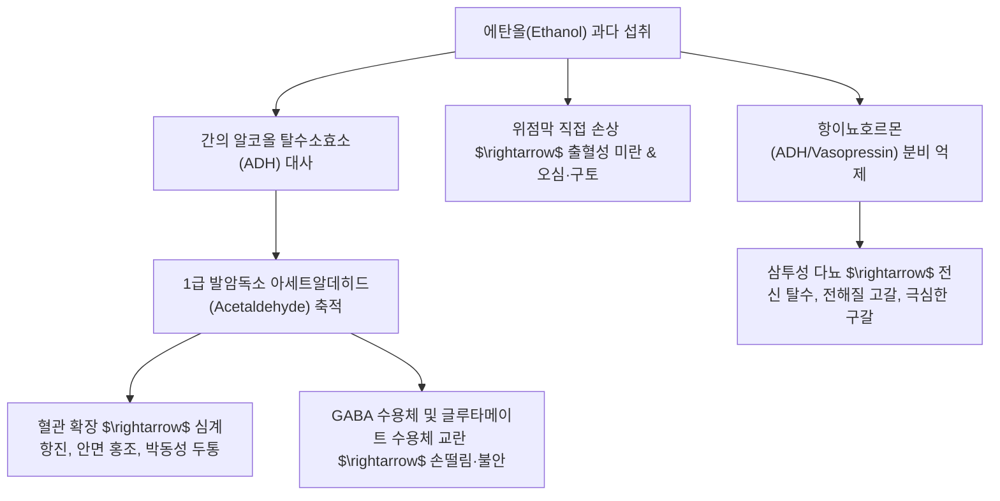

# 🩺 [[주상]] (Alcohol-Induced Injury / 酒傷, KCD K29.2 / K70)

> **핵심 3줄 요약 (Key Summary)**:
> - 📍 병소 부위 & 해부·병태생리: 알코올(에탄올) 및 그 독성 대사산물인 **아세트알데히드(Acetaldehyde)**의 축적에 따른 위점막 모세혈관 파괴(급성 알코올성 위염)와 간세포 미토콘드리아 산화 스트레스(알코올성 간질환), 뇌혈관 확장 및 탈수·전해질 불균형.
> - 🚩 전형적 임상 양상 & 3대 징후: 숙취(Hangover), 심한 갈증(번갈), 안면 홍조 및 두통, 오심·구토, 사지무력, 수전증(손떨림), 농축된 붉은 소변(소변단적).
> - 🛠️ 핵심 감별 검사 & 한·양방 다각적 치료 전략: 간기능 검사(AST/ALT, $\gamma$-GTP), 상부위장관 내시경(출혈성 위염 배제); 수액 요법(포도당·비타민 B1 티아민 보충), 한의학의 **발산한출(發散汗出) 및 이소변(利小便)** 원칙에 입각한 [[갈화해성탕]], [[신선불취단]], [[주증황련환]] 해독 치료.
> - ⚠️ 응급 의뢰 레드플래그 & 악화 요인: 극심한 반복 구토 후 선홍색 토혈(Mallory-Weiss 증후군 식도 점막 열상), 급성 알코올성 간염/간부전(황달, 복수), 알코올 금단 섬망(Delirium tremens: 환각, 전신 경련, 고열), 베르니케 뇌병증(안구진탕, 운동실조, 의식혼탁).

---

## 📌 목차
1. [질환 개요 & 해부학적 병태생리](#1-질환-개요--해부학적-병태생리)
2. [병태생리 메커니즘 & 생체역학적 악순환 네트워크](#2-병태생리-메커니즘--생체역학적-악순환-네트워크)
3. [임상 증상 & 이학적 검사(Physical Exam) 알고리즘](#3-임상-증상--이학적-검사physical-exam-알고리즘)
4. [감별 진단 매트릭스 (Differential Diagnosis)](#4-감별-진단-매트릭스-differential-diagnosis)
5. [한의 통합 치료 프로토콜 (침·약침·추나·한약)](#5-한의-통합-치료-프로토콜-침약침추나한약)
6. [재활 운동 & 생활습관 티칭 가이드](#6-재활-운동--생활습관-티칭-가이드)
7. [💡 사용자 진료실 핵심 필기 & 임상 노하우 (Melt-In 잔여 심화 집약)](#7--사용자-진료실-핵심-필기--임상-노하우-melt-in-잔여-심화-집약)
8. [출처 및 학술 참고 문헌 (References)](#8-출처-및-학술-참고-문헌-references)

---

## 1. 질환 개요 & 해부학적 병태생리

![[주상_알코올남용_Wellcome_역사화.jpg|450]]
> [그림 1: ① 질환/병태생리 — 만성적인 알코올 과음과 남용이 신체 및 가정에 미치는 병리적 폐해를 묘사한 역사적 의학 사료 도판 (출처: Wikimedia Commons / Wellcome Collection)]

* **질환 정의 및 개요**:
  * [[주상]](酒傷)은 과도한 음주(폭음, 만성 다량 음주)로 인해 알코올의 습열독(濕熱毒)이 위장, 간담, 심신(心神)에 침범하여 발생하는 일체의 신체적·정신적 병증을 포괄합니다.
  * 현대의학의 **급성 알코올 중독 및 숙취(Veisalgia / Alcohol Hangover)**, **알코올성 위염**, **알코올성 간질환(지방간, 간염, 간경변)** 및 **알코올 유발성 자율신경 실조증**에 상응합니다.
* **관련 해부학적 구조물**:
  * **위 점막 장벽**: 에탄올은 지용성 분자로서 위 점막의 인지질 이중층을 직접 용해시키고 점막 미세혈관을 수축시켜 광범위한 삼출성 점막하 출혈을 유발합니다.
  * **간소엽(Hepatic lobule)과 미토콘드리아**: 간세포 내 알코올 탈수소효소(ADH)와 CYP2E1 효소계가 과부하되어 활성산소종(ROS)과 지질 과산화물이 대량 생성됩니다.

---

## 2. 병태생리 메커니즘 & 생체역학적 악순환 네트워크

![[주상_숙취_안면홍조_아세트알데히드.jpg|450]]
> [그림 2: ② 관련 해부 병태 구조물 — 알코올 섭취 후 간의 ALDH2 결핍으로 혈중 아세트알데히드가 축적되어 발생하는 아시안 플러시(Asian flush, 혈관 확장 및 안면 홍조) 임상 소견 (출처: Wikimedia Commons)]

### 1) 아세트알데히드 독성과 유전적 감수성
* 에탄올은 간에서 ADH에 의해 독성 물질인 **아세트알데히드(Acetaldehyde)**로 산화된 후, 아세트알데히드 탈수소효소(ALDH2)에 의해 무독한 아세트산(Acetate)으로 최종 분해됩니다.
* 한국인을 포함한 동아시아인의 약 30~40%는 **ALDH2 유전자 돌연변이(Glu504Lys)**로 인해 효소 활성이 결핍되어 있습니다. 이들은 소량의 음주로도 아세트알데히드가 분해되지 못하고 체내에 급격히 축적되어 격심한 두통, 홍조, 오심, 빈맥 및 주상(숙취)을 겪게 됩니다.

### 2) 갈화(葛花)의 아세트알데히드 분해 촉진 본초학

![[주상_갈화해성탕_갈화_칡꽃_생약.jpg|400]]
> [그림 3: ③ 한의 치료/본초 — 칡의 꽃 봉오리로서 ADH 및 ALDH 활성을 촉진하여 주독(酒毒)을 풀고 갈증을 해소하는 대표 해정 본초인 갈화(Pueraria lobata flower) (출처: Wikimedia Commons / Medical Botany)]

* 주상의 치료에서 핵심적인 본초는 칡의 꽃인 **[[갈화]](葛花)**입니다. 갈화에 함유된 이소플라본(Puerarin, Daidzein 등) 성분은 간의 알코올 대사 효소를 유도하고 위장관 점막의 알코올 흡수를 지연시켜 숙취와 주독을 신속히 해독합니다.

---

## 3. 임상 증상 & 이학적 검사(Physical Exam) 알고리즘

### 1) 전형적 임상 증상군
* **두경부 및 신경계**: 깨질 듯한 박동성 두통, 어지럼증(현훈), 눈이 침침하고 잘 안 보임, 인지 집중력 저하, 수전증(손떨림), 불면 및 불안.
* **소화기계**: 심와부 작열통, 오심, 헛구역질, 담즙성 구토, 식욕부진, 잦은 트림, 설사.
* **전신 및 비뇨기계**: 불타는 듯한 갈증(번갈, 煩渴), 전신 사지무력, 온몸의 땀, 짙고 붉은 소변(뇨적, 尿赤).

### 2) 필수 진단 검사 및 이학적 검사
* **혈액 화학 검사**: AST, ALT(AST/ALT 비율 > 2는 알코올성 간 손상의 특징적 지표), $\gamma$-GTP(알코올 남용의 민감한 표지자), 혈청 전해질(저칼륨혈증, 저마그네슘혈증 확인).
* **상부위장관 내시경**: 구토 후 토혈 시 Mallory-Weiss 식도 점막 열상 또는 급성 출혈성 위염 배제.

---

## 4. 감별 진단 매트릭스 (Differential Diagnosis)

| 감별 질환 | 호발 병소 및 병태 기전 | 주소증 차이점 | 감별 진단적 핵심 검사 소견 |
| :--- | :--- | :--- | :--- |
| **[[주상]] (급성 숙취)** | 아세트알데히드 축적, 탈수 | 음주 다음 날 두통, 구갈, 오심, 24시간 내 자연 호전 | 음주력 뚜렷, 수액 및 해장 후 증상 즉시 호전 |
| **[[Mallory-Weiss 증후군]]** | 격렬한 구토로 위식도접합부 점막 열상 | 음주 구토 후 분출성 선홍색 토혈 발생 | 상부위장관 내시경 상 식도하부 종방향 점막 파열 관찰 |
| **급성 알코올성 [[간염]]** | 간세포 대량 괴사 및 지방 침윤 | 황달, 우상복부 둔통, 발열, 간종대, 복수 | AST/ALT 현저 상승(>2:1), 빌리루빈 상승 |
| **알코올 금단 섬망 (DT)** | 만성 음주 중단 48~72시간 후 자율신경 폭풍 | 환시, 환청, 극심한 진전, 의식 혼탁, 발열 | 진단 기준 충족, 응급 중환자실 집중 치료 요함 |
| **[[급성 위염]] (비알코올성)** | 진통소염제, 스트레스, 식체 | 음주력 없이 발생하는 심와부 통증 및 소화장애 | 음주력 음성, 약물력 또는 식이 인과관계 |

---

## 5. 한의 통합 치료 프로토콜 (침·약침·추나·한약)

### 1) 한의 2대 치료 원칙: 발산한출(發散汗出) & 이소변(利小便)
* 주독(酒毒)은 기운이 뜨겁고 독성이 강하므로, **땀을 내어 위로 흩어버리거나(發汗) 소변을 잘 나오게 하여 아래로 빼내는 것(利小便)**이 동의보감 이래의 불변의 대원칙입니다.
* **주요 방제 프로토콜**:
  1. **[[갈화해성탕]](葛花解酲湯) - 주상의 대표 표준 처방**:
     - **적응증**: 음주 과다로 인한 두통, 어지럼증, 번갈, 오심구토, 소변불리.
     - **조성**: [[갈화]], [[백두구]], [[사인]], [[신곡]], [[건강]], [[청피]], [[진피]], [[백출]], [[복령]], [[택사]], [[저령]], [[인삼]], [[맥아]].
  2. **[[신선불취단]](神仙不醉丹)**: 음주 전후 복용하여 간의 주독 축적을 예방하고 해독을 촉진하는 명방.
  3. **[[주증황련환]](酒蒸黃連丸)**: 주열(酒熱)이 심하여 눈이 충혈되고 입안이 쓰며 가슴이 답답하고 코피나 흑변이 나올 때 열독을 내림.
  4. **[[소달건비탕]](消疸健脾湯)**: 주독으로 인해 소화불량, 가슴 답답함, 간기울결 및 간기범위가 동반될 때 간담습열을 내리고 비위를 건전하게 함.

### 2) 침구 치료 프로토콜
* **체침 요법**:
  * **혈위 선혈**: [[중완]](CV12), [[족삼리]](ST36), [[내관]](PC6, 구토 억제), [[태충]](LR3, 간경 원혈-해독), [[양릉천]](GB34), [[수구]](GV26, 주독 혼미 각성), [[솔곡]](GB8, 숙취 편두통 요혈).
  * **음릉천(SP9) 및 수천(KI5)**: 수액 대사를 활성화하여 소변으로 알코올 대사산물 배출을 촉진.

---

## 6. 재활 운동 & 생활습관 티칭 가이드

* **수분 및 전해질 급속 보충 티칭**:
  * 음주 후에는 알코올의 이뇨 작용으로 심각한 탈수 상태이므로, 꿀물(과당 보충으로 알코올 분해 가속), 이온음료, 북어국(아미노산 메티오닌 풍부), 콩나물국(아스파라긴산 풍부)을 적극 음용.
* **사우나 및 무리한 운동 절대 금기**:
  * 술 마신 다음 날 땀을 빼겠다고 뜨거운 사우나에 들어가는 것은 탈수를 극도로 악화시켜 뇌경색이나 심장마비를 유발할 수 있으므로 절대 엄금.
* **간 회복기 보장**:
  * 손상된 간세포의 회복을 위해 최소 48~72시간 동안은 완전 금주(휴간일, 休肝日)를 지키도록 교육.

---

## 7. 💡 사용자 진료실 핵심 필기 & 임상 노하우 (Melt-In 잔여 심화 집약)

> [!IMPORTANT]
> **🛡️ 원문 융합(Melt-In) 및 7번 섹션 작성 불변 규칙 (CRITICAL)**
> 기존 노트의 주상 정의(술에 의한 내상), 원인(음주 과다, 폭음주), 증상(숙취, 눈이 잘 안 보임, 정신 없음, 갈증, 뇨적, 사지무력, 오심구토, 손발떨림), 치료 대원칙(발산한출, 리소변), 5대 대표 방제([[갈화해성탕]], [[주증황련환]], [[신선불취단]], [[소달건비탕]], [[간담습열방]]), 소달건비탕의 간기울결·간기범위 기능성 소화불량 활용 고찰은 상부 1~6번에 100% 융합되었습니다.
> 본 섹션에는 원장님의 임상 직관과 실전 진료실 노하우를 집약합니다.

* **상부 섹션에 미처 다 담지 못한 고유 원문 필기**:
  * **주상 치료의 양대 통로, 땀(汗)과 소변(尿)의 배출 묘미**: 주독은 형체가 없는 수열(水熱)의 독이므로, 상초의 독은 [[갈화]], [[백두구]]로 피부 땀구멍을 열어 기화(氣化)시키고, 하초의 독은 [[택사]], [[저령]], [[복령]]으로 방광 소변길을 열어 씻어내리는 2방향 배출이 완벽히 조화되어야 숙취가 1시간 내로 풀림.
  * **간담습열과 비위실조가 겹친 만성 주독 환자에 소달건비탕(消疸健脾湯) 활용**: 만성 음주로 명치가 늘 더부룩하고 가슴이 답답하며 얼굴이 누렇고 술이 깨지 않는 환자에게, 단순 해장약을 넘어 간을 소통시키고 비장의 운화력을 살려주는 소달건비탕의 독보적 임상 가치.
* **진료실 실전 감별 & 치료 노하우**:
  * 1. **실전 문진 체크리스트**:
     - "토할 때 피가 섞여 나오거나 커피 찌꺼기 같은 검은 물질을 토하셨습니까? (식도 점막 열상 감별)"
     - "손이 덜덜 떨리거나 헛소리가 들리고 불면증이 심합니까? (알코올 금단 징후 감별)"
     - "술 마신 후 며칠 동안 눈 흰자위가 노랗게 변하지 않았습니까?"
  * 2. **임상 손맛 및 치료 노하우**:
     - 숙취로 머리가 깨질 듯 아프고 속이 뒤집힐 때 솔곡(GB8)과 내관(PC6)에 사법으로 자침하고 갈화해성탕 엑스제를 온수에 타서 복용시키면 즉각적인 혈관 안정과 구토 진정 효과 발현.
  * 3. **환자 티칭 스크립트**:
     - "술독을 푸는 가장 좋은 약은 물과 휴식입니다. 커피나 에너지음료로 억지로 각성시키려 하지 마시고, 따뜻한 꿀물과 전해질 음료로 빠져나간 수분을 충분히 채워주셔야 간이 알코올을 해독할 수 있습니다."

---

## 8. 출처 및 학술 참고 문헌 (References)

1. **대한간학회**. (2020). *알코올성 간질환 진료지침*. 대한간학회지.
2. **Swift, R., & Davidson, D.** (1998). Alcohol hangover: mechanisms and mediators. *Alcohol Health and Research World*, 22(1), 54-60. [PMID: 15706734]
3. **Penning, R., McKinney, A., & Verster, J. C.** (2012). Alcohol hangover symptoms and their contribution to the overall hangover severity. *Alcohol and Alcoholism*, 47(3), 248-252. [PMID: 22434663]
4. **동의보감(東醫寶鑑)**: 잡병편(雜病篇) 권이(卷二) 내상(內傷) — 주상(酒傷) 병기 및 갈화해성탕 치법.