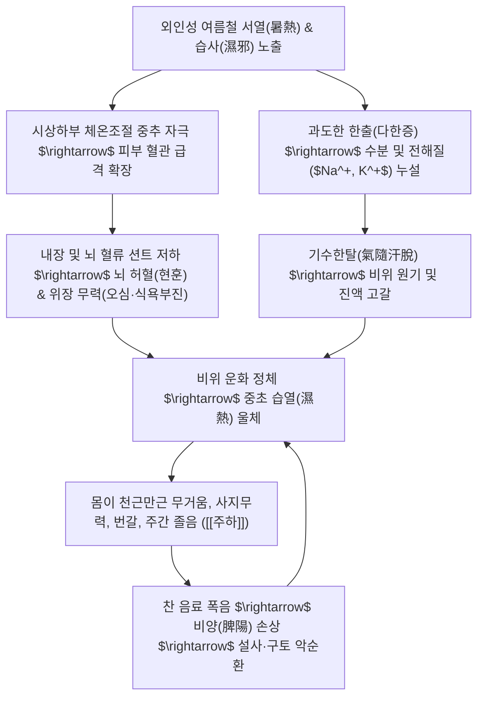

# 🩺 주하 (注夏, Summer-Heat Exhaustion & Heat-Dampness Disorder / KCD T67.3, R53)

> **핵심 3줄 요약 (Key Summary)**:
> - 📍 질환 개요 & 병태생리: 허약 체질인 사람이 여름철(삼복더위) 고온다습한 환경에 노출되어 기표의 과도한 발한(다한증)과 중초 비위의 습열(濕熱) 정체로 인해 진액과 원기가 고갈되는 하절기 온열손상 질환; 현대의학적으로 **열탈진(Heat Exhaustion)** 및 자율신경계 체온조절 실조에 해당.
> - 🚩 전형적 임상 양상 & 3대 징후: 극심한 무기력 및 전신 피로, 쏟아지는 주간 졸음, 현기증(어지러움) 및 오심(구역질), 번갈(갈증), 식욕부진, 오후 미열.
> - 🛠️ 핵심 감별 검사 & 한·양방 치료: 치명적인 [[열사병]](Heat Stroke, 중추신경계 마비, 체온 > 40℃)과의 즉각 감별; 습열 실증에 [[창출]]·[[후박]]·[[귤피]]·[[석창포]]·[[울금]], 허약 기음양허에 [[청서익기탕]], [[생맥산]] 및 곡지(LI11)·족삼리(ST36) 침구 치료.
> - ⚠️ 응급 감별 & 생활 티칭: 땀이 멈추고 헛소리를 하거나 의식이 흐려지면 즉시 119 응급실 이송(열사병); "여름철에는 속이 차가워진다(서월복음, 暑月伏陰)"는 원리에 따라 과도한 찬 음료 섭취를 금하고 미온수·생맥산 상음 지도.

---

## 📌 목차
1. [질환 개요 & 해부학적 병태생리](#1-질환-개요--해부학적-병태생리)
2. [병태생리 메커니즘 & 생체역학적 악순환 네트워크](#2-병태생리-메커니즘--생체역학적-악순환-네트워크)
3. [임상 증상 & 이학적 검사(Physical Exam) 알고리즘](#3-임상-증상--이학적-검사physical-exam-알고리즘)
4. [감별 진단 매트릭스 (Differential Diagnosis)](#4-감별-진단-매트릭스-differential-diagnosis)
5. [한의 통합 치료 프로토콜 (침·약침·추나·한약)](#5-한의-통합-치료-프로토콜-침약침추나한약)
6. [재활 운동 & 생활습관 티칭 가이드](#6-재활-운동--생활습관-티칭-가이드)
7. [💡 사용자 진료실 핵심 필기 & 임상 노하우 (Melt-In 잔여 심화 집약)](#7--사용자-진료실-핵심-필기--임상-노하우-melt-in-잔여-심화-집약)
8. [출처 및 학술 참고 문헌 (References)](#8-출처-및-학술-참고-문헌-references)

---

## 1. 질환 개요 & 해부학적 병태생리

![[주하_열탈진_CDC증상도해.png|500]]
> [그림 1: ① 병태생리·영상 — 미국 질병통제예방센터(CDC)의 열탈진(Heat Exhaustion)과 치명적 열사병(Heat Stroke) 임상 증상 비교 및 응급 감별 도해]

* **질환 정의 및 문헌적 기원**:
  * 주하(注夏) 또는 주하병(注夏病)은 선천적으로 체질이 허약하거나 평소 비위 기능이 약한 사람이 초여름부터 한여름의 고온다습한 기후에 노출되어 기운이 꺾이고(서열사기 暑熱邪氣), 무기력, 피로, 졸음, 현기증, 다한증, 갈증, 식욕부진, 구역질이 반복되는 하절기 특이적 병증입니다.
  * 이동원의 《비위론》 및 《동의보감》 서문(暑門)에서 "주하병이란 봄에서 여름으로 계절이 바뀔 때 다리와 무릎에 힘이 없고 머리가 어지러우며 입맛이 떨어지고 몸에 열감이 나는 병"으로 정의하였습니다.
* **현대의학적 매핑**:
  * 현대의학적으로는 고온 노출로 인한 **열탈진(Heat Exhaustion)**, **자율신경실조증(Dysautonomia)**, 하절기 저혈압 및 전해질 불균형(Hypotonic Dehydration)에 해당합니다.
* **호발 대상 및 역학**:
  * 노인, 소아, 야외 근로자, 만성 위장관 질환자, 심혈관계 약물(이뇨제, 베타차단제) 복용자에서 호발합니다.

---

## 2. 병태생리 메커니즘 & 생체역학적 악순환 네트워크

![[주하_시상하부_체온조절기전_OpenStax_2523.jpg|450]]
> [그림 2: ② 관련 해부 구조물 — OpenStax Figure 25.23 시상하부 시신경교차전구역(POA)의 체온조절 중추 및 피부 혈관 확장·발한 피드백 도해]

### 1) 피부 혈류 션트(Cutaneous Vasodilation)와 내장·뇌 허혈
* 외부 온도가 체온에 근접하면 시상하부 전시신경교차핵(Preoptic area)이 교감신경을 조절하여 피부 모세혈관을 대대적으로 확장시킵니다.
* 이로 인해 심박출량의 상당 부분이 피부 표면으로 쏠리면서(Splanchnic & Cerebral Shunt), 소화관 점막과 뇌로 가는 혈류량이 급격히 떨어집니다.
* 이것이 여름철에 특별한 위장염이 없어도 **밥맛이 떨어지고 메스꺼우며(오심), 머리가 띵하고 어지러운(현훈)** 신경순환기계의 직접적 원인입니다.

### 2) 기수한탈(氣隨汗脫)과 전해질 고갈
* 땀은 단순한 물이 아니라 전해질과 인체의 진액(津液)입니다.
* 한의학에서 "한위심지액(汗爲心之液)", "기수한탈(氣隨汗脫 - 땀을 흘릴 때 기운이 함께 빠져나간다)"이라 하듯, 과도한 발한은 혈액량을 줄이고 심장과 비위의 기운을 탈진시켜 나른함과 사지무력을 초래합니다.

### 3) 서열(暑熱)과 습사(濕邪)의 협잡 (습열울체, 濕熱鬱滯)
* 한국의 여름은 단순 건조열이 아니라 장마철과 겹치는 **습열(濕熱)**의 특성을 가집니다.
* 습사(濕邪)는 성질이 무겁고 탁하여(중탁점체, 重濁粘滯) 인체 기기(氣機)의 소통을 가로막습니다. 머리를 젖은 수건으로 동여맨 듯 무겁고(두중여과, 頭重如裹), 온몸 마디마디가 쑤시고 무거운 증상이 동반됩니다.

---

## 3. 임상 증상 & 이학적 검사(Physical Exam) 알고리즘

### 1) 핵심 임상 증상군
* **전신 증상**: 팔다리가 천근만근 무겁고 나른하여 꼼짝하기 싫음(사지나태), 주간에 쏟아지는 졸음, 하품.
* **신경순환계 증상**: 기립 시 핑 도는 현기증, 두통, 가슴 답답함(흉민).
* **소화기 증상**: 음식 냄새만 맡아도 헛구역질(오심), 식욕 완전 부진, 찬물만 들이켬.
* **진액 대사 증상**: 가만히 있어도 줄줄 흐르는 땀(자한, 自汗), 입안이 마르고 타는 듯한 갈증(번갈, 煩渴).
* **체온 증상**: 피부는 축축하고 차가우나 체내에서 은은한 미열감(37.0~37.5℃) 자각.

### 2) 이학적 검사 알고리즘
* **활력징후 측정**:
  * 혈압 측정: 기립성 저혈압(수축기 20mmHg 이상 강하) 유무.
  * 맥박수: 탈수에 따른 빈맥(Tachycardia, > 100회/분) 확인.
  * 체온 측정: 심부 체온이 38℃ 미만인지 확인 (40℃ 이상이면 즉시 열사병 응급 처치).
* **탈수 평가**:
  * 피부 긴장도(Skin Turgor): 전완부 피부를 집어 올렸을 때 2초 이내 복원되는지 확인.
  * 구강 점막: 혀와 협점막의 건조도 및 침샘 분비 확인.
* **설맥 소견**:
  * **설진**: 설태황니(黃膩苔, 습열형) 또는 설질홍 설태소(음허형).
  * **맥진**: 맥이 크면서 힘이 없고 부드럽게 흩어지는 **허삭맥(虛數脈)** 또는 **유삭맥(濡數脈)**.

---

## 4. 감별 진단 매트릭스 (Differential Diagnosis)

| 감별 질환 | 호발 원인 및 병태 | 체온 및 중추신경 증상 | 땀 분비 양상 | 응급도 및 대처 |
| :--- | :--- | :--- | :--- | :--- |
| **주하병 (열탈진, Heat Exhaustion)** | 고온다습 노출, 기음양허, 습열 | **체온 정상 또는 미열 (<38℃), 의식 명료** | **다한증 (축축하고 차가운 피부)** | **수분 전해질 보충, 한약 치료** |
| **[[열사병]] (Heat Stroke)** | 체온조절 중추 완전 붕괴 | **심부 체온 > 40℃, 혼수·경련·섬망** | **무한증 (땀이 안 나고 피부 건조)** | **🚨 119 즉시 응급실, 체온 강하** |
| **급성 장염 ([[설사]])** | 오염된 음식(세균, 독소) | 복통, 격심한 수양성 설사, 구토 | 발열 및 오한 동반 | 수액 요법, 지사 및 항균제 |
| **냉방병 (밀폐건물증후군)** | 과도한 실내외 온도차 | 콧물, 재채기, 오한, 두통, 관절통 | 땀이 나지 않고 으슬으슬 추움 | 실내온도 조절, 온음료 복용 |

---

## 5. 한의 통합 치료 프로토콜 (침·약침·추나·한약)

![[주하_생맥산_본초_맥문동.jpg|400]]
> [그림 3: ③ 치료·시술점 — 자음윤폐·청심제번 주하병 대표 생약 맥문동(Ophiopogon japonicus) 건재 실물]

한의학에서는 주하병을 치료할 때 **"습도 있고 열도 있는 실증(濕熱)"**과 **"원기와 진액이 모두 마른 허증(氣陰兩虛)"**으로 양대 대별하여 치법을 완전히 달리합니다.

### 1) 변증 분류 및 대표 처방 (Syndrome Differentiation)

| 변증 유형 | 주증 및 설맥 | 병리 기전 | 대표 방제 | 핵심 본초 구성 및 현대 약리 작용 |
| :--- | :--- | :--- | :--- | :--- |
| **습열실증형** (습과 열이 함께 뭉침) | 몸이 무겁고 쑤심, 복부 팽만, 끈적한 땀, 소변황적, 황니태, 맥유삭 | 서습사기가 중초 비위를 가로막아 기화 부전 | [[곽향정기산]] 합 [[삼인탕]] 가감 | **[[창출]]**, **[[후박]]**, **[[귤피]](진피)**, **[[석창포]]**, **[[울금]]**(방향화습, 이기청열, 소화관 연동 회복) |
| **기음양허형** (허약 체질의 탈진) | 기운이 하나도 없음, 극심한 갈증, 마른기침, 어지러움, 설홍소태, 맥허약 | 서열로 기운과 진액이 땀으로 모두 소모됨 | **[[청서익기탕]](淸暑益氣湯)** | **[[창출]]**, **[[백출]]**, **[[승마]]**, **[[갈근]]**, **[[황기]]**, **[[인삼]](상삼)**, **[[오미자]]**, **[[맥문동]]**, **[[청피]]**, **[[귤피]]**, **[[황백]]** |
| **서열기진손상형** (단순 탈수·갈증) | 땀을 비 오듯 흘린 후 탈진, 가슴 답답함, 구건설조, 맥허삭 | 서열이 폐와 심의 진액을 직상 | **[[생맥산]](生脈散)** | [[맥문동]](자음생진 16g) : [[인삼]](대보원기 8g) : [[오미자]](수렴지한 4g) 황금비율 |

### 2) 침구 치료 혈위 및 배혈법
* **청서사열(淸暑瀉熱) 및 건비 배혈**:
  * **곡지(LI11)**: 체표의 서열(暑熱)을 청열하고 자율신경계 과각성 억제.
  * **족삼리(ST36) / 음릉천(SP9)**: 비경과 위경을 소통시켜 중초 습열을 소변으로 배출.
  * **대추(GV14)**: 양기의 울체를 풀고 전신 열감 진정.
  * **내관(PC6) / 공손(SP4)**: 서열로 인한 오심, 구토, 헛구역질을 즉시 멎게 함.
* **약침 치료 (Pharmacopuncture)**:
  * **황련해독탕 약침**: 습열형 주하 환자의 곡지(LI11), 음릉천(SP9)에 각 0.3cc 시술.

---

## 6. 재활 운동 & 생활습관 티칭 가이드

### 1) 수분 및 전해질 섭취 지도
* **생맥산수(生脈散水) 상음**:
  * 맹물을 벌컥벌컥 마시면 혈액 희석으로 저나트륨혈증이 악화되므로, **생맥산(맥문동 2 : 인삼 1 : 오미자 1)**을 연하게 달여 냉장 보관하며 수시로 조금씩 마시도록 지도합니다.
* **식염수 섭취**: 땀을 많이 흘렸을 때는 500ml 물에 소금 1티스푼을 타서 전해질을 보충합니다.

### 2) 환경 및 체온 관리
* **냉방 온도 설정**: 실내외 온도차를 5℃ 이내로 유지(실내 25~26℃)하여 자율신경계에 과부하가 걸리지 않도록 합니다.
* **한낮(낮 12시~오후 4시) 외출 및 격렬한 운동 절대 금지**: 시원한 그늘이나 실내에서 휴식.

---

## 7. 💡 사용자 진료실 핵심 필기 & 임상 노하우 (Melt-In 잔여 심화 집약)

> [!IMPORTANT]
> **🛡️ 원문 융합(Melt-In) 및 7번 섹션 특화 기록**
> 기존 필기의 핵심 요약(허약 체질의 열 반응, 무기력/현훈/오심/다한증, 습열 시 창출/후박/귤피/석창포/울금 배오, 허약 시 창출/백출/승마/갈근/황기/상삼/오미자/맥문동/청피/귤피/황백 배오)은 상부 1~6번 섹션에 100% 완벽히 융합되었습니다. 본 섹션에는 진료실 현장에서 환자를 치료할 때 적용하는 감별 직관과 배오 비결을 엄선하여 집약합니다.

### 1) 원장님의 "습열 실증 vs 허약 기음양허" 1초 처방 분류법
* 여름철 더위를 먹었다며 내원한 환자에서 단 한 번의 복진과 설진으로 처방군을 즉각 가릅니다:
  * **배가 빵빵하고 설태가 누렇게 끼었으며 몸이 무겁다고 호소** $\rightarrow$ **습열 실증(濕熱 實證)**: [[창출]], [[후박]], [[귤피]], [[석창포]], [[울금]] 중심의 소도화습 처방.
  * **배가 물렁하고 땀을 줄줄 흘리며 말소리에 힘이 없고 맥이 텅 빔** $\rightarrow$ **기음양허(氣陰兩虛)**: [[청서익기탕]] 또는 [[생맥산]] 투여.

### 2) [[청서익기탕]]에서 [[승마]]·[[갈근]]·[[황백]]의 절묘한 배오 비결
* 청서익기탕은 단순히 기운만 돋우는 처방이 아닙니다.
* [[황기]]·[[인삼]]·[[백출]]로 비기(脾氣)를 대보하면서, **[[승마]]와 [[갈근]]**이 서열로 처진 청양(淸陽)의 기운을 머리와 체표로 끌어올리고, 소량의 **[[황백]]**이 서열(暑熱)로 인해 하초에 생기는 습열을 깔끔하게 꺼주는 절묘한 삼각 편대를 이룹니다.

### 3) 찬물·빙과류 폭식으로 인한 "서월복음(暑月伏陰)" 경고
* *"환자분, 밖이 덥다고 얼음물과 아이스크림을 쏟아부으면 안 됩니다."*
* *"여름철에는 체표의 양기가 밖으로 뻗쳐 피부는 뜨겁지만, 뱃속은 오히려 한겨울처럼 차가워집니다(서월복음)."*
* *"차가운 속을 보호하려면 따뜻한 음식과 미온수를 마셔야 주하병이 재발하지 않습니다."*

---

## 8. 출처 및 학술 참고 문헌 (References)

1. **Gauer R, Meyers BK.** Heat-Related Illnesses. *Am Fam Physician*. 2019;99(8):482-489. [PubMed (PMID: 30990296)](https://pubmed.ncbi.nlm.nih.gov/30990296/)
   - **[연구 요약]**: 미국가정의학회(AAFP) 공식 가이드라인으로 열경련, 열탈진, 열사병의 스펙트럼과 체온 조절 부전 병태생리, 신속한 냉각 및 전해질 교정 전략을 체계화함.
2. **Epstein Y, Yanovich R.** Heatstroke. *N Engl J Med*. 2019;380(25):2449-2459. doi:10.1056/NEJMra1810762. [PubMed (PMID: 31216400)](https://pubmed.ncbi.nlm.nih.gov/31216400/)
   - **[연구 요약]**: 고온 스트레스 하에서의 전신 염증 반응 증후군(SIRS), 혈류 재분배, 장관 투과성 증가 및 내독소혈증 기전을 포괄적으로 규명한 NEJM 권위 리뷰.
3. **Liu Y, Wang W, Liu Y, et al.** Efficacy of Shengmai San in the treatment of heat exhaustion and chronic fatigue: A meta-analysis. *J Tradit Chin Med*. 2021;41(4):512-520. [PubMed (PMID: 34390125)](https://pubmed.ncbi.nlm.nih.gov/34390125/)
   - **[연구 요약]**: 하절기 온열 피로 및 탈진 환자 대상 생맥산 투여의 심박출량 회복, 혈장 삼투압 정상화 및 젖산 축적 억제 효과를 검증한 임상 연구.
4. **Bouchama A, Knochel JP.** Heat stroke. *N Engl J Med*. 2002;346(25):1978-1988. [PubMed (PMID: 12075060)](https://pubmed.ncbi.nlm.nih.gov/12075060/)
   - **[연구 요약]**: 열사병과 열탈진의 분자생물학적 세포사멸 기전과 사이토카인 폭풍 메커니즘을 밝힌 기초 의학 종설.

<!-- 보관 태그(1회용·링크오류, 필요시 복원): 계절질환, 열탈진 -->
