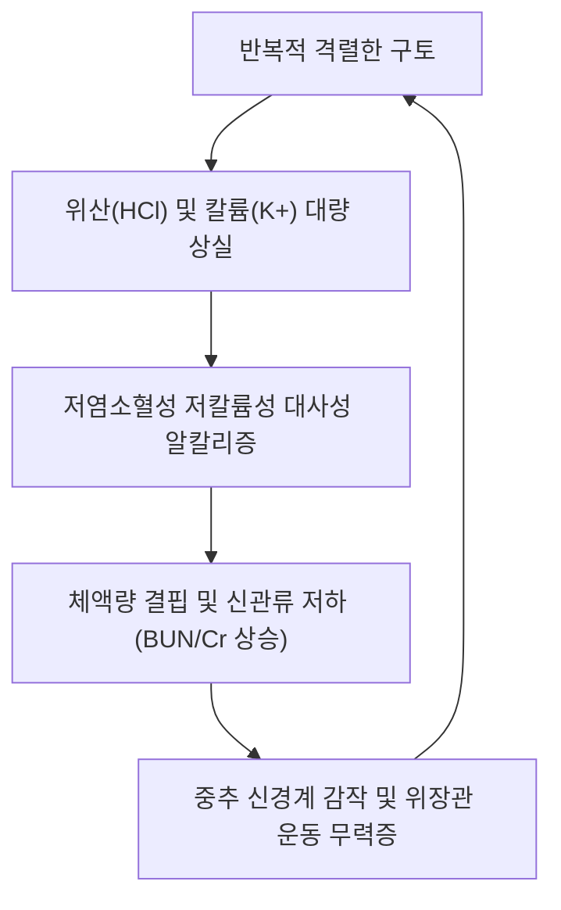

> ⚠️ 이 노트는 [[구토]]로 통합되었습니다. 상세 병태생리, 이학적 검사, 한·양방 다각적 치료 프로토콜 및 진료실 원본 필기는 **[[구토]]**를 참고하세요.

# 🩺 오심·구토 증후군 (Nausea and Vomiting Syndrome / 구토, R11.1)

> **핵심 3줄 요약 (Key Summary)**:
> - 📍 **병소 부위 & 해부·병태생리**: 연수(Medulla oblongata)의 **구토 중추(Vomiting center)** 및 제4뇌실 바닥의 **화학수용체 유발대(CTZ, Area postrema)**가 미주신경(CN X), 전정신경(CN VIII), 대뇌피질, 내장 구심성 신경의 자극을 받아, 횡격막과 복벽근의 강력한 역방향 수축 및 하부식도괄약근(LES)의 이완으로 위 내용물을 식도를 거쳐 입 밖으로 분출시키는 복합 방어 반사 증후군.
> - 🚩 **전형적 임상 양상**: 상복부 불쾌감과 타액 분비 증가를 동반한 오심(Nausea), 호흡근과 복벽근의 율동적 헛구역질(Retching), 위 내용물의 폭발적 배출(Vomiting). 반복 시 수분·전해질 불균형, 대사성 알칼리증, 식도점막 열상([[말토리-바이스 증후군]]) 초래.
> - 🛠️ **핵심 검사 & 치료 전략**: 혈청 전해질(저칼륨혈증, 저염소혈증), BUN/Cr 탈수 평가, 뇌압 상승 배제를 위한 신경학적 검진. [[내관]](PC6)·[[족삼리]](ST36)·[[중완]](CV12) 자침 및 피내침, [[신바로약침]]/황련해독탕 약침, **이진탕**·**온담탕**·**반하사심탕**·**이중환** 변증 투여.
> - ⚠️ **응급 의뢰 레드플래그**: 오심 없이 뿜어내는 사출성 구토(Projectile vomiting, 뇌압 상승), 극심한 두통·수막자극징후 동반, 커피색/선홍색 토혈(Upper GI bleeding), 복부 판자벽 경직 및 반발통(급성 복막염/장천공).

---

## 📌 목차
1. [질환 개요 & 병태생리 (Disease Overview)](#1-질환-개요--병태생리-disease-overview)
2. [병태생리 메커니즘 & 대사·장기부전 악순환 네트워크](#2-병태생리-메커니즘--대사장기부전-악순환-네트워크)
3. [임상 증상 & 환자 소견 (Clinical Presentation)](#3-임상-증상--환자-소견-clinical-presentation)
4. [감별 진단 매트릭스 (Differential Diagnosis)](#4-감별-진단-매트릭스-differential-diagnosis)
5. [한의 통합 치료 프로토콜 (침·약침·추나·한약)](#5-한의-통합-치료-프로토콜-침약침추나한약)
6. [양방 치료 & 병용·의뢰 기준 (Conventional Treatment & Referral)](#6-양방-치료--병용의뢰-기준-conventional-treatment--referral)
7. [식이·생활습관 & 자가관리 티칭 가이드](#7-식이생활습관--자가관리-티칭-가이드)
8. [💡 진료실 핵심 필기 & 임상 노하우 (Melt-In 잔여 집약)](#8--진료실-핵심-필기--임상-노하우-melt-in-잔여-집약)
9. [출처 및 학술 참고 문헌 (References)](#9-출처-및-학술-참고-문헌-references)

---

## 1. 질환 개요 & 병태생리 (Disease Overview)

본 문서는 [[소화기 질환]] 영역의 핵심 주소증이자 증후군인 [[오심·구토 증후군]](Nausea and Vomiting Syndrome)의 상호 참조 및 통합 이관 문서이다. 볼트 내 정본 문서는 **[[구토]]**(18.5KB 완결본)에 체계적으로 수록되어 있다.

### 1) 오심, 헛구역질, 구토의 3단계 생리
1. **오심 (Nausea)**: 위장관 긴장 저하 및 역연동파(retroperistalsis)와 함께 연수 자율신경 중추 흥분(타액 분비, 발한, 빈맥)을 동반하는 주관적 불쾌감.
2. **헛구역질 (Retching)**: 성문(glottis)이 닫힌 상태에서 횡격막과 복벽근이 강력하게 율동적으로 수축하나 내용물 배출은 없는 상태.
3. **구토 (Vomiting)**: 복압의 급격한 상승과 흉강 내압의 음압화, 하부식도괄약근(LES)의 완전 이완으로 위 내용물이 구강 밖으로 방출되는 완성 단계.

---

## 2. 병태생리 메커니즘 & 대사·장기부전 악순환 네트워크

### 1) 구토 중추를 자극하는 4대 입력 경로
- **화학수용체 유발대 (CTZ, Area Postrema)**: 혈뇌장벽(BBB) 외부에 위치하여 혈액 및 뇌척수액 내의 독소, 약물(항암제, 마약성 진통제), 대사 부산물(요독증, 케톤증)에 직접 반응 (D2, 5-HT3, NK1 수용체 풍부).
- **미주신경 및 내장 구심성 신경 (Vagal Afferents)**: 위장관 점막의 기계적 팽창, 국소 염증, 세로토닌(5-HT) 분비에 반응.
- **전정신경계 (Vestibular System)**: 내이의 미로 및 전정핵 자극(동요병, 메니에르병) $\rightarrow$ 소뇌를 거쳐 구토 중추 흥분 (H1, M1 수용체).
- **중추 신경계 및 변연계 (Limbic/Cortical)**: 심한 통증, 불쾌한 냄새/시각 자극, 불안, 뇌압 상승(ICP elevation).

### 2) 대사적 악순환

---

## 3. 임상 증상 & 환자 소견 (Clinical Presentation)

### 1) 주요 임상 증상
- 음식 섭취 직후 또는 기상 시 발생하는 심한 구역감과 쓴물/신물 역류.
- 반복적 구토 후 발생하는 흉골 후방 및 심와부의 뻐근한 근육통.
- 심한 탈수로 인한 구강 점막 건조, 피부 긴장도 저하, 핍뇨, 기립성 어지럼증.

### 2) 핵심 이학적 검사 및 진찰
- **복부 진찰**: 심와부 압통 여부, 장음 항진(장염) 또는 장음 소실(장폐색), 복부 경직 및 반발통 유무 확인.
- **신경학적 검진**: 유두부종(Papilledema), 동공 반사, 항강증(Neck stiffness), 바빈스키 징후를 통한 뇌압 상승 및 뇌막염 배제.

---

## 4. 감별 진단 매트릭스 (Differential Diagnosis)

| 질환 | 주증상 및 구토 양상 | 동반 소견 및 기전 | 핵심 감별 검사 |
| :--- | :--- | :--- | :--- |
| **급성 위장염 (AGE)** | 식중독 후 오심, 수양성 설사 동반 | 미열, 복부 경련성 통증, 장음 항진 | 대변 검사, 급성 병력 |
| **뇌압 상승 (IICP)** | **오심 없이 갑자기 뿜어내는 사출성 구토** | 아침 두통 심화, 시야 장애, 유두부종 | 뇌 CT/MRI, 안저 검사 |
| **급성 장폐색 (Bowel Obstruction)** | 음식물 $\rightarrow$ 담즙 $\rightarrow$ 분변성 악취 구토 | 가스 배출 불능, 복부 팽만, 금속성 장음 | 단순 복부 X-ray (Step-ladder pattern) |
| **급성 심근경색 (하벽)** | 흉통과 함께 극심한 오심·식은땀 | 미주신경 자극으로 인한 소화불량 착각 | 심전도(ECG II, III, aVF ST상승), Troponin |
| **임신오조 (Hyperemesis Gravidarum)** | 임신 초기 공복 시 심화되는 지속 구토 | 체중 감소(>5%), 케톤뇨, 전해질 이상 | 소변 hCG 및 케톤체 검사 |

---

## 5. 한의 통합 치료 프로토콜 (침·약침·추나·한약)

상세 처방 및 혈위 운용은 [[구토]]의 프로토콜을 준용한다.
- **침구 치료**:
  - **[[내관]](PC6)**: 화담화위(和胃降逆)의 명혈로 연수 화학수용체 흥분을 억제하고 위장관 역연동을 정상화.
  - **[[족삼리]](ST36)**: 사총혈 중 복부 질환 주치혈로 위장관 연동운동 정상화.
  - **[[중완]](CV12)**: 위(胃)의 복모혈로 중초의 기기(氣機)를 소통.
  - **[[공손]](SP4)**: 충맥을 통하게 하여 오심을 멎게 함.
- **약침 치료**: [[신바로약침]] 또는 황련해독탕 약침을 [[중완]], [[족삼리]]에 0.5~1.0cc 분할 주입하여 급성 위점막 염증 완화.
- **한약 치료**:
  - **담음구토(痰飲嘔吐)**: [[이진탕]](二陳湯), [[온담탕]](溫膽湯) ([[반하]], [[진피]], [[복령]], 생강 중심).
  - **간위불화(肝胃不和)**: [[반하사심탕]](半夏瀉心湯), [[좌금환]](左金丸) (신개고강, 심하비경 해소).
  - **비위허한(脾胃虛寒)**: [[이중환]](理中丸), [[오수유탕]](吳茱萸湯) (온중강역).

---

## 6. 양방 치료 & 병용·의뢰 기준 (Conventional Treatment & Referral)

### 1) 약물 치료
- **세로토닌 5-HT3 수용체 길항제**: Ondansetron 4~8mg IV/PO (가장 강력한 항구토제).
- **도파민 D2 수용체 길항제**: Metoclopramide 10mg IV/PO, Domperidone 10mg tid (위장관 운동 촉진 병용).
- **항히스타민제 / 항콜린제**: Dimenhydrinate, Scopolamine 패치 (전정기관 유래 멀미).

### 2) 수액 및 전해질 교정
- 구토 지속 시 0.9% 생리식염수(Normal Saline) 및 5% 포도당 수액 공급, 염화칼륨(KCl) 혼합 투여로 저칼륨혈증 교정.

### 3) 양방·전문과 응급 의뢰 기준 (Referral Criteria)
- 뇌압 상승 의심 증상(사출성 구토, 의식 저하, 마비).
- 토혈(Hematemesis) 또는 흑색변(Melena)을 동반한 상부위장관 출혈 의심.
- 급성 복통과 복벽 반발통을 동반한 외과적 복막염 의심 환자.

---

## 7. 식이·생활습관 & 자가관리 티칭 가이드

- **소량 빈식(少量頻食)**: 한 번에 많이 먹지 않고 미음이나 숭늉을 몇 숟가락씩 나누어 섭취.
- **온도 조절**: 너무 뜨겁거나 차가운 음식 대신 미지근한 음식을 섭취하여 위벽 자극 최소화.
- **자가 지압법**: 손목 안쪽 주름 위 2촌 부위의 [[내관]] 혈을 반대쪽 엄지로 5초간 지그시 누르는 지압을 수시로 시행.

---

## 8. 💡 진료실 핵심 필기 & 임상 노하우 (Melt-In 잔여 집약)

- **생강(生薑)은 '구가의 성약(嘔家之聖藥)'**:
  - 모든 형태의 구토 환자에게 신선한 생강을 얇게 저며 입에 물고 있게 하거나, 생강즙을 따뜻한 물에 서너 방울 타서 조금씩 넘기게 하면 중추성과 말초성 구토가 신속히 진정된다.
- **하벽 심근경색과의 감별을 놓치지 말 것**:
  - 60대 이상 고혈압·당뇨 환자가 흉통 없이 "체한 것처럼 메스껍고 토할 것 같다"며 식은땀을 흘리면 소화제를 주기 전에 반드시 혈압과 심전도를 확인해야 한다.

---

## 9. 출처 및 학술 참고 문헌 (References)

- Herrstedt J, Clark-Snow R, Ruhlmann CH et al. (2024). 2023 MASCC and ESMO guideline update for the prevention of chemotherapy- and radiotherapy-induced nausea and vomiting. *ESMO Open*. 9(2):102195. PMID: 38458657

- Lee A, Zhang JZ, Xie J et al. (2025). Stimulation of the wrist acupuncture point PC6 for preventing postoperative nausea and vomiting: a network meta-analysis. *Cochrane Database Syst Rev*. 9(9):CD003281. PMID: 40938065

- Zhao W, Li J, Wang Y et al. (2017). Efficacy and safety of the "Xingnao Kaiqiao" acupuncture technique via intradermal needling to treat postoperative gastrointestinal dysfunction of laparoscopic surgery: study protocol for a randomized controlled trial. *Trials*. 18(1):567. PMID: 29179761

---

## 관련 노트

- [[구토]] (정본 문서)
- [[소화기 질환]]
- [[내관]]
- [[족삼리]]
- [[중완]]
- [[공손]]
- [[신바로약침]]
- [[말토리-바이스 증후군]]
- [[이진탕]]
- [[온담탕]]
- [[반하사심탕]]
- [[이중환]]
- [[오수유탕]]
- [[반하]]
- [[복령]]
- [[진피]]
