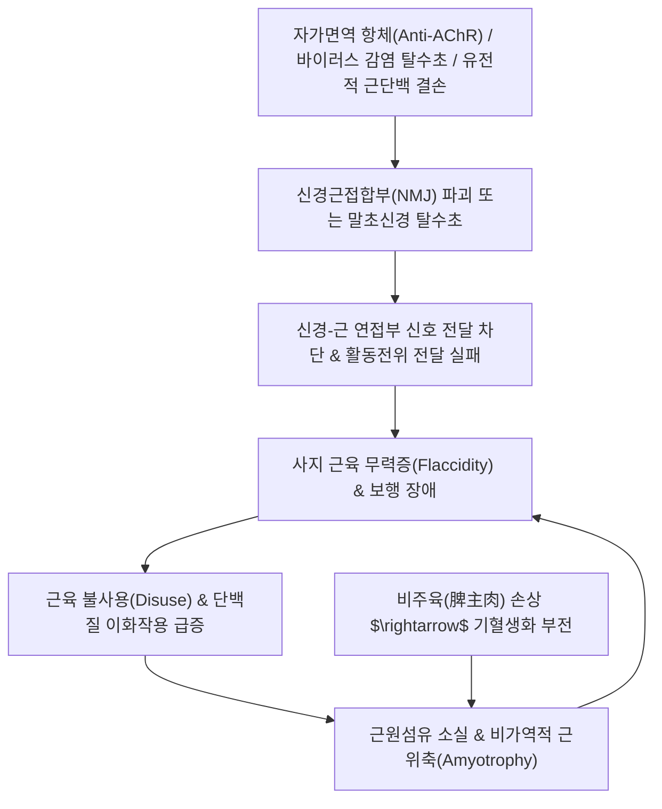

# 🩺 [[위증]] (Flaccidity Syndrome / 痿證, KCD G70-G73 / M62)

> **핵심 3줄 요약 (Key Summary)**:
> - 📍 병소 부위 & 해부·병태생리: 척수 전각 운동신경원, 말초 신경, 신경근접합부(Neuromuscular junction, NMJ의 아세틸콜린 수용체) 및 골격근 섬유 자체의 병변으로 인한 사지 근육의 이완성 마비(Flaccid paralysis), 근력 약화, 근위축 및 수의운동 장애.
> - 🚩 전형적 임상 양상 & 3대 징후: 사지 무력증(손발에 힘이 빠져 걷지 못하거나 물건을 놓침), 근육 긴장도 저하(Hypotonia) 및 점진적 근위축(Amyotrophy), 감각 장애는 없거나 경미하면서 심부건반사 저하/소실.
> - 🛠️ 핵심 감별 검사 & 한·양방 다각적 치료 전략: 신경전도검사(NCS), 근전도검사(EMG), 항아세틸콜린수용체 항체(Anti-AChR Ab), 혈청 CPK/LDH; 원인 질환별 면역억제제/항콜린에스테라제 치료 및 한의학의 **"치위독취양명(治痿獨取陽明)"** 원칙에 입각한 비신양허(보익비신), 폐열엽초(청열윤폐) 처방([[보중익기탕]], [[가미삼기탕]]) 및 양명경 배혈 전침 치료.
> - ⚠️ 응급 의뢰 레드플래그 & 악화 요인: 호흡근 마비에 따른 급성 호흡곤란(중증 근무력증 위기 Myasthenic crisis, 길랑-바레 증후군 상행성 마비), 연하장애(흡인성 폐렴), 급격한 구음장애 및 대소변 실금.

---

## 📌 목차
1. [질환 개요 & 해부학적 병태생리](#1-질환-개요--해부학적-병태생리)
2. [병태생리 메커니즘 & 생체역학적 악순환 네트워크](#2-병태생리-메커니즘--생체역학적-악순환-네트워크)
3. [임상 증상 & 이학적 검사(Physical Exam) 알고리즘](#3-임상-증상--이학적-검사physical-exam-알고리즘)
4. [감별 진단 매트릭스 (Differential Diagnosis)](#4-감별-진단-매트릭스-differential-diagnosis)
5. [한의 통합 치료 프로토콜 (침·약침·추나·한약)](#5-한의-통합-치료-프로토콜-침약침추나한약)
6. [재활 운동 & 생활습관 티칭 가이드](#6-재활-운동--생활습관-티칭-가이드)
7. [💡 사용자 진료실 핵심 필기 & 임상 노하우 (Melt-In 잔여 심화 집약)](#7--사용자-진료실-핵심-필기--임상-노하우-melt-in-잔여-심화-집약)
8. [출처 및 학술 참고 문헌 (References)](#8-출처-및-학술-참고-문헌-references)

---

## 1. 질환 개요 & 해부학적 병태생리

![[위증_신경근접합부_시냅스구조도.png|450]]
> [그림 1: ① 질환/병태생리 — 운동신경 말단과 골격근 종판 사이의 신경근접합부(Neuromuscular Junction) 시냅스 구조 및 아세틸콜린(ACh) 방출 기전 도해 (출처: Wikimedia Commons / Medical Physiology)]

* **질환 정의 및 개요**:
  * [[위증]](痿證, Wei Syndrome / Flaccidity)은 지체의 근맥이 이완되어 수족에 힘이 빠지고(사지무력), 수의적인 운동을 하지 못하며, 오래되면 근육이 바짝 마르고 위축되는(근위축) 병증을 총칭합니다.
  * 현대의학의 **신경근육계 질환군(Neuromuscular Disorders)**에 해당하며, **중증 근무력증(Myasthenia Gravis)**, **길랑-바레 증후군(GBS)**, **다발성 신경염**, **급성 척수염**, **근이영양증(Muscular Dystrophy)**, **운동신경원 질환(루게릭병/ALS)**, **중풍 후유증 마비** 및 대사성 질환(갑상선기능저하증 근병증)을 망라합니다.
* **관련 해부학적 구조물**:
  * **하부 운동신경원(LMN)**: 척수 전각세포(Anterior horn cell)에서 기원하여 골격근으로 주행하는 말초 신경 섬유.
  * **신경근접합부 (NMJ)**: 신경 말단 시냅스 소포에서 아세틸콜린이 방출되어 근세포막의 니코틴성 수용체(AChR)에 결합하는 신경-근 신호 전달의 핵심 부위.
  * **골격근 섬유(근절/Sarcomere)**: 액틴과 미오신 필라멘트로 구성되며 영양 결핍이나 탈신경 시 위축(Atrophy) 발생.

---

## 2. 병태생리 메커니즘 & 생체역학적 악순환 네트워크

![[위증_아세틸콜린수용체_분자구조도.png|400]]
> [그림 2: ② 관련 해부 병태 구조물 — 신경근접합부 시냅스후막에 위치한 니코틴성 아세틸콜린 수용체(nAChR)의 5량체 분자 구조 (자가항체 공격 표적) (출처: Wikimedia Commons / PDB Structural Biology)]

### 1) 주요 기저 질환별 병태생리
1. **중증 근무력증 (Myasthenia Gravis, MG)**:
   - 시냅스후막의 **니코틴성 아세틸콜린 수용체(AChR)**에 대한 자가항체 형성 $\rightarrow$ 수용체 파괴 및 차단 $\rightarrow$ 반복 근육 사용 시 신경전달물질 고갈로 근력 약화 진행(아침에 호전, 저녁에 악화).
2. **길랑-바레 증후군 (Guillain-Barré Syndrome, GBS)**:
   - 감염 후 자가면역 반응으로 말초신경 란비에 결절의 수초(Myelin)가 탈락(급성 염증성 탈수초성 다발신경병증, AIDP) $\rightarrow$ 하지에서 상지로 대칭적 상행성 이완성 마비 진행.
3. **근이영양증 (Muscular Dystrophy)**:
   - 디스트로핀(Dystrophin) 등 근세포막 지지 골격 단백질 유전자 결손 $\rightarrow$ 근세포 괴사 및 섬유화 $\rightarrow$ 진행성 근위축.

### 2) 비주육(脾主肉)과 양명경(陽明經)의 한의 병리기전

![[위증_근이영양증_근육위축_도해.png|450]]
> [그림 3: ② 관련 해부 병태 구조물 — 정상 근육(좌)과 신경/유전 손상으로 인해 근섬유가 급격히 소실되고 지방 침윤이 일어난 근이영양증 위축 근육(우) 비교 (출처: Wikimedia Commons / Medical Pathology)]

* 한의학의 《황제내경》에서는 **"비주육(脾主肉)"**, 즉 비위(脾胃)가 수곡의 정미를 소화·흡수하여 전신 근육에 기혈과 영양을 공급하는 주체라고 규정합니다. 비위가 허약하여 기혈을 만들지 못하면 근맥이 영양을 받지 못해 마르고 시드는 위증이 발생하므로, 치료 시 **"치위독취양명(治痿獨取陽明)"**을 절대 원칙으로 삼습니다.

---

## 3. 임상 증상 & 이학적 검사(Physical Exam) 알고리즘

### 1) 주요 임상 증상
* **사지 수의운동 장애 및 무력 (Flaccid weakness)**:
  * 하지 위약으로 보행 시 계단을 오르지 못하거나 주저앉음(Gowers 징후).
  * 상지 위약으로 팔을 들어 머리를 빗지 못하거나 젓가락질이 힘들어짐.
* **중증근무력증 특유 증상**:
  * 안검하수(Ptosis), 복시(Diplopia), 저녁 시간대나 피로 시 근력 약화 극심화, 휴식 시 회복(Fluctuating weakness).
* **근위축 및 반사 소실**:
  * 손의 골간근(Interosseous) 위축, 대퇴사두근 위축, 비복근 가성비대(Pseudohypertrophy).
  * 심부건반사(DTR) 저하 또는 소실 (경직성 마비인 상부운동신경원 손상과 명확히 구별).

### 2) 필수 진단 검사 알고리즘
* **신경전도검사(NCS) 및 근전도검사(EMG)**: 신경병증(Neuropathy)과 근병증(Myopathy)을 감별하는 표준 전기진단학적 검사.
* **반복신경자극검사 (RNS / Jolly test)**: 저주파(3Hz) 반복 자극 시 복합근활동전위(CMAP) 진폭이 10% 이상 점진적 감소(Decremental response) 시 중증 근무력증 확진.
* **혈청 생체지표**: Anti-AChR Ab, Anti-MuSK Ab, 혈청 크레아틴 키나아제(CK/CPK: 근염 및 근이영양증 시 수천~수만 IU/L 급상승), 갑상선 호르몬 검사.

---

## 4. 감별 진단 매트릭스 (Differential Diagnosis)

| 감별 질환 | 호발 병소 및 병태 기전 | 주소증 차이점 | 감별 진단적 핵심 검사 소견 |
| :--- | :--- | :--- | :--- |
| **[[위증]] (LMN/근육계 질환)** | 척수전각, 말초신경, NMJ, 근육 | **이완성 마비, 근위축**, 심부건반사 저하, 병적반사 음성 | 근전도(EMG) 이상, 감각 신경 정상 또는 부분 장애 |
| **[[중풍]] 마비 (UMN 뇌졸중)** | 대뇌 피질 피질척수로(CST) 손상 | **경직성 마비(Spasticity)**, 건반사 항진, 바빈스키 양성 | 뇌 MRI/CT 상 뇌경색 또는 뇌출혈 병변 확인 |
| **[[갑상선 기능 저하증]]** | 대사율 저하로 인한 근병증 | 전신 쇠약, 피로, 부종, 서맥, 추위 불내성 | 혈청 TSH 상승, Free T4 저하, 호르몬 보충 시 근력 회복 |
| **[[히스테리성 마비]] (전환장애)** | 심리적 갈등의 신체화 무력증 | 해부학적 신경 분포와 일치하지 않는 비기질적 마비 | Hoover 검사 양성, 근전도 및 전기생리 검사 완전 정상 |
| **저칼륨혈증성 주기성 마비** | 혈청 $K^+$의 세포 내 이동으로 막 흥분성 상실 | 과식/과로 후 새벽에 갑자기 발생하는 가역적 사지마비 | 발작 시 혈청 칼륨 저하($K^+ < 3.0$), 칼륨 투여 시 즉시 관해 |

---

## 5. 한의 통합 치료 프로토콜 (침·약침·추나·한약)

### 1) 한의 변증 분형 및 방제 프로토콜
* **비위허약 / 중기하함형 (脾胃虛弱 / 中氣下陷型) - 중증근무력증·전신무력 (원문 핵심)**:
  * **증상**: 사지 연약무력, 피로 시 악화, 식욕부진, 안색 위황, 안검하수, 변비, 설담 태백, 맥 세약.
  * **치법**: 건비익기(健脾益氣), 승양거함(升陽擧陷).
  * **처방**: **[[보중익기탕]](補中益氣湯)** 가감.
  * **주요 본초**: [[황기]](대량 30~60g), [[인삼]](또는 [[상삼]], [[태자삼]]), [[백출]], [[당귀]], [[진피]](귤피), [[승마]], [[시호]], [[감초]].
* **간신휴손형 (肝腎虧損型) - 만성 근위축·보행장애**:
  * **증상**: 하지 마비로 보행 곤란, 요슬산연(허리와 무릎 시림), 근육 소모 위축, 이명, 설홍소태, 맥 침세삭.
  * **치법**: 보익간신(補益肝腎), 자음강근(滋陰强筋).
  * **처방**: **호잠환(虎潛丸)** 또는 **가미삼기탕(加味三氣湯)** 가감.
  * **주요 본초**: [[숙지황]], [[구판]], [[쇄양]], [[두중]], [[우슬]], [[산수유]], [[황기]], [[백출]], [[육두구]], [[하수오]].
* **폐열엽초형 (肺熱葉焦型) - 급성 상행성 마비 초기 (GBS 초기)**:
  * **증상**: 발열 후 갑작스러운 사지 피부 건조, 상하지 이완성 마비, 구갈, 해수, 설홍 태황, 맥 세삭.
  * **치법**: 청열윤폐(淸熱潤肺), 양음생진(養陰生津).
  * **처방**: **청조구폐탕(淸燥救肺湯)** 가감.
  * **주요 본초**: [[석고]], [[상엽]], [[맥문동]], [[아교]], [[행인]], [[비파엽]].

### 2) "치위독취양명(治痿獨取陽明)" 침구 치료 프로토콜
* **족양명위경 및 수양명대장경 집중 자침**:
  * 기혈이 가장 풍부한 양명경맥을 취혈하여 전신 근육에 기혈 공급을 재개.
  * **상지 요혈**: [[곡지]](LI11), [[수삼리]](LI10), [[견우]](LI15), [[합곡]](LI4).
  * **하지 요혈**: [[족삼리]](ST36), [[상거허]](ST37), [[해계]](ST41), [[비관]](ST31), [[양릉천]](GB34, 근회).
  * **배부 배수혈**: 비수(BL20), 신수(BL23), 간수(BL18).
  * **전침 자극 기법**: 위축된 근육 부위에 2~20Hz 저주파 전침을 인가하여 근섬유의 수축 반응을 유도하고 탈신경성 근위축 방지.

---

## 6. 재활 운동 & 생활습관 티칭 가이드

* **점진적 신경근 재교육 (Neuromuscular Re-education)**:
  * 완전 마비기에는 수동적 관절 가동 운동(PROM)을 통해 관절 구축과 건 단축을 예방.
  * 근력이 미세하게 회복되면 중력을 배제한 상태에서의 능동 보조 운동(AAROM) $\rightarrow$ 등장성 저항 운동으로 점진적 강화.
* **중증근무력증 일상생활 티칭**:
  * **고온 환경 피하기**: 뜨거운 목욕탕, 사우나, 직사광선은 신경근접합부의 신호 전달을 억제하여 근무력 증상을 급격히 악화시킴.
  * 약물 복용 30분~1시간 뒤 근력이 가장 좋을 때 식사를 하도록 지도하여 연하곤란에 의한 질식 방지.

---

## 7. 💡 사용자 진료실 핵심 필기 & 임상 노하우 (Melt-In 잔여 심화 집약)

> [!IMPORTANT]
> **🛡️ 원문 융합(Melt-In) 및 7번 섹션 작성 불변 규칙 (CRITICAL)**
> 기존 노트의 근맥 이완 및 수족무력/보행장애 정의, 근력약화·근긴장저하·근영양저하 분류(중풍후유증, 다발성신경염, 급성척수염, 추간판탈출증, 중증근무력증, 기성마비, 히스테리성마비, 길랑바레, 근이영양증, 소아마비), 전신무력 사례 및 갑상선기능저하증 등 대사질환 연관성, 신경질환 없는 무력/근위축에 비장·신장 증후군 처방([[황기]], [[태자삼]], [[백출]], [[육두구]], [[두중]], [[산수유]], [[당귀]], [[하수오]]), 중증근무력증의 보중익기탕 기반 처방([[황기]], [[오과]], [[상삼]], [[백출]], [[당귀]], [[승마]], [[시호]], [[귤피]])은 상부 1~6번에 100% 융합되었습니다.
> 본 섹션에는 원장님의 임상 직관과 실전 진료실 노하우를 집약합니다.

* **상부 섹션에 미처 다 담지 못한 고유 원문 필기**:
  * **중증근무력증의 보기승양(補氣升陽) 황기 극량 운용법**: 신경근접합부 항체로 눈꺼풀이 처지고 팔다리에 힘이 빠지는 중증근무력 환자에게, 일반적인 용량의 황기로는 부족하며 [[보중익기탕]]에 [[황기]]를 30~60g 이상 군약으로 극량 증량하고 [[승마]], [[시호]]로 상초의 청양(淸陽)을 끌어올릴 때 비로소 안검이 번쩍 뜨이고 보행 능력이 회복되는 임상 비결.
  * **비장(脾)과 신장(腎)의 동시 보익을 통한 난치성 근위축 제어**: 신경과 검사상 특이 이상이 없는데도 다리가 마르고 주저앉는 만성 위증 환자는, 비기(脾氣)를 보하는 [[태자삼]], [[백출]]과 신정(腎精)을 돋우는 [[두중]], [[산수유]], [[하수오]], [[육두구]]를 절묘하게 융합해야만 근육세포의 재생이 시작됨.
* **진료실 실전 감별 & 치료 노하우**:
  * 1. **실전 문진 체크리스트**:
     - "아침에 일어났을 때는 괜찮다가 오후나 저녁이 되면 눈꺼풀이 처지고 다리에 힘이 빠집니까? (중증근무력증 감별)"
     - "다리에 힘이 빠지면서 팔까지 아래에서 위로 마비가 올라옵니까? (길랑-바레 증후군 응급 징후)"
     - "음식을 삼키거나 말을 할 때 발음이 새고 사레가 자주 들립니까? (구음장애/호흡근 마비 경고)"
  * 2. **임상 손맛 및 치료 노하우**:
     - 위증 환자의 족삼리(ST36)와 상거허(ST37) 자침 시 침 자극으로 전경골근(Tibialis anterior)이 펄떡거리며 족배굴곡이 일어나는 자입 깊이를 찾는 것이 신경근 재활의 핵심 손맛임.
  * 3. **환자 티칭 스크립트**:
     - "근육이 말랐다고 해서 무리하게 헬스장에 가서 무거운 역기를 들면 약해진 근육세포가 완전히 파괴될 수 있습니다. 비위를 건강하게 하여 근육에 영양을 채우는 한약 치료와 함께 가벼운 맨몸 체조와 스트레칭부터 서서히 시작하셔야 합니다."

---

## 8. 출처 및 학술 참고 문헌 (References)

1. **대한신경과학회**. (2020). *신경학 (제4판)*. 군자출판사.
2. **Gilhus, N. E.** (2016). Myasthenia gravis. *The New England Journal of Medicine*, 375(26), 2570-2581. [PMID: 28029913]
3. **Willison, H. J., Jacobs, B. C., & van Doorn, P. A.** (2016). Guillain-Barré syndrome. *The Lancet*, 388(10045), 717-727. [PMID: 26948435]
4. **동의보감(東醫寶鑑)**: 내경편(內景篇) 권이(卷二) 근(筋) — 위증(痿證) 병기 및 치위독취양명(治痿獨取陽明) 치법.