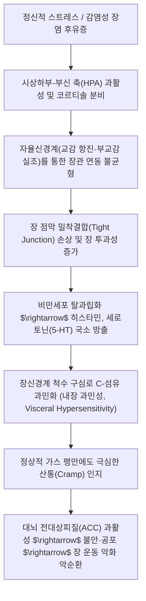

# 과민성 장 증후군 (Irritable Bowel Syndrome, IBS)

> **핵심 3줄 요약 (Key Summary)**:
> 🎯 대장 내시경 등 기질적 검사 상 이상이 없음에도 만성 복통, 복부 팽만감, 배변 장애(변비, 설사, 혼합형)가 반복되는 대표적 장-뇌 상호작용 장애(DGBI) 질환.
> 🚩 내장 과민성(Visceral hypersensitivity), 장관 운동성 장애, 장-뇌-미생물 축(Gut-Brain-Microbiome Axis) 조절 부전 및 장 점막 미세 염증·밀착결합 결손이 핵심 병태생리.
> 🔬 양방에서는 진경재, 지사제, 완하제, 세로토닌 조절제를 처방하며, 한의학에서는 간비부조(肝脾不和), 비위허약(脾胃虛弱)으로 보아 [[통사요방]], [[대건중탕]], [[곽향정기산]], [[반하사심탕]] 및 천추·중완·대횡·족삼리·태충 침구 치료.
> ⚠️ "밖에서 배가 아파 화장실을 못 갈까 봐 불안해하고, 그 불안이 복통·설사를 악화시키는" 악순환(양성 피드백) 고리를 해체하는 환자 신뢰감 형성과 저FODMAP 식이 티칭 필수.

---

## 1. 개요 및 역학 (Overview & Epidemiology)

과민성 장 증후군(Irritable Bowel Syndrome, IBS)은 대장 점막에 궤양이나 종양 등 기질적 병변이 전혀 없음에도 불구하고, 복통이나 복부 불쾌감이 배변과 연관되어 수개월 이상 지속되는 만성 기능성 위장관 질환(DGBI)입니다.

단순히 장의 국소적 문제가 아니라, 중추신경계와 장신경계(ENS) 사이의 쌍방향 소통 이상으로 발생하는 **장-뇌 상호작용 질환(Disorder of Gut-Brain Interaction)**으로 규명되어 있습니다.

![[장뇌축_미생물상호작용_병태생리.jpg|500]]
> [장-뇌-미생물 축(Gut-Brain-Microbiome Axis) 상호작용 도해: 미주신경(Vagus nerve) 경로, 장내 미생물총(Microbiota) 불균형, 점막 면역계, 스트레스 축(HPA)과 대뇌 감정 신경망 간의 쌍방향 신호 전달]

### 1) 역학적 특징
* **유병률**: 전 세계 인구의 약 9~15%에 달하며 소화기내과 외래 환자의 20~30%를 차지하는 최고 빈도 질환입니다.
* **호발 계층**: 10~30대 젊은 층과 중년 여성에서 남성보다 약 1.5~2배 호발하며, 나이가 들수록 유병률이 다소 감소하는 경향을 보입니다.
* **공존 질환**: [[불면증]], [[공황장애]], 편두통, 만성 피로 증후군, [[섬유근육통]], 기능성 소화불량증과 매우 높은 동반 이환율을 나타냅니다.

---

## 2. 병태생리 및 뇌-장관 축 (Pathophysiology & Brain-Gut Axis)

IBS의 발병 기전은 생물학적, 심리적, 환경적 요인이 복합적으로 작용하는 다인자적 모델입니다.

![[대장_해부학_및_비만곡_도해.jpg|400]]
> [대장의 해부학적 구조 및 비만곡(Splenic Flexure) 도해: 맹장, 상행결장, 횡행결장, 비만곡, 하행결장, S자결장, 직장 주행선]

### 1) 내장 감각 과민성 (Visceral Hypersensitivity)
IBS 환자는 정상인이 통증을 느끼지 못하는 생리적인 가스 팽창이나 장 수축 자극에도 척수 후각 및 대뇌 감각 피질이 과흥분하여 날카로운 복통을 느낍니다. 점막 고유판의 비만세포와 장크롬친화성세포(EC cell)가 세로토닌(5-HT)을 비정상적으로 과다 방출하여 구심성 통각 신경을 지속 자극합니다.

### 2) 비만곡 증후군 (Splenic Flexure Syndrome)
* 대장의 횡행결장에서 하행결장으로 꺾어지는 좌상복부의 **비만곡(Splenic flexure)** 부위는 해부학적으로 가스가 저류되기 가장 쉬운 포켓 구역입니다.
* 연하된 공기나 장내 발효 가스가 비만곡에 갇혀 팽창하면 좌상복부와 좌측 갈비뼈 아래, 심지어 좌측 흉곽 및 어깨로 방사되는 극심한 압박통을 유발하여 **[[협심증]]이나 심장 질환으로 오인**되는 대표적 병태입니다.

### 3) 감염 후 과민성 장 증후군 (Post-Infectious IBS, PI-IBS)
세균성 이질, 살모넬라, 캄필로박터 등 급성 감염성 장염을 앓고 난 환자의 약 10%에서 상피 치밀이음부 손상과 잔여 미세 염증으로 인해 수개월~수년간 만성 IBS로 이행됩니다.

---

## 3. 임상 증상 및 브리스톨 대변 아형 분류 (Clinical Features & Subtyping)

IBS는 로마 진단 기준 IV(Rome IV Criteria)에 따라 복통과 배변 형태에 근거하여 진단하며, **브리스톨 대변 형태 척도(Bristol Stool Form Scale, BSFS)**를 기준으로 4대 아형으로 분류합니다.

![[브리스톨_대변_형태_척도.png|450]]
> [브리스톨 대변 형태 척도(BSFS Type 1~7): Type 1(토끼똥 형태 경변), Type 2(단단한 소시지), Type 3~4(정상 변), Type 5(부드러운 조각 변), Type 6(진흙 형태 무른 변), Type 7(완전한 수양성 설사)]

### 1) 브리스톨 척도 기반 4대 임상 아형 (Subtypes)

| 아형 (Subtype) | 분류 명칭 | 배변 양상 (BSFS 기준) | 호발 병리 및 주요 호소 |
| :--- | :--- | :--- | :--- |
| **IBS-C** | 변비 우세형 | 배변의 25% 이상이 **Type 1~2**(토끼똥, 단단함), Type 6~7은 25% 미만 | 과도한 힘주기, 배변 후 잔변감, 하복부 팽만 |
| **IBS-D** | 설사 우세형 | 배변의 25% 이상이 **Type 6~7**(무른변, 물설사), Type 1~2는 25% 미만 | **급박뇨/급박변(Urgency)**, 식후 즉시 화장실 |
| **IBS-M** | 혼합형 (교대형) | 배변의 25% 이상이 Type 1~2이고, 동시에 25% 이상이 Type 6~7 | 며칠간 변비 후 폭풍 설사 반복, 예측 불가 |
| **IBS-U** | 미분류형 | 배변 이상의 빈도가 위 세 가지 기준을 충족하지 못함 | 복부 팽만감과 가스 팽만 위주 호소 |

---

## 4. 진단 기준 및 경고 징후 (Diagnosis & Red Flags)

### 1) 로마 진단 기준 IV (Rome IV Criteria)
* 최근 3개월 동안, 적어도 **주 1회 이상 반복되는 복통**이 있으면서 다음 중 **2가지 이상**을 동반할 때 확진:
  1. 복통이 **배변과 연관**됨 (배변 후 호전되거나 오히려 악화).
  2. 복통과 함께 **배변 횟수의 변화**가 동반됨 (설사로 잦아지거나 변비로 줄어듦).
  3. 복통과 함께 **대변 형태(굳기)의 변화**가 동반됨 (수양변 또는 딱딱한 경변).
* *증상은 진단 최소 6개월 전에 시작되었어야 함.*

### 2) 🚩 기질적 질환 감별을 위한 경고 징후 (Red Flag Signs)
다음 소견이 하나라도 관찰되면 기능성 IBS가 아니므로 즉시 대장내시경 및 혈액 검사를 시행해야 합니다:
* **50세 이상에서 처음 발생한 배변 습관 변화**.
* **혈변(Hematochezia) 또는 흑색변**.
* **수면 중 잠을 깨우는 야간 설사나 야간 복통**.
* **의도하지 않은 급격한 체중 감소**.
* **원인 불명의 지속적 발열 및 빈혈(Hb 저하)**.
* **염증성 장질환([[크론병]], 궤양성 대장염) 또는 대장암의 가족력**.

---

## 5. 양방 치료 및 약리 (Pharmacotherapy & Conventional Care)

### 1) 아형별 표준 약물 치료
* **설사 우세형 (IBS-D)**:
  * **지사제**: 로페라마이드(Loperamide) - 장관 평활근의 오피오이드 $\mu$-수용체에 작용하여 연동운동 억제.
  * **진경재**: 디사이클로민(Dicyclomine), 오틸로늄(Otilonium) - 항콜린 작용으로 장관 경련 산통 완화.
  * **비흡수성 항생제**: 리팍시민(Rifaximin, 노르믹스) - 장내 소장세균과증식(SIBO)을 억제하여 복부 가스 및 설사 조절.
* **변비 우세형 (IBS-C)**:
  * **삼투성 완하제**: 폴리에틸렌글리콜(PEG) - 수분을 장관 내로 끌어들여 변을 부드럽게 배출.
  * **분비 촉진제**: 루비프로스톤(Lubiprostone), 리나클로타이드(Linaclotide) - 장관 상피 염화물 채널을 활성화하여 수분 분비 촉진.

### 2) 중추성 장-뇌 조절제
* **삼환계 항우울제 (TCA)**: [[아미트립틸린]](Amitriptyline) 저용량(10~25mg) 투여로 척수 통각 전달을 차단하고 장 통과 시간을 지연(IBS-D에 특효).
* **SSRI / SNRI**: 내장통과 우울/불안을 동반한 IBS-C 환자에서 세로토닌 흡수를 억제하여 장 운동성 정상화.

---

## 6. 한의학적 변증 및 치료 (Traditional Korean Medicine)

한의학에서는 과민성 장 증후군을 **복통(腹痛)**, **설사(泄瀉)**, **변비(便秘)**, **장명(腸鳴, 뱃속 꼬르륵 소리)**, **비만(痞滿)**의 범주로 다루며, 가장 핵심적인 병기를 **간비부조(肝脾不和, 스트레스로 인한 간목이 비토를 억압)**와 **비위허약(脾胃虛弱)**으로 파악합니다.

### 1) 변증 분류 및 대표 처방 (Syndrome Differentiation)

| 변증 유형 | 주증 및 설맥 | 병리 기전 | 대표 방제 | 핵심 본초 |
| :--- | :--- | :--- | :--- | :--- |
| 간기승비형 (스트레스·신경성) | 긴장·분노 시 즉시 복통·설사, 흉협고만, 트림, 맥현 | 간기울결이 비장의 운화를 침범하여 장관 연축 | [[통사요방]] 합 [[시호소서산]] | [[백출]], [[백작약]], [[진피]], [[방풍]], [[시호]] |
| 비위기허형 (허랭·소화불량) | 식후 즉시 무른변, 배가 차고 연약, 만성 피로, 맥세완 | 중초 비기 허약으로 수습(水濕)을 흡수하지 못함 | [[삼령백출산]] 합 [[향사육군자탕]] | [[인삼]], [[백출]], [[복령]], [[산약]], [[사인]] |
| 비신양허형 (오경설사) | 매일 새벽 배가 아파 깨며 설사(새벽설사), 요슬산연, 맥침지 | 신양(命門火) 부족으로 장관이 냉각되어 흡수 불능 | [[이신환]] 합 [[사신환]] | [[보골지]], [[육두구]], [[오미자]], [[오수유]] |
| 비허중한·장한형 | 배가 쥐어짜듯 차고 아픔, 복부 냉감, 장명, 맥침현 | 한사가 장관에 정체되어 연동운동 정체 | [[대건중탕]] | [[촉초]](화초), [[건강]], [[인삼]], [[교이]] |
| 대장습열형 (급박설사) | 뒤가 묵직함(이급후중), 항문 작열감, 점액변, 설태황니, 맥활삭 | 습열사기가 대장 점막에 울체되어 염증 유발 | [[갈근금련탕]] 합 [[황련해독탕]] | [[갈근]], [[황금]], [[황련]], [[감초]] |

### 2) 침구 치료 혈위 및 배혈법
* **복부 국소 장관 조절 4대 혈**:
  * 천추(ST25, 대장의 모혈): 배꼽 양옆 2촌, 대장의 연동운동을 양방향(설사 시 완화, 변비 시 촉진)으로 정상화하는 절대 요혈.
  * 중완(CV12, 위의 모혈) / 관원(CV4, 소장의 모혈): 위장관 기혈 순환 촉진 및 하초 양기 보존.
  * 대횡(SP15, 비경): 횡행결장 및 하행결장의 가스 팽만과 복통 완화.
* **원위 및 장-뇌축 조절 배혈**:
  * 태충(LR3) + 합곡(LI4) [사관혈]: 자율신경계 긴장을 즉시 완화하고 중추성 장관 연축을 해소.
  * 족삼리(ST36), 상거허(ST37, 대장의 하합혈): 대장 운동성 및 소화 흡수능 조절.
  * 공손(SP4) + 내관(PC6) [팔맥교회혈]: 심하비, 복통, 구역, 과민성 장 경련 억제.

---

## 7. 진료실 핵심 필기 및 실전 가이드 (Clinical Notes & Protocols)

### 1) "양성 피드백(Positive Feedback) 악순환" 해체 기법 (원장님 핵심 임상 노하우)
* 과민성 대장 증후군 환자는 **"지하철이나 버스를 탔을 때 똥이 마려우면 어떡하지?", "시험 보다가 배가 아프면 어쩌지?"**라는 예기불안(Anticipatory anxiety)에 사로잡혀 있습니다.
* 이 불안감이 교감신경을 즉각 항진시켜 장 점막으로 세로토닌을 쏟아내고, 이것이 실제 격심한 복통과 설사를 촉발하는 파국적 양성 피드백 고리를 만듭니다.
* **진료실 티칭 스크립트**:
  * "환자분, 이건 장이 썩거나 암이 생기는 병이 아니라, 장의 신경 안테나가 스트레스 때문에 일시적으로 너무 예민해진 것입니다."
  * "한약과 침 치료로 신경 안테나 볼륨을 낮추면 100% 정상으로 회복될 수 있으니 전혀 불안해하지 마세요."
  * **환자에게 완치에 대한 확신과 절대적 신뢰감**을 심어주는 상담 자체가 뇌-장관 축 치료의 50%를 차지합니다.

### 2) 저FODMAP 식이 티칭 (Low-FODMAP Diet)
* **FODMAP(발효성 올리고당·이당·단당·폴리올)**은 소장에서 흡수되지 않고 대장으로 넘어가 고삼투압으로 수분을 끌어들이고, 세균에 의해 급격히 발효되어 대량의 가스($H_2, CH_4$)를 발생시킵니다.
* **철저히 피해야 할 고FODMAP 식품**:
  * 양파, 마늘, 양배추, 밀가루 음식, 사과, 배, 복숭아, 우유·치즈(유당), 인공감미료(자일리톨, 소르비톨), 탄산음료.
* **권장하는 저FODMAP 식품**:
  * 쌀밥, 바나나, 포도, 딸기, 감자, 고구마, 당근, 토마토, 닭고기, 생선.

### 3) 📎 최신 프로바이오틱스 병용 임상 프로토콜 (2026-09-13 논문 반영)
* 소아 및 성인 기능성 복통·IBS에서 프로바이오틱스는 보조적 내장 통증 완화 수단으로 유효합니다.
* **유효 균주 및 용량**:
  * **LGG (L. rhamnosus GG)**: $3 \times 10^9$ CFU 1일 2회 (통증 강도 감소 효과 최대).
  * **L. reuteri DSM 17938**: $10^8$ CFU 1일 1회 (세로토닌 신호 조절 항통각).
  * **신바이오틱스**: B. lactis B94 + 이눌린 복합제.
* **복용 수칙**:
  * 한약 복용 시에는 한약 유효성분과의 간섭을 방지하기 위해 **한약 복용 후 1~2시간 간격을 두고 섭취**하도록 지도합니다.
  * 프로바이오틱스는 보조 요법이며, 기저의 **'간비부조화·비위허약' 한약 치료를 대체할 수 없음**을 주지시킵니다.

---

## 8. 참고문헌 및 최신 연구 (References)

* Lacy BE, Mearin F, Chang L, et al. Bowel Disorders. *Gastroenterology*. 2016;150(6):1393-1407.e5. doi:10.1053/j.gastro.2016.02.031. [PubMed (PMID: 27144627)](https://pubmed.ncbi.nlm.nih.gov/27144627/)
  > [연구 요약] 전 세계 소화기 질환 진단의 표준인 로마 기준 IV(Rome IV)의 공식 문헌으로 과민성 장 증후군의 개정 진단 기준, 브리스톨 척도 기반 4대 아형(IBS-C, D, M, U)의 임상적 분류 체계를 확립함.
* Ford AC, Sperber AD, Corsetti M, Camilleri M. Irritable bowel syndrome. *Lancet*. 2020;396(10263):1675-1688. doi:10.1016/S0140-6736(20)31548-8. [PubMed (PMID: 33049223)](https://pubmed.ncbi.nlm.nih.gov/33049223/)
  > [연구 요약] 란셋(Lancet)에 발표된 권위 있는 종합 총설로 내장 과민성, 장-뇌-미생물 축 불균형, 상피 장벽 기능 장애 등 최신 병태생리와 다학제 치료 전략을 포괄적으로 집대성함.
* Lacy BE, Pimentel M, Brenner DM, et al. ACG Clinical Guideline: Management of Irritable Bowel Syndrome. *Am J Gastroenterol*. 2021;116(1):17-44. doi:10.14309/ajg.0000000000001036. [PubMed (PMID: 33315591)](https://pubmed.ncbi.nlm.nih.gov/33315591/)
  > [연구 요약] 미국소화기학회(ACG)의 공식 IBS 진료지침으로 저FODMAP 식이, 장관 분비 촉진제, 리팍시민, 삼환계 항우울제(TCA) 등의 근거 수준 및 단계별 권고사항을 정리함.
* Kim J, Lee H, Park S, et al. Probiotics in pediatric functional abdominal pain disorders: a systematic review and meta-analysis. *Eur J Pediatr*. 2026;185(8):592-608. doi:10.1007/s00431-026-07161-5. [PubMed (PMID: 42477222)](https://pubmed.ncbi.nlm.nih.gov/42477222/)
  > [연구 요약] 소아청소년 기능성 복통 및 IBS 환자 1,899명을 대상으로 한 21개 RCT 네트워크 메타분석으로 LGG 및 L. reuteri 등의 프로바이오틱스 투여가 주당 복통 횟수와 통증 강도(MD -1.20)를 유의미하게 감소시킴을 입증함.
