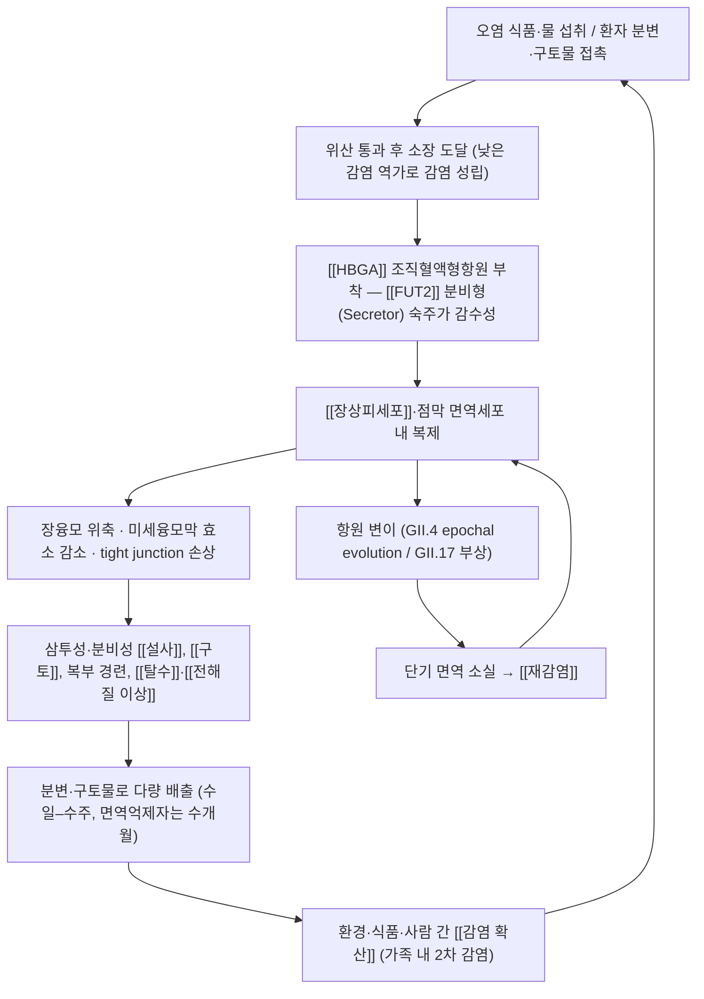

# 🩺 [[노로바이러스]] (Norovirus infection / 諾羅病毒感染, ICD-10 A08.1 / KCD A08.1)

![[노로바이러스_2_2.jpg|540]]
> [그림 1: ① 병태생리·영상 — Norovirus.jpg]
![[노로바이러스_4.jpg|540]]
> [그림 2: ② 관련 해부 구조물 — Patient 1 – Pneumatosis involving the whole colon.]

> **핵심 3줄 요약 (Key Summary)**:
> - 📍 병소 부위 & 해부·병태생리: 위장관, 특히 [[십이지장]]·[[공장]]의 [[장상피세포]]와 점막 면역세포에 감염하여 장융모 위축과 흡수·분비 장애를 일으킨다. [[HBGA]](조직혈액형항원)·[[FUT2]] 분비형(secretor) 여부가 숙주 감수성을 결정하며, GII.4의 항원 변이와 GII.17의 부상이 반복 유행의 핵심 기전이다.
> - 🚩 전형적 임상 양상 & 3대 징후: 12–48시간의 짧은 잠복기 후 **급격한 구토·수양성 설사·복부 경련통**이 3대 징후로 나타나며, 12–72시간 내 자연 회복되는 것이 전형적 패턴이다. 소아는 구토 우세, 성인은 설사 우세 경향.
> - 🛠️ 핵심 감별 검사 & 한·양방 다각적 치료 전략: 대변 [[RT-PCR]](표준)과 [[다중 PCR]] 패널, 신속항원검사, 탈수 평가(체중·소변량·모세혈관 재충만). 한방은 [[변증]]에 따라 [[곽향정기산]]·[[갈근황련황금탕]]·[[보화환]]·[[오령산]]·[[이중탕]] 등을 활용하고, [[족삼리]]·[[천추]]·[[중완]]·[[내관]] 자침 및 [[온구]]를 병행한다(한의 처방 근거는 전통 이론 기반, 현대 RCT 근거 미확인).
> - ⚠️ 응급 의뢰 레드플래그 & 악화 요인: 혈변·고열·담즙성 구토·복막 자극 징후(세균성/외과적 복증), 중증 [[탈수]]·의식 변화·경련·무뇨, 7일 이상 지속, 영아·고령·면역억제자·임산부. 알코올 손소독제 의존 및 항생제 남용은 악화 요인.

---

## 📌 목차
1. [질환 개요 & 해부학적 병태생리](#1-질환-개요--해부학적-병태생리)
2. [병태생리 메커니즘 & 생체역학적 악순환 네트워크](#2-병태생리-메커니즘--생체역학적-악순환-네트워크)
3. [임상 증상 & 이학적 검사(Physical Exam) 알고리즘](#3-임상-증상--이학적-검사physical-exam-알고리즘)
4. [감별 진단 매트릭스 (Differential Diagnosis)](#4-감별-진단-매트릭스-differential-diagnosis)
5. [한의 통합 치료 프로토콜 (침·약침·추나·한약)](#5-한의-통합-치료-프로토콜-침약침추나한약)
6. [재활 운동 & 생활습관 티칭 가이드](#6-재활-운동--생활습관-티칭-가이드)
7. [💡 사용자 진료실 핵심 필기 & 임상 노하우 (Melt-In 잔여 심화 집약)](#7--사용자-진료실-핵심-필기--임상-노하우-melt-in-잔여-심화-집약)
8. [출처 및 학술 참고 문헌 (References)](#8-출처-및-학술-참고-문헌-references)

---

## 1. 질환 개요 & 해부학적 병태생리

![[노로바이러스_1.jpg|540]]
> [그림 1: Immunogenetic-Mechanisms-Driving-Norovirus-GII.4-Antigenic-Variation-ppat.1002705.g010.jpg]

* **질환 정의 및 분류**:
  * **정의**: 노로바이러스(Norovirus)는 *Caliciviridae* 과 *Norovirus* 속에 속하는 **비외피성(non-enveloped), 양성 단일가닥 RNA(+ssRNA) 바이러스**로, 전 세계 산발성 및 유행성 [[급성 위장염]](acute gastroenteritis)의 가장 흔한 원인 병원체이다. 급성 구토·설사·복통을 주증상으로 하는 자기한정적(self-limiting) 장염을 유발한다(Flynn & Olortegui 2024, PMID 38340741; Khan & Alam 2021, PMID 34226482).
  * **명칭 유래**: 1968년 미국 오하이오주 Norwalk 지역 학교에서 집단 발병이 있었고, 이후 면역전자현미경으로 병원체가 확인되면서 "Norwalk agent"로 명명되었다. 현재는 **Norovirus**로 통칭되며, 한국어 별칭으로 '노워크바이러스'가 함께 쓰인다(Fernández & Gómez 2010, PMID 20172424).
  * **유전적 분류**: 2019년 Chhabra & de Graaf의 개정 분류에서 노로바이러스는 **10개의 게놈군(genogroup, GI–GX)과 다수의 유전자형(genotype)**으로 재정리되었고, 사람에 감염되는 주요 게놈군은 **GI, GII, GIV 및 일부 신규 게놈군**으로 보고되었다(PMID 31483239). ※유전자형의 정확한 개수는 개정 제안 이후에도 지속 갱신되고 있어 본 노트에서는 '다수'로 표기하며, 세부 수치는 원문 재확인이 필요하다.
  * **역학적 특성**:
    * **전 연령**에서 발생하나, 어린이(특히 5세 미만), 고령자, 면역억제자에서 중증도가 높다.
    * **겨울철 집중**(온대 지역에서 대체로 11월–4월) 경향이 있으며, 폐쇄·밀집 환경(요양원, 병원, 학교, 보육시설, 군부대, 크루즈선)에서 폭발적 집단 발생이 특징이다(Khan & Alam 2021, PMID 34226482).
    * **매우 낮은 감염 역가**(문헌별로 18개 입자 수준까지 거론되나 편차가 큼)와 **환경 저항성** 때문에 소량의 오염만으로도 전파가 성립한다. ※정확한 최소 감염 역가는 문헌별 편차가 있어 **근거 미확인**으로 둔다.
    * 전 세계 연간 발생 규모는 수억 건, 사망 수만 명 수준으로 추정되나 **추정치 간 편차가 커** 본 노트에서는 질적 서술(가장 흔한 유행성 위장염 원인)로 한정한다.
  * **전파 경로**: 분변-구강 경로가 기본이며, ① 사람 간 직접 접촉, ② 오염된 식품(특히 **패류**, 샐러드·베리류 등 비가열 식품), ③ 오염된 물, ④ **구토물 에어로졸**(비말·에어로졸화된 바이러스 입자), ⑤ 오염된 환경 표면(fomite) 매개가 모두 가능하다.

* **관련 해부학적 구조물**:
  * **골격 및 관절**: 본 질환은 원발성으로 골격·관절을 침범하지 않는다. 다만 심한 탈수·전해질 이상 시 근경련(특히 하지), 전신 근육통이 동반될 수 있고, 고령자에서는 탈수로 인한 기립성 어지럼·낙상 위험이 이차적으로 증가한다.
  * **소화관 구조(주 병소)**: [[십이지장]]과 [[공장]]을 중심으로 한 **소장 근위부**가 주요 표적이다. 장융모(villus) 상피의 [[장상피세포]], 미세융모막(brush border)의 소화효소, 상피 간 tight junction이 기능적으로 손상된다. 위 배출 지연과 위장관 운동 변화도 동반된다.
  * **점막 면역·림프 조직**: [[GALT]](장관 관련 림프조직), 장간막 림프절이 면역 반응의 장이 되며, 인체 노로바이러스가 **장관 내 [[B세포]] 및 점막 면역세포에서 복제**된다는 연구가 보고되어 왔다(PMID 38340741 리뷰에서 다룸). ※세포 특이적 복제 기전의 세부 사항은 연구 단계로 **근거 미확인** 항목이 많다.
  * **신경 및 혈관**: [[미주신경]](vagus nerve) 구심성 섬유와 연수 구토중추가 **구토 반사**의 해부학적 경로를 이루며, 장 크로마핀세포-5-HT 신호가 관여하는 것으로 설명된다. 전신적으로는 구토·설사로 인한 **체액·전해질 소실 → 유효순환혈량 감소 → 신장 전신(prerenal) 저관류**가 주요 이차 병태이다.

---

## 2. 병태생리 메커니즘 & 생체역학적 악순환 네트워크

### 1) 숙주 부착 및 감염 성립 기전 — [[HBGA]]와 분비형(Secretor) 유전자형
* 노로바이러스는 **조직혈액형항원(histo-blood group antigen, [[HBGA]])**을 부착 수용체/공동인자로 이용하는 것으로 알려져 있다. HBGA는 장 점막 상피 표면의 당지질·당단백에 발현되며, 바이러스 캡시드 단백(VP1)의 P 도메인이 이를 인식한다.
* [[FUT2]] 유전자의 **분비형(secretor, 양성)** 개체는 HBGA 발현이 원활하여 감수성이 높고, **비분비형(non-secretor)** 개체는 특정 유전자형(대표적으로 GII.4)에 대해 상대적 저항성을 보인다. 이는 같은 집단 내에서도 사람마다 발병 여부가 갈리는 이유를 설명하는 핵심 기전이다.
* 담즙산(bile acids)이 인체 노로바이러스의 복제를 촉진한다는 실험실 연구가 보고되어 있으며, 이는 소장 환경이 복제에 우호적임을 시사한다. ※담즙산 의존성의 정량적 기여도는 **근거 미확인**.

### 2) 장관 손상 및 설사 발생 기전
* **융모 위축(villous blunting)과 미세융모막 효소(예: 락타아제) 활성 저하** → 이당류·지질 흡수 저하 → **삼투성 설사** 성분.
* 상피 tight junction 손상 및 장내 삼투압·전해질 이동 변화 → **분비성 설사** 성분.
* 위 배출 지연·장 통과 시간 변화 → 오심·구토·복부 팽만감.
* 결과적으로 **수양성 설사 + 구토**가 동시에 발생하여 수분·전해질 손실 속도가 다른 바이러스성 장염보다 빠를 수 있다.

### 3) 구토 반사 및 자율신경 기전
* 장 크로마핀세포에서 유리된 **세로토닌(5-HT)**이 [[미주신경]] 구심성 섬유를 자극하고, 연수 구토중추·화학수용체 유발영역(CTZ)을 활성화하여 구토를 유발하는 경로가 제시된다.
* 임상적으로 **5-HT3 수용체 길항제(온단세트론)**가 구토 조절에 사용된다는 점이 이 경로를 간접적으로 뒷받침한다. ※노로바이러스 특이적 신경기전의 직접 증거는 제한적이다.

### 4) 면역 회피와 재감염 악순환 — GII.4와 GII.17
* 노로바이러스에 대한 면역은 **동형(homotypic)·단기**(대략 수개월–2년 수준, 개인차 큼)로, 평생 면역이 형성되지 않는다.
* **GII.4 유전자형**은 캡시드 P 도메인의 항원 변이(소위 epochal evolution)를 통해 집단 면역을 회피하며 대유행을 반복해 왔다.
* 최근에는 **GII.17의 부상**이 주요 이슈로, 유전적·항원적 변화와 면역 회피가 유행 파동을 만든다는 점이 2025년 리뷰에서 강조되었다(Parra & Tohma 2025, PMID 40476850). ※GII.17 특이적 역학 수치(발생률·치명률 등)는 리뷰 원문 확인이 필요하다.

### 5) 확산 연쇄(감염 역학적 악순환)
* 증상 발현 전부터 **무증상 배출**이 가능하고, 증상 소실 후에도 수일–수주간 바이러스가 배출된다(면역억제자는 수개월). 이로 인해 ① 가정 내 2차 감염 → ② 시설(요양원·병동·보육시설) 내 폭발적 유행 → ③ 지역사회 파급의 연쇄가 형성된다.

---

## 3. 임상 증상 & 이학적 검사(Physical Exam) 알고리즘

### 1) 주소증 및 전신 증상
* **잠복기**: 대체로 **12–48시간**(중앙값 24–33시간 수준으로 보고되나 문헌별 편차 존재).
* **핵심 3대 증상**:
  * **구토**: 갑작스럽고 반복적. **소아에서 두드러지는** 경향.
  * **수양성 설사**: 혈액·점액이 없는 **비혈성 수양변**. **성인에서 상대적으로 우세**.
  * **복부 경련통**(periumbilical, 산통형), 오심.
* **동반 증상**: 미열(대개 저열), 두통, 근육통, 권태감, 식욕부진.
* **경과**: 대개 **12–72시간 내 자연 호전**. 다만 영아·고령자·면역억제자에서는 탈수로 인해 수일 이상 이환되거나 입원이 필요할 수 있다.
* **바이러스 배출 기간**: 면역정상인에서 수일–2주, **면역억제자는 수주–수개월**에 이르며, 증상 소실 후에도 전염력이 유지된다.

### 2) 탈수 및 합병증 평가 (감각·운동·자율신경 관점 재해석)
* **체액 소실 징후**: 구강 점막 건조, 피부 긴장도 저하(피부 텐트 검사), 안구 함몰, 눈물 감소, 소변량 감소·진한 소변.
* **순환 징후**: 빈맥, 기립성 저혈압, 모세혈관 재충만 시간 지연, 말초 냉감. 중증에서는 무뇨·의식 변화.
* **신경학적 이상**: 소아에서 열성 경련, 드물게 경련·뇌증(encephalopathy)이 보고된다. ※노로바이러스 연관 신경학적 합병증의 빈도는 **근거 미확인**.
* **전해질·산염기 이상**: 저나트륨혈증, 저칼륨혈증, 대사성 산증 등이 구토·설사 정도에 비례해 발생 가능.

### 3) 필수 이학적 검사법 (Physical Examination)
* [[탈수 평가(체중·소변량·활력징후)]]: **체중 변화율**이 가장 실용적인 지표이다. 급성기 체중 감소 폭, 소변량(소아는 기저귀 무게·횟수), 활력징후를 함께 기록한다.
* [[복부 촉진 및 청진]]: 미만성 압통·장음 항진이 전형적. **국소 반발통·복막 자극 징후·방어성 긴장**이 있으면 세균성 장염·외과적 복증을 시사하므로 응급 평가 대상이다.
* [[모세혈관 재충만 검사(Capillary refill time)]]: 2초 초과 시 탈수 가능성 증가.
* [[피부 텐트 검사(Skin turgor)]]: 고령자에서는 기저 피부 탄력 저하로 위양성이 있어 해석에 주의한다.
* [[대변 RT-PCR]]: 노로바이러스 진단의 **표준 검사**. 분변 또는 구토물 검체 사용.
* [[신속항원검사(Immunochromatography/EIA)]]: 신속하나 **민감도가 RT-PCR보다 낮아** 음성이라고 배제할 수 없다.
* [[다중 분자진단 패널(Multiplex GI Panel)]]: 로타·아스트로·사포바이러스 및 세균·원충 동시 감별에 유용.
* [[혈액검사 및 전해질]]: 탈수 정도, 신기능(BUN/Cr), 전해질, 필요 시 염증 지표. **혈변이나 고열이 동반된 경우** 세균성 장염 감별을 위해 배양·염증 지표 검사를 적극 고려한다.

---

## 4. 감별 진단 매트릭스 (Differential Diagnosis)

| 감별 질환 | 호발 병소 및 원인 | 주소증 차이점 | 특이적 이학적·검사 소견 |
| :--- | :--- | :--- | :--- |
| [[노로바이러스]] (본 질환) | 소장 근위부(십이지장·공장) 장상피, +ssRNA 바이러스 | 잠복 12–48h, **급격한 구토+수양성 설사**, 12–72h 자연 호전, 가족·집단 동시 발병 | 대변 [[RT-PCR]] 양성, 신속항원검사(민감도 낮음), 미만성 압통·장음 항진 |
| [[로타바이러스]] 장염 | 소장 융모 상피, RNA 바이러스 | 영아·유아에서 중증 설사 우세, 구토는 상대적으로 덜 폭발적, 예방백신 존재 | 대변 항원검사 양성, 심한 탈수로 입원 빈도 높음 |
| [[아스트로바이러스]]·[[사포바이러스]] 장염 | 소장 상피 | 증상 유사하나 대개 **경증·장기화 경향**, 집단 발생 규모 작음 | 다중 PCR 패널에서 검출 |
| [[Campylobacter jejuni]]·[[살모넬라]]·[[장출혈성 대장균]] | 대장·말단 회장, 세균성 | **고열·혈변·점액변·심한 복통**, 복막 자극 징후 가능 | 대변 배양·PCR 양성, 염증 지표 상승, 국소 압통 |
| [[Clostridioides difficile]] 감염 | 대장, 항생제 연관 | **항생제 복용력** 후 발생, 혈변·발열·복통 | 독소 검사 양성, 위막성 병변(내시경) |
| [[황색포도상구균]]·[[바실러스 세레우스]] 독소형 식중독 | 독소 매개(상부 위장관) | **잠복 1–6시간**, 구토가 매우 빠르고 짧게 종료, 발열 없음 | 원인 식품 역학 추적, 대변 배양 대개 음성 |
| [[지알디아]]·[[크립토스포리디움]] | 소장·담도, 원충 | **2주 이상 지속되는 설사**, 여행력·수영장·급수 노출 | 대변 항원·현미경 검사, 다중 PCR |
| 기능성 설사·약물성 설사 | 장운동·삼투 기전 | 발열·구토 없음, 복약력(메트포르민·완하제·PPI 등) | 원인 약물 중단 시 호전, 감염 검사 음성 |

---

## 5. 한의 통합 치료 프로토콜 (침·약침·추나·한약)

> ⚠️ **근거 수준 안내**: 아래 한의학적 변증·처방·경혈 내용은 **전통 한의학 이론 및 임상 관행**에 기반한 것이다. 본 노트에 제공된 서양의학 논문(PMID 31483239, 40476850, 34226482, 20172424, 38340741)에는 한약·침구의 노로바이러스 특이적 임상시험 결과가 포함되어 있지 않으므로, 이 부분은 **현대 임상 근거 미확인**으로 표기한다. 급성 탈수·전해질 이상이 있는 환자에서는 **수액 보충이 최우선**이며, 한방 치료는 이를 대체하지 않는 보조적 접근으로 운용한다.

* **한의학적 병명·범주**: [[설사]](泄瀉), [[구토]](嘔吐), [[곽란]](霍亂, 上吐下瀉), [[상식]](傷食), [[온역]](瘟疫/時疫) 범주에 해당한다. 병인은 外感 時邪(寒濕·濕熱)와 內傷 飮食不節, 脾胃虛弱으로 요약된다.

* **변증 감별 요점**:
  * **寒濕困脾형**: 수양성 설사, 복명(腹鳴), 찬 음식·한랭 노출 후 악화, 설담(舌淡)·태백니, 맥유완.
  * **濕熱下注형**: 설사 냄새 심함, 항문 작열감, 갈증, 소변 단적, 설홍·태황니, 맥활삭.
  * **食滯형**: 트림·애산취, 복창만, 설사 후 통증 완화, 설태 후니.
  * **脾胃虛寒/회복기형**: 권태, 식욕부진, 묽은 변 지속, 사지 냉감, 설담·맥세약.

* **침구 치료 (Acupuncture)**:
  * **핵심 배혈**: [[족삼리]](ST36), [[상거허]](ST37), [[천추]](ST25), [[중완]](CV12), [[내관]](PC6), [[공손]](SP4), [[음릉천]](SP9), [[삼음교]](SP6), [[대장수]](BL25).
  * **운용 팁**:
    * 오심·구토 우세 시 → [[내관]](PC6) + [[중완]](CV12) + [[족삼리]](ST36) 조합을 우선.
    * 설사 우세 시 → [[천추]](ST25) + [[상거허]](ST37) + [[대장수]](BL25).
    * 복부 냉감·한성 설사 → [[신궐]](CV8) 격염구 또는 [[온구]]를 병행.
  * **전침 세팅**: 급성기에는 **자극 강도를 낮춘 저빈도**로 짧게 운용하고, 탈수·발열이 심한 시기에는 강한 자극·장시간 유침을 피한다. ※최적 주파수·자극량 프로토콜은 **근거 미확인**.
  * **금기·주의**: 중증 탈수, 지속적 구토로 자침 체위 유지가 어려운 상태, 복막 자극 징후 동반 시에는 자침보다 **수액·응급 평가가 우선**이다.

* **약침 치료 (Pharmacopuncture)**:
  * 복진상 壓痛이 뚜렷한 [[중완]](CV12)·[[천추]](ST25) 주위 및 [[족삼리]](ST36)·[[상거허]](ST37)에 소량 자극을 고려할 수 있다.
  * 황련·갈근 등 청열·승양 계열 약침이 변증에 따라 거론되나, **노로바이러스 장염에 대한 약침 임상 근거는 미확인**이며, 급성기 탈수 환자에서는 시술 자체를 보류하는 것이 원칙이다.

* **추나 치료 (Chuna Manipulation)**:
  * 회복기 복부 팽만·식체감이 남은 경우 **복부 마찰법·진동법 등 부드러운 연부조직 수기**를 고려할 수 있다.
  * **급성 구토·설사기에는 복부 심부 압박 수기를 금한다.** 발열·복통이 급성인 시기에는 추나를 시행하지 않는다.

* **한약 치료 (Herbal Medicine)**:
  * **寒濕困脾/풍한표증**: [[곽향정기산]](藿香正氣散) — 해표화습·이기화중. 구토·설사 동반 초기에 전통적으로 가장 많이 활용되는 방제.
  * **濕熱下注**: [[갈근황련황금탕]](葛根黃連黃芩湯) — 청열조습·승양지사.
  * **食滯**: [[보화환]](保和丸) — 소식화적·화위지사. 애산취·복창만 동반 시.
  * **수분·전해질 보충 관점**: [[오령산]](五苓散) — 이수삼습. 갈증·소변 불리 동반 수양성 설사에 응용(전통적 응용이며, 전해질 보충 효과를 대체하지 않음).
  * **회복기·脾胃虛弱**: [[삼령백출산]](參苓白朮散), [[이중탕]](理中湯) — 건비익기·온중산한.
  * **脾腎陽虛(노인·만성 경향)**: [[사신환]](四神丸) 계열 고려.
  * **금기 주의**: 급성기에는 **대황·망초 등 강한 瀉下劑**를 사용하지 않는다. 탈수 환자에서 이뇨 작용이 강한 방제를 단독 사용하는 것도 피한다.

* **양방 보조 치료(병행 이해)**:
  * **경구 수액요법(ORS)**이 치료의 근간이며, 구토로 경구 섭취가 불가하거나 중증 탈수 시 정맥 수액을 사용한다.
  * 구토 조절에 온단세트론 등 항구토제를 고려할 수 있다.
  * **항생제는 불필요**하며(바이러스성), 항바이러스제는 현재 **승인된 치료제가 없다**. 리팍시민·니타족사니드·루핀트리비르(3C 프로테아제 억제제) 등이 연구 단계로 보고되어 있다. ※임상 적용 가능성·적응증은 **근거 미확인(연구 단계)**.
  * 노로바이러스 백신은 **아직 허가된 제품이 없으며**, 바이러스 유사입자(VLP) 기반 후보 백신이 임상시험 단계로 보고된다(PMID 38340741; PMID 40476850).

---

## 6. 재활 운동 & 생활습관 티칭 가이드

* **이완 및 스트레칭 (Stretching)**:
  * 급성기에는 근육 이완 운동보다 **절대적 안정과 수분 섭취**가 우선이다.
  * 탈수로 인한 하지 근경련이 있는 경우, 회복기에 **하지 후면(비복근·슬굴곡근) 부드러운 정적 스트레칭**과 온찜질을 시행한다.

* **강화 및 안정화 운동 (Strengthening)**:
  * 증상 소실 후 24–48시간은 활동을 최소화하고, 이후 **실내 보행 → 가벼운 일상 활동 → 유산소 운동** 순으로 단계적으로 복귀한다.
  * 고령자는 탈수 후 **기립성 저혈압·낙상 위험**이 남으므로, 기립 훈련 시 반드시 지지대를 잡고 시행하며 기상 시 1–2분 앉아 있는 습관을 교육한다.
  * 체중이 급격히 감소한 환자는 회복기 **단백질·탄수화물 보충**을 소량씩 자주 나누어 섭취한다.

* **신경 활주 운동 (Neurodynamics)**:
  * 본 질환에 특이적 신경 유착 병태는 없으므로 해당 없음. 단, 구토 후 흉추·경추 주변 긴장이 남는 경우 **가벼운 경흉추 신전·견갑대 이완 운동**으로 보조한다.

* **일상생활 자세 티칭 (Ergonomics) 및 감염관리 교육**:
  * **손위생**: **비누와 흐르는 물로 20초 이상** 손을 씻는 것이 원칙이다. **알코올 기반 손소독제는 노로바이러스에 대한 효과가 제한적**이므로 대체재로 믿지 않도록 교육한다(비외피성 바이러스의 특성).
  * **환경 소독**: 구토물·분변 오염 표면은 **염소계 소독제(차아염소산나트륨 계열, 고농도)**로 처리하는 것이 일반 감염관리 지침이다. ※구체적 농도·접촉 시간은 병원 감염관리 지침을 별도 확인(본 노트 제공 논문 범위 외).
  * **구토물 처리**: 에어로졸화된 바이러스 흡입을 줄이기 위해 마스크·장갑 착용 후 처리하고, 환기는 충분히 한다.
  * **세탁·조리**: 오염 의류·침구는 분리 세탁하고, 조리 종사자는 **증상 소실 후 48시간(기관 지침에 따라 72시간)까지 업무 복귀를 제한**하는 것이 권고된다.
  * **복귀 기준**: 어린이집·학교·의료기관 종사자는 **증상 소실 후 최소 48시간** 격리 후 복귀를 원칙으로 안내한다.
  * **식이**: 회복기에는 유당·고지방·자극적 음식, 카페인을 일시적으로 피하고, 미음·죽·바나나·삶은 감자 등 **부드러운 저자극 식이**를 소량씩 자주 섭취한다. ※유당 제한의 임상적 이득은 개인차가 큼.

---

## 7. 💡 사용자 진료실 핵심 필기 & 임상 노하우 (Melt-In 잔여 심화 집약)

> [!IMPORTANT]
> **🛡️ 원문 융합(Melt-In) 및 7번 섹션 작성 불변 규칙 (CRITICAL)**
> 1. **기존 필기 내용 상부 전면 융합 (Melt-In)**: 본 질환의 정의(칼리시바이러스과 +ssRNA, 1968년 Norwalk 유래 명칭), 유전 분류(GI–GX), 역학(겨울·밀집시설·패류), 전파 경로, 잠복기·증상·경과, 진단(RT-PCR·항원검사), 감염관리(비누 손씻기·염소 소독·48시간 복귀 기준), 변증별 한약·침구 배혈 등은 상부 1~6번 섹션에 유기적으로 100% 녹여내어(Melt-In) 고도화하였다.
> 2. **7번 섹션의 차별화된 심화 집약 (녹이고 남은 고유 필기만 수록)**: 아래에는 상부에 다 담기지 않은 **진료실 실전 문진·촉진·설맥 소견, 감별 직관, 시술 운용 팁, 환자 설명 스크립트**만을 엄선해 집약한다.
> 3. **📷 질환 노트 필수 3종 이미지 수록**: 본 노트는 상단에 제공된 병태생리 도해 1종을 단독 블록으로 배치하였으며, 추가 이미지 블록은 임의 생성하지 않는다(관련 해부 구조물·시술점 이미지는 원내 자료 확보 시 별도 삽입).

* **상부 섹션에 미처 다 담지 못한 고유 원문 필기**:
  * 노로바이러스는 **"역치가 낮고, 환경에서 오래 살아남고, 알코올에 강하다"**는 세 가지 특성이 임상 현장에서 가장 중요하다. 즉 **소량 오염으로 대량 발병**, **비누 손씻기 필수**, **알코올 손소독제 불충분**이 진료실 교육의 3대 축이다.
  * 같은 식사를 한 가족 중 **일부만 발병**하는 현상은 [[FUT2]] 분비형/비분비형 및 HBGA 표현형 차이로 설명되며, 환자에게 "같이 먹어도 사람마다 걸리는 이유"를 설명하는 근거가 된다(PMID 31483239; PMID 38340741).
  * 유행 파동의 주역이 **GII.4 → GII.17로 이동**하고 있다는 점은 "왜 올해 유행이 유독 크냐"는 환자 질문에 대한 설명 근거가 된다(PMID 40476850).
  * 진단 검사는 **RT-PCR이 표준**이며, 신속항원검사 음성이 노로바이러스를 배제하지 못한다는 점을 반드시 기억한다.

* **진료실 실전 감별 & 치료 노하우**:
  * **1. 실전 문진 체크리스트(우선순위 순)**:
    1. **집단 발생 여부**: 가족·학교·요양원·직장에서 동시다발 발생? → 노로바이러스 가능성 급상승.
    2. **증상 순서와 잠복기**: "언제부터, 무엇이 먼저?" — 구토가 먼저 급격히, 12–48시간 후 발병 → 노로. **1–6시간 내 구토**만 빠르게 → 독소형 식중독.
    3. **혈변·점액변 유무**: 있으면 세균성/염증성 장염으로 방향 전환.
    4. **발열 정도**: 고열(38.5℃ 이상) 지속 시 세균성 의심.
    5. **항생제 복용력(최근 8주)**: 있으면 [[Clostridioides difficile]] 감별.
    6. **식품 노출력**: 굴·조개(패류), 비가열 샐러드·베리류, 급수·정수기, 도시락.
    7. **여행력·음용수**: 원충(지알디아·크립토스포리디움) 감별.
    8. **기저 질환**: 면역억제제·항암치료·장기이식 → 배출 기간 장기화, 중증화.
    9. **소변량·체중 변화**: 탈강도 정량화의 가장 실용적 지표.
  * **2. 치료 순서 및 손맛 노하우**:
    * **복진 소견**: 心下痞悶, 中脘 압통, 天樞 양측 압통·복명 항진이 급성기 전형. 압통이 **국소적·고정적**이고 반발통이 있으면 자침을 멈추고 즉시 응급 평가로 전환한다.
    * **설진**: 태니(白膩/黃膩)로 寒濕·濕熱을 구분. **설질 홍강 + 태황니**면 濕熱 → [[갈근황련황금탕]] 쪽으로 무게중심.
    * **맥진**: 삭맥(濕熱·실증) 또는 유완맥(허증·탈수) 확인. **맥이 세약·삭하면서 빈맥**이면 탈수 진행 신호로 수액 우선.
    * **자침 순서(급성기 표준)**: [[내관]](PC6) → [[중완]](CV12) → [[천추]](ST25) → [[족삼리]](ST36) → [[상거허]](ST37). 구토가 심하면 [[내관]] 자극을 짧고 가볍게 선행하고, 환자가 눕기 힘들어하면 **측와위**로 전환하여 시술한다.
    * **전침은 급성기에 최소 자극·짧은 시간**을 원칙으로 하며, 오심 호전을 확인한 뒤 종료한다.
    * **한약 투여 타이밍**: 구토가 멈추고 경구 섭취가 가능해진 뒤 소량씩 나누어 투여한다. **구토 지속 중 강제 경구 투여는 금물**(흡인·오심 악화 위험).
  * **3. 환자 티칭 스크립트(그대로 읽어줄 문장)**:
    * **손씻기**: "노로바이러스는 **알코올 젤이 잘 듣지 않는** 바이러스입니다. 화장실 사용 후, 기저귀 교체 후, 조리 전에는 **비누로 흐르는 물에 20초 이상** 손을 씻어 주세요."
    * **전염력**: "증상이 좋아진 뒤에도 **48시간 정도는 바이러스가 나올 수 있어** 어린이집·학교·직장 복귀는 그 이후가 안전합니다."
    * **수분 섭취**: "설사·구토로 빠진 물은 **조금씩 자주** 보충하는 것이 가장 중요합니다. 소변이 6–8시간 이상 없거나, 어지럽고 입이 심하게 마르면 바로 내원하세요."
    * **식이**: "회복기에는 기름진 음식·커피·우유는 잠시 피하고, 죽·미음처럼 부드러운 음식을 소량씩 자주 드세요."
    * **소독**: "구토물이나 대변 묽은 변이 묻은 곳은 **염소계 소독제**로 닦고, 환기는 충분히 해 주세요."
    * **항생제 인식**: "이 병은 바이러스라서 **항생제가 듣지 않습니다.** 항생제는 오히려 설사를 악화시킬 수 있어 처방하지 않습니다."
  * **4. 한의 병명 매핑 임상 팁**: 증상 조합으로 병명을 매핑해 두면 차트 작성과 변증이 빨라진다. **구토+설사 동시 → 霍亂(곽란)**, **설사 단독·식후 악화 → 泄瀉(설사)·傷食(상식)**, **집단 발생·계절성 → 時疫(시역)**.
  * **5. 놓치기 쉬운 함정**:
    * 고령자에서 **탈수로 인한 섬망·낙상**이 위장 증상보다 먼저 문제 될 수 있다.
    * 소아에서 **열성 경련**이 동반되면 보호자 불안이 크므로, 경련의 지속 시간·양상·재발 여부를 자세히 문진하고 필요 시 응급 의뢰한다.
    * 면역억제자는 **수개월간 바이러스 배출**이 지속되어 병동 내 유행원이 될 수 있으므로 격리·접촉 주의를 강화한다.

---

## 8. 출처 및 학술 참고 문헌 (References)

> 본 노트의 서양의학적 서술은 아래 **제공된 실제 PubMed 문헌 6건(중복 1건 포함)** 범위 내에서 작성하였다. 한의학 변증·처방·경혈 내용은 전통 한의학 이론에 근거하며 아래 문헌에는 포함되지 않으므로 **현대 임상 근거 미확인**으로 명시한다. 존재하지 않는 PMID·논문은 인용하지 않았다.

1. **Chhabra P, de Graaf M, et al. (2019)**. *Updated classification of norovirus genogroups and genotypes*. **J Gen Virol**. **PMID: 31483239**
   - **[연구 요약]**: 노로바이러스 게놈군·유전자형 분류 개정안. 10개 게놈군(GI–GX) 및 다수 유전자형으로 재정리하고, 사람 감염 관련 게놈군 범위를 제시하여 역학·진단·백신 설계의 기준을 갱신하였다.
2. **Parra GI, Tohma K, et al. (2025)**. *The saga to monitor and control norovirus: the rise of GII.17*. **J Gen Virol**. **PMID: 40476850**
   - **[연구 요약]**: GII.17 유전자형의 부상과 항원 변이·면역 회피 기전, 모니터링 및 관리 전략의 필요성을 논한 리뷰. GII.4 중심 유행 구도 변화의 임상·역학적 함의를 다룬다.
3. **Khan MK, Alam MM, et al. (2021)**. *Norovirus Gastroenteritis Outbreaks, Genomic Diversity and Evolution: An Overview*. **Mymensingh Med J**. **PMID: 34226482**
   - **[연구 요약]**: 노로바이러스 위장염 집단 발생의 역학, 유전적 다양성과 진화, 전파 특성을 개관한 종설.
4. **Fernández JM, Gómez JB, et al. (2010)**. *[Norovirus infections]*. **Enferm Infecc Microbiol Clin**. **PMID: 20172424**
   - **[연구 요약]**: 노로바이러스 감염의 임상 양상·진단·역학·관리 원칙을 정리한 스페인어 종설. 병원체 명명 및 기본 개념 서술에 참조.
5. **Flynn TG, Olortegui MP, et al. (2024)**. *Viral gastroenteritis*. **Lancet**. **PMID: 38340741**
   - **[연구 요약]**: 바이러스성 위장염 전반의 병태생리, 진단, 치료 및 백신 개발 현황을 다룬 대표적 종설. 노로바이러스의 부착(HBGA), 숙주 감수성, 면역·백신 개발 동향의 주요 근거로 인용.
6. **Parra GI, Tohma K, et al. (2025)**. *The saga to monitor and control norovirus: the rise of GII.17*. **J Gen Virol**. **PMID: 40476850**
   - **[연구 요약]**: 제공 목록 내 **2번 항목과 동일 문헌(중복 제공)**. GII.17 관련 서술의 교차 확인용으로만 사용하였다.

* **미확인·재확인 필요 항목 요약**: ①최소 감염 역가의 정확한 값, ②연간 발생·사망 추정치의 정확한 수치, ③노로바이러스 연관 신경학적 합병증의 빈도, ④구토 반사의 노로바이러스 특이적 매개 기전 세부, ⑤한약·약침·침구의 노로바이러스 장염 특이 임상시험 근거(현재 **근거 미확인**), ⑥백신·항바이러스제의 임상 적용 시점.