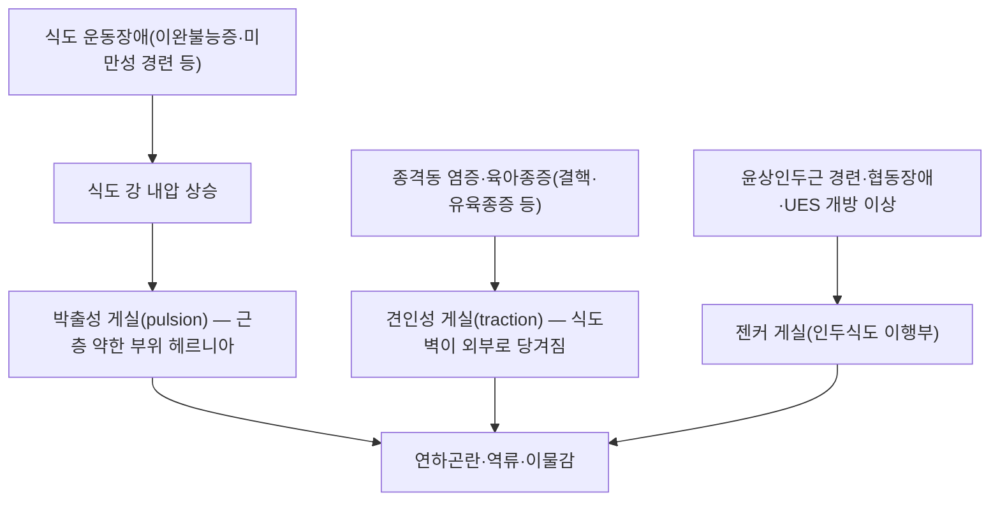

---
aliases:
  - 食道憩室
  - Esophageal diverticulum
  - Zenker diverticulum
  - 젠커 게실
tags:
  - 질환
  - 소화기
  - 식도
---

# 🩺 식도 게실 (食道憩室, Esophageal Diverticulum)

> **핵심 3줄 요약 (Key Summary)**:
> - 📍 병소 부위 & 해부·병태생리: 식도 벽 일부가 바깥쪽으로 주머니처럼 튀어나온 병변. 위치에 따라 인두식도 게실([[젠커 게실]], 상부)·중부 식도 게실·횡격막상 게실(하부)로 나뉘고, 형성 기전에 따라 박출성(pulsion, 강 내 압력 상승으로 근층 약한 부위가 밀려나옴, 대개 식도 운동장애 동반)과 견인성(traction, 종격동 염증·유착이 식도벽을 당김)으로 나뉨.
> - 🚩 전형적 임상 양상 & 3대 징후: 무증상인 경우가 많으나, 진행 시 연하곤란·소화되지 않은 음식물의 역류·구취·이물감·체중 감소·흡인성 폐렴이 나타날 수 있음. 젠커 게실은 윤상인두근의 경련·협동장애·상부식도괄약근 개방 이상과 관련됨.
> - 🛠️ 핵심 감별 검사 & 한·양방 다각적 치료 전략: 진단은 바륨식도조영술이 우선이며, 내시경·고해상도 식도 내압검사(HRM)로 동반 운동장애를 확인. 무증상·소형은 경과관찰, 증상성은 윤상인두근 절개술 등 내시경적 시술(Z-POEM, 유연내시경 격막절개술) 또는 수술적 게실절제·근절개술을 시행.
> - ⚠️ 응급 의뢰 레드플래그: 급격한 체중 감소·반복 흡인성 폐렴·토혈·연하곤란의 급속 진행은 게실 내 저류·천공·악성 변화 감별이 필요해 소화기내과·이비인후과·흉부외과 정밀 평가가 필요.

---

## 📌 목차
1. [질환 개요 & 해부학적 병태생리](#1-질환-개요--해부학적-병태생리)
2. [병태생리 메커니즘 & 생체역학적 악순환 네트워크](#2-병태생리-메커니즘--생체역학적-악순환-네트워크)
3. [임상 증상 & 이학적 검사(Physical Exam) 알고리즘](#3-임상-증상--이학적-검사physical-exam-알고리즘)
4. [감별 진단 매트릭스 (Differential Diagnosis)](#4-감별-진단-매트릭스-differential-diagnosis)
5. [한의 통합 치료 프로토콜 (침·약침·추나·한약)](#5-한의-통합-치료-프로토콜-침약침추나한약)
6. [재활 운동 & 생활습관 티칭 가이드](#6-재활-운동--생활습관-티칭-가이드)
7. [💡 사용자 진료실 핵심 필기 & 임상 노하우 (Melt-In 잔여 심화 집약)](#7--사용자-진료실-핵심-필기--임상-노하우-melt-in-잔여-심화-집약)
8. [출처 및 학술 참고 문헌 (References)](#8-출처-및-학술-참고-문헌-references)

---

## 1. 질환 개요 & 해부학적 병태생리

> ⚠️ 이 노트에는 아직 실제 학술 도해 이미지가 없습니다(신규 작성 노트). 추후 실제 내시경·조영검사 소견 이미지를 보강할 자리입니다.

식도 게실은 식도 벽의 일부(점막·점막하층만, 또는 전층)가 바깥쪽으로 주머니 모양으로 돌출된 병변입니다. 비교적 드문 질환으로 대부분 무증상이며 다른 목적의 영상검사나 내시경에서 우연히 발견되는 경우가 많습니다. 증상이 있을 때는 역류·연하곤란을 주소로 내원합니다(Yam 2026).

**분류**:
- **조직학적**: 전층(식도벽 전체 층이 포함되는 진성 게실 true diverticulum)과 점막·점막하층만 포함하는 가성 게실(false/pseudodiverticulum)로 구분(Yam 2026).
- **형성 기전**: 박출성(pulsion, 강 내압 상승 → 근층이 약한 부위로 밀려나옴, 대개 식도 운동장애 동반) vs 견인성(traction, 종격동 림프절염·육아종증 등 외부 염증이 식도벽을 잡아당김, Guirguis 2016).

**관련 해부학적 구조물**:
- **위치**: 인두식도 이행부(젠커 게실, 상부, 킬리안 삼각)·중부 식도 게실·횡격막상 게실(하부, epiphrenic diverticulum)(Yam 2026).
- **관련 근육**: 윤상인두근(상부식도괄약근, UES) — 젠커 게실의 병태생리에 핵심적으로 관여.

---

## 2. 병태생리 메커니즘 & 생체역학적 악순환 네트워크

### 1) 부위별 병태생리
* **젠커 게실**: 인두식도 이행부의 킬리안 삼각(Killian's triangle)에서 발생하는 박출성 가성 게실로, 윤상인두근의 경련·협동장애, 상부식도괄약근(UES) 개방 이상, 근육 구조 변화가 병태생리에 관여한다고 보고됩니다(Kaminski 2024).
* **횡격막상(epiphrenic) 게실**: 하부 식도에 발생하며, 고해상도 식도 내압검사(HRM)로 확인한 20개 연구·226명 환자 자료에서 이완불능증 등 식도 운동장애가 상당수 동반되는 것으로 보고되었습니다(Anikhindi 2026).
* **중부 식도 게실**: 견인성 기전이 상대적으로 더 관여하며, 종격동 림프절 염증·유육종증에 의한 증례가 보고됩니다(Guirguis 2016). 척추후만증 환자에서 게실 내 출혈이 보고된 증례도 있습니다(Kishi 2019).

### 2) 악순환 네트워크
* 게실 내 음식물·점액 저류 → 만성 자극·염증 → 기존 운동장애 악화 → 게실 내압 추가 상승의 악순환이 형성될 수 있습니다(Anikhindi 2026).

---

## 3. 임상 증상 & 이학적 검사(Physical Exam) 알고리즘

### 1) 주소증 및 증상
* 무증상이 흔하나, 진행 시 연하곤란, 소화되지 않은 음식물·점액의 역류(특히 젠커 게실에서는 취침 시 역류로 인한 흡인), 구취, 인후 이물감, 체중 감소, 반복 흡인성 폐렴이 나타날 수 있습니다(Yam 2026; Kaminski 2024).

### 2) 필수 검사법 (⚠️ 근골격계 유발 검사가 아닌 영상·내시경 검사로 정직하게 재정의)
* **바륨식도조영술**: 게실의 위치·크기·목(neck) 형태를 확인하는 우선 검사입니다.
* **내시경**: 점막 상태·게실 내 저류물을 확인합니다.
* **고해상도 식도 내압검사(HRM)**: 동반 운동장애 평가에 활용됩니다(Anikhindi 2026).
* **감별진단**: 진성 연하곤란을 유발하는 다른 질환([[식도암]], [[식도 협착증]], 이완불능증)과 감별이 필요하며, 실제 연하곤란 없이 인후 이물감만 호소하는 [[매핵기]](globus)와는 임상 양상이 다릅니다.

---

## 4. 감별 진단 매트릭스 (Differential Diagnosis)

| 감별 질환 | 호발 병소 및 원인 | 주소증 차이점 | 진단 포인트 |
| :--- | :--- | :--- | :--- |
| 식도 게실(본 질환) | 박출성/견인성, 위치별(젠커/중부/횡격막상) | 무증상~연하곤란·역류·구취 | 바륨식도조영술상 게실 확인 |
| [[식도암]] | 악성 종양 | 급속 진행성 연하곤란·체중감소 | 내시경 조직검사 악성세포 |
| [[식도 협착증]] | 만성 점막 손상 후 섬유화 | 점진적 고형식 연하곤란 | 내시경상 섬유성 협착 고리 |
| [[매핵기]] | 기능성(globus) | 이물감만, 실제 연하곤란 없음 | 영상·내시경상 구조적 이상 없음 |

---

## 5. 한의 통합 치료 프로토콜 (침·약침·추나·한약)

* **침구·약침·추나 치료**: 식도 게실(구조적 해부학적 병변)에 특화된 침·약침·추나 프로토콜을 볼트 내에서 확인하지 못했습니다(⚠️ 확인 안 되어 창작하지 않음).
* **한약 치료 (⚠️ 내용 검토 필요)**: 인후 이물감을 다루는 [[매핵기]]나 소화기 증상 전반을 다루는 [[연하곤란]] 노트는 있으나, 이들은 기능성 증상(globus, 연하곤란 자체)을 다루는 노트이며 식도 게실이라는 구조적 병변 자체에 대한 한의학적 변증·처방 연계 근거는 확인하지 못했습니다. 증상이 겹치는 경우(연하곤란, 역류, 흡인) 해당 노트의 감별·치료 원칙을 참고할 수 있으나, 게실 자체의 치료(내시경적·수술적 교정)를 대체하지는 않습니다.
* **현대 의학적 치료 (참고)**:
  * **경과관찰**: 무증상·소형 게실은 특별한 치료 없이 경과관찰합니다(Yam 2026).
  * **내시경적 치료**: 젠커 게실은 윤상인두근을 절개하는 유연내시경 격막절개술(flexible endoscopic septotomy)과 젠커 경구내시경근절개술(Zenker per-oral endoscopic myotomy, Z-POEM)이 최소침습적 1차 치료로 자리잡고 있으며, 두 방법의 임상 결과·비용 효과를 비교한 연구들이 보고됩니다(Kaminski 2024; Gupta 2025; Sonaiya 2026; Ikebuchi 2026). 하부 식도 게실에서도 경구내시경근절개술(POEM) 기반 접근이 시도됩니다(Li 2026; Liu 2026).
  * **수술적 치료**: 증상성 횡격막상·중부 식도 게실, 대형 게실, 동반 열공탈장이 있는 경우 복강경·흉강경 게실절제술과 근절개술이 시행됩니다(Aiolfi 2019; Jhaveri 2026; Nitsa 2025; Fernicola 2025; Yamashita 2025; Cucè 2026).
  * ⚠️ 내용 검토 필요: 각 치료법 간 재발률·장기 예후 비교의 표준화된 결론은 문헌마다 차이가 있어(Kaminski 2024), 개별 환자의 게실 크기·위치·동반 운동장애에 따라 치료 방침이 달라집니다.

---

## 6. 재활 운동 & 생활습관 티칭 가이드

> ⚠️ 근골격계 재활 운동이 아닌, 식이·생활습관 교육으로 정직하게 재정의합니다.

* 취침 전 음식 섭취 제한(젠커 게실의 취침 시 역류·흡인 예방).
* 흡인 위험이 있는 환자는 소량씩 나누어 천천히 식사하도록 교육.
* 체중 감소·흡인성 폐렴 반복 시 조기 재평가 필요성 안내.

---

## 7. 💡 사용자 진료실 핵심 필기 & 임상 노하우 (Melt-In 잔여 심화 집약)

* 이 노트는 신규 작성이며, 기존에 원장님이 남긴 진료실 필기가 없습니다.

---

## 8. 출처 및 학술 참고 문헌 (References)

1. **Yam J, Zhu J, Mudalel M (2026)**. *Esophageal Diverticula*. StatPearls [Internet]. PMID: [30422453](https://pubmed.ncbi.nlm.nih.gov/30422453/)
   - **[연구 요약]**: 식도 게실의 정의·분류(진성/가성, 박출성/견인성, 위치별)를 정리한 개관.
2. **Anikhindi S, et al. (2026)**. *Esophageal motility disorders associated with epiphrenic diverticula: a systematic review using high-resolution manometry*. **Diseases of the Esophagus**. PMID: [42647770](https://pubmed.ncbi.nlm.nih.gov/42647770/)
   - **[연구 요약]**: 20개 연구·226명 자료로 횡격막상 게실 환자의 고해상도 식도 내압검사 소견과 시카고 분류상 운동장애 동반율을 정리한 체계적 문헌고찰.
3. **Kaminski MF, et al. (2024)**. *Traditional septotomy or Z-POEM for Zenker's diverticulum*. **Best Practice & Research Clinical Gastroenterology**. PMID: [39209416](https://pubmed.ncbi.nlm.nih.gov/39209416/)
   - **[연구 요약]**: 젠커 게실의 병태생리(윤상인두근 경련·UES 개방 이상)와 유연내시경 격막절개술·Z-POEM의 임상 결과를 비교한 리뷰.
4. **Guirguis S, et al. (2016)**. *Sarcoidosis Causing Mid-Esophageal Traction Diverticulum*. **ACG Case Reports Journal**. PMID: [28008408](https://pubmed.ncbi.nlm.nih.gov/28008408/)
   - **[연구 요약]**: 유육종증에 의한 종격동 염증이 견인성 중부 식도 게실을 유발한 증례.
5. **Kishi K, et al. (2019)**. *Mid-esophageal Diverticular Bleeding in a Patient with Kyphosis*. **Internal Medicine (Tokyo)**. PMID: [31327831](https://pubmed.ncbi.nlm.nih.gov/31327831/)
   - **[연구 요약]**: 척추후만증 환자에서 발생한 중부 식도 게실 내 출혈 증례.
6. **Gupta V, et al. (2025)**. *Zenker per-oral endoscopic myotomy (Z-POEM): The ideal first-line therapy for treatment of Zenker diverticulum*. **Journal of Thoracic and Cardiovascular Surgery**. PMID: [39638238](https://pubmed.ncbi.nlm.nih.gov/39638238/)
7. **Sonaiya S, et al. (2026)**. *Peroral endoscopic myotomy versus flexible endoscopic septotomy for Zenker's diverticulum: a cost-effectiveness analysis*. **Gastrointestinal Endoscopy**. PMID: [42521100](https://pubmed.ncbi.nlm.nih.gov/42521100/)
8. **Ikebuchi Y, et al. (2026)**. *Refined Endoscopic Septotomy Using a Small-Caliber Endoscope and Optimized Closure for Zenker's Diverticulum*. **Digestive Endoscopy**. PMID: [42366158](https://pubmed.ncbi.nlm.nih.gov/42366158/)
9. **Li K, et al. (2026)**. *POEM-based endoscopic myotomy for esophageal diverticulum: a case series study*. **BMC Gastroenterology**. PMID: [42121054](https://pubmed.ncbi.nlm.nih.gov/42121054/)
10. **Liu R, et al. (2026)**. *Bifurcate peroral endoscopic myotomy for the treatment of achalasia with large epiphrenic esophageal diverticulum*. **Surgical Endoscopy**. PMID: [42380627](https://pubmed.ncbi.nlm.nih.gov/42380627/)
11. **Aiolfi A, et al. (2019)**. *Semi-prone video-assisted thoracoscopy for the treatment of large infracarinal traction diverticula*. **Langenbeck's Archives of Surgery**. PMID: [31278489](https://pubmed.ncbi.nlm.nih.gov/31278489/)
12. **Jhaveri RH, et al. (2026)**. *Large epiphrenic oesophageal diverticulum with hiatus hernia: Excellent outcome with laparoscopic transhiatal approach*. **Journal of Minimal Access Surgery**. PMID: [41744404](https://pubmed.ncbi.nlm.nih.gov/41744404/)
13. **Nitsa Z, et al. (2025)**. *Laparoscopic Heller Myotomy for Symptomatic Epiphrenic Diverticula: A Modern Technique*. **Cureus**. PMID: [40453278](https://pubmed.ncbi.nlm.nih.gov/40453278/)
14. **Fernicola A, et al. (2025)**. *Laparoscopic Treatment of a Huge Epiphrenic Esophageal Diverticulum: A Case Report and Literature Review*. **Annali Italiani di Chirurgia**. PMID: [40090848](https://pubmed.ncbi.nlm.nih.gov/40090848/)
15. **Yamashita T, et al. (2025)**. *Thoracoscopic Diverticulectomy for Epiphrenic Esophageal Diverticulum after Peroral Endoscopic Myotomy: A Report of Four Cases*. **Surgical Case Reports**. PMID: [40552008](https://pubmed.ncbi.nlm.nih.gov/40552008/)
16. **Cucè F, et al. (2026)**. *Robotic-Assisted Epiphrenic and Mid-Oesophageal Diverticulectomy: A Tertiary Centre Experience*. **International Journal of Medical Robotics + Computer Assisted Surgery**. PMID: [42435421](https://pubmed.ncbi.nlm.nih.gov/42435421/)
