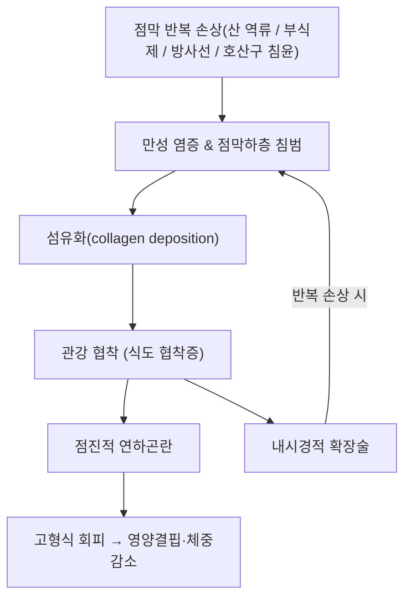

---
tags:
  - status/draft
  - 소화기질환
  - 식도
---

# 🩺 [[식도 협착증]] (Esophageal Stricture, 食道狹窄症, ICD-10 K22.2)

> **핵심 3줄 요약 (Key Summary)**:
> - 📍 병소 부위 & 해부·병태생리: 식도 점막·점막하층의 만성 손상(산 역류·부식성 손상·방사선·호산구 침윤)이 섬유화로 이어져 관강이 좁아지는 상태. 양성(소화성·부식성·방사선·호산구성 식도염 연관) vs 악성(식도암) 협착으로 크게 나뉨.
> - 🚩 전형적 임상 양상 & 3대 징후: 고형식 → 유동식으로 진행하는 점진적 연하곤란(progressive dysphagia)이 핵심 주소증. 체중감소·흡인성 폐렴 동반 시 악성 협착 의심.
> - 🛠️ 핵심 감별 검사 & 한·양방 다각적 치료 전략: 상부위장관 내시경 + 조직검사, 바륨 조영검사로 진단. 내시경적 풍선/탐침 확장술이 표준 치료이며, 소화성 협착은 고용량 PPI 병용이 재협착을 줄임.
> - ⚠️ 응급 의뢰 레드플래그: 급격한 체중감소·진행성 연하곤란·토혈·흑색변은 식도암 감별이 최우선. 확장술 후 흉통·피하기종·발열은 천공 의심 — 즉시 응급 영상·외과 의뢰.

---

## 📌 목차
1. [질환 개요 & 해부학적 병태생리](#1-질환-개요--해부학적-병태생리)
2. [병태생리 메커니즘 & 생체역학적 악순환 네트워크](#2-병태생리-메커니즘--생체역학적-악순환-네트워크)
3. [임상 증상 & 이학적 검사(Physical Exam) 알고리즘](#3-임상-증상--이학적-검사physical-exam-알고리즘)
4. [감별 진단 매트릭스 (Differential Diagnosis)](#4-감별-진단-매트릭스-differential-diagnosis)
5. [한의 통합 치료 프로토콜 (침·약침·추나·한약)](#5-한의-통합-치료-프로토콜-침약침추나한약)
6. [재활 운동 & 생활습관 티칭 가이드](#6-재활-운동--생활습관-티칭-가이드)
7. [💡 사용자 진료실 핵심 필기 & 임상 노하우 (Melt-In 잔여 심화 집약)](#7--사용자-진료실-핵심-필기--임상-노하우-melt-in-잔여-심화-집약)
8. [출처 및 학술 참고 문헌 (References)](#8-출처-및-학술-참고-문헌-references)

---

## 1. 질환 개요 & 해부학적 병태생리

> ⚠️ 이 노트에는 아직 실제 학술 도해 이미지가 없습니다(신규 작성 노트). 추후 실제 내시경·조영검사 소견 이미지를 보강할 자리입니다.

* **정의**: 식도 벽의 섬유화·협착으로 관강이 좁아져 음식물 통과가 방해받는 상태. 양성 협착이 대부분이며, 악성 협착(식도암에 의한 관강 폐쇄)과는 원인·예후·치료가 다릅니다(Thanawala 2025).
* **분류(원인별)**:
  * **소화성(peptic) 협착**: 만성 위산 역류([[역류성 식도염]])로 하부 식도 점막이 반복 손상되며 섬유화된 형태로, 양성 협착 중 가장 흔한 원인입니다(Richter 2018).
  * **부식성(corrosive) 협착**: 강산·강알칼리 등 부식제 섭취 급성기 손상 후 수주~수개월 내 반흔 협착이 발생합니다(Chirica 2017; Kalayarasan 2019).
  * **방사선 유발(radiation-induced) 협착**: 두경부·흉부 방사선 치료 후 지연성 섬유화로 발생합니다(Sayeh 2023).
  * **호산구성 식도염 연관 협착**: 만성 호산구 침윤으로 식도 벽이 재구성(remodeling)되며 관강이 좁아지거나 "크레이프 페이퍼(crepe-paper)" 점막을 보입니다(Muir 2021; Gonsalves 2020).
  * **악성(malignant) 협착**: 식도암·주변 장기 종양의 직접 침범으로 인한 관강 폐쇄로, 양성 협착과 감별이 필수입니다.
* **관련 해부학적 구조물**: 하부 식도 괄약근·식도 점막-점막하층(소화성 협착), 식도 전 구간(부식성), 호산구 침윤 부위(근위·원위 양쪽 생검 대상).

---

## 2. 병태생리 메커니즘 & 생체역학적 악순환 네트워크

### 1) 소화성 협착의 기전
* 위산·펩신의 반복 노출로 하부식도 점막 상피가 손상되고, 치유 과정에서 콜라겐이 과다 침착되며 협착 고리가 형성됩니다(Richter 2018).

### 2) 확장술-재발의 악순환 네트워크
* 원인 질환(역류·호산구성 식도염)이 조절되지 않으면 확장술 후에도 섬유화가 재진행해 반복 확장이 필요한 경우가 많습니다(Thanawala 2025).

---

## 3. 임상 증상 & 이학적 검사(Physical Exam) 알고리즘

### 1) 주소증
* **점진적 연하곤란**: 처음에는 딱딱한 고형식(고기·빵)에서만 걸리다가, 진행하면 죽·유동식에서도 나타납니다. 급격히 악화되면 악성 협착을 의심합니다.
* **동반 증상**: 흉골 뒤 이물감, 음식물 역류, 체중감소, 반복 흡인으로 인한 기침·흡인성 폐렴.
* **부식성 협착**: 섭취 급성기 구강·인두 손상 과거력, 수주~수개월의 무증상기 후 연하곤란이 나타나는 경과가 특징입니다(Chirica 2017).

### 2) 필수 검사법 (⚠️ 근골격계 이학적 검사가 아닌 내시경·영상 검사로 정직하게 재정의)
* **상부위장관 내시경 + 조직검사**: 협착 부위 직접 관찰과 동시에 악성 여부 확인을 위한 조직검사가 필수입니다. 호산구성 식도염이 의심되면 근위·원위 식도 양쪽에서 생검합니다(Muir 2021).
* **바륨 식도조영검사(barium esophagram)**: 협착의 길이·직경·위치를 내시경 삽입 전 파악하는 데 유용하며, 특히 좁아 내시경이 통과하지 못하는 협착의 평가에 사용됩니다.
* **내시경 시행 시 위험 평가**: 확장술은 천공 위험을 동반하므로 시술 전 위험도 평가가 필요합니다(ASGE Standards of Practice Committee 2012).

---

## 4. 감별 진단 매트릭스 (Differential Diagnosis)

| 감별 질환 | 원인·기전 | 증상 차이점 | 진단 포인트 |
| :--- | :--- | :--- | :--- |
| 식도 협착증(본 질환) | 만성 점막 손상 후 섬유화 | 수개월~수년에 걸친 점진적 고형식 연하곤란 | 내시경상 섬유성 협착 고리, 조직검사 양성 소견 없음 |
| [[식도암]] | 악성 종양의 관강 침범 | 수주~수개월 내 급속 진행, 체중감소 동반 | 내시경 조직검사에서 악성세포 확인 |
| [[역류성 식도염]] | 위산 역류로 인한 점막 염증(협착 전 단계) | 가슴쓰림·산 역류가 주증상, 연하곤란은 경미하거나 없음 | 내시경상 미란성 식도염 소견, 협착 없음 |
| [[범발성 식도 경련]] | 식도 평활근의 비정상 수축 | 간헐적·비진행성 연하곤란, 흉통 동반 가능 | 식도 내압검사(manometry)에서 이상 수축 패턴 |
| [[식도 게실]] | 식도 벽 게실 형성 | 무증상~역류·구취·연하곤란 | 바륨식도조영술상 게실 확인 |

---

## 5. 한의 통합 치료 프로토콜 (침·약침·추나·한약)

> ⚠️ 이 절의 한의학적 서술은 볼트 내 실제 확인된 연계만 기재했습니다. 침구·약침·추나 구체 프로토콜(시술점·주파수 등)은 이 질환에 대한 원장님 필기가 아직 없어 비워둡니다(⚠️ 확인 안 되어 창작하지 않음).

* **한의학적 병증 연계**: 전통적으로 "음식을 삼키지 못하거나 삼켜도 넘어가지 않는" 병증을 [[열격]](噎膈)으로 분류하며, 볼트 노트는 열격의 현대적 대응 질환으로 "식도의 악성 종양, 협착, 하부식도질환과 식도이완불능증, 미만성 식도경련" 등을 명시하고 있어 식도 협착증과 직접 연계됩니다.
* **감별해야 할 유사 병증**: 열격 노트는 [[매핵기]](목에 걸린 느낌이나 삼킴 자체는 가능), 반위, [[구토]], [[애역]]을 감별 대상으로 제시합니다 — 식도 협착증의 특징인 "삼킴 자체의 기계적 방해"와는 구분되는 병증들입니다.
* **변증**: 열격 노트에 담기교조·진휴열결·담어내결·기허양미 등의 변증 분류가 있으나, 식도 협착증(양성 섬유화 협착)에 어느 변증이 대응하는지는 이번 조사에서 확인하지 못했습니다. ⚠️ 내용 검토 필요.
* **본초·처방 연계**: 볼트 `2. 약리 공부/처방/`에서 식도 협착증을 직접 적응증으로 명시한 처방은 확인하지 못했습니다. 임의로 연결하지 않고 비워둡니다.
* **현대 의학적 치료 (참고)**: 내시경적 풍선/탐침 확장술이 표준 치료이며, 소화성 협착은 고용량 PPI 병용이 재협착을 줄입니다(Thanawala 2025).

---

## 6. 재활 운동 & 생활습관 티칭 가이드

> ⚠️ 근골격계 재활 운동이 아닌, 식이·생활습관 교육으로 정직하게 재정의합니다.

* **식이 조절**: 급성 악화기·확장술 직후에는 유동식~연식 위주로 전환하고, 충분히 씹고 천천히 삼키도록 안내합니다.
* **역류 예방**: 소화성 협착의 근본 원인이 위산 역류인 경우, 취침 전 2~3시간 금식·상체 거상 수면 등 역류 예방 생활습관이 재협착 위험을 낮추는 데 도움이 됩니다(Richter 2018의 GERD 관리 원칙과 연계).
* **흡인 예방**: 연하곤란이 심한 환자는 식사 중 사레·흡인 위험이 높아, 앉은 자세 식사·소량씩 나누어 먹기를 교육합니다.
* **고용량 PPI 병용**: 소화성 협착으로 확장술을 받는 환자는 위산 억제 치료를 병행해야 재협착 빈도가 줄어든다는 것이 임상에서 확립되어 있습니다(Thanawala 2025).

---

## 7. 💡 사용자 진료실 핵심 필기 & 임상 노하우 (Melt-In 잔여 심화 집약)

* 이 노트는 완전 신규 작성 노트로, 기존 원장님 필기가 없습니다. 추후 실제 진료 경험이 쌓이면 이 절에 채워 넣습니다.

---

## 8. 출처 및 학술 참고 문헌 (References)

1. **Thanawala SU, et al. (2025)**. *Management of Esophageal Strictures*. **Gastrointestinal Endoscopy Clinics of North America**. PMID: [40412994](https://pubmed.ncbi.nlm.nih.gov/40412994/)
   - **[연구 요약]**: 식도 협착증 전반(소화성·부식성·방사선성·호산구성·악성)의 진단·내시경적 확장술·재협착 예방 전략을 다룬 최신 종설.
2. **Richter JE, Rubenstein JH (2018)**. *Presentation and Epidemiology of Gastroesophageal Reflux Disease*. **Gastroenterology**, 154(2):267-276. PMID: [28780072](https://pubmed.ncbi.nlm.nih.gov/28780072/)
   - **[연구 요약]**: GERD의 임상 양상·역학. 소화성 협착의 기저 원인인 만성 역류의 병태생리를 뒷받침.
3. **Chirica M, et al. (2017)**. *Caustic ingestion*. **Lancet**, 389(10083):2041-2052. PMID: [28045663](https://pubmed.ncbi.nlm.nih.gov/28045663/)
   - **[연구 요약]**: 부식제 섭취 후 급성 손상부터 지연성 반흔 협착까지의 임상 경과와 관리를 정리한 종설.
4. **Kalayarasan R, Ananthakrishnan N (2019)**. *Corrosive Ingestion*. **Indian Journal of Critical Care Medicine**, 23(Suppl 4):S282-S286. PMID: [32021005](https://pubmed.ncbi.nlm.nih.gov/32021005/)
   - **[연구 요약]**: 부식제 섭취의 급성기 처치와 장기 협착 합병증 관리를 다룸.
5. **Muir A, Falk GW (2021)**. *Eosinophilic Esophagitis: A Review*. **JAMA**, 326(13):1310-1318. PMID: [34609446](https://pubmed.ncbi.nlm.nih.gov/34609446/)
   - **[연구 요약]**: 호산구성 식도염의 진단·치료 종설. 만성 염증이 식도 재구성·협착으로 이어지는 기전을 설명.
6. **Gonsalves NP, Aceves SS (2020)**. *Diagnosis and treatment of eosinophilic esophagitis*. **Journal of Allergy and Clinical Immunology**, 145(1):1-7. PMID: [31910983](https://pubmed.ncbi.nlm.nih.gov/31910983/)
   - **[연구 요약]**: 호산구성 식도염의 진단 기준(양측 생검 포함)과 치료 원칙.
7. **Sayeh W, et al. (2023)**. *Combined Antegrade-Retrograde Dilation of Radiation-Induced Benign Esophageal Stenosis*. **ACG Case Reports Journal**. PMID: [36713284](https://pubmed.ncbi.nlm.nih.gov/36713284/)
   - **[연구 요약]**: 방사선 치료 후 발생한 양성 식도 협착 1예의 병력·치료 경과를 다룬 증례 보고(단일 증례, 일반화 제한).
8. **ASGE Standards of Practice Committee (2012)**. *Adverse events of upper GI endoscopy*. **Gastrointestinal Endoscopy**, 76(4):707-718. PMID: [22985638](https://pubmed.ncbi.nlm.nih.gov/22985638/)
   - **[연구 요약]**: 상부위장관 내시경·확장술의 천공 등 합병증 발생률을 다룬 표준 지침.
