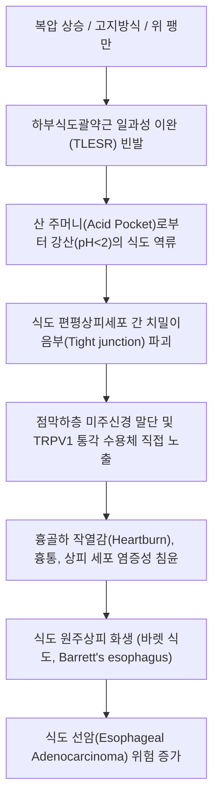

# 역류성 식도염 (위식도 역류질환, GERD)

> **핵심 3줄 요약 (Key Summary)**:
> 🎯 위산, 펩신, 담즙 등 위 내용물이 식도로 병적 역류하여 흉골하 작열감(Heartburn)과 산역류(Acid regurgitation)를 유발하고 식도 점막 손상을 초래하는 만성 염증성 질환.
> 🚩 하부식도괄약근(LES)의 일과성 이완(TLESR), 복압 상승으로 인한 횡격막 식도열공 허니아(Hiatal hernia), 식도 산 청식능력 지연 및 상피 치밀이음부 파괴가 핵심 병태생리.
> 🔬 양방 1차 치료는 프로톤펌프억제제([[오메프라졸]], [[에소메프라졸]]) 및 P-CAB 제제이며, 한의학에서는 탄산(呑酸), 토산(吐酸), 매핵기(梅核氣)로 보아 [[반하사심탕]], [[좌금환]], [[시호소간산]], [[향사육군자탕]] 합 [[선복대자탕]] 및 중완·거궐·내관·족삼리 침구 치료.
> ⚠️ PPI 장기 복용 시 저마그네슘혈증, 골다공증, Clostridium difficile 장염 위험이 증가하므로 한약 병용을 통한 단계적 테이퍼링과 식후 즉시 눕기 금지·상체 15~20cm 거상 수면 지도 필수.

---

## 1. 개요 및 역학 (Overview & Epidemiology)

위식도 역류질환(Gastroesophageal Reflux Disease, GERD)은 위 내용물이 식도 내로 역류하여 불편한 증상(가슴쓰림, 산역류)을 유발하거나 식도 점막의 형태조직학적 손상(미란, 궤양, 협착, 바렛 식도)을 초래하는 질환군입니다.

내시경 검사 상 식도 점막 결손이 확인되는 **미란성 역류질환(Erosive Reflux Disease, ERD, 전형적 역류성 식도염)**과 점막 결손은 없으나 동일한 고통을 겪는 **비미란성 역류질환(Non-erosive Reflux Disease, NERD)**으로 대별되며, 실제 임상 환자의 약 60~70%는 NERD에 해당합니다.

![[위식도역류질환_하부식도괄약근_병태생리.jpg|450]]
> [위식도 역류질환의 하부식도괄약근(LES) 병태생리: 정상적인 식도-위 접합부의 괄약근 폐쇄(상)와 괄약근 기능부전으로 위산과 소화효소가 식도 상부로 치밀어 오르는 역류 기전(하)]

### 1) 역학적 특징
* **유병률**: 서구에서는 성인 인구의 15~25%에 달하며, 한국을 포함한 동아시아에서도 식습관의 서구화(육류·고지방식·인스턴트 섭취 증가), 비만율 상승, 헬리코박터 파일로리 감염률 감소와 맞물려 유병률이 과거 3~5%에서 최근 10~15% 수준으로 가파르게 증가하고 있습니다.
* **호발 요인**: 복부 비만, 흡연, 알코올, 고카페인 음용, 취침 직전 야식 섭취 습관, 칼슘채널차단제(CCB) 및 항콜린제 복용 환자에서 빈발합니다.

---

## 2. 병태생리 및 발생 메커니즘 (Pathophysiology & Biomechanics)

위식도 역류는 식도 점막을 공격하는 인자(위산, 펩신, 담즙산)와 식도를 보호하는 방어 인자(하부식도괄약근, 식도 연동운동, 타액 중탄산염) 사이의 항상성이 붕괴되어 발생합니다.

![[식도열공허니아_활탈성탈장_해부도.png|500]]
> [정상 식도-위-횡격막 구조(상)와 식도열공 허니아(Hiatal Hernia, 하) 해부 비교: 횡격막 다리(Diaphragmatic crura) 지지력이 상실되고 위 분문부가 흉강 내로 탈장되어 외부 압박 밸브가 붕괴되는 기전]

![[식도_위_접합부_역류성식도염_도해.png|380]]
> [식도-위 접합부(EGJ) 및 Z-line 점막 손상 도해: 위산 노출에 취약한 중층편평상피 부위의 미란과 궤양 형성]

### 1) 하부식도괄약근(LES) 기능부전과 TLESR
정상 하부식도괄약근은 평상시 10~30mmHg의 기저압을 유지하여 역류를 방지합니다. 그러나 음식물 섭취 후 위저부 팽만 시 발생하는 **일과성 하부식도괄약근 이완(Transient LES Relaxation, TLESR)**이 비정상적으로 잦아지거나, 기저압 자체가 10mmHg 이하로 저하되면 역류가 일어납니다.

### 2) 복압(Intra-abdominal Pressure)과 횡격막 식도열공 탈장
* **복압 상승 병태**: 단순 비만 외에도 **간경변성 [[간문맥 고혈압]], [[복수]], 만성 변비, 임신, 복대 착용** 등으로 복압이 상승하면 횡격막이 상방으로 신장되면서 식도열공 틈새가 벌어집니다.
* **식도열공 허니아 (Hiatal Hernia)**: 횡격막 다리(Crura)가 LES를 외측에서 꽉 조여주는 '외인성 조임근(Extrinsic sphincter)' 역할을 상실하여 산 역류 방어벽이 완전히 무너집니다.

### 3) 산염기 불균형과 중탄산염 분비 장애
* 전신적인 **[[대사성 산증]]**이나 타액 분비선 기능 저하 환자는 타액 및 식도 점막하 분비선에서 위산을 중화시켜주는 **중탄산염($HCO_3^-$) 분비능이 결핍**됩니다.
* 이로 인해 식도로 넘어온 위산이 신속히 중화·세척되지 못하는 식도 산 청식능력(Esophageal acid clearance) 지연이 발생하여 점막 손상이 가속화됩니다.

### 4) 조직학적 변화: 바렛 식도 (Barrett's Esophagus)
산에 취약한 식도의 중층편평상피(Stratified squamous epithelium)가 지속적인 산 노출에 적응하기 위해 배세포(Goblet cell)를 포함한 장형 원주상피(Specialized columnar epithelium)로 대체되는 병태입니다. 바렛 식도는 식도 선암의 강력한 전구 병변이므로 정기적인 내시경 감시가 필수적입니다.

---

## 3. 임상 증상 및 식도 외 증후군 (Clinical Features & Extraesophageal GERD)

### 1) 전형적 식도 증상 (Typical Esophageal Symptoms)
* **가슴쓰림 (Heartburn)**:
  * 명치 끝에서 목구멍 쪽으로 치밀어 오르는 듯한 타는 듯한 작열통.
  * 주로 식후 30분~2시간 이내, 또는 앞으로 몸을 숙이거나 반듯이 누웠을 때 극심해짐.
* **산역류 (Acid Regurgitation)**:
  * 신트림과 함께 위 내용물이나 쓴맛·신맛의 위산이 목이나 입안으로 넘어옴.
* **비심인성 흉통 (Non-cardiac Chest Pain)**:
  * 협심증과 유사하게 흉골 뒤를 쥐어짜거나 뻐근한 통증이 발생하여 심장내과 진료를 먼저 받는 경우가 많음.

### 2) 비전형적 및 식도 외 증후군 (Extraesophageal Reflux, EERD / LPR)
* **인후두 역류증 (Laryngopharyngeal Reflux, LPR)**:
  * 목에 가래나 솜뭉치가 걸린 듯 삼켜도 넘어가지 않는 이물감인 **매핵기(梅核氣)**.
  * 아침 기상 시 쉰 목소리(애성), 잦은 헛기침(Throat clearing), 인후통.
* **만성 마른기침 및 천식 악화**:
  * 미세 흡인된 위산 입자가 미주신경성 식도-기관지 반사(Esophagobronchial reflex)를 자극하여 8주 이상 지속되는 만성 기침을 유발.
* **치아 부식증**:
  * 구강 내로 역류한 강산이 치아 법랑질(Enamel)을 용해시켜 치아가 시리고 패임.

---

## 4. 진단 및 내시경 LA 분류 (Diagnosis & LA Classification)

### 1) 진단적 PPI 투여 검사 (PPI Test)
* 전형적인 가슴쓰림과 산역류를 호소하는 환자에게 표준 용량의 PPI를 1~2주간 투여하여 증상이 50% 이상 호전되면 임상적으로 GERD로 잠정 진단.

### 2) 상부위장관 내시경 검사 및 LA 분류법 (Los Angeles Classification)

| 병기 (Grade) | 내시경적 점막 손상 기준 | 임상적 의의 |
| :--- | :--- | :--- |
| **LA-Grade A** | 점막 융기 주름에 국한된 **5mm 이하**의 단일 또는 다발성 점막 결손 | 경미한 미란성 식도염 |
| **LA-Grade B** | 최소 하나 이상의 점막 결손 길이가 **5mm를 초과**하나, 두 점막 주름 사이를 연결하지 않음 | 중등도 식도염, PPI 반응 우수 |
| **LA-Grade C** | 두 개 이상의 점막 주름에 걸쳐 연결되어 있으나, 식도 원주의 **75% 미만**을 침범 | 중증 식도염, 궤양/출혈 동반 가능 |
| **LA-Grade D** | 식도 원주의 **75% 이상**을 침범하는 광범위한 융합성 점막 결손 | 식도 협착, 출혈, 바렛 식도 고위험군 |

### 3) 24시간 보행성 식도 pH-임피던스 모니터링 & 고해상도 식도내압검사 (HRM)
* PPI 불응성 환자, 비전형적 증상 환자에서 비산성 역류(Non-acid reflux)와 식도 운동 질환(이완불능증 등)을 감별하는 표준 정밀 검사.

---

## 5. 양방 치료 및 약리 (Pharmacotherapy & Conventional Care)

### 1) 프로톤 펌프 억제제 (Proton Pump Inhibitors, PPI)
* **약제 종류**: [[오메프라졸]](Omeprazole), [[에소메프라졸]](Esomeprazole, 넥시움), 판토프라졸, 란소프라졸.
* **약리 기전**: 위벽세포(Parietal cell)의 $H^+/K^+$-ATPase 효소에 비가역적으로 결합하여 최종 위산 분비를 차단.
* **복용법**: 아침 식전 30~60분 공복에 복용해야 식사 자극으로 활성화되는 프로톤 펌프를 최대로 억제할 수 있음.
* **장기 복용 부작용**: 저산증으로 인한 칼슘·마그네슘·비타민 B12 흡수 장애(골다공증 및 골절 위험), Clostridium difficile 장염, 소장 세균 과증식(SIBO), 리바운드성 위산 과다.

### 2) 칼륨 경쟁적 위산분비 억제제 (P-CAB)
* **약제 종류**: 테고프라잔(케이캡), 펙수프라잔(펙수클루).
* **장점**: 식사 여부와 무관하게 복용 가능하며, 약효 발현 시간이 30분 이내로 빠르고 야간 산 분비 억제(NAB) 효과가 우수.

### 3) 점막 보호제 및 제산제
* 알긴산나트륨(Gaviscon): 위 내용물 상층부에 중성 겔 래프트(Raft)를 형성하여 물리적 역류 차단.

---

## 6. 한의학적 변증 및 치료 (Traditional Korean Medicine)

한의학에서 역류성 식도염은 **탄산(呑酸, 신물이 넘어옴)**, **토산(吐酸, 신물을 토함)**, **조잡(嘈雜, 속쓰림)**, **비만(痞滿, 명치 답답함)**, **매핵기(梅核氣, 목 이물감)**의 범주에 속합니다.

기저 병태는 **간위불화(肝胃不和, 스트레스성)**, **담습울조(痰濕鬱阻)**, **비위허한(脾胃虛寒)**, **위기허역(胃氣虛逆)**으로 변증하여 소간화위(疎肝和胃)와 강역지애(降逆止呃)를 위주로 치료합니다.

### 1) 변증 분류 및 대표 처방 (Syndrome Differentiation)

| 변증 유형 | 주증 및 설맥 | 병태생리 기전 | 대표 방제 | 구성 본초 |
| :--- | :--- | :--- | :--- | :--- |
| 간위불화형 (스트레스성) | 분노·긴장 시 가슴쓰림 격발, 흉협고만, 트림, 맥현 | 간기울결로 간목이 위토를 억압하여 위기 상역 | [[사역산]] 합 [[좌금환]] | [[시호]], [[백작약]], [[지실]], [[황련]], [[오수유]] |
| 한열착잡·담습형 | 심하비(명치 답답), 오심, 쓴물 역류, 설태황니, 맥활삭 | 비위 운화 실조로 수습 담음과 열이 엉켜 정체 | [[반하사심탕]] | [[반하]], [[황금]], [[황련]], [[건강]], [[인삼]] |
| 위기허역형 (기허성) | 식후 즉시 답답함, 신트림, 헛구역질, 소화불량, 맥세약 | 비위의 중기가 허약하여 아래로 내려보내지 못함 | [[향사육군자탕]] 합 [[선복대자탕]] | [[인삼]], [[백출]], [[복령]], [[선복화]], [[대자석]] |
| 위열치성형 | 타는 듯한 흉골하 격통, 구갈, 찬물 선호, 변비, 맥홍삭 | 위화(胃火)가 성하여 식도 점막을 직접 소작 | [[청위산]] 합 [[소함흉탕]] | [[황련]], [[승마]], [[생지황]], [[과루인]], [[반하]] |

### 2) 보원기(補元氣)·건중화위(健中和胃) 가감법 (임상 의안 반영)
* 만성적인 식도 괄약근 무력증 및 횡격막 이완 상태를 회복시키기 위해 원기(元氣)를 돋우고 중초를 튼튼히 하는 약재를 적극 배합합니다:
  * [[황기]], [[백삼]], [[산약]]: 보기승양(補氣升陽)하여 하부식도괄약근 및 횡격막 지지력 회복.
  * [[사인]], [[백두구]], [[회향]]: 방향화습(芳香化濕) 및 이기화위하여 위내 저류물 정체와 위 팽만 해소.
  * [[시호]], [[귤핵]]: 간기울체를 풀고 골반 및 복강 내 순환을 원활히 소통.

### 3) 침구 치료 혈위 및 배혈법
* **위장관 및 횡격막 조절 4대 혈**:
  * 중완(CV12, 위의 모혈): 위장관 평활근 운동 리듬 정상화 및 위 배출능 촉진.
  * 거궐(CV14, 심장의 모혈): 횡격막 식도열공 바로 전방에 위치하여 식도하부 연축 및 역류성 흉통 즉각 완화.
  * 단중(CV17, 기회혈): 흉골 중앙에 위치하여 식도성 흉통 및 흉민, 매핵기 소통.
  * 내관(PC6, 심포경 낙혈) / 족삼리(ST36, 위경 합혈): 미주신경-자율신경 반사를 조절하여 하부식도괄약근의 일과성 이완(TLESR) 발생 억제.

---

## 7. 진료실 핵심 필기 및 실전 가이드 (Clinical Notes & Protocols)

### 1) 진료실 복압(Intra-abdominal Pressure) 체크리스트
* 역류성 식도염 환자를 진찰할 때 단순히 위산 과다로만 보지 말고, **복강 내 압력을 높이는 원인**을 반드시 감별해야 합니다:
  * 복부 팽만 및 만성 가스 저류가 있는지 촉진.
  * 타이트한 청바지, 코르셋, 벨트 착용 여부 문진.
  * 간질환 병력(간경변, 간문맥 고혈압, 초기 복수)으로 인해 횡격막이 위로 밀려 올라가 있지 않은지 확인.
  * 복압이 높아져 횡격막이 늘어나면 그 사이를 통과하는 식도 괄약근이 물리적으로 벌어지므로, 침치료와 함께 복압을 감압하는 배변 관리 및 복부 이완이 선행되어야 합니다.

### 2) 산염기 대사 불균형과 위산 중화 실패
* 대사성 산증이나 만성 탈수 환자는 혈중 중탄산염 농도가 저하되어 타액과 십이지장에서 위산을 중화하는 완충능력이 마비됩니다.
* 이 경우 제산제를 투여해도 일시적일 뿐이며, 온수 섭취와 전신 전해질 균형, 비장 기능 개선을 통해 자체 완충 중탄산염 분비를 복원시켜야 합니다.

### 3) PPI 테이퍼링 및 한의 치료 연계 전략
* 수개월~수년간 PPI를 고용량 복용해 온 환자는 약을 끊으면 가스트린 반동성 과분비(Rebound hyperacidity)로 인해 불지옥 같은 가슴쓰림을 겪습니다.
* **프로토콜**:
  1. PPI 복용을 유지하면서 [[반하사심탕]] 또는 [[좌금환]] 한약 엑스제/탕약을 2~4주간 병용 투여하여 점막 염증과 식도 점막 저항성을 먼저 회복시킵니다.
  2. 증상이 안정되면 PPI를 매일 복용에서 격일 복용으로 줄이고, H2 차단제(파모티딘)로 스위칭합니다.
  3. 속쓰림이 소실되면 주 2회 복용으로 낮추고 최종적으로 한약 단독 관리 체제로 전환합니다.

### 4) 환자 생활 습관 절대 수칙 (티칭 스크립트)
* **식후 3시간 절대 눕기 금지**: 식사 후 바로 눕는 습관은 중력 방어벽을 제거하는 최악의 행위임을 강력 경고합니다.
* **수면 시 상체 거상 (15~20cm Elevation)**:
  * 베개만 높게 베면 목이 꺾여 기도가 좁아지고 복압이 오히려 올라갑니다.
  * 침대 상체 전체를 기울이는 웻지 필로우(Wedge pillow)를 사용하거나 침대 머리 쪽 다리 밑에 벽돌을 괴어 15~20cm 상체 전체를 경사지게 높여 자도록 티칭합니다.
* **음식 제한**: 커피, 초콜릿, 박하(민트), 오렌지주스, 토마토, 튀김류는 하부식도괄약근을 직접 이완시키므로 엄격히 차단합니다.

---

## 8. 참고문헌 및 최신 연구 (References)

* Vakil N, van Zanten SV, Kahrilas P, et al. The Montreal definition and classification of gastroesophageal reflux disease: a global evidence-based consensus. *Am J Gastroenterol*. 2006;101(8):1900-1920. doi:10.1111/j.1572-0241.2006.00630.x. [PubMed (PMID: 16928254)](https://pubmed.ncbi.nlm.nih.gov/16928254/)
  > [연구 요약] 전 세계 소화기내과 합의로 제정된 GERD의 몬트리올 국제 표준 정의 및 분류 논문으로 전형적 식도 증후군, 점막 결손 증후군, 식도 외 증후군(만성 기침, 후두염)의 표준 진단 알고리즘을 확립함.
* Katz PO, Dunbar KB, Schnoll-Sussman FH, et al. ACG Clinical Guideline for the Diagnosis and Management of Gastroesophageal Reflux Disease. *Am J Gastroenterol*. 2022;117(1):27-56. doi:10.14309/ajg.0000000000001538. [PubMed (PMID: 34807007)](https://pubmed.ncbi.nlm.nih.gov/34807007/)
  > [연구 요약] 미국소화기학회(ACG)의 공식 GERD 가이드라인으로 PPI 및 P-CAB의 최적 투여 지침, 내시경적 스크리닝 및 바렛 식도 감시 주기, 비약물적 생활 습관 교정(상체 거상, 체중 감량)의 근거 수준을 명문화함.
* Gyawali CP, Fass R. Management of Gastroesophageal Reflux Disease. *Gastroenterology*. 2018;154(2):302-318. doi:10.1053/j.gastro.2017.07.049. [PubMed (PMID: 28827081)](https://pubmed.ncbi.nlm.nih.gov/28827081/)
  > [연구 요약] 위식도 역류질환의 하부식도괄약근 일과성 이완(TLESR), 식도열공 탈장, 식도 점막 저항성 손상에 관한 생체역학적 병태생리와 불응성 GERD의 다학제 접근법을 집대성한 표준 종설.
* Huang Y, Chen H, Lin J, et al. Efficacy of Nonpharmacological Interventions and Combination With Pharmacological Interventions for Gastroesophageal Reflux Disease: A Systematic Review and Network Meta-Analysis. *J Clin Gastroenterol*. 2025;59(10):890-904. doi:10.1097/MCG.0000000000002142. [PubMed (PMID: 40838809)](https://pubmed.ncbi.nlm.nih.gov/40838809/)
  > [연구 요약] GERD 환자에 대한 비약물적 치료 및 한양방 복합 치료의 네트워크 메타분석으로, 침 치료 및 한약 병용 요법이 PPI 단독 투여군 대비 임상 증상 개선율과 내시경적 점막 치유율을 유의하게 높이고 재발률을 낮춤을 입증함.
