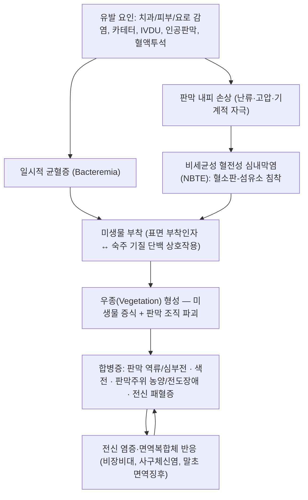

# 🩺 [[감염성 심내막염]] (Infective Endocarditis / 感染性心內膜炎, ICD-10 I33 / KCD I33.0)

![[감염성 심내막염_1_1.jpg|540]]
> [그림 1: ① 병태생리·영상 — Diagnostic-value-of-harmonic-transthoracic-echocardiography-in-native-valve-infective-endocarditis-1476-7120-5-20-S1.ogv]
![[감염성 심내막염_2_1.jpg|540]]
> [그림 2: ② 관련 해부 구조물 — Heart model valve views.png]

> **핵심 3줄 요약 (Key Summary)**:
> - 📍 병소 부위 & 해부·병태생리: 심장 **심내막(endocardium)과 판막엽**에 미생물이 부착·증식하여 **우종(vegetation, 贅腫)**을 형성하는 전신 감염질환. 승모판·대동맥판(좌심계)이 대표 호발 부위이며, [[삼첨판]](정맥주사 약물남용), [[인공판막]], 심장내 기기(전극선·보철물)도 주요 표적이다. 내피 손상 → 혈소판-섬유소 침착 → 균혈증기의 미생물 부착 → 판막 파괴·색전·패혈증의 악순환.
> - 🚩 전형적 임상 양상 & 3대 징후: ① **발열·오한·야간 발한**(가장 흔한 주소증) ② **새로 발생하거나 악화된 판막 역류성 심잡음**([[심잡음]]) ③ **색전 사건**(뇌졸중, 사지·장간막·콩팥 색전) 또는 **심부전**. 말초 징후로 [[Osler 결절]], [[Roth 반점]], [[Janeway 병변]], 선상 출혈, 비장비대, 곤봉지.
> - 🛠️ 핵심 감별 검사 & 한·양방 다각적 치료 전략: 항생제 투여 **전** 3쌍 이상 [[혈액배양]], [[경흉부심초음파]](TTE) → [[경식도심초음파]](TEE), [[Modified Duke Criteria]](2023 ISCVID 개정판), 심장 CT·¹⁸F-FDG PET/CT[5]. 치료는 **정맥 항생제 4~6주 + 수술적 처치**가 근간이며, 한의 치료(침·약침·한약)는 **급성기에는 절대적 금기·보조 불가**, 회복기 및 후유증 관리 단계에서만 제한적으로 병행한다[1][2].
> - ⚠️ 응급 의뢰 레드플래그 & 악화 요인: **발열 + 심잡음 + 색전(신경학적 결손)** 3주 증후군은 즉시 상급병원 응급 이송. 급성 심부전, 지속적 균혈증, 판막 주위 농양·전도장애(PR 연장), 원인 불명 발열 2주 이상, 인공판막 환자의 발열은 전부 **한의원 단독 진료 금기**. 발열기에 침습적 시술(침·약침·추나 포함) 금지.

---

## 📌 목차
1. [질환 개요 & 해부학적 병태생리](#1-질환-개요--해부학적-병태생리)
2. [병태생리 메커니즘 & 생체역학적 악순환 네트워크](#2-병태생리-메커니즘--생체역학적-악순환-네트워크)
3. [임상 증상 & 이학적 검사(Physical Exam) 알고리즘](#3-임상-증상--이학적-검사physical-exam-알고리즘)
4. [감별 진단 매트릭스 (Differential Diagnosis)](#4-감별-진단-매트릭스-differential-diagnosis)
5. [한의 통합 치료 프로토콜 (침·약침·추나·한약)](#5-한의-통합-치료-프로토콜-침약침추나한약)
6. [재활 운동 & 생활습관 티칭 가이드](#6-재활-운동--생활습관-티칭-가이드)
7. [💡 사용자 진료실 핵심 필기 & 임상 노하우 (Melt-In 잔여 심화 집약)](#7--사용자-진료실-핵심-필기--임상-노하우-melt-in-잔여-심화-집약)
8. [출처 및 학술 참고 문헌 (References)](#8-출처-및-학술-참고-문헌-references)

---

## 1. 질환 개요 & 해부학적 병태생리

* **질환 정의 및 분류**:
  * **정의**: 감염성 심내막염(Infective Endocarditis, IE)은 세균·진균 등 미생물이 심장의 **심내막 표면과 판막엽**에 직접 침착·증식하여 우종(vegetation)을 만들고, 국소적으로는 판막을 파괴하며 전신적으로는 균혈증·색전·면역복합체 매개 손상을 일으키는 **전신 감염성 질환**이다[1][6]. 단순한 "심장의 국소 염증"이 아니라 **패혈증의 심장 국소 발현**이라는 관점이 임상적으로 가장 중요하다.
  * **경과에 따른 분류**: 급성(acute, 수일~수주, 주로 [[황색포도상구균]] 등 고독성균)·아급성(subacute, 수주~수개월, 주로 구강 연쇄상구균). 최근에는 경과 분류보다 **원인균·침범 판막·감염 경로**에 따른 분류가 실무적으로 더 유용하게 쓰인다[1][2].
  * **침범 구조에 따른 분류**:
    * 자연판막 심내막염(Native Valve IE, NVE) — 퇴행성 판막질환(승모판 탈출, 대동맥판 협착/경화)이 선행 병소로 중요.
    * [[인공판막]] 심내막염(Prosthetic Valve IE, PVE) — 조기형(수술 후 1년 이내, 수술 감염·원내 감염)과 후기형(1년 이후, 지역사회 감염)으로 구분. 진단·치료 난이도가 가장 높다.
    * 기기 관련 심내막염(Cardiac Implantable Electronic Device IE) — 심박조율기·제세동기 전극선 침범. 전극선 제거가 치료의 축.
    * 정맥주사 약물남용(IVDU) 관련 IE — **[[삼첨판]]** 등 우심계 판막 호발이 특징.
    * 원내감염/의료관련(healthcare-associated) IE — 혈관 카테터, 혈액투석, 중심정맥관, 면역억제 상태와 연관되어 **황색포도상구균·장구균** 비중이 높다[1].
  * **역학적 특성**: 전통적으로 "젊은 성인의 류마티스성 판막질환 후유"라는 이미지가 강했으나, **고령화·퇴행성 판막질환·인공판막 시술 증가·혈관내 기기 사용 증가·IVDU 증가**로 역학이 크게 이동했다[1][2][3]. 원인균도 구강 연쇄상구균 중심에서 **황색포도상구균(S. aureus)이 다수 지역에서 최다 원인균**으로 바뀌는 추세이며, 이는 예후 악화와 연관된다[1]. 정확한 국내 발생률·연도별 사망률 세부 수치는 본 참고 문헌에서 제시되지 않아 **근거 미확인**.
  * **예후의 무게**: IE는 적절히 치료해도 병원 내 사망이 적지 않은 중증 질환이며, 인공판막 감염·황색포도상구균·심부전 합병·농양 동반 시 예후가 더 나쁘다[2][6]. 구체적 사망률 백분율은 연구 코호트별 편차가 커서 **근거 미확인**(본 노트에서는 단정하지 않는다).

* **관련 해부학적 구조물**:
  * **심장 판막(Valves)**: 병소의 1차 표적.
    * [[승모판]](mitral valve) — 좌심계 IE의 대표 부위. 역류 시 폐울혈·심부전.
    * [[대동맥판]](aortic valve) — 대동맥판막 역류 시 급성 심부전, 판막 주위 농양(perivalvular abscess)·전도장애 위험.
    * [[삼첨판]](tricuspid valve) — IVDU 관련 IE의 호발 부위. 패혈성 폐색전(pulmonary septic emboli)으로 이어짐.
    * [[폐동맥판]](pulmonary valve) — 빈도 낮음.
  * **심내막 및 심실중격**: 판막 주위 심근·중격으로 감염이 파급되면 **농양·누공(fistula)·전도계 침범**이 발생한다. 이는 항생제만으로 해결되지 않고 **수술 적응**이 되는 결정적 소견이다[2][4].
  * **전도계(Conduction system)**: 대동맥판 주위 농양이 [[방실결절]]·히스속을 침범하면 **새로운 전도장애(PR 연장, 완전 심장차단)**가 나타난다. 심전도 변화는 "국소에서 전신으로 번지는" 진행의 신호다.
  * **색전 표적 장기**: [[뇌]](허혈성 뇌졸중, 뇌출혈, 감염성 동맥류), [[비장]], [[콩팥]], [[간]], 장간막, 망막, 사지 동맥. 우심계 IE에서는 [[폐]]가 색전 표적이 된다.
  * **말초혈관 및 피부**: 면역복합체·색전 기전으로 나타나는 [[Osler 결절]], [[Janeway 병변]], [[Roth 반점]], 손발톱 선상 출혈(splinter hemorrhage)은 병태생리를 피부에서 읽어내는 창이다.

---

## 2. 병태생리 메커니즘 & 생체역학적 악순환 네트워크

### 1) 해부학적 포착 및 압박 기전
* **내피 손상 선행 조건**: 정상 심내막은 미생물 부착에 강하게 저항한다. 따라서 IE는 **① 내피 손상 → ② 혈소판-섬유소 침착(NBTE) → ③ 균혈증기의 미생물 부착 → ④ 우종 증식**이라는 순차적 조건이 충족될 때 발생한다[3]. 이 때문에 판막 폐쇄부전·난류가 있는 판막(퇴행성 변화, 류마티스성 변형, 인공판막)이 호발 부위가 된다.
* **우종의 구성**: 우종은 미생물 집단 + 혈소판 + 섬유소 + 염증세포가 뒤엉킨 구조물로, 미생물은 우종 내부에서 항생제 접근이 제한되어 **내성·재발·지속 균혈증**의 원인이 된다[3]. 이것이 IE 치료가 "짧고 강한" 항생제로 끝나지 않고 **4~6주 이상 장기 정맥 요법**을 요구하는 병리학적 이유다[2].
* **미생물 부착 기전**: 세균 표면의 부착인자가 숙주 기질 단백(피브로넥틴 등) 및 판막 표면에 달라붙는 상호작용이 관여한다[3]. 개별 부착 분자의 세부 종류·정량적 기여도는 본 참고 문헌 범위에서 단정하지 않으며 **근거 미확인**으로 둔다.
* **침범 부위별 파급 경로**:
  * 대동맥판 침범 → 판막주위 농양 → 전도계 침범(PR 연장, 완전차단) → 급성 대동맥판막 역류 → 급성 심부전.
  * 승모판 침범 → 건삭(chordae tendineae) 파열 → 급격한 승모판 역류 → 폐부종.
  * 삼첨판 침범 → 패혈성 폐색전 → 폐침윤·농양·흉수.
  * 인공판막(특히 기계판막 봉합륜) → 판막 열개(dehiscence)·봉합륜 농양 → 치유 불가, 재수술 대상.

### 2) 생체역학적 연쇄 반응 (Kinetic Chain)
* **심장 내 압력-유량 연쇄**: 판막 파괴 → 역류 증가 → 심실 용적부하 → 심실 확장·심부전. 여기에 **패혈증에 의한 전신 혈관확장·조직 산소수요 증가**가 겹쳐, 심부전은 IE 사망의 핵심 경로가 된다[2][6].
* **색전 연쇄(Embolic cascade)**: 우종 파편 탈락 → 뇌·비장·콩팥·장간막·사지 색전. 색전은 항생제만으로 예방되지 않기 때문에, **색전 고위험 우종(큰 이동성 우종)**에서는 수술 시기를 앞당기는 판단이 필요하다[2][4].
* **전신 면역 연쇄(Immune cascade)**: 지속 항원 자극 → 순환 면역복합체 형성 → 사구체신염, [[류마티스인자]] 양성, 말초 면역 징후(Osler 결절, Roth 반점). 이 경로는 **아급성 경과에서 두드러지며**, 발열·전신 권태·체중감소 같은 비특이 증상으로 나타나 악성종양·류마티스질환으로 오진되기 쉽다[1][4].
* **악순환의 임상적 함의**: ① 국소 감염(판막)과 전신 감염(패혈증)이 동시에 진행하고, ② 색전과 심부전이 각각 독립적 사망 경로이며, ③ 항생제 단독으로는 해결되지 않는 구조적 파괴(농양·열개·파열)가 병존한다. 이 세 축이 IE를 "내과·감염내과·심장내과·심장외과·영상의학이 함께 봐야 하는 팀 질환(**Endocarditis Team**)"으로 만든다[4][5].

---

## 3. 임상 증상 & 이학적 검사(Physical Exam) 알고리즘

### 1) 주소증 및 신경학적 증상
* **전신 감염 증상(가장 흔함)**:
  * **발열** — 가장 흔한 주소증. 고열·오한·야간 발한, 아급성에서는 미열·권태·식욕부진·체중감소.
  * 전신 피로, 근육통, 관절통, 두통, 결막 창백(빈혈).
  * 노인·면역억제 환자에서는 **발열이 없거나 미미할 수 있어** 발열 유무만으로 배제하면 안 된다[1][2].
* **심장 증상**:
  * 새로 발생하거나 악화된 **역류성 심잡음**(수축기/이완기) — 판막 파괴의 직접 신호.
  * 호흡곤란, 기좌호흡, 야간 발작성 호흡곤란, 하지 부종 — 심부전 동반 시.
  * 두근거림, 실신·전실신, 어지럼 — 전도장애·부정맥 동반 시.
* **신경학적 증상(색전의 최대 표적은 뇌)**:
  * 갑작스러운 편측 마비·감각저하·실어·시야장애(허혈성 뇌졸중).
  * 심한 두통·의식변화 — 뇌출혈·감염성 동맥류 파열 의심.
  * 인지변화·섬망 — 노인 IE에서 중요한 비특이 발현.
* **색전·면역 관련 말초 증상**:
  * 좌측 상복부 통증(비장 경색), 옆구리 통증·혈뇨(신장 색전·사구체신염), 복통(장간막 색전), 사지 통증·창백·무맥(말초 동맥 색전).
  * 우심계 IE에서는 기침·객혈·흉통(폐색전).
  * 피부: 손발톱 선상 출혈, 손바닥·발바닥 무통성 홍반(Janeway), 지단부 통증성 결절(Osler), 망막 Roth 반점.

### 2) 필수 이학적 검사법 (Physical Examination)
* **[[활력징후 측정]]**: 발열 패턴, 빈맥, 저혈압(패혈성 쇼크), 호흡수 증가. **저혈압 + 발열 + 심잡음**은 즉시 응급 이송 조합.
* **[[심장 청진]](Cardiac auscultation)**: 좌측 앙와위·좌측위, 앉아서 전방굴곡 등 **여러 체위에서 판막별 청진점 반복 청진**. 새로 생긴 역류성 심잡음, 심잡음 강도의 변화는 진단적 가치가 크다[1][2]. 인공판막 환자에서 심잡음의 변화·새로운 잡음은 열개·판막 파괴를 시사.
* **[[수시 혈압·맥압 확인]]**: 대동맥판막 역류에서 넓은 맥압, 심부전에서 맥압 저하.
* **[[복부 촉진]]**: 비장비대(아급성 경과), 압통(비장 경색).
* **[[피부·손발톱·결막 및 안저 검사]]**: Osler 결절, Janeway 병변, 선상 출혈, 결막 출혈반, Roth 반점. 검출률은 높지 않지만 **양성 시 즉시 의뢰를 강하게 뒷받침**한다.
* **[[신경학적 선별 검사]]**: NIHSS 수준의 간이 평가, 언어·시야·운동 대칭성 확인. **IE의 신경학적 합병증은 예후를 결정한다**[4].
* **[[심전도 검사]](ECG)**: 새 전도장애(PR 연장, 방실차단, 분지차단)를 확인. 대동맥판 주위 농양의 조기 신호일 수 있어 **연속 추적**이 필요하다[2].
* **[[혈액배양]](Blood culture)**: 항생제 투여 **전** 서로 다른 부위에서 **3쌍(호기·혐기 각각 포함) 이상** 채혈이 원칙[1][5]. 배양 음성 IE에서는 Coxiella burnetii, Bartonella, Tropheryma whipplei, HACEK 군, 진균 등 특수 병원체 검사를 추가 고려한다[4].
* **[[경흉부심초음파]](TTE)** → **[[경식도심초음파]](TEE)**: TTE가 1차 선별 검사이며, TTE 음성인데 임상 의심이 높은 경우·인공판막·심장내 기기·판막주위 농양 의심 시 TEE로 진행한다[2][4][5].
* **[[Modified Duke Criteria]] (2023 Duke-ISCVID 개정)**: 진단의 골격. 2023 개정에서는 **영상 검사(심장 CT, ¹⁸F-FDG PET/CT)와 분자진단(PCR·염기서열) 등 미생물학적 기준이 보강**되어, 배양 음성·인공판막·기기 감염 진단 정확도를 높이는 방향으로 개정되었다[5].

**Modified Duke Criteria(개정판) 요약 구조** — 각 항목의 정확한 세부 판정 기준은 원문[5]을 따른다.

| 구분 | 내용(개괄) | 임상적 포인트 |
| :--- | :--- | :--- |
| **주요 기준(Major) — 미생물학** | 전형적 병원체의 지속적 양성 혈액배양(별도 채혈), 또는 IE를 시사하는 특정 병원체의 단일 양성/혈청학적·분자학적 증거 | 항생제 투여 전 채혈이 결정적 |
| **주요 기준(Major) — 심내막 침범** | 심초음파 소견(우종, 농양, 인공판막 열개, 새로운 판막 역류) 및 **개정판에서 인정되는 영상 소견(심장 CT, ¹⁸F-FDG PET/CT 등)** | 인공판막·기기 의심 시 PET/CT가 보조 |
| **부(Minor) 기준** | 소인(인공판막, IVDU, 판막질환 등), 발열, 혈관성 징후(색전·Janeway 등), 면역학적 징후(Osler, Roth, 류마티스인자 등), 주요 기준에 미달하는 미생물학적 증거 | 임상 소견의 체계적 수집이 진단을 좌우 |
| **판정** | 확진(Definite) / 가능(Possible) / 배제(Rejected) | "가능"은 임상 판단과 추적 검사로 재평가 |

---

## 4. 감별 진단 매트릭스 (Differential Diagnosis)

| 감별 질환 | 호발 병소 및 원인 | 주소증 차이점 | 특이적 이학적·검사 소견 |
| :--- | :--- | :--- | :--- |
| [[감염성 심내막염]] (본 질환) | 심내막·판막(승모판·대동맥판·삼첨판), 세균·진균 | 발열 + 심잡음 + 색전/심부전의 조합, 아급성에서는 권태·체중감소 | 혈액배양 양성, 심초음파상 우종/농양, Duke 기준 충족 |
| [[비세균성 혈전성 심내막염]](NBTE, 마란틱 심내막염) | 전신 소모성 질환(진행암, 항인지질증후군 등)의 판막 주위 | 발열이 주된 양상이 아님, 기저 악성종양 정황 | **혈액배양 음성**, 우종이 작고 판막엽 폐쇄선(closure line)에 위치, 색전 빈도 높음 |
| [[급성 류마티스열]](Acute rheumatic fever) | 판막(특히 승모판), A군 연쇄상구균 감염 후 | 수주 전 인두염 병력, 관절통·발진·무도병 동반 | ASO·항DNAse B 상승, 심초음파상 판막 폐쇄부전(우종과 감별), 혈액배양 음성 |
| [[전신홍반루푸스]] 관련 심내막염(Libman-Sacks) | 판막 양면, 면역복합체 침착 | 전신 루푸스 증상(피부·관절·신장), 발열 양상 상이 | ANA·항dsDNA 양성, 혈액배양 음성, 우종이 작고 다발성 |
| [[심방점액종]](Atrial myxoma) | 좌심방 | 색전·심잡음·전신 증상(발열·체중감소)으로 **IE와 가장 혼동** | 심초음파상 좌심방 내 종괴, 혈액배양 음성, 종양 절제로 진단 확정 |
| [[패혈증]](비심장성) | 폐·요로·복강 등 원발 감염원 | 발열·저혈압이 주되고 심잡음·색전 증거는 없음 | 영상검사상 원발 병소 확인, 심초음파 음성, 배양균과 임상상 일치 |
| [[감염성 관절염]]·[[골수염]] | 관절·골 | 국소 통증·부종 중심, 심장 징후 없음 | 관절 천자·영상 검사, 심초음파 음성 |
| [[혈전성 혈소판감소성 자반증]]·[[혈관염]] | 소혈관 전신 | 발열 + 피부 병변 + 신기능 이상으로 혼동 가능 | 혈액배양 음성, 심초음파상 판막 침범 없음, 조직생검 |

> **감별 핵심 원칙**: **"발열 + 심잡음 + 색전"이 동시에 있으면 감별을 고민할 시간에 혈액배양과 심초음파를 먼저 진행**한다. 아급성 IE는 악성종양·류마티스질환·만성 감염(결핵, 심내막 이외 감염)으로 오진되는 것이 대표적 함정이다[1][4].

---

## 5. 한의 통합 치료 프로토콜 (침·약침·추나·한약)

> [!CAUTION]
> **IE는 한의 단독 치료 대상이 아니다.** 감염성 심내막염의 치료 근간은 **정맥 항생제(4~6주 이상) + 수술적 처치**이며[1][2], 한의 치료는 ① **급성 감염기(발열·균혈증·패혈증)에는 절대 금기**, ② **항생제 치료 종료 후 회복기 및 후유증(심계항진, 피로, 불면, 식욕부진, 불안) 관리**에서만 보조적으로 병행한다. 아래 내용은 모두 **보조·회복기 한정 프로토콜**로 읽어야 한다.

* **침구 치료 (Acupuncture)**:
  * **급성기(발열·균혈증·패혈증·심부전)**: **자침 금기**. 침습적 시술은 균혈증을 유발·악화시킬 수 있고, 항응고 치료 중인 환자에서는 출혈 위험이 크다. 이 시기의 역할은 "치료"가 아니라 **즉시 의뢰**다.
  * **회복기(퇴원 후 심계·불면·피로·식욕부진)**:
    * [[內關]](PC6)·[[神門]](HT7) — 심계항진·불안·불면 조절 목적.
    * [[足三里]](ST36)·[[三陰交]](SP6) — 회복기 기혈 보충, 식욕·체력 회복 목적.
    * [[心兪]](BL15)·[[厥陰兪]](BL14)·[[膈兪]](BL17) — 배수혈 배합.
    * [[膻中]](CV17)·[[中脘]](CV12) — 흉곽·소화기 증상 동반 시.
    * 전침은 **저주파(2 Hz 전후) 위주, 자극량 최소**로 시작. 반드시 일회용 멸균 침 사용, 자침 부위 소독 철저.
  * **근거 수준**: IE 자체에 대한 침 치료의 임상적 유효성은 **근거 미확인**. 위 혈위는 회복기 증상 관리의 전통적 변증 배합이며, IE의 감염 병소를 치료한다는 근거는 없다.

* **약침 치료 (Pharmacopuncture)**:
  * **급성기 절대 금기**(발열·패혈증·항응고 상태). 회복기에도 **소량·소수 혈위**로 제한한다.
  * 회복기 적용 예: [[足三里]], [[內關]] 등에 자하거약침 또는 당귀·황기 계열 약침을 **0.1~0.3 mL/혈위** 수준의 소량으로 시작(환자 체력·항응고 여부 확인 필수). 심장 질환자에서 약침 용량·농도에 대한 표준화된 임상 근거는 **근거 미확인**이며, 기관별 프로토콜을 따른다.
  * **항응고제(와파린·DOAC) 복용 환자**에서는 출혈 위험으로 약침·자침 모두 신중하게 접근한다.

* **추나 치료 (Chuna Manipulation)**:
  * **급성기 절대 금기** — 판막 주위 농양·우종이 있는 상태에서의 흉추·경추 도수 조작은 색전·판막 파열 위험을 높일 수 있다.
  * 회복기에는 **도수 교정이 아닌 호흡·이완 접근**만 적용한다: 횡격막 호흡 유도, 흉곽 가동성 이완, 흉추 신전 운동의 **능동적** 수행 지도. 고속 저진폭(HVLA) 조작은 회복기라도 심장 수술력·인공판막 환자에서는 피한다.
  * 심부전·부정맥 동반 시에는 앙와위 장시간 유지도 피하고 체위 변화를 최소화한다.

* **한약 치료 (Herbal Medicine)**:
  * **급성기(변증: 熱入營血·熱毒熾盛)**: 이 단계에서 한약 단독 치료는 금기이며, 입원 항생제 치료가 우선이다. 한의학적으로는 온병(溫病)의 熱入心包·營血分 변증에 해당하는 병태로 해석되며, 고전적 처방 개념으로는 [[清營湯]], [[犀角地黃湯]] 계열, 神昏 동반 시 [[安宮牛黃丸]] 계열이 거론되나 **IE에 대한 임상 근거는 근거 미확인**이며, 현재는 서각(犀角) 대체 약재를 사용한다. 항생제와의 병용은 반드시 감염내과·심장내과 주치의와 상의한다.
  * **회복기(변증: 氣陰兩虛·心脾兩虛·氣血兩虛)**:
    * 심계·불면·피로 — [[天王補心丹]], [[歸脾湯]] 계열.
    * 기음양허·맥결대 — [[生脈散]] 계열(인삼·맥문동·오미자), 필요 시 保元湯 배합.
    * 식욕부진·권태 — [[補中益氣湯]], [[香砂六君子湯]] 계열.
    * 어혈 잔존(수술 후·혈전 위험) — [[血府逐瘀湯]] 등 활혈거어 처방을 고려할 수 있으나, **항응고제 복용 시 출혈 위험 증가**로 반드시 병용 약물을 확인하고 감량·조정한다.
  * **상호작용 주의**: 와파린 복용 환자에서 丹蔘·紅花·三七 등 활혈거어 약재는 INR 상승·출혈 위험과 연관될 수 있으므로 **투여 전 INR 확인 및 주치의 협진**이 필수다.

---

## 6. 재활 운동 & 생활습관 티칭 가이드

* **급성기(입원·항생제 치료 중) — 절대적 활동 제한**:
  * 발열·균혈증·심부전이 조절되지 않는 동안 **절대 안정**. 운동은 금기다. 이 시기의 "재활"은 **합병증 감시(색전 신경증상, 호흡곤란, 흉통, 새 심잡음)**와 **감염 관리**다.
  * 항생제 투여 일정 준수, 중심정맥관 관리, 구강·피부 위생 유지.
* **회복기(항생제 치료 종료 후) — 단계적 심장 재활**:
  * **1단계(2~4주)**: 침상·실내 보행, 좌위에서의 호흡 운동(횡격막 호흡, 입술 오므린 호흡), 하지 발목 펌프 운동. **Borg 자각운동강도 9~11 정도의 초저강도**로 시작, 어지럼·흉통·호흡곤란 시 즉시 중단.
  * **2단계(4~8주)**: 가벼운 산책 10~20분, 점진적 시간 연장. 심박수·혈압 모니터링, 주치의 허가 범위 내에서 진행.
  * **3단계(8주 이후)**: 저강도 유산소 중심(빠르지 않은 걷기, 고정식 자전거), 근력 운동은 **경량·고반복**으로 도입. 판막 치환·수술 후에는 흉골 유합 기간을 고려해 상지 저항 운동을 제한한다.
  * **운동 금기 신호**: 새로 생긴 심잡음, 발열 재발, 호흡곤란, 흉통, 실신, 부정맥, 혈전·색전 의심 증상 — 즉시 중단 후 의료기관 방문.
* **신경 활주 운동(Neurodynamics)**: IE 자체의 신경 포착 질환이 아니므로 기본 프로토콜에서는 적용하지 않는다. **색전으로 인한 뇌졸중 후유 편마비**가 있는 경우에는 신경학적 재활 단계에서 별도로 접근한다(색전 후 급성기에는 혈압·출혈 위험을 우선 고려).
* **일상생활 자세 티칭 (Ergonomics & 예방)**:
  * **구강 위생이 가장 강력한 예방**이다 — 정기 치과 검진, 스케일링, 잇몸질환 치료, 구강 상처 관리.
  * 예방적 항생제 대상(고위험군: 인공판막, 과거 IE 병력, 특정 선천성 심질환, 심장이식 후 판막병증 등)의 경우 **침습적 치과 시술 전 주치의가 처방한 예방 항생제**를 시행 전 복용[1][2]. 예방 항생제를 모든 환자에게 광범위하게 투여하지 않고 **최고위험군으로 제한**하는 것이 현대 지침의 방향이다[1].
  * **문신·피어싱·불법 시술(비위생 시술)** 회피, 상처 소독, 발·피부 감염 조기 치료.
  * 혈액투석·중심정맥관·요로 카테터 환자는 삽입 부위 청결 관리와 감염 징후 조기 보고.
  * 정맥주사 약물남용 환자에게는 **감염 위험 교육 및 중독 치료 연계**가 재발 예방의 핵심이다.
  * **퇴원 후 자가 감시**: 발열, 오한, 새로 생긴 심잡음, 호흡곤란, 체중 증가, 피부 반점·출혈, 신경학적 증상 발생 시 **즉시 병원 방문**. "감염성 심내막염 병력자 카드"를 소지하고, 타 진료과(치과·피부과·비뇨기과 등) 방문 시 반드시 병력을 알린다.

---

## 7. 💡 사용자 진료실 핵심 필기 & 임상 노하우 (Melt-In 잔여 심화 집약)

> [!IMPORTANT]
> **🛡️ 원문 융합(Melt-In) 및 7번 섹션 작성 불변 규칙 (CRITICAL)**
> 1. **기존 필기 내용 상부 전면 융합 (Melt-In)**: 기존 노트에 있던 질환의 정의, 해부학적 원인, 증상, 이학적 검사법, 치료법, 생활 티칭 등은 상부 1~6번 섹션에 유기적으로 100% 녹여내어(Melt-In) 고도화합니다.
> 2. **7번 섹션의 차별화된 심화 집약 (녹이고 남은 고유 필기만 수록)**: 7번 섹션은 상부에 이미 녹여낸 기본 원문을 단순 중복 나열(복사-붙여넣기)하는 공간이 아닙니다. **상부 1~6번에 다 담기지 않은, 기존 노트에만 있었던 녹이고 남은 고유한 내용(원장님만의 독창적인 진료실 노하우, 실전 문진 체크리스트, 환자 설명 스크립트, 임상 감별 직관 팁 등)만이 엄선되어 집약**되어야 합니다.
> 3. **📷 질환 노트 필수 3종 이미지 수록**: 노트 하나당 ① 질환/병태생리 사진, ② 관련 해부 구조물 사진, ③ 치료/시술점 사진 등 **최소 3개 이상의 이미지를 단독 블록으로 필수 배치**합니다.

* **상부 섹션에 미처 다 담지 못한 고유 원문 필기**:
  * **"한의원에서 IE를 만나는 방식"은 진단이 아니라 배제와 이송이다.** IE는 한의원에서 진단을 확정할 수 있는 질환이 아니고, 확정 시도 자체가 위험하다. 한의원 문진의 목표는 **① IE 의심 조합을 발견하고 ② 즉시 이송하는 것** 하나로 정리한다.
  * **한의학적 병태 해석의 위치 정리**: 고전 의서에 IE에 1:1로 대응하는 병명은 없다. 임상적으로는 **外感溫病의 熱入營血·熱入心包** 혹은 **心悸·怔忡·虛勞** 범주로 재해석되어 왔다. 그러나 이는 **개념적 유추**이며, "IE를 溫病 처방으로 치료한다"는 주장은 학술적 근거가 없다(**근거 미확인**). 노트에는 개념 유추와 치료 근거를 반드시 분리해 기록한다.
  * **발열 없는 IE가 가장 위험하다**: 노인, 만성신질환, 면역억제자, 인공판막 환자에서는 발열이 뚜렷하지 않아 "그냥 기운 없는 어르신"으로 지나간다. 이런 환자에서 **체중감소 + 빈혈 + 심잡음 + 원인 불명 염증수치 상승**이 겹치면 IE를 반드시 목록에 올린다[1][2].

* **진료실 실전 감별 & 치료 노하우**:
  * **1. 실전 문진 체크리스트** — 발열·권태 환자에서 순서대로 확인:
    1. "열이 **언제부터**, 하루 중 **몇 번**, **오한**이 동반됩니까?" (아급성은 미열·권태로 오래 지속)
    2. "최근 **치과 치료·스케일링·발치**를 받으신 적이 있습니까?" (구강 유래 균혈증)
    3. "**문신·피어싱**, 피부 상처, 종기, 손톱 발톱 관리를 하셨습니까?"
    4. "**주사기(정맥주사)** 사용 이력이 있습니까?"
    5. "**인공판막·심장 스텐트·심박조율기**를 넣으신 적이 있습니까?"
    6. "**숨이 차거나** 자다가 깨는 일, **다리 붓기**가 있습니까?"
    7. "**갑자기 팔다리가 저리거나 힘이 빠지거나 말이 어눌**해진 적이 있습니까?" (색전)
    8. "**체중이 얼마나 빠졌습니까?** 식은땀을 흘립니까?"
  * **2. 치료 순서 및 손맛 노하우(회복기 한정)** — 급성기에는 해당 없음. 회복기 환자에게 시술할 때의 실전 순서:
    * **항상 체온·혈압·맥박을 먼저 측정하고 시작**한다. 발열(≥37.5℃)이면 그 자리에서 시술을 취소하고 이송 상담으로 전환한다.
    * 복용 약물(항응고제·항생제)을 먼저 확인하고, 항응고제 복용 시 자침 깊이·자극량을 줄이고 발침 후 압박 시간을 늘린다.
    * 혈위는 **원위부 → 근위부**(예: 內關 → 心兪) 순서로, 자극은 **약자극·단시간(15분 이내)** 유지. 환자가 어지럽다 하면 즉시 발침하고 앙와위 유지.
    * 약침은 회복기라도 **1회 2~3개 혈위, 총 1 mL 이내**의 보수적 용량으로 시작하며, 첫 시술 후 30분 관찰을 원칙으로 한다.
    * 추나는 **회복기 호흡·이완 유도만**. 흉추 HVLA 조작은 인공판막·심장수술력 환자에서 시행하지 않는다.
  * **3. 환자 티칭 스크립트(그대로 읽어줄 수 있는 문장)**:
    * **이송 설명**: "지금 열과 심장 잡음, 그리고 색전(피가 막히는) 증상이 함께 있는 상태로 보입니다. 이 병은 **입원해서 항생제를 몇 주간 맞는 치료가 반드시 먼저** 필요합니다. 한방 치료를 병행하는 것은 그 치료가 끝난 뒤 회복 단계에서 가능합니다. 지금은 큰 병원 응급실로 바로 가셔야 합니다."
    * **절대 하지 말아야 할 설명**: "심장에 열이 올라서 생긴 것이니 한약으로 열을 내리면 된다" — **금지**. 항생제 치료를 지연시켜 사망 위험을 높이는 가장 위험한 상담 오류다.
    * **회복기 교육**: "감염성 심내막염은 **재발이 드물지 않은 병**입니다. 앞으로 ① 치과 치료 전 반드시 심장 주치의에게 예방 항생제를 처방받으세요. ② 문신·피어싱·아무 곳에서의 시술은 피하세요. ③ 열이 나거나 숨이 차면 하루도 미루지 말고 병원부터 가세요. ④ 저희 한의원에 오실 때는 항상 '심내막염 병력이 있다'고 먼저 말씀해 주세요."
    * **구강 위생 교육**: "입속 세균이 이 병의 가장 흔한 씨앗입니다. 하루 두 번 이상 양치, 치실, 1년에 한두 번 스케일링을 습관으로 만드세요."
    * **운동 교육**: "퇴원 후 첫 2~4주는 걷기부터 아주 천천히 시작하시고, 숨이 차거나 가슴이 아프면 그 자리에서 멈추세요. 등산·무거운 물건 들기·격한 운동은 주치의 허가 후에 하세요."
  * **4. 한의원 감염관리 노하우(IE 환자 병력자에게 특히)**:
    * 발열 환자는 **대기실 분리**, 시술 예약 재조정.
    * 일회용 멸균 침 사용 원칙, 시술 전 피부 소독, 시술 후 출혈 확인.
    * 시술 부위 국소 감염(발적·농양) 발생 시 즉시 환자에게 알리고 평가 의뢰.
    * 인공판막·심장기기 환자는 **한의원 내 모든 침습 시술(침·약침·부항 포함) 전에 병력 재확인**을 체크리스트화한다.

---

## 8. 출처 및 학술 참고 문헌 (References)

1. **Rajani R, Klein JL (2020)**. *Infective endocarditis: A contemporary update*. **Clin Med (Lond)**. PMID: 31941729
   - **[연구 요약]**: 현대 IE의 역학 변화(고령화, 퇴행성 판막질환, 인공판막, 의료관련 감염, IVDU), 원인균 구성의 이동(황색포도상구균 비중 증가), 진단 접근(혈액배양·심초음파·Duke 기준)과 치료 원칙, 그리고 **예방적 항생제를 최고위험군으로 제한**하는 현대적 방향을 정리한 최신 개관. 본 노트의 역학·예방 파트의 근거.
2. **Mulliken JS, Bainbridge ED (2025)**. *Infective Endocarditis*. **Med Clin North Am**. PMID: 40185554
   - **[연구 요약]**: 일차진료·내과 실전 관점에서 IE의 임상 발현, 진단 흐름(혈액배양 → TTE → TEE), 장기 정맥 항생제 치료, **수술 적응(심부전, 조절되지 않는 감염, 색전 예방, 큰 이동성 우종)** 및 예후를 정리. 본 노트의 치료·수술 적응·예후 파트의 근거.
3. **Iung B (2019)**. *[Infective endocarditis. Epidemiology, pathophysiology and histopathology]*. **Presse Med**. PMID: 31056234
   - **[연구 요약]**: IE의 병리조직학적 기전(내피 손상 → 비세균성 혈전성 심내막염 → 미생물 부착·증식 → 우종 형성)과 역학·병리 소견을 정리. 본 노트 2번 섹션 병태생리의 근거.
4. **Cahill TJ, Baddour LM (2017)**. *Challenges in Infective Endocarditis*. **J Am Coll Cardiol**. PMID: 28104075
   - **[연구 요약]**: IE 진단·치료의 난제 — 배양 음성 IE, 영상 진단의 한계와 ¹⁸F-FDG PET/CT 등 보조 영상의 역할, 항생제 요법의 한계, 수술 시기 결정, 팀 기반(Endocarditis Team) 접근, 색전·신경학적 합병증 관리의 어려움을 논의. 본 노트의 감별·합병증·팀 접근 파트 근거.
5. **Fowler VG, Durack DT (2023)**. *The 2023 Duke-International Society for Cardiovascular Infectious Diseases Criteria for Infective Endocarditis: Updating the Modified Duke Criteria*. **Clin Infect Dis**. PMID: 37138445
   - **[연구 요약]**: Modified Duke Criteria의 2023 개정판. **영상 검사(심장 CT, ¹⁸F-FDG PET/CT 등)와 분자진단(PCR·염기서열) 등 미생물학적 기준을 보강**하여 배양 음성 IE, 인공판막·심장내 기기 감염의 진단 민감도를 높인 것이 핵심. 본 노트 진단 기준 파트의 1차 근거.
6. **Holland TL, Baddour LM (2016)**. *Infective endocarditis*. **Nat Rev Dis Primers**. PMID: 27582414
   - **[연구 요약]**: IE의 병태생리·임상양상·진단·치료·예방을 전방위로 개관한 종합 리뷰. 자연판막/인공판막/기기 관련 IE의 구분, 원인균별 특징, 항생제 및 수술 전략, 합병증(심부전·색전·전도장애)의 개요를 제공. 본 노트 전반의 기초 근거.

> **인용 원칙 메모**: 본 노트는 위 6편의 실제 PubMed 등록 문헌만을 인용하였다. 각 문헌에서 확인되지 않은 수치(발생률·사망률의 구체적 백분율, 항생제 용량·기간의 세부 프로토콜, 약침·한약의 IE 치료 효과)는 임의로 기재하지 않았으며, 해당 항목은 본문에 **'근거 미확인'**으로 표시하였다. 실제 처방·용량은 반드시 원문 및 최신 지침, 그리고 주치의 협진을 통해 확인한다.