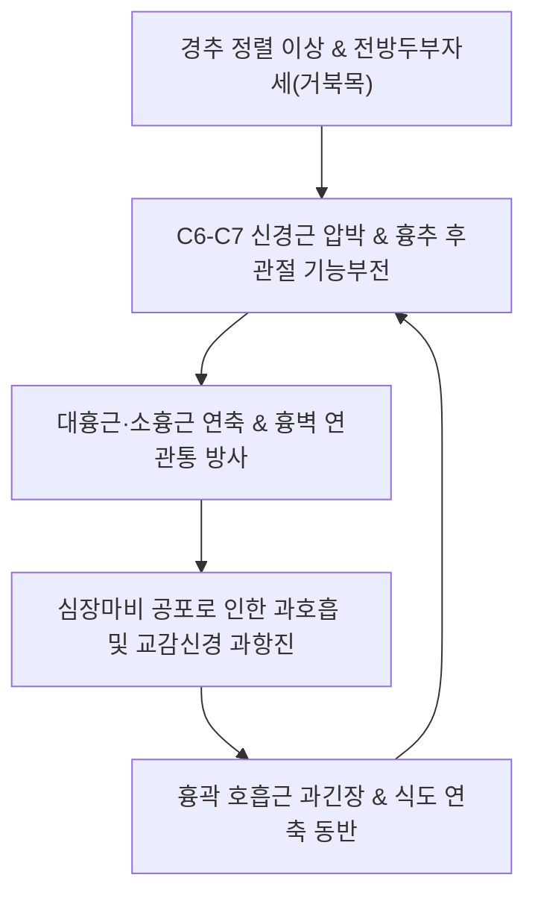

# 🩺 가성 협심증 (Pseudoangina / Cervical Angina & Noncardiac Chest Pain, R07.8)

> **핵심 3줄 요약 (Key Summary)**:
> - 📍 **병소 부위 & 병태생리**: 관상동맥의 기질적 협착이나 심근 허혈 없이, 경추 신경근(C4~C8, 특히 C6·C7)의 압박, 흉추 후관절 장애, 전흉벽 근막통증증후군([[대흉근]], [[소흉근]]), 또는 식도 운동성 장애 및 위식도역류에 의해 협심증과 유사한 전흉부 압박통과 방사통이 유발되는 질환군.
> - 🚩 **전형적 임상 양상**: 좌측 전흉부의 쥐어짜거나 찌르는 듯한 통증, 좌측 어깨·상지 내측으로의 방사통, 경추 회전·신전 또는 특정 흉곽 자세에서 유발되는 통증. 운동 부하와 무관하게 휴식 중 또는 특정 스트레스·자세 유지 시 발생하며 니트로글리세린 설하 투여에 반응하지 않음.
> - 🛠️ **핵심 감별 & 한·양방 치료 전략**: 심근경색·진성 협심증 완전 배제(심전도, Troponin-I, 관상동맥 CT/혈관조영술 정상 확인). 경추 추간판 및 신경공 협착 평가(MRI, Spurling Test). 경추·흉추 분절 [[추나요법]](HVLA 및 관절가동술), 흉벽 근막 이완([[단중]], [[결분]], [[옥당]]), [[신바로약침]] 자입, **단삼음**·**분심기음** 처방.
> - ⚠️ **응급 의뢰 레드플래그**: 신규 발생한 흉골하 쥐어짜는 압박통, 20분 이상 지속되는 통증, 식은땀·호흡곤란·실신 동반, 혈압 저하(급성 관상동맥 증후군 의심 시 119 즉시 의뢰).

---

## 📌 목차
1. [질환 개요 & 병태생리 (Disease Overview)](#1-질환-개요--병태생리-disease-overview)
2. [병태생리 메커니즘 & 대사·신경근 악순환 네트워크](#2-병태생리-메커니즘--대사신경근-악순환-네트워크)
3. [임상 증상 & 환자 소견 (Clinical Presentation)](#3-임상-증상--환자-소견-clinical-presentation)
4. [감별 진단 매트릭스 (Differential Diagnosis)](#4-감별-진단-매트릭스-differential-diagnosis)
5. [한의 통합 치료 프로토콜 (침·약침·추나·한약)](#5-한의-통합-치료-프로토콜-침약침추나한약)
6. [양방 치료 & 병용·의뢰 기준 (Conventional Treatment & Referral)](#6-양방-치료--병용의뢰-기준-conventional-treatment--referral)
7. [식이·생활습관 & 자가관리 티칭 가이드](#7-식이생활습관--자가관리-티칭-가이드)
8. [💡 진료실 핵심 필기 & 임상 노하우](#8--진료실-핵심-필기--임상-노하우)
9. [출처 및 학술 참고 문헌 (References)](#9-출처-및-학술-참고-문헌-references)

---

## 1. 질환 개요 & 병태생리 (Disease Overview)

가성 협심증(Pseudoangina, 주로 경추성 협심증 `Cervical Angina` 또는 비심인성 흉통 `Noncardiac Chest Pain, NCCP`으로 지칭)은 심장의 관상동맥 질환이 전혀 없음에도 불구하고 전형적인 진성 협심증(Angina Pectoris)과 구별하기 어려운 좌측 흉통 및 방사통을 나타내는 증후군이다.

### 1) 해부학적 기원 분류
1. **경추 및 신경근 기원 (Cervical Radicular Origin)**:
   - C6, C7 신경근이 경추 추간판 탈출증이나 추간공 골극에 의해 압박받을 때, 외측 흉신경(lateral pectoral nerve) 및 내측 흉신경(medial pectoral nerve)을 통해 대흉근과 소흉근으로 통증이 투사됨.
   - C4, C5 신경근 자극에 의한 횡격막신경(phrenic nerve)의 연관통.
2. **흉벽 및 근골격 기원 (Chest Wall Musculoskeletal Origin)**:
   - [[늑연골염]](Costochondritis) 및 티체 증후군(Tietze syndrome).
   - 대흉근, 소흉근, 흉골근, 전거근의 근막통증증후군(MPS TrP).
3. **식도 및 위장관 기원 (Esophageal Origin)**:
   - 위식도역류질환(GERD) 및 식도 연축(Esophageal spasm). 심장과 식도는 T1~T4 교감신경 경로를 공유하므로 흉골 후방의 통증 양상이 완벽히 일치할 수 있음.

---

## 2. 병태생리 메커니즘 & 대사·신경근 악순환 네트워크

### 1) 경추 신경-교감신경 연접 기전
- 경추 하부(C5~C8)의 신경근 자극은 교감신경 줄기(Sympathetic trunk, 성상신경절 및 경흉추 교감신경절)와 백색교통지(white rami communicantes)를 통해 반사성 자율신경 흥분을 일으킨다.
- 이로 인해 관상동맥의 실제 허혈이 없음에도 불구하고 전흉벽 혈관 연축, 빈맥, 불안, 흉부 압박감이 유발되어 심장 질환 환자와 동일한 공포감을 조성한다.

### 2) 악순환 네트워크

---

## 3. 임상 증상 & 환자 소견 (Clinical Presentation)

### 1) 주요 임상 증상
- **통증의 성격**: 흉골 좌측 또는 심첨부의 쥐어짜는 듯한 통증, 찌르는 듯한 날카로운 통증, 혹은 묵직한 뻐근함.
- **방사통**: 좌측 쇄골 상와, 목, 턱, 좌측 어깨 및 팔 안쪽(척골측 C8 피부분절)으로 방사되어 진성 협심증과 혼동.
- **유발 및 완화 인자**:
  - 계단 오르기 등 유산소 운동 부하 시에는 통증이 없거나 일정하지 않음.
  - 고개를 뒤로 젖히거나 한쪽으로 돌릴 때, 무거운 물건을 들 때, 특정 자세로 장시간 컴퓨터를 할 때 통증 악화.
  - 가슴벽을 겉에서 손가락으로 세게 누르면 정확한 통증 부위가 재현됨 (압통점 존재).

### 2) 특이적 이학적 검사법
- **Spurling Test (스펄링 검사)**:
  - 경추를 신전하고 환측으로 회전한 후 축성 압박 시 전흉부로 찌릿한 방사통이 재현되면 경추 신경근성 가성 협심증 확진.
- **전흉벽 압통 촉진 (Chest Wall Palpation)**:
  - 대흉근 흉골지, 늑골-늑연골 접합부, 흉골병 부위를 촉진하여 환자가 느끼던 전형적 흉통과 100% 동일한 국소 압통(reproducible tenderness) 확인.
- **니트로글리세린 반응 음성**:
  - 진성 협심증과 달리 NTG 설하정 투여 후 5분 내 극적인 통증 완화가 나타나지 않음.

---

## 4. 감별 진단 매트릭스 (Differential Diagnosis)

| 질환 | 주 통증 양상 | 유발 요인 | 핵심 감별 검사 |
| :--- | :--- | :--- | :--- |
| **[[가성 협심증]] (경추성)** | 흉골 좌측 및 견갑간부 통증, 상지 방사 | 목 움직임, 상지 거상, 자세 유지 | Spurling Test 양성, 심장 효소/ECG 정상, 경추 MRI |
| **진성 [[협심증]] (안정형)** | 흉골하 쥐어짜는 압박통(조임, 짓누름) | 계단 오르기, 달리기 등 운동 부하 | 운동부하 심전도 양성, 관상동맥 조영술(협착 확인) |
| **[[변이형 협심증]]** | 새벽/수면 중 발생하는 극심한 흉통 | 음주, 한랭 노출, 흡연, 휴식 시 | 발작 시 ST절 상승, 에르고노빈 유발검사 양성 |
| **[[늑연골염]]** | 제2~5 늑연골 접합부의 날카로운 통증 | 심호흡, 기침, 흉곽 전면 직접 압박 | 늑연골부 명확한 국소 부종/압통 |
| **위식도역류 (GERD)** | 흉골 뒤 타는 듯한 작열감(Heartburn) | 식후, 야간 앙와위, 신물 역류 | PPI 치료 반응 양성, 24시간 식도 산도 검사 |

---

## 5. 한의 통합 치료 프로토콜 (침·약침·추나·한약)

### 1) 침구 치료 (Acupuncture Protocol)
- **주요 혈위**: [[단중]](CV17), [[옥당]](CV18), [[결분]](ST12), [[중부]](LU1), [[내관]](PC6), [[극문]](PC4), [[후계]](SI3), [[경골]](BL64).
- **흉곽 전면 및 배수혈 자침**:
  - **[[단중]](CV17)·[[옥당]](CV18)**: 심포의 복모혈로 흉중기체(胸中氣滯)를 풀고 신경성 흉민(胸悶)을 신속히 완화.
  - **경추 협척혈(C5-C7) 및 배수혈([[심유]], [[궐음유]], [[독유]])**: 경추 신경근 및 교감신경절 유착 부위를 0.30×40mm 호침으로 사자 심부 자입하여 흉벽으로 향하는 연관통 차단.

### 2) 약침 치료 (Pharmacopuncture Protocol)
- **[[신바로약침]] (GCSB-5)**:
  - 경추 추간공 주위 협척혈 및 대흉근·소흉근 압통점에 1.0~2.0cc를 분할 주입하여 신경근 염증을 해소하고 근막 유착을 분리.
- **황련해독탕 약침**:
  - 심인성 화화(心火)와 불안·공황 증상이 겹친 환자의 단중혈 및 심유혈에 0.5~1.0cc 주입하여 교감신경 항진 안정.

### 3) 추나 의학 (Chuna Manual Therapy)
- **경추 및 상부 흉추 교정 (Cervicothoracic Chuna)**:
  - C5~C7 분절의 회전 변위 및 T1~T4 흉추 후관절 기능부전을 해결하기 위한 앙와위 경추 견인교정기법 및 복와위 흉추 신전-회전 가동술 시행.
- **흉곽 전면 근막이완술 (Pectoral Myofascial Release)**:
  - 단축된 대흉근과 소흉근을 수기 압박 및 능동 신장 기법으로 이완하여 전흉벽 장력 정상화.

### 4) 한약 치료 (Herbal Medicine)
- **기체혈어형 (기혈순환 장애, 스트레스성 흉통)**:
  - **단삼음(丹參飲)**: 단삼, 단향, 사인으로 구성되어 흉비(胸痺) 및 심위제통(心胃諸痛)의 명방.
  - **분심기음(分心氣飲)** 또는 **사칠탕(四七湯)**: 신경성 흉통 및 흉협비만(胸脇痞滿) 해소.
- **담음어조형 (경추성 결림 및 담음 흉통)**:
  - **온담탕(溫膽湯)** 합 **이진탕(二陳湯)**: 심계, 불안, 어지럼증과 동반된 흉통 치료.

---

## 6. 양방 치료 & 병용·의뢰 기준 (Conventional Treatment & Referral)

### 1) 진단적 검사 및 약물 요법
- **심장 정밀 검사 필수**: 12유도 심전도, 심근 효소 검사(Troponin-T/I, CK-MB), 심장 초음파, 관상동맥 CT 조영술로 심장 허혈성 질환을 완전히 배제한 후 진단.
- **약물 치료**:
  - 근골격계 원인: 비스테로이드성 소염진통제(NSAIDs), 근이완제.
  - 식도성 원인: 프로톤 펌프 억제제(PPI) 4~8주 투여.
  - 신경병증성 원인: Pregabalin, Gabapentin.

### 2) 한의 병용 및 티칭 가이드
- 심장 검사상 '이상 없음' 판정을 받았음에도 통증이 지속되어 불안장애나 공황장애로 발전한 환자에게, "심장이 아닌 목 신경과 가슴 근육의 문제"임을 해부학적으로 명확히 안심시키는 것이 치료의 50%를 차지한다.

### 3) 양방·전문과 응급 의뢰 기준 (Referral Criteria)
- **즉시 119/응급실 전원 (Red Flags)**:
  - 흉골 뒤쪽을 쥐어짜거나 짓누르는 통증이 20분 이상 지속되는 경우.
  - 통증과 함께 식은땀(drenching sweat), 호흡곤란, 창백, 실신이 동반되는 경우.
  - 안정 시 혈압이 급격히 떨어지거나 부정맥으로 맥박이 불규칙하게 뛰는 경우.

---

## 7. 식이·생활습관 & 자가관리 티칭 가이드

- **거북목 및 라운드 숄더 자세 교정**:
  - 모니터 높이를 눈높이로 맞추고 턱을 뒤로 당기는 친턱(Chin-tuck) 운동 생활화.
- **흉곽 개방 코너 스트레칭**:
  - 방 모서리에 서서 양팔을 벽에 대고 가슴을 앞으로 밀어 대흉근과 소흉근을 하루 3회 스트레칭.
- **카페인 및 알코올 제한**:
  - 교감신경을 자극하고 식도 하부괄약근을 이완시키는 커피, 탄산, 술 섭취 제한.

---

## 8. 💡 진료실 핵심 필기 & 임상 노하우

### 1) 진료실 1초 진단 노하우: 손가락으로 가리키는 흉통은 심장병이 아니다
- 환자가 진료실에 들어와 "가슴이 아파서 죽을 것 같다"고 할 때, "어디가 아픈지 손가락 하나로 가리켜 보세요"라고 요청한다.
- 환자가 **손가락 끝으로 특정 갈비뼈나 가슴 한 점을 콕 짚으면 99% 근골격계 또는 신경성 가성 협심증**이다.
- 반대로, 환자가 **손바닥 전체로 가슴 중앙을 쥐어뜯거나 주먹으로 가슴을 치면서 "어디라고 짚을 수 없이 가슴 전체가 조인다"**고 하면 지체 없이 심전도를 찍거나 응급실로 보내야 한다.

### 2) 흉골 좌연 압통점 박리 팁
- 가성 협심증 환자의 좌측 흉골 연([[단중]], [[신봉]], [[영허]])을 엄지로 비벼 촉진하면 쌀알 같은 단단한 압통성 결절(TrP)이 만져진다.
- 여기에 호침으로 골막을 향해 횡자 자입한 뒤 가볍게 제삽을 가하고 사혈부항을 병행하면, 환자가 수개월간 앓던 "가슴을 쥐어짜는 듯한 통증"이 그 자리에서 80% 이상 소실된다.

---

## 9. 출처 및 학술 참고 문헌 (References)

- Brown NJ, Shahrestani S, Lien BV et al. (2021). Spinal pathologies and management strategies associated with cervical angina (pseudoangina): a systematic review. *J Neurosurg Spine*. 34(3):506-513. PMID: 33276331

- Jammal OMA, Diaz-Aguilar LD, Srinivas S et al. (2020). Cervical Arthroplasty in the Treatment of Cervical Angina: Case Report and Review of the Literature. *Neurospine*. 17(4):929-938. PMID: 33401872

- Fass R, Shibli F, Tawil J et al. (2019). Diagnosis and Management of Functional Chest Pain in the Rome IV Era. *J Neurogastroenterol Motil*. 25(4):487-498. PMID: 31587539

---

## 관련 노트

- [[협심증]]
- [[변이형 협심증]]
- [[늑연골염]]
- [[단중]]
- [[내관]]
- [[신바로약침]]
- [[추나요법]]
- [[경추 추간판 탈출증]]
