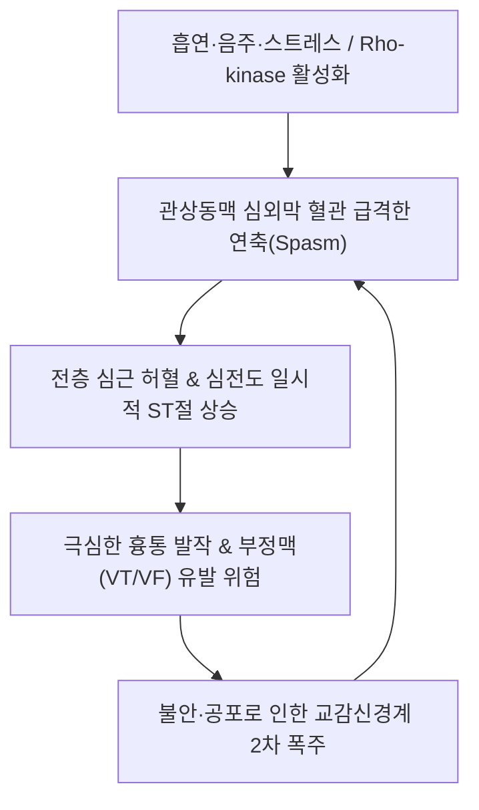

# 🩺 변이형 협심증 (Vasospastic Angina / Prinzmetal Angina, I20.1)

> **핵심 3줄 요약 (Key Summary)**:
> - 📍 **병소 부위 & 병태생리**: 관상동맥 심외막 주간지(epicardial coronary arteries)의 일시적이고 급격한 혈관 연축(coronary vasospasm)으로 인해 심근으로의 혈류가 급격히 차단되며 발생하는 전층 심근 허혈(transmural ischemia). 기질적 죽상경화반의 유무와 상관없이 혈관 평활근의 과민반응 및 내피세포 기능부전에 의해 발생.
> - 🚩 **전형적 임상 양상**: 주로 **자정에서 이른 아침, 또는 휴식 시** 발생하는 극심한 흉골하 압박통 및 쥐어짜는 흉통(새벽통증). 운동 부하와 무관하며, 흡연·음주(과음 다음 날 새벽)·한랭 노출·정신적 스트레스에 의해 격발. 발작 시 심전도상 **일시적인 ST절 상승(ST elevation)**이 나타났다가 통증 소실 시 정상화됨. 니트로글리세린 설하 투여 시 2~5분 내 극적 완화.
> - 🛠️ **핵심 감별 & 한·양방 치료 전략**: 죽상경화성 안정형 협심증 및 비심인성 흉통 감별. 관상동맥 조영술 중 에르고노빈(Ergonovine) 또는 아세틸콜린(Acetylcholine) 유발검사. 1차 치료제인 칼슘통로차단제(CCB: Diltiazem, Amlodipine) 및 질산염 제제 투여(베타차단제는 연축 악화로 금기). 한의 활혈화어(活血化瘀)·이기온통(理氣溫通) 침구([[심유]], [[내관]], [[단중]]), [[신바로약침]], **단삼음**·**관심이호방**·**과루해백백주탕** 병용.
> - ⚠️ **응급 의뢰 레드플래그**: 연축 발작 중 치명적 심실 부정맥(심실빈맥, 심실세동), 심정지(급사), 3도 방실차단, 30분 이상 지속되는 흉통과 심근경색으로의 이행(즉시 119 응급실 이송).

---

## 📌 목차
1. [질환 개요 & 병태생리 (Disease Overview)](#1-질환-개요--병태생리-disease-overview)
2. [병태생리 메커니즘 & 대사·혈관연축 악순환 네트워크](#2-병태생리-메커니즘--대사혈관연축-악순환-네트워크)
3. [임상 증상 & 환자 소견 (Clinical Presentation)](#3-임상-증상--환자-소견-clinical-presentation)
4. [감별 진단 매트릭스 (Differential Diagnosis)](#4-감별-진단-매트릭스-differential-diagnosis)
5. [한의 통합 치료 프로토콜 (침·약침·한약)](#5-한의-통합-치료-프로토콜-침약침한약)
6. [양방 치료 & 병용·의뢰 기준 (Conventional Treatment & Referral)](#6-양방-치료--병용의뢰-기준-conventional-treatment--referral)
7. [식이·생활습관 & 자가관리 티칭 가이드](#7-식이생활습관--자가관리-티칭-가이드)
8. [💡 진료실 핵심 필기 & 임상 노하우](#8--진료실-핵심-필기--임상-노하우)
9. [출처 및 학술 참고 문헌 (References)](#9-출처-및-학술-참고-문헌-references)

---

## 1. 질환 개요 & 병태생리 (Disease Overview)

변이형 협심증(Vasospastic Angina, VSA, 일명 `Prinzmetal's Angina`)은 1959년 Myron Prinzmetal에 의해 최초로 기술된 독특한 형태의 협심증으로, 운동 시 심근 산소 요구량 증가로 발생하는 고전적 협심증과 달리 관상동맥의 가역적 연축에 의한 급성 혈류 공급 감소로 발병한다.

### 1) 역학적 특성 및 호발 인자
- **인종적 특이성**: 서양인에 비해 한국인, 일본인 등 동아시아인에서 발병 빈도가 2~3배 현저히 높음.
- **호발 연령 및 성별**: 40~60대 중년 남성에서 호발하며, 고전적 심근경색 환자에 비해 기질적 관상동맥 협착이 없거나 경미한 경우가 많음.
- **주요 위험 인자**: **흡연(가장 강력한 단독 인자)**, 과음(특히 음주 당일 밤~다음 날 아침의 알코올 대사 숙취기), 한랭 노출, 정신적 스트레스.

---

## 2. 병태생리 메커니즘 & 대사·혈관연축 악순환 네트워크

### 1) 혈관 평활근 과민반응 및 내피세포 기능장애
- **Rho-kinase 경로 활성화**:
  - 관상동맥 평활근 내 Rho-kinase 활성도가 비정상적으로 증가하여 미오신 경쇄 인산화효소(MLC phosphatase)를 억제, 칼슘 감작(calcium sensitization)을 유발함으로써 정상적인 자극에도 과도한 혈관 수축 초래.
- **내피세포 유래 산화질소(NO) 결핍**:
  - 만성 흡연과 산화 스트레스로 인해 혈관 확장 물질인 NO 생성이 억제되고, 엔도텔린-1(Endothelin-1) 등 수축 물질이 우세해짐.
- **자율신경계 불균형**:
  - 야간 부교감신경 항진 상태에서 아침 기상 시 급격한 교감신경(α1-아드레날린 수용체) 활성화로 전환되는 새벽 시간대에 관상동맥 수축이 극대화됨.

### 2) 악순환 네트워크

---

## 3. 임상 증상 & 환자 소견 (Clinical Presentation)

### 1) 주요 임상 증상
- **새벽 흉통 (Early Morning Angina)**: 자정부터 아침 8시 사이, 특히 깊은 수면 중 가슴을 짓누르고 타는 듯한 극심한 통증으로 잠에서 깸.
- **운동 부하와의 무관성**: 낮 시간 동안 등산이나 격렬한 운동을 할 때는 전혀 통증이 없는데, 새벽에 쉴 때 통증이 엄습함.
- **알코올 유발 (Hangover Angina)**: 술을 마실 때는 혈관 확장으로 괜찮다가, 술이 깨는 다음 날 새벽에 연축 발작 호발.
- **방사통**: 좌측 어깨, 목, 하악골(턱), 좌측 팔 안쪽으로 방사되며 식은땀과 메스꺼움 동반.

### 2) 핵심 진단 검사 소견
- **발작 시 12유도 심전도 (Ictal ECG)**:
  - 통증 발작 순간 기록 시 **ST절의 현저한 상승(ST elevation)** 또는 ST 하강/T파 역전. 통증이 가라앉으면 수분 내 완벽하게 정상 기저 심전도로 복귀.
- **24시간 홀터 심전도 (24-hour Holter Monitoring)**:
  - 야간 무증상성 또는 유증상성 일시적 ST절 변화 및 심실조기수축(PVC), 심실빈맥(VT) 포착.
- **관상동맥 조영술 및 경련 유발검사 (Spasm Provocation Test)**:
  - 아세틸콜린(Acetylcholine) 또는 에르고노빈(Ergonovine)을 관상동맥 내로 주입하여 90% 이상의 심한 혈관 수축과 흉통, ST 변화 재현 확인.

---

## 4. 감별 진단 매트릭스 (Differential Diagnosis)

| 질환 | 통증 발생 시점 및 양상 | 심전도 소견 | 핵심 감별 포인트 |
| :--- | :--- | :--- | :--- |
| **[[변이형 협심증]] (VSA)** | **새벽/휴식 시**, 흡연·음주 후 극심통 | **발작 시 가역적 ST 상승** | 낮 운동 시 정상, CCB/NTG 극적 반응 |
| **안정형 [[협심증]] (Effort)** | **낮 시간 운동/계단 오를 때** 조임 | 운동 시 ST 하강, 휴식 시 안정 | 운동 부하 검사 양성, 관상동맥 기질적 협착 |
| **불안정형 협심증 / NSTEMI** | 점진적 빈도 증가, 휴식 시에도 발생 | ST 하강, T파 역전, Troponin 상승 | 죽상경화반 파열, 응급 관상동맥 중재술(PCI) |
| **급성 심근경색 (STEMI)** | 30분 이상 지속되는 비가역적 흉통 | **지속적인 ST절 상승**, Q파 형성 | NTG 무반응, 심근효소 대량 유출 |
| **[[가성 협심증]] (경추성)** | 목 자세 변화, 가슴벽 촉진 시 압통 | 심전도 완전 정상 | 흉벽 압통점 재현, NTG 반응 없음 |

---

## 5. 한의 통합 치료 프로토콜 (침·약침·한약)

### 1) 침구 치료 (Acupuncture Protocol)
- **주요 혈위**: [[단중]](CV17), [[내관]](PC6), [[심유]](BL15), [[궐음유]](BL14), [[극문]](PC4), [[공손]](SP4), [[태충]](LR3).
- **자침 기법**:
  - **[[내관]](PC6)·[[극문]](PC4)**: 수궐음심포경의 락혈과 극혈로 심근 혈류 순환 개선 및 혈관 경련 완화에 특효.
  - **[[단중]](CV17)**: 흉중기체(胸中氣滯)를 이완하고 관상동맥 평활근 긴장 완화.
  - **[[태충]](LR3)**: 간기울결(肝氣鬱結)을 평간식풍(平肝熄風)하여 스트레스성 혈관 수축 제어.
- **전침 치료**: 내관-극문 간 2Hz 저주파를 20분간 적용하여 혈관 확장 물질 분비 촉진.

### 2) 약침 치료 (Pharmacopuncture Protocol)
- **[[신바로약침]] 또는 자하거약침**:
  - [[심유]](BL15) 및 [[궐음유]](BL14)에 0.5~1.0cc 분할 주입하여 흉추 교감신경절 안정화 및 심근 혈류 개선.
- **황련해독탕 약침**:
  - 심화항성(心火亢盛)형 불면, 심계, 새벽 불안 환자의 전중 및 내관에 0.5cc 주입.

### 3) 한약 치료 (Herbal Medicine)
- **흉비심통(胸痺心痛), 활혈거어(活血化瘀)**:
  - [[단삼음]](丹參飲) 합 관심이호방(冠心二號方): [[단삼]], [[천궁]], [[적작약]], [[홍화]], [[강황]] 등으로 구성되어 혈관 내피세포 기능을 개선하고 미세순환 촉진.
- **한응심락(寒凝心絡, 한랭 노출 시 새벽통증 악화)**:
  - [[과루해백백주탕]](栝蔞薤白白酒湯) 합 [[당귀사역탕]](當歸四逆湯): 온양통맥(溫陽通脈), 통양산결(通陽散結)하여 새벽 한기(寒氣)에 의한 혈관 연축 방지.
- **기체혈어(氣滯血瘀, 스트레스성 경련)**:
  - [[혈부축어탕]](血府逐瘀湯): 만성 흉통 및 야간 불면, 혈액 점도 상승 개선.

---

## 6. 양방 치료 & 병용·의뢰 기준 (Conventional Treatment & Referral)

### 1) 양방 표준 약물 치료
- **칼슘통로차단제 (CCB, 1차 필수 치료제)**:
  - Diltiazem 90~180mg/day, Amlodipine 5~10mg/day, 또는 Benidipine. 관상동맥 평활근 칼슘 유입을 차단하여 연축을 강력히 억제.
  - 취침 전 복용하여 혈중 농도가 새벽에 최고조에 도달하도록 투약.
- **질산염 제제 (Nitrates)**:
  - 급성 발작 시 니트로글리세린(NTG 0.6mg) 설하정 또는 스프레이 즉시 사용.
  - 지속형 질산염(Isosorbide mononitrate) 병용.
- ⛔ **베타차단제(Beta-blocker) 투여 금기**:
  - 비선택적 β-차단제(Propranolol 등)는 혈관의 β2-이완 수용체를 차단하여 α1-수축 수용체를 무반대(unopposed) 자극함으로써 **오히려 치명적인 관상동맥 연축을 악화**시키므로 절대 금기.

### 2) 한의 병용 가이드라인
- 양방 CCB를 복용 중인 환자에게 한약(단삼음, 혈부축어탕) 병용 시 과도한 혈압 강하가 발생하지 않는지 혈압을 정기 모니터링하며, CCB를 임의로 중단하면 반동성 연축(Rebound spasm)으로 심근경색이 발생할 수 있으므로 절대 임의 단약을 금지함.

### 3) 양방·전문과 응급 의뢰 기준 (Referral Criteria)
- **즉시 119 응급실 이송 (Emergency Red Flags)**:
  - NTG 설하정을 5분 간격으로 2~3회 연속 투여했음에도 15~20분 이상 흉통이 지속되는 경우.
  - 발작 중 실신(Syncope), 식은땀, 호흡곤란, 또는 심실세동/심실빈맥이 의심되는 경우.

---

## 7. 식이·생활습관 & 자가관리 티칭 가이드

- **절대적 금연 (Absolute Smoking Cessation)**:
  - 단 한 개비의 담배도 즉각적인 혈관 수축을 유발하므로 흡연은 완치를 가로막는 절대적 악화 요인.
- **음주 제한 및 숙취 예방**:
  - 과음한 다음 날 새벽은 체내 수분 탈수와 교감신경 반동 항진으로 심정지 위험이 가장 높은 시간이므로 폭음 엄격 금지.
- **새벽 보온 유지**:
  - 기상 시 찬 공기에 갑자기 노출되지 않도록 실내 온도를 따뜻하게 유지하고, 외출 시 목도리와 마스크 착용.

---

## 8. 💡 진료실 핵심 필기 & 임상 노하우

### 1) 진료실 질문 공식: "언제 아프십니까?"
- 환자가 가슴 통증을 호소할 때 가장 먼저 던져야 할 질문은 "빨리 걷거나 계단 오를 때 아픕니까, 아니면 가만히 쉴 때나 새벽에 잘 때 아픕니까?"이다.
- **"낮에 일할 때는 멀쩡한데, 새벽 4~5시쯤 자다가 가슴이 꽉 죄어서 깬다"**고 답변하면 90% 이상 변이형 협심증(Prinzmetal)이다.

### 2) 응급약 NTG 소지 티칭
- 변이형 협심증 진단을 받은 환자는 반드시 니트로글리세린(NTG) 설하정을 머리맡과 주머니에 24시간 휴대하도록 철저히 교육해야 한다.
- 가슴 통증이 시작되는 즉시 침대에 걸터앉아 NTG를 혀 밑에 넣고 녹여야 하며, 서 있는 상태에서 복용하면 기립성 저혈압으로 쓰러질 수 있음을 주의시킨다.

---

## 9. 출처 및 학술 참고 문헌 (References)

- Aswathappa S, Watson AJ, Nawaz B et al. (2025). A Comprehensive Literature Review Discussing Diagnostic Challenges of Prinzmetal or Vasospastic Angina. *Cureus*. 17(5):e83745. PMID: 40486459

- Boivin-Proulx LA, Marquis-Gravel G, Rousseau-Saine N et al. (2024). Hyperventilation testing in the diagnosis of vasospastic angina: A clinical review and meta-analysis. *Eur J Clin Invest*. 54(6):e14178. PMID: 38348627

- Sueda S, Hayashi Y et al. (2025). Clinical Limitations of Vasoreactivity Testing as a Diagnostic Tool in Patients with Vasospastic Angina. *Intern Med*. 64(2):171-175. PMID: 38811228

---

## 관련 노트

- [[협심증]]
- [[가성 협심증]]
- [[내관]]
- [[단중]]
- [[신바로약침]]
- [[급성 심근경색]]
