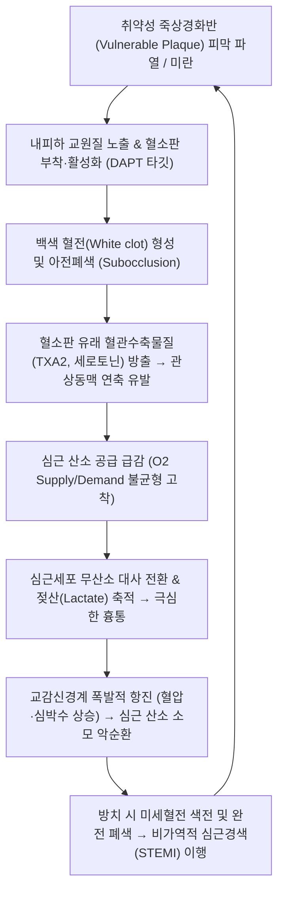

# 🩺 [[불안정 협심증]] (Unstable Angina, UA / 흉비·진심통, KCD I20.0)

> **핵심 3줄 요약 (Key Summary)**:
> - 📍 **병소 부위 & 병태생리**: 관상동맥([[좌전하행지 LAD]], [[좌회선지 LCx]], [[우관상동맥 RCA]]) 내 죽상경화반의 파열·균열 및 비폐색성 혈소판 혈전 형성에 의해 심근으로의 혈류가 급격히 차단되는 급성 관상동맥 증후군(ACS).
> - 🚩 **전형적 임상 양상 & 3대 발현 패턴**: ① 휴식 시 또는 최소 운동 시 20분 이상 지속되는 흉통, ② 최근 2개월 이내 새로 발생한 캐나다심혈관학회(CCS) Class III 이상의 중증 흉통, ③ 기존 협심증의 빈도·강도·지속시간이 급격히 악화되는 가속성(Crescendo) 흉통.
> - 🛠️ **핵심 감별 & 한·양방 치료 전략**: 12유도 심전도(ST 분절 하강, T파 역전) 및 고감도 심근 트로포닌(hs-cTn 정상 = NSTEMI와의 핵심 감별점); 양방 아스피린+P2Y12 억제제(DAPT), 항응고제, 스타틴, 조기 침습적 관상동맥 중재술(PCI); 한의학 흉비심통(胸痺心痛), 활혈거어(血府逐瘀湯, 冠心二號方), 급성기 완화 후 이차예방 통합 치료.
> - ⚠️ **응급 의뢰 레드플래그**: 지속되는 흉통, 식은땀, 호흡곤란, 저혈압 또는 혈역학적 불안정성, ST 분절 지속 상승(STEMI 의심) 시 한의원 내 처치를 즉시 중단하고 119 응급 구급차를 호출하여 심혈관센터 응급실로 긴급 이송.

---

## 📌 목차
1. [질환 개요 & 병태생리 (Disease Overview)](#1-질환-개요--병태생리-disease-overview)
2. [병태생리 메커니즘 & 대사·장기부전 악순환 네트워크](#2-병태생리-메커니즘--대사장기부전-악순환-네트워크)
3. [임상 증상 & 환자 소견 (Clinical Presentation)](#3-임상-증상--환자-소견-clinical-presentation)
4. [감별 진단 매트릭스 (Differential Diagnosis)](#4-감별-진단-매트릭스-differential-diagnosis)
5. [한의 통합 치료 프로토콜 (침·약침·한약)](#5-한의-통합-치료-프로토콜-침약침한약)
6. [양방 치료 & 병용·의뢰 기준 (Conventional Treatment & Referral)](#6-양방-치료--병용의뢰-기준-conventional-treatment--referral)
7. [식이·생활습관 & 자가관리 티칭 가이드](#7-식이생활습관--자가관리-티칭-가이드)
8. [💡 진료실 핵심 필기 & 임상 노하우](#8--진료실-핵심-필기--임상-노하우)
9. [출처 및 학술 참고 문헌 (References)](#9-출처-및-학술-참고-문헌-references)

---

## 1. 질환 개요 & 병태생리 (Disease Overview)

![[협심증_관상동맥경화반_병태생리.png|450]]
> [그림 1: ① 질병 개요 도해 — 관상동맥 내 죽상경화반의 균열·침식 및 혈소판 혈전 형성에 의한 아전폐색 병태생리 — Wikipedia(PD)]

* **질환 정의 및 분류**:
  * [[불안정 협심증]](Unstable Angina, UA)은 안정형 [[협심증]]과 급성 [[심근경색증]](NSTEMI, STEMI) 사이에 위치하는 초응급 심혈관 질환으로, **급성 관상동맥 증후군(Acute Coronary Syndrome, ACS)**의 핵심 구성 요소입니다.
  * 심근의 비가역적 괴사([[심근경색증]])에 이르기 직전 단계로, 휴식 시에도 관상동맥 혈류가 급감하여 심근 허혈 증상이 발생하지만, 혈청 심근 손상 표지자(Cardiac Troponin I/T)는 기준치 상한선(99th percentile URL) 이하로 유지되는 상태로 정의됩니다(Goyal et al., 2025).
* **브라운발트(Braunwald) 임상 분류**:
  * **Class I (신규 발현 중증/가속형)**: 최근 2개월 이내 시작된 심한 협심증 또는 기존 통증이 현저히 악화된 상태(안정 시 흉통 없음).
  * **Class II (아급성 안정 시 협심증)**: 최근 1개월 이내에 안정 시 흉통이 발생했으나 최근 48시간 이내에는 없었던 상태.
  * **Class III (급성 안정 시 협심증)**: 최근 48시간 이내에 1회 이상 안정 시 흉통이 발생한 최고 위험군.
* **관련 해부학적 구조물**:
  * **관상동맥 3대 주간지**: [[좌전하행지 LAD]](좌심실 전벽 및 심실중격 영양), [[좌회선지 LCx]](좌심실 측벽·후벽), [[우관상동맥 RCA]](우심실 및 하벽, 동방결절/방실결절 전도로).
  * **심내막하 심근층(Subendocardium)**: 수축기 심근 내압이 가장 높아 허혈에 가장 취약한 부위로, 불안정 협심증 시 일차적으로 전기생리학적 이상과 허혈 손상이 집중됩니다.

---

## 2. 병태생리 메커니즘 & 대사·장기부전 악순환 네트워크

![[심근경색증_관상동맥_Gray497.jpg|450]]
> [그림 2: ② 심장 관상동맥 해부도 — 좌주간지, 좌전하행지(LAD), 좌회선지(LCx), 우관상동맥(RCA)의 해부학적 분포 — Gray's Anatomy(Plate 497, PD)]

![[청강의감20_24_관상동맥_알파1_베타2_수용체.jpg|450]]
> [그림 3: ③ 관상동맥 혈관 평활근 자율신경 수용체 도해 — 알파1 및 베타2 수용체 매개 관상동맥 연축과 혈류역학 조절 기전 — 청강의감 임상자료]

### 1) 취약 플라크의 파열과 동적 혈전 형성
* 안정형 협심증이 섬유성 피막이 두꺼운 고정 협착인 반면, 불안정 협심증은 다량의 지질 코어와 얇은 섬유성 피막(Thin-cap fibroatheroma)을 가진 취약 플라크가 혈류 전단응력이나 염증 반응에 의해 파열되면서 시작됩니다(Serikawa et al., 2026).
* 노출된 조직인자(Tissue factor)와 콜라겐에 혈소판이 급격히 엉겨 붙어 미세 혈전을 형성하고, 관상동맥의 내경이 급격히 불완전 폐색(Subtotal occlusion)을 일으킵니다.

### 2) 심근 대사 파탄과 심인성 부정맥 위험
* 혈류 공급 차단으로 심근세포 미토콘드리아의 산화적 인산화가 중단되고 ATP가 고갈되면 무산소 해당과정이 진행되어 젖산과 수소이온이 축적됩니다.
* 세포막 나트륨-칼륨 펌프(Na+/K+ ATPase) 장애로 세포 내 칼슘 과부하와 칼륨 유출이 발생하며, 이는 심실조기수축(PVC), 심실빈맥(VT), 심실세동(VF) 같은 치명적인 돌연사 부정맥을 촉발하는 악순환을 유발합니다(Mills et al., 2026).

---

## 3. 임상 증상 & 환자 소견 (Clinical Presentation)

![[심근경색증_심전도_ECG.jpg|420]]
> [그림 4: ④ 환자 임상 검사 소견 — 불안정 협심증 발작 시 나타나는 전흉부 유도 ST 분절 하강 및 T파 역전 심전도(ECG) — Wellcome Collection(CC BY)]

![[심근경색증_도해.jpg|420]]
> [그림 5: ⑤ 허혈성 병태 진행 도해 — 심내막하 심근 허혈에서 전층 경색으로의 진행 단계와 심근 효소(Troponin) 변화 — 자가보관도해]

### 1) 주요 임상 증상
* **흉통의 특성**: 흉골 하부의 쥐어짜는 듯한(Crushing), 무거운 돌로 짓누르는 듯한(Pressure), 또는 타는 듯한 압박감. 환자가 주먹을 가슴에 대고 호소하는 **레빈 징후(Levine's sign)**가 흔히 관찰됨.
* **방사통**: 좌측 어깨, 좌측 상지 내측(척골신경 주행로), 턱, 목, 견갑골 사이 또는 심와부(상복부)로 방사.
* **자율신경 증상**: 식은땀(Cold sweating), 창백, 오심, 구토, 극도의 불안감("죽을 것 같은 공포"), 호흡곤란.
* **니트로글리세린(NTG) 반응성 저하**: 안정형 협심증과 달리 NTG 설하정을 1정 복용해도 통증이 완전히 소실되지 않거나 일시적 완화 후 곧 재발함.

### 2) 객관적 검사 소견
* **심전도(12-lead ECG)**:
  * 흉통 지속 시 환자의 약 30~50%에서 일시적인 **ST 분절 하강(ST depression ≥ 0.5mm)** 또는 **T파 역전(T wave inversion ≥ 1mm)**이 관찰됨.
  * 통증이 가라앉으면 심전도가 정상으로 복귀하는 동적 변화(Dynamic ECG changes)가 진단적 가치가 높음.
* **심근 바이오마커 (Cardiac Biomarkers)**:
  * **High-sensitivity Cardiac Troponin (hs-cTnI / hs-cTnT)**: 기준치 상한치 미만(정상 범위). 트로포닌 상승이 확인되면 불안정 협심증이 아니라 NSTEMI로 재분류됨.
  * CK-MB, 마이오글로빈 역시 정상 수치 유지.

---

## 4. 감별 진단 매트릭스 (Differential Diagnosis)

| 감별 질환 | 흉통 발현 양상 및 지속시간 | 심전도(ECG) 소견 | 심근 트로포닌 (cTn) | 응급 처치 및 치료 |
| :--- | :--- | :--- | :--- | :--- |
| **[[불안정 협심증]]** | **안정 시 또는 가속형, 20분 미만/지속**, NTG 불완전 반응 | ST 분절 하강, T파 역전 또는 정상 | **음성 (정상치 유지)** | **응급 입원, DAPT, 조기 PCI** |
| **비-ST분절상승 심근경색 ([[NSTEMI]])** | 안정 시 20분 이상 극심한 지속 흉통, 식은땀 | ST 분절 하강, T파 역전 | **양성 (유의한 상승/하강)** | **응급 심혈관 중재술 (PCI)** |
| **ST분절상승 심근경색 ([[STEMI]])** | 전층 심근 괴사, 참을 수 없는 극통 | **ST 분절 상승 (J-point elevation)** | **양성 (급격한 상승)** | **90분 이내 일차적 PCI (Door-to-Balloon)** |
| **안정형 [[협심증]]** | **운동 시 발생, 휴식/NTG 3~5분 내 소실** | 평상시 정상, 운동부하 시 ST 하강 | 음성 (정상) | 외래 약물치료 및 위험인자 조절 |
| **[[대동맥 박리]]** | 흉부 전면에서 등/견갑골 사이로 찢어지는 듯한 극통 | 대개 정상 (관상동맥 침범 시 제외) | 음성 또는 미세 상승 | **응급 조영 CT, 혈압 강하, 응급 수술** |
| **[[역류성 식도염]] / 식도경련** | 식후/와위 시 악화, 제산제 완화, 흉골하 작열감 | 정상 | 음성 (정상) | PPI 투여, 내시경 평가 |

---

## 5. 한의 통합 치료 프로토콜 (침·약침·한약)

![[청강의감20_11_협심증_심근경색_1.png|420]]
> [그림 6: ⑦ 한의 치료 및 흉비 병태도 — 심흉부 기체혈어 및 담탁조폐 병태와 내관·단중·심수 치료점 — 청강의감 임상자료]

* **⚠️ 급성기 원칙: 응급 전원 최우선**:
  * 불안정 협심증은 수시간~수일 내에 급성 심근경색증으로 이행될 위험이 극도로 높은 질환입니다. 내원 시 활력징후를 즉시 측정하고 산소 공급 및 119를 호출해야 하며, 한의 치료는 **이송 대기 중 응급 보조処置** 또는 **PCI 및 양약 안정화 이후의 회복기/이차예방 단계**에 적용합니다.
* **이송 대기 중 응급 침구 혈자리**:
  * **[[내관]](PC6)**: 심포경의 락혈이자 팔맥교회혈로 심근 미세순환을 개선하고 심박수를 안정시킴.
  * **[[단중]](CV17)**: 기회혈(氣會穴)로 흉통 및 흉부 압박감 완화.
  * **[[극문]](PC4)**: 심포경의 극혈(郄穴)로 급성 혈액순환 장애 및 심장 발작의 통증 완화 요혈.
* **회복기 및 재발 방지 한약 치료 (Herbal Medicine)**:
  * **기체혈어(氣滯血瘀)형**: [[혈부축어탕]](血府逐瘀湯), [[관심이호방]](冠心二號方 — 단삼, 홍화, 작약, 천궁, 강향). 관상동맥 확장 및 혈소판 응집 억제, 혈관 내피 보호.
  * **담탁조폐(痰濁阻肺)형**: [[과루해백반하탕]](栝蔞薤白半夏湯), [[이진탕]] 가미. 흉부 비만, 비만, 고지혈증 환자.
  * **기음양허(氣陰兩虛)형**: [[생맥산]](生脈散) 합 [[보심건비탕]](補心健脾湯). 심근 기능 회복 및 항피로 작용.

---

## 6. 양방 치료 & 병용·의뢰 기준 (Conventional Treatment & Referral)

* **초기 응급 처치 (MONA-B)**:
  * **Morphine**: 극심한 통증 및 교감신경 흥분 가라앉힘.
  * **Oxygen**: 산소포화도 < 90% 시 비강 캐뉼라 투여.
  * **Nitroglycerin**: 설하정(0.3~0.6mg) 5분 간격 최대 3회 투여, 필요 시 정맥 지속 주입.
  * **Aspirin**: 부하 용량(160~300mg) 즉시 저작 복용.
  * **Beta-blocker**: 심박수 50~60회/분 목표로 심근 산소 소모 억제.
* **이중 항혈소판 요법 (DAPT) 및 항응고 요법**:
  * 아스피린 + P2Y12 억제제(Ticagrelor 90mg bid 또는 Clopidogrel 75mg qd) 최소 12개월 유지.
  * 저분자량 헤파린(LMWH, Enoxaparin) 피하 주사.
* **조기 침습적 관상동맥 조영술 (Early Invasive PCI)**:
  * 고위험군(GRACE score > 140, 동적 ST 변화, 반복되는 흉통)은 24시간 이내 관상동맥 조영술 및 스텐트 삽입술(PCI) 시행.
* **한의 병용 주의사항**:
  * DAPT(아스피린+티카그렐러/클로피도그렐)를 복용 중인 환자에게 항응고 작용이 강한 한약재([[수질]], [[맹충]], 고용량 [[홍화]])를 병용할 경우 위장관 출혈 위험이 있으므로 주의 모니터링이 필요합니다.

---

## 7. 식이·생활습관 & 자가관리 티칭 가이드

* **지중해식 식단 및 염분·지질 제한**:
  * 포화지방산과 트랜스지방을 엄격히 배제하고, 오메가-3 불포화지방산(등푸른 생선, 들기름, 견과류)과 신선한 채소 위주의 식단 권장.
* **금연 및 체온 유지**:
  * 흡연은 혈관내피 손상과 혈전 형성의 주범이므로 절대 금연.
  * 추운 겨울철 이른 아침 외출 시 급격한 온도 변화로 관상동맥 연축이 유발되므로 보온 철저.
* **응급 대처 교육**:
  * 평소 협심증 환자에게 니트로글리세린(NTG) 설하정을 항상 휴대하게 하고, 차광 갈색병 보관 교육.
  * 1정 복용 후 5분이 지나도 흉통이 지속되면 2회째 복용과 동시에 지체 없이 119를 부르도록 환자 및 보호자 교육.

---

## 8. 💡 진료실 핵심 필기 & 임상 노하우

* **'협심증 환자의 패턴 변화'는 1초도 지체하지 마라**:
  * 평소 계단을 오를 때만 가슴이 뻐근하던 환자가 "원장님, 요 며칠은 가만히 밥 먹거나 누워 있어도 가슴이 조여와요" 또는 "원래 3분이면 풀리던 게 15분 이상 가요"라고 말한다면, 그것은 이미 안정형 협심증이 아니라 **불안정 협심증(ACS)**입니다. 침 치료나 뜸 치료를 할 시간이 없으며, 즉시 진료를 중단하고 119를 불러 상급병원 심혈관센터로 이송해야 의료사고를 막을 수 있습니다.
* **여성과 당뇨 환자의 '조용한 허혈' 주의**:
  * 당뇨병성 신경병증 환자나 고령 여성은 전형적인 흉통 없이 "체한 것 같다", "명치가 갑갑하다", "식은땀이 나며 어지럽다"는 소화기 증상으로 내원하는 경우가 많습니다. 심와부 통증 환자에서 식은땀과 혈압 저하가 관찰되면 소화제 처방 전에 반드시 심장 질환을 의심하십시오.

---

## 9. 출처 및 학술 참고 문헌 (References)

1. **Goyal A, et al. (2025)**. Unstable Angina. *StatPearls*. [PMID 28723029](https://pubmed.ncbi.nlm.nih.gov/28723029/)

   - [연구 요약]: 급성 관상동맥 증후군의 범주에서 불안정 협심증의 최신 병태생리, 진단적 위험도 평가 지표(TIMI/GRACE score) 및 치료 알고리즘 가이드라인 제시.
2. **Mills NL, et al. (2026)**. Fifth Universal Definition of Myocardial Infarction (2026). *J Am Coll Cardiol*, 88(11), 1234-1250. [PMID 42663357](https://pubmed.ncbi.nlm.nih.gov/42663357/)

   - [연구 요약]: 제5차 심근경색증 범용정의를 통해 심근 손상(Troponin 상승)이 없는 불안정 협심증과 심근경색증 간의 정밀 감별 기준 및 임상적 예후 분석.
3. **Serikawa N, et al. (2026)**. Estimated cumulative LDL-C exposure and risk of recurrent cardiovascular events after acute coronary syndrome. *Int J Cardiol*, 415, 132480. [PMID 42744018](https://pubmed.ncbi.nlm.nih.gov/42744018/)

   - [연구 요약]: 급성 관상동맥 증후군 환자에서 누적 LDL 콜레스테롤 노출량과 죽상경화반 취약성 및 재발성 심혈관 사건 간의 상관관계 규명.

---

## 관련 노트
- [[협심증]]
- [[심근경색증]]
- [[관상동맥질환]]
- [[내관]]
- [[단중]]
- [[혈부축어탕]]
