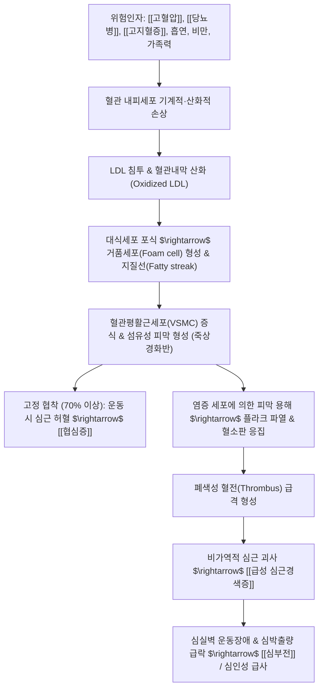

# 🩺 [[관상동맥질환]] (Coronary Artery Disease, CAD / 冠狀動脈疾患, I25)

> **핵심 3줄 요약 (Key Summary)**:
> - 📍 병소 부위 & 해부·병태생리: 심장 영양 혈관(좌주간부 LMCA, 좌전하행지 LAD, 좌회선지 LCx, 우관상동맥 RCA); 내피세포 손상 및 지질 침착 죽상경화반 비후로 혈관 내경 협착 및 심근 산소 공급 장애.
> - 🚩 전형적 임상 양상 & 3대 징후: 안정형 협심증(노작 시 흉골 후방 압박통, 휴식 시 완화), 급성 관상동맥 증후군(ACS; 휴식 시에도 지속되는 극심한 흉통), 좌측 견배부·팔 내측·턱으로의 방사통(Levine's sign).
> - 🛠️ 핵심 감별 검사 & 한·양방 다각적 치료 전략: 관상동맥 CT 조영술·운동부하심전도(TMT)·심혈관조영술(CAG), 양방 PCI(스텐트)/CABG 및 항혈소판제·스타틴, 한의 침구(내관, 극문, 심수) 및 관심이호·단삼음·과루해백백주탕 치법.
> - ⚠️ 응급 의뢰 레드플래그 & 악화 요인: 20분 이상 지속되는 쥐어짜는 듯한 흉통, 식은땀·호흡곤란·실신 동반([[급성 심근경색증]] 의심) 시 지체 없이 119 구급 이송, 흡연·고지방식·과로 및 급격한 저온 노출 엄격 금기.

---

## 📌 목차
1. [질환 개요 & 해부학적 병태생리](#1-질환-개요--해부학적-병태생리)
2. [병태생리 메커니즘 & 생체역학적 악순환 네트워크](#2-병태생리-메커니즘--생체역학적-악순환-네트워크)
3. [임상 증상 & 이학적 검사(Physical Exam) 알고리즘](#3-임상-증상--이학적-검사physical-exam-알고리즘)
4. [감별 진단 매트릭스 (Differential Diagnosis)](#4-감별-진단-매트릭스-differential-diagnosis)
5. [한의 통합 치료 프로토콜 (침·약침·추나·한약)](#5-한의-통합-치료-프로토콜-침약침추나한약)
6. [재활 운동 & 생활습관 티칭 가이드](#6-재활-운동--생활습관-티칭-가이드)
7. [💡 사용자 진료실 핵심 필기 & 임상 노하우 (Melt-In 잔여 심화 집약)](#7--사용자-진료실-핵심-필기--임상-노하우-melt-in-잔여-심화-집약)
8. [출처 및 학술 참고 문헌 (References)](#8-출처-및-학술-참고-문헌-references)

---

## 1. 질환 개요 & 해부학적 병태생리

![[Coronary_Artery_Disease.jpg|450]]
> [그림 1: ① 관상동맥 내 죽상경화반의 진행성 비후 및 내경 협착에 의한 국소 심근 허혈 병소 메디컬 3D 렌더링]

* **질환 정의**:
  * 관상동맥(Coronary Artery) 내벽에 죽상경화반(Atherosclerotic plaque)이 형성되어 혈관강이 좁아지거나 혈전으로 폐쇄됨으로써, 심장 근육으로 공급되는 관류량이 심근의 산소 요구량에 미치지 못해 발생하는 허혈성 심장 질환의 총칭.
* **스펙트럼에 따른 질환 분류**:
  1. **만성 관상동맥 증후군 (CCS / 안정형 협심증)**:
     * 죽상경화반이 서서히 자라 혈관 내경의 70% 이상을 침범한 고정 협착. 평상시에는 증상이 없으나 운동이나 스트레스로 심박수가 오를 때 가역적인 흉통 발생 후 안정 시 소실.
  2. **급성 관상동맥 증후군 (ACS / Acute Coronary Syndrome)**:
     * 동맥경화반의 섬유성 피막 파열(Plaque rupture) 또는 미란(Erosion)으로 급격한 혈소판 혈전이 형성되어 혈관을 부분/완전 폐색시키는 초응급 상태.
     * **불안정형 협심증 (UA)**: 심근 괴사의 생화학적 증거(Troponin 음성)는 없으나 흉통의 빈도·강도가 급증.
     * **비-ST분절 상승 심근경색 (NSTEMI)**: 부분 폐색으로 심내막하 심근 괴사 발생 (Troponin 양성).
     * **ST분절 상승 심근경색 (STEMI)**: 관상동맥 완전 폐색으로 전층 심근 괴사 초래 (응급 재관류 필수).
* **관상동맥 주요 해부학적 분지**:

![[심장_관상동맥_해부도해.png|450]]
> [그림 2: ② 상행대동맥 기저부에서 분지하는 좌주간부(LMCA), 좌전하행지(LAD), 좌회선지(LCx), 우관상동맥(RCA) 3차원 해부도]

  * **좌주간부 (LMCA, Left Main)**: 좌심실의 2/3 이상에 혈류를 공급하는 핵심 혈관.
  * **좌전하행지 (LAD, Left Anterior Descending)**: 심실중격 전방 2/3 및 좌심실 전벽 관류 (가장 호발하는 폐색 부위).
  * **좌회선지 (LCx, Left Circumflex)**: 좌심방 및 좌심실 외측벽 관류.
  * **우관상동맥 (RCA, Right Coronary Artery)**: 우심실, 좌심실 하벽 및 방실결절(AV node) 전도계 관류.

---

## 2. 병태생리 메커니즘 & 생체역학적 악순환 네트워크

### 1) 심근 허혈의 생화학적 캐스케이드
* **산소 수급 불균형**:
  * 운동, 추위 노출, 정서적 흥분 시 심근 산소 요구량이 급증하나 관상동맥의 협착으로 관류 예비능(Coronary flow reserve)이 고갈됨.
* **무산소 대사 전환과 흉통 발생**:
  * 산소 공급 중단 8~10초 후 호기성 미토콘드리아 대사가 정지되고 혐기성 해당과정으로 전환 $\rightarrow$ 세포 내 글리코겐 고갈 및 젖산(Lactate), 아데노신, 브라디키닌, 수소이온 축적 $\rightarrow$ 심장 감각신경(C-fiber) 자극으로 흉골 후방의 압박성 허혈 흉통 유발.
* **심근 기능의 단계적 상실 (Ischemic Cascade)**:
  * 관류 저하 $\rightarrow$ 이완기 심실 이완 장애 $\rightarrow$ 수축기 벽운동 이상 $\rightarrow$ 심전도 ST-T 변화 $\rightarrow$ 협심통 발현.

---

## 3. 임상 증상 & 이학적 검사(Physical Exam) 알고리즘

![[내장기_심장연관통_방사통도해.jpg|450]]
> [그림 3: ③ 심근 허혈 시 발생하는 흉골 후방 압박통 및 좌측 어깨·팔 내측·경부·견갑간부 내장기-체성 신경 연관 방사통 도해]

### 1) 특징적 증상 및 방사통 양상
* **흉통의 성상**:
  * "가슴을 쥐어짜는 것 같다", "코끼리가 가슴을 짓밟고 있는 것 같다", "고춧가루를 뿌린 듯 타는 느낌" 등으로 표현되는 무겁고 둔한 압박통 (날카로운 통증이나 찌르는 통증과는 다름).
  * **르빈 징후 (Levine's sign)**: 환자가 통증을 설명할 때 흉골 부위에 주먹을 쥐어 대는 전형적 손짓.
* **내장기 체성 연관통 (Referred Pain)**:
  * T1~T4 척수 분절을 공유하는 감각신경 경로를 통해 **좌측 어깨, 상완 내측, 척골 신경 주행 부위, 하악골(턱), 목, 견갑골 사이**로 통증이 방사됨.
* **동반 자율신경 증상**:
  * 식은땀(발한), 호흡곤란, 오심, 구토, 극심한 불안감 및 죽을 것 같은 공포감(Angor animi).

### 2) 필수 이학적 검사 & 심혈관 진단 알고리즘
* **신체 진찰 및 흉벽 압통 촉진 (CRITICAL)**:
  * **갈비연골관절 압통 촉진**: 흉통 부위를 손가락으로 눌렀을 때 국소 압통이 뚜렷하게 재현된다면 관상동맥질환보다는 [[늑연골염]](티체 증후군)이나 흉벽 근육통일 가능성이 높음. (허혈성 심장통증은 흉벽 압진으로 재현되지 않음).
* **심전도 (ECG)**:
  * 심근 허혈 시 ST분절 하강 또는 T파 역전; 경색 시 ST분절 상승(STEMI) 및 병적 Q파 형성.
* **운동부하 심전도 (TMT, Treadmill Test)**:
  * 점진적 운동 부하를 통해 관상동맥의 관류 예비능 및 허혈 유발 역치를 평가.
* **관상동맥 CT 조영술 & 심혈관 조영술 (CAG)**:
  * 혈관 내 협착 부위, 석회화 점수(Agatston score) 및 협착 백분율을 정밀 확인하여 스텐트 삽입술(PCI) 또는 관상동맥 우회술(CABG) 결정.

---

## 4. 감별 진단 매트릭스 (Differential Diagnosis)

| 감별 질환 | 통증 성상 및 유발 조건 | 지속 시간 | 이학적 검사 및 진단 특징 |
| :--- | :--- | :--- | :--- |
| [[관상동맥질환]] (본 질환) | 운동 시 유발되는 조이는 듯한 흉골통, 방사통 | 2~15분 (휴식 시 완화) | 흉벽 압통 음성, 운동부하 심전도 양성, CAG 협착 |
| [[늑연골염]] (티체 증후군) | 기침, 심호흡, 상체 비틀기 시 날카로운 흉통 | 지속적 (수시간~수일) | 갈비연골관절(2~5번) 국소 압통 명확, 심전도 정상 |
| 위식도역류질환 ([[GERD]]) | 식후 또는 누웠을 때 타는 듯한 작열감(Heartburn) | 30분~수시간 | 제산제 복용 시 완화, 내시경 식도염, 심전도 정상 |
| 대동맥 박리 (Aortic Dissection) | 찢어지는 듯한(Tearing) 극심한 전흉부·배부 통증 | 발생 즉시 최고조 지속 | 양팔 혈압 차이 > 20 mmHg, 흉부 CT 대동맥 내막 피판 |
| 대상포진 초기 (전구기) | 늑간신경 주행을 따른 편측성 찌르는 듯한 통증 | 지속적, 피부 마찰 시 악화 | 흉통 3~5일 후 수포성 발진 출현, 늑간 피부 지각과민 |

---

## 5. 한의 통합 치료 프로토콜 (침·약침·추나·한약)

* **침구 치료 (Acupuncture)**:
  * **주요 혈위**: 내관(PC6), 극문(PC4), 심수(BL15), 궐음수(BL14), 단중(CV17), 전중, 족삼리(ST36).
  * **자침 기전**: 심포경의 극혈인 극문혈과 낙혈인 내관혈 자침은 관상동맥 혈류 저항을 즉각 감소시키고, 심근 미세순환을 촉진하며 허혈성 젖산 축적을 경감시킴.
* **약침 치료 (Pharmacopuncture)**:
  * **중성어혈 약침 / 단삼 약침**: 심수, 궐음수 혈위에 0.1~0.2cc 시술하여 흉배부 근육 긴장을 풀고 미세혈관 혈류를 개선.
* **흉추·갈비뼈 추나 치료 (Chuna Manipulation)**:
  * **상부 흉추(T1-T5) 교정 및 흉곽 가동 기법**: 흉추 후관절 가동술을 통해 흉곽 가동성을 회복시키고, 심장으로 가는 교감신경 긴장도를 이완시켜 심근 산소소모량 절감.
* **한약 변증 치료 (Herbal Medicine)**:
  * **흉비심통·혈어기체 (胸痺心痛·血瘀氣滯)**:
    * 흉골 후방 찌르는 듯한 통증, 야간 악화, 좌측 어깨 방사통, 설암자 어점, 맥삽.
    * *대표 처방*: [[단삼음]](丹蔘飲) 또는 [[관심이호]](冠心二號) (단삼, 단향, 사인 배오로 활혈화어·이기지통).
  * **음한응체 (陰寒凝滯)**:
    * 추위에 노출되면 흉통 발작, 가슴이 답답하고 숨참, 사지 냉감.
    * *대표 처방*: [[과루해백백주탕]](栝蔞薤白白酒湯) 또는 [[과루해백반하탕]] (통양산결·행기거담).
  * **심기음허 (心氣陰虛)**:
    * 협심증 안정기, 가벼운 활동에도 숨차고 가슴 두근거림, 피로감, 자한, 맥세약.
    * *대표 처방*: [[생맥산]](生脈散) 가감.

---

## 6. 재활 운동 & 생활습관 티칭 가이드

* **운동 기반 심장재활 (Exercise-based Cardiac Rehabilitation, ExCR)**:
  * **학술적 근거**: Cochrane 리뷰 및 유수의 메타분석에 따르면, PCI 시술 또는 급성 심근경색 후 심장재활 프로그램 참여 시 **심혈관 질환 사망률을 26%(RR 0.74), 재입원율을 23%(RR 0.77), 심근경색 재발률을 18%(RR 0.82)** 감소시킴.
  * **유산소 운동 프로토콜**:
    * 주 3~5회, 회당 30~40분, 중등도 강도(최대 심박수의 50~70%, 또는 RPE 11~13 '약간 힘들다' 수준).
    * 트레드밀 걷기, 고정식 자전거 타기 권장.
  * **저항 운동(근력 운동) 병행**:
    * 주 2~3회, 10~15회 반복 가능한 저~중등도 중량으로 시행하여 대근육군([[대퇴사두근]], [[둔근]])을 강화하고 [[근감소증]] 예방.
* **생활습관 교정 티칭**:
  * **금연**: 흡연은 혈관내피 손상과 관상동맥 연축의 1위 원인이므로 절대 금연.
  * **추위 노출 주의**: 겨울철 이른 아침 외출 시 급격한 온도 저하로 관상동맥이 수축할 수 있으므로 보온 철저.

---

## 7. 💡 사용자 진료실 핵심 필기 & 임상 노하우 (Melt-In 잔여 심화 집약)

### 1) 심인성 흉통 vs 근골격계 흉곽 통증 실전 감별 노하우
* **원장실 3단계 문진 & 촉진 공식**:
  1. **"숨을 깊이 들이마시거나 기침할 때, 몸을 비틀 때 가슴이 찌릿하게 아픈가요?"**
     $\rightarrow$ "예"라고 답하면 95% 이상 늑골 관절염, 늑간신경통, 대흉근 근막통증증후군임.
  2. **"흉골 옆 갈비뼈 관절 부위를 손가락 끝으로 꾹 누르면 소리를 지를 정도로 아픈가요?"**
     $\rightarrow$ 압통이 정확히 재현되면 티체 증후군 또는 근막 통증임.
  3. **"빠르게 걷거나 계단을 오를 때 가슴을 무거운 돌로 짓누르는 듯한 통증이 발생하고, 쉬면 3~5분 내에 씻은 듯 사라지나요?"**
     $\rightarrow$ 이는 100% 관상동맥질환(안정형 협심증)이므로 지체 없이 심장내과 정밀 검사를 의뢰해야 함.

### 2) 심혈관 질환자의 운동 공포증(Kinesiophobia) 해소 상담 스크립트
* **환자의 심리**:
  * 스텐트(PCI) 시술을 받았거나 협심증 진단을 받은 환자들은 "운동하다가 스텐트가 빠지거나 심장이 터질까 봐 무섭다"며 하루 종일 누워만 지내 근육이 급격히 빠지는 악순환에 빠짐.
* **설명 스크립트 노하우**:
  * *"어르신, 심장 스텐트는 혈관 벽에 완전히 안착되어 걷기 운동을 한다고 해서 절대 빠지거나 터지지 않습니다. 오히려 규칙적인 유산소 운동을 하셔야 심장으로 가는 샛길 혈관(측부순환로)이 자라나 재발과 재입원을 25% 이상 막아줍니다. 하루 20~30분 숨이 약간 찰 정도의 평지 걷기부터 오늘부터 바로 시작하십시오."*

---

## 8. 출처 및 학술 참고 문헌 (References)

1. **Knuuti, J., et al. (2020)**. *2019 ESC Guidelines for the diagnosis and management of chronic coronary syndromes*. **European Heart Journal**, 41(3), 407-477.
   - `[연구 요약]`: [PubMed Link](https://pubmed.ncbi.nlm.nih.gov/31504439/) / 만성 관상동맥 증후군의 최신 진단 알고리즘, 사전 검사 확률(Pre-test probability) 평가 모델 및 최적 약물 요법 가이드라인을 집대성함.
2. **Dibben, G., et al. (2021)**. *Exercise-based cardiac rehabilitation for coronary heart disease: a Cochrane systematic review and meta-analysis*. **Cochrane Database of Systematic Reviews**, 11(11), CD001800.
   - `[연구 요약]`: [PubMed Link](https://pubmed.ncbi.nlm.nih.gov/34741484/) / 관상동맥질환 환자 대상 운동 기반 심장재활(ExCR)의 코크란 메타분석으로 심혈관 사망률 26% 감소, 입원율 23% 감소, 심근경색 재발 18% 감소 효과를 명확히 규명함.
3. **Libby, P. (2021)**. *The changing landscape of atherosclerosis*. **Nature**, 592(7855), 524-533.
   - `[연구 요약]`: [PubMed Link](https://pubmed.ncbi.nlm.nih.gov/33883728/) / 죽상경화반의 생성, 지질 축적, 만성 염증 반응 및 플라크 파열 메커니즘에 대한 네이처(Nature)지의 표준 병태생리 총설.
4. **Hao, P., et al. (2017)**. *Traditional Chinese medicine for cardiovascular disease: evidence and potential mechanisms*. **Journal of the American College of Cardiology**, 69(24), 2952-2966.
   - `[연구 요약]`: [PubMed Link](https://pubmed.ncbi.nlm.nih.gov/28595687/) / 관상동맥질환 및 심혈관 질환에 대한 한약 제제의 활혈화어 기전, 내피세포 보호, 혈소판 응집 억제 및 임상적 효능을 미국심장학회지(JACC)에서 입증함.
