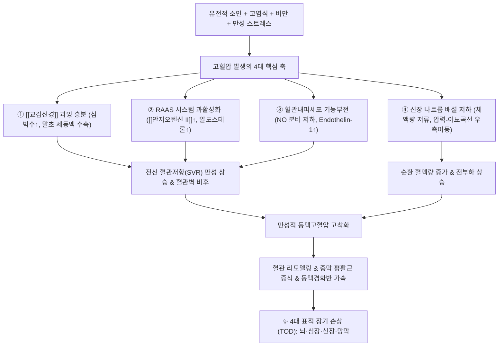

# 🩺 [[고혈압]] (Hypertension / 高血壓, I10-I15)

> **핵심 3줄 요약 (Key Summary)**:
> - 📍 병소 부위 & 해부·병태생리: 전신 소동맥 저항혈관(Systemic arterioles) 및 [[심장]], 신장 사구체; RAAS 과항진, [[교감신경]] 만성 흥분, 혈관내피세포 파괴 및 평활근 비후로 전신 혈관저항(SVR) 증가.
> - 🚩 전형적 임상 양상 & 3대 징후: 대개 무증상('침묵의 살인자'), 혈압 급상승 시 후두부 박동성 두통·경항부 경직, 현훈(眩暈) 및 이명; 수축기 혈압 140 mmHg 이상 또는 이완기 혈압 90 mmHg 이상(가정혈압 135/85 mmHg 이상).
> - 🛠️ 핵심 감별 검사 & 한·양방 다각적 치료 전략: 24시간 활동혈압(ABPM)·심전도·심초음파·미세알부민뇨 검사, 양방 ACEi/ARB·CCB·이뇨제·베타차단제 및 한의 침구(태충, 곡지, 풍지), 천마구등음·반하백출천마탕·기국지황환 치법.
> - ⚠️ 응급 의뢰 레드플래그 & 악화 요인: 수축기 180 mmHg 또는 이완기 120 mmHg 초과의 고혈압 응급증(Hypertensive Emergency; 급성 뇌병증, 흉통, 급성 폐부종, 유두부종) 동반 시 즉시 상급병원 응급실 전원, 고염식·음주·비만·NSAIDs 남용 금기.

---

## 📌 목차
1. [질환 개요 & 해부학적 병태생리](#1-질환-개요--해부학적-병태생리)
2. [병태생리 메커니즘 & 생체역학적 악순환 네트워크](#2-병태생리-메커니즘--생체역학적-악순환-네트워크)
3. [임상 증상 & 이학적 검사(Physical Exam) 알고리즘](#3-임상-증상--이학적-검사physical-exam-알고리즘)
4. [감별 진단 매트릭스 (Differential Diagnosis)](#4-감별-진단-매트릭스-differential-diagnosis)
5. [한의 통합 치료 프로토콜 (침·약침·추나·한약)](#5-한의-통합-치료-프로토콜-침약침추나한약)
6. [양방 치료 & 병용·의뢰 기준 (Conventional Treatment & Referral)](#6-양방-치료--병용의뢰-기준-conventional-treatment--referral)
7. [재활 운동 & 생활습관 티칭 가이드](#6-재활-운동--생활습관-티칭-가이드)
8. [💡 사용자 진료실 핵심 필기 & 임상 노하우 (Melt-In 잔여 심화 집약)](#7--사용자-진료실-핵심-필기--임상-노하우-melt-in-잔여-심화-집약)
9. [출처 및 학술 참고 문헌 (References)](#8-출처-및-학술-참고-문헌-references)

---

## 1. 질환 개요 & 해부학적 병태생리

![[청강의감20_25_혈압약_심장부하_도해.png|450]]
> [그림 1: ① 레닌-안지오텐신-알도스테론계(RAAS) 축의 안지오텐신 II 생성 및 혈관수축·신장 수분재흡수에 따른 혈압 상승 병태생리 도해]

* **질환 정의 및 진단 기준**:
  * 만성적으로 동맥 혈압이 기준치 이상으로 지속 상승하여 심혈관계 합병증을 유발하는 다인성 혈관 증후군.
  * 진료실 측정 기준 수축기 혈압(SBP) 140 mmHg 이상 또는 이완기 혈압(DBP) 90 mmHg 이상으로 정의됨 (가정혈압 및 주간 활동혈압 기준은 135/85 mmHg 이상).
* **대한고혈압학회(KSH) 및 글로벌 성인 혈압 분류 기준**:

| 분류 단계 | 수축기 혈압 (SBP, mmHg) | 구분 기호 | 이완기 혈압 (DBP, mmHg) | 임상 관리 권고사항 |
| :--- | :--- | :---: | :--- | :--- |
| 정상 혈압 | < 120 | and | < 80 | 생활요법 유지 및 주기적 측정 |
| 주의 혈압 | 120 ~ 129 | and | < 80 | 적극적 생활습관 교정 (식이·운동) |
| 고혈압 전단계 | 130 ~ 139 | or | 80 ~ 89 | 생활요법 + 심혈관 위험군 시 약물 고려 |
| 1기 고혈압 | 140 ~ 159 | or | 90 ~ 99 | 생활요법 + 단일제 항고혈압제 투약 |
| 2기 고혈압 | $\ge$ 160 | or | $\ge$ 100 | 생활요법 + 2제 병용 복합 요법 조기 개시 |

* **에티올로지별 2대 임상 분류**:
  1. **본태성 고혈압 (Essential / Primary HTN, 90~95%)**:
     * 특정 기저 원인 질환 없이 유전적 소인, 노화에 따른 동맥 경직도 증가, 비만, 고염분 식이, 만성 스트레스, 인슐린 저항성이 복합 작용하여 발생.
  2. **이차성 고혈압 (Secondary HTN, 5~10%)**:
     * 원인 질환이 명확한 경우로 신동맥 협착증, 만성 신장 질환([[사구체신염]]), 원발성 알도스테론증, 쿠싱 증후군, 크롬친화세포종, 폐쇄성 수면무호흡증(OSA), 특정 약물([[NSAID]], 경구피임약, 스테로이드)에 의해 발생하며 원인 교정 시 혈압 호전 가능.

---

## 2. 병태생리 메커니즘 & 생체역학적 악순환 네트워크

![[청강의감20_24_관상동맥_알파1_베타2_수용체.jpg|450]]
> [그림 2: ② 교감신경 아드레날린 수용체(Alpha-1 전신 말초혈관수축 및 Beta-1 심근수축력 증가·레닌 분비)와 혈역학적 과부하 도해]

혈압의 결정 공식은 **혈압($BP$) = 심박출량($CO$) $\times$ 전신 혈관저항($SVR$)**에 의해 지배된다.

### 1) 고혈압 4대 병태생리 축
* **레닌-안지오텐신-알도스테론계 (RAAS)**:
  * 신장 수입세동맥 관류압 저하 시 사구체옆세포(JG cell)에서 레닌 분비 $\rightarrow$ 안지오텐신 I $\rightarrow$ 폐 모세혈관의 안지오텐신전환효소(ACE)에 의해 [[안지오텐신 II]] 생성.
  * $AT_1$ 수용체 결합으로 강력한 세동맥 수축 및 부신피질 알도스테론 분비 촉진 $\rightarrow$ 신원 원위세뇨관의 $Na^+$/수분 재흡수 증가로 혈장량 팽창.
* **교감신경계(SNS) 만성 과활성화**:
  * 스트레스와 비만 환자에서 혈중 카테콜아민 분비 항진 $\rightarrow$ $\alpha_1$ 수용체 매개 전신 세동맥 수축, $\beta_1$ 수용체 매개 심박수·심근수축력 증가 및 신장 레닌 분비 촉진.
* **혈관내피 기능부전 (Endothelial Dysfunction)**:
  * 산화 스트레스 증가로 인해 혈관확장인자인 일산화질소([[NO]]) 생체이용률이 급감하고, 강력한 혈관수축인자인 엔도텔린-1(ET-1)이 과발현됨.
* **혈관 리모델링 (Vascular Remodeling)**:
  * 지속적인 혈류 전단응력(Shear stress)과 압력 부하로 혈관평활근세포(VSMC) 증식 및 세포외 기질 콜라겐 축적 $\rightarrow$ 혈관벽 비후, 혈관 내경 감소 및 컴플라이언스(탄성) 상실.

### 2) 4대 표적 장기 손상 (Target Organ Damage, TOD)
* **뇌 (Brain)**:
  * 소혈관 초자양 변성(Hyaline arteriolosclerosis) $\rightarrow$ 뇌경색(허혈성 뇌졸중), 뇌미세출혈 및 뇌출혈, 혈관성 치매, 일과성 허혈발작(TIA).
* **심장 (Heart)**:
  * 후부하(Afterload) 증가에 저항하기 위한 좌심실 비대(LVH) $\rightarrow$ 심근 이완 장애([[HFpEF]]) 및 수축기 심부전([[HFrEF]]), 관상동맥 관류 저하에 의한 [[협심증]], [[심근경색증]].
* **신장 (Kidney)**:
  * 사구체 모세혈관 내압 상승 $\rightarrow$ 사구체 경화증(Glomerulosclerosis), 미세알부민뇨 및 [[단백뇨]], 만성 신부전(CKD/ESRD).
* **눈 (Retina)**:
  * 고혈압성 망막병증(Keith-Wagener 분류): 동맥 세선화(Silver/copper wiring), 동정맥 교차 압박(A-V crossing), 화염상 출혈, 면화반(Cotton-wool spot), 시신경 유두부종.

---

## 3. 임상 증상 & 이학적 검사(Physical Exam) 알고리즘

### 1) 주소증 및 임상 증상
* **대다수 무증상**:
  * 초기 및 중기에는 뚜렷한 자각 증상이 없어 정기 건강검진이나 우연한 혈압 측정에서 발견됨.
* **혈압 급상승 시의 증상**:
  * **후두부 박동성 두통**: 주로 이른 아침 기상 시 뒷머리가 묵직하게 조이거나 지끈거리는 통증.
  * **현훈(眩暈) 및 이명**: 체위 변경 시 어지럼증, 귀에서 웅웅거리는 박동성 이명음.
  * **경항부 강직감**: 혈관 긴장 및 경추 주위 근육([[후두하근]], [[승모근]], [[두판상근]])의 이차적 과긴장.
  * **시야 흐림 및 코피(비출혈)**: 미세혈관 압력 한계 초과 시 발현.

### 2) 필수 이학적 검사 및 진단 알고리즘
* **정확한 혈압 측정 프로토콜**:
  * 측정 전 30분간 카페인 섭취·흡연 금지, 등받이가 있는 의자에 5분간 안정 후 심장 높이에서 커프 착용.
  * 양팔 혈압 최초 동시 측정 (양측 SBP 차이가 15~20 mmHg 이상이면 쇄골하동맥 협착 또는 대동맥 박리 의심).
* **백의 고혈압(White-coat HTN) vs 가면 고혈압(Masked HTN) 감별**:
  * **24시간 활동혈압 측정(ABPM)** 또는 **가정혈압 모니터링(HBPM)**을 시행하여 진료실에서만 오르는 백의 고혈압과, 진료실에선 정상이지만 일상에서 상승하는 가면 고혈압 감별.
* **이학적 랜드마크 청진**:
  * **심장 청진**: S4 심음(좌심실 비대로 인한 심방 수축기 부가음), 대동맥판막 부위 수축기 잡음.
  * **경동맥 및 복부 청진**: 경동맥 잡음(Carotid bruit) 및 복부 신동맥 잡음(Renal artery bruit) 청진으로 죽상동맥경화 및 신동맥 협착 여부 스크리닝.
* **안저 검사 (Fundoscopy)**:
  * 세동맥 수축, 동정맥 압박, 유두부종 확인을 통한 표적 장기 미세혈관 손상도 평가.

---

## 4. 감별 진단 매트릭스 (Differential Diagnosis)

| 질환 분류 | 호발 기저 원인 | 임상 징후 차이점 | 핵심 감별 진단 지표 |
| :--- | :--- | :--- | :--- |
| [[고혈압]] (본태성) | 유전, 노화, 고염식, 비만, 스트레스 | 완만한 혈압 상승, 대개 무증상 | 24시간 활동혈압(ABPM) 지속 상승, 이차성 원인 음성 |
| 신혈관성 고혈압 (신동맥 협착) | 죽상경화증, 섬유근육형성이상 | 30세 미만 또는 55세 이후 급발, 3제 약물 불응 | 신장 도플러 초음파, 복부 혈관잡음, ACEi 투여 후 Cr 급등 |
| 원발성 알도스테론증 | 부신 선종(콘 증후군), 부신 과형성 | 난치성 고혈압, 근력 약화, 다뇨, 다음 | 저칼륨혈증, 알도스테론/레닌 활성 비(ARR) $\ge$ 20~30 |
| 갈색세포종 (Pheochromocytoma) | 부신 수질 크롬친화세포 선종 | 5대 발작 징후: 두통, 발한, 빈맥, 창백, 진전 | 24시간 요중 분획 메타네프린/카테콜아민 현저한 증가 |
| 쿠싱 증후군 | 코르티솔 과다(부신 선종/뇌하수체 ACTH) | 중심성 비만, 만월안, 들소혹, 자색 선조 | 24시간 요중 유리 코르티솔, 야간 덱사메타손 억제검사 |
| 대동맥 축착증 (Coarctation) | 선천성 대동맥 협착 기형 | 상지 혈압 상승 vs 하지 혈압 저하 및 맥박 미약 | 상·하지 수축기 혈압 차이 > 20 mmHg, 흉부 X-ray 갈비뼈 절흔 |

---

## 5. 한의 통합 치료 프로토콜 (침·약침·추나·한약)

![[청강의감20_15_칼슘채널차단제_혈관확장.jpg|450]]
> [그림 3: ③ 혈관평활근 칼슘 유입 차단을 통한 혈압 강하 기전 및 한의 경혈 자극의 혈관 긴장도 완화 접점 도해]

* **침구 치료 (Acupuncture)**:
  * **주요 혈위**: 태충(LR3), 곡지(LI11), 풍지(GB20), 내관(PC6), 족삼리(ST36), 인영(ST9).
  * **자침 기전**: 태충혈(간경 원혈) 사법은 중추 자율신경반사를 통해 교감신경 긴장도를 즉각 낮추고 혈관내피 [[NO]] 방출을 유도하여 혈압을 강하시킴. 풍지혈 자침은 후두하근군을 이완시켜 추골뇌저동맥 순환을 개선.
* **약침 치료 (Pharmacopuncture)**:
  * **황련해독탕 약침 / 중성어혈 약침**: 풍지, 견정, 심수, 간수 혈위에 0.1~0.2cc 분주하여 상초 화열(火熱)과 경항부 근육 연축을 해소하고 두통 완화.
* **경추·흉추 추나 치료 (Chuna Manipulation)**:
  * **상부 경추 가동 및 JS 근막 이완**: 환추후두관절(C0-C1) 및 경흉추 이행부(C7-T1) 기능 이상 교정, 후두하근막·흉쇄유돌근 이완을 통해 경부 교감신경절(상경신경절)의 비정상적 과흥분 입력을 정상화.
* **한약 변증 치료 (Herbal Medicine)**:
  * **간양상항 (肝陽上亢)**: 두통, 어지럼, 안면 홍조, 성급함, 설홍태황.
    * *대표 처방*: [[천마구등음]](天麻鉤藤飲) (천마, 조등, 석결명, 치자, 황금 등 배오로 평간잠양·청열안신).
  * **담탁조규 (痰濁阻竅)**: 두중감, 머리가 무겁고 어지러움, 비만 체형, 흉민, 오심, 맥활.
    * *대표 처방*: [[반하백출천마탕]](半夏白朮天麻湯) (비위 담습을 삭이고 청양(淸陽)을 상승시킴).
  * **간신음허 (肝腎陰虛)**: 노인성 고혈압, 야간 두통, 이명, 요슬산연, 수족심열, 맥세삭.
    * *대표 처방*: [[기국지황환]](杞菊地黃丸) 또는 [[육미지황환]] 가미 (자음강화).

---

## 6. 양방 치료 & 병용·의뢰 기준 (Conventional Treatment & Referral)

> 🎯 **이 섹션의 목적**: 환자가 **양방약을 이미 복용 중인 경우가 많다.** 한의원 1차 진료에서 양방 치료를 이해하고, 병용 가능·주의·금기를 판단하며, 언제 의뢰할지 결정한다.

* **약물 치료 (Medication)**:
  * 계열별 약물·용량·기간 — 국내 처방 관행 반영.
  * 작용 기전과 한의 치료와의 상호작용.
* **비약물 시술 (Procedures)**:
  * 주사·차단술·물리치료·보조기 등.
* **수술·시술 적응증 (Surgical Indication)**:
  * 언제 수술로 가는가 — 절대·상대 적응증, 수술 후 경과.
* **한의 병용 판단 (Combination Therapy)**:
  * 병용 가능 / 주의 / 금기. 복용 중 환자의 감량 타이밍·반동 현상.
* **양방·전문과 의뢰 기준 (Referral Criteria)**:
  * 응급 의뢰 트리거와 전문과 의뢰 기준(정형외과·신경외과·내과 등).

	(작성 필요)

---

## 7. 재활 운동 & 생활습관 티칭 가이드

* **DASH(Dietary Approaches to Stop Hypertension) 식이 요법**:
  * **염분 제한**: 하루 나트륨 2g 이하(소금 5g/1티스푼 이하)로 철저히 제한 (혈압 5~10 mmHg 강하 효과).
  * 칼륨·마그네슘·칼슘이 풍부한 채소, 과일, 통곡물, 저지방 유제품 섭취 확대.
* **유산소 운동 요법**:
  * 주 5~7회, 하루 30~50분의 중강도 유산소 운동(빠르게 걷기, 조깅, 실내 자전거, 수영).
  * 발살바 호흡을 유발하는 과도한 고중량 웨이트 트레이닝은 흉강내압 급등으로 뇌혈관 파열 위험이 있으므로 경증~중등도 저항운동으로 제한.
* **체중 감량 및 금연·절주**:
  * 체중 1kg 감량 시 수축기 혈압 약 1 mmHg 강하.
  * 흡연은 급격한 교감신경 흥분과 혈관내피 손상을 유발하므로 절대 금연; 알코올 섭취는 하루 1~2잔 이하로 제한.

---

## 8. 💡 사용자 진료실 핵심 필기 & 임상 노하우 (Melt-In 잔여 심화 집약)

### 1) 진료실 혈압 측정 시 백의 고혈압 배제 노하우
* **측정 환경 안정화**:
  * 환자가 한의원 문을 열고 들어오자마자 바로 자동혈압계에 팔을 넣으면 교감신경 흥분으로 평소보다 15~30 mmHg 높게 측정됨.
  * 반드시 문진 및 침 치료 준비실에서 최소 5~10분간 편안히 앉아 숨을 고르게 한 뒤, 편안한 대화 상태에서 측정해야 실질 혈압이 반영됨.
* **가정혈압 측정법 티칭**:
  * 아침 기상 후 1시간 이내(배뇨 후, 아침 약 복용 전, 식전) 2회 측정 평균, 저녁 취침 전 2회 측정 평균을 1주일간 스마트폰 어플이나 수첩에 기록해오도록 지도.

### 2) 양방 혈압약 부작용 모니터링 & 한약 테이퍼링 팁
* **CCB(암로디핀 등) 부작용**:
  * 발목 주위 함요부종, 잇몸 증식, 두통, 안면홍조 호소 시 약물 부작용임을 인지하고, 신장성 부종과 감별 필요.
* **ACE 억제제 부작용**:
  * 서열(Bradykinin) 분해 억제로 인한 만성 마른기침(기침약에 반응 없음) 호소 시 ARB 제제 전환을 권고.
* **한약 병용 투약 시 혈압 변동 관리**:
  * [[마황]] 함유 처방(비만약, 감기약) 처방 시 에페드린 성분에 의한 혈압 상승 가능성이 있으므로, 고혈압 환자에게는 마황 용량을 최소화(초기 4~6g 이하)하거나 거마황(去麻黃) 처방 고려.
  * 혈압약 복용 환자가 한약 복용 후 혈압이 110/70 mmHg 이하로 과도하게 떨어져 기립성 어지럼증을 호소할 경우, 양방 주치의와 상의하여 양약 용량을 단계적으로 감량(Tapering)하도록 안내.

---

## 9. 출처 및 학술 참고 문헌 (References)

1. **Whelton, P. K., et al. (2018)**. *2017 ACC/AHA/AAPA/ABC/ACPM/AGS/APhA/ASH/ASPC/NMA/PCNA Guideline for the Prevention, Detection, Evaluation, and Management of High Blood Pressure in Adults*. **Journal of the American College of Cardiology**, 71(19), e127-e248.
   - `[연구 요약]`: [PubMed Link](https://pubmed.ncbi.nlm.nih.gov/29146535/) / 성인 고혈압의 표준 진단 기준을 130/80 mmHg로 조기 개정하고 표적 장기 손상 예방을 위한 심혈관 위험도 평가 및 단계별 약물 요법 가이드라인을 집대성함.
2. **Mancia, G., et al. (2023)**. *2023 ESH Guidelines for the management of arterial hypertension The Task Force for the management of arterial hypertension of the European Society of Hypertension*. **Journal of Hypertension**, 41(12), 1874-2071.
   - `[연구 요약]`: [PubMed Link](https://pubmed.ncbi.nlm.nih.gov/37345492/) / 유럽고혈압학회의 최신 가이드라인으로 진료실 및 가정 혈압 측정법, 초기 2제 복합 요법의 중요성 및 장기 혈관 보호 전략을 상세히 규명함.
3. **Wang, J., & Xiong, X. (2013)**. *Evidence-Based Chinese Medicine for Hypertension*. **Evidence-Based Complementary and Alternative Medicine**, 2013, 978398.
   - `[연구 요약]`: [PubMed Link](https://pubmed.ncbi.nlm.nih.gov/23861720/) / 본태성 고혈압 환자에 대한 한약 처방의 분자생물학적 작용 기전 및 임상 혈압 강하 효과의 근거 수준을 체계적으로 고찰함.
4. **Zhao, F., et al. (2015)**. *Is Acupuncture Effective for Hypertension? A Systematic Review and Meta-Analysis*. **PLoS ONE**, 10(7), e0127019.
   - `[연구 요약]`: [PubMed Link](https://pubmed.ncbi.nlm.nih.gov/25871020/) / 23개 무작위 대조군 연구(1,788명) 메타분석을 통해 침 치료를 양약 항고혈압제와 병용 시 수축기 및 이완기 혈압을 추가적으로 유의하게 강하시키는 시너지 효과를 입증함.

<!-- 보관 태그(1회용·링크오류, 필요시 복원): 혈압, 내과질환 -->
