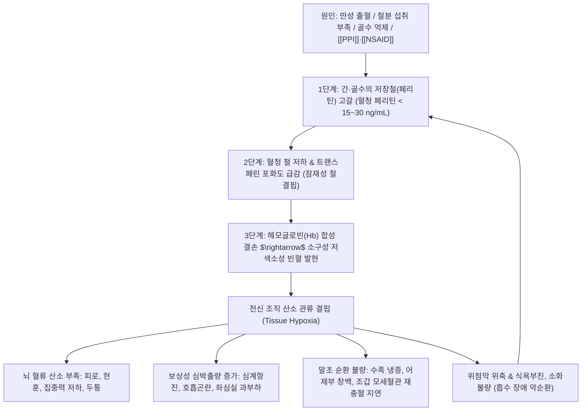

# 🩺 [[빈혈]] (Anemia / 貧血, D50-D64)

> **핵심 3줄 요약 (Key Summary)**:
> - 📍 병소 부위 & 해부·병태생리: 적색 골수(Red bone marrow) 조혈계 및 전신 적혈구 순환계; 헤모글로빈 합성 원료인 철분 결핍(IDA), 만성 출혈, 골수 억제 또는 적혈구 파괴 항진으로 산소 운반능 저하.
> - 🚩 전형적 임상 양상 & 3대 징후: 만성 피로·노작성 호흡곤란·어지럼증(현훈), 안검 결막 및 수족 어제부(魚際部) 창백, 손톱 모세혈관 재충혈 지연(Capillary refill time 연장) 및 스푼형 손톱(Koilonychia).
> - 🛠️ 핵심 감별 검사 & 한·양방 다각적 치료 전략: 일반혈액검사(CBC; Hb/Hct, MCV), 혈청 페리틴(Ferritin; 저장철)·TIBC 검사, 양방 경구 철분제(2가철/3가철/단백결합철) 및 한의 침구(족삼리, 비수, 혈해, 삼음교), 당귀보혈탕·사물탕·귀비탕 치법.
> - ⚠️ 응급 의뢰 레드플래그 & 악화 요인: 혈색소(Hb) < 7.0 g/dL의 중증 빈혈, 흑색변(Melena)·토혈을 동반한 급성 위장관 출혈, 안정 시 흉통([[협심증]] 유발) 시 즉시 수혈 및 응급실 전원, PPI·NSAIDs 장기 남용 및 과도한 카페인/탄닌 섭취 금기.

---

## 📌 목차
1. [질환 개요 & 해부학적 병태생리](#1-질환-개요--해부학적-병태생리)
2. [병태생리 메커니즘 & 생체역학적 악순환 네트워크](#2-병태생리-메커니즘--생체역학적-악순환-네트워크)
3. [임상 증상 & 이학적 검사(Physical Exam) 알고리즘](#3-임상-증상--이학적-검사physical-exam-알고리즘)
4. [감별 진단 매트릭스 (Differential Diagnosis)](#4-감별-진단-매트릭스-differential-diagnosis)
5. [한의 통합 치료 프로토콜 (침·약침·추나·한약)](#5-한의-통합-치료-프로토콜-침약침추나한약)
6. [양방 치료 & 병용·의뢰 기준 (Conventional Treatment & Referral)](#6-양방-치료--병용의뢰-기준-conventional-treatment--referral)
7. [재활 운동 & 생활습관 티칭 가이드](#6-재활-운동--생활습관-티칭-가이드)
8. [💡 사용자 진료실 핵심 필기 & 임상 노하우 (Melt-In 잔여 심화 집약)](#7--사용자-진료실-핵심-필기--임상-노하우-melt-in-잔여-심화-집약)
9. [출처 및 학술 참고 문헌 (References)](#8-출처-및-학술-참고-문헌-references)

---

## 1. 질환 개요 & 해부학적 병태생리

![[철-20240520184808034.png|450]]
> [그림 1: ① 소장 점막 상피세포에서의 헴철($Fe^{2+}$) vs 비헴철($Fe^{3+}$) 흡수 경로 및 비타민 C/위산에 의한 흡수 촉진과 카페인/탄닌/피트산의 흡수 방해 기전]

* **질환 정의 및 진단 기준 (WHO 기준)**:
  * 말초 혈액 내 적혈구 수 또는 혈색소(Hemoglobin, Hb) 농도가 생리학적 산소 요구량을 충족하지 못할 정도로 저하된 상태.
  * **성인 남성**: $\text{Hb} < 13.0\text{ g/dL}$
  * **비임신 성인 여성**: $\text{Hb} < 12.0\text{ g/dL}$
  * **임산부 및 노인**: $\text{Hb} < 11.0\text{ g/dL}$
* **다양한 발생 원인군**:
  * **철분 결핍**: 불충분한 섭취, 위장관 만성 미세출혈(치핵, 궤양, 대장 용종/암), 여성의 월경과다(Menorrhagia).
  * **약물 및 수술**: 프로톤펌프억제제([[PPI]]) 장기 복용으로 인한 위산 결핍(철분 환원 저해), [[NSAID]] 남용에 의한 위점막 미란 출혈, 항암 화학요법에 의한 골수 조혈 기능 억제, 위절제술 후 흡수 부전.
  * **영양 결핍 및 만성 질환**: 비타민 B12/엽산 결핍, 만성 감염·자가면역 질환([[만성질환성 빈혈]]).

---

## 2. 병태생리 메커니즘 & 생체역학적 악순환 네트워크

![[철-20240523163205940.png|450]]
> [그림 2: ② 체내 철분 대사 및 저장 사이클(창자 흡수 $\rightarrow$ 트랜스페린 운반 $\rightarrow$ 간 페리틴/헤모시데린 저장 $\rightarrow$ 골수 적혈구 조혈 $\rightarrow$ 지라(비장) 적혈구 붕괴 및 철 회수) 도해]

### 1) 체내 철분 항상성과 페리틴(Ferritin) 중심 치료 원리
* **헤모글로빈 vs 페리틴의 본질**:
  * 혈색소(Hb)는 당장 적혈구 내에서 산소를 운반하는 '지갑 속 현금'에 불과하며, 체내 총 철분의 진정한 지표는 간과 대식세포에 비축된 **페리틴(Ferritin; '통장 잔고')**임.
  * 빈혈 치료 시 Hb 수치가 12 g/dL로 정상화되었다고 해서 철분제를 즉시 중단하면 페리틴이 비어있어 수개월 내 재발하므로, **페리틴 수치가 50 ng/mL 이상 도달할 때까지 최소 3~6개월간 지속 보충**하는 것이 완치의 핵심임.
* **철분 흡수 화학**:
  * 소장 십이지장 상피에서는 2가철($Fe^{2+}$, Ferrous) 형태로만 직접 흡수됨. 식물성 식품의 3가철($Fe^{3+}$, Ferric)은 위산과 비타민 C의 환원 작용을 거쳐야 $Fe^{2+}$로 전환되어 흡수됨.

---

## 3. 임상 증상 & 이학적 검사(Physical Exam) 알고리즘

![[Iron-deficiency_Anemia,_Peripheral_Blood_Smear.jpg|450]]
> [그림 3: ③ 철결핍성 빈혈 환자의 말초혈액 도말(PBS) 검사 현미경 소견: 적혈구 크기가 작아지고(Microcytosis) 중앙 창백 부위가 현저히 넓어진 저색소성(Hypochromia) 적혈구]

### 1) 주소증 및 임상 증상
* **전신 및 신경계 증상**:
  * 만성적인 피로감, 무기력증, 기립 시 어지럼증(현훈), 아침 기상 곤란, 두통, 이명.
* **심폐계 증상**:
  * 조금만 빨리 걷거나 계단을 올라도 가슴이 두근거리고(심계항진) 숨이 참(노작성 호흡곤란).
* **소화기계 증상**:
  * 소화불량, 식욕부진, 오심, 위장관 운동 저하.
* **조갑 및 피부 증상**:
  * 손톱이 얇아지고 쉽게 부러지며 오목하게 파이는 스푼형 손톱(Koilonychia), 구각염(Angular cheilitis), 설염(Glossitis, 위축성 설염으로 혀가 붉고 반들거림).

### 2) 필수 이학적 검사법 (Physical Examination)
* **어제부(魚際部) 및 수장부 창백도 평가**:
  * 엄지손가락 뿌리 부위인 어제부와 손바닥 손금의 붉은 혈색을 관찰. 창백하고 손금이 하얗게 보이면 빈혈 의심.
* **모세혈관 재충혈 시간 (Capillary Refill Time, CRT)**:
  * 환자의 손톱을 5초간 하얗게 눌렀다가 떼었을 때 본래의 붉은 혈색으로 복귀하는 시간을 측정 (정상 2초 이내; **빈혈 및 말초 관류 저하 시 3초 이상 지연**).
* **안검 결막 창백 검사 (Palpebral Conjunctiva)**:
  * 아래 눈꺼풀을 뒤집어 안검 결막의 모세혈관 색조 관찰 (혈색소 9 g/dL 이하 시 창백 소견 현저).
* **혈액학적 감별 검사**:
  * **CBC**: 혈색소(Hb), 헤마토크릿(Hct), 평균적혈구용적(MCV < 80 fL 시 소구성, 80~100 정구성, > 100 대구성).
  * **철 지표**: 혈청 철(Iron), 혈청 페리틴(Ferritin), 총철결합능(TIBC).

---

## 4. 감별 진단 매트릭스 (Differential Diagnosis)

| 빈혈 분류 | 적혈구 지표 (MCV) | 혈청 페리틴 / 철 | 혈중 비타민 / 용혈 지표 | 임상 특징 및 기저 병태 |
| :--- | :--- | :--- | :--- | :--- |
| [[철결핍성 빈혈]] (IDA) | 소구성 저색소성 (MCV < 80) | 페리틴 $\downarrow$ (< 15), TIBC $\uparrow$ | 정상 | 만성 출혈, 월경과다, 흡수 장애 |
| [[만성질환성 빈혈]] (ACD) | 정구성 또는 소구성 (MCV 75~85) | 페리틴 정상~$\uparrow$, TIBC $\downarrow$ | 헵시딘(Hepcidin) $\uparrow$ | 암, 만성 감염, 자가면역 질환 |
| 거대적아구성 빈혈 | 대구성 고색소성 (MCV > 100) | 페리틴 정상 | 비타민 B12 $\downarrow$ 또는 엽산 $\downarrow$ | 위절제술, 악성빈혈, 알코올 중독, 신경병증 |
| 재생불량성 빈혈 (Aplastic) | 정구성 정색소성 (MCV 80~100) | 혈청 철 $\uparrow$ | 범혈구감소증 (Pancytopenia) | 골수 부전, 백혈구·혈소판 동반 감소, 출혈 경향 |
| [[용혈성 빈혈]] (Hemolytic) | 정구성 (망상적혈구 $\uparrow$) | 혈청 철 정상~$\uparrow$ | 빌리루빈 $\uparrow$, 합토글로빈 $\downarrow$ | 황달, 비장종대, 담석, 쿰스 검사(Coombs) 양성 |

---

## 5. 한의 통합 치료 프로토콜 (침·약침·추나·한약)

* **침구 치료 (Acupuncture)**:
  * **주요 혈위**: 족삼리(ST36), 비수(BL20), 위수(BL21), 혈해(SP10), 삼음교(SP6), 관원(CV4), 격수(BL17).
  * **자침 기전**: 비위경의 합혈인 족삼리와 비수혈 자침은 소화기 혈류를 증가시키고 소장 점막의 철분 흡수 수송체(DMT1) 발현을 촉진하며, 격수·혈해혈은 혈액 순환 및 조혈 기능을 자극.
* **약침 치료 (Pharmacopuncture)**:
  * **자하거(인태반) 약침**: 비수, 신수, 관원, 족삼리 혈위에 0.2~0.5cc 주입하여 조혈 줄기세포 분화 촉진 및 골수 억제 개선.
* **복부 및 흉추 추나 치료 (Chuna Manipulation)**:
  * **흉추 중하부(T5-T9) 가동 교정**: 소화관(위, 소장)을 지배하는 대·소내장신경의 교감신경 긴장을 완화하여 소화 흡수능 극대화.
* **한약 변증 치료 (Herbal Medicine)**:
  * **비위기허·기혈양허 (脾胃氣虛·氣血兩虛)**:
    * 만성 소화불량, 피로, 안면 창백, 식욕부진, 연변, 맥세약.
    * *대표 처방*: [[당귀보혈탕]](當歸補血湯) (황기 5 : 당귀 1 배오로 기생혈 유도) 또는 [[십전대보탕]](十全大補湯), [[팔진탕]](八珍湯).
  * **심비양허 (心脾兩虛)**:
    * 불면, 가슴 두근거림, 건망, 피로, 식욕부진.
    * *대표 처방*: [[귀비탕]](歸脾湯) (비장을 보하여 혈을 생성하고 심신을 안정).
  * **혈허두통 및 현훈 (血虛頭痛)**:
    * *대표 처방*: [[사물탕]](四物湯) 가감.

---

## 6. 양방 치료 & 병용·의뢰 기준 (Conventional Treatment & Referral)

> 🎯 **이 섹션의 목적**: 환자가 **양방약을 이미 복용 중인 경우가 많다.** 한의원 1차 진료에서 양방 치료를 이해하고, 병용 가능·주의·금기를 판단하며, 언제 의뢰할지 결정한다.

* **약물 치료 (Medication)**:
  * 계열별 약물·용량·기간 — 국내 처방 관행 반영.
  * 작용 기전과 한의 치료와의 상호작용.
* **비약물 시술 (Procedures)**:
  * 주사·차단술·물리치료·보조기 등.
* **수술·시술 적응증 (Surgical Indication)**:
  * 언제 수술로 가는가 — 절대·상대 적응증, 수술 후 경과.
* **한의 병용 판단 (Combination Therapy)**:
  * 병용 가능 / 주의 / 금기. 복용 중 환자의 감량 타이밍·반동 현상.
* **양방·전문과 의뢰 기준 (Referral Criteria)**:
  * 응급 의뢰 트리거와 전문과 의뢰 기준(정형외과·신경외과·내과 등).

	(작성 필요)

---

## 7. 재활 운동 & 생활습관 티칭 가이드

* **철분 흡수 최적화 식이 가이드**:
  * **흡수 촉진 병용**: 철분제 복용 시 오렌지 주스, 레몬수, [[비타민 C]] 제제와 함께 섭취 (3가철을 2가철로 환원시켜 흡수율 3~4배 증가).
  * **흡수 저해제 시간 분리**: 커피, 녹차, 홍차(탄닌 성분), 우유 및 치즈([[칼슘]] 제제), 제산제([[PPI]])는 철분과 킬레이트를 형성해 흡수를 방해하므로 **철분제 복용 전후 최소 2시간 이상 간격**을 두고 섭취.
* **안전한 운동 및 기립성 실신 예방**:
  * 갑자기 일어설 때 뇌 혈류 저하로 실신할 수 있으므로, 누워있거나 앉은 자세에서 일어날 때는 30초간 호흡을 가다듬고 단계적으로 기립.
  * 중등도 이상의 고강도 운동은 심장에 과도한 허혈 부담을 줄 수 있으므로 가벼운 평지 걷기부터 시작.

---

## 8. 💡 사용자 진료실 핵심 필기 & 임상 노하우 (Melt-In 잔여 심화 집약)

### 1) 환자 내원 시 빈혈 조기 포착 노하우
* **환자의 최초 호소 패턴**:
  * 환자는 처음부터 "빈혈 때문에 왔다"고 하지 않음. "만성 피로가 안 풀린다", "어지럽다", "소화가 잘 안되고 밥맛이 없다"며 내과나 만성피로 클리닉으로 내원함.
* **원장실 10초 신체 촉진 루틴**:
  * 환자의 손을 잡고 **엄지손가락 뿌리 어제부(魚際部)의 창백 여부**를 먼저 관찰.
  * 엄지손톱을 5초간 꾹 눌렀다가 뗐을 때 **손톱 혈색이 붉게 돌아오는 속도(모세혈관 재충혈 시간)**가 2~3초 이상 느리다면 즉시 빈혈 의심 하에 혈액검사를 의뢰하거나 저장철(페리틴) 결핍을 평가.

### 2) 경구 철분제 선택 및 위장장애 극복 복약 지도
* **철분제 제형별 임상 선택 노하우**:
  * **헤로바유 등 무기 2가철 제제**: 황산제일철 등은 가격이 저렴하고 흡수율이 높지만, 위점막 자극으로 속쓰림, 오심, 변비, 소화불량 부작용이 심함.
  * **단백질 결합철 또는 3가철 제제**: 소화장애가 극심한 환자에게는 페리틴 결합철이나 3가철 착화합물 제형으로 교체하여 복용 순응도를 유지.
* **복용법 및 격일 복용(Alternate-day) 팁**:
  * 원칙적으로 공복(식전 1시간)에 비타민 C와 함께 복용하는 것이 최선이나, 속쓰림이 심하면 식후 즉시 복용하도록 안내.
  * 최근 임상 연구에 따르면 매일 연속 복용보다 **격일(이틀에 한 번) 고용량 복용**이 헵시딘(Hepcidin) 분비를 덜 자극하여 철분 순흡수율이 높고 위장관 부작용이 적음.

### 3) 보혈제 한약 처방 시 위장관 소화 배오 비결
* **숙지황의 소화장애 방지 (소화기 보호 원칙)**:
  * 사물탕, 십전대보탕 등 보혈제를 사용할 때 숙지황, 당귀 성분이 비위가 약한 환자에게 설사나 소화불량을 유발할 수 있음.
  * 반드시 처방 구성에 **[[산사]], [[신곡]], [[맥아]], [[백출]], [[진피]] 등 소도지제(消導之劑)를 배오**하여 소화 흡수를 원활하게 돕는 것이 비결임.
* **전탕 탕전 용량 조절 노하우**:
  * 한약 1첩당 탕전 완제품 용량은 통상 **120cc**가 기본임.
  * 그러나 소화력이 극도로 떨어져 있거나 평소 물을 많이 마시기 힘들어하는 허약한 빈혈 환자의 경우, 복약 부담을 줄이기 위해 **100~110cc로 약간 농축하여 줄여서 투약**해도 무방함.

---

## 9. 출처 및 학술 참고 문헌 (References)

1. **Cappellini, M. D., et al. (2020)**. *Iron deficiency anaemia revisited*. **Journal of Internal Medicine**, 287(2), 153-170.
   - `[연구 요약]`: [PubMed Link](https://pubmed.ncbi.nlm.nih.gov/31665543/) / 철결핍성 빈혈의 최신 병태생리, 헵시딘 조절 기전, 페리틴 평가 기준치 및 경구·정맥 철분 치료 가이드라인을 집대성함.
2. **Camaschella, C. (2015)**. *Iron-deficiency anemia*. **New England Journal of Medicine**, 372(19), 1832-1843.
   - `[연구 요약]`: [PubMed Link](https://pubmed.ncbi.nlm.nih.gov/25946282/) / NEJM 표준 종설로 전 세계 최다 발생 빈혈인 IDA의 원인별 감별 진단과 혈청 페리틴 중심의 치료 목표 설정을 규명함.
3. **Stoffel, N. U., et al. (2020)**. *Iron absorption from supplements is greater with alternate day than with consecutive day dosing in iron-deficient anemic women*. **Haematologica**, 105(5), 1232-1239.
   - `[연구 요약]`: [PubMed Link](https://pubmed.ncbi.nlm.nih.gov/31413061/) / 철결핍성 빈혈 여성에서 철분제를 매일 복용하는 것보다 격일로 복용할 때 헵시딘 상승이 억제되어 철분 흡수율이 유의하게 증가하고 위장 부작용이 감소함을 입증함.
4. **Hao, P., et al. (2017)**. *Traditional Chinese medicine for cardiovascular disease: evidence and potential mechanisms*. **Journal of the American College of Cardiology**, 69(24), 2952-2966.
   - `[연구 요약]`: [PubMed Link](https://pubmed.ncbi.nlm.nih.gov/28595687/) / 보혈 및 활혈 한약 제제가 조혈 세포 미세환경을 개선하고 미세순환 및 산소 관류능을 회복시키는 약리 기전을 JACC에서 종합 고찰함.

<!-- 보관 태그(1회용·링크오류, 필요시 복원): 철결핍성빈혈, 페리틴, 헤모글로빈, 보혈제 -->
